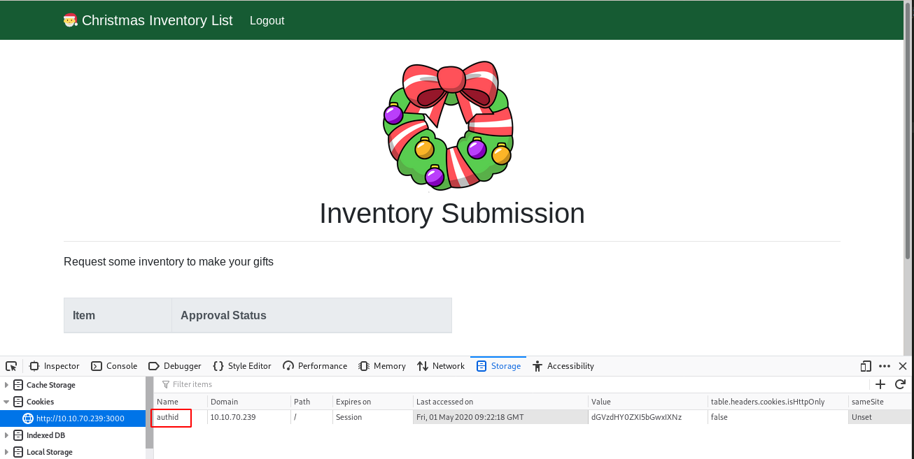
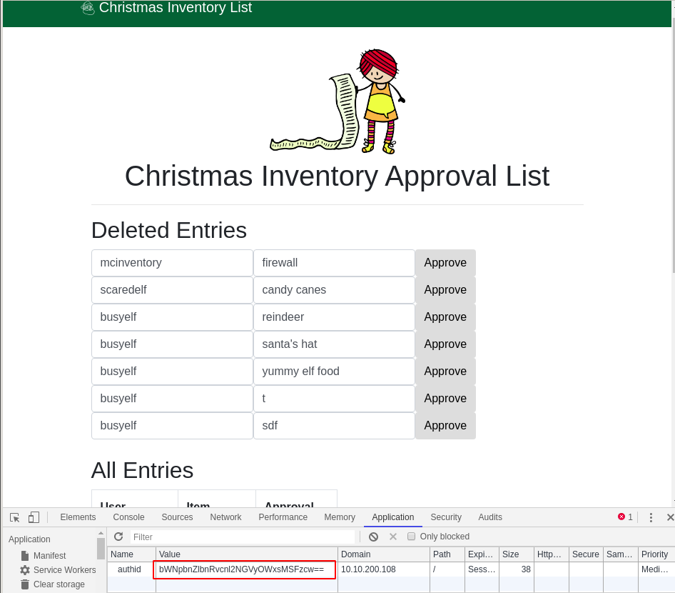

# Day 1 - Inventory Management
Elves needed a way to submit their inventory - have a web page where they submit their requests and the elf mcinventory can look at what others have submitted to approve their requests. It’s a busy time for mcinventory as elves are starting to put in their orders. mcinventory rushes into McElferson’s office.

I don’t know what to do. We need to get inventory going. Elves can log on but I can’t actually authorise people’s requests! How will the rest start manufacturing what they want.  

McElferson calls you to take a look at the website to see if there’s anything you can do to help. Deploy the machine and access the website at `http://<your_machines_ip>:3000` - it can take up to 3 minutes for your machine to boot!

Supporting material for the challenge is [here](https://docs.google.com/document/d/1PHs7uRS1whLY9tgxH1lj-bnEVWtXPXpo45zWUlbknpU/edit?usp=sharing)!

# What is the name of the cookie used for authentication?

* First go to http://10.10.70.239:3000/register and create an account.
* Now login (http://10.10.70.239:3000/login)
* Fire up the developer bar to see the cookies

~~~
authid
~~~

# If you decode the cookie, what is the value of the fixed part of the cookie?

Let's generate a few more accounts and get the value of the `authid`  cookie:

Account | Cookie | Decoded value (base64)
--- | --- | ---
test | dGVzdHY0ZXI5bGwxIXNz | testv4er9ll1!ss
test2 | dGVzdDJ2NGVyOWxsMSFzcw== | test2v4er9ll1!ss
abc | YWJjdjRlcjlsbDEhc3M= | abcv4er9ll1!ss

The common part of these cookies is `v4er9ll1!ss`

# After accessing his account, what did the user mcinventory request?

We notice that the `authid` cookie is concatenating the user account with a static string. It is easy to guess what `mcinventory` authentication cookie will be:

~~~
$ echo -n 'mcinventoryv4er9ll1!ss' | base64
bWNpbnZlbnRvcnl2NGVyOWxsMSFzcw==
~~~

Let's log in with one of the previous accounts we have created, and replace the `authid` cookie value with the one just above.

We can see that mcinventory requested a `firewall`.
