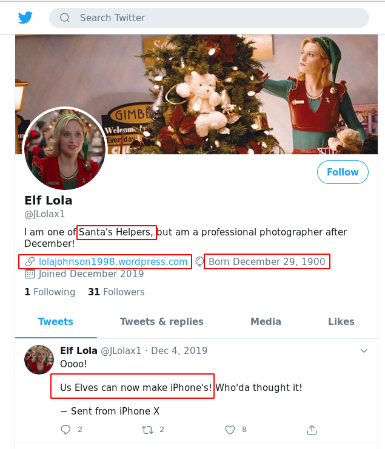
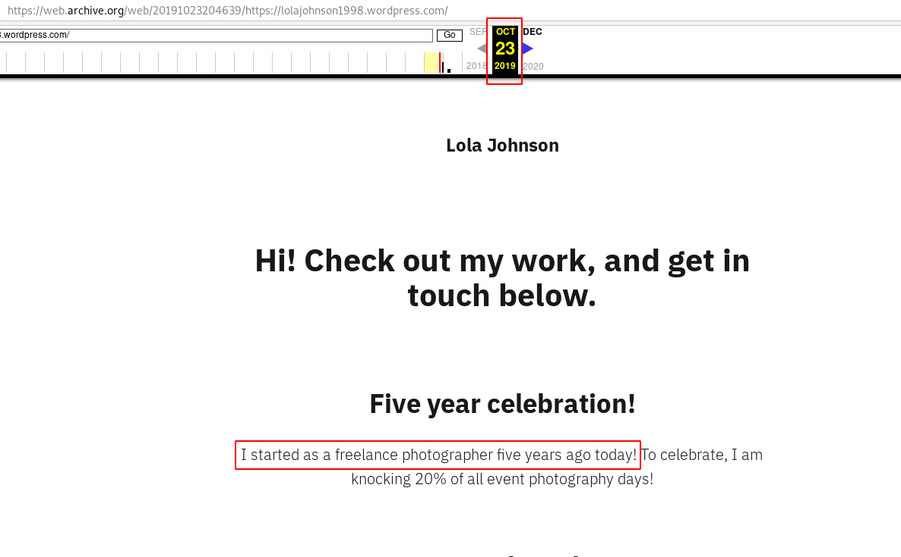

# [Day 5] Ho-Ho-Hosint 05/12/2019

## Description

[Download](files/thegrinch.jpg)

Elf Lola is an elf-of-interest. Has she been helping the Christmas Monster? lets use all available data to find more information about her! We must protect The Best Festival Company!

Resources available [here](https://blog.tryhackme.com/ho-ho/).

## #1 - What is Lola's date of birth? Format: Month Date, Year(e.g November 12, 2019)

`exiftool` reveals that the creator is: `JLolax1`:

~~~
$ ./exiftool thegrinch.jpg 
ExifTool Version Number         : 11.93
File Name                       : thegrinch.jpg
Directory                       : .
File Size                       : 69 kB
File Modification Date/Time     : 2020:05:01 20:16:48+02:00
File Access Date/Time           : 2020:05:01 20:17:04+02:00
File Inode Change Date/Time     : 2020:05:01 20:17:04+02:00
File Permissions                : rw-r--r--
File Type                       : JPEG
File Type Extension             : jpg
MIME Type                       : image/jpeg
JFIF Version                    : 1.01
Resolution Unit                 : None
X Resolution                    : 1
Y Resolution                    : 1
XMP Toolkit                     : Image::ExifTool 10.10
Creator                         : JLolax1
Image Width                     : 642
Image Height                    : 429
Encoding Process                : Progressive DCT, Huffman coding
Bits Per Sample                 : 8
Color Components                : 3
Y Cb Cr Sub Sampling            : YCbCr4:2:0 (2 2)
Image Size                      : 642x429
Megapixels                      : 0.275
~~~

Googling for this name reveals a Twitter account: https://twitter.com/jlolax1

We find the date of birth: `December 29, 1900`

## #2 - What is Lola's current occupation?

Still according to the Twitter page, Lola's current occupation is:
~~~
Answer: Santa's Helpers
~~~

## #3 - What phone does Lola make?

Still according to the Twitter page, Lola makes iPhones:
~~~
Answer: iPhone
~~~

## #4 - What date did Lola first start her photography? Format: dd/mm/yyyy

With the help of the available resource in the instructions, we are using [WayBackMachine](https://archive.org/web/) to search for snapshots of the blog (https://lolajohnson1998.wordpress.com/). We find a first snapshot on Oct 23rd, 2019, which reveals the following statement: `I started as a freelance photographer five years ago today!`:

~~~
Answer: 23/10/2014 
~~~

## #5 - What famous woman does Lola have on her web page?

On her blog, there is a picture of `ada lovelace`:

To know who this person is, use [Google image search engine](https://images.google.com/?gws_rd=ssl) and paste the URL of the image:

It will find related resources:

