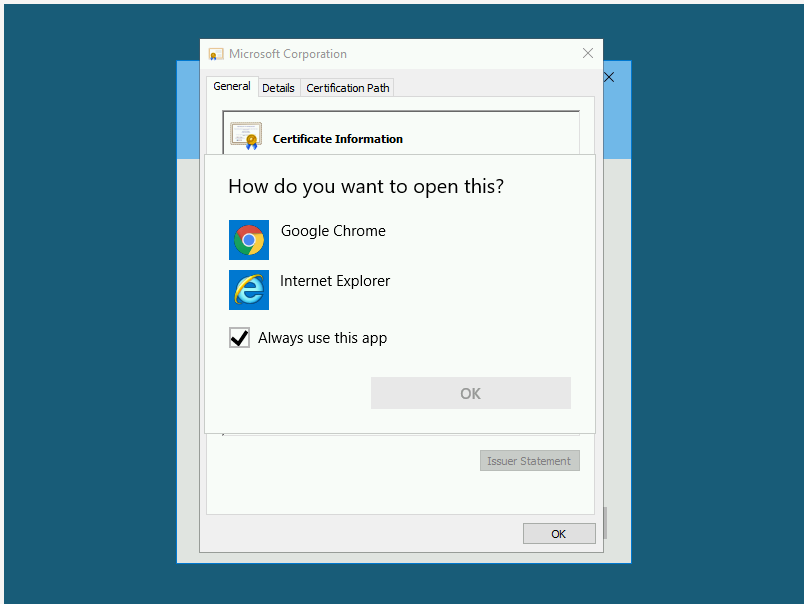
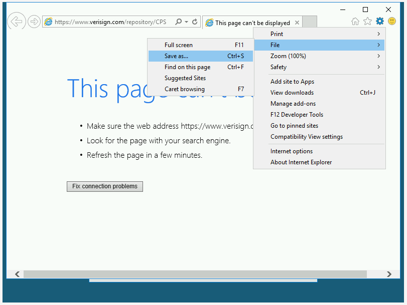
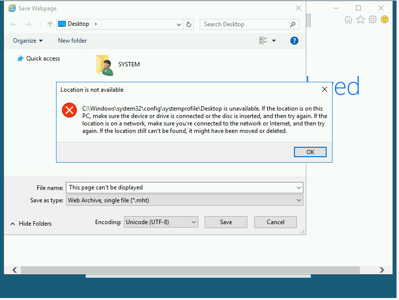
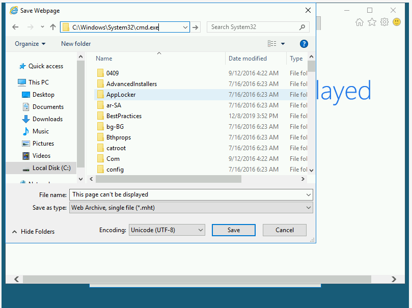
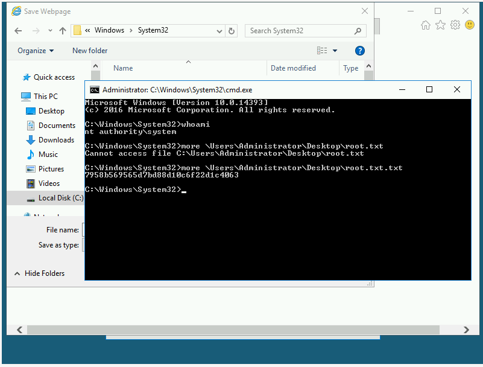

# [Day 13] Accumulate

## Instructions

mcsysadmin has been super excited with their new security role, but wants to learn even more. In an attempt to show their l33t skills, they have found a new box to play with. 

This challenge accumulates all the things you've learnt from the previous challenges(that being said, it may be a little more difficult than the previous challenges). Here's the general way to attempt exploitation when just given an IP address:

* Start out with an NMAP scan to see what services are running
* Enumerate these services and try exploit them
* use these exploited services to get an initial access to the host machine
* enumerate the host machine to elevate privileges

Credit to DarkStar7471 for creating this challenge! Not all tasks will include supporting material!

## #1 - A web server is running on the target. What is the hidden directory which the website lives on?

*Hint: dirbuster 2.3 medium*

The server hosts a IIS web service on standard port `80/tcp`. We also discover a remote desktop service on port `3389/tcp` that we may use later.

~~~
$ sudo nmap -sS -sV -A -Pn 10.10.52.52
[sudo] password for unknown: 

Starting Nmap 7.60 ( https://nmap.org ) at 2020-05-02 12:02 PDT
Nmap scan report for 10.10.52.52
Host is up (0.054s latency).
Not shown: 998 filtered ports
PORT     STATE SERVICE       VERSION
80/tcp   open  http          Microsoft IIS httpd 10.0
| http-methods: 
|_  Potentially risky methods: TRACE
|_http-server-header: Microsoft-IIS/10.0
|_http-title: IIS Windows Server
3389/tcp open  ms-wbt-server Microsoft Terminal Services
| ssl-cert: Subject: commonName=RetroWeb
| Not valid before: 2019-12-07T23:49:24
|_Not valid after:  2020-06-07T23:49:24
|_ssl-date: 2020-05-02T19:03:07+00:00; 0s from scanner time.
Warning: OSScan results may be unreliable because we could not find at least 1 open and 1 closed port
Device type: general purpose
Running (JUST GUESSING): FreeBSD 6.X (85%)
OS CPE: cpe:/o:freebsd:freebsd:6.2
Aggressive OS guesses: FreeBSD 6.2-RELEASE (85%)
No exact OS matches for host (test conditions non-ideal).
Network Distance: 2 hops
Service Info: OS: Windows; CPE: cpe:/o:microsoft:windows

TRACEROUTE (using port 3389/tcp)
HOP RTT      ADDRESS
1   62.27 ms 10.9.0.1
2   60.23 ms 10.10.52.52

OS and Service detection performed. Please report any incorrect results at https://nmap.org/submit/ .
Nmap done: 1 IP address (1 host up) scanned in 25.76 seconds
~~~

We are able to find a hidden directory (`/retro`):

~~~
$ ./gobuster dir -u http://10.10.52.52 -w directory-list-2.3-medium.txt 
===============================================================
Gobuster v3.0.1
by OJ Reeves (@TheColonial) & Christian Mehlmauer (@_FireFart_)
===============================================================
[+] Url:            http://10.10.52.52
[+] Threads:        10
[+] Wordlist:       directory-list-2.3-medium.txt
[+] Status codes:   200,204,301,302,307,401,403
[+] User Agent:     gobuster/3.0.1
[+] Timeout:        10s
===============================================================
2020/05/02 12:05:41 Starting gobuster
===============================================================
/retro (Status: 301)
/Retro (Status: 301)
Progress: 48738 / 220561 (22.10%)^C
[!] Keyboard interrupt detected, terminating.
===============================================================
2020/05/02 12:10:20 Finished
===============================================================
~~~

## #2 - Gain initial access and read the contents of user.txt

*Hint: Don't leave sensitive information out in the open, even if you think you have control over it.*

At the very end of the page (http://10.10.52.52/retro/), we can see that the page is hosted on a Wordpress installation, and we are provided with a link (`Log in`) to the authentication page: http://10.10.52.52/retro/wp-login.php.

Besides, all the posts are signed by `Wade`. This is probably the administrator of this blog.

Clicking on his profile page (http://10.10.52.52/retro/index.php/author/wade/), we see that `Wade` has 6 posts:

Title | Link
--- | ---
Tron Arcade Cabinet | /retro/index.php/2019/12/09/tron-arcade-cabinet/
Zelda Hidden Fan Room | /retro/index.php/2019/12/09/zelda-hidden-fan-room/
Pac-Man Walkthrough | /retro/index.php/2019/12/09/pac-man-walkthrough/
30th Anniversary of PAC-MAN | /retro/index.php/2019/12/09/30th-anniversary-of-pac-man/
Ready Player One | /retro/index.php/2019/12/09/ready-player-one/
Hello world! | /retro/index.php/2019/12/09/hello-world/

One of them (http://10.10.52.52/retro/index.php/2019/12/09/ready-player-one/) is interesting because it contains a comment posted by `Wade himself`:

~~~
 One Comment on “Ready Player One”

    Wade
    December 9, 2019

    Leaving myself a note here just in case I forget how to spell it: parzival
~~~

`parzival` seems to be interesting as it could be a password.

Taking the assumption that `wade` is the administrator and that `parzival` might be his password, I attempted to log in (http://10.10.52.52/retro/wp-login.php) and it worked!

However, there is nothing I could do to answer the question, and decided to focus on the RDP connection.

I connected to the server over RDP using the same credentials and was able to open the `user.txt` file on the desktop:

`Answer: 3b99fbdc6d430bf51c72c651a261927`

## #3 - [Optional] Elevate privileges and read the content of root.txt

*Hint: Figure out what the user last was trying to find out*

### CVE-2019-1388

There is a file in the recycle bin: `hhupd.exe`. Also in Google Chrome, there is a favorite to `CVE-2019-1388`.

Search for both terms in Google and you will quickly land to this page: (https://github.com/jas502n/CVE-2019-1388) that describes the exploit.

### Prerequisites

In order to work, you should first initialize both Internet Explorer and Google Chrome.

### Exploit

Restore the `hhupd.exe` file on the desktop. Right click on it and select `Run as administrator`. From the popup window, click on `Show more details` and then on `Show information about the publisher's certificate`.

You will be provided with a popup window showing the certificate information:

Now, click on the `Verisign Commercial Software Publishers CA` link. You will be prompted to open with Google Chrome or Internet Explorer. Select Internet Explorer.

Save the page as...

You will get the following error message. Click OK.

Now in the URL, enter: `C:\windows\system32\cmd.exe` and press `ENTER`:

It will open a shell with administrator privileges:

Answer: `7958b569565d7bd88d10c6f22d1c4063`
