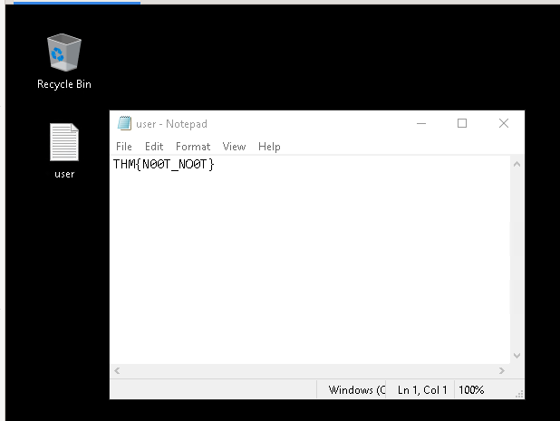
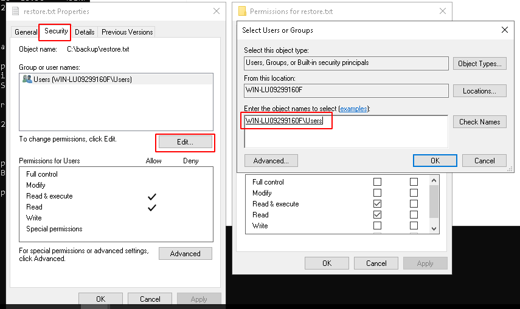
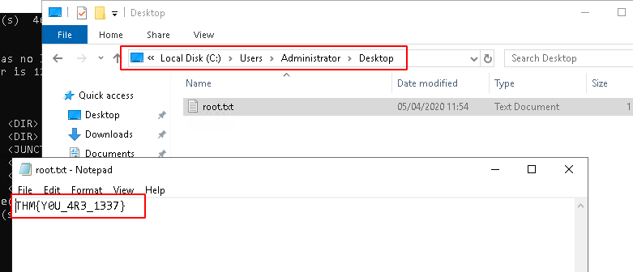

# Anthem

Exploit a Windows machine in this beginner level challenge.

# [Task 1] Website Analysis

This task involves you, paying attention to details and finding the 'keys to the castle'.

This room is designed for beginners, however, everyone is welcomed to try it out!

Enjoy the Anthem.

In this room, you don't need to brute force any login page. Just your preferred browser and Remote Desktop.

Please give the box up to 5 minutes to boot and configure.

## #1 - Let's run nmap and check what ports are open.

~~~
PORT      STATE SERVICE       VERSION
80/tcp    open  http          Microsoft HTTPAPI httpd 2.0 (SSDP/UPnP)
| http-robots.txt: 4 disallowed entries 
|_/bin/ /config/ /umbraco/ /umbraco_client/
|_http-title: Anthem.com - Welcome to our blog
135/tcp   open  msrpc         Microsoft Windows RPC
139/tcp   open  netbios-ssn   Microsoft Windows netbios-ssn
445/tcp   open  microsoft-ds?
3389/tcp  open  ms-wbt-server Microsoft Terminal Services
| rdp-ntlm-info: 
|   Target_Name: WIN-LU09299160F
|   NetBIOS_Domain_Name: WIN-LU09299160F
|   NetBIOS_Computer_Name: WIN-LU09299160F
|   DNS_Domain_Name: WIN-LU09299160F
|   DNS_Computer_Name: WIN-LU09299160F
|   Product_Version: 10.0.17763
|_  System_Time: 2020-06-07T19:14:04+00:00
| ssl-cert: Subject: commonName=WIN-LU09299160F
| Not valid before: 2020-04-04T22:56:38
|_Not valid after:  2020-10-04T22:56:38
|_ssl-date: 2020-06-07T19:14:21+00:00; +1s from scanner time.
5985/tcp  open  http          Microsoft HTTPAPI httpd 2.0 (SSDP/UPnP)
|_http-server-header: Microsoft-HTTPAPI/2.0
|_http-title: Not Found
47001/tcp open  http          Microsoft HTTPAPI httpd 2.0 (SSDP/UPnP)
|_http-server-header: Microsoft-HTTPAPI/2.0
|_http-title: Not Found
49664/tcp open  msrpc         Microsoft Windows RPC
49665/tcp open  msrpc         Microsoft Windows RPC
49666/tcp open  msrpc         Microsoft Windows RPC
49668/tcp open  msrpc         Microsoft Windows RPC
49669/tcp open  msrpc         Microsoft Windows RPC
49670/tcp open  msrpc         Microsoft Windows RPC
49671/tcp open  msrpc         Microsoft Windows RPC
Service Info: OS: Windows; CPE: cpe:/o:microsoft:windows

Host script results:
| smb2-security-mode: 
|   2.02: 
|_    Message signing enabled but not required
| smb2-time: 
|   date: 2020-06-07T19:14:08
|_  start_date: N/A
~~~

## #2 - What port is for the web server?

Answer: `80`

## #3 - What port is for remote desktop service?

Answer: `3389`

## #4 - What is a possible password in one of the pages web crawlers check for?

*Hint: fill in the gap ******.txt*

~~~
$ curl -s http://10.10.77.86/robots.txt
UmbracoIsTheBest!

# Use for all search robots
User-agent: *

# Define the directories not to crawl
Disallow: /bin/
Disallow: /config/
Disallow: /umbraco/
Disallow: /umbraco_client/
~~~

Answer: `UmbracoIsTheBest!`

## #5 - What CMS is the website using?

Answer: `ubmbraco`

## #6 - What is the domain of the website?

~~~
$ curl -s http://10.10.77.86/ | grep -E "<title>(.*)</title>"
    <title>Anthem.com - Welcome to our blog</title>
~~~

Answer: `anthem.com`

## #7 - What's the name of the Administrator

*Hint: Consult the Oracle.(your favourite search engine)*

One of the posts is referring to the admin and there is a poem:

~~~
$ curl -s http://10.10.29.47/archive/a-cheers-to-our-it-department/ | html2text 

#  [ Anthem.com ](/)

##  Welcome to our blog

  * [Categories](/categories)
  * [Tags](/tags)
  * 

# A cheers to our IT department

Tuesday, December 31, 2019

During our hard times our beloved admin managed to save our business by
redesigning the entire website.

As we all around here knows how much I love writing poems I decided to write
one about him:

Born on a Monday,  
Christened on Tuesday,  
Married on Wednesday,  
Took ill on Thursday,  
Grew worse on Friday,  
Died on Saturday,  
Buried on Sunday.  
That was the end…

Share this post

[ __ Twitter ](http://twitter.com/share?text=A cheers to our IT
department&url=http://10.10.29.47/archive/a-cheers-to-our-it-department/) [
__ Facebook
](https://www.facebook.com/sharer/sharer.php?u=http://10.10.29.47/archive/a-cheers-
to-our-it-department/) [ __ Google+
](https://plus.google.com/share?url=http://10.10.29.47/archive/a-cheers-to-
our-it-department/)

Author

####  James Orchard Halliwell

_To enable comments sign up for a[Disqus](http://disqus.com) account and enter
your Disqus shortname in the Articulate node settings. _

Welcome to our blog  (C) 2020 [Anthem.com](/). All rights reserved.
~~~

The poem was written by `Solomon Grundy`.

## #8 - Can we find find the email address of the administrator?

*Hint: There is another email address on the website that should help us figuring out the email pattern used by the administrator.*

One of the posts on the blog discloses an email address:

~~~
$ curl -s http://10.10.29.47/archive/we-are-hiring/ | html2text 

#  [ Anthem.com ](/)

##  Welcome to our blog

  * [Categories](/categories)
  * [Tags](/tags)
  * 

# We are hiring

Monday, January 20, 2020

Hi fellow readers,

We are currently hiring. We are looking for young talented to join a good
cause and keep this community alive!

If you have an interest in being a part of the movement send me your CV at
JD@anthem.com

Share this post

[ __ Twitter ](http://twitter.com/share?text=We are
hiring&url=http://10.10.29.47/archive/we-are-hiring/) [ __ Facebook
](https://www.facebook.com/sharer/sharer.php?u=http://10.10.29.47/archive/we-
are-hiring/) [ __ Google+
](https://plus.google.com/share?url=http://10.10.29.47/archive/we-are-
hiring/)

Author

####  [Jane Doe](/authors/jane-doe/)

Author for Anthem blog

_To enable comments sign up for a[Disqus](http://disqus.com) account and enter
your Disqus shortname in the Articulate node settings. _

Welcome to our blog  (C) 2020 [Anthem.com](/). All rights reserved.
~~~

The author is Jane Doe and the email address is JD@anthem.com.

Based on this pattern, we can guess Solomon Grundy's email address:

Answer: `SG@anthem.com`

# [Task 2] Spot the flags

Our beloved admin left some flags behind that we require to gather before we proceed to the next task..

## #1 - What is flag 1?

*Hint: Have we inspected the pages yet?*

The flag appears in the meta content of the "we-are-hiring" page:

~~~
$ curl -s http://10.10.29.47/archive/we-are-hiring/ | grep THM
<meta content="THM{L0L_WH0_US3S_M3T4}" property="og:description" />
        <input type="text" name="term" placeholder="Search... 								THM{G!T_G00D}" />
~~~

Flag1: `THM{L0L_WH0_US3S_M3T4}`

## #2 - What is flag 2?

*Hint: Search for it*

The flag appears in the source code of the main page:

~~~
 curl -s http://10.10.29.47/ | grep THM
        <input type="text" name="term" placeholder="Search... 								THM{G!T_G00D}" />
~~~

Flag1: `THM{G!T_G00D}`

## #3 - What is flag 3?

*Hint: Profile*

The flag appears on Jane Doe's profile page:

~~~
$ curl -s http://10.10.77.86/authors/jane-doe/ | grep -o "THM{.*}"
THM{G!T_G00D}
THM{L0L_WH0_D15}">THM{L0L_WH0_D15}
~~~

Flag3: `THM{L0L_WH0_D15}`

## #4 - What is flag 4?

*Hint: Have we inspected all the pages yet?*

The flag appears in the meta content of the "a-cheers-to-our-it-department" page:

~~~
$ curl -s http://10.10.29.47/archive/a-cheers-to-our-it-department/ | grep THM
<meta content="THM{AN0TH3R_M3TA}" property="og:description" />
        <input type="text" name="term" placeholder="Search... 								THM{G!T_G00D}" />
~~~

Flag4: `THM{AN0TH3R_M3TA}`

# [Task 3] Final stage

Let's get into the box using the intel we gathered.

## #1 - Let's figure out the username and password to log in to the box.(The box is not on a domain)

You can connect to http://10.10.29.47/umbraco/ using the information found previously:
* username: SG@anthem.com
* password: UmbracoIsTheBest!

## #2 - Gain initial access to the machine, what is the contents of user.txt?

Now, let's try to connect via RDP with:
* username: SG
* password: UmbracoIsTheBest!

User flag: `THM{N00T_NO0T}`

## #3 - Can we spot the admin password?

*Hint: It is hidden.*

There is a hidden `backup` directory on the `C:\` drive, that contains a file named `restor.txt`. Give it permissions:

~~~
C:\>dir /a:hd
 Volume in drive C has no label.
 Volume Serial Number is 1225-5238

 Directory of C:\

15/09/2018  08:19    <DIR>          $Recycle.Bin
05/04/2020  23:42    <DIR>          backup
05/04/2020  10:56    <JUNCTION>     Documents and Settings [C:\Users]
05/04/2020  14:46    <DIR>          ProgramData
05/04/2020  10:56    <DIR>          Recovery
05/04/2020  10:55    <DIR>          System Volume Information
               0 File(s)              0 bytes
               6 Dir(s)  46,857,580,544 bytes free

C:\>cd backup

C:\backup>dir
 Volume in drive C has no label.
 Volume Serial Number is 1225-5238

 Directory of C:\backup

05/04/2020  23:42                21 restore.txt
               1 File(s)             21 bytes
               0 Dir(s)  46,857,580,544 bytes free

C:\backup>more restore.txt
ChangeMeBaby1MoreTime

C:\backup>
~~~

Answer: `ChangeMeBaby1MoreTime`

## #4 - Escalate your privileges to root, what is the contents of root.txt?

Root flag: `THM{Y0U_4R3_1337}`