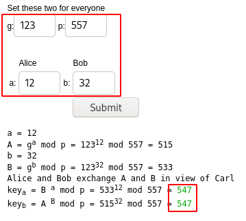
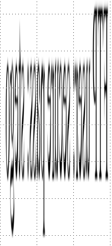

# [Task 3] Stage 3

Stage 3 is ready to be hacked now. Deploy the machine and start capturing the flag. Please terminate the previous VM before deploying a new one. The theme for this stage is Apache2.

**Prerequisite: Complete stage 2 and obtain the port sequence. Use the sequence to activate the ports in the port 9999**

Here are some of the tips:

1. You are going need a network scanning tool (Nmap) Just do a fast scan with ping skip (nmap -Pn -p- -v -T5).
2. Bust the directory
3. The recursive search or bust is the way to solve the challenge
4. Hints for the wordlists: common.txt (dirb), big.txt (dirb), medium-lower-case (dirbuster)
5. Look out! It is a shark!
6. Stay calm and have fun

Refer to the hints if you are stuck or DM me in my discord channel if you are really stuck. Once again, good luck with the challenge. 

Note: ~~Stage 4 challenge will be released on 28/10/2019, UTC time~~. Stage 4 is now ready!

# #1 - Flag 34

*Hint: Something seem off on the index page.*

Let's start by unlocking the port, as we used to do for the 2 previous stages. Connect to port 9999 and enter the last sequence found at stage 2:

~~~
$ nc 10.10.99.53 9999
***************************
*   Port knocking input   *
***************************
Hi user, please enter the port sequence
The format is (can be more than 4): PORT PORT PORT PORT
> 31330 51960 61111 10101 32212
Something happen
Good luck!
~~~

Without real surprise (we are told this stage is about Apache2), port 80 is now open:

~~~
PORT     STATE SERVICE
80/tcp   open  http
9999/tcp open  abyss
~~~

Let's visit the website. We can see a default Apache welcome page. At first sight, apart from the missing `/icons` directory which leads to the absence of the Ubuntu icon, the page looks like the genuine one. But as we are told it's been modified, let's read it. Ah, the flag is written in it:

~~~
$ curl -s http://10.10.99.53/index.html | grep -i flag
                applications). You know that the flag 34 is 8thx2yafbrsj9252xycr If your site is using a web document root
~~~

Flag 34: `8thx2yafbrsj9252xycr`

# #2 - Flag 35

There is no `/robots.txt` file, let's do a dirsearch scan.

As we are told to use several lists, a good idea is to combine all in one big file:

~~~
root@kali:/data# cd /usr/share/wordlists/
root@kali:/usr/share/wordlists# cat dirb/common.txt dirb/big.txt dirbuster/directory-list-lowercase-2.3-medium.txt | sort -u > /data/big.txt
~~~

Now, we can do our scan. I like to use dirsearch.

~~~
$ dirsearch -u http://10.10.99.53 -E -w /data/big.txt
~~~

3 directories found:
* `/feardead/`
* `/keealive/`
* `/webadmin/`

The `/webadmin/` directory contains flag #35.

~~~
$ curl -s http://10.10.99.53/webadmin/
<p>Good job on busting this directory</p>
<p>Enjoy the free flag</p>
<p>flag 35: emu387km6a67qf537rwb</p>
<!-- There are something down here --> 
~~~

Flag 35: `emu387km6a67qf537rwb`

# #3 - Flag 36

The `/feardead/` directory contains flag #36.

~~~
$ curl -s http://10.10.99.53/feardead/
<p>Always use multiple wordlists</p>
<p>Do not fear dead, it just a part of process. Just enjoy your life>/p>
<p>flag 36: xdvnb27v6qsv27tdj8f6</p>
<!-- Something is buried inside this directory, can you dig it up? --> 
~~~

Flag 36: `xdvnb27v6qsv27tdj8f6`

# #4 - Flag 37

*Hint: Recursive enumerate*

~~~
$ curl -s http://10.10.99.53/webadmin/hidden/
<p>Always perform a recursive search</p>
<p>Easy huh?</p>
<p>flag 37: y9rwqgrvy2eds3h4caeb</p>
<p>-----------------------------</p>
<p>End of the line, none shall cross this border</p>
~~~

Flag 37: `y9rwqgrvy2eds3h4caeb`

# #5 - Flag 38

*Hint: Is this a genuine 404?*

Keeping doing recursive scan reveals `/webadmin/hidden/virtualserver/`. Visiting the page shows a 404 error page that has been manually written (the host is wrong as it is for the `capturetheflag.com` domain). The flag appears as comment at the end of the page.

~~~
$ curl -s http://10.10.99.53/webadmin/hidden/virtualserver/ 
<!DOCTYPE HTML PUBLIC "-//IETF//DTD HTML 2.0//EN">
<html><head>
<title>404 Not Found</title>
</head><body>
<h1>Not Found</h1>
<p>The requested URL was not found on this server.</p>
<hr>
<address>Apache/2.4.29 (Ubuntu) Server at CaptureTheFlag.com Port 80</address>
</body></html>
<!-- flag 38: 4f57pmqe56ct9zthg84n -->
~~~

Flag 38: `4f57pmqe56ct9zthg84n`

# #6 - Flag 39

*Hint: The secret key is a directory*

~~~
$ curl -s http://10.10.99.53/keepalive/
<p>Good work here! You found another directory</p>
<p>Living is great, don't ya think?</p>
<p>flag 39: mkrk2s4jykdv5h6jz9by</p>
<!-- Solve this DH and reveal another flag -->
<!-- g: 123
     p: 557
     a: 12
     b: 32 
-->
~~~

DH refers to Diffie-Hellman (https://www.irongeek.com/diffie-hellman.php?). Entering the values for g, p, a and b outputs `547`. Maybe a subdirectory?



Flag 39: `mkrk2s4jykdv5h6jz9by`

# #7 - Flag 40

*Hint: Keep recursive on DH directory*

~~~
$ curl -s http://10.10.99.53/keepalive/547/
<p>Just a simple key-exchange<p>
<p>Good job there</p>
<p> Submit 40 and get the flag<p>
<form action="" method="POST">
<input type="hidden" name="val" value="0"/>
<input type="submit" name="submit"/>
</form>
~~~

~~~
root@kali:~# curl -d "val=40&submit=Submit+Query" -X POST http://10.10.99.53/keepalive/547/index.php

<p>Just a simple key-exchange<p>
<p>Good job there</p>
<p> Submit 40 and get the flag<p>
<form action="" method="POST">
<input type="hidden" name="val" value="0"/>
<input type="submit" name="submit"/>
</form>
flag 40: 2en98pkv2w6caw4dbpg6 
~~~

Flag 40: `2en98pkv2w6caw4dbpg6`

# #8 - Flag 41

*Hint: Virtual host*

Virtual host? Remember the domain we found in the 404 error page at question #5?

The problem here is that the domain `capturetheflag.com` already exists and is registered to another website:

~~~
$ nslookup capturetheflag.com
Server:		192.168.1.4
Address:	192.168.1.4#53

Non-authoritative answer:
Name:	capturetheflag.com
Address: 23.236.62.147
~~~

If we want to make the server think we are requesting this domain, but still point to our target, we have to create a manual entry in our `hosts` file.

~~~
$ echo "10.10.99.53 capturetheflag.com" >> /etc/hosts
$ curl -s http://capturetheflag.com
<p>Finally, you found my secret server</p>
<p>Take it, you are well deserve</p>
<p>flag 41: r8r6b623zg6teg8h59gh</p>
~~~

Flag 41: `r8r6b623zg6teg8h59gh`.

# #9 - Flag 42

*Hint: Hidden robot*

Hidden files are prefixed with a dot. Let's check if '.robots.txt' exists on the virtualhost found:

~~~
$ curl -s http://capturetheflag.com/.robots.txt
disallow:*

/
/This
/is 
/BS
/flag42_66kvh828uy5jmzz6bpw4
~~~

Flag42: `66kvh828uy5jmzz6bpw4`

# #10 - Flag 43

Now that we know there is a virtualhost, let's scan it with dirsearch.

~~~
$ ./dirsearch.py -u http://capturetheflag.com/ -E -w /data/big.txt 

 _|. _ _  _  _  _ _|_    v0.3.9
(_||| _) (/_(_|| (_| )

Extensions: php, asp, aspx, jsp, js, html, do, action | HTTP method: get | Threads: 10 | Wordlist size: 216748

Error Log: /data/dirsearch/logs/errors-20-05-24_12-06-40.log

Target: http://capturetheflag.com/

[12:06:40] Starting: 
[12:06:40] 200 -  117B  - /
[12:09:28] 403 -  290B  - /.hta
[12:09:35] 200 -  117B  - /index.html
[12:10:38] 403 -  299B  - /server-status
[12:10:39] 301 -  324B  - /shark  ->  http://capturetheflag.com/shark/
[12:11:20] 301 -  327B  - /wireless  ->  http://capturetheflag.com/wireless/

Task Completed
~~~

We have discovered 2 directories: `/wireless/` and `/shark/`. Let's start with `/wireless/`:

~~~
# curl -s http://capturetheflag.com/wireless/
<p>How good is your bases?</p>
Zz2/%kdB.6[uX+$MhX6F6u.:43WRTO^Vc!b:.p/5mQ"`/Btbs`mZ14bBKO5|@EUcX)2//fyiUQft#a9eiUxISodBi82O8vajJ}W/r;:u13nOg,PUJgyD!pj#v8+[WCfdQ=fGL*d5UNg7Km]PVGKFx=?tTG~M?]8L@|ig?*^X]5i/GZPVul5.i;=*o3%qFQrUFMx2`tM{cO`_hZsa6/_,n#]@RG3V|6shgaab!(pzIH24OOHSA,qI&weupL`I>NrO6]Oc/f{Y43lHCNxV4|AzGrg{s4t"){y5c"86E2w"7jJH$BWlOh4Ah.zjT?^yKym:]z!8Cy=Og!fe!(aMSzR3jjCZ"Z),ijcSq%?ki[,aqtcFp9*Rn3N*:O8Wm?PJL
~~~

Use dcode.fr and CyberChef to decode this string, encoded with all bases we have played with in the previous stage (base91 > base85 > base64 > base58 > base32 > hex > ascii).

The decoded message reveals the flag.

Flag43: `tshpxazvl2yc9rh0nv07`

# #11 - Flag 44

*Hint: The decoded text contains word "flag"*

Now, let's check what we have in the `shark` directory:

~~~
$ curl -s http://capturetheflag.com/shark/
<p>The text has been encoded by base64 for N times</p>
<p>Did you said how many time? IDK</p>
<p>Either manual or auto decode, both work</p>
<a href="b64.txt">Download now (Not a malware)</a>
~~~

Download the b64.txt file:

~~~
$ wget http://capturetheflag.com/shark/b64.txt
~~~

I wrote a python script to decode the file, as it is encoded multiple times with base64.

```python
#!/usr/bin/env python3

import sys
import base64

if len(sys.argv) < 2:
	print("Usage: {} <file.b64.txt>".format(sys.argv[0]))
	sys.exit(1)

data = open(sys.argv[1], "r").read()

while True:
	try:
		data = base64.b64decode(data)
	except:
		break

print(data)
```

Here is the output:

~~~
$ python3 decode_nested_b64.py b64.txt 
b'flag 44: ygm2my89uqzirzj0nojw'
~~~

Flag 44: `ygm2my89uqzirzj0nojw`

# #12 - Flag 45

*Hint: Combination of two directory name reveal the path*

As we have discovered 2 directories so far, there are only 2 combinations possible. `sharkwireless` does not exist, but `wirelessshark/` is interesting:

~~~
$ curl -s http://capturetheflag.com/wirelessshark/
<p>Spoofing,spoofing,spooky</p>
<p>flag 45: amlq1gpoq776am3t9lz0</p>
<a href=wire.pcap></a>
$ wget http://capturetheflag.com/wirelessshark/wire.pcap
~~~

The analysis of the PCAP file reveals several hints that we will detail later, at question #15.

Flag 45: `amlq1gpoq776am3t9lz0`

# #13 - Flag 46

*Hint: Sorry, I did an oopsie, the flag is 五零七九三七八五八七一二二零四八九零六八*

Recursive search inside `/feardead/` reveals the existence of a `ftp` subdirectory.

~~~
$ curl -s http://10.10.99.53/feardead/ftp/
<p>Can you solve this?</p>
<p>flag 46: 五零七九三七八五八七一二二零四八九零六八</p>
<a href=what.png></a>
~~~

It comes with the following picture (`what.png`) that we will use for the next question.



Back to this strange code, we follow the hint and translate the Chinese characters to Engligh using Google translate:

~~~
Five zero seven nine three seven eight five eight seven one two two zero four eight nine zero six eight
~~~

Flag 46: `50793785871220489068`

# #14 - The login credential for next challenge. Format in username:password

*Hint: You need to squeeze the image.*

Unstretch the image and flip it horizontally (you can easily do it with Gimp).


Answer: `secure:stego`

# #15 - Port to stage 4. Format: PORT PORT PORT....

Time to go back to the `wire.pcap` capture file found at question #12.

The FTP traffic reveals the flag47 of the next stage (stage 4). We can already validate this flag.

~~~
220 Catch this flag 47: 3pe7b2sgvhhvh6cdemvr
USER anonymous
331 Please specify the password.
PASS mozilla@example.com
530 Login incorrect.
~~~

But also the beginning of the capture (frames 2 to 6) is a sequence for the port knocking:

~~~
$ tshark -r wire.pcap 'frame.number in { 2..6 }'
    2   1.021270 192.168.247.129 → 192.168.247.138 TCP 74 58240 → 7777 [SYN] Seq=0 Win=29200 Len=0 MSS=1460 SACK_PERM=1 TSval=4091813851 TSecr=0 WS=128
    3   1.022309 192.168.247.129 → 192.168.247.138 TCP 74 60672 → 8888 [SYN] Seq=0 Win=29200 Len=0 MSS=1460 SACK_PERM=1 TSval=4091813852 TSecr=0 WS=128
    4   1.022787 192.168.247.129 → 192.168.247.138 TCP 74 49730 → 6666 [SYN] Seq=0 Win=29200 Len=0 MSS=1460 SACK_PERM=1 TSval=4091813853 TSecr=0 WS=128
    5   1.023289 192.168.247.129 → 192.168.247.138 TCP 74 33532 → 5555 [SYN] Seq=0 Win=29200 Len=0 MSS=1460 SACK_PERM=1 TSval=4091813853 TSecr=0 WS=128
    6   1.023801 192.168.247.129 → 192.168.247.138 TCP 74 41894 → 9999 [SYN] Seq=0 Win=29200 Len=0 MSS=1460 SACK_PERM=1 TSval=4091813854 TSecr=0 WS=128
~~~

Answer: `7777 8888 6666 5555 9999`

Don't forget to remove the line you have added to the `/etc/hosts` file.