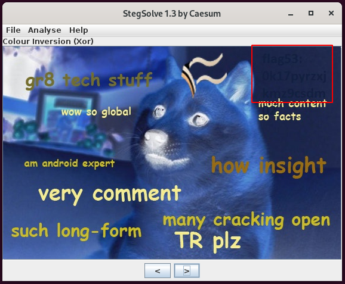
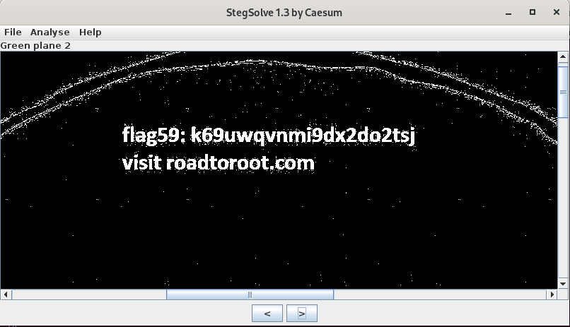
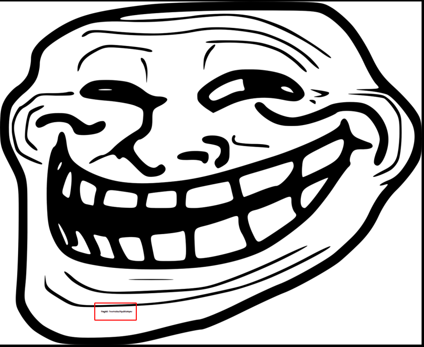

# [Task 4] Stage 4

Stage 4 is ready to be analyzed. Deploy the machine and start capturing the flag. Please terminate the previous VM before deploying a new one. The theme for this stage is steganography and FTP.

**Prerequisite: Complete stage 3 and obtain the port sequence. Use the sequence to activate the ports in the port 9999**

Here are some of the tips:

1. You are going to need a network scanning tool (Nmap). Just do a fast scan with ping skip (`nmap -Pn -p- -v -T5`).
2. Download all the image files
3. Stuck with the stego? Visit this site: https://0xrick.github.io/lists/stego/
4. Think out of the box
5. Stay calm and have fun

Refer to the hints if you are stuck or DM me in my discord channel if you are really stuck. Once again, good luck with the challenge. 

Note: ~~Stage 5 challenge will be released on 4/11/2019, UTC time~~. Stage 5 is now ready!

# #1 - Flag 47

As for the previous stages, let's connect to port 9999 and unlock the hidden port with the right sequence found at stage #3.

~~~
$ nc 10.10.225.96 9999
***************************
*   Port knocking input   *
***************************
Hi user, please enter the port sequence
The format is (can be more than 4): PORT PORT PORT PORT
> 7777 8888 6666 5555 9999
Something happen
Good luck!
~~~

Now, let's scan our target. 2 ports are now open:

~~~
PORT     STATE SERVICE
21/tcp   open  ftp
9999/tcp open  abyss
~~~

We already solved Flag 47 in the previous stage with the FTP traffic found in the network traffic capture file (`wire.pcap`)

Flag 47: `3pe7b2sgvhhvh6cdemvr`

# #2 - Flag 48

*Hint: steghide*

Connect to the target via FTP, using the credentials found at the previous stage (`secure:stego`).

~~~
$ ftp 10.10.225.96
Connected to 10.10.134.119 (10.10.134.119).
220 Catch this flag 47: 3pe7b2sgvhhvh6cdemvr
Name (10.10.134.119:unknown): secure
331 Please specify the password.
Password:
230 Login successful.
Remote system type is UNIX.
Using binary mode to transfer files.
ftp> ls
227 Entering Passive Mode (10,10,134,119,154,126).
~~~

After some research, I found that disabling the passive mode helps.

~~~
ftp> passive
Passive mode off.
ftp> ls -la
200 PORT command successful. Consider using PASV.
150 Here comes the directory listing.
drwxrwxr-x    2 0        0            4096 Oct 07  2019 .
drwxrwxr-x    2 0        0            4096 Oct 07  2019 ..
-rw-r--r--    1 0        0              60 Oct 07  2019 .hidden.txt
-rw-r--r--    1 0        0           74262 Oct 07  2019 1.jpg
-rw-r--r--    1 0        0          232117 Oct 07  2019 2.jpg
-rw-r--r--    1 0        0           82399 Oct 07  2019 3.jpg
-rw-r--r--    1 0        0          823086 Oct 07  2019 4.jpg
-rw-r--r--    1 0        0          199461 Oct 07  2019 5.png
-rw-r--r--    1 0        0           69595 Oct 07  2019 6.jpg
226 Directory send OK.
~~~

Download all the files, including the hidden file.

Now, let's analyze `1.jpg`. Use steghide as suggested by the hint, with an empty passphrase:

~~~
$ steghide extract -sf 1.jpg 
Enter passphrase: 
wrote extracted data to "flag48".
$ cat flag48 
easy

flag48: mu518qgfty4w5ks1l32a
~~~

Flag48: `mu518qgfty4w5ks1l32a`

# #3 - Flag 49

*Hint: meta data*

~~~
$ /data/src/exiftool-11.93/exiftool 2.jpg 
ExifTool Version Number         : 11.93
File Name                       : 2.jpg
Directory                       : .
File Size                       : 227 kB
File Modification Date/Time     : 2020:05:24 19:20:45+02:00
File Access Date/Time           : 2020:05:24 19:20:45+02:00
File Inode Change Date/Time     : 2020:05:24 19:20:45+02:00
File Permissions                : rw-rw-r--
File Type                       : JPEG
File Type Extension             : jpg
MIME Type                       : image/jpeg
JFIF Version                    : 1.01
Exif Byte Order                 : Big-endian (Motorola, MM)
X Resolution                    : 96
Y Resolution                    : 96
Resolution Unit                 : inches
Software                        : paint.net 4.1.6
Label                           : flag 49 is ykepg5t6kyr5994g969v
Image Width                     : 1095
Image Height                    : 616
Encoding Process                : Baseline DCT, Huffman coding
Bits Per Sample                 : 8
Color Components                : 3
Y Cb Cr Sub Sampling            : YCbCr4:2:0 (2 2)
Image Size                      : 1095x616
Megapixels                      : 0.675
~~~

Flag 49: `ykepg5t6kyr5994g969v`

# #4 - Flag 50

*Hint: crack the steg*

~~~
$ stegcracker 3.jpg /data/src/wordlists/rockyou.txt 
StegCracker 2.0.8 - (https://github.com/Paradoxis/StegCracker)
Copyright (c) 2020 - Luke Paris (Paradoxis)

Counting lines in wordlist..
Attacking file '3.jpg' with wordlist '/data/src/wordlists/rockyou.txt'..
Successfully cracked file with password: smokeweed420id
Tried 167471 passwords
Your file has been written to: 3.jpg.out
smokeweed420
$ cat 3.jpg.out 
cracking is not a good idea

flag50: ssq24hawd56betl8g60y
~~~

Flag 50: `ssq24hawd56betl8g60y`

# #5 - Flag 51

*Hint: Walk the bin*

~~~
$ binwalk -e 4.jpg 

DECIMAL       HEXADECIMAL     DESCRIPTION
--------------------------------------------------------------------------------
0             0x0             JPEG image data, JFIF standard 1.02

WARNING: Extractor.execute failed to run external extractor 'jar xvf '%e'': [Errno 2] No such file or directory: 'jar', 'jar xvf '%e'' might not be installed correctly
17054         0x429E          Zip archive data, at least v2.0 to extract, name: Moreflag/
17093         0x42C5          Zip archive data, encrypted compressed size: 507312, uncompressed size: 547520, name: Moreflag/10.jpg
524461        0x800AD         Zip archive data, encrypted compressed size: 184788, uncompressed size: 195725, name: Moreflag/11.png
709305        0xAD2B9         Zip archive data, encrypted compressed size: 4525, uncompressed size: 5167, name: Moreflag/8.png
713885        0xAE49D         Zip archive data, encrypted compressed size: 108324, uncompressed size: 108556, name: Moreflag/9.jpg
822264        0xC8BF8         Zip archive data, encrypted compressed size: 49, uncompressed size: 29, name: Moreflag/secret.zip
823006        0xC8EDE         End of Zip archive, footer length: 22
~~~

The zip archive (`429E.zip`) is password protected. Let's cracks it:

~~~
$ zip2john 429E.zip > zip.hash
$ john zip.hash 
Using default input encoding: UTF-8
Loaded 5 password hashes with 5 different salts (ZIP, WinZip [PBKDF2-SHA1 256/256 AVX2 8x])
Will run 8 OpenMP threads
Proceeding with single, rules:Single
Press 'q' or Ctrl-C to abort, almost any other key for status
Almost done: Processing the remaining buffered candidate passwords, if any.
Proceeding with wordlist:/data/src/john/run/password.lst
sonic            (429E.zip/Moreflag/8.png)
sonic            (429E.zip/Moreflag/10.jpg)
sonic            (429E.zip/Moreflag/secret.zip)
sonic            (429E.zip/Moreflag/9.jpg)
sonic            (429E.zip/Moreflag/11.png)
5g 0:00:00:02 DONE 2/3 (2020-05-24 20:34) 1.831g/s 61983p/s 85995c/s 85995C/s 123456..faithfaith
Use the "--show" option to display all of the cracked passwords reliably
Session completed. 
~~~

The password is `sonic`. Let's unzip the files:

~~~
$ 7z x 429E.zip
$ ls -l MoreFlag/
total 848
-rwxrw-r--. 1 unknown unknown 547520 Oct  4  2019 10.jpg
-rwxrw-r--. 1 unknown unknown 195725 Oct  4  2019 11.png
-rwxrw-r--. 1 unknown unknown   5167 Oct  4  2019 8.png
-rwxrw-r--. 1 unknown unknown 108556 Oct  4  2019 9.jpg
-rw-r--r--. 1 unknown unknown     29 Oct  4  2019 secret.zip
~~~

Unable to open most of the images, let's check the "real" file type:

~~~
$ file *
10.jpg:     JPEG image data, Exif standard: [TIFF image data, little-endian, direntries=3, xresolution=50, yresolution=58, resolutionunit=3], baseline, precision 8, 2504x1408, components 3
11.png:     PNG image data, 1327 x 1080, 8-bit/color RGBA, non-interlaced
8.png:      data
9.jpg:      JPEG image data, JFIF standard 1.01, resolution (DPI), density 72x72, segment length 16, progressive, precision 8, 680x655, components 3
secret.zip: ASCII text
~~~

* `secret.zip`: go to flag 56
* `8.png`: go to flag 57
* `9.jpg`: go to flag 58
* `10.jpg`: go to flag 59
* `11.png`: go to flag 60

For flag51, that was as simple as that:

~~~
$ strings 4.jpg | grep flag51 | uniq 
flag51: ifrcflfwxknps2uqq68n
~~~

Notice that submitting `6.png` to https://futureboy.us/stegano/decode.pl will also reveal this flag

Flag 51: `ifrcflfwxknps2uqq68n`

# #6 - Flag 52

*Hint: Color? hidden? zsteg?*

Upload `5.png` to https://stylesuxx.github.io/steganography/:

Flag 52: `ocjydmk3cnmhc7q5d3e9`

# #7 - Flag 53

*Hint: Play around with the color*

Flag53: `0k17pyrzxjkmz9csdm02`

# #8 - Flag 54

*Hint: I forgotten the file. Flag 54 is unsolvable.*

Nothing to do here.

# #9 - Flag 55

*Hint: Some hidden stuff*

There is a hidden file on the FTP server:

~~~
ftp> ls -la
200 PORT command successful. Consider using PASV.
150 Here comes the directory listing.
drwxrwxr-x    2 0        0            4096 Oct 07  2019 .
drwxrwxr-x    2 0        0            4096 Oct 07  2019 ..
-rw-r--r--    1 0        0              60 Oct 07  2019 .hidden.txt
-rw-r--r--    1 0        0           74262 Oct 07  2019 1.jpg
-rw-r--r--    1 0        0          232117 Oct 07  2019 2.jpg
-rw-r--r--    1 0        0           82399 Oct 07  2019 3.jpg
-rw-r--r--    1 0        0          823086 Oct 07  2019 4.jpg
-rw-r--r--    1 0        0          199461 Oct 07  2019 5.png
-rw-r--r--    1 0        0           69595 Oct 07  2019 6.jpg
226 Directory send OK.
ftp> get .hidden.txt
local: .hidden.txt remote: .hidden.txt
200 PORT command successful. Consider using PASV.
150 Opening BINARY mode data connection for .hidden.txt (60 bytes).
226 Transfer complete.
60 bytes received in 0.00021 secs (285.71 Kbytes/sec)
~~~

Now, let's check the content:

~~~
$ cat .hidden.txt 
Always check with hidden file

flag55: f1ajbsx2s8rttikxm6pm
~~~

Flag55: `f1ajbsx2s8rttikxm6pm`

# #10 - Flag 56

Flag 56 is actually available from the extracted content of challenge #5. The `secret.zip` file is a fake zip archive, it's actually ASCII:

~~~
$ file secret.zip 
secret.zip: ASCII text
$ cat secret.zip 
flag56: q3tffo9kppkl6dsh16yv
~~~

Flag 56: `q3tffo9kppkl6dsh16yv`

# #11 - Flag 57

*Hint: Fix the PNG*

`8.png` claims to be a PNG while it's detected as data. As shown below, the PNG header is missing:

~~~
$ xxd 8.png | head
00000000: 0000 0000 0d0a 1a0a 0000 000d 4948 4452  ............IHDR
00000010: 0000 02d0 0000 015e 0800 0000 0089 6e77  .......^......nw
00000020: 7500 0000 0970 4859 7300 000e f300 000e  u....pHYs.......
00000030: f301 1c53 993a 0000 0011 7445 5874 5469  ...S.:....tEXtTi
00000040: 746c 6500 5044 4620 4372 6561 746f 7241  tle.PDF CreatorA
00000050: 5ebc 2800 0000 1374 4558 7441 7574 686f  ^.(....tEXtAutho
00000060: 7200 5044 4620 546f 6f6c 7320 4147 1bcf  r.PDF Tools AG..
00000070: 7730 0000 002d 7a54 5874 4465 7363 7269  w0...-zTXtDescri
00000080: 7074 696f 6e00 0008 99cb 2829 29b0 d2d7  ption.....())...
00000090: 2f2f 2fd7 2b48 49d3 2dc9 cfcf 29d6 4bce  ///.+HI.-...).K.
~~~

Let's fix it.

~~~
$ printf '\x89\x50\x4e\x47' | dd conv=notrunc of=8.png bs=1
4+0 records in
4+0 records out
4 bytes copied, 0.000119739 s, 33.4 kB/s
$ xxd 8.png | head
00000000: 8950 4e47 0d0a 1a0a 0000 000d 4948 4452  .PNG........IHDR
00000010: 0000 02d0 0000 015e 0800 0000 0089 6e77  .......^......nw
00000020: 7500 0000 0970 4859 7300 000e f300 000e  u....pHYs.......
00000030: f301 1c53 993a 0000 0011 7445 5874 5469  ...S.:....tEXtTi
00000040: 746c 6500 5044 4620 4372 6561 746f 7241  tle.PDF CreatorA
00000050: 5ebc 2800 0000 1374 4558 7441 7574 686f  ^.(....tEXtAutho
00000060: 7200 5044 4620 546f 6f6c 7320 4147 1bcf  r.PDF Tools AG..
00000070: 7730 0000 002d 7a54 5874 4465 7363 7269  w0...-zTXtDescri
00000080: 7074 696f 6e00 0008 99cb 2829 29b0 d2d7  ption.....())...
00000090: 2f2f 2fd7 2b48 49d3 2dc9 cfcf 29d6 4bce  ///.+HI.-...).K.
~~~

Open the image to see the flag:

Flag 57: `pf3omblffojm6aiy54mg`

# #12 - Flag 58

*Hint: Strings*

~~~
$ strings -n 10 9.jpg 
'9=82<.342
!22222222222222222222222222222222222222222222222222
CU<UB .WTAPB
flag58: hkhgmph1z51lzngkdqrc
6#,f1ajURnV[
~~~

Flag58: `hkhgmph1z51lzngkdqrc`

# #13 - Flag 59

*Hint: Contrast*

Open `10.jpg` in `stegsolve.jar`:

The image also discloses what could be another virtual hostname: visit roadtoroot.com

Flag 59: `k69uwqvnmi9dx2do2tsj`

# #14 - Flag 60

*Hint: Something too small to be seen*

Open `11.png` in a good image viewer that allows zooming without too much quality loss:

Flag 60: `7xvmslbuifqu8tlz4qev`

# #15 - The virtual host name for stage 5

*Hint: Inside one of the image*

This is the virtual host name found at level #13: `roadtoroot.com`.