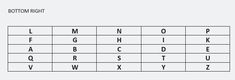
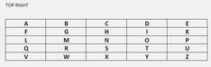
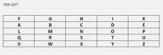
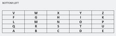
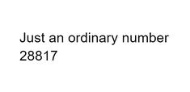
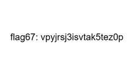
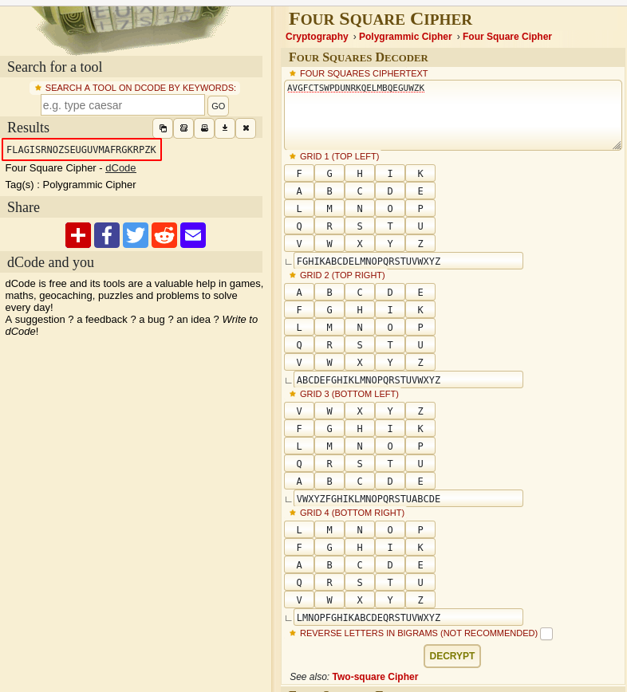
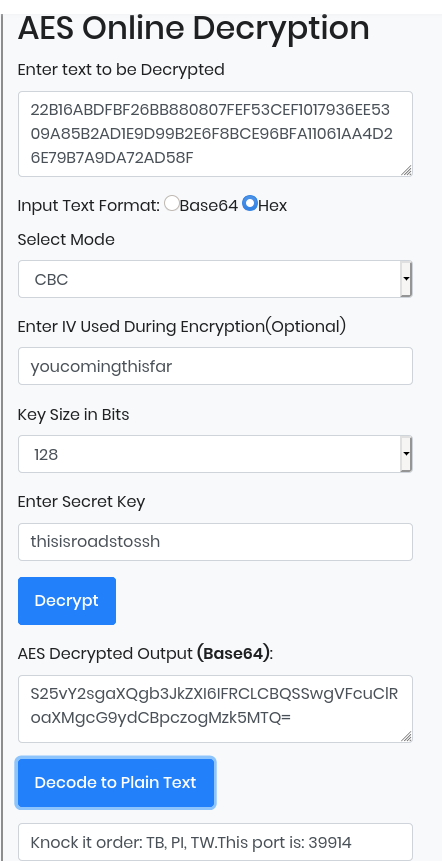

# [Task 5] Stage 5

Stage 5 is now ready to be brute in. Deploy the machine and start capturing the flag. Please terminate the previous VM before deploying a new one. The theme for this stage is the Apache2 strike back and OSINT.

**Prerequisite: Complete stage 4 and obtain the hostname.**

Here are some of the tips:

1. You are going to need a network scanning tool (Nmap). Just do a fast scan with ping skip (`nmap -Pn -p- -v -T5`).
2. Brute your way in.
3. Find someone on social media(s)
4. Do forensic
5. Stay calm and have fun

Refer to the hints if you are stuck or DM me in my discord channel if you are really stuck. Once again, good luck with the challenge. 

Note: ~~Stage 6 challenge will be released on 11/11/2019, UTC time~~. Stage 6 is now up!.

# #1 - Flag 61

A nmap scan reveals that ports 80 and 9999 are opened. Connecting to port 9999 will need nowhere as we haven't been provided with a port knocking sequence at the previous level. Let's start with port 80.

Connecting with http://10.10.12.221/ shows the genuine Ubuntu Apache2 welcome page, there is no robots.txt and dirsearch discovers some hidden resources, but all in 403 (forbidden).

Let's try the virtual server host name found at stage 4 (`roadtoroot.com`):

~~~
# echo "10.10.12.221 roadtoroot.com" >> /etc/hosts
$ curl -s http://roadtoroot.com/

Welcome to my second hidden server

Enjoy the stego? I Guess yes

Take this as my personal reward

flag61: 73a0u8asqeeki7ashcv2
~~~

Flag61: `73a0u8asqeeki7ashcv2`

# #2 - Flag 62

There is a `robots.txt` file that reveals hidden locations and a flag, but we will keep that for later flags. For now, let's perform a scan.

~~~
$ gobuster dir -w /data/src/wordlists/big.txt -u http://roadtoroot.com
===============================================================
Gobuster v3.0.1
by OJ Reeves (@TheColonial) & Christian Mehlmauer (@_FireFart_)
===============================================================
[+] Url:            http://roadtoroot.com
[+] Threads:        10
[+] Wordlist:       /data/src/wordlists/big.txt
[+] Status codes:   200,204,301,302,307,401,403
[+] User Agent:     gobuster/3.0.1
[+] Timeout:        10s
===============================================================
2020/05/25 08:22:35 Starting gobuster
===============================================================
/.htaccess (Status: 403)
/.htpasswd (Status: 403)
/execute (Status: 301)
/robots.txt (Status: 200)
/server-status (Status: 403)
===============================================================
2020/05/25 08:24:25 Finished
===============================================================
~~~

The `/execute/` directory is interesting:

~~~
$ curl -s http://roadtoroot.com/execute/

Bruteforce...bruteforce.....bruteforce......never end

tired of bruteforce? How about we play something new

flag 62: mylug980r9axzn6fvrl0
 
~~~

Flag 62: `mylug980r9axzn6fvrl0`

# #3 - Flag 63

There was an interesting empty link found previously (hello). Let's find out what this is:

~~~
$ curl -s http://roadtoroot.com/execute/hello
$ wget http://roadtoroot.com/execute/hello
$ file hello 
hello: ELF 64-bit LSB shared object, x86-64, version 1 (SYSV), dynamically linked, interpreter /lib64/ld-linux-x86-64.so.2, BuildID[sha1]=d60d036bb75aaecb6abb396eb02d30558daaaa36, for GNU/Linux 3.2.0, not stripped
$ chmod +x hello 
unknown@localhost:/data/documents/challenges/TryHackMe/CTF_100/files$ ./hello 
I'm noob in C
Take this flag63: mubxspokswhcqr8aj6e5
~~~

Flag63: `mubxspokswhcqr8aj6e5`

# #4 - Flag 64

Time now to analyze the `robots.txt` file:

~~~
$ curl -s http://roadtoroot.com/robots.txt | html2text 
Disallow:* /TB /PI /TW flag 64: ekvtyrcwshbl3hkwkzsh
~~~

Several locations are found, that we will analyze just after, but flag64 is revealed here.

Flag 64: `ekvtyrcwshbl3hkwkzsh`

# #5 - Flag 65

*Hint: A cipher name starts with B*

We have found the `/TW` directory in the `robots.txt` file. Let's check it:

~~~
$ curl -s http://roadtoroot.com/TW/

This is a social networking site that relies on micro-blogging for communication

user: @65_6f

flag65: aqvdsfiaphmynifgjylz

<!-- The flag is encrypted, the cipher name starts with B and the key is flag -->
~~~

The hint (`This is a social networking site that relies on micro-blogging for communication`) and the username (`@65_6f`) relates to Twitter. There should be a Twitter account for this user, but we keep this for the flag 67.

Cipher starting with B (https://en.wikipedia.org/wiki/Category:Classical_ciphers):
* Bacon's cipher
* Beaufort cipher
* Bifid cipher
* Book cipher
* Thomas Brierley grave cipher

Use https://cryptii.com/pipes/beaufort-cipher to decrypt it with `flag` as key.

Flag 65: `fvfdngsgqeoisdvawnph`

# #6 - Flag 66

*Hint: A cipher name starts with A*

~~~
$ curl -s http://roadtoroot.com/PI/

Pins are visual bookmarks that you collect on boards

user: gsnwpwp_

flag 66: gfpi7hadqleilk4ycb58

<!-- the username is encrypted, the cipher name starts with a -->
~~~

Ciphers beginning with A:
* ADFGVX cipher
* Affine cipher
* Alberti cipher
* The Alphabet Cipher
* Alphabetum Kaldeorum
* Arnold Cipher
* Āryabhaṭa numeration
* Atbash
* Autokey cipher

It was Atbash cipher. Use [CyberChef](https://gchq.github.io/CyberChef/) to decrypt the username: `thmdkdk_`.

Flag 66: `gfpi7hadqleilk4ycb58`

# #7 - Flag 67

Googling for the decrypted username (`thmdkdk_`) leads to https://www.pinterest.fr/thmdkdk_/, likely an account created for this puzzle (0 followers). It discloses several directories with 1 picture for each:

Location | Description | Image
---|---|---
BR | Bottom Right | 
TR | Top Right | 
TL | Top Left | 
BL | Bottom Left | 
Places to Visit | Just an ordinary number: 28817 | 
troll | Flag 67 | 

These pictures will be used for later flags.

Just take note of the number disclosed by "Places to Visit": `28817`. This is one of the sequence number for the final question.

Flag67: `vpyjrsj3isvtak5tez0p`

# #8 - Flag 68

Remember that we discovered a Twitter acount (`@65_6f`) at question 65. Time to check what we can find there: https://twitter.com/search?q=%4065_6f&src=typed_query.

There are several posts:

~~~
6d 65 6d 65 20 6c 6f 72 64 @65_6f · Oct 4, 2019
Solve this, I dare you
AVGFCTSWPDUNRKQELMBQEGUWZK
-----------------------------------------------------
6d 65 6d 65 20 6c 6f 72 64 @65_6f · Oct 4, 2019
I got a number from the creator.

44414

Well, what the hell is this?
-----------------------------------------------------
6d 65 6d 65 20 6c 6f 72 64 @65_6f · Oct 4, 2019
Not bad, you found me. The ultimate meme lord.
REEEEEEEEEEEEEEEEEEEEEEEEEEEEEEEEEEEEEEEEEE

flag 68: o0no5s3qmo7wymnagnwv
-----------------------------------------------------
6d 65 6d 65 20 6c 6f 72 64 @65_6f · Oct 4, 2019
mode: CBC
size: 128
VI: youcomingthisfar
SK: thisisroadstossh
Type: hex16
~~~

* The 1st post is an encrypted string that we will use for the next question
* Take note of the number disclosed on the 2nd post (`44414`). This will be used for the final question.
* The 3rd post is our flag
* The last post refers to AES, we'll keep this for the final question.

One of the post reveals flag 68: `o0no5s3qmo7wymnagnwv`

# #9 - Flag 69

*Hint: Get the four square image to solve the cipher text*

Putting the other pictures together makes a four square. Decrypt the flag with https://www.dcode.fr/four-squares-cipher:

Flag 69: `RNOZSEUGUVMAFRGKRPZK`

# #10 - Flag 70

*Hint: A cipher name starts with C*

The `robots.txt` file was also revealing another location, which reveals flag 70:

~~~
$ curl -s http://roadtoroot.com/TB/

This is a micro blogging site. In addition, you can have your own domain.

user: vnvnuxammt

flag 70:rqi51dlh6b67q0v7qhmc
 

<!-- The username is encrypted, the cipher name starts with C -->
~~~

Ciphers beginning with C:
* Caesar cipher
* Chaocipher
* Copiale cipher

Using brute force, we find that the user `vnvnuxammt` decodes to `memelorddk` with an offset of +9. We will use this username for the next flag.

Flag 70: `rqi51dlh6b67q0v7qhmc`

# #11 - Flag 71

Notice that the `robots.txt` file disclosed 3 directories, and each name is a reference to a social media website:

* **TW**: Twitter (`6d 65 6d 65 20 6c 6f 72 64` which decodes to `meme lord`)
* **PI**: Pinterest (`thmdkdk_`)
* **TB**: ???

TB refers to Tumblr. Linked with the username found previously (`memelorddk`), we can find the following page with the same avatar: https://memelorddk.tumblr.com/

There are 2 posts, 1 of which being the flag.

~~~
Secure or unsecure?
22B16ABDFBF26BB880807FEF53CEF1017936EE5309A85B2AD1E9D99B2E6F8BCE96BFA11061AA4D26E79B7A9DA72AD58F
-----------------------------------------------------
Good job
OSINT is the way to go
flag 71: r9yu4uhd013misdl058q
~~~

Flag 71: `r9yu4uhd013misdl058q`

# #12 - Port to stage 6 (Format: PORT PORT PORT ...)

We already gathered 2 ports: `28817` and `44414`.

For the last port, let's use the information found on Twitter to decode the hex string. You can use https://www.devglan.com/online-tools/aes-encryption-decryption:

~~~
Encrypted: 22B16ABDFBF26BB880807FEF53CEF1017936EE5309A85B2AD1E9D99B2E6F8BCE96BFA11061AA4D26E79B7A9DA72AD58F
mode: CBC
size: 128
VI: youcomingthisfar
SK: thisisroadstossh
Type: hex16
~~~

The last port is `39914`

The full sequence is: `28817 44414 39914`.
