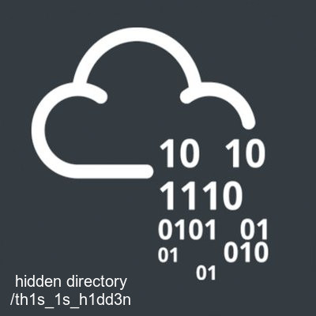

# Madness

Will you be consumed by Madness?

**Please note this challenge does not require SSH brute forcing.**

Use your skills to access the user and root account!

This room is part of the Turmoil series

# #1 - user.txt

*Hint: There's something ROTten about this guys name!*

~~~
PORT   STATE SERVICE VERSION
22/tcp open  ssh     OpenSSH 7.2p2 Ubuntu 4ubuntu2.8 (Ubuntu Linux; protocol 2.0)
| ssh-hostkey: 
|   2048 ac:f9:85:10:52:65:6e:17:f5:1c:34:e7:d8:64:67:b1 (RSA)
|   256 dd:8e:5a:ec:b1:95:cd:dc:4d:01:b3:fe:5f:4e:12:c1 (ECDSA)
|_  256 e9:ed:e3:eb:58:77:3b:00:5e:3a:f5:24:d8:58:34:8e (ED25519)
80/tcp open  http    Apache httpd 2.4.18 ((Ubuntu))
|_http-server-header: Apache/2.4.18 (Ubuntu)
|_http-title: Apache2 Ubuntu Default Page: It works
Service Info: OS: Linux; CPE: cpe:/o:linux:linux_kernel
~~~


Have a close look at the Apache2 Ubuntu default page, it has been modified:

~~~
$ curl -s http://10.10.109.114

[REDACTED]

  <body>
    <div class="main_page">
      <div class="page_header floating_element">
        
<!-- They will never find me-->
        <span class="floating_element">
          Apache2 Ubuntu Default Page
        </span>
      </div>
<!--      <div class="table_of_contents floating_element">
        <div class="section_header section_header_grey">

[REDACTED]
~~~

The file header (`89 50 4e 47 0d 0a 1a 0a`) indicates that the file is a PNG while the extension is `*.jpg`.

~~~
$ wget http://10.10.109.114/thm.jpg
$ xxd thm.jpg | head
00000000: 8950 4e47 0d0a 1a0a 0000 0001 0100 0001  .PNG............
00000010: 0001 0000 ffdb 0043 0003 0202 0302 0203  .......C........
00000020: 0303 0304 0303 0405 0805 0504 0405 0a07  ................
00000030: 0706 080c 0a0c 0c0b 0a0b 0b0d 0e12 100d  ................
00000040: 0e11 0e0b 0b10 1610 1113 1415 1515 0c0f  ................
00000050: 1718 1614 1812 1415 14ff db00 4301 0304  ............C...
00000060: 0405 0405 0905 0509 140d 0b0d 1414 1414  ................
00000070: 1414 1414 1414 1414 1414 1414 1414 1414  ................
00000080: 1414 1414 1414 1414 1414 1414 1414 1414  ................
00000090: 1414 1414 1414 1414 1414 1414 1414 ffc0  ................
~~~

Let's replace the header to match with a jpg:

~~~
$ printf '\xff\xd8\xff\xe0\x00\x10\x4a\x46\x49\x46\x00\x01' | dd conv=notrunc of=thm.jpg bs=1
~~~



The picture discloses a hidden location: 

~~~
$ curl -s http://10.10.109.114/th1s_1s_h1dd3n/
<html>
<head>
  <title>Hidden Directory</title>
  <link href="stylesheet.css" rel="stylesheet" type="text/css">
</head>
<body>
  <div class="main">
<h2>Welcome! I have been expecting you!</h2>
<p>To obtain my identity you need to guess my secret! </p>
<!-- It's between 0-99 but I don't think anyone will look here-->

<p>Secret Entered: </p>

<p>That is wrong! Get outta here!</p>

</div>
</body>
</html>
~~~

Based on the comment, we can guess that the page expects a number to be provided as argument:

~~~
$ curl -s http://10.10.109.114/th1s_1s_h1dd3n/?secret=34
<html>
<head>
  <title>Hidden Directory</title>
  <link href="stylesheet.css" rel="stylesheet" type="text/css">
</head>
<body>
  <div class="main">
<h2>Welcome! I have been expecting you!</h2>
<p>To obtain my identity you need to guess my secret! </p>
<!-- It's between 0-99 but I don't think anyone will look here-->

<p>Secret Entered: 34</p>

<p>That is wrong! Get outta here!</p>

</div>
</body>
</html>
~~~

OK, let's [script](files/secret.py) it in python:

```python
#!/usr/bin/env python3

import requests

host = '10.10.109.114'
url = 'http://{}/th1s_1s_h1dd3n/?secret={}'

for i in range(100):
	r = requests.get(url.format(host, i))
	if not 'That is wrong!' in r.text:
		print("Found secret: {}".format(i))
		print(r.text)
```

Here is the output of the script:

~~~
$ python secret.py 
Found secret: 73
<html>
<head>
  <title>Hidden Directory</title>
  <link href="stylesheet.css" rel="stylesheet" type="text/css">
</head>
<body>
  <div class="main">
<h2>Welcome! I have been expecting you!</h2>
<p>To obtain my identity you need to guess my secret! </p>
<!-- It's between 0-99 but I don't think anyone will look here-->

<p>Secret Entered: 73</p>

<p>Urgh, you got it right! But I won't tell you who I am! y2RPJ4QaPF!B</p>

</div>
</body>
</html>
~~~

Looks like we have a password (`y2RPJ4QaPF!B`) but no user name. And we are instructed not to brute force the SSH. I first tried a few usernames that I found relevant, but none was working:
* th1s_1s_h1dd3n
* th1s_1s_h1dd3n-73
* th1s_1s_h1dd3n_73
* madness
* madness73
* madness_73
* madness-73
* thm
* thm73
* thm_73
* thm-73
* seventythree
* seventy_three
* seventy-three

Then I saw the hint (`There's something ROTten about this guys name!`) and thought there might be something else to get from the picture.

Nothing with binwalk, but steghide was luckier (use the password found as key):

~~~
$ steghide info thm.jpg 
"thm.jpg":
  format: jpeg
  capacity: 1.0 KB
Try to get information about embedded data ? (y/n) y
Enter passphrase: 
  embedded file "hidden.txt":
    size: 101.0 Byte
    encrypted: rijndael-128, cbc
    compressed: yes
$ steghide extract -sf thm.jpg 
Enter passphrase: 
wrote extracted data to "hidden.txt".
$ cat hidden.txt 
Fine you found the password! 

Here's a username 

wbxre

I didn't say I would make it easy for you!
~~~

Now, let's ROT13 this username:

~~~
$ echo -n "wbxre" | tr 'A-Za-z' 'N-ZA-Mn-za-m'
joker
~~~

I tried to connect as `joker` with the password, but no luck. I also tried to ROT13 the password, no luck either...

I'll be honest, I was about to stop here and searched in one of the available writeups. I found that the password is located in the picture of this room.... Seriously, who would expect that? Anyway, let's take this as a hint (it would maybe make sense to add a hint BTW).

Use steghide (with empty key) to reveal the password:

~~~
$ wget https://i.imgur.com/5iW7kC8.jpg
$ steghide info 5iW7kC8.jpg 
"5iW7kC8.jpg":
  format: jpeg
  capacity: 6.6 KB
Try to get information about embedded data ? (y/n) y
Enter passphrase: 
  embedded file "password.txt":
    size: 83.0 Byte
    encrypted: rijndael-128, cbc
    compressed: yes
$ steghide extract -sf 5iW7kC8.jpg 
Enter passphrase: 
wrote extracted data to "password.txt".
$ cat password.txt 
I didn't think you'd find me! Congratulations!

Here take my password

*axA&GF8dP
~~~

Great, now we have a valid user and password.

~~~
$ sshpass -p "*axA&GF8dP" ssh joker@10.10.109.114
joker@ubuntu:~$ pwd
/home/joker
joker@ubuntu:~$ cat user.txt 
THM{d5781e53b130efe2f94f9b0354a5e4ea}
~~~

User flag: `THM{d5781e53b130efe2f94f9b0354a5e4ea}`

# #2 - root.txt

User has not sudo privileges, but there are interesting programs owned by root with the SUID bit set:

~~~
joker@ubuntu:~$ /bin/bash
joker@ubuntu:~$ find / -user root -perm -u=s 2>/dev/null
/usr/lib/openssh/ssh-keysign
/usr/lib/dbus-1.0/dbus-daemon-launch-helper
/usr/lib/eject/dmcrypt-get-device
/usr/bin/vmware-user-suid-wrapper
/usr/bin/gpasswd
/usr/bin/passwd
/usr/bin/newgrp
/usr/bin/chsh
/usr/bin/chfn
/usr/bin/sudo
/bin/fusermount
/bin/su
/bin/ping6
/bin/screen-4.5.0
/bin/screen-4.5.0.old
/bin/mount
/bin/ping
/bin/umount
joker@ubuntu:~$ ls -l /bin/screen*
lrwxrwxrwx 1 root root      12 Jan  4 14:03 /bin/screen -> screen-4.5.0
-rwsr-xr-x 1 root root 1588648 Jan  4 14:03 /bin/screen-4.5.0
-rwsr-xr-x 1 root root 1588648 Jan  4 13:59 /bin/screen-4.5.0.old
lrwxrwxrwx 1 root root      12 Jan  4 13:59 /bin/screen.old -> screen-4.5.0
~~~

Let's find a way to leverage a root privilege with screen version 4.5.0 (https://www.exploit-db.com/exploits/41154). Download the exploit, transfer it to the target in `/tmp` and execute it. For an unknown reason, the exploit failed to execute for me:

~~~
$ sh 41154.sh 
~ gnu/screenroot ~
[+] First, we create our shell and library...
~~~

I analyzed it and created the `/tmp/libhax.c` and `rootshell.c` files myself, and compiled them. It worked this way.

~~~
# cat /root/root.txt
THM{5ecd98aa66a6abb670184d7547c8124a}
~~~

Root flag: `THM{5ecd98aa66a6abb670184d7547c8124a}`
