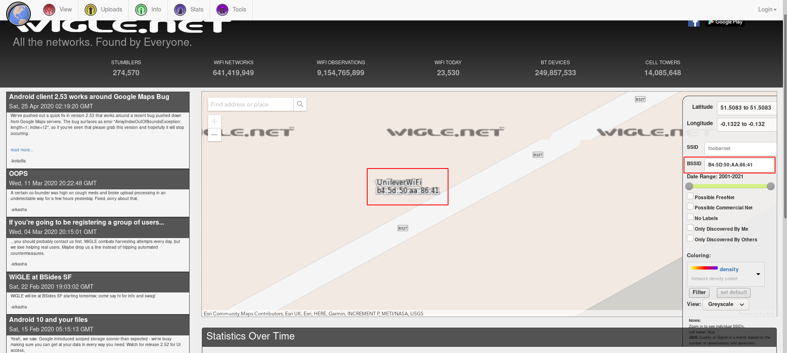

# OhSINT
## Description
What information can you possible get starting with just one photo?

# What is this users avatar of?

## Hint
exiftool is your friend. Who is the author of the image? Do they have any social media accounts?

## Solution

Exiftool is revealing what is likely an avatar's name in the Copyright field: "OWoodflint"
~~~
$ /data/src/exiftool-11.93/exiftool WindowsXP.jpg 
ExifTool Version Number         : 11.93
File Name                       : WindowsXP.jpg
Directory                       : .
File Size                       : 229 kB
File Modification Date/Time     : 2020:04:30 17:23:01+02:00
File Access Date/Time           : 2020:04:30 17:23:13+02:00
File Inode Change Date/Time     : 2020:04:30 17:23:13+02:00
File Permissions                : rw-r--r--
File Type                       : JPEG
File Type Extension             : jpg
MIME Type                       : image/jpeg
XMP Toolkit                     : Image::ExifTool 11.27
GPS Latitude                    : 54 deg 17' 41.27" N
GPS Longitude                   : 2 deg 15' 1.33" W
Copyright                       : OWoodflint
Image Width                     : 1920
Image Height                    : 1080
Encoding Process                : Baseline DCT, Huffman coding
Bits Per Sample                 : 8
Color Components                : 3
Y Cb Cr Sub Sampling            : YCbCr4:2:0 (2 2)
Image Size                      : 1920x1080
Megapixels                      : 2.1
GPS Latitude Ref                : North
GPS Longitude Ref               : West
GPS Position                    : 54 deg 17' 41.27" N, 2 deg 15' 1.33" W
~~~

Googling for this name (`OWoodflint`) points us to an account on Twitter: https://twitter.com/owoodflint?lang=fr, which avatar is a "cat".

Solution: `cat`

# What city is this person in?

Googling the name, we are able to find a github: https://github.com/OWoodfl1nt/people_finder
The main page reveals that the user is based in London.


# Whats the SSID of the WAP he connected to?

## Hint
BSSID + Wigle.net

## Solution
On his Twitter account, he posted:
~~~
0x00000000000000000000
@OWoodflint
·
3 mars 2019
From my house I can get free wifi ;D

Bssid: B4:5D:50:AA:86:41 - Go nuts!
~~~

Use wigle.net to identify the BSSID (zoom out to go to the UK and zoom in on the UK on the purple circle).



BSSID: `UnileverWifi`

# What is his personal email address?
~~~
$ curl -s https://raw.githubusercontent.com/OWoodfl1nt/people_finder/master/README.md | grep @
Follow me on twitter: @OWoodflint
Project starting soon! Email me if you want to help out: OWoodflint@gmail.com
~~~

It reveals the email:
~~~
OWoodflint@gmail.com
~~~

# What site did you find his email address on?
~~~
github
~~~

# Where has he gone on holiday?

https://oliverwoodflint.wordpress.com/author/owoodflint/
Reveals that the user is in New York.


# What is this persons password?

The password is revealed as a white text on a white background on the user's blog:

```php
$ curl -s https://oliverwoodflint.wordpress.com/author/owoodflint/ | grep -C5 York
<article id="post-3" class="post-3 post type-post status-publish format-standard hentry category-uncategorised">
			<header class="entry-header">
			<h1 class="entry-title"><a href="https://oliverwoodflint.wordpress.com/2019/03/03/the-journey-begins/" rel="bookmark">Hey</a></h1>		</header><!-- .entry-header -->	
	<div class="entry-content">
		
<p>Im in New York right now, so I will update this site right away with new photos!</p>


<p style="color:#ffffff;" class="has-text-color">pennYDr0pper.!</p>
	</div><!-- .entry-content -->
```
Password:
~~~
pennYDr0pper.!
~~~