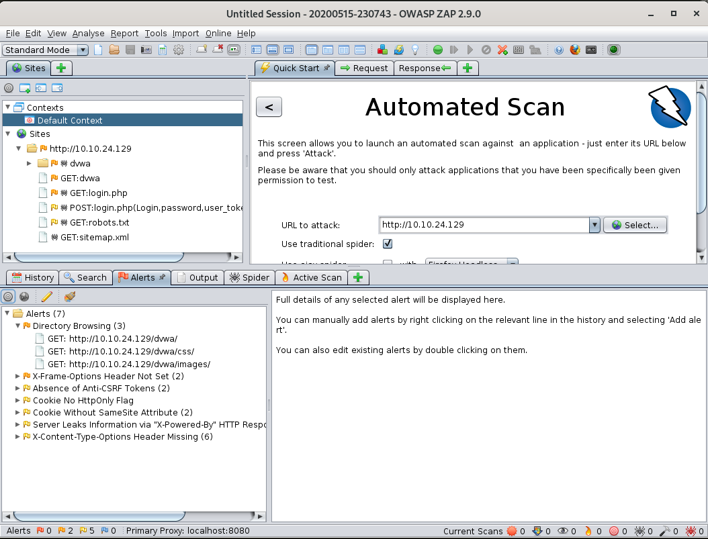
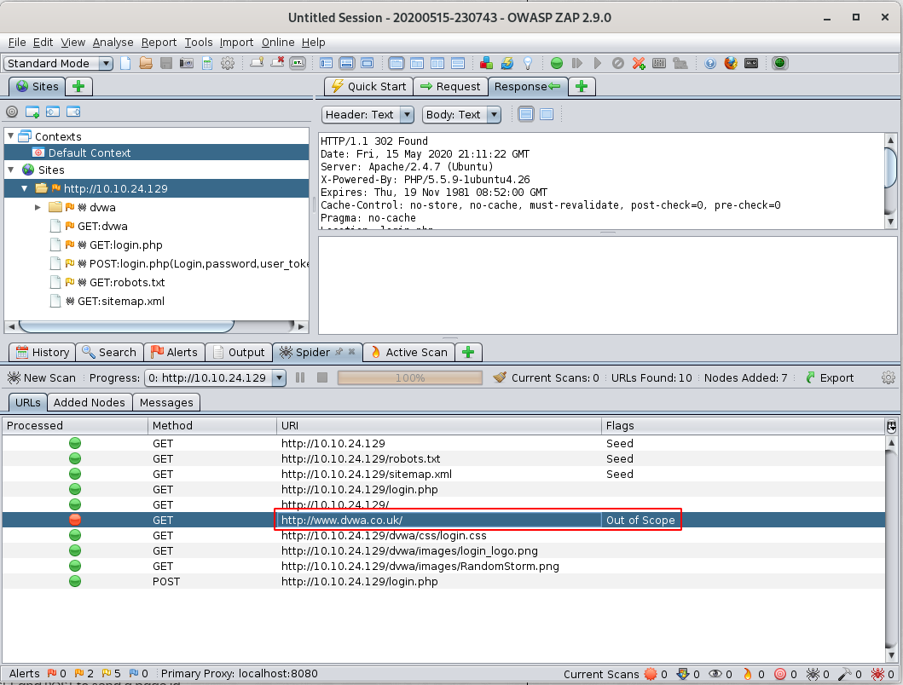

# RP: Web Scanning

Part of the Red Primer series, intro to web scanning.

# [Task 2] ...I'm supposed to scan with that?

## #2.0 - Instructions

A short quiz over the various switches used with Nikto as well as a quick scan against our target. All you'll need for this is the help menu for nikto. Include all parts of the switch unless otherwise specified, this includes -

## #2.1 - First and foremost, what switch do we use to set the target host?

The `-h` flag is used to specify the host.

## #2.2 - Websites don't always properly redirect to their secure transport port and can sometimes have different issues depending on the manner in which they are scanned. How do we disable secure transport?

*Hint: Secure is the difference between HTTP and HTTPS. What does that difference entail?*

Use the `-nossl` to disable SSL.

## #2.3 - How about the opposite, how do we force secure transport?

On the opposite, to force SSL, use the `-ssl` flag.

## #2.4 - What if we want to set a specific port to scan?

By default, the port is 80. To force a different port, use the `-p` flag.

## #2.5 - As the web is constantly evolving, so is Nikto. A database of vulnerabilities represents a core component to this web scanner, how do we verify that this database is working and free from error?

Use `-dbcheck` to check database and other key files for syntax errors.

## #2.6 - If instructed to, Nitko will attempt to guess and test both files within directories as well as usernames. Which switch and numerical value do we use to set Nikto to enumerate usernames in Apache? Keep in mind, this option is deprecated in favor of plugins, however, it's still a great option to be aware of for situational usage.

`-mutate` is user to guess additional file names. With the value `3`, it will enumerate user names via Apache  (`/~user type requests`)

Answer: `-mutate 3`

## #2.7 - Suppose we know the username and password for a web forum, how do we set Nikto to do a credentialed check? Suppose the username is admin and the password is PrettyAwesomePassword1234

We would use `-id admin:PrettyAwesomePassword1234`

## #2.8 - Let's scan our target machine, what web server do we discover and what version is it?

~~~
$ nikto -h 10.10.24.129
- ***** RFIURL is not defined in nikto.conf--no RFI tests will run *****
- Nikto v2.1.6
---------------------------------------------------------------------------
+ Target IP:          10.10.24.129
+ Target Hostname:    10.10.24.129
+ Target Port:        80
+ Start Time:         2020-05-15 22:51:17 (GMT2)
---------------------------------------------------------------------------
+ Server: Apache/2.4.7 (Ubuntu)
~~~

Answer: `Apache/2.4.7`

## #2.9 - This box is vulnerable to very poor directory control due to it's web server version, what directory is indexed that really shouldn't be?

*Hint: This directory allows for settings to potentially be changed remotely, allowing for us to do silly things just as just removing the metaphorical lock from the door.*

~~~
$ nikto -h 10.10.24.129

...[SNIP]...

+ OSVDB-3268: /config/: Directory indexing found.
+ /config/: Configuration information may be available remotely.
+ OSVDB-3268: /config/: Directory indexing found.
~~~

Answer: `config`

## #2.10 - Nikto scans can take a while to fully complete, which switch do we set in order to limit the scan to end at a certain time?

The `-until` flag allows to run until the specified time or duration.

## #2.11 - But wait, there's more! How do we list all of the plugins are available?

Use the `-list-plugins` flag to list all available plugins.

## #2.12 - On the flip-side of the database, plugins represent another core component to Nikto. Which switch do we use to instruct Nikto to use plugin checks to find out of date software on the target host? Keep in mind that when testing this command we need to specify the host we intend to run this against. For submitting your answer, use only the base command with the out of date option. 

The `-plugin outdated` flag will do checks to see whether the web server is the latest version.

## #2.13 - Finally, what if we'd like to use our plugins to run a series of standard tests against the target host?

`-plugin tests` will test host with the standard Nikto tests

# [Task 3] Zip ZAP!

A brief quiz and tutorial over using the OWASP Zap Scanner

## #3.1 - Let's start simple and launch zap. This can be done in a number of ways (Commands: owasp-zap, zaproxy) or through launching it in the Kali gui. 

No answer here. Start ZAP.

## #3.2 - Launch ZAP, what option do we set in order to specify what we are attacking?

We need to defined the `URL to attack`.

## #3.3 - Launch the attack against our target! Throughout the course of this attack you may notice this is very similar to Nikto. Similar to Nessus vs. OpenVAS, Nikto and ZAP and both offer different perspectives on a host and, as such, it's useful to know how to leverage both scanning tools in order to maximize your own visibility in a situation wherein 'noise' doesn't particularly matter.

## #3.4 - ZAP will discover a file that typically contains pages which well-behaved web indexing engines will read in order to know which sections of a site to avoid. What is the name of this file? (Lucky for us, our scanner isn't what we would call 'well-behaved'!)

Answer: `robots.txt` is a file that can disclose "hidden" sections of the website.

## #3.5 - One entry is included in the disallow section of this file, what is it?

The `robots.txt` file disallows indexing of `/`:

~~~
$ curl -s http://10.10.24.129/robots.txt
User-agent: *
Disallow: /
~~~

## #3.6 - ZAP will find a directory that contains images for our application, what is the path for that directory? (This is what will follows the name/ip of the website)

ZAP found images in `/dvwa/images/`

## #3.7 - This website doesn't force a secure connection by default and ZAP isn't pleased with it. Which related cookie is ZAP upset about?

*Hint: Check 'Alerts' within ZAP results*

One of the alerts is about "No HttpOnly Flag": A cookie has been set without the HttpOnly flag, which means that the cookie can be accessed by JavaScript. If a malicious script can be run on this page then the cookie will be accessible and can be transmitted to another site. If this is a session cookie then session hijacking may be possible.

Answer: `HttpOnly`

## #3.8 - Featured in various rooms on TryHackMe, Cross-Site Scripting is a vicious attack that is becoming ever more common on the open web. What Alert does ZAP produce to let us know that this site is vulnerable to XSS? Note, there are often a couple warnings produced for this, look for one more so directly related to the web client.

Answer: `Web Browser XSS Protection Not Enabled`

## #3.9 - The ZAP proxy spider represents the component responsible for 'crawling' the site. What site is found to be out of scope?

Answer: `http://www.dvwa.co.uk/`

## #3.10 - ZAP will use primarily two methods in order to scan a website, which of these two HTTP methods requests content?

Answer: `GET`

## #3.11 - Which option attempts to submit content to the website?

Answer: `POST`