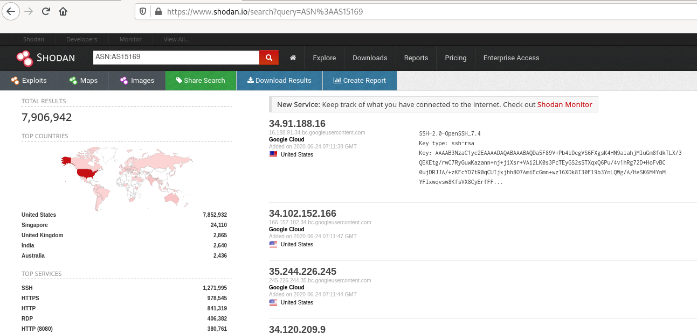

# Shodan.io

Learn about Shodan.io and how to use it for devices enumeration - is your coffee machine publicly accessible?

# [Task 1] Introduction

[Shodan.io](http://shodan.io/) is a search engine for the Internet of Things.

Ever wondered how you can find publicly accessible CCTV cameras? What about finding out how many Pi-Holes are publicly accessible?

Or whether your office coffee machine is on the internet?

Shodan.io is the answer!

**What is the [TryHackMe.com] IP address?**

We can ping tryhackme.com and the ping response will tell us their IP address.

~~~
Pinging tryhackme.com [142.93.194.248] with 32 bytes of data:
~~~

**What is their autonomous system number?**

An [autonomous system number (ASN)](https://en.wikipedia.org/wiki/Autonomous_system_(Internet)) is a global identifier of a range of IP addresses. If you are a very, very large company like Google you will likely have your own ASN for all of the IP addresses you own.

We can put the IP address into an ASN lookup tool such as https://www.ultratools.com/tools/asnInfo

Which tells us they have the ASN AS14061.

Tryhackme isn't a mega large corporation,so they don't own their own ASN. When we google AS14061 we can see it is a DigitalOcean ASN number.

On [Shodan.io](http://shodan.io/), we can search using the ASN filter. The filter is `ASN:[number]` where `number` is the number we got from earlier, which is AS14061.

Doing this, we can see a whole range (2.8 million websites, in fact) that are on this one single ASN!

https://www.shodan.io/search?query=asn%3AAS14061

Knowing the ASN is helpful, because we can search Shodan for things such as coffee makers or vulnerable computers within our ASN, which we know (if we are a large company) is on our network. 

**IMPORTANT: The answers in this room change all the time, due to the nature of Shodan and their scanning services. If you get an incorrect answer, try the 2nd most likely answer or wait a day.**

More errors? Tag me @Bee on Discord in channel #bugs.

# [Task 2] Getting Started

Time to dig in! If you get stuck, look at the previous task for some help! :)

## #2.1 - What is Google's ASN number?

*Hint: Google owns 7 ASNs. I'm looking for the one registered for "Google, US"*

~~~
$ nslookup google.com
Server:		192.168.1.4
Address:	192.168.1.4#53

Non-authoritative answer:
Name:	google.com
Address: 172.217.19.238
Name:	google.com
Address: 2a00:1450:4007:80c::200e
~~~

~~~
$ whois -h whois.cymru.com 172.217.19.238
[Querying whois.cymru.com]
[whois.cymru.com]
AS      | IP               | AS Name
15169   | 172.217.19.238   | GOOGLE, US
~~~

Answer: `AS15169`

## #2.2 - When was it allocated? Give the year only.

Using https://www.ultratools.com/tools/asnInfo, we can search for `AS15169`:

~~~
AS15169
Country:  US
Registration Date:  2000-03-30
Registrar:  arin
Owner:  GOOGLE, US
~~~

It was created in year `2000`.

## #2.3 - Where are most of the machines on this ASN number, physically in the world?

Searching for `ASN:AS15169` in Shodan reveals that most of the assets are located in the `United States`:

## #2.4 - What is Google's top service across all their devices on this ASN?

Still referring to the search results in Shodan, we see a table that provides us with the top services:

~~~
Top Services
----------------------
SSH         1,271,995
HTTPS         978,545
HTTP          841,319
RDP           406,382
HTTP (8080)   380,761
~~~

Answer: `SSH`

## #2.5 - What SSH product does Google use?

Clicking on SSH drills down to another search: `ASN:AS15169 port:"22"`

~~~
Top Products
--------------------------------------------------
OpenSSH                                 1,270,685
Dropbear sshd                                  57
Linksys WRT45G modified dropbear sshd          28
WeOnlyDo sshd                                  14
Microsoft ftpd                                 14
~~~

Answer: `OpenSSH`

## #2.6 - What is Google's most used Google product, according to this search? Ignore the word "Google" in front of it.

Answer: `cloud`

# [Task 3] Filters

On the Shodan.io homepage, we can click on ["explore"](https://www.shodan.io/explore) to view the most up voted search queries. The most popular one is webcams.

**Note: this is a grey area. It is legal to view a publicly accessible webcam, it is illegal to try to break into a password protected one. Use your brain and research the laws of your country!**

One of the other most up voted searches is a search for [MYSQL databases](https://www.shodan.io/search?query=product%3AMySQL)

If we look at the search, we can see it is another filter: `product:MySQL`

Knowing this, we can actually combine 2 searches into 1.

On TryHackMe's ASN, let's try to find some MYSQL servers. 

We use this search query: `asn:AS14061 product:MySQL`

And [ta-da](https://www.shodan.io/search?query=asn%3AAS14061+product%3AMySQL)! We have MYSQL servers on the TryHackMe ASN (which is really the DigitalOcean ASN).

Shodan has many powerful filters. My favourite one is the vuln filter, which let's us search for IP addresses vulnerable to an exploit.

Let's say we want to find IP addresses vulnerable to Eternal Blue: `vuln:ms17-010`

However, this is only available for academic or business users, to prevent script kiddies from abusing this!

Here are some nice filters we can use on Shodan:

* City
* Country
* Geo (coordinates)
* Hostname
* net (based on IP / CIDR)
* os (find operating systems)
* port
* before/after (timeframes)

# [Task 4] Google & Filtering

Learning to filter with Google. Helpful hint: pay close attention to what the question is asking you!

## #4.1 - What is the top operating system for MYSQL servers in Google's ASN?    

Searching for `asn:as15169 product:mysql` reports only 1 operating system: `Linux 3.x`.

## #4.2 - What is the 2nd most popular country for MYSQL servers in Google's ASN?

Search: `asn:as15169 product:mysql`

~~~
Top Countries
-----------------------
United States   35,502
Singapore          395
Netherlands         45
United Kingdom      38
India               19
~~~

Answer: `Singapore`

## #4.3 - Under Google's ASN, which is more popular for nginx, Hypertext Transfer Protocol or Hypertext Transfer Protocol(s)?

Answer: `Hypertext Transfer Protocol`

## #4.4 - Under Google's ASN, what is the most popular city?

Search: `asn:as15169 country:"US"`

~~~
Top Cities
-----------------------
Mountain View   81,655
Los Angeles     38,168
Aurora           4,073
Burlingame       2,762
Saint Paul       1,973
~~~

Answer: `Mountain View`

## #4.5 - Under Google's ASN in Los Angeles, what is the top operating system according to Shodan?

Search: `asn:as15169 country:"US" city:"Los Angeles"`

Answer: `Linux 3.x`

## #4.6 - Using the top Webcam search from the explore page, does Google's ASN have any webcams? Yay / nay.

Search: `asn:as15169 Server: SQ-WEBCAM`

Answer: `nay`

# [Task 5] Exploring the API & Conclusion

Shodan.io has an API! It requires an account, so I won't talk about it here.

If you want to explore the Shodan API, I've written a blog post about finding Pi-Holes with it here:

https://github.com/beesecurity/How-I-Hacked-Your-Pi-Hole/blob/master/README.md

The API let's us programmatically search Shodan and receive a list of IP addresses in return. If we are a company, we can write a script to check over our IP addresses to see if any of them are vulnerable.

PS: You can automatically filter on Shodan by clicking the things in the left hand side bar!
