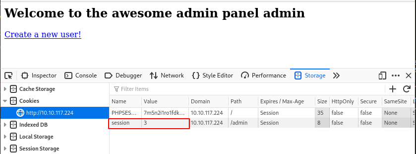
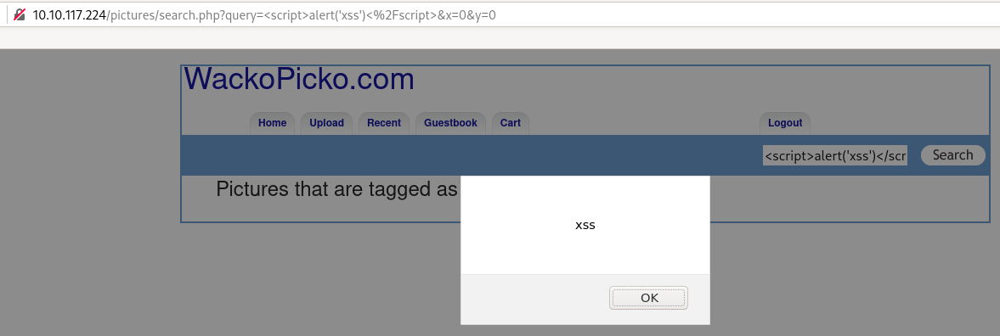
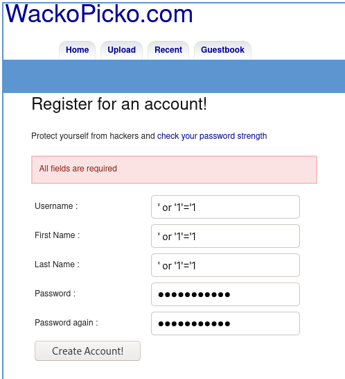
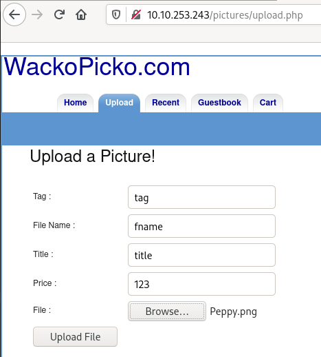
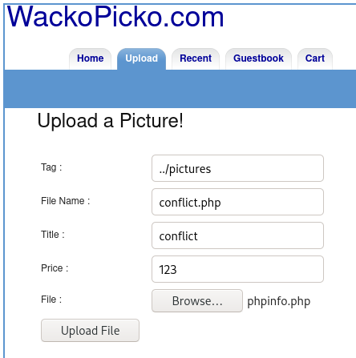
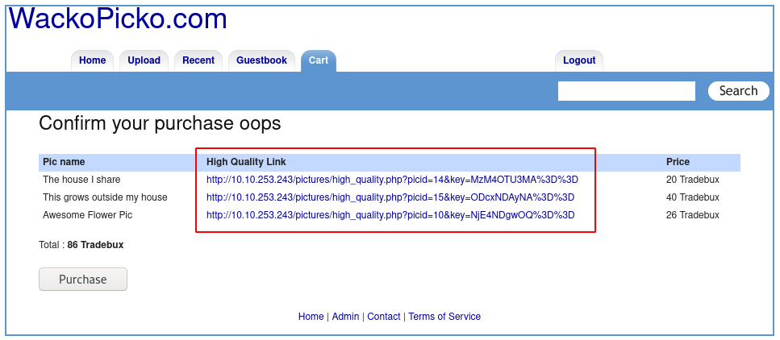

# WebAppSec 101

In this room, we will walk through how to testing an application in the perspective of a hacker/penetration tester

This room is a small vulnerable web application. In the OWASP Juice shop, we looked at how some basic vulnerabilities worked. In this room, we'll walk though the methodology and approach of testing a web application. As an ethical hacker, you need to test the web application from the perspective of an attacker. We'll be using this mindset to establish a strategy to look for weaknesses in the web application. 

Credits to Adam Doupe for creating this. 

# [Task 2] Walking through the application

## #2.0 - Instructions

To discover vulnerabilities for any application, we need to understand how the application works. Why don't you click through the links on the application and try identify the functionality. The best way to identify links or particular functionality is by running a web crawler/spider. A web spider will follow every link on every page on the web site(including inputting data into some forms). This can be good because it will help you generate a list of all the pages of the application(so you know what to test and don't miss anything), but it can also be bad because sometimes it might miss functionality or input malformed/incorrect data that may break the application. The Burp tool comes with a spider you can use to crawl through the website.

Some vulnerabilities are particular to some functionality, for example:

* When you see a login page, can you brute force or guess the credentials?
* If there is a user login, can there be an administrator login?
* Can you upload restricted content using upload functionality?
* If input is generated from a textbox, can you perform XSS?

During this phase, it's also important to look at what technologies are being used, along with their version numbers. For example, Do particular versions of servers have public exploits available? 

## #2.1 - What version of Apache is being used?

*Hint: have you checked the HTTP response headers?*

Let's start by scanning the IP with Nmap.

~~~
$ nmap -sV -sC -A 10.10.253.243
Starting Nmap 7.80 ( https://nmap.org ) at 2020-05-16 07:05 CEST
Nmap scan report for 10.10.253.243
Host is up (0.055s latency).
Not shown: 997 closed ports
PORT    STATE SERVICE VERSION
22/tcp  open  ssh     OpenSSH 7.4 (protocol 2.0)
| ssh-hostkey: 
|   2048 32:07:14:ae:89:df:2e:89:e2:38:cc:8b:b1:e7:d2:1f (RSA)
|   256 05:f4:31:e2:8d:f0:51:f6:bf:2b:fa:17:21:45:36:eb (ECDSA)
|_  256 8a:78:11:c0:48:db:ef:52:d2:ef:9f:10:58:4c:4d:40 (ED25519)
80/tcp  open  http    Apache httpd 2.4.7 ((Ubuntu))
| http-cookie-flags: 
|   /: 
|     PHPSESSID: 
|_      httponly flag not set
|_http-server-header: Apache/2.4.7 (Ubuntu)
|_http-title: WackoPicko.com
111/tcp open  rpcbind 2-4 (RPC #100000)
| rpcinfo: 
|   program version    port/proto  service
|   100000  2,3,4        111/tcp   rpcbind
|   100000  2,3,4        111/udp   rpcbind
|   100000  3,4          111/tcp6  rpcbind
|   100000  3,4          111/udp6  rpcbind
|   100024  1          36046/udp   status
|   100024  1          39399/tcp   status
|   100024  1          41696/udp6  status
|_  100024  1          55555/tcp6  status

Service detection performed. Please report any incorrect results at https://nmap.org/submit/ .
Nmap done: 1 IP address (1 host up) scanned in 12.90 seconds
~~~

3 ports are opened, 1 of which confirm that a web application is running on port 80/tcp, which is running Apache/2.4.7.

Using curl, we may also have been able to dump the header, as follows:

~~~
$ curl -s -D header.txt 10.10.253.243 > /dev/null
$ cat header.txt 
HTTP/1.1 200 OK
Date: Sat, 16 May 2020 05:08:47 GMT
Server: Apache/2.4.7 (Ubuntu)
X-Powered-By: PHP/5.5.9-1ubuntu4.24
Set-Cookie: PHPSESSID=1m531rms9pdsvu38qp930t6au7; path=/
Expires: Thu, 19 Nov 1981 08:52:00 GMT
Cache-Control: no-store, no-cache, must-revalidate, post-check=0, pre-check=0
Pragma: no-cache
Vary: Accept-Encoding
Content-Length: 3246
Content-Type: text/html
~~~

Answer: `2.4.7`

## #2.2 - What language was used to create the website?

*Hint: HTTP response headers have a lot of info ;)*

There are many ways to know that PHP is installed on the machine:
* The server is running Apache, which in many cases will host PHP applications
* The `http-cookie-flags` reveals a `PHPSESSID` session cookie.
* The title of the page is WackoPicko which is a PHP application
* The main page of the website is http://10.10.253.243/index.php

Answer: `PHP`

## #2.3 - What version of this language is used? 

*Hint: Have you tried intercepting requests to look at the headers?*

Our previous Curl version revealed the PHP version:

~~~
X-Powered-By: PHP/5.5.9-1ubuntu4.24
~~~

Answer: `5.5.9`

# [Task 3] Establishing a methodology

## #3.0 - Instructions

Now that we've walked through the application and know the functionality and technologies, how do we actually test it. There are 2 particular ways to test a web application for security vulnerabilities:

The first way is by going through every page and testing all the functionality. This would involve going through every page on the application, and depending on the functionality, testing for all the bugs/vulnerabilities that apply to the page. In this case, if we start off at the home page, we would try see what functionality we can exploit on the home page, and then move on to every page. 

The second way is by breaking down the testing into different stages(including but not limited to):

* Authorization
* Authentication
* Injection
* Client Side Controls
* Application Logic

In this room, we'll be approaching testing through these particular topics. In general testing can be done in a combination of both the approaches mentioned above. 

## #3.1 - Make sure you understand the pro's and con's of each methodology

No answer needed here.

# [Task 4] Authentication

## #4.0 - Instructions

Authentication involves testing mechanisms and logic that allow users to log in to an application(either as a regular user, or those with elevated privileges). The process of authentication usually involves verifying a user, and this is done when the user provides correct credentials(in most cases usernames and passwords). Authentication can be tested in the following ways:

* **Brute Forcing/Weak Credentials**: In most cases, users usually pick common passwords that are easy to guess. This could be anything from the username to the names of animals. Attackers can use weak passwords to their advantage by using a list to guess possible users passwords.
* **Session Management**: Sessions are the mechanism by which the server retains state about the application. This is necessary in applications that need to remember users for transactions. In some cases, sessions(which are stored in cookies) store information about users such as their privilege level. This state can be manipulated and sent back to the server.

## #4.1 - What is the admin username?

*Hint: think of common usernames*

Common admin usernames could be:
* admin
* administrator
* adm

Answer: `admin`

## #4.1 - What is the admin password?

*Hint: could the username be the same as the password?*

* For known applications, you can check on the Internet the default passwords.
* For custom applications, you can start with basic passwords like `admin`, `administrator`, `adm`, `123`, `password1`, `password123`, ...

Answer: `admin`

## #4.3 - What is the name of the cookie that can be manipulated?    

*Hint: check the cookie on the admin page*

* From the main page, there is a link at the very bottom of the page that is called Admin. Click on it to be redirected to the admin authentication page.
* Notice that this form (http://10.10.253.243/admin/index.php?page=login) is different than the standard login page (http://10.10.253.243/users/login.php).
* Authenticate with `admin`:`admin`.
* Fire up the developer bar (`Ctrl`+`Shift`+`I`) and go to Storage > Cookies > URL
* Notice that there are 2 cookies: `PHPSESSID` and `session`



Answer: `session`

## #4.4 - What is the username of a logged on user?

*Hint: have you tried using this list: https://github.com/danielmiessler/SecLists/blob/master/Usernames/Names/names.txt*

Browsing the application, you will notice that once logged in, you can view your uploaded pictures (http://10.10.253.243/users/view.php?userid=13). Modifying the value of the ID in the URL discloses other users' picures.

Take advantage of this vulnerability to list some users. I've written a [python script](files/list_users.py) that automatizes the process:

```python
#!/usr/bin/env python3
import requests
import random
import re

target   = "http://10.10.253.243"
register = "/users/register.php"
login    = "/users/login.php"
view     = "/users/view.php?userid="

# generate random username
usr = random.getrandbits(128)
pwd = usr

# Create a user
print("[INFO] Create random user")
data = {
	"username":usr,
	"firstname":usr,
	"lastname":usr,
	"password":pwd,
	"againpass":pwd
	}
r = requests.post(target+register, data=data)
#print(r.text)
print("[INFO] Random user successfully created")

with requests.Session() as s:
	# Now login with new user
	print("[INFO] Connect with {}".format(usr))
	data = {
		"username":usr,
		"password":pwd
		}
	s.post(target+login, data=data)
	print("[INFO] User {} successfully connected".format(usr))

	# List users
	print("[INFO] Listing users")
	for i in range(1,100):
		r = s.get(target+view+str(i))
		# extract username from <h2>These are bob&#39;s Pictures: </h2>
		if "<h2>These are" in r.text:
			g = re.search("<h2>(.*)</h2>", r.text)
			print("====================")
			print("User ID: {}".format(str(i)))
			print(g.group(1))
```

Some users:
* Sample User (ID: 1)
* bob (ID: 2)
* wanda (ID: 9)
* calvinwatters (ID: 10) 
* bryce (ID: 11)

Answer: `bryce`

## #4.5 - What is the corresponding password to the username?

*Hint: could the username be the same as the password?*

Logout, and go again to the authentication form (http://10.10.253.243/users/login.php). Now, log in as `bryce`:`bryce`.

# [Task 5] Cross Site Scripting (XSS)

## #5.0 - Instructions

XSS is a vulnerability that involves injecting malicious javascript in trusted websites. Once an attacker has injected malicious javascript, sometimes a browser will not know whether to trust it, and it will run the script. Using this exploit an attacker can:

* steal session information through cookies
* arbitrarily redirect users to their own pages(for phishing)

There are a few different types of XSS attacks:

* Persistent/Non-Reflected - Here the XSS payload has been stored in the database, and once the server/framework passes the data from the database into the webpage, the script/payload is executed
* Non Persistent/Reflected - Here the XSS payload is usually crafted using a malicious link. It is not stored. 

You can cause javascript to execute using different payloads and HTML tags- [this](https://www.owasp.org/index.php/XSS_Filter_Evasion_Cheat_Sheet) is a good list of resources for payloads.

## #5.1 - Test for XSS on the search bar

Inject `<script>alert('xss')</script>` in the search. It will confirm that the search field is not sanitizing the user input and is vulnerable to non-persistent XSS attack.



## #5.2 - Test for XSS on the guestbook page

The `comment` field of the guestbook is vulnerable to persistent XSS. If you enter `<script>alert('xss')</script>` in the `comment` field, it will save it to the database. Each time a user is going to the page will execute the script.

## #5.3 - Test for XSS behind the flash form on the home page

See [here](https://www.aldeid.com/wiki/WackoPicko/Reflected-XSS-Behind-a-Flash-Form) for more information.

# [Task 6] Injection

## #6.0 - Instructions

Injection attacks occur when users input data and this data is being processed/interpreted by the server. 

Injection is most common when user supplied data is not validated/sanitised by the server. Common 

injection attacks include:

* **SQL Injection** - These attacks occur when users provide malicious data that is processed by SQL statements on the server. SQL statements are usually used to interact with databases; by providing malicious input, users can read, modify and even delete data in these databases. These attacks are usually prevalent because developers do not use parameterized queries. More information about SQL Information can be found [here](https://www.owasp.org/index.php/Testing_for_SQL_Injection_(OTG-INPVAL-005)). 
* **Command Injection** - These attacks usually occur when users provide malicious data that is processed as system commands on the web server. With this attack, users can execute arbitrary command on the system and carry out malicious actions like reading password hashes and private keys. More information can be found [here](https://www.owasp.org/index.php/Command_Injection).

Injection attacks usually involve passing input to the application. In most cases, this input can be through a text field in a form, but in other cases it can be anything that the user has access to(and is interpreted by the server) e.g. HTTP Headers, disabled input fields. 

## #6.1 - Perform command injection on the check password field

*Hint: have you tried using a pipe?*

The user creation form is vulnerable to SQL injection. If you enter the string `' or '1'='1` in all fields like this:



And you go to "Who's got a similar name to you?", you will be able to list all users:


## #6.2 - Check for SQLi on the application

*Hint: where is SQLi most commonly found?*

SQL injection is commonly used to break authentication or dump the content of the database.

The authentication form is vulnerable to SQL injection and allows to login with any of the users found previously. For example to log in as `wanda`, enter `wanda' or '1'='1` in the username field, with an empty password.

To go further and dump the database, we could use sqlmap to automate the process.

# [Task 7] Miscellaneous & Logic Flaws

## #7.0 - Instructions

Applications can also have vulnerabilities because of flawed logic; a certain part of the application may not work as expected due to mistakes in how it was programmed. The way these flaws can be discovered is by testing these components and trying to understand how they are supposed to operate. After doing this, test these components in ways that the developer did not intend them to be used(e.g. passing in numbers instead of letters, trying to iterate through a range of numbers and etc). 

In addition, applications may have other vulnerabilities:

* Parameter Manipulation: Parameters are usually values passed to queries. For example in the url: www.evil.com/photos?id=1 the parameter is id and the value is 1. Sometimes developers may not correctly map resources using parameters, so an attacker can try different values and access resources that they should not access.
* Directory Traversal: An attacker may be able to access files outside the web root directory(due to incorrect access control) by manipulating variables that may take a file path(adding ../ can navigate to the upper directory). More information can be found [here](https://www.owasp.org/index.php/Path_Traversal).
* Forceful Browsing: Here an attacker can access restricted content(that also may be unmapped by the application) by brute forcing through different URLs and links. This can be done using set dictionaries or wordlists using tools like [Dirsearch](https://github.com/maurosoria/dirsearch). More information can be found [here](https://www.owasp.org/index.php/Forced_browsing).

## #7.1 - Find a parameter manipulation vulnerability 

*Hint: check the sample.php page*

We have already exploited this vulnerability earlier, to list users and IDs (http://10.10.253.243/users/view.php?userid=2).

## #7.2 - Find a directory traversal vulnerability

*Hint: check the /pictures/upload.php page*

Let's start by uploading a picture:



The picture is uploaded to: http://10.10.253.243/upload/tag/fname.550.jpg

On the other hand, the `/upload` directory allows directory listing.

Let's see if we can use a directory traversal attack to upload a `*.php` script at the root of the `/upload` directory (instead of the expected `/upload/tag` directory).



Our php file has been uploaded:


## #7.3 - Find a forceful browsing vulnerability

*Hint: try access a restricted image*

OWASP (https://owasp.org/www-community/attacks/Forced_browsing) defines the forced browsing as follows:

~~~
Forced browsing is an attack where the aim is to enumerate and access resources that are not referenced by the application, but are still accessible.

An attacker can use Brute Force techniques to search for unlinked contents in the domain directory, such as temporary directories and files, and old backup and configuration files. These resources may store sensitive information about web applications and operational systems, such as source code, credentials, internal network addressing, and so on, thus being considered a valuable resource for intruders.

This attack is performed manually when the application index directories and pages are based on number generation or predictable values, or using automated tools for common files and directory names.

This attack is also known as Predictable Resource Location, File Enumeration, Directory Enumeration, and Resource Enumeration.
~~~

Considering all directories allow directory listing, it wouldn't be too complicated to find new features. However, forcedul browsing is about finding pages following the workflow of the application.

1. Let's buy an item. Add a picture to your cart.
2. Go to your cart (http://10.10.253.243/cart/review.php)
3. Click on "continue to confirmation" (http://10.10.253.243/cart/confirm.php)
4. Click on "purchase" (http://10.10.253.243/pictures/purchased.php)
5. Click on the image you have purchased (http://10.10.253.243/pictures/high_quality.php?picid=15&key=ODcxNDAyNA%3D%3D)

## #7.4 - Logic flaw: try get an item for free

*Hint: what about discount codes?*

Notice that at step3 (before we buy the item), we are provided with the link (http://10.10.253.243/pictures/high_quality.php?picid=14&key=MzM4OTU3MA%3D%3D) before effectively buying it. We can take advantage of this vulnerability to download all images in high quality without buying them.

