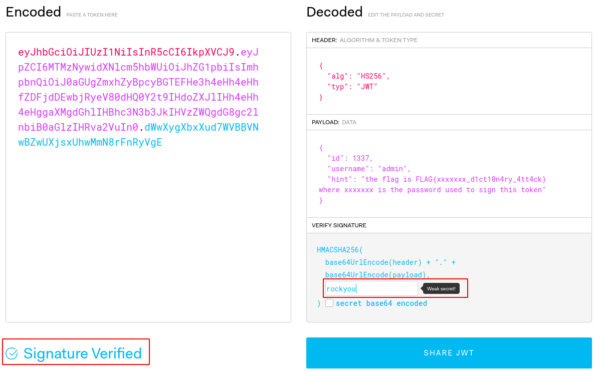
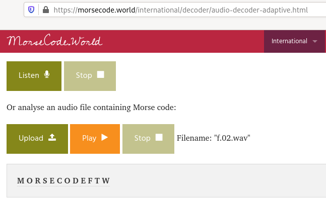

# stealthcopter ctf primer1

CTF primer containing 40 challenges (web, network, crypto and forensics) for beginnners


# Web

## #1

The flag appears as a comment in the HTML page.

~~~
$ grep -o "FLAG{.*}" w.01.html 
FLAG{check_the_comments_lol}
~~~

## #2

There is a hex string as comment in the page, but it leads nowhere:

~~~
$ grep "<\!--" w.02.html | grep -o "[a-f0-9x]" | tr -d "\n" | sed "s/0x//g" | xxd -r -p
DECOY, NOT A FLAG
~~~

Now, a closer look at the page shows that a javascript is included (`.w.02.js`)

```javascript
$ cat _w.02.js 
c=[70,76,65,71,123,106,52,118,52,115,99,114,49,112,116,95,49,115,95,52,108,115,48,95,98,52,100,125];
var s = '';
for (var i = 0; i < c.length; i++) {
    s+=String.fromCharCode(c[i])
}
console.log(s);
```

This is an array of ascii, that can be easily decoded:

```python
>>> c=[70,76,65,71,123,106,52,118,52,115,99,114,49,112,116,95,49,115,95,52,108,115,48,95,98,52,100,125]
>>> ''.join([chr(i) for i in c])
'FLAG{j4v4scr1pt_1s_4ls0_b4d}'
```

## #3

Open the webpage in Firefox or Chrome and fire up the developer bar. You will notice that there is a hidden div (`<div style="visibility:hidden">`) containing a base64-encoded picture. Remove `visibility:hidden` to reveal the hidden image and show the flag.

Flag: `FLAG{h4ck_t1m3}`

## #4

This is an obfuscated PHP code:

~~~
$ cat w.04.php 
<?php function _d5ff17c4(){$_e8b7be43=base64_decode('RkxBR3s=');$_71beeff9=base64_decode('fQ==');$_6b9df6f=0x61;$_29d6a3e8=chr(95%96);$_856a5aa8=2**2;echo $_e8b7be43.base64_decode('cGhw').$_29d6a3e8.base64_decode('aXM=').$_29d6a3e8.chr($_6b9df6f).$_29d6a3e8.chr($_6b9df6f+1).$_856a5aa8.base64_decode('ZA==').$_29d6a3e8.base64_decode('bA==').$_856a5aa8.base64_decode('bmd1').$_856a5aa8.base64_decode('ZzM=').$_71beeff9;}//_d5ff17c4(0);?>
~~~

You don't need to reverse the function because you can easily call it by removing the `//` from the call to `//_d5ff17c4(0);`

~~~
$ sed "s/\/\///" w.04.php > w.04-fixed.php
$ php w.04-fixed.php 
FLAG{php_is_a_b4d_l4ngu4g3}
~~~

## #5

This PHP code can be called in command line. We are told in comments that the key is only 1 digit.

```php
<?php 

/* 
 This is a little hack so that if we run this script from commandline
 the arguments can be passed to $_GET
 To run this in a console we'd call something like: 
 php w.05.php 'key=test'
 */
if (!isset($_SERVER["HTTP_HOST"])) {
  parse_str($argv[1], $_GET);
}

function encrypt($plainText, $secret_key) {
    $output = false;
    $encrypt_method = "AES-256-CBC";
    $key = hash( 'sha256', $secret_key );
    $iv = substr( hash( 'sha256', 'my_simple_secret_iv' ), 0, 16 );
    $output = base64_encode( openssl_encrypt( $plainText, $encrypt_method, $key, 0, $iv ) );
    return $output;
}

function decrypt($cipherText, $secret_key) {
    $output = false;
    $encrypt_method = "AES-256-CBC";
    $key = hash( 'sha256', $secret_key );
    $iv = substr( hash( 'sha256', 'my_simple_secret_iv' ), 0, 16 );
    $output = openssl_decrypt( base64_decode( $cipherText ), $encrypt_method, $key, 0, $iv );
    return $output;
}

if (!isset($_GET['key'])){
    die("Error: Key is not set! I know it was a single digit number, but I can't remember which one!!!");
}

$key=$_GET['key'];

echo "Key entered: $key"."\n";

$ct =  "T3FiSXVlOFYvVTJCRHRnRFdTRUZOeHplNVZpK0pQZUVUbWNmTHNCZUt5RT0=";

echo "CipherText: $ct\n";

$pt =  decrypt($ct, $key);

echo "PlainText: $pt \n";

?>
```

When you call it without any argument:

~~~
$ php w.05.php
PHP Notice:  Undefined offset: 1 in /data/tmp/ctf_primer_01/web/w.05.php on line 10
Error: Key is not set! I know it was a single digit number, but I can't remember which one!!!
~~~

When calling it with an argument:

~~~
$ php w.05.php 'key=1'
Key entered: 1
CipherText: T3FiSXVlOFYvVTJCRHRnRFdTRUZOeHplNVZpK0pQZUVUbWNmTHNCZUt5RT0=
PlainText:  
$ php w.05.php 'key=2'
Key entered: 2
CipherText: T3FiSXVlOFYvVTJCRHRnRFdTRUZOeHplNVZpK0pQZUVUbWNmTHNCZUt5RT0=
PlainText:  
$ php w.05.php 'key=3'
Key entered: 3
CipherText: T3FiSXVlOFYvVTJCRHRnRFdTRUZOeHplNVZpK0pQZUVUbWNmTHNCZUt5RT0=
PlainText:  
$ php w.05.php 'key=4'
Key entered: 4
CipherText: T3FiSXVlOFYvVTJCRHRnRFdTRUZOeHplNVZpK0pQZUVUbWNmTHNCZUt5RT0=
PlainText:  
$ php w.05.php 'key=5'
Key entered: 5
CipherText: T3FiSXVlOFYvVTJCRHRnRFdTRUZOeHplNVZpK0pQZUVUbWNmTHNCZUt5RT0=
PlainText:  
$ php w.05.php 'key=6'
Key entered: 6
CipherText: T3FiSXVlOFYvVTJCRHRnRFdTRUZOeHplNVZpK0pQZUVUbWNmTHNCZUt5RT0=
PlainText:  
$ php w.05.php 'key=7'
Key entered: 7
CipherText: T3FiSXVlOFYvVTJCRHRnRFdTRUZOeHplNVZpK0pQZUVUbWNmTHNCZUt5RT0=
PlainText: FLAG{n0t_s0_t0ugh} 
~~~

Flag: `FLAG{n0t_s0_t0ugh}`

## #6

The script is an obfuscated javascript. Use [de4js](https://lelinhtinh.github.io/de4js/) to deobfuscate it:

```javascript

de4js1.6.3
JavaScript Deobfuscator and Unpacker
View on GitHub
String
Local File
Remote File
None Eval Array _Number JSFuck JJencode AAencode URLencode Packer JS Obfuscator My Obfuscate Unreadable
Open in new tab

var _0x550c = ['HsOde8OyacKIw518XMKNPsO8SMO7w4JxwoPCugDCiwh4w43Cqw==', 'CcK3wq4='];
(function (_0x1421f9, _0xa7900b) {
    var _0x371c54 = function (_0x5f2f93) {
        while (--_0x5f2f93) {
            _0x1421f9['push'](_0x1421f9['shift']());
        }
    };
    _0x371c54(++_0xa7900b);
}(_0x550c, 0x1e6));
var _0x56ae = function (_0xec1512, _0x3f22ed) {
    _0xec1512 = _0xec1512 - 0x0;
    var _0x353971 = _0x550c[_0xec1512];
    if (_0x56ae['wlUhtf'] === undefined) {
        (function () {
            var _0x353626 = function () {
                var _0x1efe97;
                try {
                    _0x1efe97 = Function('return (function() ' + '{}.constructor(\"return this\")( )' + ');')();
                } catch (_0x299503) {
                    _0x1efe97 = window;
                }
                return _0x1efe97;
            };
            var _0x53087e = _0x353626();
            var _0x4b80a9 = 'ABCDEFGHIJKLMNOPQRSTUVWXYZabcdefghijklmnopqrstuvwxyz0123456789+/=';
            _0x53087e['atob'] || (_0x53087e['atob'] = function (_0x8b960b) {
                var _0x584879 = String(_0x8b960b)['replace'](/=+$/, '');
                for (var _0x38ec89 = 0x0, _0xcfc329, _0xd90795, _0x409b70 = 0x0, _0x429a24 = ''; _0xd90795 = _0x584879['charAt'](_0x409b70++); ~_0xd90795 && (_0xcfc329 = _0x38ec89 % 0x4 ? _0xcfc329 * 0x40 + _0xd90795 : _0xd90795, _0x38ec89++ % 0x4) ? _0x429a24 += String['fromCharCode'](0xff & _0xcfc329 >> (-0x2 * _0x38ec89 & 0x6)) : 0x0) {
                    _0xd90795 = _0x4b80a9['indexOf'](_0xd90795);
                }
                return _0x429a24;
            });
        }());
        var _0x4f002d = function (_0x5c44fa, _0x3f22ed) {
            var _0x2dee1d = [],
                _0x17ee0 = 0x0,
                _0x4a4ac3, _0x41b3d2 = '',
                _0x329c74 = '';
            _0x5c44fa = atob(_0x5c44fa);
            for (var _0x2ee72b = 0x0, _0x1f3f1d = _0x5c44fa['length']; _0x2ee72b < _0x1f3f1d; _0x2ee72b++) {
                _0x329c74 += '%' + ('00' + _0x5c44fa['charCodeAt'](_0x2ee72b)['toString'](0x10))['slice'](-0x2);
            }
            _0x5c44fa = decodeURIComponent(_0x329c74);
            for (var _0xbc2d51 = 0x0; _0xbc2d51 < 0x100; _0xbc2d51++) {
                _0x2dee1d[_0xbc2d51] = _0xbc2d51;
            }
            for (_0xbc2d51 = 0x0; _0xbc2d51 < 0x100; _0xbc2d51++) {
                _0x17ee0 = (_0x17ee0 + _0x2dee1d[_0xbc2d51] + _0x3f22ed['charCodeAt'](_0xbc2d51 % _0x3f22ed['length'])) % 0x100;
                _0x4a4ac3 = _0x2dee1d[_0xbc2d51];
                _0x2dee1d[_0xbc2d51] = _0x2dee1d[_0x17ee0];
                _0x2dee1d[_0x17ee0] = _0x4a4ac3;
            }
            _0xbc2d51 = 0x0;
            _0x17ee0 = 0x0;
            for (var _0x4301cb = 0x0; _0x4301cb < _0x5c44fa['length']; _0x4301cb++) {
                _0xbc2d51 = (_0xbc2d51 + 0x1) % 0x100;
                _0x17ee0 = (_0x17ee0 + _0x2dee1d[_0xbc2d51]) % 0x100;
                _0x4a4ac3 = _0x2dee1d[_0xbc2d51];
                _0x2dee1d[_0xbc2d51] = _0x2dee1d[_0x17ee0];
                _0x2dee1d[_0x17ee0] = _0x4a4ac3;
                _0x41b3d2 += String['fromCharCode'](_0x5c44fa['charCodeAt'](_0x4301cb) ^ _0x2dee1d[(_0x2dee1d[_0xbc2d51] + _0x2dee1d[_0x17ee0]) % 0x100]);
            }
            return _0x41b3d2;
        };
        _0x56ae['ZUnPBK'] = _0x4f002d;
        _0x56ae['ffVsLy'] = {};
        _0x56ae['wlUhtf'] = !![];
    }
    var _0x5e7cc1 = _0x56ae['ffVsLy'][_0xec1512];
    if (_0x5e7cc1 === undefined) {
        if (_0x56ae['RhVTbi'] === undefined) {
            _0x56ae['RhVTbi'] = !![];
        }
        _0x353971 = _0x56ae['ZUnPBK'](_0x353971, _0x3f22ed);
        _0x56ae['ffVsLy'][_0xec1512] = _0x353971;
    } else {
        _0x353971 = _0x5e7cc1;
    }
    return _0x353971;
};

function callme() {
    var _0x4b81bb = _0x56ae('0x0', 'E^eq');
    console[_0x56ae('0x1', 'X!jV')](_0x4b81bb);
}
```

Now, we see a call to a function `callme()` at the end of the page. Create a html page with the following content:

~~~
$ cat w.06.html 
<script src="w.06.js"></script>
<script>callme();</script>
~~~

Fire up the developer bar and go to Console. You will see the flag:

Flag: `FLAG{c4n_y0u_s33_m3_n0w}`

## #7

Now, we are told in the comments of the PHP script that the key is 4 digits. Let's create a loop.

The flag is found with key `1338`:

~~~
$ for i in {1..10000};do php w.07.php "key=$i";done | grep -B2 -i flag
Key entered: 1338
CipherText: QXhUQzVLYjJkU2dZOEhkbHQ3dXZ4NndoWlh1Y0hyeUpsVEhVYTFxT3lWbz0=
PlainText: FLAG{4_l1ttl3_b4t_h4rd3r} 
~~~

## #8

We are provided with a JWT token. Items are separated with dots and encoded in base64. The second item contains the flag:

~~~
$ cut -d "." -f2 w.08.jwt | base64 -d
{"id":1234,"username":"admin","password":"FLAG{jwt_t0k3ns_ar3_c00l_b34nz}"}
~~~

Flag: `FLAG{jwt_t0k3ns_ar3_c00l_b34nz}`

## #9

Now, we need to brute force the key:

~~~
$ cut -d "." -f2 w.09.jwt | base64 -d
{"id":1337,"username":"admin","hint":"the flag is FLAG{xxxxxxx_d1ct10n4ry_4tt4ck} where xxxxxxx is the password used to sign this token"}
~~~

Save the content of the JWT to `jwt.txt` and brute force the key with John:

~~~
$ /data/src/john/run/john jwt.txt --wordlist=/data/src/wordlists/rockyou.txt 
Using default input encoding: UTF-8
Loaded 1 password hash (HMAC-SHA256 [password is key, SHA256 256/256 AVX2 8x])
Will run 8 OpenMP threads
Press 'q' or Ctrl-C to abort, almost any other key for status
rockyou          (?)
1g 0:00:00:00 DONE (2020-05-22 12:56) 33.33g/s 546133p/s 546133c/s 546133C/s 123456..christal
Use the "--show" option to display all of the cracked passwords reliably
Session completed. 
~~~



The key was found: `rockyou`. The flag is: `FLAG{rockyou_d1ct10n4ry_4tt4ck}`

## #10

This is the same kind of challenge we had in levels #5 and #7. However, this time, this is a 9 digits key.

~~~
$ php w.10.php 
PHP Notice:  Undefined offset: 1 in /data/tmp/ctf_primer_01/web/w.10.php on line 10
Error: Key is not set! This time it's my favourite 9 digit number, much more secure.
~~~

Having a close look at the source code reveals that the key is disclosed at line #16 (`0x22C49FE9`)

```php
<?php 

/* 
 This is a little hack so that if we run this script from commandline
 the arguments can be passed to $_GET
 To run this in a console we'd call something like: 
 php w.05.php 'key=test'
 */
if (!isset($_SERVER["HTTP_HOST"])) {
  parse_str($argv[1], $_GET);
}

function encrypt($plainText, $secret_key) {
    $output = false;
    $encrypt_method = "AES-256-CBC";
    $key = hash( 'sha256', str(0x22C49FE9));
    $iv = substr( hash( 'sha256', 'my_simple_secret_iv' ), 0, 16 );
    $output = base64_encode( openssl_encrypt( $plainText, $encrypt_method, $key, 0, $iv ) );
    return $output;
}

function decrypt($cipherText, $secret_key) {
    $output = false;
    $encrypt_method = "AES-256-CBC";
    $key = hash( 'sha256', $secret_key );
    $iv = substr( hash( 'sha256', 'my_simple_secret_iv' ), 0, 16 );
    $output = openssl_decrypt( base64_decode( $cipherText ), $encrypt_method, $key, 0, $iv );
    return $output;
}

if (!isset($_GET['key'])){
    die("Error: Key is not set! This time it's my favourite 9 digit number, much more secure.");
}

$key=$_GET['key'];

echo "Key entered: $key"."\n";

$ct =  "OWVzUHhVVFNsM0t6NFhDb1FiT0RJaHNrWWYrM3VRMi9FNXcyTGhxbVV0aHpKUjdOcGRVcWtZcWc3djV5OFVxQw==";

echo "CipherText: $ct\n";

$pt =  decrypt($ct, $key);

echo "PlainText: $pt \n";

?>
```

~~~
$ python -c "print(0x22C49FE9)"
583311337
$ php w.10.php 'key=583311337'
Key entered: 583311337
CipherText: OWVzUHhVVFNsM0t6NFhDb1FiT0RJaHNrWWYrM3VRMi9FNXcyTGhxbVV0aHpKUjdOcGRVcWtZcWc3djV5OFVxQw==
PlainText: FLAG{1_h0p3_y0u_d1dnt_brut3f0rc3_m3...LINE_16} 
~~~

# Cryptography

## #1

~~~
$ cat c.01 | base64 -d
FLAG{1st_time_lucky}
~~~

## #2

~~~
$ cat c.02 | base64 -d | base64 -d | base64 -d
FLAG{3rd_times_a_charm}
~~~

## #3

The string is encoded with ROT13. Use the `tr` command to decode it:

~~~
$ cat c.03 | tr 'A-Za-z' 'N-ZA-Mn-za-m'
FLAG{stabbed_in_the_back}
~~~

## #4

Use CyberChef: https://gchq.github.io/CyberChef/#recipe=From_Base58('123456789ABCDEFGHJKLMNPQRSTUVWXYZabcdefghijkmnopqrstuvwxyz',false)&input=RjV5ZDI5Q3VYU1Q3ZTVhTUthWDRibmtWOHhGOGRLU01CN0UxNHlXVVU. The string is encoded with base58:

Flag: `FLAG{a_little_bit_more_tricky}`

## #5

The string is XOR'ed. Let's write a rudimentary brute-forcer in python:

```python
#!/usr/bin/env python3
import pwn
a = """\HWPG^DCXETEHAT^WT_RCHAEX^_XBI^CX_V;XEBEYTSTBE;B^BTRDCT;;w}pvJI^CnXBnBDATCnBTRDCTL;w}pvJI^CnXBnBDATCnBTRDCTL;w}pvJI^CnXBnBDATCnBTRDCTL;w}pvJI^CnXBnBDATCnBTRDCTL;w}pvJI^CnXBnBDATCnBTRDCTL;w}pvJI^CnXBnBDATCnBTRDCTL;w}pvJI^CnXBnBDATCnBTRDCTL;w}pvJI^CnXBnBDATCnBTRDCTL;w}pvJI^CnXBnBDATCnBTRDCTL"""

for key in range(0x01, 0xff):
    x = pwn.xor(a, key).decode('ascii')
    if 'flag' in x or 'FLAG' in x:
        print(x)
```

~~~
$ python bf-xor.py 
MYFAVOURITETYPEOFENCRYPTIONISXORING*ITSTHEBEST*SOSECURE**flag[XOR\x7fIS\x7fSUPER\x7fSECURE]*flag[XOR\x7fIS\x7fSUPER\x7fSECURE]*flag[XOR\x7fIS\x7fSUPER\x7fSECURE]*flag[XOR\x7fIS\x7fSUPER\x7fSECURE]*flag[XOR\x7fIS\x7fSUPER\x7fSECURE]*flag[XOR\x7fIS\x7fSUPER\x7fSECURE]*flag[XOR\x7fIS\x7fSUPER\x7fSECURE]*flag[XOR\x7fIS\x7fSUPER\x7fSECURE]*flag[XOR\x7fIS\x7fSUPER\x7fSECURE]
myfavouritetypeofencryptionisxoring
itsthebest
sosecure

FLAG{xor_is_super_secure}
~~~

## #6

Use [this website](https://www.guballa.de/vigenere-solver) to break the cipher key (`test`).

Flag: `FLAG{chocolate_eclaire}`

## #7

We are provided with a encrypted file (also base64-encoded) and a private key:

~~~
$ base64 -d c.07.txt > c07.enc.txt
$ openssl rsautl -decrypt -in c07.enc.txt -out c07.dec.txt -inkey c.07.key 
$ cat c07.dec.txt 
FLAG{encrypt_all_the_things}
~~~

## #8

Decrypt using https://www.dcode.fr/chiffre-bacon-bilitere.

~~~
WELLDONETHEFLAGISBACONANDEGGSANDWICH
~~~

Flag: `FLAG{BACONANDEGGSANDWICH}`

## #9

Use https://quipqiup.com/ to brute force the Vigenere:

~~~
THIS IS AN ALPHABETIC SUBSTITUTION CIPHER WHERE EACH LETTER IS REPLACED WITH ANOTHER. THE ALPHABET IS ABCDEFGHIJKLMNOPQRSTUVWXYZ. YOUR FLAG IS FLAG{EASY_AS_ABC_123}
~~~

## #10

Think in the past when you were writting text messages on your mobile phone only with the numeric keyboard. This is about T9 (predictive text): https://en.wikipedia.org/wiki/T9_(predictive_text).

~~~
[1     ] [2  abc] [3  def]
[4  ghi] [5  jkl] [6  mno]
[7 pqrs] [8  tuv] [9 wxyz]
~~~

The message decodes as follows:

~~~
333 555 2 4 7 777 33 2 66 3 777 666 444 3 2 66 3 444 666 7777
 f   l  a g p  r  e  a n  d  r   o   i  d a  n d  i   o   s
~~~

Flag: `flag{preandroidandios}`

# Forensics

## #1

The file contains 2,000,001 lines. Let's find the flag with `grep`:

~~~
$ wc -l f.01
2000001 f.01
unknown@localhost:/data/downloads/ctf_primer_01/forensics$ grep -o "FLAG{.*}" f.01
FLAG{here_i_am}
~~~

## #2

We are provided with an audio file that contains morse code. Let's upload our file [here](https://morsecode.world/international/decoder/audio-decoder-adaptive.html) to decode the message.



Flag: `FLAG{MORSE CODE FTW}`

## #3

The image doesn't reveal the flag, but `strings` does:

~~~
$ strings f.03.jpg | grep -o "FLAG{.*}"
FLAG{strings_and_things}
~~~

## #4

Nothing too difficult...

~~~
$ cat _f.04 
FLAG{stealth_mode_engaged}
~~~

## #5

After trying strings and steganography without success, I realized that the image was 2M in size and that it may embed files. Use `binwalk` or `foremost` to extract the embedded zip file.

~~~
$ foremost f.05.png 
Processing: f.05.png
|foundat=flag.txtUT 
*|
$ cd output/zip/
$ unzip 00004089.zip
$ cat flag.txt 
flag{this_is_another_one_of_them_flags}
flag{this_is_another_one_of_them_flags}
flag{this_is_another_one_of_them_flags}
flag{this_is_another_one_of_them_flags}
flag{this_is_another_one_of_them_flags}
flag{this_is_another_one_of_them_flags}
flag{this_is_another_one_of_them_flags}
flag{this_is_another_one_of_them_flags}
flag{this_is_another_one_of_them_flags}
flag{this_is_another_one_of_them_flags}
~~~

## #6

The image header is corrupted:

~~~
$ xxd f.06.png | head
00000000: 8950 4e58 0d0a 1a0a 0000 000d 4948 4452  .PNX........IHDR
00000010: 0000 0640 0000 0429 0806 0000 0099 68c1  ...@...)......h.
00000020: 1c00 002d c07a 5458 7452 6177 2070 726f  ...-.zTXtRaw pro
00000030: 6669 6c65 2074 7970 6520 6578 6966 0000  file type exif..
00000040: 78da ad9c 6992 2d37 8ea5 ff73 15b9 04ce  x...i.-7...s....
00000050: c372 4090 34eb 1dd4 f2eb 3b1e 21a9 a4ac  .r@.4.....;.!...
00000060: 2ab3 6e6b 3d65 46e8 be3b b813 c019 40f0  *.nk=eF..;....@.
00000070: 86fb 1fff e785 7ffd eb5f 29e6 1443 6d63  ........._)..Cmc
00000080: f6d5 7be4 9fba eaca c62f 33fe fcf3 f333  ..{....../3....3
00000090: c5fa fdff f70f bff6 df47 fff6 78c8 ebfb  .........G..x...
~~~

You can fix it as follows:

~~~
$ printf '\x89\x50\x4e\x47\x0d\x0a\x1a\x0a' | dd conv=notrunc of=f.06.png bs=1
~~~

Flag: `FLAG{n0_m0r3_c0rrupt10n}`

## #7

The `f.07.zip` archive is password protected. Let's crack it with `fcrackzip`:

~~~
$ fcrackzip -u -D -p /usr/share/wordlists/rockyou.txt f.07.zip 

PASSWORD FOUND!!!!: pw == password1
~~~

The password is in the `flag.txt` file.


Flag: `FLAG{zippy_zip_zip_zip}`

## #8

~~~
$ file f.08 
f.08: ELF 64-bit LSB shared object, x86-64, version 1 (SYSV), dynamically linked, interpreter /lib64/ld-linux-x86-64.so.2, BuildID[sha1]=ea2b43595682667af187b0ac8db31207e9bf845f, for GNU/Linux 3.2.0, not stripped
~~~

When run, the executable asks for a password.

Disassemble the executable in IDA or any other disassembler. The flag appears as an array:

```asm
.text:00000000000011D4                 mov     byte ptr [rbp-73h], 46h ; 'F'
.text:00000000000011D8                 mov     byte ptr [rbp-72h], 4Ch ; 'L'
.text:00000000000011DC                 mov     byte ptr [rbp-71h], 41h ; 'A'
.text:00000000000011E0                 mov     byte ptr [rbp-70h], 47h ; 'G'
.text:00000000000011E4                 mov     byte ptr [rbp-6Fh], 7Bh ; '{'
.text:00000000000011E8                 mov     byte ptr [rbp-6Eh], 69h ; 'i'
.text:00000000000011EC                 mov     byte ptr [rbp-6Dh], 6Eh ; 'n'
.text:00000000000011F0                 mov     byte ptr [rbp-6Ch], 63h ; 'c'
.text:00000000000011F4                 mov     byte ptr [rbp-6Bh], 6Fh ; 'o'
.text:00000000000011F8                 mov     byte ptr [rbp-6Ah], 72h ; 'r'
.text:00000000000011FC                 mov     byte ptr [rbp-69h], 72h ; 'r'
.text:0000000000001200                 mov     byte ptr [rbp-68h], 65h ; 'e'
.text:0000000000001204                 mov     byte ptr [rbp-67h], 63h ; 'c'
.text:0000000000001208                 mov     byte ptr [rbp-66h], 74h ; 't'
.text:000000000000120C                 mov     byte ptr [rbp-65h], 7Dh ; '}'
```

~~~
$ ./f.08 
Hello, please enter the flag:
FLAG{incorrect}
Well done, you got the flag correct!!!
~~~

Flag: `FLAG{incorrect}`

## #9

You have to find the hashes. Use Google.

Hash | Hash type | Plain
---|---
0f4d0db3668dd58cabb9eb409657eaa8 | MD5 | FLAG
d015cc465bdb4e51987df7fb870472d3fb9a3505 | SHA1 | secure 
b109f3bbbc244eb82441917ed06d618b9008dd09b3befd1b5e07394c706a8bb980b1d7785e5976ec049b46df5f1326af5a2ea6d103fd07c95385ffab0cacbc86 | SHA512 | password
d04b98f48e8f8bcc15c6ae5ac050801cd6dcfd428fb5f9e65c4e16e7807340fa | SHA256 | hash

Flag: `FLAG{secure_password_hash}`

## #10

This is brainfuck. Use https://www.dcode.fr/langage-brainfuck to decode:

~~~
FLAG{esoteric_lanaguages_are_cool}
~~~

# Networking

## #1

Dumping the strings from the network capture flag directly reveals the flag:

~~~
$ strings n.01.pcap | grep -o "FLAG{.*}"
FLAG{n0w_y0ur_g3tt1ng_1t}
~~~

Now, trying to do it a bit smarter, there is a http request that contains the flag in clear:

~~~
$ tshark -r n.01.pcap 'http'
   22 21.974465569    10.0.2.15 → 192.168.0.231 HTTP 478 GET /login.php?username=admin&password=FLAG{n0w_y0ur_g3tt1ng_1t} HTTP/1.1 
   30 21.974941839 192.168.0.231 → 10.0.2.15    HTTP 182 HTTP/1.0 200 OK 
~~~

## #2

Once again, dumping the strings reveals the flag:

~~~
$ strings n.02.pcap |grep -o "FLAG{.*}"
FLAG{1_am_th3_p0stm4n}
~~~

Notice that there is a POST request to `/login.php`:

~~~
$ tshark -r n.02.pcap 'http'
   26 25.345748651    10.0.2.15 → 192.168.0.231 HTTP 488 POST /login.php HTTP/1.1 
   40 25.346184071 192.168.0.231 → 10.0.2.15    HTTP 273 Continuation
$ tshark -r n.02.pcap -Y "http.request.method==POST" -Tfields -e data | xxd -r -p
username=admin&password=FLAG{1_am_th3_p0stm4n}
~~~

## #3

Quick and easy way:

~~~
$ strings n.03.pcap | grep -o "FLAG{.*}"
FLAG{s3cr3t_ag3nt}
~~~

Smart way; there are 3 HTTP requests, 1 of which has the flag in the User-agent string:

~~~
$ tshark -r n.03.pcap -Y 'http.request.method==GET' -Tfields -e text -e http.user_agent
Timestamps,GET / HTTP/1.1\r\n,\r\n  curl/7.66.0
Timestamps,GET / HTTP/1.1\r\n,\r\n  curl/7.66.0
Timestamps,GET /help.php HTTP/1.1\r\n,\r\n  Mozilla/5.0 (FLAG{s3cr3t_ag3nt}) Gecko/20100101 Firefox/60.0
~~~

## #4

Open the `*.pcap` file in Wireshark. Go to 'File > Export Objects > HTTP'. Save the image (last item from the list).
Now, flip the image vertically and you get the flag.

~~~
convert -flop hack.jpg hack-flip.jpg
~~~

Flag: `FLAG{h3r3_1_am}`


## #5

The analysis in Wireshark shows an important SMB traffic. Having a closer look at it shows that there is a file listed at frame #128, named "hello.tar.xz".
Now, in Wireshark, go to 'File > Export Objects > SMB' and download the file. Rename it as "hello.tar.xz", uncompress it, and you will get the flag.

FLAG{smb_smb_smb_smb_smb_smb}

## #6

Password transmission via unencrypted protocols (e.g. FTP, Telnet) is not a good idea:

First part of the flag (FTP):

~~~
$ tshark -r n.06.pcap -Y "ftp" -Tfields -e text
Timestamps,220 pyftpdlib 1.5.4 ready.\r\n
Timestamps,USER first_half\r\n
Timestamps,331 Username ok, send password.\r\n
Timestamps,PASS FLAG{1n3s3cur3_\r\n
Timestamps,230 Login successful.\r\n
Timestamps,SYST\r\n
Timestamps,215 UNIX Type: L8\r\n
Timestamps,PORT 127,0,0,1,159,29\r\n
Timestamps,200 Active data connection established.\r\n
Timestamps,LIST\r\n
Timestamps,125 Data connection already open. Transfer starting.\r\n
Timestamps,226 Transfer complete.\r\n
Timestamps,QUIT\r\n
Timestamps,221 Goodbye.\r\n
~~~

Second part of the flag (via telnet):

~~~
$ tshark -r n.06.pcap -Y "telnet" -Tfields -e telnet.data
User Name: 
second_half\r\n
Password: 
pr0t0c0ls}\r\n
Welcome admin user\r\n
unknown@localhost:/data/downloads/ctf_primer_01/networking$ tshark -r n.06.pcap -Y "ftp" -Tfields -e ftp.data
tshark: Some fields aren't valid:
    ftp.data
~~~

FLAG{1n3s3cur3_pr0t0c0ls}

## #7

The flag can be retrieved by extracting the first part of the DNS queries to tryhackme.com, which is going to make an array of hex bytes that we can decode:

~~~
$ tshark -r n.07.pcap -2 -R dns.qry.name | grep tryhackme | grep -v "No such name" | awk '{ print $12 }' | cut -d "." -f1 | sed "s/0x//g" | tr -d "\n" | xxd -r -p
FLAG{dns_33xf1ltr4t0r}
~~~

## #8

Having a rough look at the capture in Wireshark, we notice that the HTTP requests lead nowhere, but there is an important traffic on port 8000. Filter this traffic (`tcp.port == 8000`) and follow TCP stream.

It shows: "FLAG{this is a hidden flag}". Replace spaces with underscores to get the flag:

Flag: `FLAG{this_is_a_hidden_flag}`

## #9

The file is a 7z archive that contains 2 Outlook messages containing the flag.

~~~
$ file n.09 
n.09: 7-zip archive data, version 0.3
$ mv n.09 n09.7z
$ 7z x n09.7z 
$ file *.msg
m1.msg: CDFV2 Microsoft Outlook Message
m2.msg: CDFV2 Microsoft Outlook Message
$ strings *.msg | grep -i flag
Can I please get a flag to complete this challenge?\line
      FLAG\{sn41L_m41L\}
      Can I please get a flag to complete this challenge?
      FLAG{sn41L_m41L}<br>
      Can I please get a flag to complete this challenge?
~~~

## #10

Open the `*.pcap` file in Wireshark. Go to 'Edit > Preferences > Protocols > TLS'. In the "(Pre)Master secret log file" field, add the log file. Now, you should be able to decrypt the traffic in clear. Follow the TCP stream to get this:

~~~
GET /testing HTTP/1.1
Host: localhost
User-Agent: curl/7.64.0
Accept: */*

HTTP/1.0 200 OK
Server: BaseHTTP/0.6 Python/3.7.3
Date: Thu, 24 Oct 2019 21:23:46 GMT

FLAG{y0u_ar3_c3rt1f13d_n0w} 
~~~
